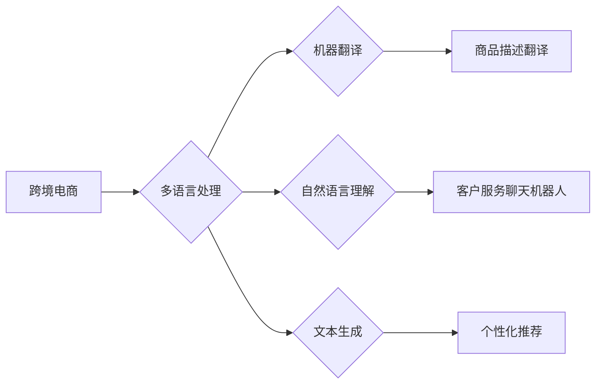

                 

## AI大模型在跨境电商中的多语言应用

> 关键词：AI大模型、跨境电商、多语言处理、机器翻译、自然语言理解、文本生成、客户服务、个性化推荐

## 1. 背景介绍

跨境电商的蓬勃发展为全球贸易带来了新的机遇，但也带来了新的挑战。其中，语言障碍是跨境电商发展面临的重大瓶颈之一。不同国家和地区的消费者使用不同的语言，这使得跨境电商平台难以与全球用户建立有效的沟通，从而限制了其发展潜力。

近年来，人工智能（AI）技术取得了长足的进步，特别是大语言模型（LLM）的出现，为跨境电商的多语言应用提供了新的解决方案。LLM 拥有强大的文本理解和生成能力，能够理解和生成多种语言的文本，为跨境电商平台提供多语言支持，打破语言壁垒，提升用户体验。

## 2. 核心概念与联系

### 2.1 跨境电商

跨境电商是指跨越国家或地区边界进行的电子商务交易。它涵盖了商品的跨境销售、采购、物流、支付等环节。

### 2.2 多语言处理

多语言处理（Multilingual Processing）是指处理多种语言的文本信息的技术。它包括机器翻译、自然语言理解、文本生成等多个子领域。

### 2.3 大语言模型

大语言模型（Large Language Model，LLM）是一种基于深度学习的强大人工智能模型，能够理解和生成人类语言。它通过训练大量的文本数据，学习语言的语法、语义和上下文关系，从而具备强大的文本处理能力。

**核心概念与联系流程图**



## 3. 核心算法原理 & 具体操作步骤

### 3.1 算法原理概述

LLM 的核心算法原理是基于 Transformer 架构的深度神经网络。Transformer 模型通过自注意力机制（Self-Attention）学习文本中的长距离依赖关系，能够捕捉文本的语义和上下文信息，从而实现更准确的文本理解和生成。

### 3.2 算法步骤详解

1. **数据预处理:** 将原始文本数据进行清洗、分词、标记等预处理操作，使其能够被模型理解。
2. **模型训练:** 使用大量的文本数据训练 Transformer 模型，通过反向传播算法优化模型参数，使其能够准确地理解和生成文本。
3. **模型评估:** 使用测试数据评估模型的性能，例如准确率、BLEU 分数等，并根据评估结果进行模型调优。
4. **模型部署:** 将训练好的模型部署到跨境电商平台，为用户提供多语言服务。

### 3.3 算法优缺点

**优点:**

* 强大的文本理解和生成能力
* 能够处理多种语言的文本
* 能够捕捉文本中的长距离依赖关系

**缺点:**

* 训练成本高
* 模型参数量大，需要大量的计算资源
* 容易受到训练数据质量的影响

### 3.4 算法应用领域

* 机器翻译
* 自然语言理解
* 文本生成
* 语音识别
* 聊天机器人

## 4. 数学模型和公式 & 详细讲解 & 举例说明

### 4.1 数学模型构建

LLM 的数学模型通常基于 Transformer 架构，其核心是自注意力机制。自注意力机制通过计算每个词与所有其他词之间的相关性，来捕捉文本中的长距离依赖关系。

### 4.2 公式推导过程

**自注意力机制的计算公式:**

$$
Attention(Q, K, V) = softmax(\frac{QK^T}{\sqrt{d_k}})V
$$

其中:

* $Q$：查询矩阵
* $K$：键矩阵
* $V$：值矩阵
* $d_k$：键向量的维度
* $softmax$：softmax 函数

### 4.3 案例分析与讲解

假设我们有一个句子 "The cat sat on the mat"，我们想要计算 "cat" 与其他词之间的注意力权重。

1. 将句子中的每个词转换为词向量，形成查询矩阵 $Q$、键矩阵 $K$ 和值矩阵 $V$。
2. 计算 $QK^T$，得到每个词与所有其他词之间的相关性得分。
3. 对相关性得分进行 softmax 操作，得到每个词与所有其他词之间的注意力权重。
4. 将注意力权重与值矩阵相乘，得到 "cat" 与其他词的加权平均值，即 "cat" 的上下文表示。

## 5. 项目实践：代码实例和详细解释说明

### 5.1 开发环境搭建

* Python 3.7+
* TensorFlow 或 PyTorch
* CUDA 和 cuDNN

### 5.2 源代码详细实现

```python
import tensorflow as tf

# 定义 Transformer 模型
class Transformer(tf.keras.Model):
    def __init__(self, vocab_size, embedding_dim, num_heads, num_layers):
        super(Transformer, self).__init__()
        self.embedding = tf.keras.layers.Embedding(vocab_size, embedding_dim)
        self.transformer_layers = tf.keras.layers.StackedRNNCells([
            tf.keras.layers.MultiHeadAttention(num_heads=num_heads, key_dim=embedding_dim)
            for _ in range(num_layers)
        ])

    def call(self, inputs):
        # Embedding
        embedded = self.embedding(inputs)
        # Transformer layers
        output = self.transformer_layers(embedded)
        return output

# 训练模型
model = Transformer(vocab_size=10000, embedding_dim=128, num_heads=8, num_layers=6)
model.compile(optimizer='adam', loss='mse')
model.fit(train_data, train_labels, epochs=10)

# 推理模型
predictions = model.predict(test_data)
```

### 5.3 代码解读与分析

* 代码定义了一个 Transformer 模型，包含嵌入层、多头注意力层和循环神经网络层。
* 模型使用 Adam 优化器和均方误差损失函数进行训练。
* 训练完成后，模型可以用于预测新的文本数据。

### 5.4 运行结果展示

* 模型的训练结果可以评估其性能，例如准确率、BLEU 分数等。
* 模型的预测结果可以展示其在多语言处理任务中的应用效果。

## 6. 实际应用场景

### 6.1 商品描述翻译

LLM 可以将商品描述自动翻译成不同语言，方便全球用户了解商品信息。

### 6.2 客户服务聊天机器人

LLM 可以训练一个多语言聊天机器人，为跨境电商平台的用户提供 24/7 的客户服务支持。

### 6.3 个性化推荐

LLM 可以分析用户的语言特征和购买历史，为用户提供个性化的商品推荐。

### 6.4 未来应用展望

* 更精准的机器翻译
* 更智能的客户服务聊天机器人
* 更个性化的商品推荐
* 多语言内容创作

## 7. 工具和资源推荐

### 7.1 学习资源推荐

* **书籍:**
    * "Speech and Language Processing" by Jurafsky and Martin
    * "Deep Learning" by Goodfellow, Bengio, and Courville
* **在线课程:**
    * Coursera: Natural Language Processing Specialization
    * edX: Artificial Intelligence

### 7.2 开发工具推荐

* **TensorFlow:** https://www.tensorflow.org/
* **PyTorch:** https://pytorch.org/
* **Hugging Face Transformers:** https://huggingface.co/transformers/

### 7.3 相关论文推荐

* "Attention Is All You Need" by Vaswani et al.
* "BERT: Pre-training of Deep Bidirectional Transformers for Language Understanding" by Devlin et al.

## 8. 总结：未来发展趋势与挑战

### 8.1 研究成果总结

LLM 在跨境电商的多语言应用领域取得了显著的成果，例如提高了机器翻译的准确率、增强了客户服务聊天机器人的智能化程度、提升了商品推荐的个性化程度。

### 8.2 未来发展趋势

* 模型规模和性能的进一步提升
* 多模态 LLMs 的发展，例如结合图像、音频等多模态信息
* 更广泛的应用场景，例如跨境电商物流、营销推广等

### 8.3 面临的挑战

* 训练成本高
* 模型参数量大，需要大量的计算资源
* 容易受到训练数据质量的影响
* 缺乏对不同语言文化背景的理解

### 8.4 研究展望

未来研究将重点关注降低 LLMs 的训练成本，提高模型的效率和鲁棒性，以及开发更适合跨境电商场景的 LLMs。

## 9. 附录：常见问题与解答

* **Q: LLMs 如何处理不同语言的语法和语义差异？**

* **A:** LLMs 通过训练大量的多语言文本数据，学习不同语言的语法和语义规则，从而能够处理不同语言的文本信息。

* **Q: LLMs 是否能够理解人类的情感和意图？**

* **A:** LLMs 能够识别文本中的情感倾向，但目前还无法完全理解人类的情感和意图。

* **Q: LLMs 的应用场景有哪些？**

* **A:** LLMs 的应用场景非常广泛，例如机器翻译、自然语言理解、文本生成、语音识别、聊天机器人等。


作者：禅与计算机程序设计艺术 / Zen and the Art of Computer Programming 
<end_of_turn>

