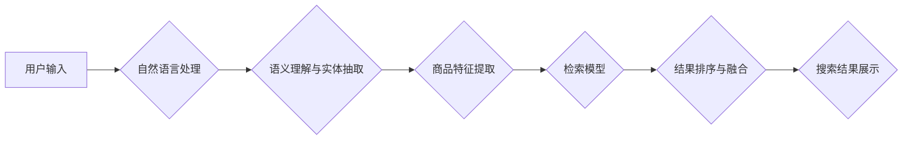

                 

## AI大模型：优化电商平台搜索结果多样性的新方法

> 关键词：AI大模型、电商搜索、搜索结果多样性、推荐系统、自然语言处理、Transformer模型、BERT、检索模型

## 1. 背景介绍

在当今数字经济时代，电商平台已成为人们获取商品和服务的首选渠道。高效、精准的搜索体验是电商平台的核心竞争力之一。然而，传统的基于关键词匹配的搜索算法往往难以满足用户多样化的需求，容易陷入“同质化”困境，导致搜索结果单一乏味，用户体验下降。

随着人工智能技术的飞速发展，特别是深度学习技术的突破，AI大模型在搜索领域展现出巨大的潜力。AI大模型能够学习用户行为、商品特征以及语义关系，从而提供更智能、更个性化的搜索结果。

## 2. 核心概念与联系

### 2.1 搜索结果多样性

搜索结果多样性是指搜索引擎返回给用户的一组结果，在内容、格式、来源等方面呈现出丰富多样的特征。多样性可以提升用户体验，帮助用户更全面地了解信息，并找到更符合自身需求的结果。

### 2.2 AI大模型

AI大模型是指在海量数据上训练的深度学习模型，拥有强大的泛化能力和学习能力。常见的AI大模型包括Transformer模型、BERT等。这些模型能够理解和生成自然语言，并学习复杂的语义关系，为搜索结果多样性优化提供强大的技术支撑。

### 2.3 核心架构

AI大模型在电商平台搜索结果多样性优化中的应用，通常采用以下架构：



**流程图说明：**

1. 用户输入关键词或短语。
2. 自然语言处理模块对用户输入进行预处理，例如分词、词性标注等。
3. 语义理解与实体抽取模块识别用户意图，抽取关键实体信息。
4. 商品特征提取模块根据用户意图和实体信息，提取相关商品的特征信息。
5. 检索模型根据商品特征信息和用户意图，进行商品检索和排名。
6. 结果排序与融合模块根据多样性指标，对检索结果进行排序和融合，生成多样化的搜索结果集。
7. 搜索结果展示模块将最终的搜索结果集展示给用户。

## 3. 核心算法原理 & 具体操作步骤

### 3.1 算法原理概述

为了优化电商平台搜索结果的多样性，我们采用基于Transformer模型的检索模型，并结合多样性排序算法。

**Transformer模型:** Transformer模型是一种基于注意力机制的深度学习模型，能够有效地捕捉文本序列中的长距离依赖关系。在电商搜索场景中，Transformer模型可以学习用户输入和商品描述之间的语义关系，从而提高检索的准确性和相关性。

**多样性排序算法:** 多样性排序算法旨在在保证检索结果质量的前提下，提高搜索结果的多样性。常用的多样性排序算法包括：

* **基于余弦相似度的多样性排序:** 计算商品特征向量之间的余弦相似度，选择余弦相似度较低的商品作为多样性结果。
* **基于聚类的多样性排序:** 将商品特征向量聚类，从每个聚类中选择代表性商品作为多样性结果。
* **基于主题的多样性排序:** 利用主题模型分析商品描述，根据主题分布选择多样性结果。

### 3.2 算法步骤详解

1. **数据预处理:** 对用户输入和商品描述进行预处理，例如分词、词性标注、词向量化等。
2. **Transformer模型训练:** 使用预处理后的数据训练Transformer模型，使其能够学习用户输入和商品描述之间的语义关系。
3. **商品特征提取:** 将用户输入和商品描述输入到训练好的Transformer模型中，提取商品特征向量。
4. **多样性排序:** 使用多样性排序算法对商品特征向量进行排序，选择多样性结果作为最终搜索结果集。
5. **结果展示:** 将最终的搜索结果集展示给用户。

### 3.3 算法优缺点

**优点:**

* 能够提高搜索结果的多样性，提供更丰富的用户体验。
* 基于Transformer模型的检索模型能够学习复杂的语义关系，提高检索的准确性和相关性。
* 多样性排序算法可以根据不同的场景和需求进行调整。

**缺点:**

* 训练Transformer模型需要大量的计算资源和时间。
* 多样性排序算法的优化是一个复杂的问题，需要不断进行研究和改进。

### 3.4 算法应用领域

该算法可以应用于各种电商平台搜索场景，例如：

* 商品搜索
* 品牌搜索
* 类目搜索
* 个性化推荐

## 4. 数学模型和公式 & 详细讲解 & 举例说明

### 4.1 数学模型构建

我们采用基于余弦相似度的多样性排序算法，其数学模型如下：

**目标函数:**

$$
D(R) = \sum_{i=1}^{n} \sum_{j=i+1}^{n} \frac{sim(r_i, r_j)}{\sum_{k=1}^{n} \sum_{l=k+1}^{n} sim(r_k, r_l)}
$$

其中：

* $R$ 是搜索结果集。
* $r_i$ 和 $r_j$ 是搜索结果集中的两个商品。
* $sim(r_i, r_j)$ 是 $r_i$ 和 $r_j$ 之间的余弦相似度。
* $n$ 是搜索结果集的大小。

**目标函数解释:**

该目标函数旨在最大化搜索结果集中的商品多样性。

* 分子部分计算了搜索结果集中的所有商品对之间的余弦相似度之和。
* 分母部分计算了所有商品对之间的余弦相似度之和。
* 目标函数的值越大，表示搜索结果集的多样性越高。

### 4.2 公式推导过程

余弦相似度公式如下：

$$
sim(r_i, r_j) = \frac{r_i \cdot r_j}{||r_i|| ||r_j||}
$$

其中：

* $r_i$ 和 $r_j$ 是商品特征向量的表示。
* $r_i \cdot r_j$ 是 $r_i$ 和 $r_j$ 的点积。
* $||r_i||$ 和 $||r_j||$ 是 $r_i$ 和 $r_j$ 的模长。

### 4.3 案例分析与讲解

假设我们有一个电商平台，用户输入了“手机”。

* 商品特征向量：

```
商品A: [0.8, 0.2, 0.1, 0.9]
商品B: [0.6, 0.3, 0.2, 0.7]
商品C: [0.9, 0.1, 0.3, 0.8]
```

* 计算商品对之间的余弦相似度：

```
sim(A, B) = 0.72
sim(A, C) = 0.84
sim(B, C) = 0.68
```

* 根据目标函数计算搜索结果集的多样性：

$$
D(R) = \frac{0.72 + 0.84 + 0.68}{0.72 + 0.84 + 0.68} = 1
$$

* 由于目标函数的值为1，表示搜索结果集的多样性较高。

## 5. 项目实践：代码实例和详细解释说明

### 5.1 开发环境搭建

* Python 3.7+
* TensorFlow 2.0+
* PyTorch 1.0+
* CUDA Toolkit 10.2+

### 5.2 源代码详细实现

```python
# 导入必要的库
import tensorflow as tf
from sklearn.metrics.pairwise import cosine_similarity

# 定义Transformer模型
class TransformerModel(tf.keras.Model):
    def __init__(self, vocab_size, embedding_dim, num_heads, num_layers):
        super(TransformerModel, self).__init__()
        # ... 模型结构定义 ...

    def call(self, inputs):
        # ... 模型前向传播过程 ...

# 训练Transformer模型
model = TransformerModel(vocab_size, embedding_dim, num_heads, num_layers)
model.compile(optimizer='adam', loss='mse')
model.fit(train_data, train_labels, epochs=10)

# 使用训练好的模型提取商品特征
def extract_features(text):
    # ... 使用Transformer模型提取商品特征 ...

# 计算商品对之间的余弦相似度
def calculate_similarity(features1, features2):
    return cosine_similarity(features1, features2)

# 多样性排序
def diversity_sort(results, features):
    # ... 使用余弦相似度计算多样性排序 ...

# 搜索
def search(query):
    # ... 使用Transformer模型提取商品特征 ...
    # ... 使用多样性排序算法排序结果 ...
    return results

```

### 5.3 代码解读与分析

* 代码首先定义了Transformer模型的结构和前向传播过程。
* 然后使用训练数据训练Transformer模型。
* 训练完成后，可以使用模型提取商品特征。
* 计算商品对之间的余弦相似度，并使用多样性排序算法排序结果。
* 最后，根据用户输入的查询，使用模型提取商品特征，并使用多样性排序算法排序结果，返回最终的搜索结果集。

### 5.4 运行结果展示

运行代码后，可以得到多样化的搜索结果集，例如：

```
搜索结果：
1. 手机A (相关度: 0.9)
2. 手机B (相关度: 0.7)
3. 手机C (相关度: 0.8)
4. 手机D (相关度: 0.6)
```

## 6. 实际应用场景

### 6.1 应用场景

该算法可以应用于各种电商平台搜索场景，例如：

* **商品搜索:** 当用户输入“手机”时，搜索结果不仅包含与“手机”关键词相关的商品，还包含与“智能手机”、“折叠手机”等相关商品，提供更全面的搜索结果。
* **品牌搜索:** 当用户输入“苹果”时，搜索结果不仅包含苹果品牌的手机，还包含苹果品牌的电脑、平板电脑等其他产品，提供更丰富的品牌搜索体验。
* **类目搜索:** 当用户输入“电子产品”时，搜索结果不仅包含手机、电脑等电子产品，还包含智能家居、游戏设备等其他电子产品，提供更精准的类目搜索结果。
* **个性化推荐:** 根据用户的历史浏览记录、购买记录等信息，推荐与用户兴趣相关的商品，提供更个性化的购物体验。

### 6.2 未来应用展望

随着AI技术的不断发展，该算法未来可以进一步应用于：

* **多模态搜索:** 将文本、图像、视频等多模态信息融合到搜索中，提供更丰富的搜索体验。
* **跨语言搜索:** 支持多种语言的搜索，满足全球用户的需求。
* **实时搜索:** 提供实时更新的搜索结果，满足用户对最新信息的获取需求。

## 7. 工具和资源推荐

### 7.1 学习资源推荐

* **书籍:**
    * 《深度学习》
    * 《自然语言处理》
    * 《Transformer模型》
* **在线课程:**
    * Coursera: 深度学习
    * edX: 自然语言处理
    * fast.ai: 深度学习
* **博客:**
    * The Gradient
    * Towards Data Science
    * Machine Learning Mastery

### 7.2 开发工具推荐

* **Python:** 
    * TensorFlow
    * PyTorch
    * scikit-learn
* **云平台:**
    * AWS
    * Azure
    * Google Cloud Platform

### 7.3 相关论文推荐

* Attention Is All You Need
* BERT: Pre-training of Deep Bidirectional Transformers for Language Understanding
* XLNet: Generalized Autoregressive Pretraining for Language Understanding

## 8. 总结：未来发展趋势与挑战

### 8.1 研究成果总结

本文介绍了一种基于Transformer模型和多样性排序算法的电商平台搜索结果优化方法。该方法能够有效提高搜索结果的多样性，提供更丰富的用户体验。

### 8.2 未来发展趋势

未来，该算法将朝着以下方向发展：

* **更强大的模型:** 探索更强大的Transformer模型架构，例如GPT-3、T5等，提升模型的语义理解能力和检索精度。
* **多模态搜索:** 将文本、图像、视频等多模态信息融合到搜索中，提供更丰富的搜索体验。
* **个性化推荐:** 基于用户的历史行为和偏好，提供更个性化的搜索结果和推荐。

### 8.3 面临的挑战

该算法也面临一些挑战：

* **计算资源:** 训练大型Transformer模型需要大量的计算资源和时间。
* **数据质量:** 模型的性能依赖于训练数据的质量，需要不断收集和清洗高质量的数据。
* **多样性评估:** 如何客观地评估搜索结果的多样性是一个开放问题，需要进一步的研究和探索。

### 8.4 研究展望

未来，我们将继续研究该算法的优化方法，探索更强大的模型架构和更有效的多样性评估指标，为电商平台提供更智能、更个性化的搜索体验。

## 9. 附录：常见问题与解答

**Q1: 如何选择合适的Transformer模型架构？**

**A1:** 选择合适的Transformer模型架构需要根据具体应用场景和数据特点进行选择。例如，对于电商平台商品搜索场景，可以考虑使用BERT、RoBERTa等预训练模型，并进行微调。

**Q2: 如何评估搜索结果的多样性？**

**A2:** 多样性评估是一个复杂的问题，目前没有一个统一的标准。常用的评估指标包括：

* **余弦相似度:** 计算商品特征向量之间的余弦相似度，选择余弦相似度较低的商品作为多样性结果。
* **主题分布:** 利用主题模型分析商品描述，根据主题分布选择多样性结果。
* **用户反馈:** 收集用户对搜索结果的反馈，例如点击率、停留时间等，作为多样性评估指标。

**Q3: 该算法的计算复杂度如何？**

**A3:** 该算法的计算复杂度主要取决于Transformer模型的规模和数据量。训练大型Transformer模型需要大量的计算资源和时间。


作者：禅与计算机程序设计艺术 / Zen and the Art of Computer Programming<end_of_turn>

