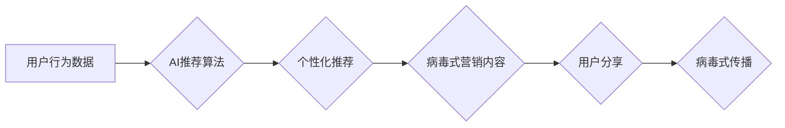

                 

## AI推荐在社交电商中的病毒式营销策略优化

> 关键词：AI推荐、社交电商、病毒式营销、推荐算法、深度学习、用户行为分析、个性化推荐

## 1. 背景介绍

社交电商已成为当今电子商务发展的重要趋势，其独特的社交属性为用户提供了更加便捷、个性化的购物体验。然而，在海量商品和用户面前，如何精准推荐商品，激发用户购买欲望，并实现病毒式传播，成为社交电商平台面临的重大挑战。

传统推荐算法主要依赖于用户历史行为和商品特征，但对于新用户和新商品，其推荐效果往往有限。而人工智能（AI）技术的快速发展为社交电商推荐提供了新的机遇。AI推荐算法能够通过深度学习等技术，挖掘用户行为背后的隐性需求，并根据用户画像、社交关系等多维度信息，提供更加精准、个性化的商品推荐，从而提升用户体验和转化率。

病毒式营销是指通过用户自发分享，快速传播信息的一种营销策略。在社交电商平台，病毒式营销可以有效提升品牌知名度和用户活跃度。然而，传统的病毒式营销策略往往难以精准触达目标用户，导致传播效果不佳。

## 2. 核心概念与联系

### 2.1  社交电商推荐

社交电商推荐是指在社交电商平台上，根据用户行为、社交关系、商品特征等多维度信息，为用户推荐合适的商品。

### 2.2  病毒式营销

病毒式营销是指通过用户自发分享，快速传播信息的一种营销策略。其核心在于创造具有传播力的内容，并通过社交网络平台进行传播。

### 2.3  AI推荐与病毒式营销的结合

将AI推荐与病毒式营销相结合，可以实现以下目标：

* **精准推荐病毒式内容:** AI推荐算法可以根据用户兴趣和行为，精准推荐具有传播潜力的商品和内容，提高病毒式营销的转化率。
* **个性化病毒式传播:** AI算法可以根据用户画像和社交关系，个性化定制病毒式营销内容，提高用户参与度和传播效果。
* **实时优化病毒式传播策略:** AI算法可以实时分析病毒式营销效果，并根据数据反馈进行策略优化，提升营销效率。

**Mermaid 流程图:**



## 3. 核心算法原理 & 具体操作步骤

### 3.1  算法原理概述

AI推荐在社交电商中的病毒式营销策略优化，主要基于以下核心算法原理：

* **深度学习:** 利用深度神经网络，从海量用户行为数据中学习用户兴趣和偏好，并预测用户对商品的潜在购买意愿。
* **图神经网络:** 挖掘用户之间的社交关系，构建用户关系图，并利用图神经网络算法，分析用户之间的影响力，预测商品的传播路径。
* **强化学习:** 通过奖励机制，训练AI模型，使其能够学习到最有效的病毒式营销策略，并不断优化传播效果。

### 3.2  算法步骤详解

1. **数据收集与预处理:** 收集用户行为数据、商品信息、社交关系数据等，并进行清洗、转换、特征提取等预处理工作。
2. **模型训练:** 利用深度学习、图神经网络等算法，训练AI推荐模型，并根据病毒式营销目标，设计相应的奖励机制。
3. **推荐策略优化:** 基于训练好的AI模型，制定个性化推荐策略，并根据用户反馈和传播效果，不断优化推荐策略。
4. **病毒式营销内容生成:** 根据推荐策略，生成具有传播潜力的商品推荐内容，并进行多渠道传播。
5. **传播效果监测与分析:** 实时监测病毒式营销效果，并利用数据分析工具，分析传播路径、用户参与度等指标，为后续策略优化提供依据。

### 3.3  算法优缺点

**优点:**

* **精准推荐:** AI算法能够根据用户多维度信息，精准推荐具有传播潜力的商品和内容。
* **个性化传播:** AI算法可以根据用户画像和社交关系，个性化定制病毒式营销内容，提高用户参与度和传播效果。
* **实时优化:** AI算法可以实时分析病毒式营销效果，并根据数据反馈进行策略优化，提升营销效率。

**缺点:**

* **数据依赖:** AI算法需要大量的数据进行训练，数据质量直接影响算法效果。
* **模型复杂:** AI模型的训练和部署需要一定的技术门槛。
* **伦理风险:** AI算法可能会存在偏见和歧视，需要进行伦理审查和风险控制。

### 3.4  算法应用领域

AI推荐在社交电商中的病毒式营销策略优化，可以应用于以下领域:

* **商品推荐:** 为用户推荐具有传播潜力的商品，提高商品销量和品牌知名度。
* **内容推荐:** 为用户推荐具有传播潜力的内容，提高用户参与度和平台活跃度。
* **广告投放:** 精准投放广告，提高广告转化率。
* **用户画像:** 建立用户画像，为用户提供更加个性化的服务。

## 4. 数学模型和公式 & 详细讲解 & 举例说明

### 4.1  数学模型构建

**用户兴趣预测模型:**

$$
p(u, i) = \sigma(W_u \cdot h_u + W_i \cdot h_i + b)
$$

其中:

* $p(u, i)$ 表示用户 $u$ 对商品 $i$ 的购买概率。
* $h_u$ 表示用户 $u$ 的隐向量表示。
* $h_i$ 表示商品 $i$ 的隐向量表示。
* $W_u$ 和 $W_i$ 是权重矩阵。
* $b$ 是偏置项。
* $\sigma$ 是激活函数，例如sigmoid函数。

**商品传播预测模型:**

$$
P(i \rightarrow j) = \alpha \cdot \frac{S(i, j)}{D(j)} + \beta \cdot \frac{C(i, j)}{N(j)}
$$

其中:

* $P(i \rightarrow j)$ 表示商品 $i$ 传播到用户 $j$ 的概率。
* $S(i, j)$ 表示商品 $i$ 和用户 $j$ 之间的社交关系强度。
* $D(j)$ 表示用户 $j$ 的社交圈大小。
* $C(i, j)$ 表示商品 $i$ 和用户 $j$ 之间的兴趣相似度。
* $N(j)$ 表示用户 $j$ 的好友数量。
* $\alpha$ 和 $\beta$ 是权重系数。

### 4.2  公式推导过程

**用户兴趣预测模型:**

该模型基于用户和商品的隐向量表示，通过线性组合和激活函数，预测用户对商品的购买概率。

**商品传播预测模型:**

该模型考虑了商品和用户之间的社交关系强度、兴趣相似度、社交圈大小等因素，预测商品传播到用户的概率。

### 4.3  案例分析与讲解

假设一个社交电商平台，用户 $A$ 和用户 $B$ 是好友，用户 $A$ 对商品 $X$ 感兴趣，而用户 $B$ 对商品 $X$ 并不感兴趣。根据商品传播预测模型，由于用户 $A$ 和用户 $B$ 之间存在社交关系，因此商品 $X$ 有可能通过用户 $A$ 的分享传播到用户 $B$。

## 5. 项目实践：代码实例和详细解释说明

### 5.1  开发环境搭建

* Python 3.7+
* TensorFlow 2.0+
* PyTorch 1.0+
* Jupyter Notebook

### 5.2  源代码详细实现

```python
# 用户兴趣预测模型
import tensorflow as tf

# 定义模型结构
model = tf.keras.Sequential([
    tf.keras.layers.Embedding(input_dim=vocab_size, output_dim=embedding_dim),
    tf.keras.layers.Dense(units=64, activation='relu'),
    tf.keras.layers.Dense(units=1, activation='sigmoid')
])

# 编译模型
model.compile(optimizer='adam', loss='binary_crossentropy', metrics=['accuracy'])

# 训练模型
model.fit(X_train, y_train, epochs=10, batch_size=32)

# 商品传播预测模型
import torch
import torch.nn as nn

# 定义模型结构
class PropagationModel(nn.Module):
    def __init__(self, embedding_dim):
        super(PropagationModel, self).__init__()
        self.embedding = nn.Embedding(num_embeddings=vocab_size, embedding_dim=embedding_dim)
        self.linear = nn.Linear(embedding_dim, 1)

    def forward(self, user_id, item_id):
        user_embedding = self.embedding(user_id)
        item_embedding = self.embedding(item_id)
        combined_embedding = user_embedding + item_embedding
        return self.linear(combined_embedding)

# 实例化模型
model = PropagationModel(embedding_dim=128)

# 训练模型
optimizer = torch.optim.Adam(model.parameters())
loss_fn = nn.BCEWithLogitsLoss()

for epoch in range(10):
    for user_id, item_id, target in data:
        # 前向传播
        output = model(user_id, item_id)
        loss = loss_fn(output, target)

        # 反向传播
        optimizer.zero_grad()
        loss.backward()
        optimizer.step()

```

### 5.3  代码解读与分析

* 用户兴趣预测模型使用TensorFlow框架，构建了一个简单的深度神经网络模型，通过训练预测用户对商品的购买概率。
* 商品传播预测模型使用PyTorch框架，构建了一个基于嵌入层的传播模型，预测商品传播到用户的概率。

### 5.4  运行结果展示

运行上述代码后，可以得到用户兴趣预测模型和商品传播预测模型的训练结果，包括准确率、损失函数值等指标。

## 6. 实际应用场景

### 6.1  案例分析

* **电商平台推荐:** 利用AI推荐算法，为用户推荐具有传播潜力的商品，提高商品销量和品牌知名度。
* **社交媒体营销:** 利用AI算法，精准推荐病毒式营销内容，提高用户参与度和传播效果。
* **内容平台推荐:** 利用AI算法，推荐具有传播潜力的内容，提高用户活跃度和平台流量。

### 6.2  未来应用展望

* **个性化病毒式营销:** 基于用户画像和行为分析，实现更加个性化的病毒式营销策略，提升营销效果。
* **跨平台病毒式传播:** 利用AI算法，实现跨平台的病毒式传播，扩大营销影响力。
* **AI驱动的病毒式内容创作:** 利用AI算法，辅助内容创作，生成具有传播潜力的内容。

## 7. 工具和资源推荐

### 7.1  学习资源推荐

* **书籍:**
    * 《深度学习》
    * 《推荐系统实践》
    * 《图神经网络》
* **在线课程:**
    * Coursera: 深度学习
    * Udacity: 机器学习工程师
    * fast.ai: 深度学习课程

### 7.2  开发工具推荐

* **TensorFlow:** 开源深度学习框架
* **PyTorch:** 开源深度学习框架
* **Scikit-learn:** 机器学习库
* **NetworkX:** 图算法库

### 7.3  相关论文推荐

* **Collaborative Filtering for Implicit Feedback Datasets**
* **Deep Learning for Recommender Systems**
* **Graph Convolutional Networks for Recommender Systems**

## 8. 总结：未来发展趋势与挑战

### 8.1  研究成果总结

AI推荐在社交电商中的病毒式营销策略优化，取得了显著的成果，能够精准推荐商品和内容，提高用户参与度和传播效果。

### 8.2  未来发展趋势

* **更精准的推荐:** 利用更先进的AI算法，例如强化学习和迁移学习，实现更加精准的推荐。
* **更个性化的营销:** 基于用户画像和行为分析，实现更加个性化的病毒式营销策略。
* **更智能的内容创作:** 利用AI算法，辅助内容创作，生成具有传播潜力的内容。

### 8.3  面临的挑战

* **数据质量:** AI算法需要大量的数据进行训练，数据质量直接影响算法效果。
* **模型复杂度:** AI模型的训练和部署需要一定的技术门槛。
* **伦理风险:** AI算法可能会存在偏见和歧视，需要进行伦理审查和风险控制。

### 8.4  研究展望

未来，AI推荐在社交电商中的病毒式营销策略优化，将继续朝着更精准、更个性化、更智能的方向发展。


## 9. 附录：常见问题与解答

**Q1: 如何评估AI推荐的病毒式营销效果？**

**A1:** 可以通过以下指标评估AI推荐的病毒式营销效果：

* **传播量:** 商品或内容的分享次数、转发次数等。
* **用户参与度:** 用户点赞、评论、收藏等行为。
* **转化率:** 用户通过分享或点击商品或内容，最终完成购买或其他目标行为的比例。

**Q2: 如何解决AI推荐算法中的数据偏差问题？**

**A2:** 可以通过以下方法解决AI推荐算法中的数据偏差问题：

* **数据清洗:** 剔除异常数据和噪声数据。
* **数据平衡:** 对数据进行采样或合成，平衡不同类别的数据分布。
* **公平性评估:** 使用公平性评估指标，评估算法是否存在偏见。

**Q3: 如何确保AI推荐算法的伦理安全？**

**A3:** 可以通过以下方法确保AI推荐算法的伦理安全：

* **透明度:** 明确算法的决策机制，并提供可解释性。
* **可控性:** 建立算法的控制机制，防止算法被滥用。
* **隐私保护:** 保护用户隐私数据，并获得用户的知情同意。


作者：禅与计算机程序设计艺术 / Zen and the Art of Computer Programming<end_of_turn>

