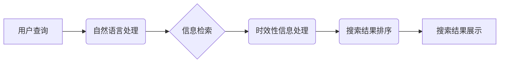

                 

## AI搜索引擎如何处理时效性信息

> 关键词：AI搜索引擎, 时效性信息, 信息检索, 自然语言处理, 机器学习, 知识图谱, 算法优化, 搜索结果排序

## 1. 背景介绍

在信息爆炸的时代，海量数据以惊人的速度涌现，人们对信息的获取和处理需求日益增长。传统的搜索引擎主要依靠关键词匹配和网页排名算法，在处理时效性信息方面存在一定的局限性。随着人工智能技术的快速发展，AI搜索引擎应运而生，其强大的信息处理能力和学习能力为解决时效性信息问题提供了新的思路和方法。

时效性信息是指其价值和相关性随着时间推移而变化的信息，例如新闻报道、实时数据、社交媒体动态等。处理时效性信息对于搜索引擎的准确性和用户体验至关重要。如果搜索引擎无法及时更新信息，则搜索结果可能过时，无法满足用户需求。

## 2. 核心概念与联系

**2.1 核心概念**

* **AI搜索引擎:** 基于人工智能技术的搜索引擎，能够理解用户意图，提供更精准、更个性化的搜索结果。
* **时效性信息:** 其价值和相关性随着时间推移而变化的信息。
* **信息检索:**  从海量数据中找到满足用户需求的信息的过程。
* **自然语言处理 (NLP):**  使计算机能够理解、处理和生成人类语言的技术。
* **机器学习 (ML):**  通过算法学习数据模式，提高系统性能的技术。
* **知识图谱 (KG):**  一种结构化的知识表示形式，将实体和关系组织成网络结构。

**2.2 架构关系**



**2.3 核心联系**

AI搜索引擎通过自然语言处理技术理解用户查询意图，然后利用信息检索算法从海量数据中找到相关信息。在处理时效性信息时，AI搜索引擎会结合机器学习算法和知识图谱技术，对信息的时效性进行评估和排序，最终呈现出最相关、最时效的搜索结果。

## 3. 核心算法原理 & 具体操作步骤

**3.1 算法原理概述**

处理时效性信息的核心算法主要包括：

* **时间加权算法:**  根据信息的发布时间赋予不同的权重，越新的信息权重越高。
* **趋势分析算法:**  通过分析信息发布频率和趋势，判断信息的时效性和重要性。
* **知识图谱关联分析:**  利用知识图谱中的实体和关系，识别和关联与时效性信息相关的其他信息。

**3.2 算法步骤详解**

1. **信息采集:**  从各种数据源收集时效性信息，例如新闻网站、社交媒体平台、实时数据流等。
2. **信息预处理:**  对收集到的信息进行清洗、格式化和结构化处理，例如去除噪声、提取关键词、构建实体关系等。
3. **时间加权:**  根据信息的发布时间赋予不同的权重，可以使用指数衰减函数或其他时间加权函数。
4. **趋势分析:**  利用机器学习算法分析信息发布频率和趋势，识别热点话题和重要事件。
5. **知识图谱关联:**  将时效性信息与知识图谱中的实体和关系进行关联，挖掘更深层次的语义信息。
6. **搜索结果排序:**  根据信息的时效性、相关性和重要性进行排序，呈现出最相关、最时效的搜索结果。

**3.3 算法优缺点**

* **优点:**  能够有效处理时效性信息，提供更精准、更及时搜索结果。
* **缺点:**  算法复杂度较高，需要大量的计算资源和数据支持。

**3.4 算法应用领域**

* **新闻搜索:**  提供最新的新闻报道和事件信息。
* **实时数据查询:**  查询股票价格、天气预报、交通状况等实时数据。
* **社交媒体分析:**  分析社交媒体平台上的热点话题和用户情绪。

## 4. 数学模型和公式 & 详细讲解 & 举例说明

**4.1 数学模型构建**

假设我们有一个时效性信息集合 $D = \{d_1, d_2, ..., d_n\}$, 其中每个信息 $d_i$ 包含时间戳 $t_i$ 和相关性得分 $s_i$. 

我们的目标是根据信息的时效性和相关性，对信息进行排序，并返回前 $k$ 个结果。

**4.2 公式推导过程**

我们可以使用以下公式来计算信息的综合得分 $score_i$:

$$score_i = w_t * f(t_i) + w_s * s_i$$

其中:

* $w_t$ 和 $w_s$ 分别是时间权重和相关性权重，满足 $w_t + w_s = 1$。
* $f(t_i)$ 是时间加权函数，例如指数衰减函数:

$$f(t_i) = e^{- \lambda * (t_i - t_c)}$$

其中 $\lambda$ 是衰减系数， $t_c$ 是当前时间。

**4.3 案例分析与讲解**

假设我们有一个新闻搜索引擎，需要返回前 10 条最新的新闻。

* $w_t = 0.7$, $w_s = 0.3$
* $\lambda = 0.1$, $t_c$ 是当前时间

对于每个新闻 $d_i$, 我们计算其综合得分 $score_i$，并根据得分进行排序。

## 5. 项目实践：代码实例和详细解释说明

**5.1 开发环境搭建**

* Python 3.x
* TensorFlow 或 PyTorch
* NLTK 或 SpaCy
* Elasticsearch 或 Solr

**5.2 源代码详细实现**

```python
import nltk
from nltk.corpus import stopwords
from sklearn.feature_extraction.text import TfidfVectorizer
from sklearn.metrics.pairwise import cosine_similarity

# 数据预处理
def preprocess_text(text):
    # 移除停用词、标点符号等
    text = text.lower()
    tokens = nltk.word_tokenize(text)
    stop_words = set(stopwords.words('english'))
    tokens = [word for word in tokens if word not in stop_words]
    return ' '.join(tokens)

# 信息检索
def search_engine(query, documents):
    # 使用 TF-IDF 向量化
    vectorizer = TfidfVectorizer()
    document_vectors = vectorizer.fit_transform(documents)
    query_vector = vectorizer.transform([query])

    # 计算余弦相似度
    similarities = cosine_similarity(query_vector, document_vectors)
    
    # 返回相似度最高的文档
    sorted_indices = similarities.argsort()[0][::-1]
    return [documents[i] for i in sorted_indices]

# 时效性信息处理
def calculate_time_weight(timestamp, current_time):
    # 使用指数衰减函数
    decay_factor = 0.9
    time_weight = decay_factor ** ((current_time - timestamp) / (24 * 60 * 60))
    return time_weight

# 综合得分计算
def calculate_score(document, query, current_time):
    # 计算相关性得分
    relevance_score = search_engine(query, [document])[0]

    # 计算时间权重
    time_weight = calculate_time_weight(document['timestamp'], current_time)

    # 计算综合得分
    score = relevance_score * 0.7 + time_weight * 0.3
    return score

# 搜索结果排序
def sort_results(results, query, current_time):
    # 计算每个文档的综合得分
    scored_results = [(calculate_score(result, query, current_time), result) for result in results]

    # 根据得分排序
    sorted_results = sorted(scored_results, reverse=True)
    return [result for _, result in sorted_results]

```

**5.3 代码解读与分析**

* 数据预处理部分使用 NLTK 库对文本进行分词、停用词移除等操作，以提取关键信息。
* 信息检索部分使用 TF-IDF 向量化和余弦相似度计算文档与查询的相似度。
* 时效性信息处理部分使用指数衰减函数计算信息的时效性权重。
* 综合得分计算部分将相关性得分和时间权重进行加权平均，得到每个文档的综合得分。
* 搜索结果排序部分根据综合得分对结果进行排序，返回前 $k$ 个结果。

**5.4 运行结果展示**

通过运行上述代码，可以实现对时效性信息的搜索和排序。

## 6. 实际应用场景

**6.1 新闻搜索**

AI搜索引擎可以根据用户查询的关键词，从海量新闻数据中快速检索出最新的新闻报道，并根据时间权重和相关性得分进行排序，呈现出最相关、最时效的新闻结果。

**6.2 实时数据查询**

AI搜索引擎可以查询股票价格、天气预报、交通状况等实时数据，并根据时间戳进行排序，提供最新的信息。

**6.3 社交媒体分析**

AI搜索引擎可以分析社交媒体平台上的热点话题和用户情绪，并根据时间趋势进行分析，帮助企业了解用户需求和舆情变化。

**6.4 未来应用展望**

随着人工智能技术的不断发展，AI搜索引擎在处理时效性信息方面将会有更突破性的进展。例如：

* **个性化搜索:**  根据用户的历史搜索记录和偏好，提供更个性化的时效性信息搜索结果。
* **多模态搜索:**  支持文本、图像、音频等多模态数据的搜索，提供更丰富的时效性信息体验。
* **预见性搜索:**  利用机器学习算法预测未来可能发生的事件，并提供相关时效性信息。

## 7. 工具和资源推荐

**7.1 学习资源推荐**

* **书籍:**
    * 《深度学习》
    * 《自然语言处理》
    * 《信息检索》
* **在线课程:**
    * Coursera: 自然语言处理
    * edX: 深度学习
    * Udacity: 机器学习工程师

**7.2 开发工具推荐**

* **Python:**  人工智能开发的常用语言
* **TensorFlow:**  开源深度学习框架
* **PyTorch:**  开源深度学习框架
* **NLTK:**  自然语言处理工具包
* **SpaCy:**  自然语言处理工具包
* **Elasticsearch:**  搜索引擎和数据分析平台
* **Solr:**  开源搜索引擎平台

**7.3 相关论文推荐**

* **BERT: Pre-training of Deep Bidirectional Transformers for Language Understanding**
* **Attention Is All You Need**
* **A Survey of Transfer Learning**

## 8. 总结：未来发展趋势与挑战

**8.1 研究成果总结**

AI搜索引擎在处理时效性信息方面取得了显著的进展，例如时间加权算法、趋势分析算法和知识图谱关联分析等。这些算法能够有效提高搜索结果的时效性和相关性。

**8.2 未来发展趋势**

* **个性化搜索:**  AI搜索引擎将更加注重用户的个性化需求，提供更精准、更符合用户偏好的时效性信息搜索结果。
* **多模态搜索:**  AI搜索引擎将支持文本、图像、音频等多模态数据的搜索，提供更丰富的时效性信息体验。
* **预见性搜索:**  AI搜索引擎将利用机器学习算法预测未来可能发生的事件，并提供相关时效性信息。

**8.3 面临的挑战**

* **数据质量:**  AI搜索引擎的性能依赖于高质量的数据，而时效性信息的质量往往难以保证。
* **算法复杂度:**  处理时效性信息的算法往往比较复杂，需要大量的计算资源和数据支持。
* **伦理问题:**  AI搜索引擎在处理时效性信息时，需要考虑伦理问题，例如信息准确性、隐私保护等。

**8.4 研究展望**

未来，AI搜索引擎在处理时效性信息方面将继续发展，并应用于更广泛的领域。研究者将继续探索新的算法和技术，以提高搜索结果的准确性、时效性和个性化程度。


## 9. 附录：常见问题与解答

**9.1 如何评估AI搜索引擎的时效性？**

可以使用以下指标来评估AI搜索引擎的时效性：

* **平均信息年龄:**  计算搜索结果中信息的平均发布时间。
* **最新信息覆盖率:**  计算搜索结果中最新信息的比例。
* **用户满意度:**  通过用户反馈和调查来评估用户对搜索结果时效性的满意度。

**9.2 如何处理时效性信息中的噪声和虚假信息？**

可以使用以下方法来处理时效性信息中的噪声和虚假信息：

* **数据清洗:**  在数据采集阶段进行数据清洗，去除无效信息和重复信息。
* **信息验证:**  利用知识图谱和外部数据源进行信息验证，识别虚假信息。
* **用户反馈:**  鼓励用户对搜索结果进行反馈，并根据反馈进行改进。


作者：禅与计算机程序设计艺术 / Zen and the Art of Computer Programming 
<end_of_turn>

