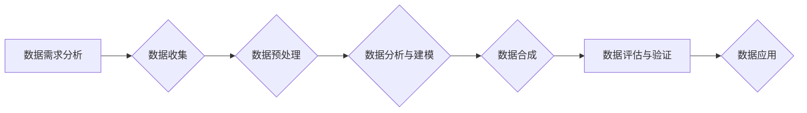

                 

## AI数据集构建：从收集到合成数据生成

> 关键词：AI数据集、数据收集、数据标注、数据合成、数据增强、迁移学习、深度学习、数据质量

### 1. 背景介绍

在人工智能（AI）领域，数据是至关重要的资源。深度学习模型的性能直接取决于训练数据的质量和数量。然而，高质量的训练数据往往稀缺、昂贵且难以获取。因此，构建高质量的AI数据集成为了AI发展面临的一大挑战。

传统的AI数据集构建方法主要依赖于人工收集和标注，这不仅耗时耗力，而且容易引入人为错误。随着AI技术的快速发展，数据合成技术逐渐成为构建高质量AI数据集的新兴方法。数据合成技术通过算法生成模拟真实数据的样本，可以有效解决数据稀缺、标注成本高和数据隐私等问题。

### 2. 核心概念与联系

数据合成技术旨在通过算法生成与真实数据相似的样本，从而扩展现有数据集，提高模型泛化能力。

**数据合成流程:**



**核心概念:**

* **数据需求分析:** 明确数据合成目标，例如需要生成哪些类型的样本，样本数量、质量等要求。
* **数据收集:** 收集与目标数据相关的真实数据，作为合成模型的训练数据。
* **数据预处理:** 对收集到的数据进行清洗、转换、格式化等处理，使其适合用于数据合成模型的训练。
* **数据分析与建模:** 分析数据特征，选择合适的合成模型，并进行模型训练。
* **数据合成:** 利用训练好的模型生成模拟真实数据的样本。
* **数据评估与验证:** 对合成数据进行评估，验证其质量和真实性，并根据评估结果进行模型调整。
* **数据应用:** 将合成数据应用于目标任务，例如训练AI模型、进行数据分析等。

### 3. 核心算法原理 & 具体操作步骤

#### 3.1 算法原理概述

数据合成算法主要分为以下几类：

* **基于统计模型的合成:** 利用统计模型，例如高斯分布、贝叶斯网络等，根据真实数据的统计特征生成新的样本。
* **基于机器学习的合成:** 利用机器学习模型，例如生成对抗网络（GAN）、变分自编码器（VAE）等，学习真实数据的分布，并生成新的样本。
* **基于规则的合成:** 基于对特定领域知识的理解，制定规则生成符合特定模式的样本。

#### 3.2 算法步骤详解

以基于生成对抗网络（GAN）的数据合成为例，详细介绍其算法步骤：

1. **构建生成器网络:** 生成器网络负责根据随机噪声生成新的样本。
2. **构建判别器网络:** 判别器网络负责判断样本是否为真实数据或合成数据。
3. **训练生成器网络:** 将随机噪声输入生成器网络，生成新的样本，并将样本与真实数据一起输入判别器网络。判别器网络输出判断结果，生成器网络根据判别器的反馈调整参数，生成更逼真的样本。
4. **训练判别器网络:** 将真实数据和生成器生成的样本输入判别器网络，判别器网络根据样本特征判断其真实性，并根据判断结果调整参数，提高判别能力。
5. **重复步骤3和4:** 持续训练生成器和判别器网络，直到生成器能够生成与真实数据几乎 indistinguishable 的样本。

#### 3.3 算法优缺点

**优点:**

* 可以生成大量高质量的样本，有效解决数据稀缺问题。
* 可以生成特定类型的样本，例如特定特征、特定场景的样本，满足特定应用需求。
* 可以保护真实数据的隐私，避免数据泄露风险。

**缺点:**

* 数据合成算法的训练过程复杂，需要大量的计算资源和时间。
* 合成数据可能存在与真实数据不完全一致的偏差，需要进行仔细评估和验证。
* 对于某些复杂的数据类型，例如文本、图像等，数据合成算法的性能可能有限。

#### 3.4 算法应用领域

数据合成技术在多个领域都有广泛的应用，例如：

* **医疗保健:** 生成模拟患者数据，用于训练疾病诊断模型、药物研发等。
* **金融:** 生成模拟交易数据，用于训练欺诈检测模型、风险评估模型等。
* **自动驾驶:** 生成模拟驾驶场景数据，用于训练自动驾驶模型。
* **教育:** 生成模拟学生数据，用于个性化学习、教育评估等。

### 4. 数学模型和公式 & 详细讲解 & 举例说明

#### 4.1 数学模型构建

数据合成模型通常基于概率模型，例如高斯分布、贝叶斯网络等。

**高斯分布:**

高斯分布是一种常用的概率分布模型，其概率密度函数为：

$$
p(x) = \frac{1}{\sigma\sqrt{2\pi}}e^{-\frac{(x-\mu)^2}{2\sigma^2}}
$$

其中，$\mu$ 为均值，$\sigma$ 为标准差。

**贝叶斯网络:**

贝叶斯网络是一种概率图模型，用于表示变量之间的依赖关系。

#### 4.2 公式推导过程

数据合成模型的训练过程通常涉及到最大似然估计（MLE）或变分推断（VI）等优化算法。

**最大似然估计 (MLE):**

MLE 是一种常用的参数估计方法，其目标是找到使得观测数据最有可能出现的参数值。

**变分推断 (VI):**

VI 是一种近似推断方法，其目标是找到一个与真实后验分布最接近的近似分布。

#### 4.3 案例分析与讲解

以生成图像为例，可以使用 GAN 模型进行数据合成。

GAN 模型由生成器网络和判别器网络组成。生成器网络从随机噪声中生成图像，判别器网络判断图像是否为真实图像。

训练过程中，生成器网络不断生成新的图像，判别器网络不断学习识别真实图像和合成图像。最终，生成器网络能够生成与真实图像几乎 indistinguishable 的图像。

### 5. 项目实践：代码实例和详细解释说明

#### 5.1 开发环境搭建

* Python 3.x
* TensorFlow 或 PyTorch 深度学习框架
* Jupyter Notebook 或 VS Code 代码编辑器

#### 5.2 源代码详细实现

以下是一个使用 TensorFlow 实现 GAN 模型生成图像的简单代码示例：

```python
import tensorflow as tf

# 定义生成器网络
def generator(z):
  # ...

# 定义判别器网络
def discriminator(x):
  # ...

# 定义损失函数
def loss_function(real_output, fake_output):
  # ...

# 定义优化器
optimizer = tf.keras.optimizers.Adam(learning_rate=0.0002)

# 训练循环
for epoch in range(num_epochs):
  # ...
```

#### 5.3 代码解读与分析

* 生成器网络和判别器网络的结构可以根据具体应用场景进行调整。
* 损失函数通常使用二分类交叉熵损失函数。
* 优化器通常使用 Adam 优化器。

#### 5.4 运行结果展示

训练完成后，可以使用生成器网络生成新的图像样本。

### 6. 实际应用场景

#### 6.1 数据增强

数据增强技术可以利用数据合成技术生成新的样本，从而扩大训练数据集的规模，提高模型的泛化能力。

#### 6.2 隐私保护

数据合成技术可以生成模拟真实数据的样本，从而保护真实数据的隐私，避免数据泄露风险。

#### 6.3 数据模拟

数据合成技术可以生成特定类型的样本，例如特定特征、特定场景的样本，满足特定应用需求。

#### 6.4 未来应用展望

随着人工智能技术的不断发展，数据合成技术将发挥越来越重要的作用。未来，数据合成技术将应用于更广泛的领域，例如：

* **虚拟现实和增强现实:** 生成虚拟场景和虚拟人物。
* **机器人学习:** 生成模拟环境数据，用于训练机器人控制算法。
* **科学研究:** 生成模拟实验数据，用于加速科学发现。

### 7. 工具和资源推荐

#### 7.1 学习资源推荐

* **书籍:**

    * "Generative Deep Learning" by David Foster
    * "Deep Learning" by Ian Goodfellow, Yoshua Bengio, and Aaron Courville

* **在线课程:**

    * Coursera: "Generative Adversarial Networks" by DeepLearning.AI
    * Udacity: "Deep Learning Nanodegree"

#### 7.2 开发工具推荐

* **TensorFlow:** https://www.tensorflow.org/
* **PyTorch:** https://pytorch.org/
* **Keras:** https://keras.io/

#### 7.3 相关论文推荐

* "Generative Adversarial Networks" by Ian Goodfellow et al. (2014)
* "Improved Techniques for Training GANs" by Alec Radford et al. (2015)
* "Wasserstein GAN" by Martin Arjovsky et al. (2017)

### 8. 总结：未来发展趋势与挑战

#### 8.1 研究成果总结

数据合成技术在构建高质量AI数据集方面取得了显著进展，为AI发展提供了新的思路和方法。

#### 8.2 未来发展趋势

未来，数据合成技术将朝着以下方向发展：

* **更强大的合成模型:** 开发更强大的数据合成模型，能够生成更逼真的、更复杂的样本。
* **更灵活的数据合成方法:** 开发更灵活的数据合成方法，能够适应不同类型的数据和应用场景。
* **更智能的数据合成系统:** 开发更智能的数据合成系统，能够自动学习数据特征，并生成符合特定需求的样本。

#### 8.3 面临的挑战

数据合成技术还面临着一些挑战：

* **数据质量问题:** 合成数据可能存在与真实数据不完全一致的偏差，需要进行仔细评估和验证。
* **计算资源需求:** 数据合成模型的训练过程需要大量的计算资源和时间。
* **伦理问题:** 数据合成技术可能被用于生成虚假信息，需要考虑其伦理问题。

#### 8.4 研究展望

未来，数据合成技术将继续发展，并应用于更广泛的领域。

### 9. 附录：常见问题与解答

* **Q: 数据合成技术与数据标注技术相比，有哪些优势？**

* **A:** 数据合成技术可以生成大量高质量的样本，有效解决数据稀缺问题，而数据标注技术则需要人工标注，耗时耗力且容易引入人为错误。

* **Q: 数据合成技术有哪些局限性？**

* **A:** 数据合成技术可能存在与真实数据不完全一致的偏差，需要进行仔细评估和验证。此外，数据合成模型的训练过程需要大量的计算资源和时间。

* **Q: 如何评估合成数据的质量？**

* **A:** 可以使用多种方法评估合成数据的质量，例如与真实数据进行比较、使用机器学习模型对合成数据进行分类等。

* **Q: 数据合成技术有哪些应用场景？**

* **A:** 数据合成技术可以应用于多个领域，例如医疗保健、金融、自动驾驶等。

作者：禅与计算机程序设计艺术 / Zen and the Art of Computer Programming


<end_of_turn>

