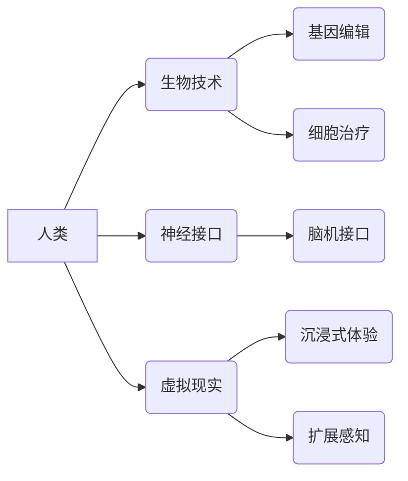

                 

## AI时代的人类增强：道德、隐私和安全挑战

> 关键词：人工智能、人类增强、伦理、隐私、安全、生物技术、神经接口

### 1. 背景介绍

人工智能（AI）技术近年来发展迅速，其应用领域不断拓展，从自动驾驶到医疗诊断，再到个性化教育，AI正在深刻地改变着我们的生活。而人类增强，作为AI技术的延伸，旨在通过技术手段提升人类的认知能力、物理能力和寿命，从而实现人类潜力的最大化。

人类增强技术涵盖了多个领域，包括：

* **生物技术增强:** 通过基因编辑、细胞治疗等技术，增强人类的生理机能，例如提高免疫力、延缓衰老、治疗疾病。
* **神经接口增强:** 通过脑机接口等技术，连接人类大脑与外部设备，实现脑电信号的读取和控制，从而增强人类的认知能力、感知能力和行动能力。
* **虚拟现实增强:** 通过虚拟现实技术，创造沉浸式的虚拟环境，为人类提供新的学习、娱乐和社交体验，从而扩展人类的感知和认知边界。

人类增强技术蕴含着巨大的潜力，但也面临着诸多挑战，其中道德、隐私和安全问题最为突出。

### 2. 核心概念与联系

**2.1 人类增强概念图**



**2.2 核心概念联系**

* **人类:**  人类是人类增强技术的最终目标，通过技术手段提升人类的各种能力。
* **生物技术:**  利用生物学原理和技术，对人类的生理机能进行改造和提升。
* **神经接口:**  连接人类大脑与外部设备，实现脑电信号的读取和控制，从而增强人类的认知能力和行动能力。
* **虚拟现实:**  通过虚拟环境，为人类提供新的学习、娱乐和社交体验，从而扩展人类的感知和认知边界。

**2.3 核心概念关系**

* **人类增强与生物技术:** 生物技术是人类增强的重要手段之一，通过基因编辑、细胞治疗等技术，可以增强人类的免疫力、延缓衰老、治疗疾病等。
* **人类增强与神经接口:** 神经接口可以连接人类大脑与外部设备，实现脑电信号的读取和控制，从而增强人类的认知能力、感知能力和行动能力。
* **人类增强与虚拟现实:** 虚拟现实可以为人类提供沉浸式的虚拟环境，从而扩展人类的感知和认知边界，并为人类提供新的学习、娱乐和社交体验。

### 3. 核心算法原理 & 具体操作步骤

**3.1 算法原理概述**

人类增强技术涉及到多种算法，例如机器学习、深度学习、自然语言处理等。这些算法可以帮助我们分析和理解人类的行为、认知和生理数据，从而开发出更有效的增强技术。

**3.2 算法步骤详解**

* **数据收集:** 收集人类的行为、认知和生理数据，例如脑电信号、眼动数据、生理指标等。
* **数据预处理:** 对收集到的数据进行清洗、转换和特征提取，以便于算法训练和应用。
* **模型训练:** 利用机器学习、深度学习等算法，对预处理后的数据进行训练，建立起能够预测和控制人类行为、认知和生理状态的模型。
* **模型评估:** 对训练好的模型进行评估，测试其准确性和有效性。
* **模型应用:** 将训练好的模型应用于实际场景，例如开发脑机接口设备、虚拟现实体验等。

**3.3 算法优缺点**

* **优点:** 

    * 可以实现对人类能力的精准提升。
    * 可以开发出个性化的增强方案，满足不同用户的需求。
    * 可以推动人类社会的发展，解决一些人类面临的挑战。

* **缺点:** 

    * 需要大量的训练数据，数据收集和处理成本较高。
    * 算法的复杂性较高，需要专业的技术人员进行开发和维护。
    * 存在一定的伦理风险，需要谨慎对待。

**3.4 算法应用领域**

* **医疗保健:** 辅助诊断疾病、治疗神经退行性疾病、增强康复效果。
* **教育:** 个性化学习、提升认知能力、增强记忆力。
* **娱乐:** 沉浸式游戏体验、虚拟社交。
* **军事:** 增强士兵的作战能力、提高决策效率。

### 4. 数学模型和公式 & 详细讲解 & 举例说明

**4.1 数学模型构建**

人类增强技术涉及到多个数学模型，例如神经网络模型、强化学习模型、贝叶斯网络模型等。这些模型可以帮助我们模拟和预测人类的行为、认知和生理状态。

**4.2 公式推导过程**

例如，神经网络模型的训练过程可以利用梯度下降算法进行优化，其核心公式如下：

$$
\theta = \theta - \alpha \nabla J(\theta)
$$

其中：

* $\theta$ 是神经网络模型的参数。
* $\alpha$ 是学习率。
* $\nabla J(\theta)$ 是损失函数 $J(\theta)$ 对参数 $\theta$ 的梯度。

**4.3 案例分析与讲解**

例如，在脑机接口领域，可以使用神经网络模型来识别用户的意图，并控制外部设备。

假设用户想控制一个机械臂，可以通过脑电信号来表达自己的意图。我们可以使用神经网络模型来学习用户的脑电信号与机械臂动作之间的映射关系。

当用户想让机械臂向前移动时，其脑电信号会呈现出特定的模式。神经网络模型可以识别出这个模式，并将其映射到机械臂向前移动的动作指令。

### 5. 项目实践：代码实例和详细解释说明

**5.1 开发环境搭建**

* 操作系统: Ubuntu 20.04
* 编程语言: Python 3.8
* 深度学习框架: TensorFlow 2.0
* 其他工具: Jupyter Notebook, Git

**5.2 源代码详细实现**

```python
import tensorflow as tf

# 定义神经网络模型
model = tf.keras.models.Sequential([
    tf.keras.layers.Dense(128, activation='relu', input_shape=(100,)),
    tf.keras.layers.Dense(64, activation='relu'),
    tf.keras.layers.Dense(1, activation='sigmoid')
])

# 编译模型
model.compile(optimizer='adam',
              loss='binary_crossentropy',
              metrics=['accuracy'])

# 训练模型
model.fit(x_train, y_train, epochs=10)

# 评估模型
loss, accuracy = model.evaluate(x_test, y_test)
print('Loss:', loss)
print('Accuracy:', accuracy)
```

**5.3 代码解读与分析**

* 该代码示例展示了如何使用 TensorFlow 框架构建一个简单的深度学习模型。
* 模型结构包括三个全连接层，第一层输入维度为 100，最后一层输出维度为 1，用于二分类任务。
* 使用 Adam 优化器、二分类交叉熵损失函数和准确率作为评估指标。
* 模型训练了 10 个 epochs，并使用测试集评估模型性能。

**5.4 运行结果展示**

运行结果会显示训练过程中的损失值和准确率，以及测试集上的损失值和准确率。

### 6. 实际应用场景

**6.1 医疗保健**

* **疾病诊断:** 利用 AI 算法分析患者的医疗影像、基因数据等，辅助医生诊断疾病。
* **个性化治疗:** 根据患者的基因信息、生活习惯等，制定个性化的治疗方案。
* **远程医疗:** 利用 AI 算法实现远程医疗诊断和咨询，提高医疗服务的可及性。

**6.2 教育**

* **个性化学习:** 根据学生的学习进度和能力，提供个性化的学习内容和教学方式。
* **智能辅导:** 利用 AI 算法为学生提供智能辅导，帮助学生解决学习难题。
* **虚拟实验室:** 利用虚拟现实技术构建虚拟实验室，为学生提供安全、便捷的实验环境。

**6.3 娱乐**

* **沉浸式游戏体验:** 利用虚拟现实技术为玩家提供更加沉浸式的游戏体验。
* **个性化内容推荐:** 利用 AI 算法分析用户的兴趣爱好，推荐个性化的娱乐内容。
* **虚拟社交:** 利用虚拟现实技术构建虚拟社交平台，为用户提供新的社交体验。

**6.4 未来应用展望**

* **人类增强能力:** 通过神经接口技术，增强人类的认知能力、感知能力和行动能力。
* **人类寿命延长:** 通过生物技术手段，延缓人类衰老，延长人类寿命。
* **人类与人工智能的融合:** 人工智能与人类的融合，创造出新的智能形态。

### 7. 工具和资源推荐

**7.1 学习资源推荐**

* **书籍:**

    * 《深度学习》 by Ian Goodfellow, Yoshua Bengio, and Aaron Courville
    * 《人工智能：现代方法》 by Stuart Russell and Peter Norvig

* **在线课程:**

    * Coursera: Machine Learning by Andrew Ng
    * edX: Artificial Intelligence by Columbia University

**7.2 开发工具推荐**

* **编程语言:** Python
* **深度学习框架:** TensorFlow, PyTorch
* **数据可视化工具:** Matplotlib, Seaborn

**7.3 相关论文推荐**

* **AlphaGo论文:** Mastering the game of Go with deep neural networks and tree search
* **GPT-3论文:** Language Models are Few-Shot Learners

### 8. 总结：未来发展趋势与挑战

**8.1 研究成果总结**

人类增强技术取得了显著的进展，在医疗保健、教育、娱乐等领域展现出巨大的潜力。

**8.2 未来发展趋势**

* **算法更智能:** 发展更智能的 AI 算法，例如强化学习、迁移学习等，实现更精准、更有效的增强。
* **技术更融合:** 人工智能、生物技术、虚拟现实等技术更加融合，实现更全面的增强。
* **应用更广泛:** 人类增强技术应用领域更加广泛，例如工业生产、交通运输等。

**8.3 面临的挑战**

* **伦理挑战:** 人类增强技术可能带来伦理问题，例如公平性、隐私性、安全性和责任问题。
* **安全挑战:** 人类增强技术可能存在安全风险，例如被恶意利用、数据泄露等。
* **社会挑战:** 人类增强技术可能导致社会不平等加剧、就业结构变化等社会问题。

**8.4 研究展望**

未来，我们需要加强对人类增强技术的伦理、安全和社会影响的评估和研究，制定相应的政策和规范，确保人类增强技术安全、可持续地发展，造福人类社会。

### 9. 附录：常见问题与解答

**9.1 人类增强技术会取代人类吗？**

人类增强技术旨在提升人类的能力，而不是取代人类。AI 是一种工具，可以帮助人类更好地完成工作，提高生活质量。

**9.2 人类增强技术对隐私有什么影响？**

人类增强技术可能会收集和使用大量的个人数据，因此需要加强隐私保护措施，确保个人数据的安全和合法使用。

**9.3 人类增强技术对社会公平有什么影响？**

人类增强技术可能导致社会不平等加剧，需要制定相应的政策和措施，确保所有人都能够平等地享受人类增强技术的带来的益处。


作者：禅与计算机程序设计艺术 / Zen and the Art of Computer Programming 
<end_of_turn>

