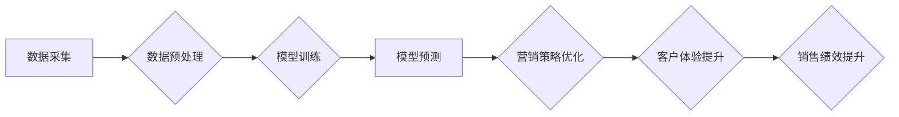

                 

## AI时尚品牌营销解决方案：利用AI技术提升品牌营销效果、客户参与度和销售绩效

> 关键词：人工智能、时尚品牌、营销解决方案、客户参与度、销售绩效、个性化推荐、内容创作、数据分析、预测模型

### 1. 背景介绍

在当今数字化时代，时尚行业面临着前所未有的机遇和挑战。消费者越来越依赖线上平台获取信息和进行购物，同时对个性化体验和互动式内容的需求也日益增长。传统营销模式难以满足这些新兴需求，时尚品牌迫切需要寻求新的解决方案来提升营销效果、增强客户参与度和提高销售绩效。

人工智能（AI）作为一种颠覆性的技术，正在深刻地改变着各个行业的运作模式，时尚行业也不例外。AI技术能够分析海量数据，识别消费者的需求和偏好，并提供精准的个性化推荐和定制化服务。

### 2. 核心概念与联系

**2.1 核心概念**

* **人工智能（AI）：** 能够模拟人类智能行为的计算机系统，例如学习、推理、决策和解决问题。
* **机器学习（ML）：** 一种AI子领域，通过算法从数据中学习，不断改进其性能。
* **深度学习（DL）：** 一种更高级的机器学习方法，利用多层神经网络模拟人类大脑的结构和功能。
* **自然语言处理（NLP）：** 能够理解和处理人类语言的AI技术，例如文本分析、机器翻译和对话系统。
* **计算机视觉（CV）：** 能够识别、理解和解释图像和视频的AI技术，例如图像分类、物体检测和人脸识别。

**2.2 架构图**



**2.3 联系**

AI技术可以与时尚品牌营销各个环节相结合，形成一个完整的营销解决方案。

* **数据采集:** 收集客户的购买记录、浏览历史、社交媒体互动等数据。
* **数据预处理:** 对收集到的数据进行清洗、转换和特征提取。
* **模型训练:** 利用机器学习算法训练模型，例如个性化推荐模型、内容创作模型、客户画像模型等。
* **模型预测:** 利用训练好的模型对客户进行预测，例如预测客户的购买意愿、喜欢的产品风格等。
* **营销策略优化:** 根据模型预测结果，优化营销策略，例如推荐个性化产品、推送精准广告、策划互动式活动等。
* **客户体验提升:** 提供个性化推荐、定制化服务和互动式体验，提升客户满意度和忠诚度。
* **销售绩效提升:** 通过精准营销和客户体验提升，最终提升销售业绩。

### 3. 核心算法原理 & 具体操作步骤

**3.1 算法原理概述**

本解决方案主要基于以下核心算法：

* **协同过滤算法:** 通过分析用户之间的行为相似性，推荐用户可能感兴趣的产品。
* **内容基元模型:** 通过分析产品属性和用户偏好，推荐与用户兴趣相符的产品。
* **深度神经网络:** 用于图像识别、文本分析和自然语言生成等任务，例如自动生成时尚穿搭建议、识别流行趋势等。

**3.2 算法步骤详解**

* **协同过滤算法:**
    1. 收集用户对产品的评分或购买记录数据。
    2. 计算用户之间的相似度，例如基于物品相似度或基于用户相似度。
    3. 对于某个用户，根据与该用户相似度高的用户对产品的评分或购买记录，预测该用户对产品的评分或购买意愿。
* **内容基元模型:**
    1. 将产品属性和用户偏好转换为数值向量。
    2. 利用机器学习算法训练模型，学习产品属性和用户偏好之间的关系。
    3. 根据用户的偏好向量，预测用户可能感兴趣的产品。
* **深度神经网络:**
    1. 构建深度神经网络模型，例如卷积神经网络（CNN）用于图像识别，循环神经网络（RNN）用于文本分析。
    2. 利用大规模数据训练模型，使其能够识别图像中的时尚元素、理解文本中的时尚信息等。
    3. 利用训练好的模型进行预测，例如自动生成时尚穿搭建议、识别流行趋势等。

**3.3 算法优缺点**

* **协同过滤算法:**
    * 优点: 可以发现用户之间的隐性关系，推荐个性化产品。
    * 缺点: 数据稀疏性问题，新用户或新产品难以推荐。
* **内容基元模型:**
    * 优点: 不依赖于用户行为数据，可以推荐新产品。
    * 缺点: 需要大量的产品属性数据，难以捕捉用户之间的复杂关系。
* **深度神经网络:**
    * 优点: 可以处理复杂的数据，学习更深层次的特征。
    * 缺点: 需要大量的训练数据，训练时间长，解释性较差。

**3.4 算法应用领域**

* **个性化推荐:** 推荐用户可能感兴趣的时尚产品。
* **内容创作:** 自动生成时尚穿搭建议、撰写时尚文章等。
* **客户画像:** 分析客户的消费习惯和偏好，构建客户画像。
* **市场趋势预测:** 识别流行趋势，预测未来市场需求。

### 4. 数学模型和公式 & 详细讲解 & 举例说明

**4.1 数学模型构建**

协同过滤算法的数学模型可以表示为以下公式：

$$
r_{ui} = \mu + b_u + b_i + \epsilon_{ui}
$$

其中：

* $r_{ui}$ 表示用户 $u$ 对物品 $i$ 的评分。
* $\mu$ 表示全局平均评分。
* $b_u$ 表示用户 $u$ 的偏差。
* $b_i$ 表示物品 $i$ 的偏差。
* $\epsilon_{ui}$ 表示评分误差。

**4.2 公式推导过程**

该公式基于以下假设：

* 用户对物品的评分受到用户自身偏好、物品本身属性和随机误差的影响。
* 用户和物品的偏差可以用来修正全局平均评分，提高预测精度。

通过最小化评分误差的平方和，可以训练模型并得到用户和物品的偏差值。

**4.3 案例分析与讲解**

假设有一个用户对服装评分的数据集，其中包含用户对不同服装的评分。我们可以使用协同过滤算法训练模型，预测用户对未评分的服装的评分。

例如，如果用户 $u$ 对服装 $i$ 的评分为 4，而用户 $v$ 对服装 $i$ 的评分为 5，并且用户 $u$ 和用户 $v$ 在其他服装的评分上也表现出相似性，那么我们可以推测用户 $u$ 对服装 $i$ 的评分可能也接近 5。

### 5. 项目实践：代码实例和详细解释说明

**5.1 开发环境搭建**

本项目使用 Python 语言进行开发，需要安装以下软件包：

* NumPy
* Pandas
* Scikit-learn
* TensorFlow 或 PyTorch

**5.2 源代码详细实现**

```python
# 导入必要的库
import numpy as np
from sklearn.metrics.pairwise import cosine_similarity

# 加载数据
data = pd.read_csv('fashion_data.csv')

# 计算用户之间的相似度
user_similarity = cosine_similarity(data.pivot_table(index='user_id', columns='product_id', values='rating').fillna(0))

# 预测用户对某个产品的评分
def predict_rating(user_id, product_id):
  # 获取用户与其他用户的相似度
  similar_users = np.argsort(user_similarity[user_id])[::-1][1:]
  # 计算预测评分
  predicted_rating = np.average([data.loc[data['user_id'] == user, 'rating'].mean() for user in similar_users])
  return predicted_rating

# 运行示例
user_id = 1
product_id = 10
predicted_rating = predict_rating(user_id, product_id)
print(f'用户 {user_id} 对产品 {product_id} 的预测评分为: {predicted_rating}')
```

**5.3 代码解读与分析**

该代码首先加载用户对产品的评分数据，然后使用余弦相似度计算用户之间的相似度。

预测用户对某个产品的评分时，首先获取与该用户相似度高的用户，然后计算这些用户对该产品的平均评分，作为预测评分。

**5.4 运行结果展示**

运行该代码后，会输出用户对特定产品的预测评分。

### 6. 实际应用场景

**6.1 个性化推荐系统**

AI技术可以帮助时尚品牌构建个性化推荐系统，根据用户的购买历史、浏览记录和偏好，推荐他们可能感兴趣的产品。例如，电商平台可以利用协同过滤算法推荐用户可能喜欢的服装、鞋子或配饰。

**6.2 内容创作辅助工具**

AI技术可以辅助时尚品牌创作内容，例如自动生成时尚穿搭建议、撰写时尚文章、设计时尚海报等。例如，时尚杂志可以利用深度神经网络分析流行趋势，自动生成最新的时尚穿搭建议。

**6.3 客户服务机器人**

AI技术可以帮助时尚品牌构建客户服务机器人，例如通过聊天机器人回答客户的常见问题、提供产品信息和售后服务。例如，服装品牌可以利用自然语言处理技术构建聊天机器人，帮助客户选择合适的服装、解决购物问题等。

**6.4 市场趋势预测**

AI技术可以帮助时尚品牌预测市场趋势，例如识别流行趋势、分析消费者偏好、预测未来市场需求等。例如，服装品牌可以利用深度学习算法分析社交媒体数据，预测未来流行的服装款式和颜色。

**6.5 未来应用展望**

随着AI技术的不断发展，其在时尚品牌营销领域的应用将更加广泛和深入。例如：

* **虚拟试衣间:** 利用计算机视觉技术，让用户在虚拟环境中试穿服装，体验不同的搭配效果。
* **个性化定制:** 利用AI技术，根据用户的体型、喜好和风格，定制专属的服装。
* **智能营销:** 利用AI技术，精准地推送广告和促销信息，提高营销效果。
* **沉浸式购物体验:** 利用AR/VR技术，为用户提供更加沉浸式的购物体验。

### 7. 工具和资源推荐

**7.1 学习资源推荐**

* **在线课程:** Coursera、edX、Udacity 等平台提供丰富的AI课程。
* **书籍:** 《深度学习》、《机器学习实战》等书籍。
* **博客和论坛:** Kaggle、Towards Data Science 等平台提供大量的AI技术文章和讨论。

**7.2 开发工具推荐**

* **Python:** 广泛应用于AI开发，拥有丰富的库和工具。
* **TensorFlow:** Google开发的开源深度学习框架。
* **PyTorch:** Facebook开发的开源深度学习框架。
* **Scikit-learn:** Python机器学习库。

**7.3 相关论文推荐**

* **Attention Is All You Need:** https://arxiv.org/abs/1706.03762
* **Generative Adversarial Networks:** https://arxiv.org/abs/1406.2661
* **Deep Learning for Recommender Systems:** https://arxiv.org/abs/1901.08011

### 8. 总结：未来发展趋势与挑战

**8.1 研究成果总结**

AI技术在时尚品牌营销领域的应用取得了显著成果，例如个性化推荐、内容创作辅助、客户服务机器人等。

**8.2 未来发展趋势**

* **更精准的个性化推荐:** 利用更先进的算法和数据分析技术，提供更精准的个性化推荐。
* **更智能的营销策略:** 利用AI技术自动分析市场趋势和消费者偏好，制定更智能的营销策略。
* **更沉浸式的购物体验:** 利用AR/VR技术，为用户提供更沉浸式的购物体验。

**8.3 面临的挑战**

* **数据隐私和安全:** AI技术需要大量数据进行训练，如何保护用户数据隐私和安全是一个重要的挑战。
* **算法解释性和可信度:** 许多AI算法是黑箱模型，难以解释其决策过程，这可能会影响用户的信任度。
* **技术成本和人才短缺:** 构建和维护AI系统需要高昂的技术成本和专业人才，这对中小企业来说是一个挑战。

**8.4 研究展望**

未来，AI技术在时尚品牌营销领域的应用将更加广泛和深入，需要进一步研究以下问题:

* 如何开发更透明、可解释的AI算法。
* 如何更好地利用多模态数据，例如图像、文本和视频，进行更精准的分析和推荐。
* 如何将AI技术与其他新兴技术，例如区块链和物联网，结合起来，构建更智能的营销生态系统。

### 9. 附录：常见问题与解答

**9.1 如何选择合适的AI算法？**

选择合适的AI算法取决于具体的应用场景和数据特点。例如，协同过滤算法适用于推荐系统，深度神经网络适用于图像识别和文本分析。

**9.2 如何保证AI系统的公平性和公正性？**

AI系统的公平性和公正性需要在算法设计和数据训练阶段进行考虑。例如，需要避免使用带有偏见的数据，并对算法进行公平性评估。

**9.3 如何应对AI技术的伦理挑战？**

AI技术的伦理挑战需要社会各界共同探讨和解决。例如，需要制定相关的法律法规，规范AI技术的应用，并加强对AI技术的监督和管理。


作者：禅与计算机程序设计艺术 / Zen and the Art of Computer Programming 
<end_of_turn>

