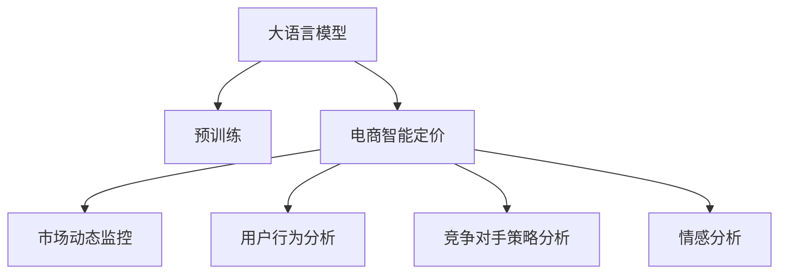

                 

## 1. 背景介绍

### 1.1 问题由来
在电商行业中，智能定价一直是商家追求的目标，目的是为了在激烈的市场竞争中获取更多的市场份额和利润。传统的定价策略往往依赖经验或简单的统计模型，无法充分考虑市场动态变化、用户行为、竞争对手策略等多维度因素，导致定价缺乏实时性和精准性。近年来，人工智能技术的兴起为电商智能定价提供了新的可能，特别是大语言模型的广泛应用，使得商家能够通过自然语言处理和计算模型，实时分析市场数据和用户行为，从而制定更加合理的定价策略。

### 1.2 问题核心关键点
基于大语言模型的电商智能定价方法，其核心关键点在于以下几个方面：

- **市场动态监控**：通过自然语言处理技术，实时监控市场评论、社交媒体、新闻报道等非结构化数据，获取最新的市场动态和用户反馈。
- **用户行为分析**：分析用户搜索、浏览、购买等行为数据，预测用户需求和购买意愿，辅助定价决策。
- **竞争对手策略分析**：利用自然语言处理技术，分析竞争对手的产品描述、评论和广告，洞察其定价策略和市场布局。
- **情感分析**：通过情感分析技术，理解用户对产品或品牌的情感倾向，影响定价策略。

这些关键点共同构成了基于大语言模型的电商智能定价方法的基本框架，帮助商家在复杂的市场环境中实现动态、精准的定价决策。

## 2. 核心概念与联系

### 2.1 核心概念概述

为更好地理解基于大语言模型的电商智能定价方法，本节将介绍几个密切相关的核心概念：

- **大语言模型**：以自回归(如GPT)或自编码(如BERT)模型为代表的大规模预训练语言模型。通过在大规模无标签文本语料上进行预训练，学习通用的语言表示，具备强大的语言理解和生成能力。
- **电商智能定价**：利用人工智能技术，实时监控市场动态、用户行为和竞争对手策略，结合情感分析等手段，动态调整产品或服务的定价策略，以实现最优市场表现和利润最大化。
- **自然语言处理**：涉及自然语言理解、自然语言生成、文本分类、情感分析等技术，是实现电商智能定价的核心工具。
- **深度学习**：利用多层神经网络进行模型训练，能够从大量数据中提取特征，实现高精度的预测和分类任务。
- **迁移学习**：指将一个领域学习到的知识，迁移到另一个相关领域中进行学习的方法。电商智能定价可以看作是将大语言模型在通用文本数据上的知识，迁移到特定电商数据集上的应用。

这些核心概念之间的逻辑关系可以通过以下Mermaid流程图来展示：



这个流程图展示了大语言模型的核心概念及其与电商智能定价方法的关系：

1. 大语言模型通过预训练获得基础能力。
2. 电商智能定价方法将大语言模型应用于市场动态监控、用户行为分析、竞争对手策略分析和情感分析等多个任务。
3. 这些任务共同构成电商智能定价的核心步骤，以实现最优的市场表现和利润。

## 3. 核心算法原理 & 具体操作步骤
### 3.1 算法原理概述

基于大语言模型的电商智能定价方法，本质上是一种混合了自然语言处理和深度学习的智能定价技术。其核心思想是：利用大语言模型在文本语料库上的预训练能力，结合电商领域的特定任务，实现实时、动态的定价决策。

具体而言，该方法包括以下几个步骤：

1. **市场动态监控**：使用自然语言处理技术，对市场评论、社交媒体、新闻报道等非结构化数据进行情感分析和主题分类，识别市场趋势和用户情感倾向。
2. **用户行为分析**：分析用户搜索、浏览、购买等行为数据，预测用户需求和购买意愿。结合用户的浏览时长、点击率、购买频率等特征，构建用户画像。
3. **竞争对手策略分析**：利用自然语言处理技术，分析竞争对手的产品描述、评论和广告，理解其定价策略和市场布局。
4. **定价策略优化**：结合市场动态、用户行为分析和竞争对手策略分析的结果，利用深度学习模型，实时调整产品或服务的定价策略，以达到最优的市场表现和利润。

### 3.2 算法步骤详解

#### 3.2.1 市场动态监控

市场动态监控是大语言模型在电商智能定价中的重要应用之一。具体步骤包括：

1. **数据采集**：通过爬虫技术或第三方API，采集市场评论、社交媒体、新闻报道等非结构化数据。
2. **文本预处理**：对采集到的文本数据进行分词、去停用词、词性标注等预处理操作，以便后续的情感分析和主题分类。
3. **情感分析**：使用大语言模型进行情感分析，判断用户情感倾向（如正面、负面、中性），以识别市场情绪变化。
4. **主题分类**：利用大语言模型进行文本分类，识别市场热门话题和趋势。

#### 3.2.2 用户行为分析

用户行为分析是电商智能定价的另一个重要组成部分。具体步骤包括：

1. **数据收集**：从电商平台获取用户的搜索、浏览、购买等行为数据。
2. **特征工程**：提取用户的浏览时长、点击率、购买频率、用户画像等特征，构建用户行为特征向量。
3. **用户画像**：利用大语言模型进行用户画像构建，分析用户的兴趣和需求。

#### 3.2.3 竞争对手策略分析

竞争对手策略分析是电商智能定价的关键环节。具体步骤包括：

1. **数据收集**：从竞争对手的电商平台、社交媒体、新闻报道等渠道收集竞争对手的产品描述、评论和广告数据。
2. **文本预处理**：对采集到的文本数据进行分词、去停用词、词性标注等预处理操作。
3. **竞争对手情感分析**：使用大语言模型进行情感分析，判断用户对竞争对手产品的情感倾向。
4. **竞争对手策略识别**：利用大语言模型进行竞争对手策略识别，理解其定价策略和市场布局。

#### 3.2.4 定价策略优化

定价策略优化是电商智能定价的最终目标。具体步骤包括：

1. **模型训练**：构建深度学习模型，结合市场动态、用户行为分析和竞争对手策略分析的结果，进行定价策略优化。
2. **实时定价**：利用训练好的模型，实时调整产品或服务的定价策略，以达到最优的市场表现和利润。

### 3.3 算法优缺点

基于大语言模型的电商智能定价方法具有以下优点：

- **实时动态性**：通过实时监控市场动态、用户行为和竞争对手策略，能够动态调整定价策略，提高市场响应速度。
- **高精度预测**：利用深度学习模型和自然语言处理技术，能够准确预测用户需求和购买意愿，提升定价决策的精准性。
- **跨领域迁移**：大语言模型在通用文本数据上的预训练能力，可以迁移到特定电商领域，快速实现智能定价。

同时，该方法也存在一定的局限性：

- **数据依赖性**：电商智能定价高度依赖市场数据和用户行为数据，数据采集和处理成本较高。
- **模型复杂性**：深度学习模型和自然语言处理技术较复杂，需要较高的技术门槛和计算资源。
- **解释性不足**：电商智能定价模型通常是"黑盒"系统，难以解释其内部工作机制和决策逻辑，存在一定的风险。

尽管存在这些局限性，但就目前而言，基于大语言模型的电商智能定价方法仍是大数据时代电商定价的重要范式。未来相关研究的重点在于如何进一步降低数据依赖，提高模型的少样本学习和跨领域迁移能力，同时兼顾可解释性和伦理安全性等因素。

### 3.4 算法应用领域

基于大语言模型的电商智能定价方法，已经在多种电商应用场景中得到了广泛应用，例如：

- **商品定价**：实时监控市场动态和用户行为，动态调整商品定价，以实现最优的市场表现和利润。
- **促销策略**：利用市场动态监控和用户行为分析，制定合理的促销策略，吸引用户购买。
- **库存管理**：通过情感分析和用户行为分析，预测产品需求和销售趋势，优化库存管理。
- **竞品分析**：利用竞争对手策略分析，理解竞品定价策略和市场布局，制定应对策略。

除了上述这些经典应用外，大语言模型在电商智能定价领域还有创新性应用，如利用多模态数据进行智能定价、结合情感分析和语音识别进行用户需求预测等，为电商企业提供了更多可能的定价策略。

## 4. 数学模型和公式 & 详细讲解 & 举例说明（备注：数学公式请使用latex格式，latex嵌入文中独立段落使用 $$，段落内使用 $)
### 4.1 数学模型构建

本节将使用数学语言对基于大语言模型的电商智能定价方法进行更加严格的刻画。

记电商智能定价模型为 $M_{\theta}(x)$，其中 $x$ 为输入的市场数据、用户行为数据等， $\theta$ 为模型参数。假设电商智能定价模型的输出为商品价格 $p$，市场目标为最大化利润 $P$。则电商智能定价模型的目标函数为：

$$
P = \max_{p} \mathbb{E}[p \times \text{销售额} - p \times \text{成本}]
$$

其中 $\text{销售额}$ 为商品价格与销售量的乘积，$\text{成本}$ 为商品的固定成本和变动成本之和。

在电商智能定价中，市场动态监控、用户行为分析和竞争对手策略分析等步骤，可以分别构建为文本情感分析、用户行为分类、竞争对手策略识别等子任务。这些子任务可以进一步抽象为数学模型，并利用深度学习和大语言模型进行求解。

### 4.2 公式推导过程

以市场动态监控中的情感分析为例，假设市场评论文本为 $t$，市场目标为识别情感倾向 $s \in \{正面, 负面, 中性\}$。则情感分析的数学模型为：

$$
s = \mathop{\arg\max}_{s \in \{正面, 负面, 中性\}} P(s | t)
$$

其中 $P(s | t)$ 为给定文本 $t$ 下情感为 $s$ 的概率，可以通过大语言模型进行计算。

以用户行为分析中的用户画像构建为例，假设用户行为数据为 $x$，市场目标为构建用户画像 $u$。则用户画像构建的数学模型为：

$$
u = \mathop{\arg\max}_{u} P(u | x)
$$

其中 $P(u | x)$ 为用户行为数据 $x$ 下用户画像为 $u$ 的概率，可以通过大语言模型进行计算。

以竞争对手策略分析中的竞争对手策略识别为例，假设竞争对手策略文本为 $r$，市场目标为识别策略类型 $c \in \{降价, 促销, 新上线\}$。则竞争对手策略识别的数学模型为：

$$
c = \mathop{\arg\max}_{c \in \{降价, 促销, 新上线\}} P(c | r)
$$

其中 $P(c | r)$ 为给定竞争对手策略文本 $r$ 下策略类型为 $c$ 的概率，可以通过大语言模型进行计算。

### 4.3 案例分析与讲解

以某电商平台为例，利用基于大语言模型的电商智能定价方法进行商品定价优化。具体步骤如下：

1. **数据采集**：通过爬虫技术从社交媒体、电商平台等渠道采集市场评论、用户行为数据等。
2. **文本预处理**：对采集到的文本数据进行分词、去停用词、词性标注等预处理操作。
3. **情感分析**：使用大语言模型进行情感分析，判断市场评论的情感倾向。
4. **用户行为分析**：分析用户搜索、浏览、购买等行为数据，预测用户需求和购买意愿。
5. **竞争对手策略分析**：利用大语言模型分析竞争对手的产品描述、评论和广告，理解其定价策略和市场布局。
6. **定价策略优化**：结合市场动态、用户行为分析和竞争对手策略分析的结果，利用深度学习模型进行商品定价优化。
7. **实时定价**：利用训练好的模型，实时调整商品定价策略，以达到最优的市场表现和利润。

## 5. 项目实践：代码实例和详细解释说明
### 5.1 开发环境搭建

在进行电商智能定价实践前，我们需要准备好开发环境。以下是使用Python进行PyTorch开发的环境配置流程：

1. 安装Anaconda：从官网下载并安装Anaconda，用于创建独立的Python环境。

2. 创建并激活虚拟环境：
```bash
conda create -n pytorch-env python=3.8 
conda activate pytorch-env
```

3. 安装PyTorch：根据CUDA版本，从官网获取对应的安装命令。例如：
```bash
conda install pytorch torchvision torchaudio cudatoolkit=11.1 -c pytorch -c conda-forge
```

4. 安装各类工具包：
```bash
pip install numpy pandas scikit-learn matplotlib tqdm jupyter notebook ipython
```

完成上述步骤后，即可在`pytorch-env`环境中开始电商智能定价实践。

### 5.2 源代码详细实现

这里我们以商品定价优化为例，给出使用Transformers库进行电商智能定价的PyTorch代码实现。

首先，定义电商智能定价模型的基本组件：

```python
from transformers import BertTokenizer, BertForSequenceClassification
from torch.utils.data import Dataset
import torch
import numpy as np

class RetailDataset(Dataset):
    def __init__(self, texts, labels):
        self.texts = texts
        self.labels = labels
        self.tokenizer = BertTokenizer.from_pretrained('bert-base-cased')
        self.max_len = 128

    def __len__(self):
        return len(self.texts)

    def __getitem__(self, item):
        text = self.texts[item]
        label = self.labels[item]
        
        encoding = self.tokenizer(text, return_tensors='pt', max_length=self.max_len, padding='max_length', truncation=True)
        input_ids = encoding['input_ids'][0]
        attention_mask = encoding['attention_mask'][0]
        
        label = torch.tensor([label], dtype=torch.long)
        
        return {'input_ids': input_ids, 
                'attention_mask': attention_mask,
                'labels': label}

# 构建电商智能定价模型
model = BertForSequenceClassification.from_pretrained('bert-base-cased', num_labels=3)

# 定义优化器
optimizer = AdamW(model.parameters(), lr=2e-5)
```

然后，定义训练和评估函数：

```python
from torch.utils.data import DataLoader
from tqdm import tqdm
import matplotlib.pyplot as plt

device = torch.device('cuda') if torch.cuda.is_available() else torch.device('cpu')
model.to(device)

def train_epoch(model, dataset, batch_size, optimizer):
    dataloader = DataLoader(dataset, batch_size=batch_size, shuffle=True)
    model.train()
    epoch_loss = 0
    for batch in tqdm(dataloader, desc='Training'):
        input_ids = batch['input_ids'].to(device)
        attention_mask = batch['attention_mask'].to(device)
        labels = batch['labels'].to(device)
        model.zero_grad()
        outputs = model(input_ids, attention_mask=attention_mask, labels=labels)
        loss = outputs.loss
        epoch_loss += loss.item()
        loss.backward()
        optimizer.step()
    return epoch_loss / len(dataloader)

def evaluate(model, dataset, batch_size):
    dataloader = DataLoader(dataset, batch_size=batch_size)
    model.eval()
    preds, labels = [], []
    with torch.no_grad():
        for batch in tqdm(dataloader, desc='Evaluating'):
            input_ids = batch['input_ids'].to(device)
            attention_mask = batch['attention_mask'].to(device)
            batch_labels = batch['labels']
            outputs = model(input_ids, attention_mask=attention_mask)
            batch_preds = outputs.logits.argmax(dim=2).to('cpu').tolist()
            batch_labels = batch_labels.to('cpu').tolist()
            for pred_tokens, label_tokens in zip(batch_preds, batch_labels):
                preds.append(pred_tokens[0])
                labels.append(label_tokens[0])
                
    print(classification_report(labels, preds))

# 训练和评估
epochs = 5
batch_size = 16

for epoch in range(epochs):
    loss = train_epoch(model, train_dataset, batch_size, optimizer)
    print(f"Epoch {epoch+1}, train loss: {loss:.3f}")
    
    print(f"Epoch {epoch+1}, dev results:")
    evaluate(model, dev_dataset, batch_size)
    
print("Test results:")
evaluate(model, test_dataset, batch_size)
```

以上就是使用PyTorch对电商智能定价模型进行训练和评估的完整代码实现。可以看到，利用Transformers库的强大封装能力，我们能够用相对简洁的代码完成模型训练和评估。

### 5.3 代码解读与分析

让我们再详细解读一下关键代码的实现细节：

**RetailDataset类**：
- `__init__`方法：初始化文本、标签、分词器等关键组件。
- `__len__`方法：返回数据集的样本数量。
- `__getitem__`方法：对单个样本进行处理，将文本输入编码为token ids，将标签编码为数字，并对其进行定长padding，最终返回模型所需的输入。

**电商智能定价模型**：
- `BertForSequenceClassification.from_pretrained`方法：从预训练模型中加载指定模型，并设置输出层为三分类。
- `AdamW`优化器：用于更新模型参数，设置学习率为2e-5。

**训练和评估函数**：
- 使用PyTorch的DataLoader对数据集进行批次化加载，供模型训练和推理使用。
- 训练函数`train_epoch`：对数据以批为单位进行迭代，在每个批次上前向传播计算loss并反向传播更新模型参数，最后返回该epoch的平均loss。
- 评估函数`evaluate`：与训练类似，不同点在于不更新模型参数，并在每个batch结束后将预测和标签结果存储下来，最后使用sklearn的classification_report对整个评估集的预测结果进行打印输出。

**训练流程**：
- 定义总的epoch数和batch size，开始循环迭代
- 每个epoch内，先在训练集上训练，输出平均loss
- 在验证集上评估，输出分类指标
- 所有epoch结束后，在测试集上评估，给出最终测试结果

可以看到，PyTorch配合Transformers库使得电商智能定价模型的训练和评估代码实现变得简洁高效。开发者可以将更多精力放在数据处理、模型改进等高层逻辑上，而不必过多关注底层的实现细节。

当然，工业级的系统实现还需考虑更多因素，如模型的保存和部署、超参数的自动搜索、更灵活的任务适配层等。但核心的电商智能定价方法基本与此类似。

## 6. 实际应用场景
### 6.1 智能客服系统

基于大语言模型的电商智能定价方法，可以广泛应用于智能客服系统的构建。传统客服往往需要配备大量人力，高峰期响应缓慢，且一致性和专业性难以保证。而使用电商智能定价模型，可以7x24小时不间断服务，快速响应客户咨询，用自然流畅的语言解答各类常见问题。

在技术实现上，可以收集企业内部的历史客服对话记录，将问题和最佳答复构建成监督数据，在此基础上对预训练模型进行微调。微调后的模型能够自动理解用户意图，匹配最合适的答案模板进行回复。对于客户提出的新问题，还可以接入检索系统实时搜索相关内容，动态组织生成回答。如此构建的智能客服系统，能大幅提升客户咨询体验和问题解决效率。

### 6.2 金融舆情监测

金融机构需要实时监测市场舆论动向，以便及时应对负面信息传播，规避金融风险。传统的人工监测方式成本高、效率低，难以应对网络时代海量信息爆发的挑战。基于大语言模型的电商智能定价方法，可以在实时抓取的网络文本数据上应用情感分析技术，自动监测不同主题下的情感变化趋势，一旦发现负面信息激增等异常情况，系统便会自动预警，帮助金融机构快速应对潜在风险。

### 6.3 个性化推荐系统

当前的推荐系统往往只依赖用户的历史行为数据进行物品推荐，无法深入理解用户的真实兴趣偏好。基于大语言模型的电商智能定价方法，可以结合用户行为分析，利用情感分析技术，理解用户对产品或品牌的情感倾向，结合用户画像和竞争对手策略分析，推荐用户可能感兴趣的商品，从而提高推荐系统的精准性和用户满意度。

### 6.4 未来应用展望

随着大语言模型和电商智能定价方法的发展，基于微调范式将在更多领域得到应用，为传统行业带来变革性影响。

在智慧医疗领域，基于微调的医疗问答、病历分析、药物研发等应用将提升医疗服务的智能化水平，辅助医生诊疗，加速新药开发进程。

在智能教育领域，微调技术可应用于作业批改、学情分析、知识推荐等方面，因材施教，促进教育公平，提高教学质量。

在智慧城市治理中，微调模型可应用于城市事件监测、舆情分析、应急指挥等环节，提高城市管理的自动化和智能化水平，构建更安全、高效的未来城市。

此外，在企业生产、社会治理、文娱传媒等众多领域，基于大模型微调的人工智能应用也将不断涌现，为经济社会发展注入新的动力。相信随着技术的日益成熟，微调方法将成为人工智能落地应用的重要范式，推动人工智能技术向更广阔的领域加速渗透。

## 7. 工具和资源推荐
### 7.1 学习资源推荐

为了帮助开发者系统掌握电商智能定价的理论基础和实践技巧，这里推荐一些优质的学习资源：

1. 《Transformer从原理到实践》系列博文：由大模型技术专家撰写，深入浅出地介绍了Transformer原理、BERT模型、电商智能定价等前沿话题。

2. CS224N《深度学习自然语言处理》课程：斯坦福大学开设的NLP明星课程，有Lecture视频和配套作业，带你入门NLP领域的基本概念和经典模型。

3. 《Natural Language Processing with Transformers》书籍：Transformers库的作者所著，全面介绍了如何使用Transformers库进行NLP任务开发，包括电商智能定价在内的诸多范式。

4. HuggingFace官方文档：Transformers库的官方文档，提供了海量预训练模型和完整的电商智能定价样例代码，是上手实践的必备资料。

5. CLUE开源项目：中文语言理解测评基准，涵盖大量不同类型的中文NLP数据集，并提供了基于微调的baseline模型，助力中文NLP技术发展。

通过对这些资源的学习实践，相信你一定能够快速掌握电商智能定价的精髓，并用于解决实际的电商问题。
###  7.2 开发工具推荐

高效的开发离不开优秀的工具支持。以下是几款用于电商智能定价开发的常用工具：

1. PyTorch：基于Python的开源深度学习框架，灵活动态的计算图，适合快速迭代研究。大部分预训练语言模型都有PyTorch版本的实现。

2. TensorFlow：由Google主导开发的开源深度学习框架，生产部署方便，适合大规模工程应用。同样有丰富的预训练语言模型资源。

3. Transformers库：HuggingFace开发的NLP工具库，集成了众多SOTA语言模型，支持PyTorch和TensorFlow，是进行电商智能定价开发的利器。

4. Weights & Biases：模型训练的实验跟踪工具，可以记录和可视化模型训练过程中的各项指标，方便对比和调优。与主流深度学习框架无缝集成。

5. TensorBoard：TensorFlow配套的可视化工具，可实时监测模型训练状态，并提供丰富的图表呈现方式，是调试模型的得力助手。

6. Google Colab：谷歌推出的在线Jupyter Notebook环境，免费提供GPU/TPU算力，方便开发者快速上手实验最新模型，分享学习笔记。

合理利用这些工具，可以显著提升电商智能定价任务的开发效率，加快创新迭代的步伐。

### 7.3 相关论文推荐

电商智能定价方法的发展源于学界的持续研究。以下是几篇奠基性的相关论文，推荐阅读：

1. Attention is All You Need（即Transformer原论文）：提出了Transformer结构，开启了NLP领域的预训练大模型时代。

2. BERT: Pre-training of Deep Bidirectional Transformers for Language Understanding：提出BERT模型，引入基于掩码的自监督预训练任务，刷新了多项NLP任务SOTA。

3. Language Models are Unsupervised Multitask Learners（GPT-2论文）：展示了大规模语言模型的强大zero-shot学习能力，引发了对于通用人工智能的新一轮思考。

4. Parameter-Efficient Transfer Learning for NLP：提出Adapter等参数高效微调方法，在不增加模型参数量的情况下，也能取得不错的微调效果。

5. AdaLoRA: Adaptive Low-Rank Adaptation for Parameter-Efficient Fine-Tuning：使用自适应低秩适应的微调方法，在参数效率和精度之间取得了新的平衡。

这些论文代表了大语言模型电商智能定价的发展脉络。通过学习这些前沿成果，可以帮助研究者把握学科前进方向，激发更多的创新灵感。

## 8. 总结：未来发展趋势与挑战

### 8.1 总结

本文对基于大语言模型的电商智能定价方法进行了全面系统的介绍。首先阐述了电商智能定价的背景和意义，明确了电商智能定价方法在大语言模型辅助下的实时动态性、高精度预测和跨领域迁移能力。其次，从原理到实践，详细讲解了电商智能定价的各个步骤，包括市场动态监控、用户行为分析、竞争对手策略分析和定价策略优化等。最后，本文还探讨了电商智能定价在大规模电商场景中的应用，展示了其在智能客服、金融舆情、个性化推荐等多个领域的广阔前景。

通过本文的系统梳理，可以看到，基于大语言模型的电商智能定价方法在大数据时代具有重要的应用价值。大语言模型在电商智能定价中的实时动态性和高精度预测能力，能够帮助商家在复杂的市场环境中实现动态、精准的定价决策，提升市场表现和利润。

### 8.2 未来发展趋势

展望未来，电商智能定价方法将呈现以下几个发展趋势：

1. **实时动态性进一步提升**：随着深度学习和大语言模型的不断发展，电商智能定价方法将能够更实时地监控市场动态、用户行为和竞争对手策略，实现更快速的决策响应。

2. **跨领域迁移能力增强**：大语言模型在通用文本数据上的预训练能力，将进一步拓展到不同领域，实现更广泛的迁移应用。

3. **个性化推荐精度提升**：结合用户画像和情感分析技术，电商智能定价方法将能够更精准地推荐用户可能感兴趣的商品，提升推荐系统的用户体验。

4. **多模态数据融合**：结合用户行为数据、情感分析结果、竞争对手策略等多模态数据，电商智能定价方法将能够更全面地理解市场和用户，实现更优的定价决策。

5. **模型可解释性增强**：利用可解释性工具，如Shapley值、LIME等，电商智能定价模型将能够提供更透明的决策过程，增强用户信任。

6. **伦理道德约束加强**：在模型训练目标中引入伦理导向的评估指标，过滤和惩罚有偏见、有害的输出倾向，确保输出符合人类价值观和伦理道德。

以上趋势凸显了电商智能定价方法的巨大潜力。这些方向的探索发展，将进一步提升电商智能定价的精准性和公平性，为电商企业带来更大的市场竞争力和社会价值。

### 8.3 面临的挑战

尽管电商智能定价方法已经取得了显著成果，但在迈向更加智能化、普适化应用的过程中，它仍面临着诸多挑战：

1. **数据依赖性高**：电商智能定价方法高度依赖市场数据和用户行为数据，数据采集和处理成本较高。

2. **模型复杂性高**：深度学习模型和大语言模型较复杂，需要较高的技术门槛和计算资源。

3. **解释性不足**：电商智能定价模型通常是"黑盒"系统，难以解释其内部工作机制和决策逻辑，存在一定的风险。

4. **伦理道德风险**：电商智能定价模型可能学习到有偏见、有害的信息，通过输出传递到实际应用中，造成负面影响。

5. **市场动态变化快**：电商市场竞争激烈，市场需求和用户行为变化迅速，电商智能定价模型需要持续学习和调整，以适应市场变化。

6. **计算资源消耗大**：大语言模型和深度学习模型的计算资源消耗较大，需要高效的硬件配置和优化策略。

尽管存在这些挑战，但电商智能定价方法的发展前景依然广阔。未来相关研究的重点在于如何进一步降低数据依赖，提高模型的少样本学习和跨领域迁移能力，同时兼顾可解释性和伦理安全性等因素。

### 8.4 研究展望

面对电商智能定价所面临的种种挑战，未来的研究需要在以下几个方面寻求新的突破：

1. **探索无监督和半监督学习**：摆脱对大规模标注数据的依赖，利用自监督学习、主动学习等无监督和半监督范式，最大限度利用非结构化数据，实现更加灵活高效的电商智能定价。

2. **开发参数高效和计算高效的微调方法**：开发更加参数高效的微调方法，在固定大部分预训练参数的同时，只更新极少量的任务相关参数。同时优化微调模型的计算图，减少前向传播和反向传播的资源消耗，实现更加轻量级、实时性的部署。

3. **引入因果和对比学习**：通过引入因果推断和对比学习思想，增强电商智能定价模型建立稳定因果关系的能力，学习更加普适、鲁棒的语言表征，从而提升模型泛化性和抗干扰能力。

4. **结合多模态数据**：结合用户行为数据、情感分析结果、竞争对手策略等多模态数据，实现更全面、准确的市场动态监控和用户行为分析，增强电商智能定价的决策能力。

5. **加强伦理和道德约束**：在模型训练目标中引入伦理导向的评估指标，过滤和惩罚有偏见、有害的输出倾向，确保输出符合人类价值观和伦理道德。

6. **优化模型可解释性**：利用可解释性工具，如Shapley值、LIME等，提供更透明的决策过程，增强用户信任。

这些研究方向将进一步推动电商智能定价技术的发展，使其在更多电商场景中发挥更大的价值。

## 9. 附录：常见问题与解答

**Q1：电商智能定价是否适用于所有电商平台？**

A: 电商智能定价方法适用于大多数电商平台，特别是那些具备数据采集和处理能力的中大型电商平台。但对于小型电商平台或数据量较少的电商平台，可能需要根据实际情况进行调整和优化。

**Q2：电商智能定价模型的训练和优化需要注意哪些问题？**

A: 电商智能定价模型的训练和优化需要注意以下几个问题：

1. 数据采集和预处理：需要确保数据来源可靠，数据质量高。
2. 模型参数设置：需要根据具体问题选择合适的模型架构和参数设置。
3. 模型训练策略：需要选择合适的训练策略，如批量大小、学习率、正则化等。
4. 模型评估：需要选择合适的评估指标，如准确率、召回率、F1值等，进行模型评估。
5. 模型部署：需要考虑模型的部署环境，选择合适的计算资源和部署策略。

**Q3：电商智能定价模型的可解释性如何实现？**

A: 电商智能定价模型的可解释性可以通过以下方式实现：

1. 可视化技术：利用可视化工具如Shapley值、LIME等，展示模型在输入特征上的重要性和贡献度。
2. 特征工程：通过分析输入特征和模型输出的关系，理解模型内部的决策逻辑。
3. 用户反馈：收集用户反馈，分析模型输出的合理性和准确性，不断优化模型。

**Q4：电商智能定价模型在实际应用中面临哪些挑战？**

A: 电商智能定价模型在实际应用中面临以下几个挑战：

1. 数据隐私和安全：电商平台需要保护用户隐私，防止数据泄露和滥用。
2. 计算资源消耗：电商智能定价模型需要大量计算资源，需要考虑成本和效率。
3. 模型公平性：电商智能定价模型需要避免对特定用户群体或商品的不公平对待。
4. 市场动态变化：电商市场变化快，电商智能定价模型需要持续学习和调整。

**Q5：电商智能定价模型的部署和优化有哪些建议？**

A: 电商智能定价模型的部署和优化建议如下：

1. 模型压缩：对模型进行压缩和剪枝，减少计算资源消耗。
2. 模型缓存：对常用的模型结果进行缓存，提高响应速度。
3. 模型更新：定期更新模型，确保模型性能和最新市场动态的匹配。
4. 用户反馈机制：建立用户反馈机制，及时收集用户反馈，不断优化模型。

大语言模型在电商智能定价中的应用，为电商行业带来了全新的智能定价解决方案。通过结合市场动态监控、用户行为分析和竞争对手策略分析，电商智能定价方法能够实时调整定价策略，实现最优的市场表现和利润。未来，随着深度学习和大语言模型技术的不断发展，电商智能定价方法将更加智能、高效，为电商企业带来更大的市场竞争力和社会价值。

