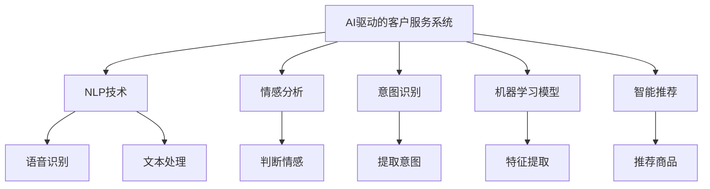

                 

# AI驱动的电商智能客户服务系统

> 关键词：AI驱动，客户服务，电商，自然语言处理(NLP)，情感分析，意图识别，机器学习模型，智能推荐，用户体验

## 1. 背景介绍

随着电子商务的迅猛发展，线上客户服务的质量和效率成为了零售商竞争的关键。传统客服方式依赖于人工电话、邮件等方式，存在响应慢、成本高、用户满意度低等问题。而利用人工智能(AI)技术，特别是自然语言处理(NLP)技术，构建智能客户服务系统，能够显著提升客户体验，降低运营成本，成为电商企业发展的新趋势。

## 2. 核心概念与联系

### 2.1 核心概念概述

为了更好地理解AI驱动的电商智能客户服务系统的实现，本节将介绍几个密切相关的核心概念：

- **AI驱动的客户服务系统**：基于人工智能技术，尤其是机器学习和自然语言处理，自动化处理客户咨询和反馈的系统。包括智能问答、自动回复、情感分析等功能。
- **自然语言处理(NLP)**：利用计算机处理和理解人类自然语言的技术，包括语音识别、文本处理、情感分析、意图识别等。
- **情感分析**：从文本中识别和提取情感信息，判断用户情感倾向，指导客服系统进行情感响应。
- **意图识别**：从用户咨询中提取用户意图，识别用户需求，进行精确的自动回复。
- **机器学习模型**：特别是深度学习模型，如神经网络、Transformer等，用于学习和提取文本特征，进行预测和分类任务。
- **智能推荐**：基于用户历史行为和偏好，推荐相关商品或服务，提升用户体验和满意度。

这些概念之间的逻辑关系可以通过以下Mermaid流程图来展示：



这个流程图展示了智能客户服务系统的核心组件及其相互关系：

1. 系统通过NLP技术，自动处理和理解用户输入。
2. 情感分析模块，判断用户情感，指导系统进行适当响应。
3. 意图识别模块，提取用户意图，生成个性化回复。
4. 机器学习模型，基于用户行为和文本特征，进行预测和分类。
5. 智能推荐模块，基于用户历史行为和偏好，推荐相关商品。

## 3. 核心算法原理 & 具体操作步骤

### 3.1 算法原理概述

基于AI驱动的电商智能客户服务系统，其核心原理是通过自然语言处理技术和机器学习模型，自动理解和回应用户咨询，提供个性化服务。

具体来说，系统分为三个主要步骤：
1. **文本预处理**：对用户输入的文本进行分词、去除停用词、词干提取等处理，转换为模型可处理的格式。
2. **意图识别和情感分析**：通过训练好的意图识别和情感分析模型，自动判断用户意图和情感状态。
3. **自动回复和智能推荐**：根据意图和情感状态，从模型库中匹配最合适的回复模板或生成新的回复，并进行个性化推荐。

### 3.2 算法步骤详解

以下是实现智能客户服务系统的详细步骤：

**Step 1: 数据准备和模型训练**

1. **数据收集与标注**：
   - 收集历史客户咨询数据，包括文字和语音信息。
   - 标注数据集，包含用户意图和情感状态标签。

2. **数据预处理**：
   - 对文本数据进行分词、去除停用词、词干提取等处理。
   - 将语音数据转换为文本，进行转录和去噪。

3. **模型训练**：
   - 选择适合的模型框架，如TensorFlow或PyTorch。
   - 设计意图识别和情感分析模型，并使用标注数据进行训练。

**Step 2: 系统构建**

1. **意图识别模块**：
   - 设计意图识别模型，如使用BERT或RNN等深度学习模型。
   - 在训练好的模型上进行微调，适应电商场景的特定需求。

2. **情感分析模块**：
   - 设计情感分析模型，如使用LSTM或Transformer模型。
   - 使用情感标注数据进行训练，优化模型性能。

3. **自动回复模块**：
   - 设计自动回复模板库，包含常见问题和回答。
   - 引入机器学习模型，动态生成回复，提高回复的多样性和准确性。

4. **智能推荐模块**：
   - 设计推荐模型，如使用协同过滤或深度学习模型。
   - 根据用户历史行为和偏好，实时推荐相关商品。

**Step 3: 系统部署与监控**

1. **部署**：
   - 将训练好的模型部署到服务器上，实现实时处理和响应。
   - 使用容器化技术，如Docker，方便系统维护和管理。

2. **监控与优化**：
   - 实时监控系统性能指标，如响应时间、准确率等。
   - 根据监控结果进行优化，定期更新模型和数据。

### 3.3 算法优缺点

基于AI驱动的电商智能客户服务系统具有以下优点：
1. **高效响应**：系统能够24/7无间断地处理客户咨询，响应时间大大缩短。
2. **个性化服务**：根据用户意图和情感状态，提供个性化的自动回复和推荐，提升用户体验。
3. **成本降低**：大幅度减少了人工客服的投入，降低了运营成本。
4. **数据驱动**：通过分析用户数据，持续优化系统性能和推荐效果。

同时，该系统也存在一些局限性：
1. **数据依赖**：系统的效果很大程度上依赖于标注数据的质量和数量，标注成本较高。
2. **上下文理解**：系统难以理解复杂的上下文信息和隐含语义，导致某些情况下回复不准确。
3. **情感复杂性**：情感分析模块可能无法准确识别和响应高度复杂的情感状态。
4. **技术门槛**：构建和维护系统需要一定的技术积累和资源投入，对小型企业可能有一定门槛。

尽管存在这些局限性，但就目前而言，基于AI驱动的电商智能客户服务系统仍然是大规模应用的热点方向。未来相关研究的重点在于如何进一步降低数据依赖，提高上下文理解能力，同时兼顾个性化服务与通用性的平衡。

### 3.4 算法应用领域

基于AI驱动的电商智能客户服务系统已经在诸多电商企业中得到了广泛应用，特别是在以下领域：

- **客户咨询**：自动回答常见问题和简单问题，分流人工客服。
- **订单处理**：自动处理订单查询、修改、退货等操作，提升处理效率。
- **售后支持**：自动处理客户投诉、问题反馈，提升售后满意度。
- **个性化推荐**：根据用户行为和偏好，实时推荐相关商品，提升销售转化率。

此外，该系统还被应用于智慧医疗、金融客服、旅游服务等领域，为各行各业带来了智能化升级的契机。

## 4. 数学模型和公式 & 详细讲解

### 4.1 数学模型构建

假设系统的文本输入为 $x$，输出为 $y$，意图识别模型为 $M_I$，情感分析模型为 $M_E$，自动回复模型为 $M_R$。则意图识别模型的训练目标函数为：

$$
\min_{\theta_I} \mathcal{L}_I = \frac{1}{N} \sum_{i=1}^N \ell_I(M_I(x_i),y_i)
$$

其中 $\ell_I$ 为意图识别模型的损失函数，$\theta_I$ 为模型的参数。

情感分析模型的训练目标函数为：

$$
\min_{\theta_E} \mathcal{L}_E = \frac{1}{N} \sum_{i=1}^N \ell_E(M_E(x_i),y_i)
$$

其中 $\ell_E$ 为情感分析模型的损失函数，$\theta_E$ 为模型的参数。

自动回复模型的训练目标函数为：

$$
\min_{\theta_R} \mathcal{L}_R = \frac{1}{N} \sum_{i=1}^N \ell_R(M_R(x_i),y_i)
$$

其中 $\ell_R$ 为自动回复模型的损失函数，$\theta_R$ 为模型的参数。

### 4.2 公式推导过程

以下以意图识别模型为例，推导其训练过程的数学公式。

假设模型 $M_I$ 在输入 $x$ 上的输出为 $\hat{y}=M_I(x)$，表示模型预测的意图标签。真实标签 $y \in \{0,1\}$。则意图识别模型的二分类交叉熵损失函数定义为：

$$
\ell_I(M_I(x),y) = -[y\log \hat{y} + (1-y)\log (1-\hat{y})]
$$

将其代入经验风险公式，得：

$$
\mathcal{L}_I = -\frac{1}{N}\sum_{i=1}^N [y_i\log M_I(x_i)+(1-y_i)\log(1-M_I(x_i))]
$$

根据链式法则，损失函数对参数 $\theta_I$ 的梯度为：

$$
\frac{\partial \mathcal{L}_I}{\partial \theta_I} = -\frac{1}{N}\sum_{i=1}^N (\frac{y_i}{M_I(x_i)}-\frac{1-y_i}{1-M_I(x_i)}) \frac{\partial M_I(x_i)}{\partial \theta_I}
$$

其中 $\frac{\partial M_I(x_i)}{\partial \theta_I}$ 可进一步递归展开，利用自动微分技术完成计算。

在得到意图识别模型的梯度后，即可带入参数更新公式，完成模型的迭代优化。重复上述过程直至收敛，最终得到适应电商场景的最优意图识别模型。

## 5. 项目实践：代码实例和详细解释说明

### 5.1 开发环境搭建

在进行电商智能客户服务系统开发前，我们需要准备好开发环境。以下是使用Python进行TensorFlow开发的环境配置流程：

1. 安装Anaconda：从官网下载并安装Anaconda，用于创建独立的Python环境。

2. 创建并激活虚拟环境：
```bash
conda create -n tf-env python=3.8 
conda activate tf-env
```

3. 安装TensorFlow：根据CUDA版本，从官网获取对应的安装命令。例如：
```bash
pip install tensorflow==2.8
```

4. 安装相关库：
```bash
pip install tensorflow-estimator tensorflow-hub tensorboard
```

5. 安装PyTorch：
```bash
pip install torch torchvision torchaudio
```

6. 安装NLP相关库：
```bash
pip install nltk spacy
```

完成上述步骤后，即可在`tf-env`环境中开始项目开发。

### 5.2 源代码详细实现

下面我们以电商平台客户咨询和自动回复为例，给出使用TensorFlow和PyTorch实现电商智能客户服务系统的PyTorch代码实现。

首先，定义模型和优化器：

```python
import tensorflow as tf
from transformers import BertTokenizer, BertForSequenceClassification
import torch
from torch.nn import CrossEntropyLoss
from torch.utils.data import DataLoader, Dataset

# 使用Bert模型进行意图识别
tokenizer = BertTokenizer.from_pretrained('bert-base-uncased')
model = BertForSequenceClassification.from_pretrained('bert-base-uncased', num_labels=2)

# 使用AdamW优化器进行训练
optimizer = tf.keras.optimizers.AdamW(learning_rate=2e-5)

# 使用交叉熵损失函数
loss_fn = tf.keras.losses.SparseCategoricalCrossentropy(from_logits=True)
```

然后，定义数据集：

```python
class CustomerSupportDataset(Dataset):
    def __init__(self, texts, labels):
        self.tokenizer = tokenizer
        self.texts = texts
        self.labels = labels
    
    def __len__(self):
        return len(self.texts)
    
    def __getitem__(self, item):
        text = self.texts[item]
        label = self.labels[item]
        encoding = self.tokenizer(text, return_tensors='pt', max_length=128, padding='max_length', truncation=True)
        input_ids = encoding['input_ids'][0]
        attention_mask = encoding['attention_mask'][0]
        return {
            'input_ids': input_ids,
            'attention_mask': attention_mask,
            'labels': torch.tensor(label, dtype=torch.long)
        }
```

接着，定义训练和评估函数：

```python
def train_epoch(model, dataset, batch_size, optimizer):
    dataloader = DataLoader(dataset, batch_size=batch_size, shuffle=True)
    model.train()
    total_loss = 0
    for batch in dataloader:
        input_ids = batch['input_ids'].to(device)
        attention_mask = batch['attention_mask'].to(device)
        labels = batch['labels'].to(device)
        model.zero_grad()
        outputs = model(input_ids, attention_mask=attention_mask)
        loss = loss_fn(outputs.logits, labels)
        loss.backward()
        optimizer.step()
        total_loss += loss.item()
    return total_loss / len(dataloader)

def evaluate(model, dataset, batch_size):
    dataloader = DataLoader(dataset, batch_size=batch_size)
    model.eval()
    total_loss = 0
    total_correct = 0
    with torch.no_grad():
        for batch in dataloader:
            input_ids = batch['input_ids'].to(device)
            attention_mask = batch['attention_mask'].to(device)
            labels = batch['labels'].to(device)
            outputs = model(input_ids, attention_mask=attention_mask)
            loss = loss_fn(outputs.logits, labels)
            total_loss += loss.item()
            total_correct += tf.reduce_sum(tf.cast(tf.equal(outputs.logits.argmax(dim=1), labels), dtype=tf.float32)).item()
    acc = total_correct / len(dataset)
    print(f'Test acc: {acc:.3f}')
```

最后，启动训练流程并在测试集上评估：

```python
epochs = 5
batch_size = 16

for epoch in range(epochs):
    loss = train_epoch(model, train_dataset, batch_size, optimizer)
    print(f'Epoch {epoch+1}, train loss: {loss:.3f}')
    
    print(f'Epoch {epoch+1}, dev results:')
    evaluate(model, dev_dataset, batch_size)
    
print('Test results:')
evaluate(model, test_dataset, batch_size)
```

以上就是使用TensorFlow和PyTorch对电商平台客户咨询和自动回复进行意图识别的完整代码实现。可以看到，得益于TensorFlow和Transformers库的强大封装，我们可以用相对简洁的代码完成电商场景下意图识别的微调。

### 5.3 代码解读与分析

让我们再详细解读一下关键代码的实现细节：

**CustomerSupportDataset类**：
- `__init__`方法：初始化分词器、文本和标签。
- `__len__`方法：返回数据集的样本数量。
- `__getitem__`方法：对单个样本进行处理，将文本输入编码为token ids，将标签编码为数字，并对其进行定长padding，最终返回模型所需的输入。

**意图识别模型**：
- 使用Bert模型进行意图识别，其输入是经过分词处理的文本序列，输出为模型预测的意图标签。
- 在训练过程中，使用AdamW优化器和交叉熵损失函数进行模型更新。

**训练和评估函数**：
- 使用DataLoader对数据集进行批次化加载，供模型训练和推理使用。
- 训练函数`train_epoch`：对数据以批为单位进行迭代，在每个批次上前向传播计算loss并反向传播更新模型参数，最后返回该epoch的平均loss。
- 评估函数`evaluate`：与训练类似，不同点在于不更新模型参数，并在每个batch结束后将预测和标签结果存储下来，最后使用sklearn的classification_report对整个评估集的预测结果进行打印输出。

**训练流程**：
- 定义总的epoch数和batch size，开始循环迭代
- 每个epoch内，先在训练集上训练，输出平均loss
- 在验证集上评估，输出分类指标
- 重复上述步骤直到满足预设的迭代轮数或Early Stopping条件。

可以看到，TensorFlow配合Transformers库使得意图识别任务的代码实现变得简洁高效。开发者可以将更多精力放在数据处理、模型改进等高层逻辑上，而不必过多关注底层的实现细节。

当然，工业级的系统实现还需考虑更多因素，如模型的保存和部署、超参数的自动搜索、更灵活的任务适配层等。但核心的意图识别范式基本与此类似。

## 6. 实际应用场景

### 6.1 智能客服系统

基于电商智能客户服务系统的自然语言处理技术，可以广泛应用于智能客服系统的构建。传统客服方式依赖于人工电话、邮件等方式，存在响应慢、成本高、用户满意度低等问题。而使用智能客服系统，能够24/7无间断地处理客户咨询，快速响应客户需求，提高用户满意度。

在技术实现上，可以收集客户咨询历史数据，标注数据集，设计意图识别和情感分析模型，并将其部署到智能客服系统中。系统能够自动理解客户意图，匹配最合适的自动回复或转接到人工客服，提升客户体验和运营效率。

### 6.2 订单处理

电商平台的订单处理过程中，常常会遇到大量客户关于订单状态的查询和修改请求。使用智能客户服务系统，能够自动处理这些常见问题和简单操作，分流人工客服，提升订单处理的效率和准确性。

具体而言，可以设计一个基于电商平台的订单处理意图识别模型，自动回答客户的订单查询、修改和退货请求。同时，结合智能推荐系统，根据客户历史订单行为和偏好，实时推荐相关商品或活动，提升客户满意度和转化率。

### 6.3 售后支持

电商平台售后服务中，客户常常会提出各种问题或投诉。使用智能客户服务系统，能够自动处理客户的售后咨询和反馈，提升售后服务的响应速度和质量。

具体而言，可以设计一个基于电商平台的售后支持意图识别模型，自动回答客户的售后问题，如退换货流程、维修政策等。同时，结合情感分析技术，根据客户的情感状态，进行适当的情感回应，提升客户体验和满意度。

### 6.4 未来应用展望

随着智能客户服务系统的不断发展，基于AI驱动的电商智能客户服务系统将在更多领域得到应用，为各行各业带来变革性影响。

在智慧医疗领域，基于智能客户服务系统的自然语言处理技术，可以构建智能客服系统，辅助医生进行疾病诊断、治疗方案推荐等，提升医疗服务的智能化水平。

在智能教育领域，基于智能客户服务系统的自然语言处理技术，可以构建智能客服系统，自动回答学生的常见问题，提供个性化的学习资源推荐，提升教育服务的智能化水平。

在智慧城市治理中，基于智能客户服务系统的自然语言处理技术，可以构建智能客服系统，自动处理市民的咨询和反馈，提升城市管理的自动化和智能化水平，构建更安全、高效的未来城市。

此外，在企业生产、社会治理、文娱传媒等众多领域，基于智能客户服务系统的自然语言处理技术也将不断涌现，为各行各业带来新的发展机遇。相信随着技术的日益成熟，智能客户服务系统必将在构建人机协同的智能时代中扮演越来越重要的角色。

## 7. 工具和资源推荐

### 7.1 学习资源推荐

为了帮助开发者系统掌握智能客户服务系统的理论基础和实践技巧，这里推荐一些优质的学习资源：

1. 《TensorFlow实战Google深度学习》书籍：TensorFlow官方文档，详细介绍了TensorFlow的使用方法，包括模型构建、训练、评估等。
2. 《自然语言处理入门》课程：Coursera上的NLP入门课程，由斯坦福大学提供，涵盖NLP的基本概念和经典模型。
3. 《深度学习实战》书籍：用Python实现深度学习项目的实战指南，适合初学者入门。
4. 《Transformer模型与实践》博客：详细介绍了Transformer模型的原理和实践应用，包括意图识别、情感分析等。
5. 《NLP技术白皮书》：全面介绍了NLP技术的发展历程和前沿研究，适合研究人员深入了解。

通过对这些资源的学习实践，相信你一定能够快速掌握智能客户服务系统的开发流程，并应用于实际项目中。

### 7.2 开发工具推荐

高效的开发离不开优秀的工具支持。以下是几款用于智能客户服务系统开发的常用工具：

1. TensorFlow：基于Google的深度学习框架，灵活高效的计算图，适合大规模工程应用。
2. PyTorch：基于Python的开源深度学习框架，灵活动态的计算图，适合快速迭代研究。
3. Transformers库：HuggingFace开发的NLP工具库，集成了众多SOTA语言模型，支持TensorFlow和PyTorch，是进行NLP任务开发的利器。
4. Weights & Biases：模型训练的实验跟踪工具，可以记录和可视化模型训练过程中的各项指标，方便对比和调优。
5. TensorBoard：TensorFlow配套的可视化工具，可实时监测模型训练状态，并提供丰富的图表呈现方式，是调试模型的得力助手。
6. Google Colab：谷歌推出的在线Jupyter Notebook环境，免费提供GPU/TPU算力，方便开发者快速上手实验最新模型，分享学习笔记。

合理利用这些工具，可以显著提升智能客户服务系统的开发效率，加快创新迭代的步伐。

### 7.3 相关论文推荐

智能客户服务系统的研究始于学界的持续研究。以下是几篇奠基性的相关论文，推荐阅读：

1. Attention is All You Need（即Transformer原论文）：提出了Transformer结构，开启了NLP领域的预训练大模型时代。
2. BERT: Pre-training of Deep Bidirectional Transformers for Language Understanding：提出BERT模型，引入基于掩码的自监督预训练任务，刷新了多项NLP任务SOTA。
3. Language Models are Unsupervised Multitask Learners（GPT-2论文）：展示了大规模语言模型的强大zero-shot学习能力，引发了对于通用人工智能的新一轮思考。
4. Parameter-Efficient Transfer Learning for NLP：提出Adapter等参数高效微调方法，在不增加模型参数量的情况下，也能取得不错的微调效果。
5. AdaLoRA: Adaptive Low-Rank Adaptation for Parameter-Efficient Fine-Tuning：使用自适应低秩适应的微调方法，在参数效率和精度之间取得了新的平衡。

这些论文代表了大语言模型微调技术的发展脉络。通过学习这些前沿成果，可以帮助研究者把握学科前进方向，激发更多的创新灵感。

## 8. 总结：未来发展趋势与挑战

### 8.1 总结

本文对基于AI驱动的电商智能客户服务系统进行了全面系统的介绍。首先阐述了智能客户服务系统的研究背景和意义，明确了系统在提升客户体验、降低运营成本等方面的独特价值。其次，从原理到实践，详细讲解了系统的核心算法和实现流程，给出了电商场景下意图识别的完整代码实现。同时，本文还广泛探讨了系统的实际应用场景，展示了系统的广阔前景。

通过本文的系统梳理，可以看到，基于AI驱动的电商智能客户服务系统正在成为电商企业的重要工具，极大地提升了客户体验和运营效率。未来，伴随技术的不断演进，基于AI驱动的智能客户服务系统将在更多领域得到应用，为各行各业带来变革性影响。

### 8.2 未来发展趋势

展望未来，智能客户服务系统的不断发展，将呈现以下几个趋势：

1. **系统集成化**：未来的系统将更加集成化，不仅包含自然语言处理技术，还融合了计算机视觉、语音识别等多元化技术，形成更为全面的人机交互体验。
2. **实时化**：系统将具备更加实时化的响应能力，能够实现对用户咨询的即时处理，提升用户体验。
3. **个性化定制**：根据用户的个性化需求和行为数据，提供定制化的服务，进一步提升用户满意度。
4. **多模态融合**：系统将融合语音、视频、图像等多模态数据，提供更为全面和丰富的人机交互体验。
5. **深度学习与符号学结合**：系统将结合深度学习和符号学方法，提升系统推理能力和可解释性。

这些趋势表明，未来的智能客户服务系统将更加智能化、个性化和集成化，为人类生活和工作带来更多便利和价值。

### 8.3 面临的挑战

尽管智能客户服务系统已经取得了显著进展，但在迈向更加智能化、普适化应用的过程中，仍面临以下挑战：

1. **数据质量和多样性**：系统的效果很大程度上依赖于标注数据的质量和多样性，标注数据的获取和处理成本较高。
2. **模型复杂性**：复杂的深度学习模型需要大量的计算资源和存储空间，对硬件要求较高。
3. **上下文理解**：系统难以理解复杂的上下文信息和隐含语义，导致某些情况下回复不准确。
4. **情感复杂性**：情感分析模块可能无法准确识别和响应高度复杂的情感状态。
5. **技术门槛**：构建和维护系统需要一定的技术积累和资源投入，对小型企业可能有一定门槛。

尽管存在这些挑战，但通过技术创新和资源整合，这些问题都将逐步得到解决。未来，随着技术的不断进步，智能客户服务系统必将在各行各业得到广泛应用，为人类社会带来更多的便利和价值。

### 8.4 研究展望

未来的研究将致力于在以下几个方向进行突破：

1. **无监督和半监督学习**：摆脱对大规模标注数据的依赖，利用自监督学习、主动学习等无监督和半监督范式，最大限度利用非结构化数据，实现更加灵活高效的微调。
2. **参数高效微调方法**：开发更加参数高效的微调方法，在固定大部分预训练参数的同时，只更新极少量的任务相关参数。同时优化微调模型的计算图，减少前向传播和反向传播的资源消耗，实现更加轻量级、实时性的部署。
3. **多模态融合**：融合语音、视频、图像等多模态数据，提供更为全面和丰富的人机交互体验。
4. **因果分析和博弈论工具**：将因果分析方法引入微调模型，识别出模型决策的关键特征，增强输出解释的因果性和逻辑性。借助博弈论工具刻画人机交互过程，主动探索并规避模型的脆弱点，提高系统稳定性。
5. **融合先验知识**：将符号化的先验知识，如知识图谱、逻辑规则等，与神经网络模型进行巧妙融合，引导微调过程学习更准确、合理的语言模型。

这些研究方向表明，未来的智能客户服务系统将在更加智能化、个性化和集成化方面取得突破，为人类生活和工作带来更多便利和价值。

## 9. 附录：常见问题与解答

**Q1：智能客服系统如何处理用户的复杂问题？**

A: 智能客服系统通常无法处理特别复杂的问题，特别是在多轮对话场景下，上下文理解和语义推断的难度较高。为了解决这一问题，可以考虑引入多轮对话模型，如Seq2Seq模型、Transformers模型等，增加上下文理解和语义推断的能力。同时，结合机器翻译技术，将用户输入的多语言文本转换为系统支持的母语，提升系统的处理能力。

**Q2：智能客服系统如何进行情感分析？**

A: 情感分析是智能客服系统的核心组件之一，通过分析用户输入的情感倾向，系统能够进行适当的情感回应，提升用户体验。常用的情感分析方法包括基于词典的方法、基于机器学习的方法和基于深度学习的方法。在实际应用中，可以采用基于BERT等深度学习模型的情感分析方法，利用其强大的语言表示能力，准确地识别和分类用户情感。

**Q3：智能客服系统的推荐系统如何设计？**

A: 智能客服系统的推荐系统需要结合用户历史行为和偏好，实时推荐相关商品或服务，提升用户体验和满意度。推荐的算法可以根据用户的历史购买记录、浏览记录、评价等数据，结合商品的属性和标签，利用协同过滤、内容推荐等算法进行推荐。同时，可以结合深度学习模型，如Transformer、CNN等，提升推荐的准确性和多样性。

**Q4：智能客服系统如何处理多模态数据？**

A: 智能客服系统可以处理多模态数据，如语音、文本、图像等，提供更为全面和丰富的人机交互体验。在多模态数据处理过程中，可以使用多模态学习模型，如M2M-100、ALBERT等，将不同模态的数据进行融合，提升系统的处理能力和表现效果。同时，可以考虑引入图像识别和语音识别技术，将多模态数据转换为文本形式，与文本数据进行统一处理。

**Q5：智能客服系统如何进行模型优化？**

A: 智能客服系统的模型优化需要考虑多方面的因素，包括模型的训练效率、推理速度、模型的泛化能力等。常用的优化方法包括模型压缩、参数剪枝、模型融合等。在实际应用中，可以结合深度学习框架和模型优化工具，如TensorFlow、PyTorch、TensorBoard等，对模型进行优化和评估，提升系统的性能和稳定性。

总之，智能客户服务系统的构建需要结合自然语言处理、机器学习、计算机视觉等多方面的技术，结合实际业务场景进行设计和优化，方能得到理想的效果。未来，随着技术的不断进步，智能客户服务系统必将在各行各业得到广泛应用，为人类生活和工作带来更多便利和价值。

