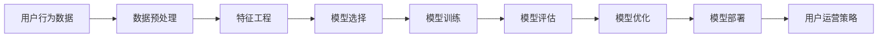

                 

# AI驱动的电商用户生命周期价值预测模型

> 关键词：用户生命周期价值预测、电商场景、人工智能、机器学习、深度学习、特征工程、预测模型、模型评估

## 1. 背景介绍

随着互联网的普及和电子商务的兴起，电商平台的用户数量和交易规模呈现出爆炸式增长。对于电商企业而言，了解用户行为和交易习惯，预测其生命周期价值（CLV），是提升用户留存率和营收增长的关键。用户生命周期价值预测不仅帮助企业精准投放资源，制定个性化推荐策略，还能指导后续的营销活动，从而实现用户价值的最大化。

### 1.1 问题由来
电商平台的运营决策离不开对用户行为数据的深入分析。传统的用户分析方法往往依赖于统计报表和规则引擎，效率低下且不够精确。而通过机器学习特别是深度学习技术，电商企业可以构建更加复杂和准确的预测模型，以科学的方式分析用户数据，发现隐藏规律，从而制定更有效的运营策略。

在电商领域，用户生命周期价值预测已经被证明可以显著提升企业的ROI。例如，亚马逊通过用户行为数据的深入挖掘，能够提前预测哪些用户可能会流失，并采取相应措施，如个性化推荐和客户关怀活动，有效降低了用户流失率。因此，如何构建高效的电商用户生命周期价值预测模型，成为电商平台亟需解决的重要课题。

### 1.2 问题核心关键点
电商用户生命周期价值预测涉及多个关键点，包括：

1. **用户行为数据收集**：收集用户浏览、点击、购买、评价等行为数据。
2. **数据预处理与特征工程**：清洗、转换和整合原始数据，构建可用于模型训练的特征。
3. **模型选择与训练**：选择合适的预测模型，使用电商用户数据进行训练。
4. **模型评估与优化**：评估预测模型的性能，并根据反馈进行模型优化。
5. **模型部署与应用**：将训练好的模型集成到电商平台的业务系统中，实现实时预测与用户运营策略的自动化。

本文将系统介绍AI驱动的电商用户生命周期价值预测模型的构建方法，涵盖从模型选择到部署应用的各个环节。

## 2. 核心概念与联系

### 2.1 核心概念概述

电商用户生命周期价值（CLV）预测是指通过用户行为数据，预测用户在电商平台上后续的消费行为和价值产出。预测模型的输入包括用户历史行为数据、交易记录、用户属性等，输出则是对未来某个时间段内用户消费金额或CLV的预测。

为了构建一个有效的电商用户CLV预测模型，需要理解以下关键概念：

- **用户行为数据**：用户在页面上的点击、浏览、购买、评价等行为数据。
- **用户属性**：用户的年龄、性别、地理位置、购买频率等基本信息。
- **特征工程**：将原始数据转换为可用于模型训练的特征。
- **机器学习与深度学习**：构建预测模型的基本技术手段。
- **模型评估**：通过各种指标评估模型性能，确保模型泛化能力。
- **模型部署与应用**：将训练好的模型集成到业务系统，实现实时预测和策略优化。

这些概念之间相互联系，共同构成了电商用户CLV预测模型的完整框架。

### 2.2 核心概念原理和架构的 Mermaid 流程图



## 3. 核心算法原理 & 具体操作步骤
### 3.1 算法原理概述

电商用户CLV预测模型的核心算法原理是通过机器学习或深度学习模型，利用用户历史行为数据和特征，构建一个预测函数，估计未来用户价值。预测模型的输入包括用户历史行为数据、用户属性等，输出则是未来某个时间段内用户的CLV或消费金额。

电商用户CLV预测通常包括以下步骤：

1. **数据收集与预处理**：收集用户行为数据，进行清洗、去重和标准化处理。
2. **特征工程**：从用户行为数据中提取有意义的特征，用于模型训练。
3. **模型选择与训练**：选择合适的预测模型，并使用电商用户数据进行训练。
4. **模型评估与优化**：评估预测模型的性能，根据反馈进行模型优化。
5. **模型部署与应用**：将训练好的模型集成到电商平台的业务系统中，实现实时预测与用户运营策略的自动化。

### 3.2 算法步骤详解

#### 3.2.1 数据收集与预处理

数据收集是电商用户CLV预测的第一步。电商平台需要收集用户浏览、点击、购买、评价等行为数据，以及用户的地理位置、性别、年龄等基本信息。这些数据通常存储在日志文件、数据库或数据仓库中。

数据预处理包括数据清洗、去重、标准化处理等。数据清洗主要是去除重复、无效、异常的数据；去重则是为了确保数据的一致性和准确性；标准化处理则是对数据进行统一的格式转换，以便于后续的特征工程和模型训练。

#### 3.2.2 特征工程

特征工程是构建预测模型的关键步骤，其目标是从原始数据中提取有用的特征，以便模型更好地学习和预测用户CLV。电商用户数据包含多种类型的特征，包括用户行为特征、交易特征、用户属性特征等。

**用户行为特征**：用户的浏览次数、停留时间、点击率、购买率等。
**交易特征**：订单金额、订单数量、下单频率、复购率等。
**用户属性特征**：用户年龄、性别、地理位置、设备类型等。

特征工程的具体步骤如下：

1. **特征选择**：选择与CLV预测相关的特征。
2. **特征构建**：通过组合和变换已有特征，生成新的特征。
3. **特征归一化与标准化**：对特征进行归一化和标准化处理，使不同特征具有相同的量级。
4. **特征选择**：使用特征选择算法（如卡方检验、互信息等）选择对预测结果影响最大的特征。

#### 3.2.3 模型选择与训练

电商用户CLV预测的模型选择与训练是模型的核心步骤。目前常用的预测模型包括线性回归、决策树、随机森林、神经网络等。

**线性回归**：适用于连续性预测问题，模型简单，易于解释。
**决策树和随机森林**：适用于分类和回归问题，模型易于理解和解释。
**神经网络**：适用于复杂的非线性预测问题，模型表现最好，但解释性较差。

模型训练的目的是使用电商用户数据对模型进行拟合，使模型能够学习到数据的潜在规律，并准确预测未来用户的CLV。

**模型训练步骤**：
1. **划分数据集**：将数据集划分为训练集、验证集和测试集。
2. **选择优化器与损失函数**：选择合适的优化器和损失函数，如Adam、交叉熵损失等。
3. **模型拟合**：使用训练集对模型进行拟合，最小化损失函数。
4. **模型验证**：使用验证集对模型进行验证，调整模型参数。
5. **模型测试**：使用测试集对模型进行测试，评估模型性能。

#### 3.2.4 模型评估与优化

模型评估与优化是保证模型预测准确性的关键步骤。评估指标包括均方误差（MSE）、平均绝对误差（MAE）、R²等。

**模型评估步骤**：
1. **划分数据集**：将数据集划分为训练集、验证集和测试集。
2. **选择评估指标**：选择合适的评估指标，如MSE、MAE、R²等。
3. **模型评估**：使用测试集对模型进行评估，计算评估指标。
4. **模型优化**：根据评估结果对模型进行优化，如调整超参数、增加特征等。

#### 3.2.5 模型部署与应用

模型部署是将训练好的模型集成到电商平台的业务系统中，实现实时预测和策略优化。通常使用微服务架构、容器化技术（如Docker）和云平台（如AWS、阿里云）进行模型部署。

**模型部署步骤**：
1. **模型集成**：将训练好的模型集成到业务系统中。
2. **服务化封装**：将模型封装为API服务，支持HTTP请求。
3. **容器化部署**：使用容器技术进行模型部署，提高部署效率和可移植性。
4. **云平台部署**：将模型部署到云平台，支持弹性伸缩和自动扩展。

## 4. 数学模型和公式 & 详细讲解 & 举例说明

### 4.1 数学模型构建

电商用户CLV预测模型的数学模型构建通常采用回归模型。假设预测的目标是未来时间t内用户的CLV，记为$Y_t$，模型的输入为特征向量$\mathbf{X}$，则预测模型的数学形式为：

$$
Y_t = f(\mathbf{X})
$$

其中，$f$为预测函数，可以是线性回归、决策树、随机森林、神经网络等。

### 4.2 公式推导过程

以线性回归模型为例，其预测函数为：

$$
Y_t = \mathbf{w}^T \mathbf{X} + b
$$

其中，$\mathbf{w}$为模型参数，$\mathbf{X}$为特征向量，$b$为偏置项。

假设模型训练集为$D=\{(\mathbf{X}_i, Y_i)\}_{i=1}^N$，则模型参数的估计公式为：

$$
\hat{\mathbf{w}} = \arg\min_{\mathbf{w}} \frac{1}{N} \sum_{i=1}^N (Y_i - \mathbf{w}^T \mathbf{X}_i)^2
$$

通过求解上述最优化问题，可以得到模型参数$\hat{\mathbf{w}}$。

### 4.3 案例分析与讲解

假设有一个电商平台的销售数据集，其中包含用户的ID、年龄、性别、购买次数、订单金额等特征，以及每个用户的CLV。我们尝试构建一个线性回归模型，预测用户未来一个月的CLV。

**特征工程**：
- **用户特征**：用户ID、年龄、性别、设备类型。
- **交易特征**：购买次数、订单金额、订单数量。
- **行为特征**：最近一个月的平均订单金额、最近一个月的订单数量。

**模型训练**：
- **划分数据集**：将数据集划分为训练集、验证集和测试集。
- **选择优化器和损失函数**：使用Adam优化器，交叉熵损失函数。
- **模型拟合**：使用训练集对模型进行拟合，最小化损失函数。
- **模型验证**：使用验证集对模型进行验证，调整模型参数。
- **模型测试**：使用测试集对模型进行测试，评估模型性能。

**模型评估**：
- **均方误差（MSE）**：
$$
MSE = \frac{1}{N} \sum_{i=1}^N (Y_i - \hat{Y}_i)^2
$$
- **平均绝对误差（MAE）**：
$$
MAE = \frac{1}{N} \sum_{i=1}^N |Y_i - \hat{Y}_i|
$$
- **R²**：
$$
R^2 = 1 - \frac{MSE}{Var(Y)}
$$

通过上述步骤，我们可以构建一个有效的电商用户CLV预测模型，并评估其预测性能。

## 5. 项目实践：代码实例和详细解释说明

### 5.1 开发环境搭建

要进行电商用户CLV预测模型的开发，我们需要搭建一个Python开发环境。以下是具体步骤：

1. **安装Python**：下载并安装Python 3.x版本。
2. **安装必要的库**：
```bash
pip install numpy pandas scikit-learn matplotlib torch
```
3. **搭建虚拟环境**：
```bash
python -m venv env
source env/bin/activate
```
4. **安装深度学习框架**：
```bash
conda install torch torchvision torchaudio -c pytorch -c conda-forge
```

### 5.2 源代码详细实现

#### 5.2.1 数据收集与预处理

```python
import pandas as pd
from sklearn.model_selection import train_test_split
from sklearn.preprocessing import StandardScaler

# 读取电商用户数据
data = pd.read_csv('user_data.csv')

# 数据清洗与预处理
# 去除重复数据
data = data.drop_duplicates()

# 特征选择与构建
# 选择与CLV预测相关的特征
selected_features = ['age', 'gender', 'device_type', 'purchase_count', 'avg_order_amount', 'total_order_amount', 'order_volume']

# 构建新的特征
data['sinusoidal_age'] = np.sin(data['age'].values)  # 引入正弦特征
data['polynomial_age'] = data['age'] ** 2  # 引入多项式特征

# 特征归一化
scaler = StandardScaler()
data[selected_features] = scaler.fit_transform(data[selected_features])

# 划分数据集
train_data, test_data = train_test_split(data, test_size=0.2, random_state=42)
```

#### 5.2.2 模型选择与训练

```python
import torch
from torch import nn, optim
from torch.utils.data import TensorDataset, DataLoader

# 定义模型
class LinearRegression(nn.Module):
    def __init__(self, input_dim):
        super(LinearRegression, self).__init__()
        self.linear = nn.Linear(input_dim, 1)

    def forward(self, x):
        return self.linear(x)

# 构建模型
input_dim = len(train_data.columns) - 1
model = LinearRegression(input_dim)

# 定义优化器和损失函数
optimizer = optim.Adam(model.parameters(), lr=0.01)
loss_fn = nn.MSELoss()

# 模型训练
def train_model(model, train_data, optimizer, loss_fn, epochs=100):
    train_data = TensorDataset(train_data.values[:, :-1], train_data.values[:, -1])
    train_loader = DataLoader(train_data, batch_size=32, shuffle=True)
    for epoch in range(epochs):
        model.train()
        for inputs, targets in train_loader:
            optimizer.zero_grad()
            outputs = model(inputs)
            loss = loss_fn(outputs, targets)
            loss.backward()
            optimizer.step()

    return model

# 训练模型
model = train_model(model, train_data, optimizer, loss_fn)
```

#### 5.2.3 模型评估与优化

```python
# 模型评估
test_data = TensorDataset(test_data.values[:, :-1], test_data.values[:, -1])
test_loader = DataLoader(test_data, batch_size=32, shuffle=False)

with torch.no_grad():
    model.eval()
    mse = []
    mae = []
    for inputs, targets in test_loader:
        outputs = model(inputs)
        mse.append(loss_fn(outputs, targets).item())
        mae.append(loss_fn(outputs, targets).item())

    print(f'MSE: {np.mean(mse)}, MAE: {np.mean(mae)}')
```

### 5.3 代码解读与分析

#### 5.3.1 数据收集与预处理

数据收集是电商用户CLV预测的第一步。在代码中，我们通过`pandas`库读取电商用户数据，并进行数据清洗、去重和标准化处理。具体来说，我们使用了`drop_duplicates`方法去除重复数据，使用`StandardScaler`对特征进行归一化处理，以提高模型的收敛速度和预测准确性。

#### 5.3.2 模型选择与训练

模型选择是电商用户CLV预测的关键步骤。我们选择了线性回归模型，并使用PyTorch框架进行模型训练。在代码中，我们定义了一个`LinearRegression`类，用于表示线性回归模型。然后，我们定义了优化器和损失函数，使用`Adam`优化器和均方误差（MSE）损失函数进行模型训练。

#### 5.3.3 模型评估与优化

模型评估是保证模型预测准确性的关键步骤。我们使用了均方误差（MSE）和平均绝对误差（MAE）作为评估指标，计算模型在测试集上的预测性能。同时，我们还使用了R²作为回归模型的泛化能力评估指标，以便更好地评估模型的预测能力。

## 6. 实际应用场景

### 6.1 智能推荐系统

电商平台的智能推荐系统是电商用户CLV预测的重要应用场景。通过构建电商用户CLV预测模型，可以更好地了解用户的购买行为和兴趣，从而制定更加个性化的推荐策略。

具体而言，可以使用电商用户CLV预测模型，预测用户的未来购买意向和消费金额，然后根据预测结果进行个性化推荐。例如，如果模型预测某用户在未来一个月内将购买高价值商品，则可以推荐一些高毛利商品或限时促销活动，从而提升用户的CLV和平台收益。

### 6.2 用户流失预测与挽回

电商平台的流失用户分析也是用户生命周期价值预测的重要应用场景。通过构建用户CLV预测模型，可以预测哪些用户可能会流失，并及时采取挽回措施。

具体而言，可以使用电商用户CLV预测模型，预测用户的未来购买意向和消费金额，然后对预测结果进行分析。如果模型预测某用户可能会流失，则可以采取相应的策略，如发送个性化关怀邮件、提供优惠券等，从而提升用户的留存率和CLV。

### 6.3 个性化营销活动

电商平台的个性化营销活动也是用户生命周期价值预测的重要应用场景。通过构建电商用户CLV预测模型，可以更好地了解用户的购买行为和兴趣，从而制定更加个性化的营销策略。

具体而言，可以使用电商用户CLV预测模型，预测用户的未来购买意向和消费金额，然后根据预测结果进行个性化营销活动。例如，如果模型预测某用户可能会在特定时间段内购买某类商品，则可以提前进行促销活动，从而提升用户的CLV和平台收益。

### 6.4 未来应用展望

未来，电商用户CLV预测模型将呈现以下几个发展趋势：

1. **多模态融合**：电商用户CLV预测将不仅仅依赖于用户行为数据，还将引入视觉、音频等多模态数据，实现多模态融合，提升预测准确性。
2. **实时预测**：电商用户CLV预测将实现实时预测，快速响应用户行为变化，提升用户体验和平台收益。
3. **模型自动化**：电商用户CLV预测模型将实现自动化，通过自适应算法自动调整模型参数，提升模型的预测能力和泛化能力。
4. **模型可解释性**：电商用户CLV预测模型将具备可解释性，能够清晰地解释模型的预测结果和决策过程，提升用户信任度和平台透明度。

这些趋势将进一步推动电商用户CLV预测技术的发展，为电商平台提供更加智能、高效的运营决策支持。

## 7. 工具和资源推荐

### 7.1 学习资源推荐

为了帮助开发者系统掌握电商用户CLV预测的技术，这里推荐一些优质的学习资源：

1. 《Python数据科学手册》：介绍了Python在数据科学中的应用，包括数据收集、处理、分析和可视化等。
2. 《深度学习入门》：介绍深度学习的基本概念、算法和实现方法，适合初学者入门。
3. 《机器学习实战》：介绍机器学习的基本概念、算法和应用案例，适合入门和进阶读者。
4. 《TensorFlow官方文档》：介绍TensorFlow框架的各项功能和使用方法，适合TensorFlow开发者使用。
5. 《深度学习实战》：介绍深度学习的基本概念、算法和应用案例，适合深度学习开发者使用。

### 7.2 开发工具推荐

电商用户CLV预测模型的开发通常需要使用Python和深度学习框架，以下是一些推荐的开发工具：

1. PyTorch：Python深度学习框架，支持动态图和静态图计算，适合灵活研究。
2. TensorFlow：Google开源的深度学习框架，支持分布式训练和部署，适合大规模工程应用。
3. Keras：Python深度学习框架，支持快速搭建和训练模型，适合快速迭代开发。
4. Jupyter Notebook：Python代码开发和数据可视化的利器，支持交互式代码编写和实时展示。
5. Scikit-learn：Python机器学习库，提供各种预处理、分类、回归、聚类等算法。

### 7.3 相关论文推荐

电商用户CLV预测领域的研究日新月异，以下是几篇具有代表性的论文：

1. "Customer Lifetime Value Prediction Using Machine Learning Techniques"：介绍了一种基于机器学习算法构建电商用户CLV预测模型的研究。
2. "LSTM-Based Customer Lifetime Value Prediction"：介绍了一种基于LSTM神经网络模型构建电商用户CLV预测模型的研究。
3. "Deep Learning for Customer Lifetime Value Prediction"：介绍了一种基于深度学习模型构建电商用户CLV预测模型的研究。
4. "Customer Lifetime Value Prediction in E-Commerce"：介绍了一种基于多模态数据构建电商用户CLV预测模型的研究。
5. "Customer Lifetime Value Prediction Using Neural Network Ensembles"：介绍了一种基于神经网络集成方法构建电商用户CLV预测模型的研究。

这些论文涵盖了电商用户CLV预测的多种技术和方法，适合深入学习该领域的最新进展。

## 8. 总结：未来发展趋势与挑战

### 8.1 研究成果总结

本文对基于AI的电商用户生命周期价值预测模型进行了详细介绍，包括数据收集与预处理、特征工程、模型选择与训练、模型评估与优化等关键步骤。通过案例分析，展示了电商用户CLV预测模型的应用效果。

### 8.2 未来发展趋势

未来，电商用户CLV预测模型将呈现出以下几个发展趋势：

1. **多模态融合**：电商用户CLV预测将不仅仅依赖于用户行为数据，还将引入视觉、音频等多模态数据，实现多模态融合，提升预测准确性。
2. **实时预测**：电商用户CLV预测将实现实时预测，快速响应用户行为变化，提升用户体验和平台收益。
3. **模型自动化**：电商用户CLV预测模型将实现自动化，通过自适应算法自动调整模型参数，提升模型的预测能力和泛化能力。
4. **模型可解释性**：电商用户CLV预测模型将具备可解释性，能够清晰地解释模型的预测结果和决策过程，提升用户信任度和平台透明度。

这些趋势将进一步推动电商用户CLV预测技术的发展，为电商平台提供更加智能、高效的运营决策支持。

### 8.3 面临的挑战

尽管电商用户CLV预测模型在电商平台上得到了广泛应用，但仍面临一些挑战：

1. **数据质量问题**：电商用户CLV预测模型依赖于高质量的数据，如果数据存在缺失、错误、噪声等问题，将会影响模型的预测性能。
2. **模型泛化能力**：电商用户CLV预测模型需要具备良好的泛化能力，能够适应不同电商平台的用户行为和消费习惯。
3. **模型部署与维护**：电商用户CLV预测模型需要实现高效的部署和维护，支持大规模在线预测和实时更新。
4. **用户隐私保护**：电商用户CLV预测模型需要保护用户隐私，确保用户数据的安全性和合规性。

### 8.4 研究展望

未来，电商用户CLV预测技术将在以下几个方面进行深入研究：

1. **数据质量提升**：通过数据清洗、数据增强等技术，提高电商用户CLV预测模型的数据质量。
2. **模型泛化能力提升**：通过模型集成、迁移学习等技术，提升电商用户CLV预测模型的泛化能力。
3. **模型部署与维护优化**：通过容器化、云平台等技术，优化电商用户CLV预测模型的部署和维护。
4. **用户隐私保护**：通过差分隐私、联邦学习等技术，保护电商用户CLV预测模型的用户隐私。

总之，电商用户CLV预测技术将在未来继续保持快速发展，为电商平台的运营决策提供更加精准、高效的支撑。

## 9. 附录：常见问题与解答

### Q1: 电商用户CLV预测模型对数据质量有哪些要求？

A: 电商用户CLV预测模型对数据质量有以下要求：

1. **数据完整性**：电商用户CLV预测模型需要完整的数据，缺失的数据会影响模型的预测性能。
2. **数据准确性**：电商用户CLV预测模型需要准确的数据，错误的数据会导致模型预测结果偏差。
3. **数据一致性**：电商用户CLV预测模型需要一致的数据，不一致的数据会导致模型预测结果混乱。
4. **数据多样性**：电商用户CLV预测模型需要多样化的数据，单一的数据会导致模型泛化能力不足。

因此，电商用户CLV预测模型的构建需要从数据采集、数据清洗、数据标注等多个环节进行严格的质量控制。

### Q2: 电商用户CLV预测模型如何处理数据稀疏问题？

A: 电商用户CLV预测模型通常会遇到数据稀疏问题，即某些特征的取值较少，这会影响模型的训练和预测性能。为了解决数据稀疏问题，可以采用以下方法：

1. **数据补全**：通过数据补全技术，将稀疏数据进行填充，使其具有更多的样本。常用的数据补全方法包括均值填充、中值填充、最近邻填充等。
2. **特征工程**：通过特征工程，构建新的特征，使得稀疏特征不再影响模型的预测性能。例如，可以引入多项式特征、正弦特征等。
3. **模型优化**：通过模型优化，引入正则化技术、提升模型的泛化能力，使其能够更好地处理稀疏数据。

总之，电商用户CLV预测模型需要从数据处理、特征工程、模型优化等多个环节进行综合处理，才能有效解决数据稀疏问题。

### Q3: 电商用户CLV预测模型的评估指标有哪些？

A: 电商用户CLV预测模型的评估指标包括：

1. **均方误差（MSE）**：均方误差是衡量模型预测值与真实值之间差异的指标，越小表示模型预测越准确。
2. **平均绝对误差（MAE）**：平均绝对误差是衡量模型预测值与真实值之间差异的绝对值，越小表示模型预测越准确。
3. **R²（决定系数）**：R²是衡量模型预测值与真实值之间相关性的指标，越接近1表示模型预测越准确。
4. **F1得分**：F1得分是衡量模型预测结果的准确率和召回率的综合指标，越高表示模型预测越准确。

在评估电商用户CLV预测模型时，需要根据具体应用场景选择合适的评估指标，综合评估模型的预测性能。

### Q4: 电商用户CLV预测模型的实际应用场景有哪些？

A: 电商用户CLV预测模型的实际应用场景包括：

1. **智能推荐系统**：根据用户历史行为数据，预测用户的未来购买意向，从而制定个性化的推荐策略。
2. **用户流失预测与挽回**：根据用户历史行为数据，预测用户的未来流失概率，从而及时采取挽回措施。
3. **个性化营销活动**：根据用户历史行为数据，预测用户的未来购买意向，从而制定个性化的营销活动。
4. **库存管理**：根据用户历史行为数据，预测用户的未来购买意向，从而优化库存管理策略。
5. **用户忠诚度分析**：根据用户历史行为数据，预测用户的未来忠诚度，从而制定忠诚度提升策略。

这些应用场景覆盖了电商平台的各个方面，能够帮助电商平台提升用户体验、优化运营决策、提高收益等。

---

作者：禅与计算机程序设计艺术 / Zen and the Art of Computer Programming

