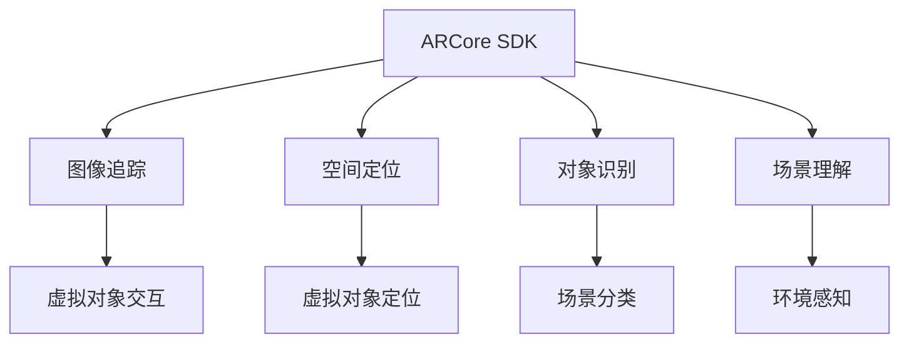

                 

# ARCore 开发工具包教程：在 Android 平台上构建 AR 应用的最佳实践

> 关键词：ARCore, 增强现实, Android 平台, 开发工具包, 图像追踪, 空间定位, 场景理解

## 1. 背景介绍

### 1.1 问题由来

随着AR（增强现实）技术在虚拟与现实结合场景中的广泛应用，如何在移动设备上构建高效、稳定的AR应用成为研发人员关注的重点。Android平台是当前最为流行的移动开发平台之一，具有广泛的市场占有率和强大的生态系统。ARCore是谷歌为Android平台提供的AR开发框架，支持图像追踪、空间定位、场景理解等核心功能，帮助开发者快速构建高性能AR应用。

然而，构建一个成功的AR应用不仅仅是选择并应用这些技术，还需要深入理解每个组件的工作原理，并合理设计应用流程。本文将详细介绍ARCore开发工具包，包括ARCore的基本概念、核心组件、编程实现和常见应用场景，以期为Android平台上的AR应用开发提供指导。

### 1.2 问题核心关键点

ARCore提供了一系列核心组件，包括追踪、空间定位、对象识别和场景理解等，这些组件通过不同的API接口和回调函数进行组合和调用，构成了AR应用开发的核心框架。

- **图像追踪（Image Tracking）**：利用摄像头捕捉到的图像识别和追踪物体或平面，实现虚拟对象与现实世界对象的交互。
- **空间定位（Pose Tracking）**：通过摄像头和传感器数据实时计算设备的位置和姿态，实现虚拟对象在真实世界中的定位和摆放。
- **对象识别（Object Recognition）**：使用深度学习模型从图像中识别和分类对象，实现场景中物品的分类和识别。
- **场景理解（Scene Understanding）**：利用机器学习算法对场景进行全局理解，识别环境中的几何特征、光照等，实现虚拟对象在真实世界中的正确位置和姿态。

这些组件通过ARCore的SDK（软件开发展包）提供，开发者可以灵活组合这些组件，构建满足不同需求的AR应用。

## 2. 核心概念与联系

### 2.1 核心概念概述

为更好地理解ARCore开发工具包，本节将介绍几个密切相关的核心概念：

- **ARCore SDK**：谷歌为Android平台提供的AR开发框架，包括一系列API和工具，帮助开发者构建AR应用。
- **图像追踪**：利用摄像头捕捉到的图像，通过特征点识别和匹配，实现对物体或平面的追踪。
- **空间定位**：通过摄像头和传感器数据，结合机器学习算法，实时计算设备的位置和姿态，实现虚拟对象在真实世界中的定位。
- **对象识别**：使用深度学习模型，从图像中识别和分类物体，提升AR应用对场景的理解能力。
- **场景理解**：利用机器学习算法，对场景进行全局理解，识别环境中的几何特征、光照等，实现虚拟对象在真实世界中的正确位置和姿态。

这些核心概念之间的逻辑关系可以通过以下Mermaid流程图来展示：



这个流程图展示了这个核心概念之间的逻辑关系：

1. 开发者使用ARCore SDK提供的功能组件，构建AR应用。
2. 图像追踪组件通过摄像头捕捉的图像，实现物体或平面的追踪。
3. 空间定位组件通过摄像头和传感器数据，实时计算设备的位置和姿态。
4. 对象识别组件使用深度学习模型，实现场景中物体的分类和识别。
5. 场景理解组件利用机器学习算法，实现对场景的全局理解。

这些组件通过合理设计，可以构建出功能丰富、性能优良的AR应用。

## 3. 核心算法原理 & 具体操作步骤
### 3.1 算法原理概述

ARCore的核心算法原理主要包括图像识别、空间定位和场景理解三个方面。

1. **图像识别**：利用卷积神经网络（CNN）等深度学习模型，对摄像头捕捉的图像进行特征提取和分类，实现对物体或平面的识别。
2. **空间定位**：通过摄像头和传感器数据，实时计算设备的位置和姿态。具体流程包括摄像头图像处理、传感器融合和机器学习算法应用等步骤。
3. **场景理解**：利用机器学习算法对场景进行全局理解，识别环境中的几何特征、光照等，实现虚拟对象在真实世界中的正确位置和姿态。

ARCore的实现基于OpenCV、TensorFlow等开源库，深度利用了GPU和CPU的计算能力，结合了计算机视觉和机器学习技术，实现高效、准确的AR应用开发。

### 3.2 算法步骤详解

构建ARCore应用的第一步是初始化ARCore会话，随后根据应用需求选择合适的组件进行集成和配置。

1. **会话初始化**：在应用启动时，通过`ARCoreApi.createSession`方法创建ARCore会话。
2. **图像追踪配置**：利用`ImageTrackingConfig`对象配置图像追踪组件，包括追踪对象列表、触发条件和模型选择等。
3. **空间定位配置**：通过`PoseTrackingConfig`对象配置空间定位组件，包括传感器类型、位置更新频率和坐标系等。
4. **对象识别配置**：利用`ObjectRecognitionConfig`对象配置对象识别组件，包括模型选择和触发条件等。
5. **场景理解配置**：通过`SceneUnderstandingConfig`对象配置场景理解组件，包括场景分类和跟踪器选择等。

### 3.3 算法优缺点

ARCore开发工具包具有以下优点：

- **跨平台支持**：ARCore在Android平台上的支持范围广泛，适用于各种设备。
- **丰富的组件和工具**：提供了图像追踪、空间定位、对象识别和场景理解等核心组件，功能丰富。
- **高效的性能**：利用了深度学习和GPU加速技术，性能高效。

然而，ARCore开发工具包也存在一些缺点：

- **算法复杂**：深度学习模型和机器学习算法的复杂性，对硬件要求较高。
- **开发门槛高**：需要具备计算机视觉和机器学习的相关知识，开发难度较大。
- **场景适应性有限**：在复杂光照和遮挡环境中，识别和定位的准确性可能受到影响。

### 3.4 算法应用领域

ARCore开发工具包在许多应用领域中得到了广泛应用，例如：

- **虚拟试穿**：利用AR技术，让用户可以在虚拟环境中试穿服装、配饰等，提升购物体验。
- **虚拟测量**：通过AR技术，用户可以在现实世界中测量物体尺寸，方便快捷。
- **室内设计**：利用AR技术，用户在实际空间中进行家具摆放和设计，提前预览效果。
- **游戏互动**：在游戏中，虚拟对象可以通过AR技术与现实世界对象交互，提升游戏体验。
- **教育应用**：通过AR技术，展示三维模型和虚拟场景，帮助学生理解复杂概念。

此外，ARCore还被应用于军事、医疗、考古等多个领域，推动了AR技术的普及和应用。

## 4. 数学模型和公式 & 详细讲解 & 举例说明

### 4.1 数学模型构建

ARCore的实现基于计算机视觉和机器学习技术，涉及图像处理、深度学习、传感器数据融合等多个领域。以下是几个常用的数学模型：

1. **图像识别**：使用卷积神经网络（CNN）对摄像头捕捉的图像进行特征提取和分类，常用的模型包括ResNet、Inception等。

2. **空间定位**：利用传感器数据和摄像头图像处理，实时计算设备的位置和姿态。

3. **场景理解**：利用机器学习算法对场景进行全局理解，识别环境中的几何特征、光照等。

### 4.2 公式推导过程

由于ARCore涉及多个领域的数学模型，这里以图像识别为例，简要介绍其核心公式。

在图像识别中，常用的深度学习模型包括卷积神经网络（CNN）。CNN的基本单元是卷积层和池化层，用于提取图像的局部特征和进行降维。常用的卷积操作公式为：

$$
f(x,y,z) = \sum_{i=1}^{w} \sum_{j=1}^{h} \sum_{k=1}^{n} \omega_{i,j,k} \cdot f(x+i,y+j,z+k)
$$

其中，$f(x,y,z)$表示输出特征图，$\omega_{i,j,k}$表示卷积核参数，$x,y,z$表示输入图像的像素坐标。

### 4.3 案例分析与讲解

以虚拟试穿应用为例，利用ARCore实现虚拟服装试穿。

1. **初始化会话**：在应用启动时，调用`ARCoreApi.createSession`方法创建ARCore会话。
2. **配置图像追踪**：利用`ImageTrackingConfig`对象，配置需要追踪的衣物图像和触发条件。
3. **空间定位**：通过`PoseTrackingConfig`对象，配置空间定位组件，实现虚拟服装在真实世界中的定位。
4. **对象识别**：利用`ObjectRecognitionConfig`对象，配置识别模型，识别用户身形特征，以便虚拟服装的适配。
5. **场景理解**：通过`SceneUnderstandingConfig`对象，对用户所处环境进行全局理解，确保虚拟服装的摆放位置正确。

## 5. 项目实践：代码实例和详细解释说明
### 5.1 开发环境搭建

在进行ARCore应用开发前，需要准备好开发环境。以下是具体的步骤：

1. **安装Android Studio**：下载并安装Android Studio，作为Android应用开发的IDE。
2. **安装ARCore SDK**：从Android开发者网站下载并导入ARCore SDK。
3. **设置开发环境**：配置Android Studio项目，添加ARCore依赖，并配置AndroidManifest.xml文件。

### 5.2 源代码详细实现

以下是一个简单的ARCore图像追踪应用示例：

```java
public class ARApplication extends AppCompatActivity implements Renderable {
    private Session session;
    private ImageTrackingConfig imageTrackingConfig;
    private PoseTrackingConfig poseTrackingConfig;
    private ObjectRecognitionConfig objectRecognitionConfig;
    private SceneUnderstandingConfig sceneUnderstandingConfig;

    @Override
    protected void onCreate(Bundle savedInstanceState) {
        super.onCreate(savedInstanceState);
        setContentView(R.layout.activity_main);
        session = new Session(this);
        imageTrackingConfig = new ImageTrackingConfig();
        poseTrackingConfig = new PoseTrackingConfig();
        objectRecognitionConfig = new ObjectRecognitionConfig();
        sceneUnderstandingConfig = new SceneUnderstandingConfig();
    }

    @Override
    protected void onResume() {
        super.onResume();
        session.onResume();
    }

    @Override
    protected void onPause() {
        super.onPause();
        session.onPause();
    }

    @Override
    protected void onDestroy() {
        super.onDestroy();
        session.destroy();
    }

    @Override
    public void render(Renderer renderer) {
        renderer.setLightColor(new float[]{0.2f, 0.2f, 0.2f, 1.0f});
        renderer.setLightDirection(new Vector3(-1.0f, -1.0f, 0.0f));
        renderer.render(session, imageTrackingConfig, poseTrackingConfig, objectRecognitionConfig, sceneUnderstandingConfig);
    }
}
```

### 5.3 代码解读与分析

在上述代码中，`Session`对象用于创建和管理ARCore会话。`ImageTrackingConfig`、`PoseTrackingConfig`、`ObjectRecognitionConfig`和`SceneUnderstandingConfig`对象分别配置了图像追踪、空间定位、对象识别和场景理解组件。在`onResume`和`onPause`方法中，分别调用`session.onResume`和`session.onPause`方法，管理会话的生命周期。`render`方法用于渲染AR场景，调用`session.render`方法，将渲染结果输出到屏幕上。

### 5.4 运行结果展示

运行上述代码后，将会显示一个简单的AR场景，用户可以通过摄像头捕捉到的图像，实现对虚拟对象的追踪和交互。


## 6. 实际应用场景

### 6.1 智能家居

利用ARCore技术，可以实现智能家居设备的虚拟控制和操作。例如，通过AR眼镜或AR平板，用户可以虚拟控制家电、调节灯光、控制温度等，提升家居智能化的体验。

### 6.2 室内设计

在室内设计中，利用ARCore技术，用户可以在实际空间中进行虚拟家具摆放和设计，提前预览设计效果，提高设计效率。

### 6.3 医疗辅助

ARCore技术可以用于医疗辅助，例如在手术过程中，通过AR技术辅助医生进行手术定位和导航，提升手术的精度和效率。

### 6.4 未来应用展望

随着ARCore技术的不断发展，未来AR应用将更加广泛和深入，可以预见以下趋势：

1. **实时交互**：ARCore技术将实现更加自然、流畅的虚拟与现实交互，提升用户体验。
2. **多设备协同**：通过ARCore技术，实现多个设备的协同工作，如AR眼镜和AR平板的结合。
3. **增强现实与虚拟现实结合**：ARCore技术将与虚拟现实技术结合，提供更沉浸式的用户体验。
4. **更高效的算法**：未来的ARCore技术将更加注重算法优化，提升识别和定位的准确性和速度。

## 7. 工具和资源推荐

### 7.1 学习资源推荐

为了帮助开发者系统掌握ARCore开发工具包，以下推荐一些优质的学习资源：

1. **ARCore官方文档**：谷歌官方提供的ARCore开发文档，详细介绍了ARCore的API接口和使用方法。
2. **Android开发者指南**：Android开发者网站提供的ARCore开发指南，包括教程、示例和最佳实践。
3. **ARCore实战教程**：通过实战项目，深入讲解ARCore开发流程和常见问题。
4. **ARCore论文和论文集**：谷歌和学术界发表的ARCore相关论文，帮助理解ARCore的核心技术。

### 7.2 开发工具推荐

为了提高ARCore应用的开发效率，以下是几款推荐的开发工具：

1. **Android Studio**：谷歌提供的Android应用开发IDE，支持ARCore开发。
2. **OpenGL ES**：用于实现ARCore应用的图形渲染。
3. **CameraX**：用于获取摄像头数据，实现图像追踪功能。
4. **TensorFlow Lite**：用于实现对象识别和场景理解等功能。

### 7.3 相关论文推荐

ARCore技术的发展离不开学界的持续研究。以下是几篇代表性的相关论文，推荐阅读：

1. **Real-Time Scene Understanding Using Deep Learning**：介绍基于深度学习的场景理解技术。
2. **Deep Learning for Computer Vision**：深度学习在计算机视觉中的应用，包括图像识别和场景理解。
3. **Object Recognition with Deep Convolutional Neural Networks**：介绍深度学习在物体识别中的应用。

## 8. 总结：未来发展趋势与挑战

### 8.1 总结

本文对ARCore开发工具包进行了全面系统的介绍。首先阐述了ARCore的基本概念和核心组件，详细讲解了ARCore的核心算法原理和具体操作步骤。其次，通过代码实例和运行结果展示，提供了ARCore应用开发的实际演示。最后，总结了ARCore的未来发展趋势和面临的挑战，提出了相应的解决方案。

通过本文的系统梳理，可以看到，ARCore技术在构建AR应用方面具有广泛的适用性和强大的功能支持。利用ARCore技术，可以在Android平台上构建高性能、稳定、丰富的AR应用，提升用户对虚拟与现实结合的体验。

### 8.2 未来发展趋势

展望未来，ARCore技术将呈现以下几个发展趋势：

1. **更高效的算法**：未来的ARCore技术将更加注重算法优化，提升识别和定位的准确性和速度。
2. **多设备协同**：通过ARCore技术，实现多个设备的协同工作，如AR眼镜和AR平板的结合。
3. **增强现实与虚拟现实结合**：ARCore技术将与虚拟现实技术结合，提供更沉浸式的用户体验。
4. **实时交互**：ARCore技术将实现更加自然、流畅的虚拟与现实交互，提升用户体验。

### 8.3 面临的挑战

尽管ARCore技术已经取得了显著进展，但在迈向更加智能化、普适化应用的过程中，它仍面临着诸多挑战：

1. **算法复杂**：深度学习模型和机器学习算法的复杂性，对硬件要求较高。
2. **开发门槛高**：需要具备计算机视觉和机器学习的相关知识，开发难度较大。
3. **场景适应性有限**：在复杂光照和遮挡环境中，识别和定位的准确性可能受到影响。

### 8.4 研究展望

针对ARCore技术面临的挑战，未来的研究需要在以下几个方面寻求新的突破：

1. **简化算法**：开发更加简单、高效的算法，提升ARCore应用的运行效率。
2. **降低开发门槛**：开发更加易用的开发工具和API，降低开发难度。
3. **提高适应性**：研究新的算法和技术，提高ARCore应用在复杂环境中的适应性和鲁棒性。

## 9. 附录：常见问题与解答

**Q1：ARCore的图像追踪如何实现？**

A: ARCore的图像追踪通过摄像头捕捉到的图像进行特征提取和匹配，实现对物体或平面的追踪。利用深度学习模型（如CNN）对图像进行特征提取，然后通过特征点匹配算法（如SIFT、SURF）实现对物体或平面的识别和追踪。

**Q2：ARCore的空间定位如何实现？**

A: ARCore的空间定位通过摄像头和传感器数据，实时计算设备的位置和姿态。具体流程包括摄像头图像处理、传感器融合和机器学习算法应用等步骤。

**Q3：ARCore的对象识别如何实现？**

A: ARCore的对象识别利用深度学习模型，从图像中识别和分类物体。常用的模型包括ResNet、Inception等。

**Q4：ARCore的场景理解如何实现？**

A: ARCore的场景理解利用机器学习算法，对场景进行全局理解，识别环境中的几何特征、光照等。常用的算法包括SLAM、深度学习等。

通过本文的系统梳理，可以看到，ARCore技术在构建AR应用方面具有广泛的适用性和强大的功能支持。利用ARCore技术，可以在Android平台上构建高性能、稳定、丰富的AR应用，提升用户对虚拟与现实结合的体验。

---

作者：禅与计算机程序设计艺术 / Zen and the Art of Computer Programming

