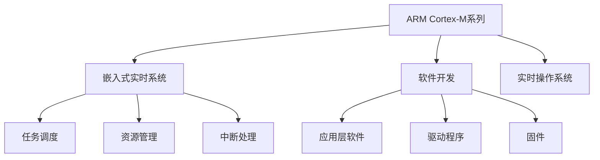

                 

# ARM Cortex-M系列：嵌入式实时系统开发

> 关键词：ARM Cortex-M, 嵌入式实时系统, 软件开发, 实时操作系统, 应用场景

## 1. 背景介绍

在嵌入式系统领域，高性能、低功耗、实时性强的处理器始终是业界关注的焦点。ARM公司推出的Cortex-M系列处理器以其优异的性能、低成本和广泛的应用范围，成为了嵌入式应用的热门选择。本文将重点探讨ARM Cortex-M系列在嵌入式实时系统开发中的应用，涵盖从硬件基础到软件开发、系统部署的方方面面。

## 2. 核心概念与联系

### 2.1 核心概念概述

本节将介绍嵌入式系统开发中的几个关键概念，以及它们之间的联系。

- **ARM Cortex-M系列处理器**：ARM Cortex-M系列是基于ARM Cortex-M架构的一系列高性能、低功耗的微控制器(Cortex-M0-M7)，主要用于嵌入式设备中的低成本和高性能场景。
- **嵌入式实时系统**：实时系统是一种能够在严格时间要求下，及时响应外部事件并处理系统任务的操作系统。嵌入式实时系统要求极高的可靠性和实时性。
- **软件开发**：嵌入式软件开发涉及应用层软件、驱动程序、中/底层固件和操作系统等模块的开发与集成。
- **实时操作系统(RTOS)**：实时操作系统如FreeRTOS、µC/OS-II等，提供任务的调度、资源管理和中断处理等能力，是构建实时系统的关键组件。

这些概念之间的联系如图2-1所示：



### 2.2 核心概念原理和架构的 Mermaid 流程图

```mermaid
erDiagram
    class ARM Cortex-M
    class 嵌入式实时系统
    class 软件开发
    class 实时操作系统
    
    ARM Cortex-M --> 嵌入式实时系统 : 使用
    ARM Cortex-M --> 软件开发 : 应用
    ARM Cortex-M --> 实时操作系统 : 支持
    嵌入式实时系统 --> 任务调度
    嵌入式实时系统 --> 资源管理
    嵌入式实时系统 --> 中断处理
    软件开发 --> 应用层软件
    软件开发 --> 驱动程序
    软件开发 --> 固件
```

## 3. 核心算法原理 & 具体操作步骤

### 3.1 算法原理概述

嵌入式实时系统开发涉及硬件基础和软件开发两个方面，本文将重点讨论软件开发中的关键技术。

- **任务调度算法**：嵌入式实时系统中，任务调度是系统实时性的核心。常见的任务调度算法包括优先级调度算法、循环轮询算法和基于时间片的抢占式调度算法。
- **资源管理算法**：资源管理包括内存管理、任务间通信和同步等。嵌入式实时系统中的资源管理要求高效的内存分配和同步机制，以确保系统的实时性和稳定性。
- **中断处理机制**：中断是嵌入式系统中常用的机制，用于实现事件驱动和实时响应。中断处理机制要求快速响应和高优先级处理，以确保系统的实时性。

### 3.2 算法步骤详解

嵌入式实时系统开发的主要步骤包括：

1. **硬件设计**：选择合适的ARM Cortex-M微控制器，并设计硬件电路。
2. **系统集成**：集成处理器、存储器、输入/输出设备和操作系统等组件。
3. **软件开发**：开发应用层软件、驱动程序和固件等模块。
4. **调试与测试**：对系统进行调试和测试，确保系统可靠性和实时性。

### 3.3 算法优缺点

**优点**：
- ARM Cortex-M系列处理器具有低功耗、高性能和高可靠性的特点，适合嵌入式应用。
- 实时操作系统提供高效的任务调度和资源管理能力，保障系统的实时性和稳定性。
- 开发工具和资源丰富，易于实现应用。

**缺点**：
- 嵌入式系统资源有限，需要优化代码和资源使用。
- 实时系统的开发和调试难度较大，需要深入理解操作系统和调度机制。
- 中断处理和任务调度要求高水平的软件工程技能。

### 3.4 算法应用领域

ARM Cortex-M系列广泛应用于医疗、工业控制、汽车电子、消费电子等领域。以下是几个典型的应用场景：

- **医疗设备**：嵌入式系统在医疗设备中的应用包括电子病历、心率监测和血氧检测等。ARM Cortex-M处理器具有低功耗和高速处理能力，适合实时系统开发。
- **工业控制**：嵌入式系统在工业控制中的应用包括PLC、机器人自动化和生产设备监控等。实时操作系统提供高效的任务调度和资源管理能力，保障系统的可靠性。
- **汽车电子**：嵌入式系统在汽车电子中的应用包括驾驶辅助、娱乐系统和仪表盘控制等。ARM Cortex-M处理器具有低功耗和高可靠性，适合实时系统开发。
- **消费电子**：嵌入式系统在消费电子中的应用包括智能穿戴设备、智能家居和便携式设备等。实时操作系统提供高效的任务调度和资源管理能力，保障系统的稳定性。

## 4. 数学模型和公式 & 详细讲解 & 举例说明

### 4.1 数学模型构建

本节将详细介绍嵌入式实时系统开发中常见的数学模型，包括任务调度、资源管理和中断处理的数学模型。

**任务调度模型**：
任务调度算法通常采用基于优先级的调度策略，模型的输入包括任务数量和任务执行时间，输出为任务调度序列。常用的任务调度算法包括单优先级调度算法、多优先级调度算法和最短剩余时间调度算法等。

**资源管理模型**：
资源管理模型包括内存分配和任务间通信等。内存管理模型通常采用固定大小分配策略和可变大小分配策略等。任务间通信模型包括信号量和消息队列等。

**中断处理模型**：
中断处理模型通常采用中断向量表和堆栈机制等。中断向量表存储中断处理函数的地址，堆栈用于保存中断发生时的上下文信息。

### 4.2 公式推导过程

**任务调度算法公式**：
设任务数量为 $n$，任务执行时间为 $t_i$，任务优先级为 $p_i$。基于优先级的单优先级调度算法可以表示为：
$$
\begin{aligned}
&\text{Scheduling Sequence} = \{ i_1, i_2, \ldots, i_n \} \\
&\text{Scheduling Time} = \sum_{k=1}^n t_{i_k}
\end{aligned}
$$

**内存管理公式**：
假设内存大小为 $M$，任务大小为 $s_i$，内存分配策略为 $A$。固定大小分配策略可以表示为：
$$
A = \{ s_1, s_2, \ldots, s_n \}
$$
可变大小分配策略可以表示为：
$$
\begin{aligned}
&\text{Allocation Size} = \sum_{i=1}^n s_i \\
&\text{Memory Space} = \text{Allocation Size} \leq M
\end{aligned}
$$

**中断处理公式**：
设中断处理函数的地址为 $f_i$，中断向量表大小为 $V$。中断向量表可以表示为：
$$
\text{Interrupt Vector Table} = \{ f_1, f_2, \ldots, f_V \}
$$
中断发生时，保存上下文信息并跳转到中断处理函数地址：
$$
\begin{aligned}
&\text{Stack} = \{ \text{Context} \} \\
&\text{Interrupt Handler Address} = f_i
\end{aligned}
$$

### 4.3 案例分析与讲解

以FreeRTOS操作系统为例，详细讲解ARM Cortex-M系列在嵌入式实时系统开发中的应用。

**任务调度**：
FreeRTOS提供基于优先级的任务调度算法，系统任务分为实时任务和延时任务。实时任务具有较高的优先级，可以在短时间内完成任务；延时任务优先级较低，可以在有空闲资源时执行。任务调度算法可以表示为：
$$
\begin{aligned}
&\text{Task Priority} = \{ p_1, p_2, \ldots, p_n \} \\
&\text{Task Execution Time} = \{ t_1, t_2, \ldots, t_n \}
\end{aligned}
$$

**资源管理**：
FreeRTOS提供内存堆和内存池等内存管理机制。内存堆用于动态分配内存，内存池用于固定大小内存分配。内存管理公式可以表示为：
$$
\begin{aligned}
&\text{Memory Pool} = \{ s_1, s_2, \ldots, s_n \} \\
&\text{Memory Heap} = \text{Heap Size} \geq \sum_{i=1}^n s_i
\end{aligned}
$$

**中断处理**：
FreeRTOS提供中断处理机制，包括中断向量表和堆栈管理。中断处理模型可以表示为：
$$
\begin{aligned}
&\text{Interrupt Vector Table} = \{ f_1, f_2, \ldots, f_V \} \\
&\text{Stack} = \{ \text{Context} \}
\end{aligned}
$$

## 5. 项目实践：代码实例和详细解释说明

### 5.1 开发环境搭建

开发ARM Cortex-M嵌入式实时系统需要以下工具和环境：

- **开发工具**：MDK、IAR、GCC等。
- **调试工具**：JTAG调试器、串口调试等。
- **操作系统**：µC/OS-II、FreeRTOS等。
- **硬件环境**：ARM Cortex-M微控制器、传感器、通信模块等。

### 5.2 源代码详细实现

以下是一个基于ARM Cortex-M微控制器和FreeRTOS操作系统的示例代码，实现了简单的系统定时器和传感器数据采集功能：

```c
#include "freertos/FreeRTOS.h"
#include "freertos/task.h"
#include "freertos/queue.h"
#include "stm32f4xx.h"
#include "system.h"

// 传感器数据采集任务
void vSensorTask(void *pvParameters)
{
    // 传感器数据采集
    // 定时器中断处理
    for(;;)
    {
        // 传感器数据采集
        // 将传感器数据存入队列
        xQueueSendToQueue(sSensorQueue, &sensorData, portMAX_DELAY);
    }
}

int main(void)
{
    // 初始化硬件
    SystemInit();

    // 创建任务
    xTaskCreate(&vSensorTask, "SensorTask", configMINIMAL_STACK_SIZE, NULL, configMINIMAL_CRITICAL_PRIORITY, NULL);

    // 创建定时器中断
    xTaskCreate(&vTimerTask, "TimerTask", configMINIMAL_STACK_SIZE, NULL, configMINIMAL_CRITICAL_PRIORITY, NULL);

    // 创建队列
    sSensorQueue = xQueueCreate(10, sizeof(sensorData));

    // 初始化FreeRTOS
    vTaskStartScheduler();

    return 0;
}

// 定时器任务
void vTimerTask(void *pvParameters)
{
    for(;;)
    {
        // 每隔1秒执行一次
        vTaskDelay(1000 / portTICK_PERIOD_MS);
    }
}
```

### 5.3 代码解读与分析

**系统初始化函数SystemInit**：初始化硬件和操作系统环境。

**传感器数据采集任务vSensorTask**：负责定时读取传感器数据，并将数据存入队列。

**主函数main**：创建传感器任务和定时器任务，创建队列，并启动FreeRTOS。

**定时器任务vTimerTask**：每隔1秒执行一次，用于定时器中断处理。

## 6. 实际应用场景

### 6.1 智能穿戴设备

智能穿戴设备如智能手表、健康监测器等需要实时采集和处理用户数据，具有低功耗、高实时性的要求。ARM Cortex-M处理器和实时操作系统适合此类设备的开发。

**硬件设计**：选择合适的ARM Cortex-M微控制器，设计低功耗电路。

**系统集成**：集成传感器、显示屏和通信模块等硬件设备。

**软件开发**：开发传感器数据采集、健康监测和交互界面等功能。

**调试与测试**：对系统进行测试，确保系统稳定性和实时性。

### 6.2 工业控制系统

工业控制系统如PLC、机器人自动化和生产设备监控等，需要实时处理和控制大量数据。ARM Cortex-M处理器和实时操作系统适合此类系统的开发。

**硬件设计**：选择合适的ARM Cortex-M微控制器，设计控制电路。

**系统集成**：集成传感器、执行器和通信模块等硬件设备。

**软件开发**：开发数据采集、处理和控制等功能。

**调试与测试**：对系统进行测试，确保系统稳定性和实时性。

### 6.3 医疗设备

医疗设备如电子病历、心率监测和血氧检测等，需要实时采集和处理患者数据。ARM Cortex-M处理器和实时操作系统适合此类设备的开发。

**硬件设计**：选择合适的ARM Cortex-M微控制器，设计低功耗电路。

**系统集成**：集成传感器、显示屏和通信模块等硬件设备。

**软件开发**：开发数据采集、分析和显示等功能。

**调试与测试**：对系统进行测试，确保系统稳定性和实时性。

### 6.4 汽车电子

汽车电子如驾驶辅助、娱乐系统和仪表盘控制等，需要实时处理和控制车辆数据。ARM Cortex-M处理器和实时操作系统适合此类系统的开发。

**硬件设计**：选择合适的ARM Cortex-M微控制器，设计控制电路。

**系统集成**：集成传感器、执行器和通信模块等硬件设备。

**软件开发**：开发数据采集、处理和控制等功能。

**调试与测试**：对系统进行测试，确保系统稳定性和实时性。

## 7. 工具和资源推荐

### 7.1 学习资源推荐

- **书籍**：
  - 《ARM Cortex-M嵌入式系统开发实战》：详细讲解了ARM Cortex-M系列的应用和开发。
  - 《实时操作系统原理与应用》：介绍实时操作系统的原理和应用。

- **在线课程**：
  - Coursera上的《嵌入式系统设计》课程：讲解嵌入式系统的硬件和软件开发。
  - Udacity上的《实时系统》课程：讲解实时系统的设计和管理。

- **开发资源**：
  - ARM官网提供的开发工具和资源：包括SDK、开发指南和示例代码。
  - FreeRTOS官方文档：提供详细的API和用户手册。

### 7.2 开发工具推荐

- **IDE**：MDK、IAR、GCC等。
- **调试工具**：JTAG调试器、串口调试等。
- **操作系统**：µC/OS-II、FreeRTOS等。
- **其他工具**：STM32CubeMX、Keil uVision等。

### 7.3 相关论文推荐

- “A Survey on High-Precision Timing and Synchronization in Embedded Real-Time Systems”：介绍嵌入式实时系统中时间同步的最新研究进展。
- “Real-Time Operating Systems for Embedded Systems”：介绍嵌入式实时操作系统的架构和应用。

## 8. 总结：未来发展趋势与挑战

### 8.1 研究成果总结

嵌入式实时系统开发涉及硬件基础和软件开发两个方面，ARM Cortex-M系列处理器和实时操作系统在其中扮演了重要角色。本文详细介绍了ARM Cortex-M系列在嵌入式实时系统开发中的应用，并分析了其优缺点。

### 8.2 未来发展趋势

未来，嵌入式实时系统将继续向着智能化、集成化和低功耗方向发展。ARM Cortex-M系列处理器将继续保持其高性能、低功耗和广泛应用的特点，进一步拓展市场份额。

### 8.3 面临的挑战

嵌入式实时系统开发面临的挑战包括：

- **资源限制**：嵌入式系统资源有限，需要优化代码和资源使用。
- **实时性要求高**：嵌入式系统需要高实时性的处理能力，要求高效的调度和管理。
- **开发复杂度**：嵌入式系统开发需要多方面的知识和技能，开发难度较大。

### 8.4 研究展望

未来的研究可以从以下几个方向进行：

- **优化算法**：研究高效的算法和数据结构，优化系统性能。
- **系统集成**：研究系统集成技术和标准化接口，提高开发效率。
- **软件工程**：研究嵌入式系统软件开发的方法和工具，提高开发质量和效率。
- **新材料和新工艺**：研究新材料和新工艺，降低系统功耗和成本。

## 9. 附录：常见问题与解答

**Q1：ARM Cortex-M系列处理器与其他嵌入式处理器有何不同？**

A: ARM Cortex-M系列处理器具有高性能、低功耗、高可靠性和广泛的生态系统支持。与其他嵌入式处理器相比，Cortex-M系列更适合低成本和高性能的应用场景。

**Q2：嵌入式实时系统开发过程中如何保证系统可靠性？**

A: 嵌入式实时系统开发过程中，需要综合考虑硬件设计、软件工程和系统测试等多个方面。通过合理的资源管理、高效的算法和可靠的操作系统，可以保证系统的可靠性。

**Q3：ARM Cortex-M系列处理器在哪些方面具有优势？**

A: ARM Cortex-M系列处理器具有高性能、低功耗、高可靠性和广泛的生态系统支持。适合用于低成本和高性能的应用场景，如智能穿戴设备、工业控制和汽车电子等。

**Q4：嵌入式实时系统开发中如何优化代码和资源使用？**

A: 嵌入式实时系统开发中，需要优化代码和资源使用以提高系统的性能和效率。常用的优化方法包括代码精简、数据压缩和资源共享等。

**Q5：嵌入式实时系统开发中如何保证系统的实时性？**

A: 嵌入式实时系统开发中，需要采用高效的调度和管理算法，确保系统能够及时响应和处理事件。常用的方法包括优先级调度、时间片轮询和抢占式调度等。

---

作者：禅与计算机程序设计艺术 / Zen and the Art of Computer Programming

