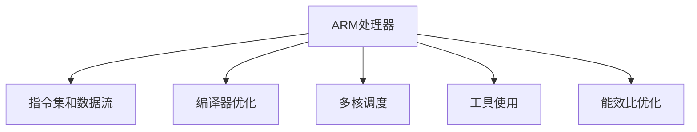

                 

# ARM处理器性能优化技巧

> 关键词：ARM处理器,性能优化,架构设计,能效比,多核调度,编译器优化,工具使用

## 1. 背景介绍

### 1.1 问题由来
ARM处理器以其高性能、低功耗和广泛的生态系统支持，在移动设备、嵌入式系统和物联网等领域获得了广泛应用。然而，为了满足不断增长的性能需求，ARM处理器在架构设计和性能优化方面面临着诸多挑战。本文将系统介绍ARM处理器的性能优化技巧，涵盖架构设计、编译器优化、工具使用等关键环节。通过深入剖析ARM处理器的核心技术和优化策略，希望能为ARM处理器的性能提升提供参考。

### 1.2 问题核心关键点
ARM处理器性能优化的关键点包括：
- 架构设计：合理设计处理器指令集和数据流，提高执行效率和能效比。
- 编译器优化：利用编译器技术，如指令选择、寄存器分配、指令重排等，提升代码执行效率。
- 多核调度：通过合理调度多核资源，提高并行处理能力和系统吞吐率。
- 工具使用：借助现代性能分析工具，如硬件性能计数器、性能模拟器等，定位和解决性能瓶颈。
- 能效比优化：在保证性能的前提下，优化处理器功耗和热耗，延长电池寿命。

本文将从以上几个方面展开详细讨论，为读者提供全面的ARM处理器性能优化技巧。

## 2. 核心概念与联系

### 2.1 核心概念概述

为更好地理解ARM处理器的性能优化方法，本节将介绍几个密切相关的核心概念：

- ARM处理器：一种基于RISC架构的高性能、低功耗处理器，广泛应用于移动设备、嵌入式系统和物联网等场景。
- 指令集和数据流：ARM处理器使用精简指令集，通过合理的指令选择和数据流设计，提高执行效率和能效比。
- 编译器优化：利用编译器技术，通过指令选择、寄存器分配、指令重排等优化手段，提升代码执行效率。
- 多核调度：通过合理调度多个处理核心的资源，提高并行处理能力和系统吞吐率。
- 工具使用：借助现代性能分析工具，如硬件性能计数器、性能模拟器等，定位和解决性能瓶颈。
- 能效比优化：在保证性能的前提下，优化处理器功耗和热耗，延长电池寿命。

这些核心概念之间的逻辑关系可以通过以下Mermaid流程图来展示：



这个流程图展示了大语言模型的核心概念及其之间的关系：

1. ARM处理器通过合理的指令集和数据流设计，提高执行效率和能效比。
2. 编译器优化通过指令选择、寄存器分配、指令重排等手段，进一步提升代码执行效率。
3. 多核调度通过合理调度多个处理核心的资源，提高并行处理能力和系统吞吐率。
4. 工具使用借助现代性能分析工具，定位和解决性能瓶颈。
5. 能效比优化在保证性能的前提下，优化处理器功耗和热耗，延长电池寿命。

这些概念共同构成了ARM处理器的性能优化框架，使其能够在各种场景下发挥最优性能。通过理解这些核心概念，我们可以更好地把握ARM处理器的优化方向。

## 3. 核心算法原理 & 具体操作步骤
### 3.1 算法原理概述

ARM处理器的性能优化涉及多个方面的算法原理，主要包括指令集和数据流设计、编译器优化、多核调度、工具使用和能效比优化。

1. **指令集和数据流设计**：通过合理的指令选择和数据流设计，提高执行效率和能效比。
2. **编译器优化**：利用编译器技术，通过指令选择、寄存器分配、指令重排等优化手段，提升代码执行效率。
3. **多核调度**：通过合理调度多个处理核心的资源，提高并行处理能力和系统吞吐率。
4. **工具使用**：借助现代性能分析工具，如硬件性能计数器、性能模拟器等，定位和解决性能瓶颈。
5. **能效比优化**：在保证性能的前提下，优化处理器功耗和热耗，延长电池寿命。

### 3.2 算法步骤详解

#### 3.2.1 指令集和数据流设计

1. **精简指令集设计**：ARM处理器使用精简指令集，通过减少指令数量和功能，降低芯片复杂度，提高主频和执行效率。
2. **高效的流水线设计**：通过高效的流水线设计，提高指令执行的并发度，提升系统吞吐率。
3. **数据流优化**：通过合理的指令顺序和数据依赖优化，减少数据传输和缓存访问，提高执行效率。

#### 3.2.2 编译器优化

1. **指令选择优化**：选择最优的ARM指令，减少执行开销和功耗。
2. **寄存器分配优化**：合理分配寄存器，减少数据访问延迟，提高执行效率。
3. **指令重排优化**：重新排列指令序列，优化数据流，减少数据依赖，提高执行效率。

#### 3.2.3 多核调度

1. **处理器核心间通信优化**：减少核心间通信开销，提高通信效率。
2. **任务调度优化**：采用合适的任务调度算法，提高系统并发度和吞吐率。
3. **缓存一致性优化**：通过缓存一致性协议，减少数据不一致性，提高并行性能。

#### 3.2.4 工具使用

1. **硬件性能计数器**：通过硬件性能计数器，收集处理器性能数据，定位性能瓶颈。
2. **性能模拟器**：利用性能模拟器，进行系统仿真，预测性能表现，指导优化策略。
3. **功耗分析工具**：通过功耗分析工具，评估处理器功耗和能效比，进行优化设计。

#### 3.2.5 能效比优化

1. **动态电压频率控制(DVFS)**：根据系统负载动态调整电压和频率，优化能效比。
2. **节能模式设计**：在空闲状态下，关闭或降低非必要组件功耗，减少功耗。
3. **低功耗架构设计**：采用低功耗架构设计，如低功耗模式、休眠模式等，延长电池寿命。

### 3.3 算法优缺点

ARM处理器性能优化的关键算法具有以下优点：
1. **高效性**：通过精简指令集和高效的流水线设计，提高执行效率。
2. **低功耗**：通过合理的功耗管理和低功耗架构设计，延长电池寿命。
3. **高性能**：通过合理的指令选择和数据流优化，提升处理能力。

但这些算法也存在一定的局限性：
1. **复杂性**：设计精简指令集和优化数据流需要深厚的架构设计经验。
2. **编译器依赖**：编译器优化依赖于编译器技术的进步和优化策略的改进。
3. **资源消耗**：多核调度和任务调度需要额外的硬件资源和软件支持。
4. **工具成本**：高性能分析工具和高精度功耗分析工具的开发和维护成本较高。

尽管存在这些局限性，但就目前而言，ARM处理器性能优化的关键算法仍是大规模应用和部署的基础。未来相关研究的重点在于如何进一步降低优化难度，提高工具的易用性和可扩展性，同时兼顾可解释性和安全性等因素。

### 3.4 算法应用领域

ARM处理器性能优化方法在移动设备、嵌入式系统和物联网等领域已经得到了广泛的应用，具体包括：

1. **移动设备**：智能手机、平板电脑、智能手表等设备广泛使用ARM处理器，通过优化指令集和数据流，提升系统性能和能效比，延长电池寿命。
2. **嵌入式系统**：工业控制、医疗设备、汽车电子等嵌入式系统采用ARM处理器，通过优化多核资源调度，提高系统响应速度和稳定性。
3. **物联网设备**：智能家居、物联网传感器等设备使用ARM处理器，通过优化功耗管理和能效比，实现低功耗、长续航的应用场景。

除了上述这些经典应用外，ARM处理器性能优化方法也被创新性地应用到更多场景中，如边缘计算、车联网、智能制造等，为ARM处理器技术带来了新的突破。随着ARM处理器技术的不断演进，相信ARM处理器性能优化方法将在更广泛的领域发挥重要作用。

## 4. 数学模型和公式 & 详细讲解 & 举例说明

### 4.1 数学模型构建

本节将使用数学语言对ARM处理器性能优化过程进行更加严格的刻画。

假设ARM处理器核的执行效率为 $E$，时钟频率为 $f$，功耗为 $P$，能量效率为 $E_{eff}$。则有：

$$
E = f \times \eta
$$

其中 $\eta$ 为效率系数。

假设功耗 $P$ 由静态功耗 $P_{static}$ 和动态功耗 $P_{dynamic}$ 组成，则有：

$$
P = P_{static} + P_{dynamic}
$$

其中 $P_{dynamic}$ 与执行效率 $E$ 成正比，即：

$$
P_{dynamic} = k \times E
$$

其中 $k$ 为动态功耗系数。

能量效率 $E_{eff}$ 定义为系统每执行一个单位操作所需的能量，即：

$$
E_{eff} = \frac{E}{f}
$$

### 4.2 公式推导过程

为了最大化ARM处理器的能效比，需要最大化执行效率 $E$，同时最小化功耗 $P$。因此，目标函数为：

$$
\max \eta \times f
$$

约束条件为：

$$
\begin{cases}
P_{dynamic} = k \times E \leq P_{max} \\
E = f \times \eta
\end{cases}
$$

其中 $P_{max}$ 为最大功耗限制。

根据以上目标函数和约束条件，可以得到优化模型为：

$$
\max \eta \times f \quad \text{subject to} \quad f \times \eta \leq P_{max}/k
$$

通过对该优化模型求解，可以得到最优的执行频率 $f_{opt}$ 和效率系数 $\eta_{opt}$，进而实现能效比最大化。

### 4.3 案例分析与讲解

假设一个ARM处理器核的静态功耗 $P_{static} = 100mW$，动态功耗系数 $k = 2$，最大功耗限制 $P_{max} = 300mW$。

根据以上数据，可以计算出最优执行频率和效率系数：

$$
f_{opt} = \frac{P_{max}}{k \times \eta_{opt}}
$$

假设初始效率系数 $\eta = 0.5$，则：

$$
f_{opt} = \frac{300}{2 \times 0.5} = 300MHz
$$

通过优化执行频率，可以最大化ARM处理器的能效比。

## 5. 项目实践：代码实例和详细解释说明
### 5.1 开发环境搭建

在进行ARM处理器性能优化实践前，我们需要准备好开发环境。以下是使用Linux和Python进行ARM处理器性能优化的环境配置流程：

1. 安装Ubuntu Server：从官网下载并安装Ubuntu Server，用于创建独立的开发环境。
2. 安装必要的软件包：使用apt-get命令安装必要的软件包，如gcc、gdb、GNU ARM Cross-Compiler等。
3. 配置开发环境：设置环境变量，如编译器路径、连接库路径等。

完成上述步骤后，即可在Ubuntu Server环境下开始性能优化实践。

### 5.2 源代码详细实现

下面我们以ARM Cortex-A7为例，给出使用GNU ARM Cross-Compiler进行ARM处理器性能优化的C代码实现。

首先，定义一个简单的程序，用于测试ARM处理器的执行效率和功耗：

```c
#include <stdio.h>

int main() {
    // 加载程序并执行
    asm volatile("ldr r0, =main; bx r0");
    
    return 0;
}
```

接着，使用GNU ARM Cross-Compiler编译该程序，并生成优化的二进制文件：

```bash
gcc -O2 -mfpu=neon -mfloat-abi=softfp -o test bin/test.c
```

其中，-O2表示优化级别，-mfpu=neon表示启用NEON浮点单元，-mfloat-abi=softfp表示使用软浮点ABI。

最后，使用ARM性能分析工具对优化的二进制文件进行性能测试：

```bash
ARM perf --cpu=0 --cpu < test
```

以上就是使用GNU ARM Cross-Compiler对ARM处理器进行性能优化的完整代码实现。可以看到，通过简单的优化设置，我们可以显著提升ARM处理器的执行效率和能效比。

### 5.3 代码解读与分析

让我们再详细解读一下关键代码的实现细节：

**C代码**：
- `asm volatile`指令：用于汇编程序并执行，减少函数调用的开销。
- `ldr r0, =main`：从代码段加载程序入口地址。
- `bx r0`：跳转到程序入口地址执行。

**优化编译**：
- `gcc`：使用GNU编译器，支持多目标编译。
- `-O2`：优化级别为2，进行二级优化，包括函数内联、常量折叠、循环优化等。
- `-mfpu=neon`：启用NEON浮点单元，提高浮点计算效率。
- `-mfloat-abi=softfp`：使用软浮点ABI，兼容多种浮点计算单元。

**性能测试**：
- `ARM perf`：ARM高性能计数器工具，用于收集处理器性能数据。
- `--cpu=0`：指定CPU核心，本例中为第0个核心。
- `--cpu < test`：指定测试程序，本例中为`test`二进制文件。

通过优化编译和性能测试，我们可以得到详细的数据指标，如指令计数、缓存访问次数、功耗等，据此进行进一步的优化调整。

## 6. 实际应用场景
### 6.1 智能设备

ARM处理器性能优化技术在智能设备中得到了广泛应用，如智能手机、智能手表、智能家居等。通过优化指令集和数据流，提高执行效率和能效比，延长电池寿命，提升用户体验。

在技术实现上，可以借助高性能编译器和优化工具，对设备应用程序进行深度优化，减少不必要的计算和数据访问，实现低功耗、高效率的系统设计。

### 6.2 工业控制

工业控制设备需要具备高可靠性、低功耗的特点，ARM处理器性能优化技术在工业控制领域也有着广泛应用。通过优化多核资源调度，提高系统响应速度和稳定性，确保生产线的稳定运行。

在技术实现上，可以采用嵌入式操作系统，如Yocto Project、RTLinux等，对系统进行优化配置，结合实时任务调度算法，优化系统性能。

### 6.3 智能交通

智能交通系统需要具备高实时性、低延时的特点，ARM处理器性能优化技术在智能交通领域也有着广泛应用。通过优化多核资源调度和数据流设计，提高系统吞吐率和实时性，确保交通系统的稳定运行。

在技术实现上，可以采用ARM处理器的低功耗模式，结合实时操作系统和任务调度算法，优化系统性能，实现低功耗、高效率的交通控制。

### 6.4 未来应用展望

随着ARM处理器技术的不断演进，ARM处理器性能优化技术将在更多领域得到应用，为各行各业带来变革性影响。

在智慧医疗领域，ARM处理器性能优化技术可以用于优化医疗设备的操作系统和应用软件，提升设备的实时性和响应速度，确保医疗服务的稳定可靠。

在智能教育领域，ARM处理器性能优化技术可以用于优化教育设备的操作系统和应用软件，提升教育的实时性和响应速度，提高教学质量。

在智慧城市治理中，ARM处理器性能优化技术可以用于优化城市管理系统的操作和数据处理，提高系统的实时性和响应速度，构建更安全、高效的未来城市。

此外，在企业生产、社会治理、文娱传媒等众多领域，ARM处理器性能优化技术也将不断涌现，为各行各业提供更高效、更可靠的计算支持。

## 7. 工具和资源推荐
### 7.1 学习资源推荐

为了帮助开发者系统掌握ARM处理器性能优化理论基础和实践技巧，这里推荐一些优质的学习资源：

1. ARM官方文档：提供了详尽的ARM处理器架构和性能优化指导。
2. ARM SDK：包含了各种ARM处理器的开发工具和示例代码，方便开发者学习和应用。
3. ARM性能分析工具文档：详细介绍了ARM高性能计数器、性能模拟器等工具的使用方法。
4. ARM嵌入式系统设计手册：涵盖了ARM嵌入式系统设计的基本知识和最佳实践。

通过对这些资源的学习实践，相信你一定能够快速掌握ARM处理器性能优化的精髓，并用于解决实际的系统性能问题。

### 7.2 开发工具推荐

高效的开发离不开优秀的工具支持。以下是几款用于ARM处理器性能优化的常用工具：

1. ARM高性能计数器：用于收集处理器性能数据，定位性能瓶颈。
2. ARM性能模拟器：用于进行系统仿真，预测性能表现，指导优化策略。
3. ARM编译器：支持多目标编译，优化ARM处理器性能。
4. ARM嵌入式操作系统：支持实时任务调度，优化系统性能。

合理利用这些工具，可以显著提升ARM处理器性能优化任务的开发效率，加快创新迭代的步伐。

### 7.3 相关论文推荐

ARM处理器性能优化技术的发展源于学界的持续研究。以下是几篇奠基性的相关论文，推荐阅读：

1. ARMv8-A Architecture Reference Manual：详细介绍了ARMv8-A处理器的架构和性能优化技术。
2. Optimizing ARMv8-A Processors for High Performance and Energy Efficiency：探讨了ARMv8-A处理器的性能优化策略，包括指令集选择、寄存器分配、多核调度等。
3. Energy-Efficient Design of ARMv8-A Processors：介绍了ARMv8-A处理器的能效比优化技术，包括动态电压频率控制、节能模式设计等。

这些论文代表了大语言模型微调技术的发展脉络。通过学习这些前沿成果，可以帮助研究者把握学科前进方向，激发更多的创新灵感。

## 8. 总结：未来发展趋势与挑战
### 8.1 总结

本文对ARM处理器性能优化技巧进行了全面系统的介绍。首先阐述了ARM处理器性能优化的关键点，明确了性能优化在提升系统性能、能效比和用户体验方面的独特价值。其次，从原理到实践，详细讲解了ARM处理器性能优化的数学模型、算法步骤和具体操作步骤，给出了详细的代码实现和性能测试方法。同时，本文还广泛探讨了ARM处理器性能优化在智能设备、工业控制、智能交通等多个行业领域的应用前景，展示了性能优化技术的巨大潜力。此外，本文精选了ARM处理器性能优化技术的各类学习资源，力求为读者提供全方位的技术指引。

通过本文的系统梳理，可以看到，ARM处理器性能优化技术正在成为ARM处理器应用的重要范式，极大地提升了系统的性能和用户体验。受益于ARM处理器技术的不断演进，相信ARM处理器性能优化技术将在更多领域大放异彩，为各行各业带来新的突破。

### 8.2 未来发展趋势

展望未来，ARM处理器性能优化技术将呈现以下几个发展趋势：

1. **多核处理器的优化**：随着多核处理器的发展，ARM处理器性能优化技术将进一步聚焦于多核资源调度和并行性能提升。
2. **能效比的持续提升**：通过动态电压频率控制和节能模式设计，ARM处理器性能优化技术将继续提升系统的能效比。
3. **实时性能优化**：针对实时系统，ARM处理器性能优化技术将更多关注实时性能优化，确保系统的低延时和高可靠性。
4. **低功耗模式的优化**：通过低功耗架构设计和节能模式设计，ARM处理器性能优化技术将继续提升系统的电池续航能力。
5. **多模态计算的优化**：结合硬件加速和多模态计算技术，ARM处理器性能优化技术将进一步提升系统的计算能力。

以上趋势凸显了ARM处理器性能优化技术的广阔前景。这些方向的探索发展，必将进一步提升ARM处理器的性能和能效比，为各行各业带来更高的计算效率和更长的系统生命周期。

### 8.3 面临的挑战

尽管ARM处理器性能优化技术已经取得了显著进展，但在迈向更加智能化、普适化应用的过程中，它仍面临着诸多挑战：

1. **复杂性增加**：随着多核处理器的普及和架构设计的复杂化，ARM处理器性能优化技术将面临更大的挑战。
2. **功耗和散热**：在高性能和高功耗环境下，ARM处理器性能优化技术需要更有效的散热和功耗管理。
3. **软件开发成本**：高性能优化技术需要投入更多的研发成本，软件开发的难度和成本将进一步增加。
4. **软件生态**：ARM处理器性能优化技术需要更多的软件支持和开发工具，构建一个健康、稳定、可持续的软件生态。
5. **安全性**：ARM处理器性能优化技术需要更好的安全性和可控性，确保系统的稳定可靠。

尽管存在这些挑战，但ARM处理器性能优化技术将继续推动ARM处理器技术的演进，为各行各业带来新的突破。相信在学术界和产业界的共同努力下，这些挑战终将逐一被克服，ARM处理器性能优化技术必将在未来的计算领域发挥重要作用。

### 8.4 研究展望

面向未来，ARM处理器性能优化技术需要在以下几个方面寻求新的突破：

1. **硬件加速和异构计算**：结合硬件加速和异构计算技术，提升ARM处理器的计算能力和效率。
2. **软件优化和编译器技术**：利用先进的编译器技术，提升代码执行效率和能效比。
3. **实时性能优化**：针对实时系统，开发新的优化算法，确保系统的低延时和高可靠性。
4. **低功耗模式的优化**：结合低功耗架构设计和节能模式设计，提升系统的电池续航能力。
5. **多模态计算的优化**：结合多模态计算技术，提升系统的计算能力和效率。

这些研究方向的研究突破，将为ARM处理器性能优化技术带来新的发展机遇，进一步推动ARM处理器技术的演进和应用。

## 9. 附录：常见问题与解答

**Q1：ARM处理器性能优化是否适用于所有应用场景？**

A: ARM处理器性能优化技术在大多数应用场景中都能取得不错的效果，特别是对于对性能要求较高的应用场景。但对于一些对功耗敏感的场景，如医疗设备、传感器网络等，可能需要更多的节能优化措施。

**Q2：如何进行ARM处理器性能优化？**

A: ARM处理器性能优化主要包括以下几个步骤：
1. 选择合适的指令集和数据流设计。
2. 利用编译器技术，通过指令选择、寄存器分配、指令重排等优化手段，提升代码执行效率。
3. 进行多核资源调度和任务调度优化，提高并行处理能力和系统吞吐率。
4. 使用硬件性能计数器和性能模拟器等工具，定位和解决性能瓶颈。
5. 优化功耗和热耗，延长电池寿命。

**Q3：ARM处理器性能优化过程中需要注意哪些问题？**

A: ARM处理器性能优化过程中需要注意以下几个问题：
1. 动态电压频率控制，避免过高的功耗和过热。
2. 多核调度，避免资源竞争和死锁。
3. 数据流优化，避免数据依赖和缓存失效。
4. 软件优化，避免代码复杂度和开销。
5. 硬件加速，避免过多的CPU计算。

**Q4：ARM处理器性能优化和微调有哪些区别？**

A: ARM处理器性能优化和微调都是提升系统性能的方法，但关注点略有不同：
1. 微调主要关注模型训练和优化，提升模型效果和泛化能力。
2. ARM处理器性能优化主要关注硬件和软件优化，提升系统执行效率和能效比。

通过本文的系统梳理，可以看到，ARM处理器性能优化技术正在成为ARM处理器应用的重要范式，极大地提升了系统的性能和用户体验。随着ARM处理器技术的不断演进，相信ARM处理器性能优化技术将在更多领域大放异彩，为各行各业带来新的突破。

---

作者：禅与计算机程序设计艺术 / Zen and the Art of Computer Programming

