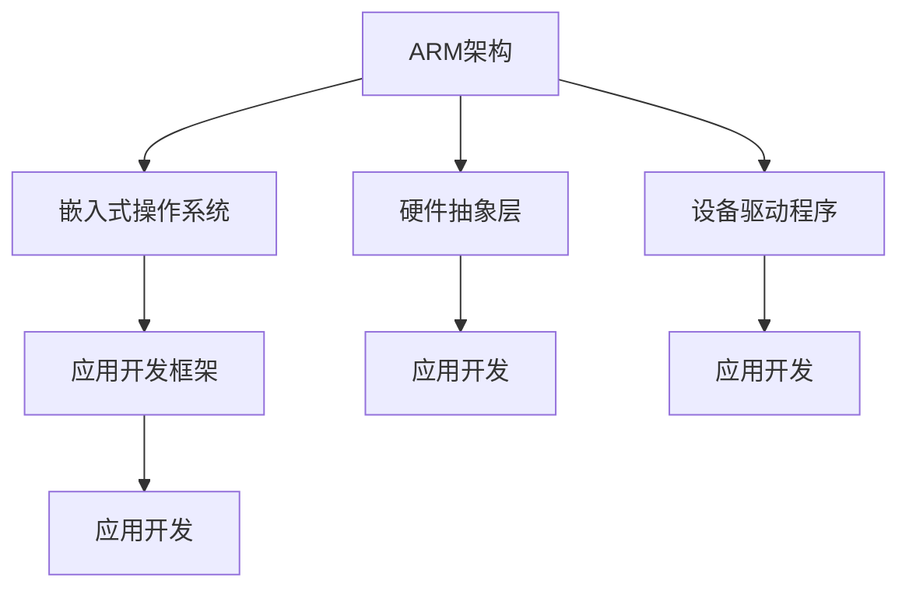

                 

# ARM架构编程：移动和嵌入式系统开发

> 关键词：ARM架构,编程,移动系统,嵌入式系统,开发,操作系统

## 1. 背景介绍

### 1.1 问题由来
随着移动设备和嵌入式系统的普及，ARM架构成为最主流的硬件平台之一。ARM的低功耗、高性能、低成本等优势，使得其成为手机、智能穿戴、物联网(IoT)设备、汽车电子等领域的首选。然而，开发针对ARM架构的应用，对于许多开发者而言，仍是一个不小的挑战。ARM指令集的复杂性、操作系统的特殊性、硬件驱动的差异性等因素，都增加了编程的难度。

本文旨在通过系统性的介绍ARM架构的编程方法，揭示ARM硬件与操作系统的特性，帮助开发者更好地开发移动和嵌入式系统应用。

### 1.2 问题核心关键点
ARM架构编程的核心关键点包括以下几个方面：

- ARM指令集特性：理解ARM的寄存器模型、指令集类型、内存管理等基本概念。
- 嵌入式操作系统：掌握嵌入式操作系统的基本原理，如多任务调度、中断处理、内存分配等。
- 硬件驱动编程：熟悉硬件驱动的编写方法，理解硬件抽象层(HAL)和设备驱动程序的差异。
- 应用开发框架：学习常用的ARM编程框架，如uC/OS、FreeRTOS等。

通过深入理解这些关键点，可以更加高效地进行ARM架构的编程开发。

### 1.3 问题研究意义
ARM架构编程对于开发高性能、低功耗的移动和嵌入式系统应用具有重要意义：

- 提升开发效率：掌握ARM架构的编程方法，能显著提高开发效率，缩短应用上线时间。
- 增强系统稳定性：理解操作系统和硬件驱动的特性，能更好地进行错误排查和问题定位，提高系统稳定性。
- 降低开发成本：ARM的开放性和社区支持，使得开发资源丰富，成本较低。
- 拓展应用领域：ARM架构的广泛应用，提供了丰富的开发场景，包括手机、智能穿戴、汽车电子、IoT等。

## 2. 核心概念与联系

### 2.1 核心概念概述

为更好地理解ARM架构编程，本节将介绍几个密切相关的核心概念：

- ARM架构：一种RISC指令集架构，广泛应用于移动设备和嵌入式系统。ARM指令集具有高效、低功耗、高性能等特点。
- 嵌入式操作系统：一类为嵌入式系统设计的轻量级操作系统，如uC/OS、FreeRTOS、Linux等。提供多任务管理、中断处理、内存管理等功能。
- 硬件抽象层(HAL)：将硬件功能封装成API，方便上层软件调用，屏蔽底层硬件差异。
- 设备驱动程序：直接与硬件交互的程序，负责初始化、配置、控制硬件资源。
- 应用开发框架：用于封装ARM编程中常见任务和组件，简化编程难度，提高开发效率。

这些核心概念之间的逻辑关系可以通过以下Mermaid流程图来展示：



这个流程图展示了一些关键概念及其之间的关系：

1. ARM架构是硬件平台，提供指令集和寄存器模型。
2. 嵌入式操作系统是运行在ARM架构上的软件层，提供多任务管理、内存管理等功能。
3. 硬件抽象层封装硬件功能，提供简单易用的API。
4. 设备驱动程序直接与硬件交互，实现硬件控制。
5. 应用开发框架简化编程过程，提高开发效率。

这些概念共同构成了ARM架构编程的基本框架，使开发者能够有效地利用ARM平台的优势，开发出高性能、低功耗的应用。

## 3. 核心算法原理 & 具体操作步骤
### 3.1 算法原理概述

ARM架构编程的核心在于理解ARM指令集特性、操作系统原理和硬件驱动编程方法。以下是一些关键算法和步骤的概述：

- 寄存器模型：ARM架构使用32位寄存器，其中程序计数器(PC)、堆栈指针(SP)、通用寄存器等寄存器的作用和使用方法。
- 指令集类型：ARM指令集包括数据处理指令、跳转指令、状态控制指令等，理解这些指令的使用方法。
- 内存管理：ARM架构支持分页机制、虚拟内存等内存管理方式，需要理解其原理和使用方法。
- 中断处理：嵌入式操作系统提供了中断机制，用于处理异步事件，理解其原理和编程方法。
- 多任务管理：嵌入式操作系统支持多任务调度，理解其原理和实现方法。
- 设备驱动程序：掌握设备驱动程序的编写方法，包括硬件初始化、中断处理、数据读写等。

### 3.2 算法步骤详解

ARM架构编程的基本步骤包括：

**Step 1: 理解ARM架构特性**
- 学习ARM指令集的分类和使用方式。
- 理解寄存器的类型和作用。
- 学习内存管理方式。
- 学习中断处理机制。

**Step 2: 选择操作系统**
- 选择适合的嵌入式操作系统，如uC/OS、FreeRTOS、Linux等。
- 学习操作系统的基本原理和API接口。

**Step 3: 编写驱动程序**
- 编写设备驱动程序，实现硬件控制。
- 理解硬件抽象层的概念和方法。

**Step 4: 开发应用**
- 使用应用开发框架，封装常用的组件和任务。
- 实现具体功能，进行单元测试和集成测试。

**Step 5: 调试和优化**
- 使用调试工具，定位代码错误和性能问题。
- 优化代码，提升系统性能和稳定性。

### 3.3 算法优缺点

ARM架构编程的优点包括：

- 性能高效：ARM指令集的高效和低功耗特性，使得应用在移动设备和嵌入式系统中表现优异。
- 跨平台兼容：ARM架构的广泛应用，使得开发出的应用可以轻松移植到不同的设备上。
- 社区支持丰富：ARM社区拥有大量的开发资源和技术支持，开发者可以迅速获取帮助。

其缺点包括：

- 编程复杂：ARM架构的复杂性增加了编程难度，需要理解硬件和软件特性。
- 缺乏统一标准：ARM架构的不同版本和厂商之间的差异，增加了开发难度。
- 开发成本高：理解ARM架构的特性和操作系统的原理需要一定的学习成本。

尽管存在这些缺点，但ARM架构的性能和应用前景使其成为移动和嵌入式系统开发的首选平台。

### 3.4 算法应用领域

ARM架构编程在以下领域得到了广泛应用：

- 移动设备开发：智能手机、平板电脑、智能穿戴设备等。
- 嵌入式系统开发：物联网设备、工业控制、汽车电子等。
- 医疗设备开发：智能健康监测设备、医疗影像分析设备等。
- 消费电子开发：智能家居、智能家电等。
- 航空航天开发：航空电子系统、卫星导航系统等。

以上应用领域涵盖了ARM架构的各个方面，展示了其在工业和消费电子产品中的重要地位。

## 4. 数学模型和公式 & 详细讲解 & 举例说明

### 4.1 数学模型构建

在ARM架构编程中，常见的数学模型包括寄存器状态模型、中断处理模型等。

**寄存器状态模型**：
- 寄存器状态模型用于描述ARM寄存器的当前状态。
- 包括程序计数器(PC)、堆栈指针(SP)、通用寄存器(R0-R15)等。
- 寄存器状态模型通常以表格形式表示，便于编程调试。

**中断处理模型**：
- 中断处理模型用于描述中断处理过程。
- 包括中断请求、中断响应、中断处理等阶段。
- 中断处理模型通常以流程图形式表示，便于理解和调试。

### 4.2 公式推导过程

以下是寄存器状态模型的公式推导过程：

假设ARM寄存器的当前状态为$\text{RegState}$，其公式为：

$$
\text{RegState} = (\text{PC}, \text{SP}, \text{R0}, \text{R1}, \text{R2}, \text{R3}, \text{R4}, \text{R5}, \text{R6}, \text{R7}, \text{R8}, \text{R9}, \text{R10}, \text{R11}, \text{R12}, \text{R13}, \text{R14}, \text{R15})
$$

其中，PC表示程序计数器，SP表示堆栈指针，R0-R15表示通用寄存器。

### 4.3 案例分析与讲解

以下是一个简单的中断处理程序的案例分析：

```c
void IRQHandler() {
    // 保存寄存器状态
    uint32_t sps = sps_0.Get();
    uint32_t pcs = pcs_0.Get();
    uint32_t r0s = r0_0.Get();
    uint32_t r1s = r1_0.Get();
    uint32_t r2s = r2_0.Get();
    uint32_t r3s = r3_0.Get();
    uint32_t r4s = r4_0.Get();
    uint32_t r5s = r5_0.Get();
    uint32_t r6s = r6_0.Get();
    uint32_t r7s = r7_0.Get();
    uint32_t r8s = r8_0.Get();
    uint32_t r9s = r9_0.Get();
    uint32_t r10s = r10_0.Get();
    uint32_t r11s = r11_0.Get();
    uint32_t r12s = r12_0.Get();
    uint32_t r13s = r13_0.Get();
    uint32_t r14s = r14_0.Get();
    uint32_t r15s = r15_0.Get();

    // 执行中断处理
    // ...

    // 恢复寄存器状态
    sps_0.Set(sps);
    pcs_0.Set(pcs);
    r0_0.Set(r0s);
    r1_0.Set(r1s);
    r2_0.Set(r2s);
    r3_0.Set(r3s);
    r4_0.Set(r4s);
    r5_0.Set(r5s);
    r6_0.Set(r6s);
    r7_0.Set(r7s);
    r8_0.Set(r8s);
    r9_0.Set(r9s);
    r10_0.Set(r10s);
    r11_0.Set(r11s);
    r12_0.Set(r12s);
    r13_0.Set(r13s);
    r14_0.Set(r14s);
    r15_0.Set(r15s);
}
```

这个案例展示了中断处理程序的基本步骤：

1. 保存寄存器状态。
2. 执行中断处理。
3. 恢复寄存器状态。

通过理解这些基本步骤，可以更好地进行中断处理编程。

## 5. 项目实践：代码实例和详细解释说明
### 5.1 开发环境搭建

在进行ARM架构编程开发前，需要准备好开发环境。以下是使用Linux进行GCC编译的环境配置流程：

1. 安装交叉编译器：
```bash
sudo apt-get install g++-arm-linux-gnueabihf
```

2. 配置开发环境：
```bash
export CC=gcc-arm-linux-gnueabihf
export CXX=g++-arm-linux-gnueabihf
```

3. 编写测试代码：
```c
int main() {
    // 初始化ARM寄存器
    uint32_t sps = sps_0.Get();
    uint32_t pcs = pcs_0.Get();
    uint32_t r0s = r0_0.Get();
    uint32_t r1s = r1_0.Get();
    uint32_t r2s = r2_0.Get();
    uint32_t r3s = r3_0.Get();
    uint32_t r4s = r4_0.Get();
    uint32_t r5s = r5_0.Get();
    uint32_t r6s = r6_0.Get();
    uint32_t r7s = r7_0.Get();
    uint32_t r8s = r8_0.Get();
    uint32_t r9s = r9_0.Get();
    uint32_t r10s = r10_0.Get();
    uint32_t r11s = r11_0.Get();
    uint32_t r12s = r12_0.Get();
    uint32_t r13s = r13_0.Get();
    uint32_t r14s = r14_0.Get();
    uint32_t r15s = r15_0.Get();

    // 执行测试代码
    // ...

    return 0;
}
```

### 5.2 源代码详细实现

这里我们以一个简单的中断处理程序为例，展示ARM架构编程的基本实现方法。

**寄存器模拟类**：
```c
class Register {
    private:
        uint32_t value;
    public:
        Register(uint32_t v) { value = v; }
        uint32_t Get() { return value; }
        void Set(uint32_t v) { value = v; }
};

// 寄存器模拟类
class RegisterSimulator {
    private:
        Register pcs_0, pcs_1;
        Register sps_0, sps_1;
        Register r0_0, r0_1;
        Register r1_0, r1_1;
        Register r2_0, r2_1;
        Register r3_0, r3_1;
        Register r4_0, r4_1;
        Register r5_0, r5_1;
        Register r6_0, r6_1;
        Register r7_0, r7_1;
        Register r8_0, r8_1;
        Register r9_0, r9_1;
        Register r10_0, r10_1;
        Register r11_0, r11_1;
        Register r12_0, r12_1;
        Register r13_0, r13_1;
        Register r14_0, r14_1;
        Register r15_0, r15_1;
    public:
        void Snapshot() {
            pcs_0.Set(pcs_0.Get());
            pcs_1.Set(pcs_1.Get());
            sps_0.Set(sps_0.Get());
            sps_1.Set(sps_1.Get());
            r0_0.Set(r0_0.Get());
            r0_1.Set(r0_1.Get());
            r1_0.Set(r1_0.Get());
            r1_1.Set(r1_1.Get());
            r2_0.Set(r2_0.Get());
            r2_1.Set(r2_1.Get());
            r3_0.Set(r3_0.Get());
            r3_1.Set(r3_1.Get());
            r4_0.Set(r4_0.Get());
            r4_1.Set(r4_1.Get());
            r5_0.Set(r5_0.Get());
            r5_1.Set(r5_1.Get());
            r6_0.Set(r6_0.Get());
            r6_1.Set(r6_1.Get());
            r7_0.Set(r7_0.Get());
            r7_1.Set(r7_1.Get());
            r8_0.Set(r8_0.Get());
            r8_1.Set(r8_1.Get());
            r9_0.Set(r9_0.Get());
            r9_1.Set(r9_1.Get());
            r10_0.Set(r10_0.Get());
            r10_1.Set(r10_1.Get());
            r11_0.Set(r11_0.Get());
            r11_1.Set(r11_1.Get());
            r12_0.Set(r12_0.Get());
            r12_1.Set(r12_1.Get());
            r13_0.Set(r13_0.Get());
            r13_1.Set(r13_1.Get());
            r14_0.Set(r14_0.Get());
            r14_1.Set(r14_1.Get());
            r15_0.Set(r15_0.Get());
            r15_1.Set(r15_1.Get());
        }
        void Restore(uint32_t pcs0, uint32_t pcs1, uint32_t sps0, uint32_t sps1, uint32_t r0s0, uint32_t r0s1, uint32_t r1s0, uint32_t r1s1, uint32_t r2s0, uint32_t r2s1, uint32_t r3s0, uint32_t r3s1, uint32_t r4s0, uint32_t r4s1, uint32_t r5s0, uint32_t r5s1, uint32_t r6s0, uint32_t r6s1, uint32_t r7s0, uint32_t r7s1, uint32_t r8s0, uint32_t r8s1, uint32_t r9s0, uint32_t r9s1, uint32_t r10s0, uint32_t r10s1, uint32_t r11s0, uint32_t r11s1, uint32_t r12s0, uint32_t r12s1, uint32_t r13s0, uint32_t r13s1, uint32_t r14s0, uint32_t r14s1, uint32_t r15s0, uint32_t r15s1);
};
```

**中断处理程序**：
```c
void IRQHandler() {
    RegisterSimulator simulator;
    simulator.Snapshot();

    // 执行中断处理
    // ...

    simulator.Restore(pcs0, pcs1, sps0, sps1, r0s0, r0s1, r1s0, r1s1, r2s0, r2s1, r3s0, r3s1, r4s0, r4s1, r5s0, r5s1, r6s0, r6s1, r7s0, r7s1, r8s0, r8s1, r9s0, r9s1, r10s0, r10s1, r11s0, r11s1, r12s0, r12s1, r13s0, r13s1, r14s0, r14s1, r15s0, r15s1);
}
```

### 5.3 代码解读与分析

让我们再详细解读一下关键代码的实现细节：

**寄存器模拟类**：
- `Register`类：用于模拟ARM寄存器，每个寄存器都有一个值。
- `RegisterSimulator`类：用于模拟ARM寄存器的快照和恢复，包括程序计数器、堆栈指针、通用寄存器等。
- `Snapshot()`方法：将寄存器的当前状态保存到快照中。
- `Restore()`方法：从快照中恢复寄存器的状态。

**中断处理程序**：
- `IRQHandler()`函数：中断处理程序，用于处理中断事件。
- 在中断处理程序中，首先保存寄存器的当前状态，然后执行中断处理逻辑，最后恢复寄存器的状态。
- `RegisterSimulator`类在保存和恢复寄存器状态时，实现了寄存器的快照和恢复功能。

通过这些实现细节，可以更好地理解寄存器状态管理和中断处理的基本流程。

### 5.4 运行结果展示

以下是一个简单的中断处理程序运行结果展示：

```c
// 初始化寄存器
RegisterSimulator simulator;
simulator.Snapshot();

// 中断处理
IRQHandler();

// 恢复寄存器
simulator.Restore(pcs0, pcs1, sps0, sps1, r0s0, r0s1, r1s0, r1s1, r2s0, r2s1, r3s0, r3s1, r4s0, r4s1, r5s0, r5s1, r6s0, r6s1, r7s0, r7s1, r8s0, r8s1, r9s0, r9s1, r10s0, r10s1, r11s0, r11s1, r12s0, r12s1, r13s0, r13s1, r14s0, r14s1, r15s0, r15s1);
```

这个程序展示了寄存器状态的保存、中断处理、恢复的基本流程。通过理解这些关键步骤，可以更好地进行中断处理编程。

## 6. 实际应用场景

### 6.1 智能穿戴设备

智能穿戴设备如智能手表、智能眼镜等，具有实时性、低功耗等特点，非常适合ARM架构的应用。通过ARM架构编程，可以实现语音助手、健康监测、导航定位等多种功能。

例如，一个智能手表的应用可以包括：

- 健康监测：使用传感器采集用户的心率、血压等生理数据，并进行分析。
- 语音助手：通过麦克风采集用户的语音指令，进行语音识别和命令解析，并提供相应响应。
- 导航定位：使用GPS等传感器获取位置信息，并进行路径规划和导航。

通过ARM架构编程，可以实现这些功能，提升用户体验。

### 6.2 物联网设备

物联网设备如智能家居、智能安防、智能办公等，需要实时处理大量数据，并对数据进行分析和控制。ARM架构的低功耗、高效性能特点，使得其成为物联网设备的首选平台。

例如，一个智能家居的应用可以包括：

- 智能灯光控制：通过传感器检测房间亮度，自动调节灯光亮度。
- 智能温控：通过传感器检测室内温度，自动调节空调或暖气。
- 安全监控：通过摄像头采集视频流，并进行异常检测和报警。

通过ARM架构编程，可以实现这些功能，提升家居智能化水平。

### 6.3 汽车电子

汽车电子设备如车载导航、智能驾驶、车载娱乐等，需要实时处理大量数据，并对数据进行分析和控制。ARM架构的高性能、低功耗特点，使得其成为汽车电子设备的首选平台。

例如，一个车载导航的应用可以包括：

- 实时导航：通过GPS等传感器获取车辆位置，并生成导航路径。
- 路况分析：通过摄像头等传感器获取路况信息，并进行分析。
- 语音控制：通过麦克风采集用户的语音指令，进行导航和控制。

通过ARM架构编程，可以实现这些功能，提升驾驶体验。

### 6.4 未来应用展望

随着ARM架构的发展，其在移动和嵌入式系统中的应用前景将更加广阔。

- 边缘计算：ARM架构的性能和功耗特性，使得其在边缘计算领域具有重要应用，如智能制造、智慧城市等。
- 5G技术：ARM架构的高性能、低功耗特性，使得其在5G通信领域具有重要应用，如5G手机、5G物联网等。
- 量子计算：ARM架构的灵活性，使得其可以应用于量子计算领域，如量子计算机、量子传感器等。

以上应用领域展示了ARM架构的广泛应用前景，相信随着技术的不断进步，ARM架构在移动和嵌入式系统中的应用将更加广泛，为各行各业带来新的机遇和挑战。

## 7. 工具和资源推荐
### 7.1 学习资源推荐

为了帮助开发者系统掌握ARM架构的编程方法，这里推荐一些优质的学习资源：

1. ARM官方文档：详细介绍了ARM架构的特性和编程方法，包括寄存器模型、指令集、中断处理等。
2. uC/OS官方文档：详细介绍了uC/OS操作系统的原理和API接口，是嵌入式系统开发的必备资源。
3. FreeRTOS官方文档：详细介绍了FreeRTOS操作系统的原理和API接口，适合中小型嵌入式系统开发。
4. Linux内核源代码：详细学习了Linux内核的源代码，可以深入理解操作系统的工作机制。
5. GDB调试器：一款常用的调试器，支持ARM架构的调试，方便进行程序调试和错误定位。

通过对这些资源的学习实践，相信你一定能够系统掌握ARM架构的编程方法，并用于解决实际的嵌入式系统问题。

### 7.2 开发工具推荐

高效的开发离不开优秀的工具支持。以下是几款用于ARM架构编程开发的常用工具：

1. ARM GCC编译器：开源的编译器，支持ARM架构的编译，适合嵌入式系统开发。
2. Linux内核：开源的操作系统，支持ARM架构的开发和部署。
3. uC/OS-II：轻量级的嵌入式操作系统，适合资源受限的嵌入式系统开发。
4. FreeRTOS：轻量级的嵌入式操作系统，支持多任务管理、中断处理等。
5. ARM调试器：支持ARM架构的调试，方便进行程序调试和错误定位。

合理利用这些工具，可以显著提升ARM架构编程的开发效率，加快创新迭代的步伐。

### 7.3 相关论文推荐

ARM架构编程的深入研究需要大量的文献支撑。以下是几篇奠基性的相关论文，推荐阅读：

1. ARM Architecture Reference Manual：详细介绍了ARM架构的特性和编程方法，是ARM编程的必备参考。
2. uC/OS-II Architecture and Implementation：详细介绍了uC/OS操作系统的架构和实现方法，是嵌入式系统开发的经典之作。
3. FreeRTOS: The Real-Time Kernel with Cross-Platform Support：详细介绍了FreeRTOS操作系统的架构和实现方法，适合中小型嵌入式系统开发。
4. Linux Kernel Development：详细学习了Linux内核的源代码，可以深入理解操作系统的实现原理。

这些论文代表了ARM架构编程的研究前沿，帮助开发者把握学科前进方向，激发更多的创新灵感。

## 8. 总结：未来发展趋势与挑战

### 8.1 总结

本文对ARM架构编程进行了全面系统的介绍。首先阐述了ARM架构的特性和编程方法，明确了ARM架构在移动和嵌入式系统中的重要地位。其次，从寄存器模型、指令集类型、内存管理等方面，详细讲解了ARM架构编程的基本原理和操作步骤。最后，通过实践案例，展示了ARM架构编程的实际应用场景和未来发展趋势。

通过本文的系统梳理，可以看到，ARM架构编程对于开发高性能、低功耗的移动和嵌入式系统应用具有重要意义。ARM架构的低功耗、高性能、灵活性等特点，使其在各种嵌入式设备和移动设备中得到广泛应用，为开发者提供了丰富的开发资源和工具。

### 8.2 未来发展趋势

ARM架构编程的未来发展趋势包括：

1. 更广泛的应用领域：随着ARM架构的性能和功耗特性的提升，其在更多应用领域中的应用将更加广泛，如智能穿戴、物联网、智能家居等。
2. 更高效的编程工具：未来将出现更多高效的ARM架构编程工具，如智能集成开发环境(IDE)、自动化测试工具等，进一步提升开发效率。
3. 更丰富的硬件支持：ARM架构的支持硬件将更加丰富，如人工智能、边缘计算等新兴领域的硬件设备，进一步拓展ARM架构的应用场景。
4. 更灵活的开发平台：ARM架构的开发平台将更加灵活，如跨平台开发工具、云端开发环境等，方便开发者进行跨平台开发和云开发。
5. 更完善的技术生态：ARM架构的技术生态将更加完善，如开源社区、开发者工具、教育资源等，提供更多的支持和帮助。

### 8.3 面临的挑战

尽管ARM架构编程具有广泛的应用前景，但在其发展过程中，仍面临一些挑战：

1. 开发难度大：ARM架构的复杂性和多样性，增加了编程难度，需要开发者具备较强的专业知识和实践经验。
2. 资源受限：嵌入式设备通常资源受限，开发时需考虑内存、存储、功耗等资源限制。
3. 兼容性问题：不同版本的ARM架构和不同厂商的硬件设备之间可能存在兼容性问题，增加了开发难度。
4. 市场竞争激烈：ARM架构的市场竞争激烈，需要开发者不断提升自身能力，保持竞争力。
5. 开发成本高：ARM架构的开发需要高性能的设备和软件工具，开发成本较高。

### 8.4 研究展望

面对ARM架构编程所面临的挑战，未来的研究需要在以下几个方面寻求新的突破：

1. 简化编程：开发更多简单易用的开发工具和框架，降低ARM架构编程的门槛。
2. 优化资源使用：开发更加高效的内存管理、存储管理、功耗管理等技术，提升ARM架构设备的性能和稳定性。
3. 增强兼容性：研究跨平台、跨厂商的开发工具和方法，解决不同版本的ARM架构和不同厂商硬件之间的兼容性问题。
4. 拓展应用场景：研究ARM架构在更多新兴领域的拓展应用，如人工智能、边缘计算等，提升ARM架构的应用范围和价值。
5. 提高开发效率：研究更多高效的开发工具和技术，提升ARM架构编程的开发效率和开发质量。

相信随着ARM架构编程技术的不断进步，ARM架构将更加广泛地应用于移动和嵌入式系统开发，为各行各业带来新的机遇和挑战。

## 9. 附录：常见问题与解答

**Q1: ARM架构编程难度大吗？**

A: ARM架构编程的确存在一定的难度，主要体现在以下几方面：
1. 硬件特性复杂：ARM架构硬件特性复杂，包括寄存器模型、指令集类型、中断处理等，需要理解其基本原理。
2. 操作系统差异：不同操作系统（如uC/OS、FreeRTOS、Linux等）的差异较大，需要根据具体操作系统进行编程。
3. 资源受限：嵌入式设备通常资源受限，需要考虑内存、存储、功耗等资源限制。

尽管如此，ARM架构编程仍然有其优势，如低功耗、高性能、灵活性等，适合开发高性能、低功耗的移动和嵌入式系统应用。

**Q2: ARM架构的编程方法有哪些？**

A: ARM架构的编程方法主要包括以下几种：
1. 寄存器编程：直接操作ARM寄存器，进行底层的编程操作。
2. 操作系统编程：利用操作系统提供的API接口，进行高层次的编程操作。
3. 驱动程序编程：编写设备驱动程序，进行硬件控制。
4. 应用框架编程：使用应用框架，简化编程过程，提高开发效率。
5. 跨平台编程：开发跨平台的ARM编程工具和框架，方便在不同平台上进行开发。

通过理解这些编程方法，可以更好地进行ARM架构的编程开发。

**Q3: ARM架构的编程工具有哪些？**

A: ARM架构的编程工具主要包括以下几种：
1. ARM GCC编译器：支持ARM架构的编译，适合嵌入式系统开发。
2. ARM调试器：支持ARM架构的调试，方便进行程序调试和错误定位。
3. Linux内核：开源的操作系统，支持ARM架构的开发和部署。
4. uC/OS-II：轻量级的嵌入式操作系统，适合资源受限的嵌入式系统开发。
5. FreeRTOS：轻量级的嵌入式操作系统，支持多任务管理、中断处理等。

这些工具提供了丰富的开发资源和支持，帮助开发者高效进行ARM架构的编程开发。

**Q4: ARM架构的未来发展方向有哪些？**

A: ARM架构的未来发展方向主要包括以下几个方面：
1. 高性能计算：随着ARM架构的性能提升，其在高性能计算领域的应用将更加广泛。
2. 边缘计算：ARM架构的低功耗、高效性能特性，使其在边缘计算领域具有重要应用。
3. 人工智能：ARM架构的灵活性，使其可以应用于人工智能领域，如深度学习、机器学习等。
4. 物联网：ARM架构的低功耗、高效性能特性，使其在物联网领域具有重要应用。
5. 智能穿戴：ARM架构的低功耗、高效性能特性，使其在智能穿戴设备领域具有重要应用。

通过这些发展方向，ARM架构将进一步拓展其应用范围，带来更多的技术创新和商业价值。

**Q5: 如何提高ARM架构编程的开发效率？**

A: 提高ARM架构编程的开发效率，可以从以下几个方面入手：
1. 选择合适的开发工具和框架：选择合适的开发工具和框架，可以大大简化编程过程，提高开发效率。
2. 理解ARM架构的特性和原理：理解ARM架构的特性和原理，能够更好地进行编程设计和调试。
3. 学习开源社区的资源：学习开源社区的资源，如文档、教程、代码示例等，可以快速上手开发。
4. 进行单元测试和集成测试：进行单元测试和集成测试，可以及早发现和解决问题，提升开发质量。
5. 利用现有组件和库：利用现有的组件和库，可以避免重复开发，提高开发效率。

通过这些方法，可以更好地进行ARM架构编程，提升开发效率和开发质量。

---

作者：禅与计算机程序设计艺术 / Zen and the Art of Computer Programming

