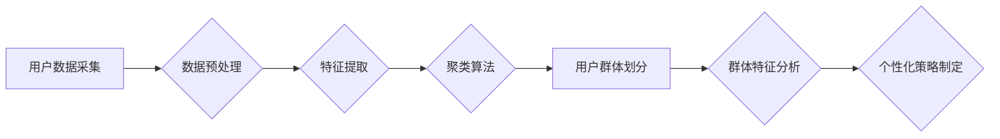

                 

## AI驱动的电商平台用户分群策略

> 关键词：用户分群、电商平台、人工智能、机器学习、聚类算法、个性化推荐、数据分析

## 1. 背景介绍

在当今数据爆炸的时代，电商平台面临着日益激烈的竞争。为了提升用户体验、提高转化率和促进商业增长，精准的用户分群策略显得尤为重要。传统的用户分群方法往往依赖于人工设定规则或简单的用户属性分析，难以捕捉用户行为的复杂性和动态性。而人工智能（AI）技术的兴起为电商平台用户分群带来了新的机遇。

AI驱动的用户分群策略能够利用机器学习算法对海量用户数据进行分析，挖掘用户之间的潜在关联和特征，从而实现更精准、更细粒度的用户分群。这不仅可以帮助电商平台更好地理解用户需求，提供更个性化的产品推荐和营销服务，还能优化运营策略，提高资源利用效率。

## 2. 核心概念与联系

### 2.1 用户分群的概念

用户分群是指将电商平台的用户根据其共同的特征或行为模式进行分类，形成不同的用户群体。每个用户群体拥有独特的属性、需求和偏好，这为电商平台提供了一个更细致的用户画像，有助于制定针对性的营销策略和个性化服务。

### 2.2 AI技术在用户分群中的应用

AI技术，特别是机器学习算法，为用户分群提供了强大的工具。通过对用户行为数据、购买记录、浏览历史、评价反馈等进行分析，AI算法可以自动识别用户之间的相似性和差异性，并将其归类到不同的用户群体中。

**AI驱动的用户分群流程图:**



### 2.3 核心概念联系

用户分群策略的核心在于将用户数据转化为有价值的洞察，并将其应用于实际业务场景。AI技术为用户分群提供了数据分析和模式识别能力，而用户群体分析则为制定个性化策略提供了依据。最终目标是通过精准的用户分群，提升用户体验、提高转化率和促进商业增长。

## 3. 核心算法原理 & 具体操作步骤

### 3.1 算法原理概述

常用的用户分群算法包括K-means聚类、DBSCAN聚类、层次聚类等。这些算法都基于用户的特征相似度进行用户分组，但其具体实现方式和优缺点有所不同。

* **K-means聚类:** 是一种基于距离的聚类算法，它将用户数据划分为K个簇，每个簇的中心点代表该簇的平均特征。
* **DBSCAN聚类:** 是一种基于密度的聚类算法，它将用户数据划分为簇，簇内用户之间距离较近，簇间用户之间距离较远。
* **层次聚类:** 是一种基于层次结构的聚类算法，它将用户数据从单个点开始逐步聚合，最终形成一个包含所有用户的树状结构。

### 3.2 算法步骤详解

以K-means聚类为例，其具体操作步骤如下：

1. **确定聚类数K:** 根据实际情况和业务需求确定需要划分的用户群数量。
2. **随机初始化K个中心点:** 从用户数据中随机选择K个用户作为初始中心点。
3. **计算用户到中心点的距离:** 计算每个用户到所有中心点的距离。
4. **将用户分配到最近的簇:** 将每个用户分配到距离其最近的中心点所在的簇。
5. **更新中心点位置:** 计算每个簇的中心点，并将其作为新的中心点。
6. **重复步骤3-5:** 重复步骤3-5，直到中心点位置不再发生变化或达到预设的迭代次数。

### 3.3 算法优缺点

**K-means聚类算法的优点:**

* 计算简单，效率高。
* 可以处理大规模数据。

**K-means聚类算法的缺点:**

* 需要事先确定聚类数K，这可能会影响聚类结果的准确性。
* 对异常值敏感，容易受到异常值的影响。
* 难以处理非球形的簇。

### 3.4 算法应用领域

K-means聚类算法广泛应用于用户分群、图像识别、文本分类等领域。

## 4. 数学模型和公式 & 详细讲解 & 举例说明

### 4.1 数学模型构建

K-means聚类算法的数学模型可以概括为以下公式：

* **目标函数:**

$$
J(C) = \sum_{i=1}^{K} \sum_{x \in C_i} ||x - \mu_i||^2
$$

其中：

* $J(C)$ 是目标函数，表示所有用户到其所属簇中心点的距离平方和。
* $K$ 是聚类数。
* $C_i$ 是第i个簇。
* $x$ 是一个用户。
* $\mu_i$ 是第i个簇的中心点。

* **中心点更新公式:**

$$
\mu_i = \frac{1}{|C_i|} \sum_{x \in C_i} x
$$

其中：

* $|C_i|$ 是第i个簇的用户数量。

### 4.2 公式推导过程

目标函数的目的是最小化所有用户到其所属簇中心点的距离平方和。中心点更新公式则根据当前簇内用户的平均值更新中心点位置。

通过迭代地更新中心点位置和分配用户到簇，K-means算法最终会收敛到一个局部最优解，即所有用户到其所属簇中心点的距离平方和最小。

### 4.3 案例分析与讲解

假设我们有一个电商平台的用户数据，包含用户的年龄、性别、购买频率、平均消费金额等特征。

我们可以使用K-means聚类算法将用户分为3个簇：

* **簇1:** 年龄较低，性别比例均衡，购买频率高，平均消费金额较低。
* **簇2:** 年龄偏高，性别比例为男性为主，购买频率中等，平均消费金额较高。
* **簇3:** 年龄分布均匀，性别比例均衡，购买频率低，平均消费金额中等。

通过对不同用户群体的分析，电商平台可以制定针对性的营销策略和个性化服务。例如，可以为簇1的用户推荐新品和优惠活动，为簇2的用户推荐高端产品和定制服务，为簇3的用户推荐个性化推荐和会员权益。

## 5. 项目实践：代码实例和详细解释说明

### 5.1 开发环境搭建

本示例使用Python语言和scikit-learn库进行K-means聚类算法的实现。

**所需软件:**

* Python 3.x
* scikit-learn

**安装步骤:**

```bash
pip install scikit-learn
```

### 5.2 源代码详细实现

```python
import pandas as pd
from sklearn.cluster import KMeans
from sklearn.preprocessing import StandardScaler

# 加载用户数据
data = pd.read_csv('user_data.csv')

# 选择需要进行聚类的特征
features = ['age', 'gender', 'purchase_frequency', 'average_spending']
X = data[features]

# 数据标准化
scaler = StandardScaler()
X_scaled = scaler.fit_transform(X)

# 确定聚类数K
K = 3

# 实例化K-means聚类模型
kmeans = KMeans(n_clusters=K, random_state=42)

# 训练模型
kmeans.fit(X_scaled)

# 获取聚类结果
labels = kmeans.labels_

# 将聚类结果添加到用户数据中
data['cluster'] = labels

# 查看聚类结果
print(data.groupby('cluster').mean())
```

### 5.3 代码解读与分析

* **数据加载和特征选择:** 首先加载用户数据，并选择需要进行聚类的特征。
* **数据标准化:** 使用StandardScaler对特征进行标准化，将所有特征的均值为0，标准差为1，避免不同特征尺度差异对聚类结果的影响。
* **聚类模型实例化和训练:** 实例化K-means聚类模型，并指定聚类数K。然后使用fit()方法训练模型，将用户数据聚类到K个簇中。
* **获取聚类结果:** 使用labels属性获取每个用户的聚类标签。
* **结果分析:** 使用groupby()方法对不同用户群体的特征进行统计分析，了解不同群体的特点。

### 5.4 运行结果展示

运行代码后，会输出每个用户群体的平均特征值，例如年龄、性别比例、购买频率和平均消费金额等。通过分析这些特征值，可以了解不同用户群体的特点，并制定针对性的营销策略和个性化服务。

## 6. 实际应用场景

### 6.1 个性化推荐

AI驱动的用户分群可以帮助电商平台更精准地推荐产品。例如，可以为喜欢购买运动装备的用户推荐运动鞋、服装和器材，为喜欢购买化妆品的用户推荐美妆产品和护肤品。

### 6.2 营销策略优化

根据用户群体的特征和行为模式，电商平台可以制定更有效的营销策略。例如，可以针对高消费用户提供高端产品和定制服务，针对低消费用户提供优惠活动和折扣券。

### 6.3 内容定制

AI驱动的用户分群可以帮助电商平台定制个性化的内容，例如推荐相关的文章、视频和活动。

### 6.4 未来应用展望

随着人工智能技术的不断发展，AI驱动的用户分群策略将应用于更多场景，例如：

* **精准广告投放:** 根据用户群体的特征和兴趣爱好，精准投放广告，提高广告转化率。
* **用户体验优化:** 根据用户群体的行为模式，优化网站布局、产品设计和服务流程，提升用户体验。
* **新产品开发:** 通过分析用户群体的需求和偏好，开发更符合市场需求的新产品。

## 7. 工具和资源推荐

### 7.1 学习资源推荐

* **书籍:**
    * 《Python机器学习》
    * 《机器学习实战》
* **在线课程:**
    * Coursera: Machine Learning
    * edX: Artificial Intelligence

### 7.2 开发工具推荐

* **Python:** 
    * scikit-learn: 机器学习库
    * pandas: 数据分析库
    * matplotlib: 数据可视化库
* **云平台:**
    * AWS
    * Azure
    * Google Cloud Platform

### 7.3 相关论文推荐

* **K-means聚类算法:**
    * Lloyd, S. (1982). Least squares quantization in PCM. IEEE Transactions on Information Theory, 28(4), 40-48.
* **用户分群:**
    * Jain, A. K. (2010). Data clustering: 50 years beyond K-means. Pattern Recognition Letters, 31(8), 651-666.

## 8. 总结：未来发展趋势与挑战

### 8.1 研究成果总结

AI驱动的用户分群策略为电商平台提供了更精准、更细粒度的用户画像，帮助其制定更有效的营销策略和个性化服务。

### 8.2 未来发展趋势

* **更精准的用户分群:** 利用更先进的机器学习算法和数据分析技术，实现更精准的用户分群。
* **动态的用户分群:** 随着用户行为的不断变化，用户分群策略也需要动态调整，以保持其准确性和有效性。
* **多维度的用户分群:** 将用户特征、行为模式、购买历史等多维度信息综合考虑，构建更全面的用户画像。

### 8.3 面临的挑战

* **数据质量:** AI驱动的用户分群策略依赖于高质量的用户数据，而现实中数据往往存在缺失、错误和噪声等问题。
* **算法复杂度:** 一些先进的机器学习算法计算复杂度较高，难以在实际应用中进行部署和维护。
* **隐私保护:** 用户数据涉及到个人隐私，需要采取有效的措施保护用户数据安全。

### 8.4 研究展望

未来，AI驱动的用户分群策略将继续朝着更精准、更动态、更全面的方向发展，为电商平台提供更强大的数据分析和决策支持能力。


## 9. 附录：常见问题与解答

**Q1: 如何确定聚类数K？**

**A1:** 可以使用肘部法、Silhouette分析等方法来确定最佳的聚类数K。

**Q2: K-means聚类算法对异常值敏感吗？**

**A2:** 是的，K-means聚类算法对异常值敏感，可能会导致聚类结果不准确。可以使用数据清洗和异常值处理技术来解决这个问题。

**Q3: K-means聚类算法只能处理球形的簇吗？**

**A3:** 不完全正确，K-means聚类算法对簇形状有一定的限制，难以处理非球形的簇。可以使用DBSCAN等算法来处理非球形的簇。


作者：禅与计算机程序设计艺术 / Zen and the Art of Computer Programming 
<end_of_turn>

