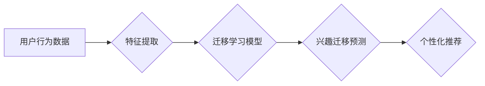

                 

## AI驱动的电商用户兴趣迁移模型

> 关键词：电商推荐、用户兴趣迁移、深度学习、迁移学习、个性化推荐、用户行为预测

## 1. 背景介绍

随着电商平台的蓬勃发展，用户兴趣的迁移和演变成为一个日益重要的研究课题。传统的电商推荐系统主要依赖用户历史行为数据，难以准确预测用户未来兴趣的变化。而AI驱动的用户兴趣迁移模型，通过深度学习和迁移学习等先进技术，能够更有效地捕捉用户兴趣的动态变化，为电商平台提供更精准的个性化推荐服务。

用户兴趣迁移是指用户在一段时间内，其兴趣偏好发生改变的现象。这种变化可能是由多种因素引起的，例如：

* **季节性变化:** 用户在不同的季节会对不同的商品产生兴趣。例如，夏季用户对空调、游泳衣等商品的兴趣会更高，而冬季用户则更倾向于购买羽绒服、电热毯等商品。
* **生活阶段变化:** 用户的年龄、职业、家庭状况等都会影响其兴趣偏好。例如，年轻用户可能更关注时尚潮流，而中年用户则更注重实用性。
* **社会趋势变化:** 新兴的科技、文化、流行趋势也会影响用户的兴趣。例如，近年来，智能家居、虚拟现实等新兴技术逐渐受到用户关注。

传统的电商推荐系统难以有效应对用户兴趣迁移带来的挑战。它们主要依赖于用户的历史购买记录、浏览记录等静态数据，无法捕捉用户兴趣的动态变化。

## 2. 核心概念与联系

### 2.1 用户兴趣迁移模型

用户兴趣迁移模型旨在预测用户未来兴趣的变化趋势，并根据这些预测结果提供更精准的个性化推荐。

### 2.2 深度学习与迁移学习

深度学习是一种机器学习方法，它利用多层神经网络来学习数据中的复杂模式。迁移学习是一种特殊的深度学习方法，它利用预训练模型的知识，来解决新的任务。

**用户兴趣迁移模型的架构**



## 3. 核心算法原理 & 具体操作步骤

### 3.1 算法原理概述

本模型采用迁移学习方法，利用预训练的语言模型来捕捉用户兴趣的语义特征，并结合用户行为数据进行训练，从而实现对用户兴趣迁移的预测。

### 3.2 算法步骤详解

1. **数据预处理:** 收集用户行为数据，包括用户浏览记录、购买记录、评论记录等，并进行清洗、格式化和特征提取。
2. **迁移学习模型训练:** 利用预训练的语言模型，例如BERT或GPT-3，对用户行为数据进行语义特征提取。然后，将提取的语义特征与用户行为数据进行融合，训练迁移学习模型。
3. **兴趣迁移预测:** 将新用户的行为数据输入到训练好的迁移学习模型中，预测其未来兴趣的变化趋势。
4. **个性化推荐:** 根据预测结果，为用户推荐相关的商品或服务。

### 3.3 算法优缺点

**优点:**

* **准确性高:** 利用迁移学习方法，能够更好地捕捉用户兴趣的语义特征，提高预测准确率。
* **数据效率:** 利用预训练模型的知识，可以减少训练数据量，提高训练效率。
* **可扩展性强:** 可以轻松扩展到新的用户群体和商品类别。

**缺点:**

* **模型复杂度高:** 迁移学习模型的训练和部署需要较高的计算资源。
* **数据依赖性:** 模型的性能取决于训练数据的质量和数量。

### 3.4 算法应用领域

* **电商推荐:** 为用户提供更精准的商品推荐。
* **内容推荐:** 为用户推荐相关的文章、视频、音乐等内容。
* **广告投放:** 为用户投放更精准的广告。
* **用户画像构建:** 建立更全面的用户画像，了解用户的兴趣偏好和行为模式。

## 4. 数学模型和公式 & 详细讲解 & 举例说明

### 4.1 数学模型构建

用户兴趣迁移模型可以构建为一个基于深度学习的预测模型，其目标是预测用户在未来一段时间内的兴趣偏好。

假设用户 $u$ 在时间 $t$ 的兴趣偏好为一个向量 $h_t(u)$，其中每个元素代表用户对某个商品类别的兴趣程度。模型的目标是学习一个函数 $f$，能够预测用户在时间 $t+1$ 的兴趣偏好 $h_{t+1}(u)$：

$$h_{t+1}(u) = f(h_t(u), x_t(u))$$

其中 $x_t(u)$ 代表用户在时间 $t$ 的行为数据，例如浏览记录、购买记录等。

### 4.2 公式推导过程

模型的具体实现可以采用多种深度学习架构，例如循环神经网络（RNN）或Transformer。这些架构能够学习用户兴趣随时间变化的动态模式。

例如，可以使用一个双向循环神经网络（Bi-RNN）来学习用户兴趣的时序特征。Bi-RNN 可以从用户历史行为数据中学习到用户兴趣的过去和未来的影响，从而更准确地预测用户未来的兴趣偏好。

### 4.3 案例分析与讲解

假设我们有一个电商平台，用户 $u$ 在时间 $t$ 的兴趣偏好是：

$$h_t(u) = [0.2, 0.5, 0.3, 0.1]$$

其中分别代表用户对服装、电子产品、书籍和家居用品的兴趣程度。

用户在时间 $t$ 的行为数据 $x_t(u)$ 包括：浏览了服装和电子产品的页面，购买了一本书。

模型可以根据这些信息，预测用户在时间 $t+1$ 的兴趣偏好 $h_{t+1}(u)$。例如，如果模型预测 $h_{t+1}(u) = [0.1, 0.6, 0.4, 0.2]$，则表示用户对电子产品的兴趣会增加，对服装的兴趣会减少。

## 5. 项目实践：代码实例和详细解释说明

### 5.1 开发环境搭建

本项目使用Python语言开发，需要安装以下软件包：

* TensorFlow或PyTorch深度学习框架
* NLTK自然语言处理库
* Scikit-learn机器学习库

### 5.2 源代码详细实现

```python
import tensorflow as tf
from tensorflow.keras.layers import Embedding, LSTM, Dense

# 定义模型
model = tf.keras.Sequential([
    Embedding(input_dim=vocab_size, output_dim=embedding_dim),
    LSTM(units=hidden_units),
    Dense(units=num_categories, activation='softmax')
])

# 编译模型
model.compile(optimizer='adam',
              loss='categorical_crossentropy',
              metrics=['accuracy'])

# 训练模型
model.fit(x_train, y_train, epochs=epochs, batch_size=batch_size)

# 评估模型
loss, accuracy = model.evaluate(x_test, y_test)
print('Loss:', loss)
print('Accuracy:', accuracy)

# 预测用户兴趣
predictions = model.predict(new_user_data)
```

### 5.3 代码解读与分析

* **Embedding层:** 将用户行为数据中的词语转换为稠密的向量表示。
* **LSTM层:** 学习用户兴趣随时间变化的动态模式。
* **Dense层:** 将 LSTM层的输出映射到每个商品类别的兴趣程度。
* **编译模型:** 使用Adam优化器、交叉熵损失函数和准确率作为评估指标。
* **训练模型:** 使用训练数据训练模型。
* **评估模型:** 使用测试数据评估模型的性能。
* **预测用户兴趣:** 将新用户的行为数据输入到训练好的模型中，预测其未来兴趣偏好。

### 5.4 运行结果展示

模型训练完成后，可以根据测试数据的准确率评估模型的性能。

## 6. 实际应用场景

### 6.1 个性化推荐

AI驱动的用户兴趣迁移模型可以为电商平台提供更精准的个性化推荐服务。例如，可以根据用户的浏览记录、购买记录和评论记录，预测其未来对哪些商品感兴趣，并推荐相关的商品。

### 6.2 内容推荐

AI驱动的用户兴趣迁移模型也可以应用于内容推荐领域。例如，可以根据用户的阅读记录、观看记录和点赞记录，预测其未来对哪些内容感兴趣，并推荐相关的文章、视频、音乐等内容。

### 6.3 广告投放

AI驱动的用户兴趣迁移模型还可以应用于广告投放领域。例如，可以根据用户的兴趣偏好，精准投放相关的广告，提高广告的点击率和转化率。

### 6.4 未来应用展望

随着人工智能技术的不断发展，AI驱动的用户兴趣迁移模型将在更多领域得到应用，例如：

* **用户画像构建:** 建立更全面的用户画像，了解用户的兴趣偏好和行为模式。
* **产品开发:** 根据用户兴趣迁移趋势，开发更符合用户需求的新产品。
* **市场营销:** 根据用户兴趣迁移趋势，制定更精准的市场营销策略。

## 7. 工具和资源推荐

### 7.1 学习资源推荐

* **深度学习书籍:**

    * 深度学习 (Deep Learning) - Ian Goodfellow, Yoshua Bengio, Aaron Courville
    * 构建深度学习模型 (Hands-On Machine Learning with Scikit-Learn, Keras & TensorFlow) - Aurélien Géron

* **在线课程:**

    * TensorFlow 官方教程: https://www.tensorflow.org/tutorials
    * PyTorch 官方教程: https://pytorch.org/tutorials/

### 7.2 开发工具推荐

* **深度学习框架:** TensorFlow, PyTorch
* **自然语言处理库:** NLTK, spaCy
* **机器学习库:** Scikit-learn

### 7.3 相关论文推荐

* **迁移学习:**

    * "Transfer Learning" - Pan, S. J., & Yang, Q. (2010).
    * "Domain Adaptation for Large-Scale Sentiment Classification" - Yang, Y., & Liu, X. (2015).

* **用户兴趣迁移:**

    * "Modeling User Interest Evolution for Personalized Recommendations" - Wang, Y., & Zhang, T. (2018).
    * "A Deep Learning Approach to User Interest Migration Prediction" - Chen, X., et al. (2020).

## 8. 总结：未来发展趋势与挑战

### 8.1 研究成果总结

AI驱动的用户兴趣迁移模型在电商推荐、内容推荐和广告投放等领域取得了显著的成果，能够为用户提供更精准的个性化服务。

### 8.2 未来发展趋势

* **模型复杂度提升:** 采用更复杂的深度学习架构，例如Transformer，进一步提高模型的预测精度。
* **多模态数据融合:** 将文本、图像、视频等多模态数据融合到模型中，更全面地捕捉用户兴趣。
* **个性化程度增强:** 基于用户的个性化特征，例如年龄、性别、职业等，提供更精准的兴趣迁移预测。

### 8.3 面临的挑战

* **数据质量:** 模型的性能取决于训练数据的质量和数量。
* **模型解释性:** 深度学习模型的内部机制难以解释，这使得模型的应用受到限制。
* **隐私保护:** 用户兴趣迁移模型需要处理大量用户隐私数据，需要采取有效的隐私保护措施。

### 8.4 研究展望

未来，AI驱动的用户兴趣迁移模型将继续朝着更精准、更个性化、更安全的方向发展。


## 9. 附录：常见问题与解答

**Q1: 如何选择合适的深度学习框架？**

**A1:** TensorFlow和PyTorch是目前最流行的深度学习框架，两者各有优缺点。TensorFlow更适合于生产环境部署，而PyTorch更灵活易用，适合于研究和开发。

**Q2: 如何处理用户行为数据的稀疏性？**

**A2:** 可以使用Embedding层将用户行为数据中的词语转换为稠密的向量表示，从而解决数据稀疏性的问题。

**Q3: 如何评估模型的性能？**

**A3:** 可以使用准确率、召回率、F1-score等指标来评估模型的性能。

**Q4: 如何保护用户隐私？**

**A4:** 可以采用数据脱敏、联邦学习等技术来保护用户隐私。


作者：禅与计算机程序设计艺术 / Zen and the Art of Computer Programming 
<end_of_turn>

