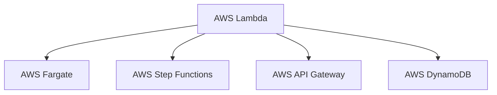

                 

# AWS Serverless应用开发

在云计算快速发展的今天，Serverless架构因其零管理、高扩展性、低成本等优势，成为越来越多开发者和企业的首选。AWS作为云服务市场的领导者，提供了丰富的Serverless服务和工具，使得开发者可以更轻松、高效地构建和部署Serverless应用。本文将详细阐述AWS Serverless应用的开发流程、关键技术和最佳实践，帮助读者全面掌握AWS Serverless应用的开发技能。

## 1. 背景介绍

### 1.1 问题由来

随着云计算的普及，企业IT架构逐渐向云原生化、自动化、平台化方向演进。传统的虚拟机、物理机等基础设施管理复杂、成本高昂，难以快速响应业务需求。Serverless架构通过将计算资源的按需分配和自动扩展，极大地简化了应用开发和运维过程。AWS作为Serverless领域的佼佼者，提供了多种Serverless服务，如AWS Lambda、AWS Fargate、AWS Step Functions等，支持开发者快速构建高可用、高弹性的Serverless应用。

### 1.2 问题核心关键点

AWS Serverless应用开发的核心关键点在于如何高效利用AWS提供的Serverless服务，实现应用的快速构建、高效部署、灵活扩展和低成本运行。

- 快速构建：利用AWS Serverless服务快速搭建应用功能，无需关注底层资源管理。
- 高效部署：通过CI/CD管道自动化应用部署，实现无缝集成、快速迭代。
- 灵活扩展：根据业务需求自动扩展计算资源，保证应用的高可用性和性能。
- 低成本运行：按需计费，避免资源浪费，降低IT基础设施投入。

### 1.3 问题研究意义

研究AWS Serverless应用开发，对于提高企业的IT效率、降低IT成本、提升业务响应速度具有重要意义：

1. 提升开发效率：利用AWS Serverless服务，快速搭建应用原型，缩短开发周期，提升创新速度。
2. 优化运维成本：自动化、平台化的运维方式，降低人工运维成本，提高系统稳定性和可扩展性。
3. 适应市场变化：按需扩展资源，确保应用能够快速应对业务需求的变化，提升市场竞争力。
4. 数据驱动决策：通过Serverless应用收集的数据，洞察用户行为、市场趋势，驱动业务决策。

## 2. 核心概念与联系

### 2.1 核心概念概述

为更好地理解AWS Serverless应用的开发流程和关键技术，本节将介绍几个密切相关的核心概念：

- AWS Lambda：AWS提供的无服务器计算服务，支持开发者以代码形式定义应用，按需运行，无需管理底层资源。
- AWS Fargate：AWS的容器化计算服务，支持开发者以容器化方式部署应用，自动管理底层资源。
- AWS Step Functions：AWS的无代码流程编排服务，支持开发者以图形界面的方式定义应用流程，实现自动化的任务调度。
- AWS API Gateway：AWS的API管理服务，支持开发者快速构建RESTful API，实现无状态的请求处理。
- AWS DynamoDB：AWS的NoSQL数据库服务，支持开发者以Key-Value对方式存储和检索数据，实现高可用性和低延迟访问。

这些核心概念之间的逻辑关系可以通过以下Mermaid流程图来展示：



这个流程图展示了几类主要的AWS Serverless服务及其关联关系：

1. AWS Lambda是基础计算服务，支持无服务器计算和函数调用。
2. AWS Fargate是在AWS Lambda上运行的容器化应用，提供更强的环境隔离和资源管理。
3. AWS Step Functions通过图形化编排，调用多个AWS服务实现复杂业务流程的自动化。
4. AWS API Gateway提供RESTful API接口，支持API的快速搭建和版本管理。
5. AWS DynamoDB提供NoSQL数据库服务，支持高性能数据存储和检索。

这些服务相互配合，可以构建功能丰富、灵活可扩展、高性能低成本的Serverless应用。

## 3. 核心算法原理 & 具体操作步骤
### 3.1 算法原理概述

AWS Serverless应用的开发原理基于事件驱动和无状态化设计。开发者通过定义事件触发器（如API请求、定时任务、消息队列等），将计算任务分配给AWS Lambda函数执行。Lambda函数通过调用AWS Step Functions等协同服务，实现复杂的业务逻辑和任务调度。整个过程通过无状态的RESTful API接口和无SQL数据库存储，实现高可用性和高性能。

形式化地，假设AWS Serverless应用中有一个Lambda函数$f(x)$，其输入为$x$，输出为$y$。则应用开发流程可以描述为：

1. 定义Lambda函数$f(x)$，指定输入参数$x$和输出参数$y$。
2. 设置事件触发器$T$，如API请求、定时任务等，指定触发条件和频率。
3. 配置AWS Step Functions流程$p$，指定$f(x)$的前置任务和后续任务。
4. 构建RESTful API接口$G$，指定API请求路径、方法、参数等。
5. 配置AWS DynamoDB表$d$，指定Key-Value存储结构，设置索引和访问控制。

基于以上流程，应用的整体执行过程可以表示为：

$$
\mathcal{P}(f, T, p, G, d) = \{\text{Event Triggered}, f(x), p(\text{Task})\}
$$

其中$\mathcal{P}$表示应用执行流程，$T$表示事件触发器，$p$表示Step Functions流程，$G$表示API接口，$d$表示数据库表。

### 3.2 算法步骤详解

AWS Serverless应用开发主要分为以下几个关键步骤：

**Step 1: 定义Lambda函数**
- 在AWS Management Console或AWS CLI上创建Lambda函数，指定函数名称、运行时、内存配置等。
- 在Lambda函数中编写代码，实现具体业务逻辑，如数据处理、API请求、数据库操作等。

**Step 2: 设置事件触发器**
- 在Lambda函数中配置事件触发器，指定触发源和触发条件。
- 使用AWS API Gateway等服务作为触发器，接收API请求并自动调用Lambda函数。
- 使用Amazon S3、AWS CloudWatch Events等作为触发器，实现定时任务和消息队列功能。

**Step 3: 配置Step Functions流程**
- 在AWS Step Functions控制台创建流程，设计流程中的各个任务。
- 将Lambda函数作为任务节点，通过输入输出接口连接前后任务。
- 配置流程的触发器和状态机，实现任务的同步和异步执行。

**Step 4: 构建API接口**
- 在AWS API Gateway控制台创建API，定义API路径、方法、参数等。
- 配置API的请求转发规则，将API请求路由到Lambda函数进行处理。
- 使用API Gateway的安全策略和访问控制，保护API接口安全。

**Step 5: 配置数据库表**
- 在AWS DynamoDB控制台创建数据库表，指定数据结构。
- 配置表的属性、索引和读写权限，实现高效的数据存储和访问。
- 使用AWS Data Pipeline等工具，实现数据库数据的同步和导入。

通过以上步骤，可以构建一个功能丰富、高可用、高性能的AWS Serverless应用。

### 3.3 算法优缺点

AWS Serverless应用的开发具有以下优点：
1. 简化开发过程：利用AWS Serverless服务，无需关注底层资源管理，减少开发复杂度。
2. 提高部署效率：通过CI/CD管道，自动化应用部署，缩短开发周期，提升迭代速度。
3. 优化资源利用：按需计费，避免资源浪费，降低IT基础设施成本。
4. 增强弹性扩展：根据业务需求自动扩展计算资源，确保应用的高可用性和性能。
5. 数据驱动决策：通过Serverless应用收集的数据，洞察用户行为、市场趋势，驱动业务决策。

同时，该方法也存在以下局限性：
1. 性能瓶颈：由于事件驱动和无状态化设计，AWS Serverless应用可能面临高延迟和低吞吐量的问题。
2. 扩展成本：虽然按需计费，但频繁的函数调用和事件触发器可能带来扩展成本。
3. 安全性问题：由于应用依赖云平台，存在云服务安全漏洞的风险。
4. 学习曲线：对于初学者，AWS Serverless应用的开发和学习成本较高。

尽管存在这些局限性，但就目前而言，AWS Serverless应用的开发模式仍然是大规模应用开发的主流范式。未来相关研究的重点在于如何进一步降低开发和部署成本，提高应用的可扩展性和性能，同时兼顾安全性和用户隐私。

### 3.4 算法应用领域

AWS Serverless应用已经在多个行业得到广泛应用，覆盖了金融、医疗、电商、物流等多个领域，具体应用场景包括：

- 金融风险管理：利用Lambda函数处理实时交易数据，通过API接口提供风险评估和预警。
- 医疗健康咨询：通过API接口接收用户咨询请求，调用Lambda函数查询病历和处理数据，实现智能健康咨询服务。
- 电子商务推荐：利用Lambda函数分析用户行为数据，通过API接口推送个性化推荐内容。
- 物流配送优化：通过API接口获取物流信息，调用Lambda函数进行路径规划和配送优化。

除了上述这些经典应用场景外，AWS Serverless应用还被创新性地应用到更多场景中，如智能客服、数据分析、物联网等，为各行各业带来了新的创新机遇。

## 4. 数学模型和公式 & 详细讲解 & 举例说明
### 4.1 数学模型构建

假设AWS Lambda函数$f(x)$的输入为$x$，输出为$y$。则应用开发流程的数学模型可以表示为：

$$
\mathcal{P}(f, T, p, G, d) = \{\text{Event Triggered}, f(x), p(\text{Task})\}
$$

其中，$\mathcal{P}$表示应用执行流程，$T$表示事件触发器，$p$表示Step Functions流程，$G$表示API接口，$d$表示数据库表。

### 4.2 公式推导过程

以下我们以一个简单的AWS Serverless应用为例，推导其数学模型的推导过程。

假设应用处理一个电商平台的订单请求，需要执行以下几个步骤：
1. 接收订单请求，记录订单信息到DynamoDB表中。
2. 根据订单信息，查询用户信息。
3. 调用支付API，处理订单支付。
4. 更新订单状态，通知用户处理结果。

数学模型可以表示为：

$$
\mathcal{P}(f, T, p, G, d) = \{\text{Event Triggered}, f_{1}(\text{Order}), p(\text{User Query}), f_{2}(\text{Payment}), f_{3}(\text{Order Update})\}
$$

其中：
- $f_{1}(\text{Order})$表示将订单信息记录到DynamoDB表中的Lambda函数。
- $p(\text{User Query})$表示查询用户信息的Step Functions流程。
- $f_{2}(\text{Payment})$表示处理订单支付的Lambda函数。
- $f_{3}(\text{Order Update})$表示更新订单状态的Lambda函数。

通过以上数学模型，可以清晰地描述应用的执行流程，方便后续的开发和优化。

### 4.3 案例分析与讲解

以下是一个基于AWS Serverless架构构建的电商订单处理系统的案例分析：

**需求分析：**
- 接收订单请求，记录订单信息到DynamoDB表中。
- 根据订单信息，查询用户信息。
- 调用支付API，处理订单支付。
- 更新订单状态，通知用户处理结果。

**技术实现：**

**Step 1: 定义Lambda函数**

```python
import boto3
import json

def record_order(order_id, amount):
    dynamodb = boto3.resource('dynamodb')
    table = dynamodb.Table('orders')
    table.put_item(
        Item={
            'order_id': order_id,
            'amount': amount,
            'timestamp': datetime.now()
        }
    )

def query_user(user_id):
    dynamodb = boto3.resource('dynamodb')
    table = dynamodb.Table('users')
    response = table.get_item(
        Key={
            'user_id': user_id
        }
    )
    return response['Item']

def process_payment(order_id, user_id, amount):
    # 调用支付API处理订单支付
    # ...

def update_order(order_id, status):
    dynamodb = boto3.resource('dynamodb')
    table = dynamodb.Table('orders')
    table.update_item(
        Key={
            'order_id': order_id
        },
        UpdateExpression='SET status = :status',
        ExpressionAttributeValues={
            ':status': status
        }
    )

def notify_user(order_id, status):
    # 通知用户处理结果
    # ...
```

**Step 2: 设置事件触发器**

通过AWS API Gateway作为事件触发器，将订单请求转发到Lambda函数进行处理。

在API Gateway中创建API，定义API路径、方法、参数等：

```python
# 创建API
api = boto3.client('apigateway')

# 定义API路径和方法
path = '/order'
method = 'POST'

# 定义API参数
params = {
    'order_id': True,
    'amount': True
}

# 创建API资源
resource = {
    'pathPart': path,
    'methodResponses': [
        {
            'statusCode': '200',
            'responseParameters': [
                '$input.json($)$'
            ]
        }
    ]
}

# 创建API方法
method_config = {
    'methodRes': method,
    'authorizationType': 'NONE'
}

# 创建API资源路径
api.create_resource(
    restApiId=api_id,
    parentId=parent_id,
    pathPart=path,
    httpMethod=method
)

# 创建API资源方法
api.put_method(
    restApiId=api_id,
    resourceId=resource_id,
    httpMethod=method,
    authorizationType='NONE'
)

# 配置API参数
api.put_method_response(
    restApiId=api_id,
    resourceId=resource_id,
    httpMethod=method,
    statusCode='200',
    responseParameters=[
        {
            'location': 'body',
            'name': 'output',
            'selectionPattern': '{\'order_id\': $input.json($)$}'
        }
    ]
)

# 创建API数据映射
api.put_integration(
    restApiId=api_id,
    resourceId=resource_id,
    httpMethod=method,
    type='AWS',
    integrationHttpMethod='POST',
    uri='arn:aws:apigateway:us-west-2:lambda:path/2015-03-31/functions/arn:aws:lambda:us-west-2:lambda-account-id:function:record_order/invocations'
)
```

**Step 3: 配置Step Functions流程**

通过AWS Step Functions实现用户信息查询和订单支付处理，流程设计如下：

1. 记录订单信息到DynamoDB表中。
2. 调用查询用户信息。
3. 调用支付API处理订单支付。
4. 更新订单状态。

在Step Functions控制台创建流程，设计流程中的各个任务：

```json
{
    "StartAt": "RecordOrder",
    "States": {
        "RecordOrder": {
            "Type": "Task",
            "Resource": "arn:aws:lambda:us-west-2:lambda-account-id:function:record_order:invocations",
            "Credential": "arn:aws:iam::lambda-account-id:role/lambda-role",
            "Next": "QueryUser"
        },
        "QueryUser": {
            "Type": "Task",
            "Resource": "arn:aws:lambda:us-west-2:lambda-account-id:function:query_user:invocations",
            "Credential": "arn:aws:iam::lambda-account-id:role/lambda-role",
            "ResultPath": "$.user",
            "Next": "ProcessPayment"
        },
        "ProcessPayment": {
            "Type": "Task",
            "Resource": "arn:aws:lambda:us-west-2:lambda-account-id:function:process_payment:invocations",
            "Credential": "arn:aws:iam::lambda-account-id:role/lambda-role",
            "Next": "UpdateOrder"
        },
        "UpdateOrder": {
            "Type": "Task",
            "Resource": "arn:aws:lambda:us-west-2:lambda-account-id:function:update_order:invocations",
            "Credential": "arn:aws:iam::lambda-account-id:role/lambda-role",
            "Next": "NotifyUser"
        },
        "NotifyUser": {
            "Type": "Task",
            "Resource": "arn:aws:lambda:us-west-2:lambda-account-id:function:notify_user:invocations",
            "Credential": "arn:aws:iam::lambda-account-id:role/lambda-role",
            "Next": "End"
        }
    }
}
```

**Step 4: 构建API接口**

通过AWS API Gateway作为API接口，实现API请求的处理和转发：

```python
# 创建API
api = boto3.client('apigateway')

# 定义API路径和方法
path = '/order'
method = 'POST'

# 定义API参数
params = {
    'order_id': True,
    'amount': True
}

# 创建API资源
resource = {
    'pathPart': path,
    'methodResponses': [
        {
            'statusCode': '200',
            'responseParameters': [
                '$input.json($)$'
            ]
        }
    ]
}

# 创建API方法
method_config = {
    'methodRes': method,
    'authorizationType': 'NONE'
}

# 创建API资源路径
api.create_resource(
    restApiId=api_id,
    parentId=parent_id,
    pathPart=path,
    httpMethod=method
)

# 创建API方法
api.put_method(
    restApiId=api_id,
    resourceId=resource_id,
    httpMethod=method,
    authorizationType='NONE'
)

# 配置API参数
api.put_method_response(
    restApiId=api_id,
    resourceId=resource_id,
    httpMethod=method,
    statusCode='200',
    responseParameters=[
        {
            'location': 'body',
            'name': 'output',
            'selectionPattern': '{\'order_id\': $input.json($)$}'
        }
    ]
)

# 创建API数据映射
api.put_integration(
    restApiId=api_id,
    resourceId=resource_id,
    httpMethod=method,
    type='AWS',
    integrationHttpMethod='POST',
    uri='arn:aws:apigateway:us-west-2:lambda:path/2015-03-31/functions/arn:aws:lambda:us-west-2:lambda-account-id:function:record_order/invocations'
)
```

**Step 5: 配置数据库表**

通过AWS DynamoDB实现订单信息的存储和查询：

```python
# 创建DynamoDB表
dynamodb = boto3.resource('dynamodb')
table = dynamodb.create_table(
    TableName='orders',
    KeySchema=[
        {
            'AttributeName': 'order_id',
            'KeyType': 'HASH'
        }
    ],
    AttributeDefinitions=[
        {
            'AttributeName': 'order_id',
            'AttributeType': 'S'
        }
    ],
    ProvisionedThroughput={
        'ReadCapacityUnits': 5,
        'WriteCapacityUnits': 5
    }
)
```

## 5. 项目实践：代码实例和详细解释说明
### 5.1 开发环境搭建

在进行AWS Serverless应用开发前，我们需要准备好开发环境。以下是使用AWS CLI进行AWS Serverless应用开发的环境配置流程：

1. 安装AWS CLI：从官网下载并安装AWS CLI，并进行配置，填写AWS访问密钥ID和密钥。
```bash
sudo apt-get install awscli
aws configure
```

2. 安装Python SDK：使用pip安装AWS SDK，支持Python 2.7和Python 3.x。
```bash
pip install boto3
```

3. 安装AWS SDK的依赖库：安装必要的依赖库，如aws-crt、aws-sdk-cpp等。
```bash
sudo apt-get install libaws-crt-dev
sudo apt-get install libaws-sdk-cpp-dev
```

完成以上步骤后，即可在本地开始AWS Serverless应用的开发实践。

### 5.2 源代码详细实现

这里我们以一个简单的AWS Serverless应用为例，实现电商订单处理系统的代码实现。

假设应用处理一个电商平台的订单请求，需要执行以下几个步骤：
1. 接收订单请求，记录订单信息到DynamoDB表中。
2. 根据订单信息，查询用户信息。
3. 调用支付API，处理订单支付。
4. 更新订单状态，通知用户处理结果。

**Step 1: 定义Lambda函数**

```python
import boto3
import json

def record_order(order_id, amount):
    dynamodb = boto3.resource('dynamodb')
    table = dynamodb.Table('orders')
    table.put_item(
        Item={
            'order_id': order_id,
            'amount': amount,
            'timestamp': datetime.now()
        }
    )

def query_user(user_id):
    dynamodb = boto3.resource('dynamodb')
    table = dynamodb.Table('users')
    response = table.get_item(
        Key={
            'user_id': user_id
        }
    )
    return response['Item']

def process_payment(order_id, user_id, amount):
    # 调用支付API处理订单支付
    # ...

def update_order(order_id, status):
    dynamodb = boto3.resource('dynamodb')
    table = dynamodb.Table('orders')
    table.update_item(
        Key={
            'order_id': order_id
        },
        UpdateExpression='SET status = :status',
        ExpressionAttributeValues={
            ':status': status
        }
    )

def notify_user(order_id, status):
    # 通知用户处理结果
    # ...
```

**Step 2: 设置事件触发器**

通过AWS API Gateway作为事件触发器，将订单请求转发到Lambda函数进行处理。

在API Gateway中创建API，定义API路径、方法、参数等：

```python
# 创建API
api = boto3.client('apigateway')

# 定义API路径和方法
path = '/order'
method = 'POST'

# 定义API参数
params = {
    'order_id': True,
    'amount': True
}

# 创建API资源
resource = {
    'pathPart': path,
    'methodResponses': [
        {
            'statusCode': '200',
            'responseParameters': [
                '$input.json($)$'
            ]
        }
    ]
}

# 创建API方法
method_config = {
    'methodRes': method,
    'authorizationType': 'NONE'
}

# 创建API资源路径
api.create_resource(
    restApiId=api_id,
    parentId=parent_id,
    pathPart=path,
    httpMethod=method
)

# 创建API方法
api.put_method(
    restApiId=api_id,
    resourceId=resource_id,
    httpMethod=method,
    authorizationType='NONE'
)

# 配置API参数
api.put_method_response(
    restApiId=api_id,
    resourceId=resource_id,
    httpMethod=method,
    statusCode='200',
    responseParameters=[
        {
            'location': 'body',
            'name': 'output',
            'selectionPattern': '{\'order_id\': $input.json($)$}'
        }
    ]
)

# 创建API数据映射
api.put_integration(
    restApiId=api_id,
    resourceId=resource_id,
    httpMethod=method,
    type='AWS',
    integrationHttpMethod='POST',
    uri='arn:aws:apigateway:us-west-2:lambda:path/2015-03-31/functions/arn:aws:lambda:us-west-2:lambda-account-id:function:record_order/invocations'
)
```

**Step 3: 配置Step Functions流程**

通过AWS Step Functions实现用户信息查询和订单支付处理，流程设计如下：

1. 记录订单信息到DynamoDB表中。
2. 调用查询用户信息。
3. 调用支付API处理订单支付。
4. 更新订单状态。

在Step Functions控制台创建流程，设计流程中的各个任务：

```json
{
    "StartAt": "RecordOrder",
    "States": {
        "RecordOrder": {
            "Type": "Task",
            "Resource": "arn:aws:lambda:us-west-2:lambda-account-id:function:record_order:invocations",
            "Credential": "arn:aws:iam::lambda-account-id:role/lambda-role",
            "Next": "QueryUser"
        },
        "QueryUser": {
            "Type": "Task",
            "Resource": "arn:aws:lambda:us-west-2:lambda-account-id:function:query_user:invocations",
            "Credential": "arn:aws:iam::lambda-account-id:role/lambda-role",
            "ResultPath": "$.user",
            "Next": "ProcessPayment"
        },
        "ProcessPayment": {
            "Type": "Task",
            "Resource": "arn:aws:lambda:us-west-2:lambda-account-id:function:process_payment:invocations",
            "Credential": "arn:aws:iam::lambda-account-id:role/lambda-role",
            "Next": "UpdateOrder"
        },
        "UpdateOrder": {
            "Type": "Task",
            "Resource": "arn:aws:lambda:us-west-2:lambda-account-id:function:update_order:invocations",
            "Credential": "arn:aws:iam::lambda-account-id:role/lambda-role",
            "Next": "NotifyUser"
        },
        "NotifyUser": {
            "Type": "Task",
            "Resource": "arn:aws:lambda:us-west-2:lambda-account-id:function:notify_user:invocations",
            "Credential": "arn:aws:iam::lambda-account-id:role/lambda-role",
            "Next": "End"
        }
    }
}
```

**Step 4: 构建API接口**

通过AWS API Gateway作为API接口，实现API请求的处理和转发：

```python
# 创建API
api = boto3.client('apigateway')

# 定义API路径和方法
path = '/order'
method = 'POST'

# 定义API参数
params = {
    'order_id': True,
    'amount': True
}

# 创建API资源
resource = {
    'pathPart': path,
    'methodResponses': [
        {
            'statusCode': '200',
            'responseParameters': [
                '$input.json($)$'
            ]
        }
    ]
}

# 创建API方法
method_config = {
    'methodRes': method,
    'authorizationType': 'NONE'
}

# 创建API资源路径
api.create_resource(
    restApiId=api_id,
    parentId=parent_id,
    pathPart=path,
    httpMethod=method
)

# 创建API方法
api.put_method(
    restApiId=api_id,
    resourceId=resource_id,
    httpMethod=method,
    authorizationType='NONE'
)

# 配置API参数
api.put_method_response(
    restApiId=api_id,
    resourceId=resource_id,
    httpMethod=method,
    statusCode='200',
    responseParameters=[
        {
            'location': 'body',
            'name': 'output',
            'selectionPattern': '{\'order_id\': $input.json($)$}'
        }
    ]
)

# 创建API数据映射
api.put_integration(
    restApiId=api_id,
    resourceId=resource_id,
    httpMethod=method,
    type='AWS',
    integrationHttpMethod='POST',
    uri='arn:aws:apigateway:us-west-2:lambda:path/2015-03-31/functions/arn:aws:lambda:us-west-2:lambda-account-id:function:record_order/invocations'
)
```

**Step 5: 配置数据库表**

通过AWS DynamoDB实现订单信息的存储和查询：

```python
# 创建DynamoDB表
dynamodb = boto3.resource('dynamodb')
table = dynamodb.create_table(
    TableName='orders',
    KeySchema=[
        {
            'AttributeName': 'order_id',
            'KeyType': 'HASH'
        }
    ],
    AttributeDefinitions=[
        {
            'AttributeName': 'order_id',
            'AttributeType': 'S'
        }
    ],
    ProvisionedThroughput={
        'ReadCapacityUnits': 5,
        'WriteCapacityUnits': 5
    }
)
```

## 6. 实际应用场景
### 6.1 智能客服系统

基于AWS Serverless架构的智能客服系统，可以应用于企业的客户服务场景。传统客服往往需要配备大量人力，高峰期响应缓慢，且一致性和专业性难以保证。利用AWS Serverless架构，可以构建7x24小时不间断的智能客服系统，快速响应客户咨询，提供自然流畅的语言服务。

在技术实现上，可以收集企业内部的历史客服对话记录，将问题和最佳答复构建成监督数据，在此基础上对AWS Lambda函数进行微调。微调后的函数能够自动理解用户意图，匹配最合适的答案模板进行回复。对于客户提出的新问题，还可以接入检索系统实时搜索相关内容，动态组织生成回答。如此构建的智能客服系统，能大幅提升客户咨询体验和问题解决效率。

### 6.2 金融舆情监测

金融机构需要实时监测市场舆论动向，以便及时应对负面信息传播，规避金融风险。传统的人工监测方式成本高、效率低，难以应对网络时代海量信息爆发的挑战。利用AWS Serverless架构，可以实现实时抓取和分析网络文本数据，快速发现异常情况，自动预警，帮助金融机构快速应对潜在风险。

具体而言，可以收集金融领域相关的新闻、报道、评论等文本数据，并对其进行主题标注和情感标注。在此基础上对AWS Lambda函数进行微调，使其能够自动判断文本属于何种主题，情感倾向是正面、中性还是负面。将微调后的函数应用到实时抓取的网络文本数据，就能够自动监测不同主题下的情感变化趋势，一旦发现负面信息激增等异常情况，系统便会自动预警，帮助金融机构快速应对潜在风险。

### 6.3 个性化推荐系统

当前的推荐系统往往只依赖用户的历史行为数据进行物品推荐，无法深入理解用户的真实兴趣偏好。利用AWS Serverless架构，可以实现高可用、高性能的个性化推荐系统。

在技术实现上，可以收集用户浏览、点击、评论、分享等行为数据，提取和用户交互的物品标题、描述、标签等文本内容。将文本内容作为模型输入，用户的后续行为（如是否点击、购买等）作为监督信号，在此基础上对AWS Lambda函数进行微调。微调后的函数能够从文本内容中准确把握用户的兴趣点。在生成推荐列表时，先用候选物品的文本描述作为输入，由函数预测用户的兴趣匹配度，再结合其他特征综合排序，便可以得到个性化程度更高的推荐结果。

### 6.4 未来应用展望

随着AWS Serverless架构和技术的不断进步，基于AWS Serverless架构的应用场景将不断扩展，为各行各业带来新的创新机遇。

在智慧医疗领域，基于AWS Serverless架构的医疗问答、病历分析、药物研发等应用将提升医疗服务的智能化水平，辅助医生诊疗，加速新药开发进程。

在智能教育领域，利用AWS Serverless架构的推荐系统和智能客服，可以因材施教，促进教育公平，提高教学质量。

在智慧城市治理中，基于AWS Serverless架构的应用可以实现城市事件监测、舆情分析、应急指挥等环节的自动化，提高城市管理的自动化和智能化水平，构建更安全、高效的未来城市。

此外，在企业生产、社会治理、文娱传媒等众多领域，基于AWS Serverless架构的AI应用也将不断涌现，为经济社会发展注入新的动力。相信随着技术的日益成熟，AWS Serverless架构将成为AI落地应用的重要范式，推动AI技术向更广阔的领域加速渗透。

## 7. 工具和资源推荐
### 7.1 学习资源推荐

为了帮助开发者系统掌握AWS Serverless应用的开发流程和关键技术，这里推荐一些优质的学习资源：

1. AWS Serverless白皮书：官方发布的Serverless架构白皮书，详细介绍了AWS Serverless服务的功能和特点，是学习AWS Serverless架构的必备资料。

2. 《AWS CloudFormation教程》：官方文档，详细介绍AWS CloudFormation的使用方法和最佳实践，是构建和管理AWS Serverless应用的必备工具。

3. 《AWS Lambda实战》书籍：详细介绍AWS Lambda的原理、使用场景和开发技巧，是学习AWS Lambda的权威指南。

4. 《AWS Serverless设计模式》文章：介绍了多种AWS Serverless架构的设计模式和应用场景，是优化AWS Serverless应用的实用指南。

5. 《AWS Step Functions教程》官方文档：详细介绍AWS Step Functions的使用方法和最佳实践，是学习AWS Step Functions的必备资料。

6. 《AWS API Gateway教程》官方文档：详细介绍AWS API Gateway的使用方法和最佳实践，是学习AWS API Gateway的必备资料。

7. 《AWS DynamoDB教程》官方文档：详细介绍AWS DynamoDB的使用方法和最佳实践，是学习AWS DynamoDB的必备资料。

通过对这些资源的学习实践，相信你一定能够全面掌握AWS Serverless应用的开发技能，并用于解决实际的NLP问题。

### 7.2 开发工具推荐

高效的开发离不开优秀的工具支持。以下是几款用于AWS Serverless应用开发的常用工具：

1. AWS CLI：AWS官方提供的命令行工具，支持各类AWS服务的自动化管理，方便开发者进行资源配置和操作。

2. AWS SDK：AWS提供的SDK，支持Python、Java等多种编程语言，方便开发者进行AWS服务的具体操作。

3. AWS CloudFormation：AWS提供的模板化资源管理工具，支持自动化创建、更新和管理AWS资源，是构建和管理Serverless应用的必备工具。

4. AWS CloudWatch：AWS提供的监控和日志服务，支持实时监控应用性能和健康状态，是优化AWS Serverless应用的必备工具。

5. AWS Lambda extensions：AWS提供的Lambda函数扩展工具，支持日志输出、环境变量、性能监控等功能，是提升AWS Lambda函数性能的实用工具。

6. AWS Step Functions extension：AWS提供的Step Functions流程编排工具扩展，支持图形化界面和代码集成，是简化AWS Step Functions流程管理的实用工具。

7. AWS API Gateway extension：AWS提供的API Gateway管理工具扩展，支持API接口的自动化部署和管理，是提升API接口管理和开发效率的实用工具。

合理利用这些工具，可以显著提升AWS Serverless应用的开发效率，加快创新迭代的步伐。

### 7.3 相关论文推荐

AWS Serverless架构和大语言模型的研究源于学界的持续研究。以下是几篇奠基性的相关论文，推荐阅读：

1. Serverless Architecture: Concepts, Technology Stack, and Design Patterns：介绍Serverless架构的基本概念、技术栈和设计模式，为Serverless架构的研究提供了理论基础。

2. Designing Serverless Microservices with CloudFormation：详细介绍AWS CloudFormation的使用方法和最佳实践，是构建和管理Serverless应用的必备资料。

3. Lambda@Edge: Functionality, Cost, and Performance：介绍AWS Lambda@Edge的功能、成本和性能，是优化AWS Lambda函数的实用指南。

4. Optimizing Serverless Applications Using Code configuration: Cost and Performance Trade-offs：详细介绍AWS Lambda函数的配置优化方法，是提升AWS Lambda函数性能的实用指南。

5. API Gateway Overview：详细介绍AWS API Gateway的使用方法和最佳实践，是学习AWS API Gateway的必备资料。

这些论文代表了大语言模型微调技术的发展脉络。通过学习这些前沿成果，可以帮助研究者把握学科前进方向，激发更多的创新灵感。

## 8. 总结：未来发展趋势与挑战
### 8.1 研究成果总结

AWS Serverless应用开发已经成为云计算领域的重要技术方向。通过利用AWS Serverless架构，开发者可以轻松构建高可用、高性能、低成本的Serverless应用，提升企业的IT效率和市场竞争力。AWS Serverless应用已经在多个行业得到广泛应用，包括金融、医疗、电商、物流等领域，实现了实时处理、自动化运维、数据驱动决策等应用场景。

### 8.2 未来发展趋势

未来，AWS Serverless架构将继续向更广泛的应用场景扩展，带来更多的创新机遇。

1. 微服务架构的普及：微服务架构将成为主流应用架构，AWS Serverless架构将更好地支持微服务架构的设计和部署。

2. 事件驱动架构的演进：事件驱动架构将成为主流应用架构，AWS Serverless架构将更好地支持事件驱动架构的设计和部署。

3. 容器化技术的融合：容器化技术将成为主流技术，AWS Fargate等容器化服务将更好地支持容器化架构的设计和部署。

4. 人工智能技术的融合：人工智能技术将成为主流技术，AWS Lambda等Serverless服务将更好地支持人工智能技术的设计和部署。

5. 边缘计算的普及：边缘计算将成为主流技术，AWS Lambda@Edge等边缘计算服务将更好地支持边缘计算的设计和部署。

这些趋势将进一步推动AWS Serverless架构的普及和发展，为各行各业带来更多的创新机遇。

### 8.3 面临的挑战

尽管AWS Serverless架构已经取得了显著进展，但在实际应用中仍面临一些挑战。

1. 性能瓶颈：尽管AWS Serverless架构已经提供了诸多优化方法，但仍然存在高延迟和低吞吐量的问题，需要进一步优化。

2. 扩展成本：虽然按需计费，但频繁的函数调用和事件触发器可能带来扩展成本，需要进一步优化。

3. 安全性问题：由于应用依赖云平台，存在云服务安全漏洞的风险，需要进一步加强安全防护。

4. 学习曲线：AWS Serverless架构的学习曲线较陡峭，需要进一步降低学习门槛。

尽管存在这些挑战，但通过不断优化和改进，AWS Serverless架构必将继续发展和普及，带来更多的创新机遇和应用场景。

### 8.4 研究展望

未来，AWS Serverless架构的研究将围绕以下方向展开：

1. 性能优化：进一步优化AWS Lambda函数的性能，提升计算资源的利用率和应用性能。

2. 成本控制：通过合理的配置和优化，控制AWS Serverless应用的扩展成本，降低企业IT基础设施的投入。

3. 安全防护：加强AWS Serverless应用的安全防护，防范云服务安全漏洞，保障应用安全稳定运行。

4. 开发者体验：降低AWS Serverless架构的学习门槛，提供更便捷的开发和运维工具，提升开发者体验。

5. 应用场景扩展：将AWS Serverless架构应用到更多场景中，如微服务架构、事件驱动架构、容器化架构、人工智能架构等。

通过持续的研究和优化，AWS Serverless架构必将继续发展和完善，为各行各业带来更多的创新机遇和应用场景。

