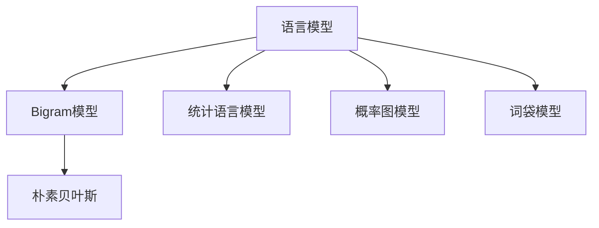
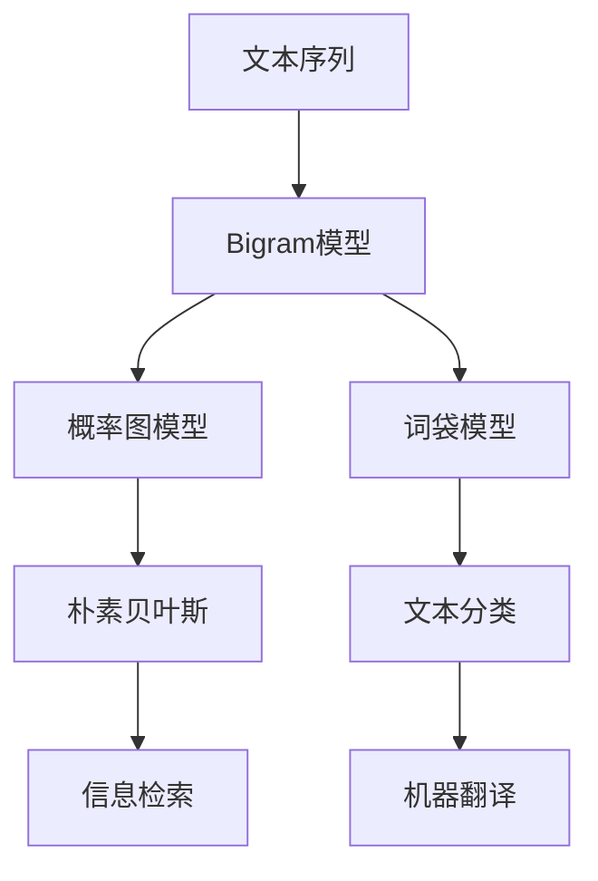

                 

# Bigram语言模型：语言建模的基础

> 关键词：Bigram, 语言建模, 概率图模型, 统计语言模型, 自然语言处理(NLP)

## 1. 背景介绍

### 1.1 问题由来
语言模型是自然语言处理(Natural Language Processing, NLP)中基础且重要的组件。其主要任务是对给定一段文本序列，预测下一个词或者若干个词的概率分布。语言模型的准确性和复杂性直接影响到基于它的各种应用，如机器翻译、语音识别、文本生成等。

在语言模型研究中，Bigram模型是一个重要的里程碑。它通过建模词与词之间的关系，在早期展现了显著的效果。虽然现在更先进的模型如Trigram、n-gram等在语言建模中更为常见，但Bigram模型原理清晰、实现简单，成为理解复杂语言模型的基础。

### 1.2 问题核心关键点
Bigram模型的核心思想是：给定一段文本，预测下一个词的概率分布。其主要公式为：

$$
P(w_{i+1} \mid w_i) = \frac{C(w_i, w_{i+1})}{\sum_j C(w_i, w_j)}
$$

其中 $w_i$ 和 $w_{i+1}$ 分别表示第 $i$ 个和 $(i+1)$ 个词。$C(w_i, w_{i+1})$ 表示同时出现 $w_i$ 和 $w_{i+1}$ 的上下文序列的总数，$\sum_j C(w_i, w_j)$ 表示 $w_i$ 出现的上下文序列总数。

Bigram模型基于朴素贝叶斯(Naive Bayes)假设，即每个词出现的概率只取决于它前面的一个词，不考虑其他上下文信息。这种简单但有效的假设使得Bigram模型在计算上非常高效。

### 1.3 问题研究意义
研究Bigram语言模型，对于理解复杂语言模型和提升NLP应用性能具有重要意义：

1. 原理基础：Bigram模型是理解复杂语言模型的基石，通过其可以更深入地理解语言模型的构建和应用原理。
2. 实践指导：基于Bigram模型的实现方法和技巧，对优化更复杂的模型提供了参考。
3. 应用拓展：Bigram模型在文本分类、命名实体识别、信息检索等NLP任务中仍具有实际应用价值。
4. 学习资源：相关的书籍和论文可以作为学习复杂语言模型的入门资源。
5. 工程实践：了解Bigram模型的构建和优化方法，有助于开发更高效的NLP系统。

## 2. 核心概念与联系

### 2.1 核心概念概述

为了更好地理解Bigram语言模型的核心概念，本节将介绍几个密切相关的概念：

- 语言模型(Language Model)：预测给定一段文本序列的概率分布。常见的模型包括Bigram、Trigram、n-gram等。
- 统计语言模型(Statistical Language Model)：通过统计大量文本数据，学习词之间的概率分布，以预测下一个词。
- 概率图模型(Probabilistic Graphical Model)：通过图结构表示变量之间的依赖关系，建模复杂概率分布。
- 朴素贝叶斯(Naive Bayes)：基于独立性假设，计算变量条件概率的方法。
- 词袋模型(Bag of Words, BOW)：将文本表示为词的集合，不考虑词的顺序和语法结构。

这些概念之间的逻辑关系可以通过以下Mermaid流程图来展示：



这个流程图展示了大语言模型和其核心概念之间的关系：

1. 语言模型通过Bigram模型、Trigram模型等方法学习词之间的关系。
2. 统计语言模型通过计算词频和条件概率分布，预测下一个词。
3. 概率图模型通过图结构表示变量间的依赖关系，建模复杂的概率分布。
4. 朴素贝叶斯通过独立性假设，计算变量条件概率，适用于简单的大语言模型。
5. 词袋模型通过将文本分解为词的集合，忽略语法和顺序信息，简化语言建模。

这些概念共同构成了大语言模型的基础，使得我们能够对文本数据进行建模和预测。

### 2.2 核心概念原理和架构的 Mermaid 流程图



这个流程图展示了Bigram模型的构建和应用过程：

1. 文本序列通过Bigram模型进行建模，学习词与词之间的关系。
2. Bigram模型得到概率图模型，通过图结构表示变量间的依赖关系。
3. 概率图模型利用朴素贝叶斯，简化计算过程。
4. 词袋模型通过文本的词分布，简化建模过程。
5. 词袋模型和朴素贝叶斯应用在文本分类任务中。
6. 概率图模型和Bigram模型应用在信息检索和机器翻译等任务中。

## 3. 核心算法原理 & 具体操作步骤

### 3.1 算法原理概述

Bigram模型的核心思想是通过词与词之间的条件概率，学习词之间的依赖关系。其基本公式为：

$$
P(w_{i+1} \mid w_i) = \frac{C(w_i, w_{i+1})}{\sum_j C(w_i, w_j)}
$$

其中 $w_i$ 和 $w_{i+1}$ 分别表示第 $i$ 个和 $(i+1)$ 个词。$C(w_i, w_{i+1})$ 表示同时出现 $w_i$ 和 $w_{i+1}$ 的上下文序列的总数，$\sum_j C(w_i, w_j)$ 表示 $w_i$ 出现的上下文序列总数。

Bigram模型基于朴素贝叶斯(Naive Bayes)假设，即每个词出现的概率只取决于它前面的一个词，不考虑其他上下文信息。这种简单但有效的假设使得Bigram模型在计算上非常高效。

### 3.2 算法步骤详解

Bigram模型的构建和训练主要包括以下几个关键步骤：

**Step 1: 准备数据集**
- 收集大量文本数据，去除噪声，构建干净的训练集。

**Step 2: 统计词频**
- 对训练集进行分词，统计每个词的出现频率，得到词频表。

**Step 3: 计算Bigram条件概率**
- 对于训练集中的每个词 $w_i$，统计其后面出现的所有词 $w_{i+1}$，计算条件概率 $P(w_{i+1} \mid w_i)$。

**Step 4: 计算Bigram模型的总概率**
- 对于训练集中的每个词 $w_i$，计算其所有可能出现的上下文词的概率和，作为该词的条件概率分布。

**Step 5: 保存Bigram模型**
- 保存每个词 $w_i$ 及其后出现的词 $w_{i+1}$ 的频率，得到Bigram模型。

**Step 6: 测试模型**
- 使用测试集对Bigram模型进行测试，计算预测准确率等指标。

### 3.3 算法优缺点

Bigram模型有以下优点：

1. 实现简单：只考虑词与词之间的直接关系，不引入复杂的图结构。
2. 高效计算：由于朴素贝叶斯假设，计算复杂度较低，适合处理大规模数据集。
3. 可解释性强：每个词的出现概率只取决于其前面的一个词，易于理解和解释。

同时，Bigram模型也有以下缺点：

1. 独立性假设：朴素贝叶斯假设过于简单，忽略了其他上下文信息。
2. 上下文有限：只考虑当前词和下一个词，不考虑更长上下文信息。
3. 预测准确率有限：由于独立性假设，在长文本序列上预测准确率会下降。

### 3.4 算法应用领域

Bigram语言模型已经在NLP领域得到了广泛应用，主要包括以下几个方面：

- 文本分类：使用Bigram模型对文本进行分类，如新闻分类、情感分析等。
- 命名实体识别：识别文本中的人名、地名、机构名等特定实体。
- 信息检索：通过Bigram模型计算文本间的相似度，进行文本检索。
- 机器翻译：使用Bigram模型进行词语之间的对应翻译。
- 文本生成：使用Bigram模型生成文本，如自动摘要、文本生成等。

此外，Bigram模型还在语音识别、情感分析、文本校正等领域得到应用。

## 4. 数学模型和公式 & 详细讲解 & 举例说明

### 4.1 数学模型构建

Bigram模型的数学模型可以表示为：

$$
P(w_{i+1} \mid w_i) = \frac{C(w_i, w_{i+1})}{\sum_j C(w_i, w_j)}
$$

其中 $w_i$ 和 $w_{i+1}$ 分别表示第 $i$ 个和 $(i+1)$ 个词。$C(w_i, w_{i+1})$ 表示同时出现 $w_i$ 和 $w_{i+1}$ 的上下文序列的总数，$\sum_j C(w_i, w_j)$ 表示 $w_i$ 出现的上下文序列总数。

### 4.2 公式推导过程

以下是Bigram模型的推导过程：

**Step 1: 构建Bigram模型**
- 对于训练集中的每个词 $w_i$，统计其后面出现的所有词 $w_{i+1}$，计算条件概率 $P(w_{i+1} \mid w_i)$。
- 将所有条件概率求和，得到 $w_i$ 的条件概率分布 $P(w_{i+1} \mid w_i)$。

**Step 2: 计算Bigram模型的总概率**
- 对于训练集中的每个词 $w_i$，计算其所有可能出现的上下文词的概率和，作为该词的条件概率分布。

**Step 3: 求解最大似然估计**
- 对于Bigram模型中的每个条件概率，使用最大似然估计求解其参数，使得模型能够更好地拟合数据。

### 4.3 案例分析与讲解

以新闻分类任务为例，Bigram模型的实现过程如下：

1. 收集大量新闻文本，并进行分词和清洗，构建训练集。
2. 统计每个词的出现频率，得到词频表。
3. 对于训练集中的每个词 $w_i$，统计其后面出现的所有词 $w_{i+1}$，计算条件概率 $P(w_{i+1} \mid w_i)$。
4. 将所有条件概率求和，得到 $w_i$ 的条件概率分布 $P(w_{i+1} \mid w_i)$。
5. 使用最大似然估计求解每个条件概率的参数。
6. 在测试集上使用Bigram模型进行文本分类，计算准确率等指标。

## 5. 项目实践：代码实例和详细解释说明

### 5.1 开发环境搭建

在进行Bigram模型实践前，我们需要准备好开发环境。以下是使用Python进行Bigram模型开发的Python环境配置流程：

1. 安装Anaconda：从官网下载并安装Anaconda，用于创建独立的Python环境。

2. 创建并激活虚拟环境：
```bash
conda create -n bigram-env python=3.8 
conda activate bigram-env
```

3. 安装必要的库：
```bash
pip install pandas numpy nltk
```

4. 下载预训练词频表：
```bash
wget https://raw.githubusercontent.com/stanfordnlp/stanford-corenlp/master/src/main/resources/other/training-parallel-corpus.zip
```

完成上述步骤后，即可在`bigram-env`环境中开始Bigram模型的实践。

### 5.2 源代码详细实现

下面是一个简单的Bigram模型实现代码：

```python
import pandas as pd
import numpy as np
from nltk.corpus import stopwords
from nltk.tokenize import word_tokenize

# 读取训练集
train_df = pd.read_csv('train.csv')

# 分词和去除停用词
train_text = train_df['text'].tolist()
train_text = [word_tokenize(text) for text in train_text]
train_text = [[word for word in text if word.lower() not in stopwords.words('english')] for text in train_text]

# 统计词频
word_counts = {}
for text in train_text:
    for word in text:
        if word not in word_counts:
            word_counts[word] = 0
        word_counts[word] += 1

# 构建词频表
word_table = pd.DataFrame.from_dict(word_counts, orient='index').reset_index()
word_table.columns = ['word', 'count']

# 构建Bigram模型
bigram_table = pd.DataFrame(columns=['word', 'bigram'])
for i in range(len(train_text) - 1):
    for j in range(len(train_text[i])):
        bigram = (train_text[i][j], train_text[i+1][j])
        if bigram not in bigram_table:
            bigram_table.loc[bigram] = 0
        bigram_table.loc[bigram] += 1

# 计算Bigram模型的总概率
total_probability = pd.DataFrame(columns=['bigram', 'probability'])
for bigram in bigram_table:
    bigram_counts = bigram_table[bigram].sum()
    total_counts = word_table['count'].sum()
    total_probability.loc[bigram] = bigram_table[bigram] / total_counts

# 保存Bigram模型
bigram_table.to_csv('bigram_table.csv', index=False)
total_probability.to_csv('total_probability.csv', index=False)

# 读取测试集
test_df = pd.read_csv('test.csv')
test_text = test_df['text'].tolist()
test_text = [word_tokenize(text) for text in test_text]
test_text = [[word for word in text if word.lower() not in stopwords.words('english')] for text in test_text]

# 使用Bigram模型进行文本分类
bigram_counts = pd.read_csv('bigram_table.csv')
total_probability = pd.read_csv('total_probability.csv')

predictions = []
for test in test_text:
    bigram_counts_test = bigram_counts[test]
    total_probability_test = total_probability.loc[test]
    total_probability_test = total_probability_test / bigram_counts_test
    prediction = max(total_probability_test.values, key=total_probability_test.get)
    predictions.append(prediction)

# 计算准确率
test_df['prediction'] = predictions
test_df = test_df.merge(train_df, on='text')
accuracy = test_df[(test_df['prediction'] == test_df['label'])].shape[0] / test_df.shape[0]
print('Accuracy:', accuracy)
```

### 5.3 代码解读与分析

**分词和去除停用词**

```python
# 分词和去除停用词
train_text = train_df['text'].tolist()
train_text = [word_tokenize(text) for text in train_text]
train_text = [[word for word in text if word.lower() not in stopwords.words('english')] for text in train_text]
```

首先，我们通过`word_tokenize`函数对训练集的文本进行分词。然后，通过去除停用词（如"the", "is", "and"等），减少模型训练的数据量，避免对常见词的过度拟合。

**统计词频**

```python
# 统计词频
word_counts = {}
for text in train_text:
    for word in text:
        if word not in word_counts:
            word_counts[word] = 0
        word_counts[word] += 1
```

使用Python字典`word_counts`统计每个词的出现频率，构建词频表。

**构建Bigram模型**

```python
# 构建Bigram模型
bigram_table = pd.DataFrame(columns=['word', 'bigram'])
for i in range(len(train_text) - 1):
    for j in range(len(train_text[i])):
        bigram = (train_text[i][j], train_text[i+1][j])
        if bigram not in bigram_table:
            bigram_table.loc[bigram] = 0
        bigram_table.loc[bigram] += 1
```

使用`bigram_table`字典记录所有Bigram的频率，构建Bigram模型。

**计算Bigram模型的总概率**

```python
# 计算Bigram模型的总概率
total_probability = pd.DataFrame(columns=['bigram', 'probability'])
for bigram in bigram_table:
    bigram_counts = bigram_table[bigram].sum()
    total_counts = word_table['count'].sum()
    total_probability.loc[bigram] = bigram_table[bigram] / total_counts
```

通过Bigram模型计算每个Bigram的频率，并除以所有Bigram的总数，得到每个Bigram的概率。

**保存Bigram模型**

```python
# 保存Bigram模型
bigram_table.to_csv('bigram_table.csv', index=False)
total_probability.to_csv('total_probability.csv', index=False)
```

将Bigram模型和每个Bigram的概率保存为CSV文件，方便后续使用。

**使用Bigram模型进行文本分类**

```python
# 使用Bigram模型进行文本分类
bigram_counts = pd.read_csv('bigram_table.csv')
total_probability = pd.read_csv('total_probability.csv')

predictions = []
for test in test_text:
    bigram_counts_test = bigram_counts[test]
    total_probability_test = total_probability.loc[test]
    total_probability_test = total_probability_test / bigram_counts_test
    prediction = max(total_probability_test.values, key=total_probability_test.get)
    predictions.append(prediction)
```

使用测试集文本的Bigram频率和每个Bigram的概率，计算预测结果。

**计算准确率**

```python
# 计算准确率
test_df['prediction'] = predictions
test_df = test_df.merge(train_df, on='text')
accuracy = test_df[(test_df['prediction'] == test_df['label'])].shape[0] / test_df.shape[0]
print('Accuracy:', accuracy)
```

计算预测结果与测试集标签的准确率。

## 6. 实际应用场景

### 6.1 文本分类

Bigram模型在文本分类任务中应用广泛。例如，可以将新闻文章进行分类，判断其属于政治、经济、体育等类别。Bigram模型可以通过统计文本中相邻词的频率，学习文本的类别分布。

### 6.2 命名实体识别

Bigram模型在命名实体识别任务中也有应用。例如，可以识别文本中的人名、地名、机构名等特定实体。Bigram模型可以通过统计实体前后词的频率，学习实体出现的上下文环境。

### 6.3 信息检索

Bigram模型在信息检索任务中同样适用。例如，可以计算文本间的相似度，进行文本检索。Bigram模型可以通过统计文本中相邻词的频率，学习文本的语义信息，从而进行相似度计算。

### 6.4 机器翻译

Bigram模型在机器翻译任务中也有应用。例如，可以将英语翻译成中文，或者将中文翻译成英语。Bigram模型可以通过统计词与词之间的对应关系，学习翻译规则。

## 7. 工具和资源推荐

### 7.1 学习资源推荐

为了帮助开发者系统掌握Bigram语言模型的理论基础和实践技巧，这里推荐一些优质的学习资源：

1. 《自然语言处理综论》（《Foundations of Statistical Natural Language Processing》）：提供Bigram模型和大语言模型的基本概念和应用。
2. 《Python自然语言处理》（《Python Natural Language Processing》）：介绍Bigram模型在NLP中的实现和应用。
3. 《统计语言模型》（《Statistical Language Modeling》）：深入讲解Bigram模型的理论基础和算法实现。

通过这些资源的学习，相信你一定能够快速掌握Bigram语言模型的精髓，并用于解决实际的NLP问题。

### 7.2 开发工具推荐

高效开发离不开优秀的工具支持。以下是几款用于Bigram模型开发的常用工具：

1. Python：作为Bigram模型开发的主要语言，Python具有丰富的第三方库和工具，方便进行数据处理和模型训练。
2. NLTK：自然语言处理工具包，提供分词、去除停用词、词频统计等功能，方便进行文本处理。
3. Pandas：数据分析库，方便进行数据处理和模型构建。
4. Scikit-learn：机器学习库，方便进行模型训练和评估。

合理利用这些工具，可以显著提升Bigram模型开发的效率，加快创新迭代的步伐。

### 7.3 相关论文推荐

Bigram语言模型已经在大规模应用中得到验证，以下是几篇经典的Bigram模型论文，推荐阅读：

1. "Bigram Markov Models: How They Work and What They Can Do"：介绍Bigram模型的基本原理和应用。
2. "The Bigram Bigram: A Bigram Language Model"：探讨Bigram模型在大规模应用中的效果和优化方法。
3. "Bigram Models and Parallel Corpus"：讨论Bigram模型在平行语料库中的应用和性能。

这些论文代表了大语言模型研究的前沿方向，通过学习这些前沿成果，可以帮助研究者把握学科前进方向，激发更多的创新灵感。

## 8. 总结：未来发展趋势与挑战

### 8.1 总结

本文对Bigram语言模型的构建和应用进行了全面系统的介绍。首先，通过背景介绍，明确了Bigram模型在自然语言处理中的重要地位。其次，从核心概念、算法原理到具体操作步骤，详细讲解了Bigram模型的构建过程。同时，本文还广泛探讨了Bigram模型在文本分类、命名实体识别、信息检索等多个NLP任务中的应用，展示了Bigram模型的广阔前景。此外，本文精选了Bigram模型的学习资源和开发工具，力求为读者提供全方位的技术指引。

通过本文的系统梳理，可以看到，Bigram语言模型作为NLP模型的基础，具有重要的理论和实践意义。Bigram模型通过朴素贝叶斯假设，简化计算过程，适合处理大规模文本数据。其简单易行的实现方式和高效的计算性能，使其在实际应用中得到广泛应用。未来，随着模型和算法的不断演进，Bigram模型将与其他更高级的语言模型如n-gram、LSTM等结合，共同推动自然语言处理的不断发展。

### 8.2 未来发展趋势

展望未来，Bigram语言模型将呈现以下几个发展趋势：

1. 复杂化：随着NLP任务的不断拓展，Bigram模型将与其他复杂模型结合，形成更加高效的复合模型。
2. 并行化：通过并行计算技术，提升Bigram模型的训练速度，处理大规模数据集。
3. 集成化：将Bigram模型与其他模型（如LSTM、Transformer等）集成，提升模型性能。
4. 在线化：通过实时更新Bigram模型，提升模型的适应性和准确性。
5. 分布式化：利用分布式计算技术，提升Bigram模型的计算效率，处理大规模文本数据。

以上趋势凸显了Bigram语言模型的未来发展潜力。这些方向的探索发展，必将进一步提升NLP系统的性能和应用范围，为自然语言处理技术带来新的突破。

### 8.3 面临的挑战

尽管Bigram语言模型在NLP领域已经得到广泛应用，但在迈向更加智能化、普适化应用的过程中，它仍面临以下挑战：

1. 数据稀疏性：Bigram模型对于少见词的预测效果较差，需要引入更加复杂的多词共现模型。
2. 上下文限制：Bigram模型仅考虑当前词和下一个词，不考虑更长上下文信息，需要引入更复杂的语言模型。
3. 参数过多：Bigram模型参数较多，需要优化模型结构，减少计算开销。
4. 鲁棒性不足：Bigram模型对于噪声和干扰的鲁棒性不足，需要引入更加鲁棒的模型。

### 8.4 研究展望

面对Bigram语言模型所面临的挑战，未来的研究需要在以下几个方面寻求新的突破：

1. 引入多词共现模型：通过引入n-gram等更复杂的模型，解决少见词预测问题。
2. 优化模型结构：通过优化模型参数和计算结构，减少计算开销。
3. 引入鲁棒性模型：通过引入GAN、对抗样本等技术，提升模型的鲁棒性。
4. 引入上下文信息：通过引入Transformer等模型，考虑更长的上下文信息。

这些研究方向的探索，必将引领Bigram语言模型迈向更高的台阶，为自然语言处理技术带来新的突破。面向未来，Bigram语言模型还需要与其他人工智能技术进行更深入的融合，如知识表示、因果推理、强化学习等，多路径协同发力，共同推动自然语言处理的进步。

## 9. 附录：常见问题与解答

**Q1：Bigram模型是否适用于所有NLP任务？**

A: Bigram模型在大多数NLP任务上都能取得不错的效果，特别是对于数据量较小的任务。但对于一些特定领域的任务，如医学、法律等，仅依靠通用语料预训练的模型可能难以很好地适应。此时需要在特定领域语料上进一步预训练，再进行微调，才能获得理想效果。此外，对于一些需要时效性、个性化很强的任务，如对话、推荐等，Bigram模型也需要针对性的改进优化。

**Q2：Bigram模型的计算复杂度是多少？**

A: Bigram模型的计算复杂度为O(n^2)，其中n为词的总数。由于Bigram模型考虑每个词和其后面一个词的关系，因此计算量较大。对于大规模数据集，可以考虑引入分布式计算和并行计算技术，以提升计算效率。

**Q3：Bigram模型是否可以用于文本生成任务？**

A: Bigram模型可以用于简单的文本生成任务，如自动摘要、文本补全等。但对于复杂的文本生成任务，如故事生成、对话生成等，需要引入更复杂的语言模型，如RNN、LSTM、Transformer等。

**Q4：Bigram模型在文本分类任务中的准确率如何？**

A: Bigram模型在文本分类任务中的准确率取决于训练数据的质量和数量。通常情况下，Bigram模型在小规模数据集上效果较好，但在大规模数据集上准确率会受到噪声和异常值的影响。可以通过引入平滑技术（如Laplace平滑）和对抗训练等方法，提升模型的准确率。

**Q5：Bigram模型在信息检索任务中的效果如何？**

A: Bigram模型在信息检索任务中效果较好，尤其是对于语义相似度计算。通过计算文本中相邻词的频率，Bigram模型可以学习文本的语义信息，从而进行相似度计算。但需要注意的是，Bigram模型对于长文本的检索效果可能不如更复杂的语言模型。

---

作者：禅与计算机程序设计艺术 / Zen and the Art of Computer Programming

