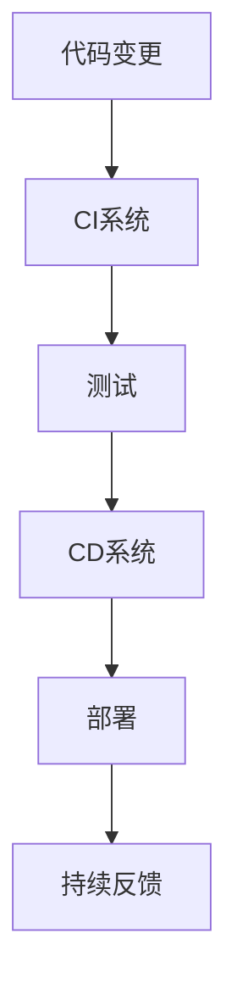

                 

# CI/CD管道：自动化软件交付流程

## 1. 背景介绍

### 1.1 问题由来
软件开发项目中，传统的"瀑布"式开发方法已不再适应快速变化的市场需求。现代软件项目通常需要频繁迭代更新，以适应快速变化的市场需求和技术趋势。在这样的背景下，持续集成(Continuous Integration, CI)和持续部署(Continuous Deployment, CD)成为了软件开发实践中的重要组成部分。

CI/CD管道的构建，不仅可以加速软件交付流程，还能提高软件的可靠性和质量。通过持续集成和持续部署，代码的变更可以被自动化地检测、构建、测试、部署，大大缩短了软件从开发到交付的时间，提升了开发效率和团队协作效率。

### 1.2 问题核心关键点
构建一个高效的CI/CD管道需要重点关注以下核心关键点：

- 自动化测试：通过自动化测试覆盖代码变更，保证软件质量。
- 持续集成：通过自动化构建，快速发现并修复问题。
- 持续部署：通过自动化部署，确保代码能够快速上线，提高交付效率。
- 持续反馈：通过持续集成和持续部署的反馈，持续优化开发流程。
- 流水线管理：构建可扩展、易于维护的流水线，支持多种平台和环境。

这些关键点相互配合，形成了完整的CI/CD流程，确保了软件的稳定性和交付速度，提高了开发效率和团队协作效率。

### 1.3 问题研究意义
研究CI/CD管道的构建方法，对于软件开发实践具有重要意义：

1. 提升开发效率：通过自动化测试和部署，缩短开发周期，加快新功能的交付速度。
2. 提高软件质量：通过持续集成和自动化测试，及时发现并修复问题，保证软件质量。
3. 加强团队协作：通过流水线管理，明确开发流程和责任分工，提升团队协作效率。
4. 优化决策机制：通过持续反馈，及时调整开发策略和流程，优化决策机制。
5. 促进敏捷开发：通过CI/CD管道，实现快速迭代开发，支持敏捷开发方法。

CI/CD管道已经成为现代软件开发的重要实践，是构建高效、可靠、快速的软件交付体系的关键。

## 2. 核心概念与联系

### 2.1 核心概念概述

为更好地理解CI/CD管道的构建方法，本节将介绍几个密切相关的核心概念：

- 持续集成(Continuous Integration, CI)：在每次代码变更后，自动构建和测试，以快速发现并修复问题。

- 持续部署(Continuous Deployment, CD)：在代码通过测试后，自动部署到生产环境，确保代码能够快速上线。

- 流水线(Pipeline)：由多个步骤组成的自动化执行流程，每个步骤负责完成特定的功能，如代码构建、测试、部署等。

- 管道(Pipeline)：一个或多个流水线的组合，用于自动化管理软件开发流程。

- 配置管理(Configuration Management)：管理和维护软件的配置文件和环境变量，确保不同环境的一致性。

- 自动化测试(Automated Testing)：通过自动化测试工具覆盖代码变更，保证软件质量。

- 容器化(Docker)：使用容器技术封装应用，确保应用在不同环境的一致性和可移植性。

- 微服务架构(Microservices)：将应用拆分为多个小服务，便于独立部署和扩展。

这些核心概念之间的逻辑关系可以通过以下Mermaid流程图来展示：

```mermaid
graph TB
    A[CI/CD管道] --> B[持续集成(CI)]
    A --> C[持续部署(CD)]
    A --> D[流水线(Pipeline)]
    A --> E[配置管理(Configuration Management)]
    A --> F[自动化测试(Automated Testing)]
    A --> G[容器化(Docker)]
    A --> H[微服务架构(Microservices)]
```

这个流程图展示了我CI/CD管道的核心概念及其之间的关系：

1. CI/CD管道通过持续集成和持续部署，自动化管理软件开发流程。
2. 持续集成负责自动化构建和测试，保证代码质量。
3. 持续部署负责自动化部署到生产环境，确保代码能够快速上线。
4. 流水线管理多个自动化步骤，确保流程的可扩展性和一致性。
5. 配置管理维护软件环境，确保不同环境的一致性。
6. 自动化测试覆盖代码变更，保证软件质量。
7. 容器化和微服务架构提升应用的可靠性和扩展性。

这些核心概念共同构成了CI/CD管道的整体框架，使其能够高效、可靠地管理软件开发流程。

## 3. 核心算法原理 & 具体操作步骤

### 3.1 算法原理概述

CI/CD管道的核心算法原理包括持续集成和持续部署的自动化流程，以及流水线和配置管理的自动化执行。其核心思想是通过自动化手段，实现软件开发流程的持续优化和改进。

形式化地，CI/CD管道可以表示为一个函数 $F$，输入为代码变更，输出为部署结果。具体而言，CI/CD管道的执行步骤如下：

1. 代码变更 $v$ 提交到版本控制库。
2. CI 系统自动从库中拉取代码，并进行构建和测试。
3. 如果测试通过，CD 系统自动将代码部署到生产环境。
4. 部署后，持续反馈系统收集用户反馈，优化下一步开发流程。

这种自动化流程可以反复执行，确保软件的稳定性和交付速度。

### 3.2 算法步骤详解

CI/CD管道的构建通常包括以下几个关键步骤：

**Step 1: 设计流水线架构**

- 根据项目需求，设计流水线架构，划分多个自动化执行阶段，如构建、测试、部署等。
- 确定每个阶段的输入和输出，明确每个步骤的具体职责。
- 确定流水线执行的顺序，确保前后步骤的依赖关系。

**Step 2: 配置CI/CD系统**

- 选择合适的CI/CD工具，如Jenkins、GitLab CI、Travis CI等。
- 配置CI/CD系统的全局参数和环境变量，如Git仓库地址、构建工具路径等。
- 配置自动化执行脚本，编写每个步骤的执行代码，确保自动化执行。

**Step 3: 实现流水线自动化**

- 使用CI/CD工具的脚本编写功能，定义流水线脚本，描述每个步骤的执行过程。
- 配置自动化测试工具，如JUnit、Selenium、Cypress等，自动执行测试脚本。
- 配置容器化工具，如Docker，构建应用容器镜像，确保应用的可靠性和可移植性。
- 配置部署工具，如Kubernetes、Ansible等，自动化部署应用到生产环境。

**Step 4: 持续反馈和优化**

- 设置反馈机制，定期收集用户反馈，分析性能指标，优化开发流程。
- 定期审查代码变更，优化代码质量和开发效率。
- 定期审查测试用例，优化测试覆盖率和测试速度。
- 定期审查部署日志，优化部署过程和故障排查。

通过以上步骤，CI/CD管道可以自动化管理软件开发流程，提升开发效率和软件质量。

### 3.3 算法优缺点

CI/CD管道的构建方法具有以下优点：

1. 提升开发效率：通过自动化测试和部署，缩短开发周期，加快新功能的交付速度。
2. 提高软件质量：通过持续集成和自动化测试，及时发现并修复问题，保证软件质量。
3. 加强团队协作：通过流水线管理，明确开发流程和责任分工，提升团队协作效率。
4. 优化决策机制：通过持续反馈，及时调整开发策略和流程，优化决策机制。
5. 促进敏捷开发：通过CI/CD管道，实现快速迭代开发，支持敏捷开发方法。

同时，CI/CD管道的构建方法也存在一些缺点：

1. 初始搭建复杂：需要配置和编写大量的脚本和配置文件，初期建设成本较高。
2. 持续维护成本：随着应用规模的扩大，流水线的维护成本和复杂度也会增加。
3. 依赖工具选择：不同的CI/CD工具和配置工具，需要不同的技能和经验，选择不当会影响效率。
4. 环境一致性问题：不同环境之间的配置和依赖关系，需要严格管理，否则会导致不一致问题。
5. 自动化脚本质量：自动化测试和脚本的质量直接影响CI/CD管道的效率和可靠性。

尽管存在这些缺点，但就目前而言，CI/CD管道仍是软件开发实践的重要组成部分。未来相关研究的重点在于如何进一步降低初始搭建和持续维护的成本，提高环境一致性和自动化脚本的质量，以充分发挥CI/CD管道的优势。

### 3.4 算法应用领域

CI/CD管道在软件开发领域得到了广泛的应用，覆盖了几乎所有类型的应用，例如：

- 网站开发：构建、测试、部署网站应用，提升网站的稳定性和用户体验。
- 移动应用开发：构建、测试、部署移动应用，支持敏捷开发和快速迭代。
- 大数据处理：构建、测试、部署大数据处理流程，提升数据处理的效率和可靠性。
- 人工智能应用：构建、测试、部署人工智能模型和算法，支持模型的快速部署和迭代。
- 云应用开发：构建、测试、部署云应用，支持云服务的持续优化和迭代。

除了上述这些经典应用外，CI/CD管道还被创新性地应用到更多场景中，如容器化部署、微服务架构、DevOps工具集成等，为软件开发技术带来了全新的突破。随着CI/CD工具和技术的不断演进，相信软件开发技术将在更广泛的领域得到应用，推动软件开发实践的不断进步。

## 4. 数学模型和公式 & 详细讲解 & 举例说明

### 4.1 数学模型构建

本节将使用数学语言对CI/CD管道的构建方法进行更加严格的刻画。

假设CI/CD管道由 $n$ 个自动化执行阶段组成，每个阶段的输入为上一阶段的输出，输出为下一阶段的输入。

定义CI/CD管道的执行函数为 $F$，输入为代码变更 $v$，输出为部署结果 $d$。

$$
F: v \rightarrow d
$$

其中 $v$ 为代码变更，$d$ 为部署结果。

CI/CD管道的执行过程可以表示为如下递归式：

$$
d = F(v_1) = F(F(v_2)) = \cdots = F^n(v)
$$

其中 $v_i$ 为第 $i$ 阶段的输入，$d$ 为最终的部署结果。

### 4.2 公式推导过程

以下我们以一个简单的CI/CD管道为例，推导执行函数 $F$ 的计算公式。

假设CI/CD管道包含三个阶段：构建、测试、部署。每个阶段的执行函数为 $F_1, F_2, F_3$。

构建阶段 $F_1$ 的执行函数为：

$$
F_1: \text{拉取代码} \rightarrow \text{构建应用}
$$

测试阶段 $F_2$ 的执行函数为：

$$
F_2: \text{构建应用} \rightarrow \text{执行测试用例}
$$

部署阶段 $F_3$ 的执行函数为：

$$
F_3: \text{测试通过} \rightarrow \text{部署应用}
$$

因此，CI/CD管道的执行函数 $F$ 可以表示为：

$$
F = F_3 \circ F_2 \circ F_1
$$

其中 $\circ$ 表示函数复合运算。

在实际应用中，构建、测试、部署的具体函数可以进一步细化，使用复杂的流程控制和逻辑判断，实现更加灵活的CI/CD管道。

### 4.3 案例分析与讲解

假设某网站的开发流程为：

1. 开发人员将代码变更提交到Git仓库。
2. CI系统自动从仓库拉取代码，并进行构建和测试。
3. 如果测试通过，CD系统自动将代码部署到生产环境。
4. 部署完成后，持续反馈系统收集用户反馈，优化下一步开发流程。

可以将上述流程抽象为如下CI/CD管道：



其中，A为代码变更，B为CI系统，C为测试，D为CD系统，E为部署，F为持续反馈。

通过构建这样的CI/CD管道，开发团队可以自动化管理软件开发流程，提升开发效率和软件质量。

## 5. 项目实践：代码实例和详细解释说明

### 5.1 开发环境搭建

在进行CI/CD管道构建实践前，我们需要准备好开发环境。以下是使用Jenkins和Docker进行CI/CD管道开发的环境配置流程：

1. 安装Docker：从官网下载并安装Docker，用于构建和部署应用。

2. 安装Jenkins：从官网下载并安装Jenkins，用于构建和部署应用，并配置自动化测试和持续部署。

3. 安装依赖软件：安装需要的依赖软件和开发工具，如Maven、Git、SVN、Gradle等。

完成上述步骤后，即可在Jenkins和Docker环境中开始CI/CD管道实践。

### 5.2 源代码详细实现

下面我们以Java项目为例，给出使用Jenkins和Docker进行CI/CD管道构建的Jenkinsfile代码实现。

首先，定义Jenkinsfile的构建阶段：

```groovy
pipeline {
    agent any
    stages {
        stage('构建') {
            steps {
                sh 'mvn clean install'
            }
        }
        stage('测试') {
            steps {
                sh 'mvn test'
            }
        }
        stage('部署') {
            steps {
                with Docker {
                    dockerImage 'myapp:latest'
                    sh 'docker run -p 8080:80 myapp'
                }
            }
        }
    }
}
```

然后，定义Dockerfile的构建脚本：

```Dockerfile
FROM maven:3.8-jdk-11
COPY target/myapp-0.0.1-SNAPSHOT.jar myapp.jar
CMD ["java", "-jar", "myapp.jar"]
```

接下来，使用Docker构建应用镜像，并将其上传到Jenkins仓库：

```bash
docker build -t myapp .
docker push myapp
```

最后，启动Jenkins并添加Docker仓库和构建脚本：

```bash
java -jar jenkins.war --httpPort=8080 --httpHost=localhost --httpUrlPrefix=
```

完成上述步骤后，即可在Jenkins上启动CI/CD管道，实现应用的自动构建、测试和部署。

### 5.3 代码解读与分析

让我们再详细解读一下关键代码的实现细节：

**Jenkinsfile构建脚本**：
- `pipeline`：定义Jenkinsfile的类型为Pipeline，用于描述自动化执行流程。
- `agent any`：指定Jenkins代理为任意机器，可用于多节点环境。
- `stages`：将构建流程划分为多个阶段，每个阶段负责完成特定的功能。
- `stage('构建')`：定义构建阶段，执行`mvn clean install`命令。
- `stage('测试')`：定义测试阶段，执行`mvn test`命令。
- `stage('部署')`：定义部署阶段，使用Docker执行`docker run -p 8080:80 myapp`命令。

**Dockerfile构建脚本**：
- `FROM maven:3.8-jdk-11`：定义Docker镜像的基础镜像为Maven 3.8-JDK 11。
- `COPY target/myapp-0.0.1-SNAPSHOT.jar myapp.jar`：将构建好的应用JAR文件复制到Docker镜像中。
- `CMD ["java", "-jar", "myapp.jar"]`：定义Docker镜像的执行命令。

通过上述Jenkinsfile和Dockerfile的组合，可以实现Java项目的自动构建、测试和部署。

**Jenkins仓库配置**：
- 配置Jenkins仓库，指定Docker仓库的地址、用户名和密码，以便从仓库拉取应用镜像。
- 配置Jenkins仓库的构建触发器，如GitHub Hook、定时任务等，以便自动启动构建流程。

通过Jenkins和Docker的配合使用，可以实现CI/CD管道的自动化构建和部署。合理利用这些工具，可以显著提升软件开发流程的自动化程度，减少人工操作，提高开发效率。

## 6. 实际应用场景

### 6.1 网站开发

基于CI/CD管道的网站开发，可以快速构建、测试、部署网站应用，提升网站的稳定性和用户体验。

在技术实现上，可以收集网站的访问日志和用户反馈，自动生成测试用例和功能需求。在网站构建完成后，自动进行代码构建和测试，确保代码质量。在测试通过后，自动部署网站应用到生产环境，确保网站的快速上线和可靠运行。通过持续反馈系统收集用户反馈，不断优化网站功能和用户体验，实现快速迭代开发。

### 6.2 移动应用开发

移动应用的开发同样可以利用CI/CD管道进行自动化构建和部署。

在技术实现上，可以构建移动应用的自动化测试流程，覆盖应用的各种功能场景。在应用构建完成后，自动进行代码构建和测试，确保应用质量。在测试通过后，自动部署应用到应用商店或服务器，确保应用的快速上线和可靠运行。通过持续反馈系统收集用户反馈，不断优化应用功能和用户体验，实现快速迭代开发。

### 6.3 大数据处理

大数据处理的流程也适合使用CI/CD管道进行自动化管理。

在技术实现上，可以构建数据处理的自动化流程，覆盖数据的清洗、转换、存储等各个环节。在大数据处理完成后，自动进行数据质量检查和测试，确保数据质量。在测试通过后，自动部署数据处理流程到生产环境，确保数据的可靠性和安全性。通过持续反馈系统收集数据分析结果，不断优化数据处理流程，实现数据处理的自动化和高效性。

### 6.4 未来应用展望

随着CI/CD管道和相关工具的不断演进，未来其在软件开发实践中的应用将更加广泛和深入。

在智能制造领域，基于CI/CD管道的工业应用，可以实现设备的自动化运维和生产线的优化调度。在智慧城市建设中，基于CI/CD管道的城市治理系统，可以实现城市事件的自动化监测和处理。在医疗健康领域，基于CI/CD管道的医疗数据分析平台，可以实现医疗数据的自动化处理和分析。

CI/CD管道的构建方法将进一步渗透到各个行业领域，成为推动智能化、自动化发展的关键技术。相信随着学界和产业界的共同努力，CI/CD管道必将在更多领域得到应用，推动人工智能技术的不断进步。

## 7. 工具和资源推荐

### 7.1 学习资源推荐

为了帮助开发者系统掌握CI/CD管道的构建方法，这里推荐一些优质的学习资源：

1. 《Jenkins权威指南》：详细介绍了Jenkins的架构和使用，适合初学者快速上手。
2. 《Kubernetes权威指南》：介绍了Kubernetes的架构和使用方法，适合了解容器编排技术。
3. 《Docker实战》：介绍了Docker的基本概念和实践技巧，适合快速构建和部署应用。
4. 《DevOps实践》：介绍了DevOps的实践方法和工具，适合提升团队协作和开发效率。
5. 《持续集成与持续交付》：介绍了CI/CD管道的构建方法和最佳实践，适合系统学习。

通过对这些资源的学习实践，相信你一定能够快速掌握CI/CD管道的精髓，并用于解决实际的开发问题。

### 7.2 开发工具推荐

高效的开发离不开优秀的工具支持。以下是几款用于CI/CD管道构建开发的常用工具：

1. Jenkins：开源的持续集成和持续部署工具，支持丰富的插件和扩展。

2. GitLab CI/CD：集成在GitLab中的CI/CD工具，支持自动化测试和持续部署。

3. CircleCI：基于云的CI/CD工具，支持多种编程语言和框架。

4. Travis CI：基于云的CI/CD工具，支持Docker和容器化。

5. Docker：开源的容器化平台，支持应用的可移植性和快速部署。

6. Kubernetes：开源的容器编排平台，支持多节点环境和自动化部署。

合理利用这些工具，可以显著提升CI/CD管道的构建效率，加快创新迭代的步伐。

### 7.3 相关论文推荐

CI/CD管道的构建方法源于学界的持续研究。以下是几篇奠基性的相关论文，推荐阅读：

1. "CI/CD in Practice"：介绍了CI/CD管道的实践方法和最佳实践，适合系统学习。
2. "Continuous Integration: Practical Tools and Techniques"：介绍了CI/CD管道的工具和技术，适合了解具体实现。
3. "CI/CD in DevOps"：介绍了CI/CD管道在DevOps实践中的应用，适合提升团队协作效率。
4. "CI/CD Pipeline Best Practices"：介绍了CI/CD管道的最佳实践和优化方法，适合系统学习。
5. "CI/CD Pipelines in Practice"：介绍了CI/CD管道的实践技巧和优化方法，适合提升实际应用效果。

这些论文代表了大规模CI/CD管道的构建技术的发展脉络。通过学习这些前沿成果，可以帮助研究者把握学科前进方向，激发更多的创新灵感。

## 8. 总结：未来发展趋势与挑战

### 8.1 总结

本文对CI/CD管道的构建方法进行了全面系统的介绍。首先阐述了CI/CD管道的背景和研究意义，明确了持续集成和持续部署在软件开发实践中的重要价值。其次，从原理到实践，详细讲解了CI/CD管道的数学模型和关键步骤，给出了CI/CD管道的完整代码实例。同时，本文还广泛探讨了CI/CD管道在软件开发实践中的应用前景，展示了CI/CD管道的巨大潜力。此外，本文精选了CI/CD管道的各类学习资源，力求为读者提供全方位的技术指引。

通过本文的系统梳理，可以看到，CI/CD管道已经成为软件开发实践的重要组成部分，极大地提升了开发效率和软件质量。未来，伴随CI/CD工具和技术的不断演进，CI/CD管道将在更多领域得到应用，推动软件开发实践的不断进步。

### 8.2 未来发展趋势

展望未来，CI/CD管道的构建技术将呈现以下几个发展趋势：

1. 容器化和微服务架构的普及。容器化和微服务架构将进一步普及，提升应用的可靠性和扩展性。

2. 持续集成和持续部署的自动化。自动化测试和部署将更加成熟，自动发现和修复问题，提升开发效率。

3. 云平台和DevOps工具的集成。云平台和DevOps工具的集成将更加紧密，实现更高效的自动化部署和运维。

4. 持续反馈和自动化监控。持续反馈和自动化监控将更加普及，提升开发团队的协作效率和系统稳定性。

5. 持续学习和自我优化。CI/CD管道将具备持续学习和自我优化的能力，动态调整执行策略，提升系统性能。

以上趋势凸显了CI/CD管道的广阔前景。这些方向的探索发展，必将进一步提升软件开发流程的自动化程度，提高开发效率和软件质量，推动软件开发技术的不断进步。

### 8.3 面临的挑战

尽管CI/CD管道在软件开发实践中的应用已经取得了显著进展，但在迈向更加智能化、自动化应用的过程中，它仍面临着诸多挑战：

1. 初始搭建复杂。需要配置和编写大量的脚本和配置文件，初期建设成本较高。

2. 持续维护成本。随着应用规模的扩大，流水线的维护成本和复杂度也会增加。

3. 依赖工具选择。不同的CI/CD工具和配置工具，需要不同的技能和经验，选择不当会影响效率。

4. 环境一致性问题。不同环境之间的配置和依赖关系，需要严格管理，否则会导致不一致问题。

5. 自动化脚本质量。自动化测试和脚本的质量直接影响CI/CD管道的效率和可靠性。

尽管存在这些挑战，但CI/CD管道已成为软件开发实践的重要组成部分。未来相关研究的重点在于如何进一步降低初始搭建和持续维护的成本，提高环境一致性和自动化脚本的质量，以充分发挥CI/CD管道的优势。

### 8.4 研究展望

面对CI/CD管道面临的这些挑战，未来的研究需要在以下几个方面寻求新的突破：

1. 探索无监督和半监督的CI/CD方法。摆脱对大规模标注数据的依赖，利用自监督学习、主动学习等无监督和半监督范式，最大限度利用非结构化数据，实现更加灵活高效的CI/CD。

2. 研究参数高效和计算高效的CI/CD范式。开发更加参数高效的CI/CD方法，在固定大部分预训练参数的同时，只更新极少量的任务相关参数。同时优化CI/CD管道的计算图，减少前向传播和反向传播的资源消耗，实现更加轻量级、实时性的部署。

3. 引入因果分析和博弈论工具。将因果分析方法引入CI/CD管道，识别出管道决策的关键特征，增强输出解释的因果性和逻辑性。借助博弈论工具刻画人机交互过程，主动探索并规避管道的脆弱点，提高系统稳定性。

4. 纳入伦理道德约束。在CI/CD管道的构建目标中引入伦理导向的评估指标，过滤和惩罚有偏见、有害的输出倾向。同时加强人工干预和审核，建立管道行为的监管机制，确保输出符合人类价值观和伦理道德。

这些研究方向的探索，必将引领CI/CD管道的构建技术迈向更高的台阶，为构建安全、可靠、可解释、可控的智能系统铺平道路。面向未来，CI/CD管道需要与其他人工智能技术进行更深入的融合，如知识表示、因果推理、强化学习等，多路径协同发力，共同推动自然语言理解和智能交互系统的进步。只有勇于创新、敢于突破，才能不断拓展CI/CD管道的边界，让智能技术更好地造福人类社会。

## 9. 附录：常见问题与解答

**Q1：如何选择合适的CI/CD工具？**

A: 选择CI/CD工具时，需要考虑以下几个关键因素：

1. 功能丰富性：工具应支持自动化构建、测试、部署、监控等功能，满足不同开发需求。
2. 社区支持：工具应有活跃的社区和丰富的插件生态，便于扩展和优化。
3. 兼容性：工具应支持多种编程语言和框架，与现有开发环境无缝集成。
4. 部署方式：工具应支持云部署和本地部署，适应不同的开发和运维场景。
5. 性能表现：工具应具备高并发、低延迟的特点，满足大规模应用的性能需求。

常见选择包括Jenkins、GitLab CI/CD、CircleCI等，需根据具体项目需求进行综合评估。

**Q2：如何优化CI/CD管道的性能？**

A: 优化CI/CD管道的性能，可以从以下几个方面入手：

1. 配置优化：合理配置CI/CD工具的参数，如并发数、批处理大小等，提升处理效率。
2. 缓存技术：利用缓存技术，缓存构建和测试结果，减少重复工作。
3. 自动化脚本：优化自动化测试脚本，提高测试覆盖率和运行速度。
4. 流水线优化：优化流水线的执行顺序，减少不必要的环节，提升执行效率。
5. 部署优化：优化部署工具的配置，提高部署速度和稳定性。

通过以上优化手段，可以显著提升CI/CD管道的性能，缩短开发周期，提高开发效率。

**Q3：如何确保CI/CD管道的可靠性？**

A: 确保CI/CD管道的可靠性，可以从以下几个方面入手：

1. 环境一致性：严格管理不同环境之间的配置和依赖关系，确保环境一致性。
2. 自动化测试：全面覆盖代码变更，确保构建和测试结果的可靠性。
3. 异常处理：配置异常处理机制，及时发现和修复问题。
4. 持续监控：实时监控系统状态，及时发现和解决故障。
5. 持续反馈：定期收集用户反馈，优化管道流程。

通过以上措施，可以提升CI/CD管道的可靠性和稳定性，确保软件质量和安全。

**Q4：如何实现CI/CD管道的自动化？**

A: 实现CI/CD管道的自动化，可以从以下几个方面入手：

1. 脚本编写：编写自动化脚本，覆盖CI/CD管道的各个环节，实现自动化执行。
2. 工具集成：将CI/CD工具集成到开发流程中，实现自动化的构建、测试、部署。
3. 持续集成：将自动化脚本集成到持续集成流程中，实现代码变更的自动构建和测试。
4. 持续部署：将自动化脚本集成到持续部署流程中，实现应用的自动部署和运维。
5. 持续反馈：将持续反馈系统集成到CI/CD管道中，实现自动化的监控和优化。

通过以上措施，可以显著提升CI/CD管道的自动化程度，缩短开发周期，提高开发效率。

**Q5：如何实现CI/CD管道的灵活性？**

A: 实现CI/CD管道的灵活性，可以从以下几个方面入手：

1. 模块化设计：将CI/CD管道设计为模块化结构，便于灵活扩展和定制。
2. 插件机制：使用插件机制，灵活扩展CI/CD管道的功能和工具。
3. 配置文件：使用配置文件，灵活配置CI/CD管道各个环节的参数和行为。
4. 自动化测试：使用自动化测试工具，灵活覆盖代码变更的各个方面。
5. 持续集成：使用持续集成工具，灵活配置构建和测试的触发机制。

通过以上措施，可以显著提升CI/CD管道的灵活性，适应不同项目和环境的需求。

---

作者：禅与计算机程序设计艺术 / Zen and the Art of Computer Programming

