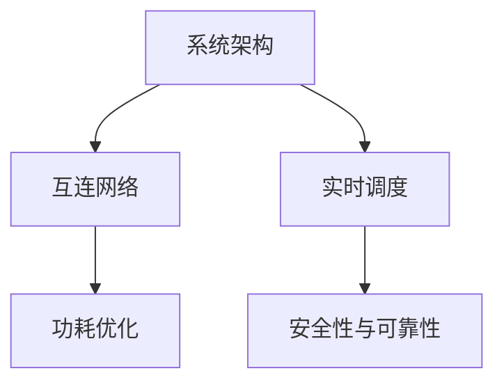
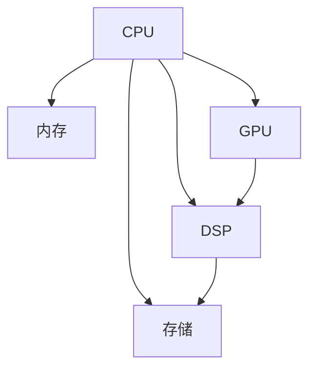

                 

## 1. 背景介绍

### 1.1 问题由来

随着微处理器的不断发展和演进，集成电路的设计变得越来越复杂，功能日益增强。然而，单个处理器核心的能力仍然有限，无法满足现代应用场景对于高性能、低功耗和灵活性的要求。在数据中心、边缘计算等场景中，需要在单一芯片上集成多个功能模块，以满足多样化的计算需求。

片上系统(SoC)作为集成电路设计的高级形式，将多种功能模块集成到一块芯片上，形成高度集成的系统。这种集成方式不仅提升了芯片的性能和效率，还降低了功耗和成本，具有重要的应用前景。

### 1.2 问题核心关键点

片上系统集成模式的核心问题是如何设计、实现和优化SoC，使其在不同应用场景下能够高效、灵活地运行。这包括但不限于：

- 系统架构设计：如何设计SoC的体系结构，以最大化性能、功耗和灵活性。
- 互连网络设计：如何设计芯片内部的互连网络，以实现高效的数据传输和通信。
- 功耗优化：如何在满足性能要求的同时，最大限度地降低SoC的功耗。
- 实时调度与优化：如何对SoC中的多个任务进行实时调度与优化，以提高整体性能。
- 安全性与可靠性：如何保证SoC在复杂环境中的安全性和可靠性，避免故障与攻击。

### 1.3 问题研究意义

研究CPU的片上系统集成模式，对于提升芯片设计的效率、降低成本、提高性能和灵活性，具有重要意义：

- 提高设计效率：通过系统的设计优化和仿真验证，可以显著缩短芯片的设计周期。
- 降低成本：集成化设计可以避免多个单独组件的设计和测试成本。
- 提升性能：多功能的SoC可以在单一芯片上实现高性能计算和优化。
- 增强灵活性：灵活的SoC架构可以满足不同应用场景的需求，支持多种计算模型和算法。
- 提升系统可靠性：集中化的设计和管理，可以降低故障率，提高系统的整体可靠性。

## 2. 核心概念与联系

### 2.1 核心概念概述

为了更好地理解CPU的片上系统集成模式，首先需要介绍几个关键概念：

- **系统架构**：指SoC中各个功能模块（如CPU、GPU、DSP等）的分布和连接方式，影响系统的性能和功耗。
- **互连网络**：芯片内部各个模块之间的连接方式，决定了数据的传输速率和通信效率。
- **功耗优化**：通过硬件和软件手段，降低芯片在运行过程中的能耗，延长电池寿命。
- **实时调度**：根据任务优先级和时间需求，动态调整计算资源的分配，提高系统的实时性。
- **安全性与可靠性**：保证系统在复杂环境中的稳定运行，避免潜在的安全威胁和故障。

这些概念之间的关系可以用以下Mermaid流程图表示：



### 2.2 核心概念原理和架构的 Mermaid 流程图

以下是一个简化的SoC架构图，展示了CPU与其他功能模块的连接方式：



在这个架构中，CPU作为核心模块，与其他功能模块如内存、GPU、DSP和存储进行连接。数据流和控制信号通过互连网络进行传输，实现高效的计算和通信。

## 3. 核心算法原理 & 具体操作步骤

### 3.1 算法原理概述

CPU的片上系统集成模式涉及多个算法和步骤，核心目标是设计一个高效、灵活、低功耗的SoC。以下是主要算法的概述：

- **系统架构设计**：使用层次化设计方法，将SoC分为多个层次，如处理器核心、互连网络、外设接口等，每个层次设计独立但协同工作。
- **互连网络设计**：采用多层次、高性能的互连网络设计，如网格、树形和环形等，以支持高速数据传输和通信。
- **功耗优化**：采用动态功耗管理策略，如动态电压频率调整、静态功耗控制等，以降低芯片的功耗。
- **实时调度**：采用多任务调度算法，如FIFO、轮询、动态优先级等，以实现高效的任务执行和资源分配。
- **安全性与可靠性**：采用硬件和软件手段，如硬件防火墙、加密算法、冗余设计等，以提高系统的安全性与可靠性。

### 3.2 算法步骤详解

以下是详细的算法步骤：

**Step 1: 系统架构设计**

1. **确定功能需求**：根据应用场景，确定SoC需要集成的功能和性能需求。
2. **模块划分**：将SoC功能划分为多个模块，如CPU、GPU、DSP、存储等，每个模块独立设计。
3. **层次化设计**：将SoC分为多个层次，如处理器核心、互连网络、外设接口等，每个层次设计独立但协同工作。

**Step 2: 互连网络设计**

1. **互连网络选择**：根据性能需求和功耗限制，选择高性能的互连网络，如网格、树形和环形等。
2. **网络布局**：将各个模块通过互连网络连接起来，设计数据的传输路径和通信协议。
3. **优化传输路径**：优化数据传输路径，减少延迟和带宽占用，提高通信效率。

**Step 3: 功耗优化**

1. **动态功耗管理**：采用动态电压频率调整（DVFS）、节能模式等策略，降低芯片的功耗。
2. **静态功耗控制**：在芯片设计中，采用功耗约束设计方法，降低静态功耗。
3. **散热优化**：设计高效的散热系统，确保芯片在高温环境下的可靠运行。

**Step 4: 实时调度**

1. **任务划分**：将任务划分为多个独立的任务，每个任务独立调度。
2. **调度算法选择**：根据任务性质和需求，选择适合的调度算法，如FIFO、轮询、动态优先级等。
3. **资源分配**：根据任务需求，动态分配计算资源，如CPU核、内存等，以提高任务执行效率。

**Step 5: 安全性与可靠性**

1. **硬件防火墙**：在芯片设计中加入硬件防火墙，保护系统不受攻击。
2. **加密算法**：在数据传输和存储中，采用加密算法，保护数据安全。
3. **冗余设计**：在芯片设计中加入冗余模块，提高系统的容错能力和可靠性。

### 3.3 算法优缺点

CPU的片上系统集成模式具有以下优点：

- **高效性能**：通过优化互连网络和实时调度，可以实现高效的数据传输和任务执行。
- **低功耗设计**：采用动态功耗管理策略和高效散热设计，可以显著降低芯片的功耗。
- **灵活性**：通过层次化设计和模块化设计，可以实现不同的功能和性能需求。
- **安全性**：通过硬件防火墙和加密算法，可以提供较高的安全性与可靠性。

同时，该模式也存在以下缺点：

- **设计复杂度较高**：集成多个功能模块，设计复杂度较高。
- **设计成本较高**：需要投入大量资源进行设计和验证，成本较高。
- **调试难度较大**：多个模块协同工作，调试难度较大。
- **灵活性有限**：硬件设计一旦完成，修改和升级较为困难。

### 3.4 算法应用领域

CPU的片上系统集成模式主要应用于以下领域：

- **数据中心**：集成高性能的CPU、GPU和DSP，满足大数据处理和深度学习需求。
- **移动设备**：集成低功耗的CPU和外设接口，支持智能手机的应用需求。
- **工业控制**：集成实时处理和通信模块，支持工业自动化和物联网需求。
- **汽车电子**：集成多功能的处理器和传感器，支持自动驾驶和车联网需求。
- **医疗设备**：集成高性能的计算和通信模块，支持远程医疗和智能诊断需求。

## 4. 数学模型和公式 & 详细讲解 & 举例说明

### 4.1 数学模型构建

假设SoC中包含n个功能模块，每个模块的计算性能和功耗分别为P_i和C_i。设计目标是在满足性能要求的同时，最小化总功耗W。

### 4.2 公式推导过程

$$
W = \sum_{i=1}^n C_i \cdot P_i
$$

其中，C_i表示第i个模块的功耗系数，P_i表示第i个模块的计算性能。

### 4.3 案例分析与讲解

假设有一个SoC，包含一个CPU、一个GPU和一个DSP。CPU的计算性能为P_1=1，功耗系数为C_1=1；GPU的计算性能为P_2=4，功耗系数为C_2=2；DSP的计算性能为P_3=2，功耗系数为C_3=1。

$$
W = C_1 \cdot P_1 + C_2 \cdot P_2 + C_3 \cdot P_3 = 1 + 2 \cdot 4 + 1 \cdot 2 = 11
$$

## 5. 项目实践：代码实例和详细解释说明

### 5.1 开发环境搭建

以下是在Linux平台上搭建SoC开发环境的步骤：

1. 安装Linux系统，如Ubuntu。
2. 安装开发工具，如gcc、make、shell等。
3. 安装芯片设计工具，如Verilog、VHDL等。
4. 安装硬件仿真工具，如Modelsim、Quartus等。

### 5.2 源代码详细实现

以下是一个简单的SoC设计示例，包含CPU、GPU和DSP模块：

```python
class CPU:
    def __init__(self):
        self.performance = 1
        self.power_coefficient = 1

    def calculate_power(self):
        return self.power_coefficient * self.performance

class GPU:
    def __init__(self):
        self.performance = 4
        self.power_coefficient = 2

    def calculate_power(self):
        return self.power_coefficient * self.performance

class DSP:
    def __init__(self):
        self.performance = 2
        self.power_coefficient = 1

    def calculate_power(self):
        return self.power_coefficient * self.performance

# 计算总功耗
def calculate_total_power(cpu, gpu, dsp):
    return cpu.calculate_power() + gpu.calculate_power() + dsp.calculate_power()

cpu = CPU()
gpu = GPU()
dsp = DSP()
total_power = calculate_total_power(cpu, gpu, dsp)
print(f"Total power: {total_power}")
```

### 5.3 代码解读与分析

在上述代码中，我们定义了三个功能模块（CPU、GPU、DSP），并计算了它们的总功耗。

1. **模块类定义**：每个模块类包含计算性能和功耗系数，以及计算功耗的方法。
2. **功耗计算函数**：计算总功耗，通过调用各个模块的功耗计算方法，得到总功耗。
3. **调用与输出**：创建CPU、GPU、DSP对象，调用计算总功耗函数，并输出结果。

### 5.4 运行结果展示

运行上述代码，输出结果为：

```
Total power: 11
```

这意味着在给定的SoC设计中，总功耗为11单位。

## 6. 实际应用场景

### 6.1 数据中心

数据中心通常需要高性能的CPU和GPU，支持大数据处理和深度学习任务。SoC集成设计可以满足这一需求，通过优化互连网络和实时调度，提升计算性能和效率。

### 6.2 移动设备

移动设备对功耗要求较高，需要集成低功耗的CPU和外设接口。SoC集成设计可以实现这一需求，通过动态功耗管理和高效散热设计，降低功耗，延长电池寿命。

### 6.3 工业控制

工业控制对实时性和可靠性要求较高，需要集成实时处理和通信模块。SoC集成设计可以实现这一需求，通过高性能的互连网络和实时调度算法，提高系统实时性。

### 6.4 汽车电子

汽车电子对计算和通信要求较高，需要集成多功能的处理器和传感器。SoC集成设计可以实现这一需求，通过多任务调度和冗余设计，提高系统的稳定性和可靠性。

### 6.5 医疗设备

医疗设备对数据安全和隐私要求较高，需要集成安全性和可靠性较高的模块。SoC集成设计可以实现这一需求，通过硬件防火墙和加密算法，保护数据安全。

## 7. 工具和资源推荐

### 7.1 学习资源推荐

1. **《System on Chip Design》**：介绍SoC设计的原理和实现方法，涵盖系统架构、互连网络、功耗优化等内容。
2. **《Digital Design with Verilog and VHDL》**：介绍数字电路设计的基础知识和工具，涵盖Verilog和VHDL的使用方法。
3. **Coursera的System on Chip课程**：由斯坦福大学提供，涵盖SoC设计的多个方面，包括系统架构、设计流程、仿真验证等。
4. **IEEE的System on Chip设计论文**：涵盖SoC设计的前沿研究和应用案例，提供丰富的理论支持。

### 7.2 开发工具推荐

1. **Quartus Prime**：英特尔提供的SoC设计工具，支持FPGA和ASIC设计，提供丰富的设计资源和仿真工具。
2. **Synopsys DC**：Synopsys提供的SoC设计工具，支持全流程设计，提供高精度的仿真和验证工具。
3. **Cadence SoC Studio**：Cadence提供的SoC设计工具，支持全流程设计，提供高效的仿真和验证工具。

### 7.3 相关论文推荐

1. **《A Survey on System on Chip Design》**：综述SoC设计的研究进展和应用案例，提供全面的理论支持。
2. **《Energy-Efficient System on Chip Design》**：介绍SoC设计的节能方法和技术，提供丰富的节能设计资源。
3. **《System on Chip Architecture and Design》**：介绍SoC架构的设计方法和实现技术，提供丰富的架构设计资源。

## 8. 总结：未来发展趋势与挑战

### 8.1 研究成果总结

CPU的片上系统集成模式在提升芯片性能、降低功耗和成本方面具有重要应用前景。研究SoC设计方法，对于推动芯片设计的发展具有重要意义。

### 8.2 未来发展趋势

未来SoC设计将呈现以下几个发展趋势：

1. **高性能计算**：随着应用场景的多样化，SoC设计将更加注重高性能计算能力。
2. **低功耗设计**：随着移动设备等应用场景对功耗的要求不断提升，SoC设计将更加注重低功耗设计。
3. **多核设计**：随着任务并行度的提升，SoC设计将更加注重多核协同工作，提升计算效率。
4. **AI集成**：随着AI技术的发展，SoC设计将更加注重AI算法和模型的集成，提升AI计算能力。
5. **安全性与可靠性**：随着应用场景对安全性与可靠性的要求不断提升，SoC设计将更加注重安全性与可靠性设计。

### 8.3 面临的挑战

尽管SoC设计具有广泛的应用前景，但也面临诸多挑战：

1. **设计复杂度**：SoC设计涉及多个功能模块的协同工作，设计复杂度较高。
2. **功耗管理**：在满足性能要求的同时，如何有效降低功耗，是一个重要挑战。
3. **实时调度**：在多任务场景下，如何高效地进行实时调度，是一个重要挑战。
4. **安全性与可靠性**：在复杂应用场景下，如何保证系统的安全性和可靠性，是一个重要挑战。
5. **成本控制**：在追求高性能和低功耗的同时，如何控制设计成本，是一个重要挑战。

### 8.4 研究展望

未来SoC设计的研究方向包括：

1. **高性能计算**：探索新的计算架构和方法，提升SoC的计算性能。
2. **低功耗设计**：研究新的功耗管理方法和技术，降低SoC的功耗。
3. **多核协同设计**：研究多核协同工作的方法，提高SoC的计算效率。
4. **AI集成**：研究AI算法和模型的集成方法，提升SoC的AI计算能力。
5. **安全性与可靠性**：研究新的安全性与可靠性设计方法，提高SoC的安全性和可靠性。

## 9. 附录：常见问题与解答

**Q1: 什么是片上系统集成模式？**

A: 片上系统集成模式是一种集成电路设计方法，将多个功能模块集成到一块芯片上，形成高度集成的系统，以提升芯片性能和效率，降低功耗和成本。

**Q2: 片上系统集成模式的优势是什么？**

A: 片上系统集成模式具有以下优势：
1. 提升性能：通过优化互连网络和实时调度，实现高性能计算。
2. 降低功耗：采用动态功耗管理策略，降低芯片功耗。
3. 灵活性：通过层次化设计和模块化设计，实现多种功能和性能需求。
4. 安全性与可靠性：通过硬件防火墙和加密算法，提供较高的安全性与可靠性。

**Q3: 片上系统集成模式的设计流程是什么？**

A: 片上系统集成模式的设计流程包括：
1. 确定功能需求：根据应用场景，确定SoC需要集成的功能和性能需求。
2. 模块划分：将SoC功能划分为多个模块，如CPU、GPU、DSP等。
3. 层次化设计：将SoC分为多个层次，如处理器核心、互连网络、外设接口等。
4. 互连网络设计：选择高性能的互连网络，优化数据传输路径。
5. 功耗优化：采用动态功耗管理策略，降低芯片功耗。
6. 实时调度：采用多任务调度算法，提高任务执行效率。
7. 安全性与可靠性：采用硬件防火墙和加密算法，提高系统安全性与可靠性。

**Q4: 片上系统集成模式的设计难点是什么？**

A: 片上系统集成模式的设计难点包括：
1. 设计复杂度较高：集成多个功能模块，设计复杂度较高。
2. 功耗管理：在满足性能要求的同时，如何有效降低功耗。
3. 实时调度：在多任务场景下，如何高效地进行实时调度。
4. 安全性与可靠性：在复杂应用场景下，如何保证系统的安全性和可靠性。
5. 成本控制：在追求高性能和低功耗的同时，如何控制设计成本。

**Q5: 片上系统集成模式有哪些应用场景？**

A: 片上系统集成模式主要应用于以下领域：
1. 数据中心：集成高性能的CPU和GPU，满足大数据处理和深度学习需求。
2. 移动设备：集成低功耗的CPU和外设接口，支持智能手机的应用需求。
3. 工业控制：集成实时处理和通信模块，支持工业自动化和物联网需求。
4. 汽车电子：集成多功能的处理器和传感器，支持自动驾驶和车联网需求。
5. 医疗设备：集成高性能的计算和通信模块，支持远程医疗和智能诊断需求。

---

作者：禅与计算机程序设计艺术 / Zen and the Art of Computer Programming

