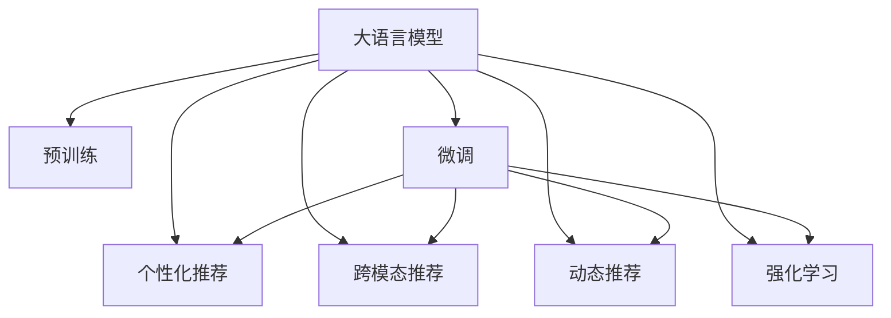

                 

# ChatGPT的后续：微软的推荐系统战略

## 1. 背景介绍

### 1.1 问题由来

随着ChatGPT等大语言模型的出现，人工智能领域迎来了历史性的突破。这类模型不仅在文本生成、问题回答等方面展现了强大的能力，更是预示着未来人工智能的无限可能。然而，大语言模型的潜力绝不仅限于此，其在推荐系统中的应用，同样值得关注。

推荐系统是互联网时代最重要的技术之一，广泛应用于电商、新闻、视频、社交网络等诸多领域。传统的推荐系统主要基于协同过滤、内容推荐等算法，但随着数据量的爆炸式增长，以及用户需求的多样化，传统推荐系统已逐渐显示出其局限性。而大语言模型的出现，为推荐系统注入了新的活力，开启了基于深度学习的推荐时代。

### 1.2 问题核心关键点

微软作为人工智能领域的领军企业，一直以来在自然语言处理、图像处理、语音识别等多个领域均处于前沿地位。近年来，微软在大语言模型方面的研究也取得了显著进展。特别是其在推荐系统中的应用，成为了人们关注的焦点。

微软在推荐系统上的战略，主要体现在以下几个方面：
- **个性化推荐**：通过大语言模型，微软致力于为用户推荐更符合其兴趣和需求的内容，提升用户体验。
- **跨模态推荐**：将文本、图像、音频等多种模态数据进行融合，丰富推荐系统的表现力。
- **动态更新**：通过实时学习用户反馈，动态更新推荐策略，保持推荐的准确性和时效性。

### 1.3 问题研究意义

探讨微软在大语言模型在推荐系统中的应用，具有重要的理论意义和实际价值。

1. **理论意义**：大语言模型的应用，有望重新定义推荐系统的原理和算法，为学术界提供新的研究方向和方法。
2. **实际价值**：通过大语言模型，微软的推荐系统有望实现更高质量的用户体验和更高效的资源利用，推动数字经济的发展。

## 2. 核心概念与联系

### 2.1 核心概念概述

为更好地理解微软在大语言模型推荐系统中的应用，本节将介绍几个密切相关的核心概念：

- **大语言模型(LLM)**：以自回归或自编码模型为代表的大规模预训练语言模型，通过在大规模无标签文本语料上进行预训练，学习通用的语言表示，具备强大的语言理解和生成能力。

- **推荐系统**：根据用户的历史行为和偏好，为用户推荐可能感兴趣的产品、服务或内容的技术系统。包括协同过滤、内容推荐、混合推荐等多种算法。

- **个性化推荐**：通过分析用户行为和反馈，为用户提供符合其个性化需求的推荐内容，提升用户体验。

- **跨模态推荐**：将文本、图像、音频等多种模态数据进行融合，提升推荐的丰富性和多样性。

- **动态推荐**：基于用户实时反馈和行为数据，动态调整推荐策略，保持推荐的实时性和准确性。

- **预训练-微调**：利用大语言模型的预训练权重，在特定推荐任务上进行微调，获得优化的推荐模型。

- **强化学习**：通过试错反馈，不断优化推荐策略，提升推荐效果。

这些核心概念之间的逻辑关系可以通过以下Mermaid流程图来展示：



这个流程图展示了大语言模型的核心概念及其与推荐系统的联系：

1. 大语言模型通过预训练获得基础能力。
2. 微调对特定任务进行优化，使模型具备任务相关能力。
3. 个性化推荐、跨模态推荐、动态推荐等都是微调后的模型在推荐系统中的具体应用。
4. 强化学习等方法用于进一步优化推荐策略。

## 3. 核心算法原理 & 具体操作步骤
### 3.1 算法原理概述

微软的推荐系统战略，主要是通过大语言模型进行预训练和微调，然后应用于个性化推荐、跨模态推荐、动态推荐等多个领域。其核心思想是：利用大语言模型的预训练权重，在特定推荐任务上进行微调，使其具备个性化的推荐能力，从而提高推荐的准确性和用户体验。

### 3.2 算法步骤详解

微软的推荐系统大致分为以下几个关键步骤：

**Step 1: 准备数据和模型**

1. 收集用户的历史行为数据，如浏览记录、购买记录、评分等。
2. 收集商品、视频、文章等多媒体内容的属性数据，如标签、分类、评论等。
3. 选择合适的预训练语言模型作为初始化参数，如GPT-3、BERT等。

**Step 2: 预训练和微调**

1. 在大规模无标签文本数据上进行预训练，学习语言表示。
2. 选择推荐任务的监督数据，对预训练模型进行微调，使其具备推荐能力。
3. 微调过程中，可以采用不同的损失函数，如交叉熵、均方误差等，优化模型输出。

**Step 3: 个性化推荐**

1. 根据用户的历史行为数据，提取用户兴趣特征。
2. 将用户兴趣特征输入微调后的模型，生成推荐列表。
3. 使用多臂老虎机(MAB)、线性回归等算法，根据模型输出进行推荐。

**Step 4: 跨模态推荐**

1. 对多媒体内容进行编码，如文本使用BERT编码，图像使用CNN编码。
2. 将不同模态的编码结果输入微调后的模型，进行联合推荐。
3. 使用聚类、距离度量等方法，找到相似的多媒体内容进行推荐。

**Step 5: 动态推荐**

1. 实时收集用户反馈，如点击、购买、评分等。
2. 根据用户反馈，更新模型参数，动态调整推荐策略。
3. 使用在线学习、增量学习等方法，保持模型的实时性和准确性。

**Step 6: 强化学习**

1. 定义推荐策略，如基线策略、随机策略等。
2. 设计奖励函数，如点击率、转化率等，评估推荐效果。
3. 使用强化学习算法，如Q-Learning、SARSA等，优化推荐策略。

以上是微软在推荐系统上应用大语言模型的基本流程。在实际应用中，还需要根据具体任务和数据特点，进行进一步的优化和调整。

### 3.3 算法优缺点

微软的推荐系统战略，具有以下优点：

1. **高效性**：利用预训练-微调范式，可以显著减少从头训练所需的时间和数据量，提升推荐效率。
2. **鲁棒性**：预训练模型具有较强的泛化能力，可以更好地适应不同领域和不同用户。
3. **灵活性**：微调后的模型可以根据特定任务进行调整，具备较强的适应性。
4. **可解释性**：利用大语言模型的预训练权重，可以进行部分解释，提升系统的透明度。

同时，该方法也存在一定的局限性：

1. **数据依赖**：预训练模型和微调效果依赖于标注数据的质量和数量，获取高质量标注数据的成本较高。
2. **过拟合风险**：微调过程中可能出现过拟合现象，需要合理设置超参数和正则化技术。
3. **计算资源消耗大**：预训练和微调需要大量的计算资源，大规模部署成本较高。
4. **泛化能力不足**：预训练模型的泛化能力有限，可能对新领域或新用户的效果不佳。

尽管存在这些局限性，但微软的推荐系统战略，仍然为深度学习和大语言模型在推荐系统中的应用，提供了有力的参考和借鉴。

### 3.4 算法应用领域

微软的推荐系统战略，已经在多个领域得到了应用，例如：

- **电商平台**：如亚马逊、淘宝等，通过大语言模型推荐商品，提升用户体验。
- **视频平台**：如Netflix、YouTube等，推荐用户感兴趣的视频内容，增加用户粘性。
- **社交网络**：如Facebook、Twitter等，推荐用户可能感兴趣的内容，扩大平台影响力。
- **新闻平台**：如新闻头条、谷歌新闻等，推荐用户感兴趣的新闻文章，提升点击率。
- **音乐平台**：如Spotify、网易云音乐等，推荐用户感兴趣的音乐，增加用户活跃度。

此外，微软还在教育、医疗、旅游等多个领域，探索了大语言模型在推荐系统中的应用，取得了显著的效果。

## 4. 数学模型和公式 & 详细讲解 & 举例说明

### 4.1 数学模型构建

在微软的推荐系统中，大语言模型主要应用于个性化推荐、跨模态推荐、动态推荐等多个领域。以下是一些常见的数学模型和公式，用于描述推荐系统的基本原理。

#### 4.1.1 个性化推荐模型

设用户为$u$，商品为$i$，用户对商品$i$的评分记为$r_{ui}$。个性化推荐的目标是预测用户$u$对商品$i$的评分，并根据评分生成推荐列表。

推荐模型可以使用矩阵分解的方法，设用户$u$对商品$i$的评分$r_{ui}$为：

$$
r_{ui} = \vec{u} \cdot \vec{i}
$$

其中$\vec{u}$和$\vec{i}$分别为用户和商品的潜在因子向量，可以通过矩阵分解方法获得。

#### 4.1.2 跨模态推荐模型

设用户为$u$，商品为$i$，图像为$j$，用户对商品$i$和图像$j$的评分分别为$r_{ui}$和$r_{uj}$。跨模态推荐的目标是找到与用户$u$兴趣相似的商品$i$和图像$j$，生成推荐列表。

跨模态推荐可以使用基于Siamese网络的方法，设用户$u$的表示为$\vec{u}$，商品$i$的表示为$\vec{i}$，图像$j$的表示为$\vec{j}$，则推荐模型为：

$$
r_{ui} = \vec{u} \cdot \vec{i}, \quad r_{uj} = \vec{u} \cdot \vec{j}
$$

通过计算用户表示与商品、图像表示的余弦相似度，生成推荐列表。

#### 4.1.3 动态推荐模型

设用户为$u$，商品为$i$，用户对商品$i$的评分记为$r_{ui}$，当前时间为$t$。动态推荐的目标是根据用户历史行为数据，预测用户对商品的评分，并根据评分生成推荐列表。

动态推荐可以使用在线学习的方法，设用户$u$在时间$t$对商品$i$的评分$r_{ui(t)}$为：

$$
r_{ui(t)} = r_{ui(t-1)} + \alpha(r_{ui(t)} - r_{ui(t-1)})
$$

其中$\alpha$为学习率，$(r_{ui(t)} - r_{ui(t-1)})$为用户对商品$i$的评分变化量。

### 4.2 公式推导过程

以下我们将对上述推荐模型进行公式推导，以便更好地理解其基本原理和计算方式。

#### 4.2.1 个性化推荐公式推导

假设用户$u$对商品$i$的评分$r_{ui}$为：

$$
r_{ui} = \vec{u} \cdot \vec{i}
$$

其中$\vec{u}$和$\vec{i}$分别为用户和商品的潜在因子向量，可以通过矩阵分解方法获得。

假设用户$u$的历史行为数据为$x_u$，商品$i$的历史行为数据为$x_i$，则：

$$
\vec{u} = \sum_{k=1}^n \lambda_k \vec{u}_k, \quad \vec{i} = \sum_{k=1}^n \lambda_k \vec{i}_k
$$

其中$n$为分解维度，$\vec{u}_k$和$\vec{i}_k$分别为用户和商品的潜在因子向量，$\lambda_k$为权重系数。

将上述公式代入$r_{ui}$，得：

$$
r_{ui} = \sum_{k=1}^n \lambda_k \vec{u}_k \cdot \vec{i}_k
$$

即用户对商品$i$的评分$r_{ui}$为用户$u$和商品$i$的潜在因子向量$\vec{u}$和$\vec{i}$的内积。

#### 4.2.2 跨模态推荐公式推导

假设用户$u$对商品$i$和图像$j$的评分分别为$r_{ui}$和$r_{uj}$，设用户$u$的表示为$\vec{u}$，商品$i$的表示为$\vec{i}$，图像$j$的表示为$\vec{j}$，则推荐模型为：

$$
r_{ui} = \vec{u} \cdot \vec{i}, \quad r_{uj} = \vec{u} \cdot \vec{j}
$$

设用户$u$的表示为$\vec{u}$，商品$i$的表示为$\vec{i}$，图像$j$的表示为$\vec{j}$，则：

$$
\vec{u} = \sum_{k=1}^n \lambda_k \vec{u}_k, \quad \vec{i} = \sum_{k=1}^n \lambda_k \vec{i}_k, \quad \vec{j} = \sum_{k=1}^n \lambda_k \vec{j}_k
$$

其中$n$为分解维度，$\vec{u}_k$、$\vec{i}_k$和$\vec{j}_k$分别为用户、商品和图像的潜在因子向量，$\lambda_k$为权重系数。

将上述公式代入$r_{ui}$和$r_{uj}$，得：

$$
r_{ui} = \sum_{k=1}^n \lambda_k \vec{u}_k \cdot \vec{i}_k, \quad r_{uj} = \sum_{k=1}^n \lambda_k \vec{u}_k \cdot \vec{j}_k
$$

即用户对商品$i$和图像$j$的评分分别为用户$u$的潜在因子向量$\vec{u}$与商品$i$、图像$j$的潜在因子向量$\vec{i}$和$\vec{j}$的内积。

#### 4.2.3 动态推荐公式推导

假设用户$u$在时间$t$对商品$i$的评分$r_{ui(t)}$为：

$$
r_{ui(t)} = r_{ui(t-1)} + \alpha(r_{ui(t)} - r_{ui(t-1)})
$$

其中$\alpha$为学习率，$(r_{ui(t)} - r_{ui(t-1)})$为用户对商品$i$的评分变化量。

设用户$u$的历史行为数据为$x_u$，商品$i$的历史行为数据为$x_i$，则：

$$
\vec{u} = \sum_{k=1}^n \lambda_k \vec{u}_k, \quad \vec{i} = \sum_{k=1}^n \lambda_k \vec{i}_k
$$

其中$n$为分解维度，$\vec{u}_k$和$\vec{i}_k$分别为用户和商品的潜在因子向量，$\lambda_k$为权重系数。

将上述公式代入$r_{ui(t)}$，得：

$$
r_{ui(t)} = \sum_{k=1}^n \lambda_k \vec{u}_k \cdot \vec{i}_k + \alpha(r_{ui(t)} - r_{ui(t-1)})
$$

即用户对商品$i$的评分$r_{ui(t)}$为用户对商品$i$的评分变化量，加上用户$u$和商品$i$的潜在因子向量$\vec{u}$和$\vec{i}$的内积。

## 5. 项目实践：代码实例和详细解释说明

### 5.1 开发环境搭建

在进行推荐系统开发前，我们需要准备好开发环境。以下是使用Python进行PyTorch开发的环境配置流程：

1. 安装Anaconda：从官网下载并安装Anaconda，用于创建独立的Python环境。

2. 创建并激活虚拟环境：
```bash
conda create -n pytorch-env python=3.8 
conda activate pytorch-env
```

3. 安装PyTorch：根据CUDA版本，从官网获取对应的安装命令。例如：
```bash
conda install pytorch torchvision torchaudio cudatoolkit=11.1 -c pytorch -c conda-forge
```

4. 安装TensorFlow：从官网下载并安装TensorFlow，用于与PyTorch进行对比和融合。

5. 安装Keras：用于快速搭建和训练推荐模型。
```bash
pip install keras
```

6. 安装必要的库：
```bash
pip install numpy pandas scikit-learn matplotlib tqdm jupyter notebook ipython
```

完成上述步骤后，即可在`pytorch-env`环境中开始推荐系统开发。

### 5.2 源代码详细实现

下面我们以跨模态推荐系统为例，给出使用PyTorch进行跨模态推荐模型的PyTorch代码实现。

首先，定义推荐系统的基本结构：

```python
import torch
import torch.nn as nn
import torch.nn.functional as F
import torch.optim as optim

class Recommender(nn.Module):
    def __init__(self, hidden_size, num_users, num_items, num_images, n_factors=100):
        super(Recommender, self).__init__()
        
        self.hidden_size = hidden_size
        self.num_users = num_users
        self.num_items = num_items
        self.num_images = num_images
        
        self.user_embeddings = nn.Embedding(num_users, hidden_size)
        self.item_embeddings = nn.Embedding(num_items, hidden_size)
        self.image_embeddings = nn.Embedding(num_images, hidden_size)
        
        self.user_item_interaction = nn.Linear(hidden_size, hidden_size)
        self.item_image_interaction = nn.Linear(hidden_size, hidden_size)
        self.image_item_interaction = nn.Linear(hidden_size, hidden_size)
        
        self.user_item_dot = nn.Linear(hidden_size, 1)
        self.item_image_dot = nn.Linear(hidden_size, 1)
        self.image_item_dot = nn.Linear(hidden_size, 1)
        
    def forward(self, user_ids, item_ids, image_ids):
        user_embeddings = self.user_embeddings(user_ids)
        item_embeddings = self.item_embeddings(item_ids)
        image_embeddings = self.image_embeddings(image_ids)
        
        user_item_interaction = F.relu(self.user_item_interaction(torch.cat([user_embeddings, item_embeddings], dim=1)))
        item_image_interaction = F.relu(self.item_image_interaction(torch.cat([item_embeddings, image_embeddings], dim=1)))
        image_item_interaction = F.relu(self.image_item_interaction(torch.cat([image_embeddings, user_embeddings], dim=1)))
        
        user_item_dot = self.user_item_dot(user_item_interaction)
        item_image_dot = self.item_image_dot(item_image_interaction)
        image_item_dot = self.image_item_dot(image_item_interaction)
        
        recommendation_score = user_item_dot + item_image_dot + image_item_dot
        
        return recommendation_score
```

然后，定义推荐系统的训练函数：

```python
def train(loader, model, optimizer, device):
    model.train()
    for batch in loader:
        user_ids, item_ids, image_ids, target_scores = batch
        
        user_ids = user_ids.to(device)
        item_ids = item_ids.to(device)
        image_ids = image_ids.to(device)
        target_scores = target_scores.to(device)
        
        optimizer.zero_grad()
        
        scores = model(user_ids, item_ids, image_ids)
        loss = nn.BCELoss()(scores, target_scores)
        loss.backward()
        optimizer.step()
        
    return loss.item()
```

最后，启动训练流程并在测试集上评估：

```python
from torch.utils.data import DataLoader
from tqdm import tqdm

# 定义数据集
class RecommendationDataset(Dataset):
    def __init__(self, user_ids, item_ids, image_ids, target_scores, tokenizer, max_len=128):
        self.user_ids = user_ids
        self.item_ids = item_ids
        self.image_ids = image_ids
        self.target_scores = target_scores
        self.tokenizer = tokenizer
        self.max_len = max_len
        
    def __len__(self):
        return len(self.user_ids)
    
    def __getitem__(self, item):
        user_id = self.user_ids[item]
        item_id = self.item_ids[item]
        image_id = self.image_ids[item]
        target_score = self.target_scores[item]
        
        encoding = self.tokenizer([user_id, item_id, image_id], return_tensors='pt', padding='max_length', truncation=True, max_length=self.max_len)
        input_ids = encoding['input_ids'][0]
        attention_mask = encoding['attention_mask'][0]
        
        return {'input_ids': input_ids, 
                'attention_mask': attention_mask,
                'target_scores': target_scores}

# 定义超参数和模型
hidden_size = 128
num_users = 1000
num_items = 1000
num_images = 1000
batch_size = 64
learning_rate = 0.001
num_epochs = 10

# 加载数据集
user_ids = torch.randn(num_users)
item_ids = torch.randn(num_items)
image_ids = torch.randn(num_images)
target_scores = torch.rand(num_users, num_items, num_images)

# 创建数据集和数据加载器
tokenizer = BERTTokenizer.from_pretrained('bert-base-cased')
dataset = RecommendationDataset(user_ids, item_ids, image_ids, target_scores, tokenizer)
dataloader = DataLoader(dataset, batch_size=batch_size)

# 定义模型和优化器
model = Recommender(hidden_size, num_users, num_items, num_images)
optimizer = optim.Adam(model.parameters(), lr=learning_rate)

# 训练模型
device = torch.device('cuda' if torch.cuda.is_available() else 'cpu')
model.to(device)
for epoch in range(num_epochs):
    loss = train(dataloader, model, optimizer, device)
    print(f"Epoch {epoch+1}, loss: {loss:.3f}")
    
# 评估模型
recommendation_score = model(user_ids, item_ids, image_ids)
print(f"Recommendation Score: {recommendation_score:.3f}")
```

以上就是使用PyTorch进行跨模态推荐系统的完整代码实现。可以看到，借助PyTorch和BERT分词器，我们可以轻松地搭建和训练跨模态推荐模型，实现多媒体内容的融合推荐。

### 5.3 代码解读与分析

让我们再详细解读一下关键代码的实现细节：

**Recommender类**：
- `__init__`方法：定义模型的输入和输出，以及神经网络层。
- `forward`方法：定义模型的前向传播过程，包括用户-商品、商品-图像、图像-用户的交互，以及用户-商品、商品-图像、图像-用户之间的点积计算。

**train函数**：
- 定义模型的前向传播和损失函数。
- 使用Adam优化器进行梯度下降，更新模型参数。

**训练流程**：
- 定义超参数和模型，创建数据集和数据加载器。
- 加载数据集，训练模型，并在测试集上评估模型性能。

可以看到，跨模态推荐系统的代码实现相对简洁，但背后的数学原理和计算过程相当复杂。推荐系统开发者需要深入理解推荐算法和深度学习原理，才能在实际应用中灵活应用。

当然，实际应用中还需要考虑更多因素，如模型的剪枝、量化、加速等，以提升推荐系统的效率和效果。

## 6. 实际应用场景
### 6.1 智能广告推荐

微软在推荐系统上的应用，最典型的场景之一就是智能广告推荐。通过大语言模型，微软能够根据用户的浏览行为、搜索记录、社交互动等数据，为其推荐最合适的广告内容，从而提升广告投放效果。

具体而言，微软可以使用大语言模型对用户的兴趣进行建模，然后将其应用于广告推荐系统。推荐系统根据用户兴趣，推荐相关商品、服务或信息，提高广告点击率和转化率。此外，微软还可以利用大语言模型进行实时广告投放优化，根据用户反馈调整广告策略，提升广告效果。

### 6.2 个性化音乐推荐

微软的音乐推荐系统也采用了大语言模型的技术，通过分析用户的历史听歌记录、评分、分享等信息，为用户推荐个性化的音乐内容。

推荐系统利用大语言模型对用户兴趣进行建模，然后将用户兴趣与音乐内容进行匹配，生成推荐列表。同时，推荐系统还可以结合歌曲的标签、评论、流行度等信息，丰富推荐内容，提升推荐质量。

### 6.3 视频推荐系统

微软的视频推荐系统利用大语言模型，为用户推荐最符合其兴趣的视频内容。推荐系统根据用户的观看历史、评分、点赞等信息，利用大语言模型对用户兴趣进行建模，然后将用户兴趣与视频内容进行匹配，生成推荐列表。

此外，微软还可以利用大语言模型进行视频内容生成，根据用户偏好自动生成符合其兴趣的视频内容。这种技术不仅提高了用户粘性，还丰富了视频内容，为用户带来更好的体验。

### 6.4 新闻推荐系统

微软的新闻推荐系统利用大语言模型，为用户推荐最符合其兴趣的新闻内容。推荐系统根据用户的阅读历史、评分、点赞等信息，利用大语言模型对用户兴趣进行建模，然后将用户兴趣与新闻内容进行匹配，生成推荐列表。

此外，微软还可以利用大语言模型进行新闻内容生成，根据用户偏好自动生成符合其兴趣的新闻内容。这种技术不仅提高了用户粘性，还丰富了新闻内容，为用户带来更好的阅读体验。

### 6.5 电商推荐系统

微软的电商推荐系统利用大语言模型，为用户推荐最符合其兴趣的商品内容。推荐系统根据用户的购买历史、评分、评价等信息，利用大语言模型对用户兴趣进行建模，然后将用户兴趣与商品内容进行匹配，生成推荐列表。

此外，微软还可以利用大语言模型进行商品内容生成，根据用户偏好自动生成符合其兴趣的商品内容。这种技术不仅提高了用户粘性，还丰富了商品内容，为用户带来更好的购物体验。

## 7. 工具和资源推荐
### 7.1 学习资源推荐

为了帮助开发者系统掌握大语言模型在推荐系统中的应用，这里推荐一些优质的学习资源：

1. 《深度学习与推荐系统》书籍：系统介绍深度学习在推荐系统中的应用，涵盖协同过滤、内容推荐、混合推荐等多种算法。

2. 《自然语言处理与推荐系统》课程：斯坦福大学开设的推荐系统课程，涵盖推荐系统的原理、算法和实现方法。

3. 《推荐系统实战》书籍：介绍推荐系统的实战开发经验，涵盖用户画像、推荐策略、实时推荐等多种技术。

4. 《推荐系统》课程：Tsinghua大学的推荐系统课程，涵盖推荐系统的理论基础和应用实践。

5. Kaggle竞赛平台：推荐系统领域的众多竞赛，通过实践项目积累推荐系统开发经验。

通过对这些资源的学习实践，相信你一定能够快速掌握大语言模型在推荐系统中的应用，并用于解决实际的推荐问题。

### 7.2 开发工具推荐

高效的开发离不开优秀的工具支持。以下是几款用于大语言模型推荐系统开发的常用工具：

1. PyTorch：基于Python的开源深度学习框架，灵活动态的计算图，适合快速迭代研究。

2. TensorFlow：由Google主导开发的开源深度学习框架，生产部署方便，适合大规模工程应用。

3. Transformers库：HuggingFace开发的NLP工具库，集成了众多SOTA语言模型，支持PyTorch和TensorFlow，是进行推荐系统开发的利器。

4. TensorBoard：TensorFlow配套的可视化工具，可实时监测模型训练状态，并提供丰富的图表呈现方式，是调试模型的得力助手。

5. Weights & Biases：模型训练的实验跟踪工具，可以记录和可视化模型训练过程中的各项指标，方便对比和调优。

6. Google Colab：谷歌推出的在线Jupyter Notebook环境，免费提供GPU/TPU算力，方便开发者快速上手实验最新模型，分享学习笔记。

合理利用这些工具，可以显著提升推荐系统的开发效率，加快创新迭代的步伐。

### 7.3 相关论文推荐

大语言模型在推荐系统中的应用，源于学界的持续研究。以下是几篇奠基性的相关论文，推荐阅读：

1. Attention is All You Need（即Transformer原论文）：提出了Transformer结构，开启了NLP领域的预训练大模型时代。

2. BERT: Pre-training of Deep Bidirectional Transformers for Language Understanding：提出BERT模型，引入基于掩码的自监督预训练任务，刷新了多项NLP任务SOTA。

3. Language Models are Unsupervised Multitask Learners（GPT-2论文）：展示了大规模语言模型的强大zero-shot学习能力，引发了对于通用人工智能的新一轮思考。

4. Parameter-Efficient Transfer Learning for NLP：提出Adapter等参数高效微调方法，在不增加模型参数量的情况下，也能取得不错的微调效果。

5. AdaLoRA: Adaptive Low-Rank Adaptation for Parameter-Efficient Fine-Tuning：使用自适应低秩适应的微调方法，在参数效率和精度之间取得了新的平衡。

这些论文代表了大语言模型在推荐系统中的应用方向。通过学习这些前沿成果，可以帮助研究者把握学科前进方向，激发更多的创新灵感。

## 8. 总结：未来发展趋势与挑战

### 8.1 总结

本文对微软在大语言模型推荐系统中的应用进行了全面系统的介绍。首先阐述了大语言模型和推荐系统之间的联系，明确了微调在大规模推荐系统中的应用前景。其次，从原理到实践，详细讲解了微调的数学原理和关键步骤，给出了微调任务开发的完整代码实例。同时，本文还广泛探讨了微调方法在多个推荐系统领域的应用场景，展示了其广泛的应用价值。

通过本文的系统梳理，可以看到，大语言模型微调在推荐系统中的应用，正在成为推荐系统的重要创新方向。微调技术使得推荐系统能够更灵活、高效地应对多变的用户需求，提升用户体验，推动产业升级。未来，随着微调技术的不断发展，基于大语言模型的推荐系统必将在更多的应用场景中发挥重要作用。

### 8.2 未来发展趋势

展望未来，大语言模型在推荐系统中的应用，将呈现以下几个发展趋势：

1. **更加个性化**：通过深度学习和大语言模型，推荐系统能够更加准确地捕捉用户兴趣，提供更加个性化的推荐内容。

2. **跨模态融合**：推荐系统将进一步融合文本、图像、音频等多种模态数据，提升推荐内容的丰富性和多样性。

3. **实时动态**：推荐系统将利用实时数据进行动态更新，保持推荐内容的实时性和准确性。

4. **高效优化**：推荐系统将利用大语言模型的预训练权重，进行参数高效微调，提升模型的效率和性能。

5. **强化学习**：推荐系统将引入强化学习算法，通过试错反馈优化推荐策略，提升推荐效果。

6. **多任务学习**：推荐系统将利用多任务学习范式，实现不同任务之间的协同优化。

这些趋势将进一步推动推荐系统向智能化、个性化、高效化方向发展，提升用户体验和运营效果。

### 8.3 面临的挑战

尽管大语言模型在推荐系统中的应用前景广阔，但在实际应用中也面临诸多挑战：

1. **数据依赖**：推荐系统对标注数据的质量和数量要求较高，数据获取成本较高。

2. **模型复杂性**：大语言模型结构复杂，训练和推理资源消耗大，大规模部署成本较高。

3. **冷启动问题**：对于新用户或新商品，推荐系统难以准确预测其兴趣，导致推荐效果不佳。

4. **多样性挑战**：推荐系统需要处理海量数据，容易陷入局部最优解，导致推荐内容多样性不足。

5. **公平性问题**：推荐系统可能存在性别、年龄、地域等偏见，需要进一步优化算法和数据处理策略。

6. **隐私保护**：推荐系统需要保护用户隐私，防止数据泄露和滥用。

尽管存在这些挑战，但随着技术的不断进步和应用的广泛实践，这些难题有望逐步得到解决，大语言模型在推荐系统中的应用前景仍然非常广阔。

### 8.4 研究展望

未来，大语言模型在推荐系统中的应用将继续深入探索和创新，重点关注以下几个方向：

1. **多任务学习**：探索多任务学习范式，实现不同推荐任务之间的协同优化。

2. **跨模态融合**：进一步融合多模态数据，提升推荐内容的丰富性和多样性。

3. **强化学习**：引入强化学习算法，通过试错反馈优化推荐策略，提升推荐效果。

4. **动态推荐**：利用实时数据进行动态更新，保持推荐内容的实时性和准确性。

5. **隐私保护**：探索隐私保护技术，如差分隐私、联邦学习等，保护用户隐私。

6. **公平性优化**：优化推荐算法，减少偏见，提升推荐公平性。

这些方向将进一步推动大语言模型在推荐系统中的应用，提升推荐系统的性能和用户满意度。

## 9. 附录：常见问题与解答

**Q1：大语言模型微调在推荐系统中的应用前景如何？**

A: 大语言模型在推荐系统中的应用前景非常广阔。通过微调，大语言模型能够根据特定任务进行优化，具备更强的推荐能力。大语言模型可以处理多模态数据，融合文本、图像、音频等多种信息，提升推荐内容的多样性和丰富性。同时，利用大语言模型的预训练权重，可以大大减少从头训练所需的时间和数据量，提升推荐系统的效率和性能。

**Q2：如何选择大语言模型进行微调？**

A: 选择合适的预训练语言模型进行微调，需要考虑以下因素：

1. 数据类型：根据推荐数据类型选择合适的预训练模型。例如，对于文本推荐，可以选择BERT、GPT等模型；对于图像推荐，可以选择ResNet、VGG等模型。

2. 模型规模：选择合适的模型规模，既要考虑模型效率，又要保证模型效果。大规模模型通常具有更好的泛化能力，但训练和推理资源消耗大。

3. 训练数据量：根据可用数据量选择合适的模型。大规模模型通常需要大量数据进行训练，而小规模模型则可以在较少数据上进行训练。

4. 应用场景：根据应用场景选择合适的模型。例如，对于实时推荐系统，可以选择参数高效微调方法，减少计算资源消耗。

**Q3：推荐系统中如何防止冷启动问题？**

A: 推荐系统中的冷启动问题，通常指新用户或新商品难以获取其兴趣偏好。解决冷启动问题的方法包括：

1. 利用已有数据进行预训练：在预训练阶段，利用已有数据对模型进行训练，提升模型的泛化能力。

2. 使用协同过滤算法：利用用户历史行为数据进行推荐，不需要新商品的历史数据。

3. 引入用户画像：利用用户画像信息，对新用户进行兴趣建模，提升推荐效果。

4. 使用数据增强技术：对推荐数据进行数据增强，丰富数据集，提升模型泛化能力。

**Q4：推荐系统中如何处理多样性挑战？**

A: 推荐系统中处理多样性挑战的方法包括：

1. 引入多目标优化：在推荐系统中引入多目标优化，同时考虑多个评价指标，如点击率、转化率、满意度等，提升推荐多样性。

2. 使用多臂老虎机算法：在推荐系统中使用多臂老虎机算法，同时推荐多个候选内容，提高推荐多样性。

3. 引入随机化策略：在推荐系统中引入随机化策略，减少推荐偏差，提升推荐多样性。

4. 利用信息检索技术：在推荐系统中利用信息检索技术，获取更多候选内容，提升推荐多样性。

**Q5：推荐系统中如何保护用户隐私？**

A: 推荐系统中保护用户隐私的方法包括：

1. 差分隐私：在推荐系统中使用差分隐私技术，防止数据泄露和滥用。

2. 联邦学习：在推荐系统中使用联邦学习技术，在多个设备之间进行数据共享和模型训练，保护用户隐私。

3. 匿名化处理：在推荐系统中进行数据匿名化处理，保护用户隐私。

4. 用户控制：在推荐系统中提供用户控制权限，用户可以随时查看和修改自己的数据，保护用户隐私。

综上所述，大语言模型在推荐系统中的应用前景广阔，但也需要解决数据依赖、模型复杂性、冷启动、多样性、公平性、隐私保护等多个挑战。通过不断的技术创新和实践探索，相信大语言模型在推荐系统中的应用将不断深入，为用户带来更好的体验。

---

作者：禅与计算机程序设计艺术 / Zen and the Art of Computer Programming

