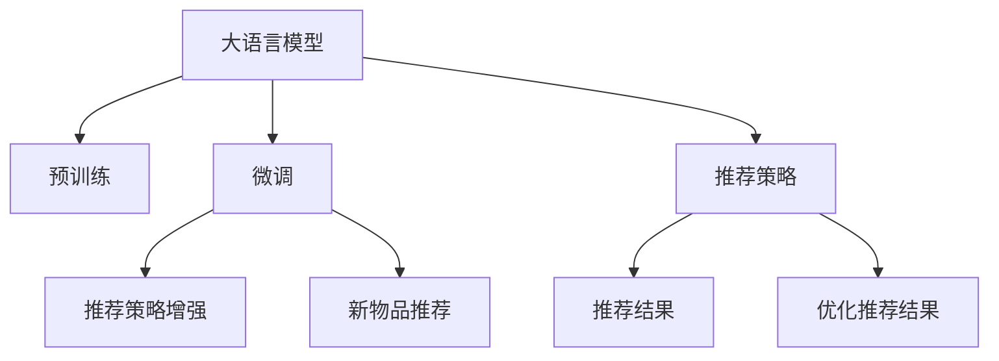

                 

## 1. 背景介绍

### 1.1 问题由来

推荐系统是智能推荐引擎的核心组件，其目标是为用户推荐最符合其兴趣和需求的物品，如商品、音乐、视频等。随着互联网的迅猛发展，推荐系统已经广泛应用于电子商务、社交媒体、视频网站等众多场景。

传统的推荐系统通常基于协同过滤、基于内容的推荐等方法，依赖于用户的行为数据或物品的描述信息。这些方法在用户量较大、物品种类丰富的场景中表现较好，但在数据稀疏、长尾物品增多时，效果往往不理想。近年来，基于深度学习的方法逐渐被引入推荐系统中，显著提升了推荐的个性化程度和覆盖率。

尽管如此，深度学习推荐系统依然面临一些难题，如模型的可解释性差、对新物品推荐的准确性不高、难以适应数据分布的变化等。大语言模型（Large Language Models，LLMs）的出现为推荐系统带来了新的突破。LLMs通过在海量文本语料上预训练，学习到丰富的语言知识，具备强大的语言生成和理解能力。这些知识可以应用于推荐系统，显著提升推荐效果。

### 1.2 问题核心关键点

LLMs在推荐系统中的应用主要包括两大方面：

1. **推荐策略增强**：使用LLMs对用户和物品进行更深层次的语义理解，构建更加精细化的推荐策略。
2. **新物品推荐**：利用LLMs生成自然语言描述，为难以获取用户反馈的新物品提供推荐依据。

LLMs在推荐系统中应用的关键在于如何有效地利用其预训练的知识，并将其与推荐策略相结合，构建更加高效的推荐系统。本节将详细介绍LLMs增强传统推荐的核心概念与联系。

### 1.3 问题研究意义

LLMs增强传统推荐系统具有以下重要意义：

1. **提升推荐个性化**：LLMs能够从海量的文本数据中学习到丰富的语言知识，捕捉用户的深层兴趣和需求。
2. **扩大推荐覆盖**：通过语言生成，LLMs能够为难以获取用户反馈的新物品提供推荐依据，扩大推荐系统的覆盖范围。
3. **提升推荐准确性**：利用LLMs对用户和物品的语义理解，推荐策略更加精细化，提升推荐系统的准确性。
4. **增强可解释性**：LLMs通过自然语言生成，能够提供更加直观和易于理解的推荐依据，提升系统的可解释性。

## 2. 核心概念与联系

### 2.1 核心概念概述

为更好地理解LLMs增强传统推荐的方法，本节将介绍几个密切相关的核心概念：

- **大语言模型（LLMs）**：以自回归（如GPT）或自编码（如BERT）模型为代表的预训练语言模型。通过在大规模无标签文本数据上进行预训练，学习到丰富的语言知识。
- **推荐系统**：利用用户的历史行为数据或物品的描述信息，为用户提供个性化的推荐。
- **预训练**：在无标签数据上训练模型，学习通用语言表示。
- **微调（Fine-Tuning）**：在预训练模型的基础上，使用下游任务的少量标注数据，通过有监督学习优化模型在特定任务上的性能。
- **推荐策略**：根据用户和物品特征，设计推荐算法的决策依据。
- **语义理解**：通过自然语言处理技术，理解用户和物品的语义含义。

这些概念之间的逻辑关系可以通过以下Mermaid流程图来展示：



这个流程图展示了LLMs增强推荐系统的一般框架：

1. 大语言模型通过预训练获得基础能力。
2. 微调是对预训练模型进行任务特定的优化，以提升在特定推荐任务上的性能。
3. 推荐策略将用户和物品特征映射为推荐结果。
4. 利用LLMs进行推荐策略增强和新物品推荐，进一步优化推荐结果。

这些概念共同构成了LLMs增强推荐系统的学习和应用框架，使其能够更好地适应推荐任务的需求。

## 3. 核心算法原理 & 具体操作步骤

### 3.1 算法原理概述

LLMs增强传统推荐系统的核心思想是：利用LLMs的语义理解能力，对用户和物品进行更深层次的特征表示，从而提升推荐系统的性能。其核心原理可以总结为以下几个步骤：

1. **预训练**：在无标签数据上训练LLMs，学习通用语言表示。
2. **微调**：对LLMs进行微调，使其适应特定推荐任务的特征表示需求。
3. **推荐策略增强**：利用微调后的LLMs，对推荐策略进行优化，提升推荐效果。
4. **新物品推荐**：利用LLMs生成自然语言描述，为新物品提供推荐依据。

通过这些步骤，LLMs能够从海量文本数据中学习到丰富的语言知识，并将其应用于推荐系统，显著提升推荐的个性化、覆盖范围和准确性。

### 3.2 算法步骤详解

基于LLMs增强推荐系统的一般流程包括以下几个关键步骤：

**Step 1: 准备预训练模型和数据集**
- 选择合适的预训练语言模型 $M_{\theta}$ 作为初始化参数，如 GPT、BERT 等。
- 准备推荐系统的训练数据集 $D=\{(x_i,y_i)\}_{i=1}^N$，其中 $x_i$ 为用户或物品特征向量，$y_i$ 为目标推荐结果。

**Step 2: 添加推荐策略**
- 根据任务类型，设计合适的推荐策略，如基于内容的推荐、协同过滤等。
- 利用微调后的LLMs，对用户和物品进行特征表示，计算用户与物品的相似度。

**Step 3: 设置微调超参数**
- 选择合适的优化算法及其参数，如 AdamW、SGD 等，设置学习率、批大小、迭代轮数等。
- 设置正则化技术及强度，包括权重衰减、Dropout、Early Stopping 等。
- 确定冻结预训练参数的策略，如仅微调顶层，或全部参数都参与微调。

**Step 4: 执行梯度训练**
- 将训练集数据分批次输入模型，前向传播计算损失函数。
- 反向传播计算参数梯度，根据设定的优化算法和学习率更新模型参数。
- 周期性在验证集上评估模型性能，根据性能指标决定是否触发 Early Stopping。
- 重复上述步骤直到满足预设的迭代轮数或 Early Stopping 条件。

**Step 5: 测试和部署**
- 在测试集上评估微调后模型 $M_{\hat{\theta}}$ 的性能，对比微调前后的精度提升。
- 使用微调后的模型对新样本进行推理预测，集成到实际的应用系统中。
- 持续收集新的数据，定期重新微调模型，以适应数据分布的变化。

以上是基于LLMs增强推荐系统的一般流程。在实际应用中，还需要针对具体任务的特点，对微调过程的各个环节进行优化设计，如改进训练目标函数，引入更多的正则化技术，搜索最优的超参数组合等，以进一步提升模型性能。

### 3.3 算法优缺点

基于LLMs增强推荐系统的方法具有以下优点：
1. 利用LLMs的语义理解能力，提升推荐的个性化和覆盖范围。
2. 利用LLMs生成自然语言描述，为新物品提供推荐依据，扩大推荐系统的覆盖范围。
3. 结合LLMs对推荐策略进行优化，提升推荐系统的准确性。

同时，该方法也存在一定的局限性：
1. 数据标注成本较高，特别是在冷启动阶段。
2. 对数据分布的变化敏感，需要定期重新微调模型。
3. 对LLMs的依赖较大，需要保持其预训练模型的更新和维护。
4. 可解释性较差，难以理解LLMs的决策依据。

尽管存在这些局限性，但就目前而言，基于LLMs增强推荐系统的方法仍然是最主流的方法之一。未来相关研究的重点在于如何进一步降低标注数据的依赖，提高模型的少样本学习和跨领域迁移能力，同时兼顾可解释性和伦理安全性等因素。

### 3.4 算法应用领域

基于LLMs增强推荐系统的方法在推荐领域已经得到了广泛的应用，涵盖了推荐系统的各个方面，例如：

- **基于内容的推荐**：利用微调后的LLMs，对用户和物品的语义特征进行表示，构建用户-物品相似度矩阵。
- **协同过滤推荐**：利用微调后的LLMs，对用户的历史行为数据进行语义表示，提升推荐的个性化。
- **商品推荐**：利用微调后的LLMs，生成商品描述，为新商品提供推荐依据。
- **视频推荐**：利用微调后的LLMs，生成视频标题、标签等语义特征，提升推荐效果。
- **新闻推荐**：利用微调后的LLMs，生成新闻标题、摘要等语义特征，提升推荐的相关性。

除了上述这些经典任务外，基于LLMs增强推荐系统的方法也被创新性地应用到更多场景中，如电商个性化推荐、内容推荐引擎、广告推荐等，为推荐系统带来了全新的突破。随着预训练模型和推荐方法的不断进步，相信推荐系统将在更广阔的应用领域大放异彩。

## 4. 数学模型和公式 & 详细讲解  
### 4.1 数学模型构建

本节将使用数学语言对基于LLMs增强推荐系统的方法进行更加严格的刻画。

记推荐系统的训练数据集为 $D=\{(x_i,y_i)\}_{i=1}^N$，其中 $x_i \in \mathbb{R}^d$ 为用户或物品特征向量，$y_i \in \{1,0\}$ 为目标推荐结果。定义推荐策略为 $F(x,y)$，目标是最小化损失函数 $\mathcal{L}(F)$。

在微调后的LLMs中，用户特征表示为 $\tilde{x}=M_{\hat{\theta}}(x)$，物品特征表示为 $\tilde{y}=M_{\hat{\theta}}(y)$。推荐策略 $F(x,y)$ 可以表示为：

$$
F(x,y) = f(\tilde{x},\tilde{y})
$$

其中 $f$ 为推荐策略的具体形式，可以是余弦相似度、点积等。

微调的目标是最小化损失函数 $\mathcal{L}(F)$，即：

$$
\min_{\hat{\theta}} \mathcal{L}(F)
$$

在实践中，我们通常使用基于梯度的优化算法（如AdamW、SGD等）来近似求解上述最优化问题。设 $\eta$ 为学习率，$\lambda$ 为正则化系数，则参数的更新公式为：

$$
\theta \leftarrow \theta - \eta \nabla_{\theta}\mathcal{L}(\theta) - \eta\lambda\theta
$$

其中 $\nabla_{\theta}\mathcal{L}(\theta)$ 为损失函数对参数 $\theta$ 的梯度，可通过反向传播算法高效计算。

### 4.2 公式推导过程

以下我们以基于内容的推荐为例，推导推荐策略增强的数学公式。

假设用户特征为 $\tilde{x}=M_{\hat{\theta}}(x)$，物品特征为 $\tilde{y}=M_{\hat{\theta}}(y)$，推荐策略为余弦相似度，即：

$$
F(x,y) = \cos(\tilde{x},\tilde{y})
$$

将其代入经验风险公式，得：

$$
\mathcal{L}(F) = -\frac{1}{N}\sum_{i=1}^N [y_i\log \cos(\tilde{x}_i,\tilde{y}_i)+(1-y_i)\log(1-\cos(\tilde{x}_i,\tilde{y}_i))]
$$

根据链式法则，损失函数对参数 $\theta_k$ 的梯度为：

$$
\frac{\partial \mathcal{L}(F)}{\partial \theta_k} = -\frac{1}{N}\sum_{i=1}^N \frac{y_i}{\cos(\tilde{x}_i,\tilde{y}_i)}\frac{\partial \cos(\tilde{x}_i,\tilde{y}_i)}{\partial \tilde{x}_i}\frac{\partial \tilde{x}_i}{\partial \theta_k} - \frac{1}{N}\sum_{i=1}^N \frac{1-y_i}{1-\cos(\tilde{x}_i,\tilde{y}_i)}\frac{\partial \cos(\tilde{x}_i,\tilde{y}_i)}{\partial \tilde{y}_i}\frac{\partial \tilde{y}_i}{\partial \theta_k}
$$

其中 $\frac{\partial \cos(\tilde{x}_i,\tilde{y}_i)}{\partial \tilde{x}_i}$ 和 $\frac{\partial \cos(\tilde{x}_i,\tilde{y}_i)}{\partial \tilde{y}_i}$ 可通过自动微分技术完成计算。

在得到损失函数的梯度后，即可带入参数更新公式，完成模型的迭代优化。重复上述过程直至收敛，最终得到适应推荐任务的最优模型参数 $\hat{\theta}$。

## 5. 项目实践：代码实例和详细解释说明
### 5.1 开发环境搭建

在进行推荐系统开发前，我们需要准备好开发环境。以下是使用Python进行PyTorch开发的环境配置流程：

1. 安装Anaconda：从官网下载并安装Anaconda，用于创建独立的Python环境。

2. 创建并激活虚拟环境：
```bash
conda create -n pytorch-env python=3.8 
conda activate pytorch-env
```

3. 安装PyTorch：根据CUDA版本，从官网获取对应的安装命令。例如：
```bash
conda install pytorch torchvision torchaudio cudatoolkit=11.1 -c pytorch -c conda-forge
```

4. 安装Transformers库：
```bash
pip install transformers
```

5. 安装各类工具包：
```bash
pip install numpy pandas scikit-learn matplotlib tqdm jupyter notebook ipython
```

完成上述步骤后，即可在`pytorch-env`环境中开始推荐系统实践。

### 5.2 源代码详细实现

下面我们以基于内容的推荐为例，给出使用Transformers库对BERT模型进行微调的PyTorch代码实现。

首先，定义推荐系统数据处理函数：

```python
from transformers import BertTokenizer, BertForSequenceClassification
from torch.utils.data import Dataset
import torch

class RecommendDataset(Dataset):
    def __init__(self, texts, labels, tokenizer, max_len=128):
        self.texts = texts
        self.labels = labels
        self.tokenizer = tokenizer
        self.max_len = max_len
        
    def __len__(self):
        return len(self.texts)
    
    def __getitem__(self, item):
        text = self.texts[item]
        label = self.labels[item]
        
        encoding = self.tokenizer(text, return_tensors='pt', max_length=self.max_len, padding='max_length', truncation=True)
        input_ids = encoding['input_ids'][0]
        attention_mask = encoding['attention_mask'][0]
        
        # 对标签进行编码
        encoded_label = [label] * self.max_len
        labels = torch.tensor(encoded_label, dtype=torch.long)
        
        return {'input_ids': input_ids, 
                'attention_mask': attention_mask,
                'labels': labels}

# 标签与id的映射
label2id = {'positive': 1, 'negative': 0}
id2label = {v: k for k, v in label2id.items()}

# 创建dataset
tokenizer = BertTokenizer.from_pretrained('bert-base-cased')

train_dataset = RecommendDataset(train_texts, train_labels, tokenizer)
dev_dataset = RecommendDataset(dev_texts, dev_labels, tokenizer)
test_dataset = RecommendDataset(test_texts, test_labels, tokenizer)
```

然后，定义模型和优化器：

```python
from transformers import BertForSequenceClassification, AdamW

model = BertForSequenceClassification.from_pretrained('bert-base-cased', num_labels=len(label2id))

optimizer = AdamW(model.parameters(), lr=2e-5)
```

接着，定义训练和评估函数：

```python
from torch.utils.data import DataLoader
from tqdm import tqdm
from sklearn.metrics import accuracy_score

device = torch.device('cuda') if torch.cuda.is_available() else torch.device('cpu')
model.to(device)

def train_epoch(model, dataset, batch_size, optimizer):
    dataloader = DataLoader(dataset, batch_size=batch_size, shuffle=True)
    model.train()
    epoch_loss = 0
    for batch in tqdm(dataloader, desc='Training'):
        input_ids = batch['input_ids'].to(device)
        attention_mask = batch['attention_mask'].to(device)
        labels = batch['labels'].to(device)
        model.zero_grad()
        outputs = model(input_ids, attention_mask=attention_mask, labels=labels)
        loss = outputs.loss
        epoch_loss += loss.item()
        loss.backward()
        optimizer.step()
    return epoch_loss / len(dataloader)

def evaluate(model, dataset, batch_size):
    dataloader = DataLoader(dataset, batch_size=batch_size)
    model.eval()
    preds, labels = [], []
    with torch.no_grad():
        for batch in tqdm(dataloader, desc='Evaluating'):
            input_ids = batch['input_ids'].to(device)
            attention_mask = batch['attention_mask'].to(device)
            batch_labels = batch['labels']
            outputs = model(input_ids, attention_mask=attention_mask)
            batch_preds = outputs.logits.argmax(dim=2).to('cpu').tolist()
            batch_labels = batch_labels.to('cpu').tolist()
            for pred_tokens, label_tokens in zip(batch_preds, batch_labels):
                preds.append(pred_tokens)
                labels.append(label_tokens)
                
    print(accuracy_score(labels, preds))
```

最后，启动训练流程并在测试集上评估：

```python
epochs = 5
batch_size = 16

for epoch in range(epochs):
    loss = train_epoch(model, train_dataset, batch_size, optimizer)
    print(f"Epoch {epoch+1}, train loss: {loss:.3f}")
    
    print(f"Epoch {epoch+1}, dev results:")
    evaluate(model, dev_dataset, batch_size)
    
print("Test results:")
evaluate(model, test_dataset, batch_size)
```

以上就是使用PyTorch对BERT进行基于内容的推荐任务微调的完整代码实现。可以看到，得益于Transformers库的强大封装，我们可以用相对简洁的代码完成BERT模型的加载和微调。

### 5.3 代码解读与分析

让我们再详细解读一下关键代码的实现细节：

**RecommendDataset类**：
- `__init__`方法：初始化文本、标签、分词器等关键组件。
- `__len__`方法：返回数据集的样本数量。
- `__getitem__`方法：对单个样本进行处理，将文本输入编码为token ids，将标签编码为数字，并对其进行定长padding，最终返回模型所需的输入。

**label2id和id2label字典**：
- 定义了标签与数字id之间的映射关系，用于将标签转换为模型可以理解的数字。

**训练和评估函数**：
- 使用PyTorch的DataLoader对数据集进行批次化加载，供模型训练和推理使用。
- 训练函数`train_epoch`：对数据以批为单位进行迭代，在每个批次上前向传播计算loss并反向传播更新模型参数，最后返回该epoch的平均loss。
- 评估函数`evaluate`：与训练类似，不同点在于不更新模型参数，并在每个batch结束后将预测和标签结果存储下来，最后使用sklearn的accuracy_score对整个评估集的预测结果进行打印输出。

**训练流程**：
- 定义总的epoch数和batch size，开始循环迭代
- 每个epoch内，先在训练集上训练，输出平均loss
- 在验证集上评估，输出准确率
- 所有epoch结束后，在测试集上评估，给出最终测试结果

可以看到，PyTorch配合Transformers库使得BERT微调的代码实现变得简洁高效。开发者可以将更多精力放在数据处理、模型改进等高层逻辑上，而不必过多关注底层的实现细节。

当然，工业级的系统实现还需考虑更多因素，如模型的保存和部署、超参数的自动搜索、更灵活的任务适配层等。但核心的微调范式基本与此类似。

## 6. 实际应用场景
### 6.1 智能推荐系统

基于大语言模型微调的推荐系统，可以广泛应用于智能推荐系统的构建。传统的推荐系统往往依赖用户的行为数据，难以覆盖长尾物品，同时需要人工干预进行策略设计。而使用微调后的推荐模型，可以自动计算用户和物品的语义特征，构建更加精细化的推荐策略，显著提升推荐效果。

在技术实现上，可以收集用户的历史行为数据，如浏览、点击、评分等，将这些数据作为监督信号，对预训练模型进行微调。微调后的模型能够自动理解用户和物品的语义含义，构建更加精确的推荐策略。例如，可以利用微调后的BERT模型，对用户的历史行为数据进行语义表示，构建用户-物品相似度矩阵，从而提升推荐的个性化和覆盖范围。

### 6.2 电商个性化推荐

电商推荐系统需要对海量商品进行高效推荐，同时也需要覆盖长尾商品。基于大语言模型微调的推荐系统能够充分利用自然语言信息，提升推荐效果。

在电商推荐系统中，可以利用微调后的BERT模型，对商品描述进行语义表示，构建商品-商品相似度矩阵。同时，可以利用微调后的BERT模型，对用户的历史行为数据进行语义表示，提升推荐的个性化。例如，可以收集用户对商品的浏览、点击、评分等行为数据，使用微调后的BERT模型进行语义表示，构建用户-商品相似度矩阵，从而提升推荐效果。

### 6.3 视频推荐系统

视频推荐系统需要对大量视频内容进行高效推荐，同时也需要覆盖冷门视频。基于大语言模型微调的推荐系统能够充分利用自然语言信息，提升推荐效果。

在视频推荐系统中，可以利用微调后的BERT模型，对视频标题、描述、标签等进行语义表示，构建视频-视频相似度矩阵。同时，可以利用微调后的BERT模型，对用户的历史行为数据进行语义表示，提升推荐的个性化。例如，可以收集用户对视频的浏览、点击、评分等行为数据，使用微调后的BERT模型进行语义表示，构建用户-视频相似度矩阵，从而提升推荐效果。

### 6.4 未来应用展望

随着大语言模型和微调方法的不断发展，基于微调范式将在更多领域得到应用，为推荐系统带来新的突破。

在智慧医疗领域，基于微调的推荐系统可以推荐符合患者病情的药品、诊疗方案等，提升医疗服务的智能化水平，辅助医生诊疗，加速新药开发进程。

在智能教育领域，微调技术可应用于作业批改、学情分析、知识推荐等方面，因材施教，促进教育公平，提高教学质量。

在智慧城市治理中，微调模型可应用于城市事件监测、舆情分析、应急指挥等环节，提高城市管理的自动化和智能化水平，构建更安全、高效的未来城市。

此外，在企业生产、社会治理、文娱传媒等众多领域，基于大模型微调的推荐系统也将不断涌现，为推荐系统带来新的可能性。相信随着技术的日益成熟，微调方法将成为推荐系统的重要范式，推动推荐系统向更加智能化、普适化应用迈进。

## 7. 工具和资源推荐
### 7.1 学习资源推荐

为了帮助开发者系统掌握大语言模型微调的理论基础和实践技巧，这里推荐一些优质的学习资源：

1. 《Transformer from Principal to Practice》系列博文：由大模型技术专家撰写，深入浅出地介绍了Transformer原理、BERT模型、微调技术等前沿话题。

2. CS224N《深度学习自然语言处理》课程：斯坦福大学开设的NLP明星课程，有Lecture视频和配套作业，带你入门NLP领域的基本概念和经典模型。

3. 《Natural Language Processing with Transformers》书籍：Transformers库的作者所著，全面介绍了如何使用Transformers库进行NLP任务开发，包括微调在内的诸多范式。

4. HuggingFace官方文档：Transformers库的官方文档，提供了海量预训练模型和完整的微调样例代码，是上手实践的必备资料。

5. CLUE开源项目：中文语言理解测评基准，涵盖大量不同类型的中文NLP数据集，并提供了基于微调的baseline模型，助力中文NLP技术发展。

通过对这些资源的学习实践，相信你一定能够快速掌握大语言模型微调的精髓，并用于解决实际的NLP问题。
###  7.2 开发工具推荐

高效的开发离不开优秀的工具支持。以下是几款用于大语言模型微调开发的常用工具：

1. PyTorch：基于Python的开源深度学习框架，灵活动态的计算图，适合快速迭代研究。大部分预训练语言模型都有PyTorch版本的实现。

2. TensorFlow：由Google主导开发的开源深度学习框架，生产部署方便，适合大规模工程应用。同样有丰富的预训练语言模型资源。

3. Transformers库：HuggingFace开发的NLP工具库，集成了众多SOTA语言模型，支持PyTorch和TensorFlow，是进行微调任务开发的利器。

4. Weights & Biases：模型训练的实验跟踪工具，可以记录和可视化模型训练过程中的各项指标，方便对比和调优。与主流深度学习框架无缝集成。

5. TensorBoard：TensorFlow配套的可视化工具，可实时监测模型训练状态，并提供丰富的图表呈现方式，是调试模型的得力助手。

6. Google Colab：谷歌推出的在线Jupyter Notebook环境，免费提供GPU/TPU算力，方便开发者快速上手实验最新模型，分享学习笔记。

合理利用这些工具，可以显著提升大语言模型微调任务的开发效率，加快创新迭代的步伐。

### 7.3 相关论文推荐

大语言模型和微调技术的发展源于学界的持续研究。以下是几篇奠基性的相关论文，推荐阅读：

1. Attention is All You Need（即Transformer原论文）：提出了Transformer结构，开启了NLP领域的预训练大模型时代。

2. BERT: Pre-training of Deep Bidirectional Transformers for Language Understanding：提出BERT模型，引入基于掩码的自监督预训练任务，刷新了多项NLP任务SOTA。

3. Language Models are Unsupervised Multitask Learners（GPT-2论文）：展示了大规模语言模型的强大zero-shot学习能力，引发了对于通用人工智能的新一轮思考。

4. Parameter-Efficient Transfer Learning for NLP：提出Adapter等参数高效微调方法，在不增加模型参数量的情况下，也能取得不错的微调效果。

5. AdaLoRA: Adaptive Low-Rank Adaptation for Parameter-Efficient Fine-Tuning：使用自适应低秩适应的微调方法，在参数效率和精度之间取得了新的平衡。

这些论文代表了大语言模型微调技术的发展脉络。通过学习这些前沿成果，可以帮助研究者把握学科前进方向，激发更多的创新灵感。

## 8. 总结：未来发展趋势与挑战

### 8.1 总结

本文对基于大语言模型微调的推荐系统进行了全面系统的介绍。首先阐述了大语言模型和微调技术的研究背景和意义，明确了微调在提升推荐系统个性化和覆盖范围方面的独特价值。其次，从原理到实践，详细讲解了微调的数学原理和关键步骤，给出了微调任务开发的完整代码实例。同时，本文还广泛探讨了微调方法在智能推荐、电商个性化推荐、视频推荐等多个领域的应用前景，展示了微调范式的巨大潜力。此外，本文精选了微调技术的各类学习资源，力求为读者提供全方位的技术指引。

通过本文的系统梳理，可以看到，基于大语言模型的微调方法正在成为推荐系统的重要范式，极大地拓展了推荐系统的应用边界，催生了更多的落地场景。受益于大规模语料的预训练，微调模型以更低的时间和标注成本，在小样本条件下也能取得不俗的效果，有力推动了推荐系统的产业化进程。未来，伴随预训练语言模型和微调方法的持续演进，相信推荐系统将在更广阔的应用领域大放异彩，深刻影响人类的生产生活方式。

### 8.2 未来发展趋势

展望未来，大语言模型微调技术将呈现以下几个发展趋势：

1. **模型规模持续增大**：随着算力成本的下降和数据规模的扩张，预训练语言模型的参数量还将持续增长。超大规模语言模型蕴含的丰富语言知识，有望支撑更加复杂多变的推荐任务微调。

2. **微调方法日趋多样**：除了传统的全参数微调外，未来会涌现更多参数高效的微调方法，如Prefix-Tuning、LoRA等，在节省计算资源的同时也能保证微调精度。

3. **持续学习成为常态**：随着数据分布的不断变化，微调模型也需要持续学习新知识以保持性能。如何在不遗忘原有知识的同时，高效吸收新样本信息，将成为重要的研究课题。

4. **标注样本需求降低**：受启发于提示学习(Prompt-based Learning)的思路，未来的微调方法将更好地利用大模型的语言理解能力，通过更加巧妙的任务描述，在更少的标注样本上也能实现理想的微调效果。

5. **推荐策略优化**：随着微调模型的语义理解能力增强，推荐策略的设计将更加灵活多样，能够结合用户意图、物品属性等多维信息进行推荐。

6. **多模态微调崛起**：当前的微调主要聚焦于纯文本数据，未来会进一步拓展到图像、视频、语音等多模态数据微调。多模态信息的融合，将显著提升推荐系统的感知能力。

7. **个性化推荐**：随着微调模型的深入学习和理解，推荐系统将更加个性化，能够针对不同用户和物品的特征进行精细化推荐。

以上趋势凸显了大语言模型微调技术的广阔前景。这些方向的探索发展，必将进一步提升推荐系统的性能和应用范围，为人类认知智能的进化带来深远影响。

### 8.3 面临的挑战

尽管大语言模型微调技术已经取得了瞩目成就，但在迈向更加智能化、普适化应用的过程中，它仍面临着诸多挑战：

1. **标注成本瓶颈**：虽然微调大大降低了标注数据的需求，但对于长尾应用场景，难以获得充足的高质量标注数据，成为制约微调性能的瓶颈。如何进一步降低微调对标注样本的依赖，将是一大难题。

2. **模型鲁棒性不足**：当前微调模型面对域外数据时，泛化性能往往大打折扣。对于测试样本的微小扰动，微调模型的预测也容易发生波动。如何提高微调模型的鲁棒性，避免灾难性遗忘，还需要更多理论和实践的积累。

3. **推理效率有待提高**：大规模语言模型虽然精度高，但在实际部署时往往面临推理速度慢、内存占用大等效率问题。如何在保证性能的同时，简化模型结构，提升推理速度，优化资源占用，将是重要的优化方向。

4. **可解释性亟需加强**：当前微调模型更像是"黑盒"系统，难以解释其内部工作机制和决策逻辑。对于医疗、金融等高风险应用，算法的可解释性和可审计性尤为重要。如何赋予微调模型更强的可解释性，将是亟待攻克的难题。

5. **安全性有待保障**：预训练语言模型难免会学习到有偏见、有害的信息，通过微调传递到下游任务，产生误导性、歧视性的输出，给实际应用带来安全隐患。如何从数据和算法层面消除模型偏见，避免恶意用途，确保输出的安全性，也将是重要的研究课题。

6. **知识整合能力不足**：现有的微调模型往往局限于任务内数据，难以灵活吸收和运用更广泛的先验知识。如何让微调过程更好地与外部知识库、规则库等专家知识结合，形成更加全面、准确的信息整合能力，还有很大的想象空间。

正视微调面临的这些挑战，积极应对并寻求突破，将是大语言模型微调走向成熟的必由之路。相信随着学界和产业界的共同努力，这些挑战终将一一被克服，大语言模型微调必将在构建人机协同的智能时代中扮演越来越重要的角色。

### 8.4 研究展望

面对大语言模型微调所面临的种种挑战，未来的研究需要在以下几个方面寻求新的突破：

1. **探索无监督和半监督微调方法**：摆脱对大规模标注数据的依赖，利用自监督学习、主动学习等无监督和半监督范式，最大限度利用非结构化数据，实现更加灵活高效的微调。

2. **研究参数高效和计算高效的微调范式**：开发更加参数高效的微调方法，在固定大部分预训练参数的同时，只更新极少量的任务相关参数。同时优化微调模型的计算图，减少前向传播和反向传播的资源消耗，实现更加轻量级、实时性的部署。

3. **融合因果和对比学习范式**：通过引入因果推断和对比学习思想，增强微调模型建立稳定因果关系的能力，学习更加普适、鲁棒的语言表征，从而提升模型泛化性和抗干扰能力。

4. **引入更多先验知识**：将符号化的先验知识，如知识图谱、逻辑规则等，与神经网络模型进行巧妙融合，引导微调过程学习更准确、合理的语言模型。同时加强不同模态数据的整合，实现视觉、语音等多模态信息与文本信息的协同建模。

5. **结合因果分析和博弈论工具**：将因果分析方法引入微调模型，识别出模型决策的关键特征，增强输出解释的因果性和逻辑性。借助博弈论工具刻画人机交互过程，主动探索并规避模型的脆弱点，提高系统稳定性。

6. **纳入伦理道德约束**：在模型训练目标中引入伦理导向的评估指标，过滤和惩罚有偏见、有害的输出倾向。同时加强人工干预和审核，建立模型行为的监管机制，确保输出符合人类价值观和伦理道德。

这些研究方向的探索，必将引领大语言模型微调技术迈向更高的台阶，为构建安全、可靠、可解释、可控的智能系统铺平道路。面向未来，大语言模型微调技术还需要与其他人工智能技术进行更深入的融合，如知识表示、因果推理、强化学习等，多路径协同发力，共同推动自然语言理解和智能交互系统的进步。只有勇于创新、敢于突破，才能不断拓展语言模型的边界，让智能技术更好地造福人类社会。

## 9. 附录：常见问题与解答

**Q1：大语言模型微调是否适用于所有推荐任务？**

A: 大语言模型微调在大多数推荐任务上都能取得不错的效果，特别是对于数据量较小的任务。但对于一些特定领域的任务，如医学、法律等，仅仅依靠通用语料预训练的模型可能难以很好地适应。此时需要在特定领域语料上进一步预训练，再进行微调，才能获得理想效果。此外，对于一些需要时效性、个性化很强的任务，如对话、推荐等，微调方法也需要针对性的改进优化。

**Q2：微调过程中如何选择合适的学习率？**

A: 微调的学习率一般要比预训练时小1-2个数量级，如果使用过大的学习率，容易破坏预训练权重，导致过拟合。一般建议从1e-5开始调参，逐步减小学习率，直至收敛。也可以使用warmup策略，在开始阶段使用较小的学习率，再逐渐过渡到预设值。需要注意的是，不同的优化器(如AdamW、Adafactor等)以及不同的学习率调度策略，可能需要设置不同的学习率阈值。

**Q3：采用大模型微调时会面临哪些资源瓶颈？**

A: 目前主流的预训练大模型动辄以亿计的参数规模，对算力、内存、存储都提出了很高的要求。GPU/TPU等高性能设备是必不可少的，但即便如此，超大批次的训练和推理也可能遇到显存不足的问题。因此需要采用一些资源优化技术，如梯度积累、混合精度训练、模型并行等，来突破硬件瓶颈。同时，模型的存储和读取也可能占用大量时间和空间，需要采用模型压缩、稀疏化存储等方法进行优化。

**Q4：如何缓解微调过程中的过拟合问题？**

A: 过拟合是微调面临的主要挑战，尤其是在标注数据不足的情况下。常见的缓解策略包括：
1. 数据增强：通过回译、近义替换等方式扩充训练集
2. 正则化：使用L2正则、Dropout、Early Stopping等避免过拟合
3. 对抗训练：引入对抗样本，提高模型鲁棒性
4. 参数高效微调：只调整少量参数(如Adapter、Prefix等)，减小过拟合风险
5. 多模型集成：训练多个微调模型，取平均输出，抑制过拟合

这些策略往往需要根据具体任务和数据特点进行灵活组合。只有在数据、模型、训练、推理等各环节进行全面优化，才能最大限度地发挥大模型微调的威力。

**Q5：微调模型在落地部署时需要注意哪些问题？**

A: 将微调模型转化为实际应用，还需要考虑以下因素：
1. 模型裁剪：去除不必要的层和参数，减小模型尺寸，加快推理速度
2. 量化加速：将浮点模型转为定点模型，压缩存储空间，提高计算效率
3. 服务化封装：将模型封装为标准化服务接口，便于集成调用
4. 弹性伸缩：根据请求流量动态调整资源配置，平衡服务质量和成本
5. 监控告警：实时采集系统指标，设置异常告警阈值，确保服务稳定性
6. 安全防护：采用访问鉴权、数据脱敏等措施，保障数据和模型安全

大语言模型微调为推荐系统带来了新的突破，但如何将强大的性能转化为稳定、高效、安全的业务价值，还需要工程实践的不断打磨。唯有从数据、算法、工程、业务等多个维度协同发力，才能真正实现人工智能技术在垂直行业的规模化落地。总之，微调需要开发者根据具体任务，不断迭代和优化模型、数据和算法，方能得到理想的效果。

