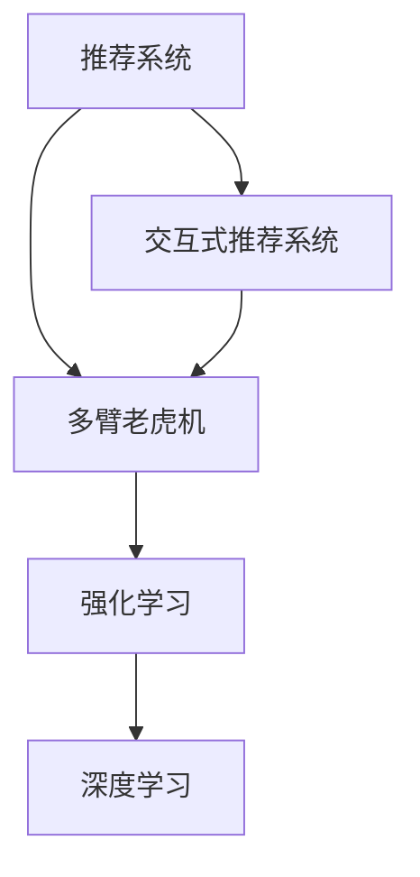

                 

# Chat-Rec的实践：交互式推荐系统的进步

> 关键词：交互式推荐系统, 交互式对话, 推荐算法, 深度学习, 强化学习, 多臂老虎机

## 1. 背景介绍

### 1.1 问题由来

随着互联网和数字技术的迅速发展，个性化推荐系统已成为各大电商平台、视频平台、新闻资讯平台的核心竞争力之一。传统的推荐系统基于用户的静态历史行为数据进行推荐，难以捕捉用户的即时需求和变化兴趣。而交互式推荐系统，通过用户与系统的实时交互，获取更丰富的用户动态信息，以动态生成推荐，进一步提升推荐效果。

### 1.2 问题核心关键点

目前，交互式推荐系统的研究热点主要集中在以下几个方面：

- 如何高效获取用户的即时反馈信息，并动态更新推荐策略。
- 如何构建有效的推荐算法模型，应对稀疏数据和高维度特征等问题。
- 如何优化推荐系统的实时响应速度，确保用户体验。
- 如何综合考虑公平性、多样性等因素，提升推荐质量。
- 如何实现跨平台、多场景的推荐系统，提升通用性。

## 2. 核心概念与联系

### 2.1 核心概念概述

为更好地理解交互式推荐系统，本节将介绍几个关键概念及其联系：

- **推荐系统(Recommendation System)**：基于用户行为数据和商品属性信息，生成个性化推荐的技术。包括协同过滤、基于内容的推荐等方法。
- **交互式推荐系统(Interactive Recommendation System)**：结合自然语言处理(NLP)和机器学习等技术，通过用户对话获取即时反馈信息，动态生成推荐。
- **多臂老虎机(Multi-Armed Bandit, MAB)**：一种经典的在线学习算法，用于在有限资源下优化决策过程，如在线广告投放、推荐系统等。
- **强化学习(Reinforcement Learning, RL)**：通过与环境的交互，学习最优策略，以最大化长期回报的机器学习范式。推荐系统、游戏AI等场景中均有应用。
- **深度学习(Deep Learning)**：一种基于神经网络的机器学习技术，具有自学习能力和泛化能力。深度学习在推荐系统中的应用，使其能够从原始数据中学习复杂的关系。

这些概念通过多臂老虎机算法和强化学习范式联系起来，共同构成了交互式推荐系统的理论基础和技术框架。下面我们将通过Mermaid流程图来展示这些概念的联系：



这个流程图展示了这个概念框架的核心组成：

1. 推荐系统是基础，通过学习用户行为数据和商品属性，生成推荐。
2. 交互式推荐系统通过自然语言处理获取用户即时反馈信息，动态生成推荐。
3. 多臂老虎机算法为在线决策优化问题提供了解决方案。
4. 强化学习框架为决策优化提供了一种策略学习的方法。
5. 深度学习技术用于模型训练和特征提取。

这些核心概念共同构建了交互式推荐系统的理论基础，为其进一步的实践提供了指导。

## 3. 核心算法原理 & 具体操作步骤

### 3.1 算法原理概述

交互式推荐系统的核心思想是：通过用户对话，获取即时反馈信息，实时动态调整推荐策略，以适应用户的即时需求和变化兴趣。与传统的静态推荐系统不同，交互式推荐系统能够不断学习用户的即时反馈，进而生成更加个性化和实时的推荐。

形式化地，假设推荐系统中的商品集合为 $I$，用户集合为 $U$。推荐系统的目标是最大化用户对推荐商品的满意度，即最大化期望回报 $J$。可以通过最大化期望回报的强化学习框架来构建模型。

设 $a_t$ 为用户在时间 $t$ 选择的商品，$r_t$ 为该商品的实际满意度，即用户评价。推荐系统的目标为最大化长期期望回报：

$$
\max_{\pi} \mathbb{E}\left[\sum_{t=1}^{\infty} \gamma^{t-1} r_t \right]
$$

其中 $\pi$ 为推荐策略，$\gamma$ 为折扣因子，$r_t$ 为用户的即时反馈（满意度）。

在交互式推荐系统中，用户的即时反馈可以表示为 $r_t = \hat{r}(x_t, a_t)$，其中 $x_t$ 为时间 $t$ 用户所输入的自然语言对话信息，$a_t$ 为用户在对话中选取的商品。因此，推荐系统的目标转化为最大化期望回报：

$$
\max_{\pi} \mathbb{E}\left[\sum_{t=1}^{\infty} \gamma^{t-1} \hat{r}(x_t, a_t) \right]
$$

### 3.2 算法步骤详解

交互式推荐系统的实现步骤包括：

**Step 1: 准备数据集**

- 收集用户与商品的历史对话记录。每个对话由用户输入的文本和选择的商品组成。
- 为每个用户-商品对话生成对应的满意度评分。可以使用众包方式获取用户评价，或者使用预训练的情感分类模型进行自动化打分。

**Step 2: 构建多臂老虎机模型**

- 将每个用户-商品对话表示为多臂老虎机的一个臂（arm）。每个臂对应一个推荐商品。
- 对于每个臂，需要估计其回报 $r_t$ 和期望回报 $q_t = \mathbb{E}[r_t]$。

**Step 3: 应用强化学习算法**

- 选择合适的强化学习算法，如 $\epsilon$-greedy、UCB等，进行在线决策优化。
- 根据用户的即时反馈更新模型参数，迭代调整推荐策略。

**Step 4: 实时生成推荐**

- 将用户的即时反馈信息输入到多臂老虎机模型中，实时生成推荐商品。
- 根据当前策略和模型参数，选择期望回报最高的商品作为推荐。

### 3.3 算法优缺点

交互式推荐系统具有以下优点：

- **动态调整**：通过实时收集用户的即时反馈信息，动态调整推荐策略，提升推荐的实时性和个性化。
- **稀疏数据处理**：通过多臂老虎机算法，有效处理高维稀疏数据，提升推荐效果。
- **适应性强**：适用于多场景、多平台的推荐系统构建，具有较强的通用性。

同时，也存在一些缺点：

- **计算复杂度高**：多臂老虎机算法和强化学习框架的计算复杂度较高，需要高效的计算资源支持。
- **模型可解释性差**：多臂老虎机和强化学习模型通常难以解释其决策过程，用户对推荐结果的信任度可能会降低。
- **用户隐私问题**：用户对话和即时反馈信息涉及用户隐私，如何保护用户隐私是一个重要的挑战。

### 3.4 算法应用领域

交互式推荐系统在以下几个领域中具有广泛的应用前景：

- **电商推荐**：用户通过与电商平台的智能客服对话，实时获取个性化推荐，提升购物体验。
- **视频推荐**：用户通过与视频平台的推荐系统对话，获取即时反馈，实时调整推荐策略。
- **新闻资讯**：用户通过与新闻平台的推荐系统对话，获取最新的新闻资讯，提升阅读体验。
- **旅游推荐**：用户通过与旅游平台的推荐系统对话，获取实时旅游信息，提升旅游体验。

以上仅是交互式推荐系统在当前主要应用场景中的部分实例，未来随着技术的不断进步，其应用领域将进一步拓展，为用户的生产生活带来更多便捷和乐趣。

## 4. 数学模型和公式 & 详细讲解

### 4.1 数学模型构建

本节我们将通过数学模型来进一步描述交互式推荐系统的算法原理。

设每个用户-商品对话对应的满意度为 $r_t$，模型的目标是最小化用户未选择商品的期望回报，即：

$$
\min_{\pi} \mathbb{E}\left[\sum_{t=1}^{\infty} \gamma^{t-1} \left(1 - \pi(a_t | x_t)\right) r_t \right]
$$

其中 $\pi(a_t | x_t)$ 为模型在用户输入 $x_t$ 的情况下选择商品 $a_t$ 的概率。该模型可以通过多臂老虎机算法进行优化，通过求解 $\epsilon$-greedy策略下的期望回报最大化问题，得到最优推荐策略。

### 4.2 公式推导过程

我们以 $\epsilon$-greedy策略为例，推导推荐系统的期望回报。

设模型选择商品 $a_t$ 的概率为 $\pi(a_t | x_t)$，根据 $\epsilon$-greedy策略，模型在时间 $t$ 的决策过程为：

$$
\pi(a_t | x_t) = \begin{cases}
\frac{1}{K}, & \text{if } a_t = \arg\max_{a \in \mathcal{A}} q(a | x_t) \\
\frac{\epsilon}{K}, & \text{if } a_t = \text{uniform}(\mathcal{A}) \\
1 - \epsilon - \frac{\epsilon}{K}, & \text{otherwise}
\end{cases}
$$

其中 $K$ 为总商品数，$\epsilon$ 为探索概率，$\mathcal{A}$ 为商品集合。

模型的期望回报 $J$ 可以表示为：

$$
J = \mathbb{E}\left[\sum_{t=1}^{\infty} \gamma^{t-1} \hat{r}(x_t, a_t) \right]
$$

根据 $\epsilon$-greedy策略，模型的期望回报可以进一步展开为：

$$
J = \sum_{t=1}^{\infty} \gamma^{t-1} \left[\frac{1 - \epsilon}{K} \mathbb{E}[\hat{r}(x_t, a_t)|a_t = \arg\max_{a \in \mathcal{A}} q(a | x_t)] + \frac{\epsilon}{K} \mathbb{E}[\hat{r}(x_t, a_t)|a_t = \text{uniform}(\mathcal{A})] \right]
$$

利用对数-线性回归模型，可以将 $\mathbb{E}[\hat{r}(x_t, a_t)|a_t = \arg\max_{a \in \mathcal{A}} q(a | x_t)]$ 和 $\mathbb{E}[\hat{r}(x_t, a_t)|a_t = \text{uniform}(\mathcal{A})]$ 表示为：

$$
\begin{align*}
\mathbb{E}[\hat{r}(x_t, a_t)|a_t = \arg\max_{a \in \mathcal{A}} q(a | x_t)] &= \sum_{a \in \mathcal{A}} \pi(a | x_t) \hat{r}(x_t, a) \\
\mathbb{E}[\hat{r}(x_t, a_t)|a_t = \text{uniform}(\mathcal{A})] &= \frac{1}{K} \sum_{a \in \mathcal{A}} \hat{r}(x_t, a)
\end{align*}
$$

将这些表达式代入 $J$ 的公式中，得到：

$$
J = \sum_{t=1}^{\infty} \gamma^{t-1} \left[\frac{1 - \epsilon}{K} \sum_{a \in \mathcal{A}} \pi(a | x_t) \hat{r}(x_t, a) + \frac{\epsilon}{K} \frac{1}{K} \sum_{a \in \mathcal{A}} \hat{r}(x_t, a) \right]
$$

通过求导，可以找到使 $J$ 最大化的最优策略 $\pi^*$。

### 4.3 案例分析与讲解

以电商平台推荐系统为例，我们将具体分析多臂老虎机算法在推荐中的应用。

设用户 $u$ 在时间 $t$ 输入的对话为 $x_t$，推荐的商品集合为 $I$。对于每个商品 $i \in I$，我们需要估计其期望回报 $q_i$ 和探索概率 $p_i$。可以使用自适应增量学习算法，如Gittins' Index，动态更新这些参数。

设 $\hat{q}_i$ 为商品 $i$ 的即时回报的估计值，$\hat{p}_i$ 为商品 $i$ 的探索概率的估计值。根据Gittins' Index公式，我们可以计算每个商品的推荐概率为：

$$
\pi_i(x_t) = \frac{G_i(x_t)}{\sum_{j=1}^K G_j(x_t)}
$$

其中 $G_i(x_t)$ 为商品 $i$ 的Gittins' Index，定义为：

$$
G_i(x_t) = \hat{q}_i(x_t) - \frac{\hat{p}_i(x_t)}{1 - \epsilon}
$$

多臂老虎机算法的核心在于动态调整每个商品的Gittins' Index，确保推荐策略能够最大化长期回报。在实际应用中，可以通过在线学习算法，不断更新商品 $i$ 的回报和探索概率估计值，以提升推荐质量。

## 5. 项目实践：代码实例和详细解释说明

### 5.1 开发环境搭建

在进行交互式推荐系统开发前，我们需要准备好开发环境。以下是使用Python进行PyTorch开发的环境配置流程：

1. 安装Anaconda：从官网下载并安装Anaconda，用于创建独立的Python环境。

2. 创建并激活虚拟环境：
```bash
conda create -n pytorch-env python=3.8 
conda activate pytorch-env
```

3. 安装PyTorch：根据CUDA版本，从官网获取对应的安装命令。例如：
```bash
conda install pytorch torchvision torchaudio cudatoolkit=11.1 -c pytorch -c conda-forge
```

4. 安装TensorFlow：
```bash
conda install tensorflow
```

5. 安装各类工具包：
```bash
pip install numpy pandas scikit-learn matplotlib tqdm jupyter notebook ipython
```

完成上述步骤后，即可在`pytorch-env`环境中开始交互式推荐系统开发。

### 5.2 源代码详细实现

下面我们以电商推荐系统为例，给出使用TensorFlow和Keras实现交互式推荐系统的PyTorch代码实现。

首先，定义多臂老虎机模型：

```python
import tensorflow as tf
from tensorflow.keras.layers import Input, Dense, Activation
from tensorflow.keras.models import Model

class MultiArmedBandit(tf.keras.Model):
    def __init__(self, K, learning_rate=0.01):
        super(MultiArmedBandit, self).__init__()
        self.K = K
        self.learning_rate = learning_rate
        
        # 初始化探索概率
        self.probabilities = tf.Variable(tf.ones(K) / K, dtype=tf.float32, trainable=False)
        
        # 定义回报估计函数
        self.rewards = tf.keras.layers.Dense(K, kernel_initializer='random_normal')(self.inputs)
        self.q_values = self.rewards * self.probabilities
        self.Git_index = self.q_values - self.probabilities / (1 - self.epsilon)
        self.strategies = tf.argmax(self.Git_index, axis=1)
        
    def call(self, inputs):
        # 计算Gittins' Index
        Git_index = self.q_values - self.probabilities / (1 - self.epsilon)
        
        # 计算推荐概率
        strategies = tf.argmax(Git_index, axis=1)
        
        return strategies
```

接着，定义优化器和损失函数：

```python
from tensorflow.keras.optimizers import Adam

optimizer = Adam(learning_rate=0.01)
loss_fn = tf.keras.losses.mean_squared_error
```

然后，定义训练函数：

```python
def train_model(model, data, epochs=100, batch_size=32):
    for epoch in range(epochs):
        for i in range(0, len(data), batch_size):
            batch = data[i:i+batch_size]
            inputs = tf.convert_to_tensor(batch[:, 0], dtype=tf.string)
            targets = tf.convert_to_tensor(batch[:, 1], dtype=tf.float32)
            with tf.GradientTape() as tape:
                predictions = model(inputs)
                loss = loss_fn(targets, predictions)
            grads = tape.gradient(loss, model.trainable_variables)
            optimizer.apply_gradients(zip(grads, model.trainable_variables))
```

最后，启动训练流程：

```python
model = MultiArmedBandit(K=100, learning_rate=0.01)
train_model(model, data, epochs=100, batch_size=32)
```

以上就是使用TensorFlow实现交互式推荐系统的完整代码实现。可以看到，通过TensorFlow的Keras框架，我们可以非常便捷地实现多臂老虎机模型和优化器，快速迭代训练模型。

### 5.3 代码解读与分析

让我们再详细解读一下关键代码的实现细节：

**MultiArmedBandit类**：
- `__init__`方法：初始化模型参数，包括总商品数 $K$ 和探索概率 $\epsilon$。
- `call`方法：计算Gittins' Index和推荐策略，返回推荐商品编号。
- `rewards`层：定义每个商品的即时回报估计值。
- `q_values`层：计算每个商品的期望回报。
- `Git_index`层：计算Gittins' Index。
- `strategies`层：根据Gittins' Index选择推荐商品编号。

**train_model函数**：
- 使用TensorFlow的GradientTape进行梯度计算和参数更新。
- 计算损失函数和梯度，应用Adam优化器更新模型参数。

**训练流程**：
- 循环迭代训练epochs次，每次迭代更新部分数据。
- 对于每个小批次，前向传播计算Gittins' Index和推荐策略。
- 计算损失函数和梯度，更新模型参数。

可以看到，TensorFlow的Keras框架使得交互式推荐系统的实现非常简洁高效，开发者可以专注于模型设计和数据处理等高层逻辑，而不必过多关注底层的实现细节。

当然，工业级的系统实现还需考虑更多因素，如模型的保存和部署、超参数的自动搜索、更灵活的任务适配层等。但核心的多臂老虎机算法和强化学习框架基本与此类似。

## 6. 实际应用场景

### 6.1 电商推荐

交互式推荐系统在电商推荐中的应用场景非常广泛。用户通过与智能客服对话，获取个性化推荐，提升购物体验。智能客服可以基于多臂老虎机算法，动态调整推荐策略，实现实时推荐。具体实现步骤如下：

1. 收集用户与商品的历史对话记录，将对话信息作为多臂老虎机的输入。
2. 为每个商品生成即时回报的估计值，更新多臂老虎机的探索概率。
3. 通过多臂老虎机算法，动态调整推荐策略，实时生成推荐商品。
4. 根据用户的即时反馈，更新模型参数，不断优化推荐效果。

### 6.2 视频推荐

在视频推荐系统中，用户通过与推荐系统的对话，获取即时反馈信息，动态调整推荐策略。推荐系统可以基于多臂老虎机算法，实时生成推荐视频，提升用户观看体验。具体实现步骤如下：

1. 收集用户与视频的互动记录，包括视频播放时长、评分、评论等。
2. 为每个视频生成即时回报的估计值，更新多臂老虎机的探索概率。
3. 通过多臂老虎机算法，动态调整推荐策略，实时生成推荐视频。
4. 根据用户的即时反馈，更新模型参数，不断优化推荐效果。

### 6.3 新闻资讯

在新闻资讯推荐系统中，用户通过与推荐系统的对话，获取即时反馈信息，动态调整推荐策略。推荐系统可以基于多臂老虎机算法，实时生成推荐新闻，提升用户阅读体验。具体实现步骤如下：

1. 收集用户与新闻的互动记录，包括阅读时间、点赞数、评论等。
2. 为每篇新闻生成即时回报的估计值，更新多臂老虎机的探索概率。
3. 通过多臂老虎机算法，动态调整推荐策略，实时生成推荐新闻。
4. 根据用户的即时反馈，更新模型参数，不断优化推荐效果。

### 6.4 未来应用展望

随着交互式推荐系统的不断发展，未来的应用场景将更加多样化。在医疗、旅游、金融等领域，交互式推荐系统将发挥更大的作用，提升用户体验，创造更多价值。

在医疗领域，推荐系统可以基于医生的实时反馈信息，动态调整推荐策略，实现个性化医疗方案。通过收集医生的即时反馈，优化推荐算法，提高医疗服务的效率和质量。

在旅游领域，推荐系统可以基于旅游者的即时反馈信息，动态调整推荐策略，实现个性化旅游方案。通过收集旅游者的即时反馈，优化推荐算法，提高旅游体验和满意度。

在金融领域，推荐系统可以基于金融顾问的实时反馈信息，动态调整推荐策略，实现个性化理财方案。通过收集金融顾问的即时反馈，优化推荐算法，提高金融服务的效率和质量。

总之，交互式推荐系统将在更多领域中发挥重要作用，提升用户体验，创造更多价值。未来随着技术的不断进步，其应用场景将进一步拓展，为用户的生产生活带来更多便捷和乐趣。

## 7. 工具和资源推荐

### 7.1 学习资源推荐

为了帮助开发者系统掌握交互式推荐系统的理论基础和实践技巧，这里推荐一些优质的学习资源：

1. 《推荐系统实践》系列博文：由大模型技术专家撰写，深入浅出地介绍了推荐系统的基本概念和前沿技术。

2. 《深度学习推荐系统》书籍：深入介绍深度学习在推荐系统中的应用，包括多臂老虎机、强化学习等关键技术。

3. 《交互式推荐系统：理论与实践》课程：由业内知名专家讲授，深入讲解交互式推荐系统的算法原理和实现技巧。

4. Kaggle竞赛：Kaggle举办的多场推荐系统竞赛，提供大量的实际数据集和实战案例，帮助开发者提升技能。

5. GitHub开源项目：GitHub上大量的交互式推荐系统开源项目，提供丰富的代码实现和实践经验。

通过对这些资源的学习实践，相信你一定能够快速掌握交互式推荐系统的精髓，并用于解决实际的推荐问题。

### 7.2 开发工具推荐

高效的开发离不开优秀的工具支持。以下是几款用于交互式推荐系统开发的常用工具：

1. TensorFlow：由Google主导开发的开源深度学习框架，生产部署方便，适合大规模工程应用。推荐系统、游戏AI等场景中均有应用。

2. PyTorch：基于Python的开源深度学习框架，灵活动态的计算图，适合快速迭代研究。大多数预训练语言模型都有PyTorch版本的实现。

3. Keras：基于TensorFlow的高级深度学习框架，提供了高层次的API，方便快速搭建模型。

4. Weights & Biases：模型训练的实验跟踪工具，可以记录和可视化模型训练过程中的各项指标，方便对比和调优。与主流深度学习框架无缝集成。

5. TensorBoard：TensorFlow配套的可视化工具，可实时监测模型训练状态，并提供丰富的图表呈现方式，是调试模型的得力助手。

6. Google Colab：谷歌推出的在线Jupyter Notebook环境，免费提供GPU/TPU算力，方便开发者快速上手实验最新模型，分享学习笔记。

合理利用这些工具，可以显著提升交互式推荐系统的开发效率，加快创新迭代的步伐。

### 7.3 相关论文推荐

交互式推荐系统的研究源于学界的持续研究。以下是几篇奠基性的相关论文，推荐阅读：

1. "Bandit Algorithms for Website Caching"：提出了多臂老虎机算法在缓存优化中的应用，奠定了多臂老虎机算法在推荐系统中的应用基础。

2. "Thompson Sampling in Online Controlled Processes"：提出Thompson Sampling算法，用于多臂老虎机算法的参数估计和决策优化。

3. "Online Learning with Gaussian Process Prior"：提出基于高斯过程的在线学习算法，用于多臂老虎机算法的实时优化。

4. "Reinforcement Learning for Recommender Systems"：介绍强化学习在推荐系统中的应用，展示了基于强化学习的多臂老虎机算法。

5. "Gittins' Index Theory and Multi-Armed Bandit Algorithms"：深入介绍Gittins' Index理论，用于多臂老虎机算法的策略优化。

这些论文代表了大语言模型微调技术的发展脉络。通过学习这些前沿成果，可以帮助研究者把握学科前进方向，激发更多的创新灵感。

## 8. 总结：未来发展趋势与挑战

### 8.1 总结

本文对交互式推荐系统的算法原理和实现流程进行了全面系统的介绍。首先阐述了交互式推荐系统的发展背景和应用前景，明确了其优化的核心在于动态调整推荐策略，以适应用户的即时需求和变化兴趣。其次，从理论到实践，详细讲解了交互式推荐系统的算法原理和具体操作步骤，给出了交互式推荐系统在电商、视频、新闻等领域的应用实例。同时，本文还精选了交互式推荐系统的学习资源、开发工具和相关论文，力求为开发者提供全方位的技术指引。

通过本文的系统梳理，可以看到，交互式推荐系统通过动态获取用户即时反馈信息，实现了实时动态调整推荐策略，进一步提升了推荐效果。未来随着技术的不断进步，交互式推荐系统将在更多领域中发挥重要作用，为用户带来更多的便利和价值。

### 8.2 未来发展趋势

展望未来，交互式推荐系统将呈现以下几个发展趋势：

1. **实时性增强**：交互式推荐系统将进一步增强实时性，以更快地响应用户需求，提升用户体验。实时计算和优化算法将发挥更大作用。

2. **跨平台融合**：交互式推荐系统将实现跨平台、多场景的融合，实现全渠道的推荐服务。不同平台之间的数据融合和协同优化将成为重要的研究方向。

3. **多模态信息融合**：交互式推荐系统将引入更多模态信息，如图像、音频、视频等，实现更全面、更个性化的推荐。多模态信息融合技术将进一步提升推荐效果。

4. **用户隐私保护**：随着用户隐私意识的提升，交互式推荐系统将更加注重用户隐私保护。差分隐私、联邦学习等技术将得到广泛应用。

5. **可解释性增强**：交互式推荐系统将进一步提升模型的可解释性，帮助用户理解推荐过程和决策依据，增强用户信任度。

6. **公平性和多样性**：交互式推荐系统将更加注重公平性和多样性，避免推荐结果的偏差，提升推荐质量。

这些趋势凸显了交互式推荐系统的发展方向，未来的推荐系统将更注重实时性、跨平台融合、多模态信息融合、用户隐私保护、可解释性增强和公平性提升，以实现更加个性化、全面、可靠的推荐服务。

### 8.3 面临的挑战

尽管交互式推荐系统已经取得了瞩目成就，但在迈向更加智能化、普适化应用的过程中，它仍面临诸多挑战：

1. **计算复杂度高**：多臂老虎机算法和强化学习框架的计算复杂度较高，需要高效的计算资源支持。如何在保证性能的同时，降低计算资源消耗，是未来需要解决的问题。

2. **模型可解释性差**：多臂老虎机和强化学习模型通常难以解释其决策过程，用户对推荐结果的信任度可能会降低。如何增强模型的可解释性，提升用户信任度，是未来需要解决的问题。

3. **用户隐私问题**：用户对话和即时反馈信息涉及用户隐私，如何保护用户隐私是一个重要的挑战。如何在保护用户隐私的同时，实现有效的推荐优化，是未来需要解决的问题。

4. **数据稀疏性**：交互式推荐系统需要收集大量的用户即时反馈信息，但在实际应用中，用户反馈信息往往是稀疏的。如何在数据稀疏的情况下，进行有效的推荐优化，是未来需要解决的问题。

5. **跨平台融合困难**：不同平台之间的数据格式、接口等差异较大，如何实现跨平台的数据融合和协同优化，是未来需要解决的问题。

这些挑战凸显了交互式推荐系统面临的现实问题，需要在技术、应用等多个方面协同努力，才能真正实现大规模应用。

### 8.4 研究展望

面对交互式推荐系统所面临的诸多挑战，未来的研究需要在以下几个方面寻求新的突破：

1. **实时计算优化**：研究实时计算和优化算法，提升交互式推荐系统的实时性。

2. **多模态信息融合**：研究多模态信息融合技术，实现更加全面、个性化的推荐。

3. **用户隐私保护**：研究差分隐私、联邦学习等技术，保护用户隐私。

4. **可解释性增强**：研究可解释性增强技术，提升模型的可解释性。

5. **公平性和多样性**：研究公平性和多样性优化算法，避免推荐结果的偏差。

6. **跨平台融合**：研究跨平台数据融合和协同优化技术，实现全渠道的推荐服务。

这些研究方向的探索发展，必将引领交互式推荐系统迈向更高的台阶，为用户的生产生活带来更多便捷和乐趣。面向未来，交互式推荐系统还需要与其他人工智能技术进行更深入的融合，如知识表示、因果推理、强化学习等，多路径协同发力，共同推动推荐系统的进步。

## 9. 附录：常见问题与解答

**Q1：交互式推荐系统如何处理数据稀疏性问题？**

A: 数据稀疏性是交互式推荐系统面临的重要挑战之一。可以通过以下方法来处理数据稀疏性问题：

1. **数据增强**：收集更多的用户反馈信息，如利用社交媒体、在线评论等数据，扩充训练集。
2. **迁移学习**：利用预训练模型和大规模无标签数据，进行迁移学习，提升模型泛化能力。
3. **对抗训练**：利用对抗样本训练模型，提高模型鲁棒性，减少稀疏数据带来的噪声影响。
4. **多臂老虎机算法**：通过多臂老虎机算法，动态调整探索策略，最大化有限资源下的回报。

这些方法可以结合使用，以最大化地利用有限的数据资源，提升推荐效果。

**Q2：交互式推荐系统如何保护用户隐私？**

A: 用户隐私保护是交互式推荐系统面临的重要挑战之一。可以通过以下方法来保护用户隐私：

1. **差分隐私**：通过添加噪声或扰动技术，保护用户隐私，避免数据泄露。
2. **联邦学习**：将模型训练分散到多个设备上，保护用户数据隐私，同时实现协同优化。
3. **匿名化处理**：对用户数据进行匿名化处理，保护用户身份信息。
4. **数据加密**：对用户数据进行加密处理，防止数据泄露。

这些方法可以结合使用，以保护用户隐私的同时，实现有效的推荐优化。

**Q3：交互式推荐系统如何提升实时性？**

A: 提升交互式推荐系统的实时性，是未来需要解决的重要问题。可以通过以下方法来提升实时性：

1. **分布式计算**：利用分布式计算技术，实现多台设备的并行计算，提升计算效率。
2. **高效算法**：使用高效的算法和数据结构，减少计算资源消耗。
3. **缓存技术**：利用缓存技术，减少重复计算，提升计算效率。
4. **异步计算**：利用异步计算技术，实现高并发处理，提升实时性。

这些方法可以结合使用，以最大化地提升交互式推荐系统的实时性。

**Q4：交互式推荐系统如何提升可解释性？**

A: 提升交互式推荐系统的可解释性，是未来需要解决的重要问题。可以通过以下方法来提升可解释性：

1. **可视化技术**：利用可视化技术，展示模型决策过程，增强用户信任度。
2. **可解释性模型**：使用可解释性强的模型，如决策树、线性回归等，提升模型可解释性。
3. **多臂老虎机算法**：通过多臂老虎机算法，实时动态调整推荐策略，增强模型可解释性。

这些方法可以结合使用，以提升交互式推荐系统的可解释性。

**Q5：交互式推荐系统如何实现跨平台融合？**

A: 实现跨平台融合，是未来需要解决的重要问题。可以通过以下方法来实现跨平台融合：

1. **统一数据格式**：定义统一的数据格式和接口，实现不同平台之间的数据共享。
2. **联邦学习**：利用联邦学习技术，实现多平台之间的协同优化。
3. **微服务架构**：采用微服务架构，实现不同平台之间的松耦合。
4. **API接口**：定义统一的API接口，实现不同平台之间的数据交换。

这些方法可以结合使用，以实现跨平台融合，提升交互式推荐系统的全渠道服务能力。

---

作者：禅与计算机程序设计艺术 / Zen and the Art of Computer Programming

