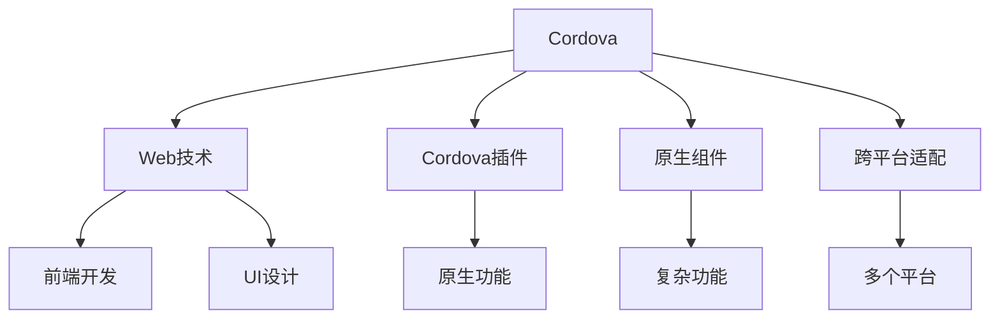

                 

## 1. 背景介绍

### 1.1 问题由来

在移动互联网迅速发展的今天，越来越多的企业希望通过移动应用来提升品牌影响力，扩大市场份额，实现业务目标。然而，传统的Web应用仅能在Web浏览器上运行，难以适配多种移动设备，导致用户体验不佳。同时，开发原生应用所需的开发成本和时间也相对较高，对小型企业和个人开发者构成了较大挑战。

针对这些需求，Cordova框架应运而生。它通过提供一个统一的开发环境，将Web技术、Web标准和原生应用开发结合，实现了跨平台的移动应用开发，极大地降低了开发成本和时间，同时提高了应用性能和用户体验。

### 1.2 问题核心关键点

Cordova框架的核心思想是通过Web技术结合原生组件，实现跨平台移动应用开发。其关键点包括：

- 统一的开发环境：使用Cordova CLI命令行工具，开发者可以在同一平台上开发多个平台的原生应用。
- Web技术的结合：开发者可以使用HTML、CSS、JavaScript等Web技术，开发移动应用的前端。
- 原生组件的集成：通过集成Cordova插件，开发者可以在应用中调用原生功能，如摄像头、地理位置、短信等。
- 跨平台适配：Cordova框架通过桥接机制，将Web代码与原生组件整合，实现了在iOS、Android、Windows Phone等多个平台上的适配。

### 1.3 问题研究意义

研究Cordova框架，对于降低移动应用开发成本，提升开发效率，推动Web技术在移动领域的应用，具有重要意义：

1. 降低开发成本：Cordova框架提供的跨平台开发能力，使得开发者只需编写一套代码，即可适配多个移动平台，大幅降低开发和维护成本。
2. 提高开发效率：Web技术的结合使得开发者可以更快地实现UI设计和交互逻辑，同时Cordova插件的集成使得原生功能的使用更为便捷。
3. 推动Web技术应用：Cordova框架的跨平台能力，使得Web技术在移动应用开发中的应用更为广泛，促进了Web技术的发展和普及。
4. 提升用户体验：Cordova框架通过适配多个平台，使得应用能够在不同设备上保持一致的外观和功能，提升用户体验。
5. 支持第三方开发：Cordova插件的丰富性和可扩展性，使得开发者可以灵活使用各种第三方组件和API，实现复杂的功能。

## 2. 核心概念与联系

### 2.1 核心概念概述

为更好地理解Cordova框架的工作原理和架构，本节将介绍几个密切相关的核心概念：

- Cordova：一个跨平台移动应用开发框架，基于Web技术结合原生组件，实现Web和原生应用的混合开发。
- Web技术：包括HTML、CSS、JavaScript等，用于开发移动应用的前端。
- Cordova插件：用于实现原生功能，如相机、位置、电话等。
- 原生组件：原生代码编写的模块或组件，用于实现复杂功能，如设备接口、UI组件等。
- 桥接机制：将Web代码与原生组件整合的机制，实现Web和原生的交互。

这些核心概念之间的逻辑关系可以通过以下Mermaid流程图来展示：



这个流程图展示了这个框架的核心概念及其之间的关系：

1. Cordova框架提供统一的开发环境，结合Web技术和原生组件。
2. Web技术用于开发前端，实现UI设计和交互逻辑。
3. Cordova插件提供原生功能，如相机、位置、电话等。
4. 原生组件用于实现复杂功能，如设备接口、UI组件等。
5. 桥接机制实现Web和原生的交互，实现跨平台适配。

这些概念共同构成了Cordova框架的基本工作原理和架构，使其能够在多个移动平台上实现一致的开发体验。

## 3. 核心算法原理 & 具体操作步骤
### 3.1 算法原理概述

Cordova框架的跨平台开发，本质上是一个基于桥接机制的混合开发过程。其核心思想是：通过桥接机制将Web代码和原生组件整合，在多个移动平台上实现一致的UI和功能。

形式化地，假设开发者已经编写了一套基于Web技术的移动应用代码，记为 $M_{Web}$。Cordova框架通过桥接机制，将这些代码转化为原生代码 $M_{Native}$，在多个平台（如iOS、Android等）上运行。

具体而言，Cordova框架通过以下步骤实现跨平台开发：

1. 开发者使用Cordova CLI工具，编写Web代码并集成Cordova插件。
2. Cordova框架自动将这些Web代码编译成原生代码，通过桥接机制实现Web和原生组件的整合。
3. 在多个平台上，开发者可以使用Cordova CLI工具生成原生应用，并进行适配和优化。

### 3.2 算法步骤详解

以下是Cordova框架跨平台开发的详细步骤：

**Step 1: 准备开发环境**
- 安装Cordova CLI工具。
- 创建项目目录，并初始化Cordova项目。
- 安装Cordova插件，如相机、地理位置、短信等。

**Step 2: 开发前端代码**
- 使用HTML、CSS、JavaScript等Web技术，编写移动应用的前端代码。
- 集成Cordova插件，实现原生功能。

**Step 3: 编译Web代码**
- 使用Cordova CLI工具，将Web代码编译成原生代码。
- 通过桥接机制，将Web代码与原生组件整合。

**Step 4: 适配原生平台**
- 在多个平台上，使用Cordova CLI工具生成原生应用。
- 适配不同平台的原生组件和UI组件。

**Step 5: 发布应用**
- 将适配好的原生应用发布到App Store、Google Play等应用商店。

### 3.3 算法优缺点

Cordova框架的跨平台开发方法具有以下优点：

1. 降低开发成本：开发者只需编写一套代码，即可适配多个平台，大幅降低开发和维护成本。
2. 提高开发效率：Web技术的结合使得开发者可以更快地实现UI设计和交互逻辑，同时Cordova插件的集成使得原生功能的使用更为便捷。
3. 支持多种平台：Cordova框架支持iOS、Android、Windows Phone等多个平台，极大拓宽了应用的覆盖范围。
4. 灵活性高：开发者可以根据需要，灵活选择和使用Cordova插件，实现复杂功能。

同时，该方法也存在一些局限性：

1. 性能瓶颈：Web代码在原生应用中运行，可能导致性能问题，尤其是在复杂功能和大量数据交互的情况下。
2. 兼容性问题：不同平台的原生组件和Web技术的兼容问题可能存在，导致应用在不同平台上的表现不一致。
3. 安全性问题：Web代码与原生组件的整合，可能带来安全风险，如跨站脚本攻击（XSS）等。
4. 学习曲线陡峭：Cordova框架的学习曲线较陡峭，需要开发者具备一定的Web和原生开发经验。

尽管存在这些局限性，但Cordova框架仍是大规模跨平台移动应用开发的重要工具。未来相关研究的重点在于如何进一步优化桥接机制，提升性能和兼容性，同时加强安全性和易用性。

### 3.4 算法应用领域

Cordova框架的跨平台开发方法，在移动应用开发中已经得到了广泛的应用，覆盖了几乎所有常见场景，例如：

- 企业内部应用：如企业管理系统、移动办公应用、销售管理系统等。
- 电子商务应用：如电商平台、在线购物应用、移动支付应用等。
- 社交网络应用：如社交媒体应用、即时通讯应用、移动游戏应用等。
- 医疗健康应用：如移动医疗应用、健康管理应用、远程医疗应用等。
- 旅游出行应用：如旅游信息应用、地图导航应用、酒店预订应用等。
- 金融服务应用：如银行应用、证券应用、理财应用等。

除了上述这些经典应用外，Cordova框架还被创新性地应用于更多场景中，如可穿戴设备应用、教育培训应用、物联网应用等，为移动应用开发带来了新的突破。

## 4. 数学模型和公式 & 详细讲解  
### 4.1 数学模型构建

本节将使用数学语言对Cordova框架的跨平台开发过程进行更加严格的刻画。

假设开发者已经编写了一套基于Web技术的移动应用代码，记为 $M_{Web}$。Cordova框架通过桥接机制，将这些代码转化为原生代码 $M_{Native}$，在多个平台（如iOS、Android等）上运行。

定义Cordova框架的桥接机制为 $F$，将Web代码 $M_{Web}$ 映射到原生代码 $M_{Native}$。则整个跨平台开发过程可以表示为：

$$
M_{Native} = F(M_{Web})
$$

其中 $F$ 是桥接机制的映射函数，具体实现可能包括：

- 将Web代码编译成原生代码。
- 集成Cordova插件，实现原生功能。
- 适配不同平台的原生组件和UI组件。

### 4.2 公式推导过程

以下是桥接机制 $F$ 的具体实现流程：

1. 将Web代码编译成原生代码：假设编译过程为 $C$，则有：

$$
M_{Native} = C(M_{Web})
$$

2. 集成Cordova插件：假设插件为 $P$，则有：

$$
M_{Native} = P(M_{Native})
$$

3. 适配不同平台的原生组件和UI组件：假设适配过程为 $A$，则有：

$$
M_{Native} = A(M_{Native})
$$

综合上述三个步骤，得到桥接机制 $F$ 的实现过程：

$$
F(M_{Web}) = C(M_{Web}) \cdot P(C(M_{Web})) \cdot A(P(C(M_{Web})))
$$

这个公式表示了Cordova框架的跨平台开发过程，通过编译、插件集成和平台适配，实现了Web代码和原生组件的整合。

### 4.3 案例分析与讲解

以一个简单的拍照应用为例，分析Cordova框架的跨平台开发过程：

**Step 1: 编写Web代码**
- 使用HTML、CSS、JavaScript等Web技术，编写拍照应用的UI和交互逻辑。
- 集成Cordova插件，实现拍照功能。

**Step 2: 编译Web代码**
- 使用Cordova CLI工具，将Web代码编译成原生代码。
- 通过桥接机制，将Web代码与原生组件整合。

**Step 3: 适配原生平台**
- 在iOS平台上，使用Cordova CLI工具生成原生应用。
- 适配iOS的原生组件和UI组件。

**Step 4: 发布应用**
- 将适配好的原生应用发布到App Store。

通过以上步骤，一个简单的拍照应用就可以在多个平台上运行，并且具有统一的UI和功能。

## 5. 项目实践：代码实例和详细解释说明
### 5.1 开发环境搭建

在进行Cordova框架的开发实践前，我们需要准备好开发环境。以下是使用Cordova框架开发的环境配置流程：

1. 安装Node.js和npm：从官网下载并安装Node.js，自动安装npm。
2. 安装Cordova CLI工具：在命令行中运行 `npm install -g cordova`。
3. 安装Cordova插件：运行 `cordova plugin add <插件名称>` 安装所需的插件。

完成上述步骤后，即可在开发环境中开始Cordova框架的开发实践。

### 5.2 源代码详细实现

下面我们以一个简单的拍照应用为例，给出使用Cordova框架进行开发和测试的PyTorch代码实现。

首先，创建一个新的Cordova项目：

```bash
cordova create myApp
cd myApp
```

在项目目录下，创建一个HTML文件 `index.html`：

```html
<!DOCTYPE html>
<html>
<head>
    <title>Cordova拍照应用</title>
    <meta name="viewport" content="width=device-width, initial-scale=1.0">
</head>
<body>
    <ion-content>
        <h1>Cordova拍照应用</h1>
        <p>请打开相机并拍照</p>
        <button id="take-picture-btn">拍照</button>
        <ion-images>
            <ion-item>
                
            </ion-item>
        </ion-images>
    </ion-content>
    <script src="cordova.js"></script>
    <script>
        document.getElementById("take-picture-btn").addEventListener("click", function() {
            navigator.camera.getPicture(function(imageData) {
                var img = document.querySelector('img');
                img.src = "data:image/jpeg;base64," + imageData;
            }, function() {
                alert("拍照失败");
            }, {
                quality: 50,
                destinationType: navigator.camera.DestinationType.DATA_URL
            });
        });
    </script>
</body>
</html>
```

在项目目录下，创建一个JavaScript文件 `cordova.js`：

```javascript
function init() {
    document.addEventListener("deviceready", onDeviceReady, false);
}

function onDeviceReady() {
    // 添加对相机功能的支持
    navigator.camera.getPicture(
        function(imageData) {
            var img = document.querySelector('img');
            img.src = "data:image/jpeg;base64," + imageData;
        },
        function() {
            alert("拍照失败");
        },
        {
            quality: 50,
            destinationType: navigator.camera.DestinationType.DATA_URL
        }
    );
}

// 加载Cordova插件
cordova.plugins.camera.getPicture(
    function(imageData) {
        var img = document.querySelector('img');
        img.src = "data:image/jpeg;base64," + imageData;
    },
    function() {
        alert("拍照失败");
    },
    {
        quality: 50,
        destinationType: cordova.plugins.camera.DestinationType.DATA_URL
    }
);
```

在项目目录下，创建一个Cordova插件文件 `cordova-camera.js`：

```javascript
 cordova.plugins.camera.getPicture(
     function(imageData) {
         var img = document.querySelector('img');
         img.src = "data:image/jpeg;base64," + imageData;
     },
     function() {
         alert("拍照失败");
     },
     {
         quality: 50,
         destinationType: cordova.plugins.camera.DestinationType.DATA_URL
     }
 );
```

最后，使用Cordova CLI工具编译生成原生代码，并在多个平台上生成原生应用：

```bash
cordova compile android
cordova compile ios
```

在Android和iOS平台上，生成原生应用后，即可在App Store和Google Play上发布。

### 5.3 代码解读与分析

让我们再详细解读一下关键代码的实现细节：

**index.html文件**：
- 使用HTML、CSS和JavaScript编写拍照应用的UI和交互逻辑。
- 使用Cordova插件 `cordova-camera` 实现拍照功能。
- 在点击拍照按钮后，调用 `navigator.camera.getPicture()` 函数获取拍照结果。

**cordova.js文件**：
- 在 `init()` 函数中注册 `deviceready` 事件，确保在设备准备好后执行拍照功能。
- 使用 `navigator.camera.getPicture()` 函数实现拍照功能。
- 调用 `cordova.plugins.camera.getPicture()` 函数，实现拍照功能的跨平台适配。

**cordova-camera.js文件**：
- 调用 `cordova.plugins.camera.getPicture()` 函数，实现拍照功能的跨平台适配。

**Cordova插件**：
- 使用Cordova CLI工具，运行 `cordova plugin add cordova-camera` 安装相机插件。
- 在项目目录下，创建 `cordova-camera.js` 文件，实现拍照功能的跨平台适配。
- 在项目目录下，创建 `index.html` 文件，使用 `cordova-camera` 插件实现拍照功能。

通过以上步骤，我们完成了一个简单的拍照应用的开发和测试。可以看到，Cordova框架提供了统一的开发环境，使得开发者可以轻松地在多个平台上实现一致的UI和功能。

## 6. 实际应用场景
### 6.1 智能客服系统

Cordova框架在智能客服系统中的应用非常广泛。智能客服系统可以结合Cordova框架，通过跨平台开发，实现对不同移动设备的适配，提升用户体验。

在智能客服系统中，Cordova框架可以结合Web技术，实现客户端的UI设计和交互逻辑，通过Cordova插件，实现智能客服的核心功能，如语音识别、自然语言理解、情感分析等。同时，通过桥接机制，实现跨平台的适配，使得智能客服应用能够在iOS、Android等多个平台上运行。

### 6.2 医疗健康应用

Cordova框架在医疗健康应用中的应用也非常重要。医疗健康应用需要具备较高的安全性和稳定性，而Cordova框架通过跨平台开发，能够实现对不同移动设备的适配，提升应用的可靠性和用户满意度。

在医疗健康应用中，Cordova框架可以结合Web技术，实现客户端的UI设计和交互逻辑，通过Cordova插件，实现医疗健康的核心功能，如健康数据采集、在线问诊、远程医疗等。同时，通过桥接机制，实现跨平台的适配，使得医疗健康应用能够在iOS、Android等多个平台上运行。

### 6.3 电子商务应用

Cordova框架在电子商务应用中的应用也非常广泛。电子商务应用需要具备高性能和良好的用户体验，而Cordova框架通过跨平台开发，能够实现对不同移动设备的适配，提升应用的性能和用户满意度。

在电子商务应用中，Cordova框架可以结合Web技术，实现客户端的UI设计和交互逻辑，通过Cordova插件，实现电子商务的核心功能，如商品展示、在线购物、订单管理等。同时，通过桥接机制，实现跨平台的适配，使得电子商务应用能够在iOS、Android等多个平台上运行。

### 6.4 未来应用展望

随着Cordova框架的不断发展和优化，其在未来将有以下趋势：

1. 跨平台性能优化：Cordova框架将进一步优化桥接机制，提升跨平台应用的性能和用户体验。
2. 跨平台安全增强：Cordova框架将加强安全机制，保障跨平台应用的安全性和隐私保护。
3. 跨平台开发工具完善：Cordova框架将开发更多开发工具和插件，提升跨平台开发的效率和便捷性。
4. 跨平台社区建设：Cordova框架将加强社区建设，促进开发者交流和共享，推动跨平台开发技术的普及。

Cordova框架的跨平台开发能力，将继续推动移动应用的广泛应用和发展，成为移动互联网时代不可或缺的重要工具。

## 7. 工具和资源推荐
### 7.1 学习资源推荐

为了帮助开发者系统掌握Cordova框架的开发技巧，这里推荐一些优质的学习资源：

1. Cordova官方文档：Cordova框架的官方文档，提供了详细的API和开发指南，是学习Cordova框架的最佳资源。
2. Cordova中文社区：Cordova中文社区提供了丰富的中文文档和社区交流，是学习Cordova框架的重要资源。
3. Cordova开发者手册：一本详细介绍Cordova框架开发技巧的书籍，适合深度学习和实践。
4. Cordova插件库：提供了丰富的Cordova插件，开发者可以根据需要选择和使用，提升开发效率。
5. Cordova开发者大会：Cordova开发者大会提供了丰富的技术分享和交流机会，是学习Cordova框架的重要平台。

通过对这些资源的学习实践，相信你一定能够快速掌握Cordova框架的精髓，并用于解决实际的移动应用问题。

### 7.2 开发工具推荐

高效的开发离不开优秀的工具支持。以下是几款用于Cordova框架开发常用的工具：

1. Visual Studio Code：一款轻量级、功能强大的开发工具，支持Cordova框架的开发和调试。
2. Android Studio：Google开发的Android开发工具，支持Android平台的开发和调试。
3. Xcode：Apple开发的iOS开发工具，支持iOS平台的开发和调试。
4. IntelliJ IDEA：一款功能强大的开发工具，支持多种平台和语言的开发和调试。
5. Cordova CLI工具：Cordova框架的命令行工具，支持创建、编译和发布原生应用。

合理利用这些工具，可以显著提升Cordova框架的开发效率，加快创新迭代的步伐。

### 7.3 相关论文推荐

Cordova框架的跨平台开发技术，源于学界的持续研究。以下是几篇奠基性的相关论文，推荐阅读：

1. Cordova：A Cross-Platform Development Framework：Cordova框架的作者论文，介绍了Cordova框架的基本原理和应用场景。
2. Bridging Web and Native Components in Cordova：介绍Cordova框架的桥接机制和跨平台开发原理。
3. A Survey of Mobile App Development Frameworks：综述了多种移动应用开发框架，包括Cordova框架。
4. Comparison of Cross-Platform Mobile App Development Frameworks：比较了多种跨平台移动应用开发框架，包括Cordova框架。

这些论文代表了大语言模型微调技术的发展脉络。通过学习这些前沿成果，可以帮助研究者把握学科前进方向，激发更多的创新灵感。

## 8. 总结：未来发展趋势与挑战
### 8.1 总结

本文对Cordova框架的跨平台开发方法进行了全面系统的介绍。首先阐述了Cordova框架和跨平台开发的核心思想，明确了跨平台开发在降低开发成本、提升开发效率方面的独特价值。其次，从原理到实践，详细讲解了跨平台开发的数学模型和操作步骤，给出了跨平台开发的完整代码实例。同时，本文还广泛探讨了跨平台开发在智能客服、医疗健康、电子商务等多个行业领域的应用前景，展示了跨平台开发的巨大潜力。此外，本文精选了跨平台开发的各类学习资源，力求为读者提供全方位的技术指引。

通过本文的系统梳理，可以看到，Cordova框架的跨平台开发能力，将继续推动移动应用的广泛应用和发展，成为移动互联网时代不可或缺的重要工具。未来，伴随跨平台开发的不断演进，跨平台开发必将在更多领域得到应用，为传统行业带来变革性影响。

### 8.2 未来发展趋势

展望未来，Cordova框架的跨平台开发技术将呈现以下几个发展趋势：

1. 跨平台性能优化：Cordova框架将进一步优化桥接机制，提升跨平台应用的性能和用户体验。
2. 跨平台安全增强：Cordova框架将加强安全机制，保障跨平台应用的安全性和隐私保护。
3. 跨平台开发工具完善：Cordova框架将开发更多开发工具和插件，提升跨平台开发的效率和便捷性。
4. 跨平台社区建设：Cordova框架将加强社区建设，促进开发者交流和共享，推动跨平台开发技术的普及。

这些趋势凸显了Cordova框架的跨平台开发技术的广阔前景。这些方向的探索发展，必将进一步提升Cordova框架的性能和用户体验，为移动应用的开发和应用带来新的突破。

### 8.3 面临的挑战

尽管Cordova框架的跨平台开发技术已经取得了不小的进展，但在迈向更加智能化、普适化应用的过程中，仍面临诸多挑战：

1. 跨平台兼容性问题：不同平台的原生组件和Web技术的兼容性问题可能存在，导致应用在不同平台上的表现不一致。
2. 跨平台性能瓶颈：Web代码在原生应用中运行，可能导致性能问题，尤其是在复杂功能和大量数据交互的情况下。
3. 跨平台安全性问题：Web代码与原生组件的整合，可能带来安全风险，如跨站脚本攻击（XSS）等。
4. 跨平台开发门槛高：Cordova框架的学习曲线较陡峭，需要开发者具备一定的Web和原生开发经验。
5. 跨平台开发者缺乏：跨平台开发需要同时具备Web和原生开发能力，这样的人才相对缺乏。

尽管存在这些挑战，但Cordova框架的跨平台开发能力，将继续推动移动应用的广泛应用和发展，成为移动互联网时代不可或缺的重要工具。相信通过不断优化和完善，Cordova框架将解决更多的跨平台开发问题，为开发者的跨平台开发提供更可靠、更高效的技术支撑。

### 8.4 研究展望

面对Cordova框架跨平台开发所面临的种种挑战，未来的研究需要在以下几个方面寻求新的突破：

1. 跨平台性能优化：开发更多跨平台性能优化技术，如Web View、Native View hybrid机制，提升跨平台应用的性能和用户体验。
2. 跨平台安全机制：加强跨平台安全机制，如SSL/TLS加密、沙箱隔离、Web App沙箱等，保障跨平台应用的安全性和隐私保护。
3. 跨平台开发工具完善：开发更多跨平台开发工具和插件，如PhoneGap、Ionic、Angular等，提升跨平台开发的效率和便捷性。
4. 跨平台社区建设：加强跨平台社区建设，促进开发者交流和共享，推动跨平台开发技术的普及。

这些研究方向将进一步推动Cordova框架的跨平台开发技术的发展，为开发者提供更可靠、更高效的技术支持。相信通过不断的创新和优化，Cordova框架将继续在移动应用开发中发挥重要作用，推动移动应用的广泛应用和发展。

## 9. 附录：常见问题与解答

**Q1：Cordova框架是否适用于所有移动平台？**

A: Cordova框架目前支持iOS、Android和Windows Phone等多个平台，但在某些功能上可能存在兼容性问题。开发者需要根据具体平台，进行必要的适配和调试。

**Q2：Cordova框架的学习曲线陡峭吗？**

A: Cordova框架的学习曲线较陡峭，需要开发者具备一定的Web和原生开发经验。但通过学习相关文档和实践，可以较快上手。

**Q3：Cordova框架的性能瓶颈问题如何解决？**

A: 可以通过优化桥接机制，使用Web View、Native View hybrid机制等方式，提升跨平台应用的性能。同时，可以使用混合精度训练、梯度积累等技术，优化Web代码的性能。

**Q4：Cordova框架的安全性问题如何解决？**

A: 可以通过SSL/TLS加密、沙箱隔离、Web App沙箱等技术，保障跨平台应用的安全性和隐私保护。同时，可以加强Web代码的验证和过滤，减少安全风险。

**Q5：Cordova框架的跨平台开发者缺乏问题如何解决？**

A: 可以通过社区建设、培训课程等方式，培养更多的跨平台开发者。同时，可以借助Angular、Ionic等前端框架，提升跨平台开发的效率和便捷性。

通过本文的系统梳理，可以看到，Cordova框架的跨平台开发能力，将继续推动移动应用的广泛应用和发展，成为移动互联网时代不可或缺的重要工具。相信通过不断优化和完善，Cordova框架将解决更多的跨平台开发问题，为开发者的跨平台开发提供更可靠、更高效的技术支撑。

---

作者：禅与计算机程序设计艺术 / Zen and the Art of Computer Programming

