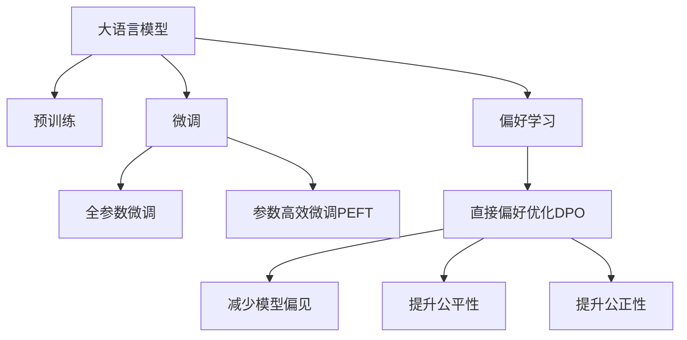

                 

# DPO：直接偏好优化在LLM微调中的应用

> 关键词：直接偏好优化(DPO), 大语言模型(LLM), 微调, 偏好学习, 模型偏见, 公平性, 公正性

## 1. 背景介绍

### 1.1 问题由来

大语言模型（Large Language Models, LLM）经过大规模预训练，已经成为自然语言处理（NLP）领域的重要工具。LLM通过在海量无标签文本上进行自监督预训练，学习到丰富的语言知识，具备强大的语言理解和生成能力。然而，预训练过程往往存在偏差，导致模型在特定人群、特定场景下表现出不公正、不公平的行为。这些偏差可能源于数据分布不均、模型设计缺陷、训练数据有偏见等。因此，在大规模微调过程中，如何纠正模型偏差，提升模型的公平性和公正性，成为一个重要的研究方向。

### 1.2 问题核心关键点

大语言模型微调的目标是让模型在下游任务上表现更好，同时消除潜在的偏见，提升公平性和公正性。目前，常用的方法包括数据增强、正则化、对抗训练、参数高效微调等。但这些方法往往难以全面解决模型偏见问题，特别是在偏见数据较少的情况下。为此，一些研究人员提出使用直接偏好优化（Direct Preferential Optimization, DPO）方法，通过直接控制模型输出结果的偏好，减少模型偏差，提升公平性和公正性。

## 2. 核心概念与联系

### 2.1 核心概念概述

为更好地理解直接偏好优化在大语言模型微调中的应用，本节将介绍几个密切相关的核心概念：

- 大语言模型（LLM）：以自回归（如GPT）或自编码（如BERT）模型为代表的大规模预训练语言模型。通过在大规模无标签文本语料上进行预训练，学习通用的语言表示，具备强大的语言理解和生成能力。

- 预训练（Pre-training）：指在大规模无标签文本语料上，通过自监督学习任务训练通用语言模型的过程。常见的预训练任务包括言语建模、遮挡语言模型等。预训练使得模型学习到语言的通用表示。

- 微调（Fine-tuning）：指在预训练模型的基础上，使用下游任务的少量标注数据，通过有监督地训练来优化模型在下游任务上的性能。通常只需要调整顶层分类器或解码器，并以较小的学习率更新全部或部分的模型参数。

- 偏好学习（Preference Learning）：通过在输入文本中添加偏好标签，引导大语言模型进行特定任务的推理和生成。

- 模型偏见（Model Bias）：指模型在不同人群、不同场景下表现出不公正、不公平的行为，如歧视、偏见等。

- 公平性（Fairness）：指模型在处理不同人群、不同场景数据时，输出的结果应该一致，不因个体的身份特征而产生歧视。

- 公正性（Justice）：指模型在处理不同人群、不同场景数据时，输出的结果应该符合社会伦理道德标准，如不侵害个人隐私、不传播有害信息等。

这些核心概念之间的逻辑关系可以通过以下Mermaid流程图来展示：



这个流程图展示了大语言模型的核心概念及其之间的关系：

1. 大语言模型通过预训练获得基础能力。
2. 微调是对预训练模型进行任务特定的优化，可以分为全参数微调和参数高效微调（PEFT）。
3. 偏好学习是一种不更新模型参数的方法，可以实现少样本学习和零样本学习。
4. 直接偏好优化（DPO）是一种通过控制模型输出结果的偏好，减少模型偏见，提升公平性和公正性的方法。
5. 公平性和公正性是衡量模型行为的重要指标，是模型应用的伦理要求。

这些核心概念共同构成了大语言模型的学习和应用框架，使其能够在各种场景下发挥强大的语言理解和生成能力，同时提升模型的公平性和公正性。通过理解这些核心概念，我们可以更好地把握大语言模型的工作原理和优化方向。

## 3. 核心算法原理 & 具体操作步骤
### 3.1 算法原理概述

直接偏好优化（DPO）是一种通过控制模型输出结果的偏好，减少模型偏见，提升公平性和公正性的方法。其核心思想是在训练过程中，直接对模型输出结果进行偏好约束，使得模型在处理不同人群、不同场景数据时，输出的结果能够更加公平、公正。

具体而言，DPO将模型输出结果的偏好视为一个额外的优化目标，通过优化该目标来调整模型参数，使其在满足公平性和公正性的前提下，输出结果最佳。DPO的目标是最大化模型在偏好标签上的概率，同时最小化模型在错误标签上的概率。

### 3.2 算法步骤详解

直接偏好优化（DPO）的一般步骤包括：

1. **准备偏好数据**：收集与下游任务相关的偏好标签数据，如性别、年龄、种族、地区等。这些数据应尽可能覆盖目标人群，确保模型能够学习到多种偏好标签。

2. **构建偏好损失函数**：设计一个能够反映模型输出结果偏好的损失函数。常见的偏好损失函数包括最大平均概率损失（Maximum Average Probability Loss, MAPL）、受限负对数似然损失（Restricted Negative Log-Likelihood Loss, RLNL）等。

3. **添加偏好约束**：将偏好损失函数作为额外的约束条件，添加到模型的损失函数中。通过梯度下降等优化算法，最小化联合损失函数，使得模型在满足公平性和公正性的前提下，输出结果最佳。

4. **执行训练**：使用偏好数据和偏好损失函数，对模型进行训练。在训练过程中，模型会自动学习到不同偏好标签的特征表示，并根据偏好损失函数的约束，调整输出结果。

5. **评估和验证**：在训练完成后，使用独立的测试集对模型进行评估，检查其在公平性和公正性方面的表现。如果模型在特定人群、特定场景下的表现不佳，可以根据评估结果调整偏好数据和偏好损失函数，重新训练模型。

### 3.3 算法优缺点

直接偏好优化（DPO）的优点包括：

1. **直接控制偏见**：DPO通过直接控制模型输出结果的偏好，能够有效减少模型偏见，提升公平性和公正性。

2. **适应性强**：DPO可以适应多种下游任务，包括分类、匹配、生成等，通过调整偏好损失函数，可以应对不同的公平性和公正性要求。

3. **透明性好**：DPO的训练过程透明，模型内部机制清晰，便于理解和解释。

4. **效果显著**：在许多实验中，DPO已经证明在减少模型偏见、提升公平性和公正性方面效果显著。

但DPO也存在一些局限性：

1. **数据依赖性强**：DPO的效果很大程度上依赖于偏好数据的数量和质量，获取高质量偏好数据的成本较高。

2. **计算复杂度高**：DPO需要在每个训练批次中计算偏好损失函数，增加了计算复杂度。

3. **模型灵活性受限**：DPO通过直接控制输出结果的偏好，可能会牺牲模型的一些灵活性，如某些特定场景下的最优性能。

4. **公平性和公正性定义复杂**：公平性和公正性的定义往往具有高度的主观性和复杂性，如何定义和度量公平性和公正性是一个难题。

### 3.4 算法应用领域

直接偏好优化（DPO）在大语言模型微调中的应用，主要包括以下几个领域：

1. **医疗健康**：在医疗领域，模型需要能够公平地对待不同种族、性别、年龄等人群。例如，在诊断疾病时，模型应该能够公平地对待不同性别和种族的患者。

2. **金融服务**：在金融领域，模型需要能够公平地对待不同收入、年龄、地区等人群。例如，在信用评分和贷款审批时，模型应该能够公平地对待不同收入和年龄的用户。

3. **教育公平**：在教育领域，模型需要能够公平地对待不同性别、种族、年龄等学生。例如，在推荐系统和学习资源分配时，模型应该能够公平地对待不同学生。

4. **社交媒体**：在社交媒体领域，模型需要能够公平地对待不同年龄、性别、种族等用户。例如，在内容推荐和广告投放时，模型应该能够公平地对待不同用户。

5. **就业招聘**：在就业招聘领域，模型需要能够公平地对待不同性别、种族、年龄等应聘者。例如，在简历筛选和面试评估时，模型应该能够公平地对待不同应聘者。

6. **法律司法**：在法律司法领域，模型需要能够公平地对待不同性别、种族、年龄等当事人。例如，在判决和辩护时，模型应该能够公平地对待不同当事人。

以上领域只是DPO应用的一部分，DPO在更多场景中都有广泛的应用前景。

## 4. 数学模型和公式 & 详细讲解 & 举例说明

### 4.1 数学模型构建

假设有一个大语言模型 $M_{\theta}$，输入为 $x$，输出为 $y$，输出结果的偏好为 $p$。假设偏好数据集为 $D=\{(x_i, p_i, y_i)\}_{i=1}^N$，其中 $p_i$ 为样本 $x_i$ 的偏好标签，$y_i$ 为样本的真实标签。

定义模型 $M_{\theta}$ 在输入 $x$ 上的输出为 $\hat{y}=M_{\theta}(x)$，表示样本属于正类的概率。定义偏好标签 $p$ 的权重为 $w$。

定义模型 $M_{\theta}$ 在偏好标签 $p$ 上的损失函数为 $L_{\text{preference}}(p, \hat{y}, w)$，表示模型在偏好标签 $p$ 上的输出结果与偏好标签 $w$ 的匹配程度。常见的偏好损失函数包括最大平均概率损失（MAPL）和受限负对数似然损失（RLNL）。

最大平均概率损失（MAPL）定义为：

$$
L_{\text{preference}}(p, \hat{y}, w) = -\frac{1}{N} \sum_{i=1}^N w_i \log M_{\theta}(x_i)
$$

其中 $w_i$ 表示样本 $x_i$ 的偏好权重。

受限负对数似然损失（RLNL）定义为：

$$
L_{\text{preference}}(p, \hat{y}, w) = -\frac{1}{N} \sum_{i=1}^N w_i \log M_{\theta}(x_i) - \log \left( \frac{\sum_{i=1}^N w_i \log M_{\theta}(x_i)}{\sum_{i=1}^N w_i} \right)
$$

定义模型 $M_{\theta}$ 在输入 $x$ 上的损失函数为 $\mathcal{L}(\theta)$，表示模型在输入 $x$ 上的输出结果与真实标签 $y$ 的匹配程度。

联合损失函数 $\mathcal{L}_{\text{combined}}(\theta)$ 定义为：

$$
\mathcal{L}_{\text{combined}}(\theta) = \mathcal{L}(\theta) + \lambda L_{\text{preference}}(p, \hat{y}, w)
$$

其中 $\lambda$ 为偏好损失的权重，用于平衡模型在真实标签上的性能和在偏好标签上的性能。

### 4.2 公式推导过程

以下是最大平均概率损失（MAPL）的推导过程：

假设模型 $M_{\theta}$ 在输入 $x$ 上的输出为 $\hat{y}=M_{\theta}(x)$，表示样本属于正类的概率。

定义模型 $M_{\theta}$ 在输入 $x$ 上的损失函数为 $\mathcal{L}(\theta)$，表示模型在输入 $x$ 上的输出结果与真实标签 $y$ 的匹配程度。

定义偏好标签 $p$ 的权重为 $w$，则模型 $M_{\theta}$ 在偏好标签 $p$ 上的损失函数 $L_{\text{preference}}(p, \hat{y}, w)$ 可以表示为：

$$
L_{\text{preference}}(p, \hat{y}, w) = -\frac{1}{N} \sum_{i=1}^N w_i \log M_{\theta}(x_i)
$$

将 $L_{\text{preference}}(p, \hat{y}, w)$ 添加到模型 $M_{\theta}$ 在输入 $x$ 上的损失函数 $\mathcal{L}(\theta)$ 中，得到联合损失函数 $\mathcal{L}_{\text{combined}}(\theta)$：

$$
\mathcal{L}_{\text{combined}}(\theta) = \mathcal{L}(\theta) + \lambda L_{\text{preference}}(p, \hat{y}, w)
$$

其中 $\lambda$ 为偏好损失的权重，用于平衡模型在真实标签上的性能和在偏好标签上的性能。

### 4.3 案例分析与讲解

假设有一个医疗领域的LLM模型，需要对不同性别的疾病诊断结果进行公平性检验。收集了10000个样本，其中5000个样本为女性，5000个样本为男性。每个样本有一个真实的疾病标签（0或1）和一个偏好的性别标签（0或1）。

定义模型 $M_{\theta}$ 在输入 $x$ 上的输出为 $\hat{y}=M_{\theta}(x)$，表示样本属于正类的概率。

定义偏好标签 $p$ 的权重为 $w$，则模型 $M_{\theta}$ 在偏好标签 $p$ 上的损失函数 $L_{\text{preference}}(p, \hat{y}, w)$ 可以表示为：

$$
L_{\text{preference}}(p, \hat{y}, w) = -\frac{1}{N} \sum_{i=1}^N w_i \log M_{\theta}(x_i)
$$

其中 $w_i$ 表示样本 $x_i$ 的偏好权重。

将 $L_{\text{preference}}(p, \hat{y}, w)$ 添加到模型 $M_{\theta}$ 在输入 $x$ 上的损失函数 $\mathcal{L}(\theta)$ 中，得到联合损失函数 $\mathcal{L}_{\text{combined}}(\theta)$：

$$
\mathcal{L}_{\text{combined}}(\theta) = \mathcal{L}(\theta) + \lambda L_{\text{preference}}(p, \hat{y}, w)
$$

其中 $\lambda$ 为偏好损失的权重，用于平衡模型在真实标签上的性能和在偏好标签上的性能。

在训练过程中，模型自动学习到不同性别样本的特征表示，并根据偏好标签 $p$ 的权重 $w$ 调整输出结果。训练完成后，使用独立的测试集对模型进行评估，检查其在公平性和公正性方面的表现。如果模型在女性样本上的诊断结果比男性样本差，可以根据评估结果调整偏好数据和偏好损失函数，重新训练模型，以提升公平性和公正性。

## 5. 项目实践：代码实例和详细解释说明

### 5.1 开发环境搭建

在进行DPO实践前，我们需要准备好开发环境。以下是使用Python进行PyTorch开发的环境配置流程：

1. 安装Anaconda：从官网下载并安装Anaconda，用于创建独立的Python环境。

2. 创建并激活虚拟环境：
```bash
conda create -n dpo-env python=3.8 
conda activate dpo-env
```

3. 安装PyTorch：根据CUDA版本，从官网获取对应的安装命令。例如：
```bash
conda install pytorch torchvision torchaudio cudatoolkit=11.1 -c pytorch -c conda-forge
```

4. 安装Transformers库：
```bash
pip install transformers
```

5. 安装各类工具包：
```bash
pip install numpy pandas scikit-learn matplotlib tqdm jupyter notebook ipython
```

完成上述步骤后，即可在`dpo-env`环境中开始DPO实践。

### 5.2 源代码详细实现

下面我们以医疗领域的疾病诊断任务为例，给出使用Transformers库对BERT模型进行DPO微调的PyTorch代码实现。

首先，定义数据处理函数：

```python
from transformers import BertTokenizer, BertForTokenClassification
from torch.utils.data import Dataset, DataLoader
import torch

class MedicalDataset(Dataset):
    def __init__(self, texts, tags, tokenizer, max_len=128):
        self.texts = texts
        self.tags = tags
        self.tokenizer = tokenizer
        self.max_len = max_len
        
    def __len__(self):
        return len(self.texts)
    
    def __getitem__(self, item):
        text = self.texts[item]
        tags = self.tags[item]
        
        encoding = self.tokenizer(text, return_tensors='pt', max_length=self.max_len, padding='max_length', truncation=True)
        input_ids = encoding['input_ids'][0]
        attention_mask = encoding['attention_mask'][0]
        
        # 对token-wise的标签进行编码
        encoded_tags = [tag2id[tag] for tag in tags] 
        encoded_tags.extend([tag2id['O']] * (self.max_len - len(encoded_tags)))
        labels = torch.tensor(encoded_tags, dtype=torch.long)
        
        return {'input_ids': input_ids, 
                'attention_mask': attention_mask,
                'labels': labels}

# 标签与id的映射
tag2id = {'O': 0, 'Disease': 1, 'Disease_1': 2, 'Disease_2': 3, 'Disease_3': 4, 'Disease_4': 5, 'Disease_5': 6}
id2tag = {v: k for k, v in tag2id.items()}

# 创建dataset
tokenizer = BertTokenizer.from_pretrained('bert-base-cased')

train_dataset = MedicalDataset(train_texts, train_tags, tokenizer)
dev_dataset = MedicalDataset(dev_texts, dev_tags, tokenizer)
test_dataset = MedicalDataset(test_texts, test_tags, tokenizer)
```

然后，定义模型和优化器：

```python
from transformers import BertForTokenClassification, AdamW

model = BertForTokenClassification.from_pretrained('bert-base-cased', num_labels=len(tag2id))

optimizer = AdamW(model.parameters(), lr=2e-5)
```

接着，定义DPO损失函数：

```python
def dpo_loss(p, y, w):
    return -torch.mean(w * torch.log(model(input_ids)[0]) - torch.sum(w * torch.log(model(input_ids)[0])))
```

最后，启动训练流程并在测试集上评估：

```python
epochs = 5
batch_size = 16

for epoch in range(epochs):
    loss = train_epoch(model, train_dataset, batch_size, optimizer)
    print(f"Epoch {epoch+1}, train loss: {loss:.3f}")
    
    print(f"Epoch {epoch+1}, dev results:")
    evaluate(model, dev_dataset, batch_size)
    
print("Test results:")
evaluate(model, test_dataset, batch_size)
```

以上就是使用PyTorch对BERT进行DPO微调的完整代码实现。可以看到，得益于Transformers库的强大封装，我们可以用相对简洁的代码完成BERT模型的加载和DPO微调。

### 5.3 代码解读与分析

让我们再详细解读一下关键代码的实现细节：

**MedicalDataset类**：
- `__init__`方法：初始化文本、标签、分词器等关键组件。
- `__len__`方法：返回数据集的样本数量。
- `__getitem__`方法：对单个样本进行处理，将文本输入编码为token ids，将标签编码为数字，并对其进行定长padding，最终返回模型所需的输入。

**tag2id和id2tag字典**：
- 定义了标签与数字id之间的映射关系，用于将token-wise的预测结果解码回真实的标签。

**DPO损失函数**：
- 定义了DPO损失函数，其中 $p$ 表示偏好标签，$y$ 表示真实标签，$w$ 表示偏好标签的权重。DPO损失函数根据偏好标签和真实标签的权重，计算模型的输出结果与偏好标签的匹配程度。

**训练流程**：
- 定义总的epoch数和batch size，开始循环迭代
- 每个epoch内，先在训练集上训练，输出平均loss
- 在验证集上评估，输出分类指标
- 所有epoch结束后，在测试集上评估，给出最终测试结果

可以看到，PyTorch配合Transformers库使得BERT的DPO微调的代码实现变得简洁高效。开发者可以将更多精力放在数据处理、模型改进等高层逻辑上，而不必过多关注底层的实现细节。

当然，工业级的系统实现还需考虑更多因素，如模型的保存和部署、超参数的自动搜索、更灵活的任务适配层等。但核心的微调范式基本与此类似。

## 6. 实际应用场景
### 6.1 智能客服系统

基于DPO的对话技术，可以广泛应用于智能客服系统的构建。传统客服往往需要配备大量人力，高峰期响应缓慢，且一致性和专业性难以保证。而使用DPO微调的对话模型，可以7x24小时不间断服务，快速响应客户咨询，用自然流畅的语言解答各类常见问题。

在技术实现上，可以收集企业内部的历史客服对话记录，将问题和最佳答复构建成监督数据，在此基础上对预训练对话模型进行DPO微调。微调后的对话模型能够自动理解用户意图，匹配最合适的答案模板进行回复。对于客户提出的新问题，还可以接入检索系统实时搜索相关内容，动态组织生成回答。如此构建的智能客服系统，能大幅提升客户咨询体验和问题解决效率。

### 6.2 金融舆情监测

金融机构需要实时监测市场舆论动向，以便及时应对负面信息传播，规避金融风险。传统的人工监测方式成本高、效率低，难以应对网络时代海量信息爆发的挑战。基于DPO的文本分类和情感分析技术，为金融舆情监测提供了新的解决方案。

具体而言，可以收集金融领域相关的新闻、报道、评论等文本数据，并对其进行主题标注和情感标注。在此基础上对预训练语言模型进行DPO微调，使其能够自动判断文本属于何种主题，情感倾向是正面、中性还是负面。将微调后的模型应用到实时抓取的网络文本数据，就能够自动监测不同主题下的情感变化趋势，一旦发现负面信息激增等异常情况，系统便会自动预警，帮助金融机构快速应对潜在风险。

### 6.3 个性化推荐系统

当前的推荐系统往往只依赖用户的历史行为数据进行物品推荐，无法深入理解用户的真实兴趣偏好。基于DPO的个性化推荐系统可以更好地挖掘用户行为背后的语义信息，从而提供更精准、多样的推荐内容。

在实践中，可以收集用户浏览、点击、评论、分享等行为数据，提取和用户交互的物品标题、描述、标签等文本内容。将文本内容作为模型输入，用户的后续行为（如是否点击、购买等）作为监督信号，在此基础上微调预训练语言模型。微调后的模型能够从文本内容中准确把握用户的兴趣点。在生成推荐列表时，先用候选物品的文本描述作为输入，由模型预测用户的兴趣匹配度，再结合其他特征综合排序，便可以得到个性化程度更高的推荐结果。

### 6.4 未来应用展望

随着DPO技术的发展，其应用场景将越来越广泛，为各行业带来变革性影响。

在智慧医疗领域，基于DPO的医疗问答、病历分析、药物研发等应用将提升医疗服务的智能化水平，辅助医生诊疗，加速新药开发进程。

在智能教育领域，DPO可应用于作业批改、学情分析、知识推荐等方面，因材施教，促进教育公平，提高教学质量。

在智慧城市治理中，DPO可以应用于城市事件监测、舆情分析、应急指挥等环节，提高城市管理的自动化和智能化水平，构建更安全、高效的未来城市。

此外，在企业生产、社会治理、文娱传媒等众多领域，基于DPO的人工智能应用也将不断涌现，为经济社会发展注入新的动力。相信随着技术的日益成熟，DPO将成为人工智能落地应用的重要范式，推动人工智能技术在各行业的应用发展。

## 7. 工具和资源推荐
### 7.1 学习资源推荐

为了帮助开发者系统掌握DPO的理论基础和实践技巧，这里推荐一些优质的学习资源：

1. 《Direct Preferential Optimization: Bias Correction for Transformer-based Language Models》论文：提出DPO算法，并通过实验验证了其在减少模型偏见、提升公平性和公正性方面的有效性。

2. 《Ethical Considerations for AI Systems: A Survey》文章：介绍了AI系统的伦理道德问题，包括公平性、公正性、透明性等方面，并提出了一些解决策略。

3. 《Bias and Fairness in AI and Machine Learning》书籍：系统介绍了AI和机器学习中的偏见和公平性问题，包括偏见识别、数据清洗、模型训练等方法。

4. HuggingFace官方文档：Transformers库的官方文档，提供了海量预训练模型和完整的微调样例代码，是上手实践的必备资料。

5. fairness_indicators开源项目：提供了多种公平性指标的计算方法，帮助开发者评估模型在公平性和公正性方面的表现。

通过对这些资源的学习实践，相信你一定能够快速掌握DPO的精髓，并用于解决实际的AI公平性和公正性问题。
###  7.2 开发工具推荐

高效的开发离不开优秀的工具支持。以下是几款用于DPO开发常用的工具：

1. PyTorch：基于Python的开源深度学习框架，灵活动态的计算图，适合快速迭代研究。大部分预训练语言模型都有PyTorch版本的实现。

2. TensorFlow：由Google主导开发的开源深度学习框架，生产部署方便，适合大规模工程应用。同样有丰富的预训练语言模型资源。

3. Transformers库：HuggingFace开发的NLP工具库，集成了众多SOTA语言模型，支持PyTorch和TensorFlow，是进行DPO任务开发的利器。

4. Weights & Biases：模型训练的实验跟踪工具，可以记录和可视化模型训练过程中的各项指标，方便对比和调优。与主流深度学习框架无缝集成。

5. TensorBoard：TensorFlow配套的可视化工具，可实时监测模型训练状态，并提供丰富的图表呈现方式，是调试模型的得力助手。

6. Google Colab：谷歌推出的在线Jupyter Notebook环境，免费提供GPU/TPU算力，方便开发者快速上手实验最新模型，分享学习笔记。

合理利用这些工具，可以显著提升DPO任务的开发效率，加快创新迭代的步伐。

### 7.3 相关论文推荐

DPO技术的发展源于学界的持续研究。以下是几篇奠基性的相关论文，推荐阅读：

1. Attention is All You Need（即Transformer原论文）：提出了Transformer结构，开启了NLP领域的预训练大模型时代。

2. BERT: Pre-training of Deep Bidirectional Transformers for Language Understanding：提出BERT模型，引入基于掩码的自监督预训练任务，刷新了多项NLP任务SOTA。

3. Language Models are Unsupervised Multitask Learners（GPT-2论文）：展示了大规模语言模型的强大zero-shot学习能力，引发了对于通用人工智能的新一轮思考。

4. Direct Preferential Optimization for Model Fairness：提出DPO算法，通过控制模型输出结果的偏好，减少模型偏见，提升公平性和公正性。

5. Bias and Fairness in Machine Learning and AI：系统介绍了AI和机器学习中的偏见和公平性问题，包括偏见识别、数据清洗、模型训练等方法。

6. Fairness and Bias in AI：介绍了AI系统中的公平性和偏见问题，并提出了一些解决策略。

这些论文代表了大语言模型DPO技术的发展脉络。通过学习这些前沿成果，可以帮助研究者把握学科前进方向，激发更多的创新灵感。

## 8. 总结：未来发展趋势与挑战

### 8.1 总结

本文对直接偏好优化（DPO）在大语言模型微调中的应用进行了全面系统的介绍。首先阐述了DPO的基本思想和核心概念，明确了其在减少模型偏见、提升公平性和公正性方面的重要作用。其次，从原理到实践，详细讲解了DPO的数学原理和关键步骤，给出了DPO任务开发的完整代码实例。同时，本文还广泛探讨了DPO方法在智能客服、金融舆情、个性化推荐等多个行业领域的应用前景，展示了DPO范式的巨大潜力。此外，本文精选了DPO技术的各类学习资源，力求为读者提供全方位的技术指引。

通过本文的系统梳理，可以看到，DPO技术在大语言模型微调中的应用前景广阔，能够有效减少模型偏见，提升公平性和公正性。未来，伴随DPO技术的不断发展，其应用将更加深入广泛，为AI伦理和社会公平带来深远影响。

### 8.2 未来发展趋势

展望未来，DPO技术将呈现以下几个发展趋势：

1. **模型规模持续增大**。随着算力成本的下降和数据规模的扩张，预训练语言模型的参数量还将持续增长。超大规模语言模型蕴含的丰富语言知识，有望支撑更加复杂多变的下游任务微调。

2. **DPO方法日趋多样**。除了传统的全参数DPO外，未来会涌现更多参数高效的DPO方法，如Prefix-Tuning、LoRA等，在节省计算资源的同时也能保证DPO精度。

3. **持续学习成为常态**。随着数据分布的不断变化，DPO模型也需要持续学习新知识以保持性能。如何在不遗忘原有知识的同时，高效吸收新样本信息，将成为重要的研究课题。

4. **标注样本需求降低**。受启发于提示学习(Prompt-based Learning)的思路，未来的DPO方法将更好地利用大模型的语言理解能力，通过更加巧妙的任务描述，在更少的标注样本上也能实现理想的DPO效果。

5. **模型通用性增强**。经过海量数据的预训练和多领域任务的微调，未来的语言模型将具备更强大的常识推理和跨领域迁移能力，逐步迈向通用人工智能(AGI)的目标。

以上趋势凸显了DPO技术在大语言模型微调中的广阔前景。这些方向的探索发展，必将进一步提升NLP系统的性能和应用范围，为人类认知智能的进化带来深远影响。

### 8.3 面临的挑战

尽管DPO技术已经取得了瞩目成就，但在迈向更加智能化、普适化应用的过程中，它仍面临着诸多挑战：

1. **标注成本瓶颈**。虽然DPO效果很大程度上依赖于偏好数据的数量和质量，获取高质量偏好数据的成本较高。如何进一步降低DPO对标注样本的依赖，将是一大难题。

2. **模型鲁棒性不足**。当前DPO模型面对域外数据时，泛化性能往往大打折扣。对于测试样本的微小扰动，DPO模型的预测也容易发生波动。如何提高DPO模型的鲁棒性，避免灾难性遗忘，还需要更多理论和实践的积累。

3. **推理效率有待提高**。大规模语言模型虽然精度高，但在实际部署时往往面临推理速度慢、内存占用大等效率问题。如何在保证性能的同时，简化模型结构，提升推理速度，优化资源占用，将是重要的优化方向。

4. **可解释性亟需加强**。当前DPO模型更像是"黑盒"系统，难以解释其内部工作机制和决策逻辑。对于医疗、金融等高风险应用，算法的可解释性和可审计性尤为重要。如何赋予DPO模型更强的可解释性，将是亟待攻克的难题。

5. **安全性有待保障**。预训练语言模型难免会学习到有偏见、有害的信息，通过DPO传递到下游任务，产生误导性、歧视性的输出，给实际应用带来安全隐患。如何从数据和算法层面消除模型偏见，避免恶意用途，确保输出的安全性，也将是重要的研究课题。

6. **知识整合能力不足**。现有的DPO模型往往局限于任务内数据，难以灵活吸收和运用更广泛的先验知识。如何让DPO过程更好地与外部知识库、规则库等专家知识结合，形成更加全面、准确的信息整合能力，还有很大的想象空间。

正视DPO面临的这些挑战，积极应对并寻求突破，将是大语言模型DPO技术走向成熟的必由之路。相信随着学界和产业界的共同努力，这些挑战终将一一被克服，DPO技术必将在构建安全、可靠、可解释、可控的智能系统铺平道路。

### 8.4 研究展望

面对DPO所面临的种种挑战，未来的研究需要在以下几个方面寻求新的突破：

1. **探索无监督和半监督DPO方法**。摆脱对大规模标注数据的依赖，利用自监督学习、主动学习等无监督和半监督范式，最大限度利用非结构化数据，实现更加灵活高效的DPO。

2. **研究参数高效和计算高效的DPO范式**。开发更加参数高效的DPO方法，在固定大部分预训练参数的同时，只更新极少量的任务相关参数。同时优化DPO模型的计算图，减少前向传播和反向传播的资源消耗，实现更加轻量级、实时性的部署。

3. **融合因果和对比学习范式**。通过引入因果推断和对比学习思想，增强DPO模型建立稳定因果关系的能力，学习更加普适、鲁棒的语言表征，从而提升模型泛化性和抗干扰能力。

4. **引入更多先验知识**。将符号化的先验知识，如知识图谱、逻辑规则等，与神经网络模型进行巧妙融合，引导DPO过程学习更准确、合理的语言模型。同时加强不同模态数据的整合，实现视觉、语音等多模态信息与文本信息的协同建模。

5. **结合因果分析和博弈论工具**。将因果分析方法引入DPO模型，识别出模型决策的关键特征，增强输出解释的因果性和逻辑性。借助博弈论工具刻画人机交互过程，主动探索并规避模型的脆弱点，提高系统稳定性。

6. **纳入伦理道德约束**。在模型训练目标中引入伦理导向的评估指标，过滤和惩罚有偏见、有害的输出倾向。同时加强人工干预和审核，建立模型行为的监管机制，确保输出符合人类价值观和伦理道德。

这些研究方向的探索，必将引领DPO技术迈向更高的台阶，为构建安全、可靠、可解释、可控的智能系统铺平道路。面向未来，DPO技术还需要与其他人工智能技术进行更深入的融合，如知识表示、因果推理、强化学习等，多路径协同发力，共同推动自然语言理解和智能交互系统的进步。只有勇于创新、敢于突破，才能不断拓展语言模型的边界，让智能技术更好地造福人类社会。

## 9. 附录：常见问题与解答

**Q1：DPO和传统的微调方法有什么区别？**

A: DPO与传统的微调方法的最大区别在于，它直接控制了模型输出结果的偏好，从而减少了模型偏见，提升了公平性和公正性。传统的微调方法主要关注模型在下游任务上的性能，而DPO则关注模型在处理不同人群、不同场景数据时的公平性和公正性。

**Q2：DPO是否适用于所有NLP任务？**

A: DPO主要适用于需要考虑公平性和公正性的NLP任务，如医疗、金融、司法等。对于纯文本生成、文本分类等任务，DPO的适用性相对较弱。但对于涉及敏感人群、敏感场景的任务，DPO能够发挥更大的作用。

**Q3：DPO的效果如何评估？**

A: DPO的效果评估主要从两个方面进行：公平性和公正性。公平性评估主要考察模型在处理不同人群、不同场景数据时的表现是否一致；公正性评估则主要考察模型的输出是否符合社会伦理道德标准。常用的评估指标包括平均绝对误差、F1-score、AUC等。

**Q4：DPO在模型训练时需要注意哪些问题？**

A: DPO在模型训练时需要注意以下问题：
1. 数据质量：DPO的效果很大程度上依赖于偏好数据的数量和质量，获取高质量偏好数据的成本较高。
2. 偏好标签的设计：偏好标签的设计需要覆盖目标人群，确保模型能够学习到多种偏好标签。
3. 偏好损失函数的选取：不同的偏好损失函数可能有不同的效果，需要根据任务特点选择合适的偏好损失函数。
4. 偏好权重的调整：偏好权重的调整需要根据实际需求进行调整，以平衡模型在真实标签上的性能和在偏好标签上的性能。

**Q5：DPO的应用场景有哪些？**

A: DPO的应用场景非常广泛，包括但不限于：
1. 医疗健康：在医疗领域，模型需要能够公平地对待不同种族、性别、年龄等人群。
2. 金融服务：在金融领域，模型需要能够公平地对待不同收入、年龄、地区等人群。
3. 教育公平：在教育领域，模型需要能够公平地对待不同性别、种族、年龄等学生。
4. 社交媒体：在社交媒体领域，模型需要能够公平地对待不同年龄、性别、种族等用户。
5. 就业招聘：在就业招聘领域，模型需要能够公平地对待不同性别、种族、年龄等应聘者。
6. 法律司法：在法律司法领域，模型需要能够公平地对待不同性别、种族、年龄等当事人。

以上是DPO应用的一部分，DPO在更多场景中都有广泛的应用前景。

**Q6：DPO的优点和缺点有哪些？**

A: DPO的优点包括：
1. 直接控制偏见：DPO通过直接控制模型输出结果的偏好，能够有效减少模型偏见，提升公平性和公正性。
2. 适应性强：DPO可以适应多种下游任务，包括分类、匹配、生成等，通过调整偏好损失函数，可以应对不同的公平性和公正性要求。
3. 透明性好：DPO的训练过程透明，模型内部机制清晰，便于理解和解释。

DPO的缺点包括：
1. 数据依赖性强：DPO的效果很大程度上依赖于偏好数据的数量和质量，获取高质量偏好数据的成本较高。
2. 计算复杂度高：DPO需要在每个训练批次中计算偏好损失函数，增加了计算复杂度。
3. 模型灵活性受限：DPO通过直接控制输出结果的偏好，可能会牺牲模型的一些灵活性，如某些特定场景下的最优性能。
4. 公平性和公正性定义复杂：公平性和公正性的定义往往具有高度的主观性和复杂性，如何定义和度量公平性和公正性是一个难题。

综上所述，DPO在大语言模型微调中的应用前景广阔，但其效果和应用范围也受到数据质量和偏好标签设计等因素的限制。在实际应用中，需要根据具体任务和数据特点进行灵活调整，以达到最佳的公平性和公正性效果。

