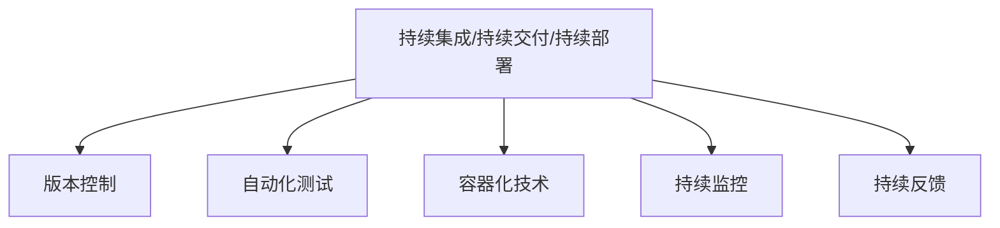

                 

# DevOps 工具链：构建高效的软件交付管道

## 1. 背景介绍

### 1.1 问题由来

在过去，软件开发流程被分割为不同的阶段，包括需求分析、设计、编码、测试、部署和运维，每个阶段都有其独特的挑战和复杂性。这导致整个软件开发周期变得漫长、昂贵且容易出错。为了应对这些挑战，DevOps（Development and Operations）方法应运而生，它强调了开发与运维的紧密合作，推动了软件交付管道（CI/CD Pipeline）的自动化。

软件交付管道是一系列自动化流程，用于持续集成（Continuous Integration, CI）、持续交付（Continuous Delivery, CD）和持续部署（Continuous Deployment, CD）。它通过自动化测试、打包、部署等环节，使得软件产品可以快速、可靠、安全地交付给用户。

### 1.2 问题核心关键点

构建高效的软件交付管道，需要关注以下几个核心关键点：

1. **自动化**：通过自动化测试和部署，减少人为错误和延迟。
2. **版本控制**：使用版本控制系统（如Git）来管理代码变更。
3. **持续集成**：在每个代码变更后自动运行测试和构建流程。
4. **持续交付**：在代码通过测试后，自动打包并部署到预定的环境中。
5. **持续部署**：在代码通过测试和预发布检查后，自动部署到生产环境。
6. **监控与反馈**：实时监控应用性能，收集反馈并及时调整。

## 2. 核心概念与联系

### 2.1 核心概念概述

为更好地理解DevOps工具链的构建方法，本节将介绍几个密切相关的核心概念：

- **持续集成/持续交付/持续部署（CI/CD）**：自动化软件交付流程，通过持续集成测试代码变更，持续交付构建后的软件包，持续部署到生产环境，从而快速响应市场需求。
- **版本控制**：使用版本控制系统（如Git）来管理代码变更，确保所有代码变更可追踪、可回溯。
- **自动化测试**：通过脚本化的测试流程，自动化地执行各种测试类型，如单元测试、集成测试、性能测试等。
- **容器化技术**：通过Docker等容器技术，将应用和依赖打包到轻量级的容器中，便于部署和运维。
- **持续监控**：实时监控应用性能、日志和错误，收集反馈并进行调整。
- **持续反馈**：根据监控和反馈结果，不断优化交付流程，提升软件质量和交付速度。

这些核心概念之间的逻辑关系可以通过以下Mermaid流程图来展示：



这个流程图展示了他核心概念及其之间的关系：

1. CI/CD是整个过程的驱动力，通过自动化流程驱动整个交付管道。
2. 版本控制是基础，确保代码变更的可追踪和可回溯。
3. 自动化测试和容器化技术是核心，通过自动化手段提升交付速度和质量。
4. 持续监控和持续反馈是保障，通过实时监控和反馈调整确保交付的可靠性和性能。

## 3. 核心算法原理 & 具体操作步骤

### 3.1 算法原理概述

DevOps工具链的核心算法原理基于自动化和持续性原则，通过自动化工具链的集成，实现了软件交付管道的自动化和持续化。核心算法包括：

1. **自动化测试算法**：通过脚本化测试流程，实现测试自动化，包括单元测试、集成测试、端到端测试等。
2. **容器化部署算法**：将应用和依赖打包到容器中，实现轻量级部署，便于部署和运维。
3. **持续监控与反馈算法**：通过实时监控应用性能和日志，收集反馈信息，自动调整部署策略。

### 3.2 算法步骤详解

构建高效的软件交付管道，需要遵循以下步骤：

**Step 1: 选择工具和框架**

- **版本控制**：选择如Git、SVN等版本控制系统。
- **持续集成/持续交付/持续部署**：选择如Jenkins、Travis CI、GitLab CI等工具。
- **自动化测试**：选择如JUnit、TestNG、Selenium等测试框架。
- **容器化技术**：选择如Docker、Kubernetes等容器化技术。
- **持续监控**：选择如ELK Stack、Prometheus、Grafana等监控工具。

**Step 2: 配置持续集成流程**

- **代码推送**：配置Git Repository，设置Git Hook触发持续集成。
- **构建与测试**：设置构建脚本，执行自动化测试，生成测试报告。
- **代码合并策略**：设置合并策略，确保代码质量。

**Step 3: 配置持续交付流程**

- **打包与部署**：配置构建脚本，打包应用到Docker容器中，推送到容器仓库。
- **环境部署**：配置Kubernetes Deployment，实现自动化部署。
- **预发布检查**：配置预发布检查脚本，确保应用符合发布标准。

**Step 4: 配置持续监控与反馈**

- **监控配置**：配置ELK Stack或Prometheus，实时监控应用性能和日志。
- **报警配置**：配置报警规则，设置报警通知方式。
- **反馈循环**：根据监控结果，调整持续交付流程，确保交付的可靠性和性能。

**Step 5: 持续优化**

- **性能优化**：定期检查和优化性能瓶颈。
- **自动化测试**：不断添加新的自动化测试用例。
- **持续反馈**：根据监控和反馈结果，不断优化持续交付流程。

### 3.3 算法优缺点

DevOps工具链具有以下优点：

1. **提高效率**：自动化测试和部署大大提高了软件交付的速度和质量。
2. **降低成本**：通过持续交付，减少了人为错误和重复工作，降低了开发和运维成本。
3. **提升质量**：自动化测试和持续监控确保了代码质量和应用性能。
4. **增强灵活性**：通过持续集成和持续交付，可以快速响应市场需求。

同时，该方法也存在以下局限性：

1. **工具选择复杂**：选择和配置合适的工具和框架需要一定时间和精力。
2. **集成难度大**：各个工具之间的集成和配置复杂，容易出现兼容性问题。
3. **故障排查困难**：自动化流程中的任何问题都会影响到整个交付管道的运行。
4. **需要文化变革**：实现DevOps需要团队文化和技术上的变革，需要时间和投入。

尽管存在这些局限性，但就目前而言，DevOps工具链的自动化和持续化仍是软件交付管道的主流范式。未来相关研究的重点在于如何进一步降低工具集成的难度，提高自动化的灵活性和鲁棒性，同时兼顾持续反馈和自动化测试的深度和广度。

### 3.4 算法应用领域

DevOps工具链的应用领域非常广泛，涵盖了软件开发和运维的各个环节，包括：

- **应用程序开发**：通过持续集成和持续交付，加速应用程序的开发和交付。
- **基础设施管理**：通过容器化技术，实现基础设施的标准化和自动化管理。
- **运维监控**：通过持续监控和持续反馈，实时监控应用性能和日志，收集反馈并及时调整。
- **数据分析**：通过数据分析工具，实时监控应用性能，优化持续交付流程。

此外，DevOps工具链也被创新性地应用于更多场景中，如可控测试、安全测试、合规性测试等，为软件开发和运维带来了全新的突破。随着DevOps实践的不断演进，相信其在更多领域的应用将进一步深化。

## 4. 数学模型和公式 & 详细讲解  
### 4.1 数学模型构建

本节将使用数学语言对DevOps工具链的构建过程进行更加严格的刻画。

假设软件开发流程分为$n$个阶段，每个阶段的时间为$t_i$（$i=1,2,\cdots,n$），每个阶段的概率为$p_i$（$i=1,2,\cdots,n$）。则整个软件交付时间$T$的概率分布为：

$$
P(T) = \prod_{i=1}^{n} p_i
$$

其中$p_i$表示阶段$i$的概率，$t_i$表示阶段$i$的时间。

### 4.2 公式推导过程

通过马尔可夫链模型，可以进一步推导整个软件交付时间$T$的期望值和方差：

$$
E[T] = \sum_{i=1}^{n} t_i p_i
$$

$$
Var[T] = \sum_{i=1}^{n} t_i^2 p_i (1-p_i)
$$

通过优化每个阶段的时间$t_i$和概率$p_i$，可以最小化软件交付时间的期望值和方差。

### 4.3 案例分析与讲解

以持续集成和持续交付为例，我们可以将整个交付过程分为代码提交、测试、打包、部署等阶段。每个阶段的时间$T_i$和概率$p_i$可以按实际需求设定。通过优化这些参数，可以显著提高交付速度和可靠性。

假设测试阶段的时间为$t_2=2$天，概率$p_2=0.9$，部署阶段的时间为$t_4=1$天，概率$p_4=0.95$。则整个交付时间的期望值为：

$$
E[T] = t_1 p_1 + t_2 p_2 + t_3 p_3 + t_4 p_4
$$

通过调整$p_1$、$p_2$、$p_3$和$p_4$的值，可以最小化$E[T]$。

## 5. 项目实践：代码实例和详细解释说明

### 5.1 开发环境搭建

在进行DevOps工具链的实践前，我们需要准备好开发环境。以下是使用Python进行Jenkins开发的环境配置流程：

1. 安装Jenkins：从官网下载并安装Jenkins，创建管理员用户并配置Jenkins。

2. 安装Jenkins插件：安装必要的插件，如Git Plugin、Docker Plugin、Maven Plugin等。

3. 配置Jenkins系统：设置Git Repository，配置构建和测试脚本，设置CI/CD流水线。

4. 配置容器化技术：安装Docker和Kubernetes，配置容器镜像仓库，设置持续部署流程。

5. 配置监控工具：安装ELK Stack或Prometheus，设置监控报警规则。

完成上述步骤后，即可在Jenkins中启动持续集成和持续交付流程。

### 5.2 源代码详细实现

以下是一个基于Jenkins和Docker的持续集成和持续交付流程的PyTorch代码实现示例。

首先，定义Jenkins系统的构建脚本：

```python
import jenkins
from jenkins import Pipeline

# Jenkins系统地址
jenkins_url = 'http://localhost:8080'
jenkins_username = 'admin'
jenkins_password = 'admin'

# Jenkins Pipeline定义
pipeline = Pipeline(
    stage('代码推送'):
        script(''
            def source = '<代码仓库地址>'
            def branch = '<代码分支>'
            def commit_message = '<提交信息>'
            build jenkins.build(source, branch, commit_message)
        ),
    stage('构建与测试'):
        script(''
            def source = '<代码仓库地址>'
            def branch = '<代码分支>'
            def job = '<构建任务名称>'
            def timeout = '<超时时间>'
            def trigger = '<触发器>'
            build job(source, branch, timeout, trigger)
        ),
    stage('打包与部署'):
        script(''
            def source = '<代码仓库地址>'
            def branch = '<代码分支>'
            def job = '<打包任务名称>'
            def trigger = '<触发器>'
            build job(source, branch, timeout, trigger)
        ),
    stage('持续监控'):
        script(''
            def source = '<代码仓库地址>'
            def branch = '<代码分支>'
            def job = '<监控任务名称>'
            def timeout = '<超时时间>'
            def trigger = '<触发器>'
            build job(source, branch, timeout, trigger)
        )
)
```

然后，定义Jenkins系统中的构建任务：

```python
import jenkins

# Jenkins系统地址
jenkins_url = 'http://localhost:8080'
jenkins_username = 'admin'
jenkins_password = 'admin'

# Jenkins构建任务定义
def build(source, branch, commit_message, job, timeout, trigger):
    jenkins.create_build(source, branch, commit_message, job, timeout, trigger)

def job(source, branch, timeout, trigger):
    build(source, branch, commit_message, '构建任务', timeout, trigger)

def trigger():
    build(source, branch, commit_message, '构建任务', timeout, trigger)
```

最后，启动Jenkins Pipeline并监控构建任务：

```python
pipeline.run()
```

通过上述代码，我们可以在Jenkins中自动化地执行代码推送、构建与测试、打包与部署、持续监控等任务，构建高效的软件交付管道。

### 5.3 代码解读与分析

让我们再详细解读一下关键代码的实现细节：

**Pipeline类**：
- `Pipeline`类的定义，包括多个阶段(stage)，每个阶段分别定义了不同的任务。

**trigger函数**：
- `trigger`函数用于触发持续集成流程，可以通过定时任务、人工触发等方式启动构建任务。

**build函数**：
- `build`函数用于创建构建任务，通过指定源代码仓库、分支、提交信息和触发器等参数，自动执行构建流程。

通过Jenkins的Pipeline和触发器机制，可以实现自动化持续集成和持续交付流程，大大提高软件交付的效率和质量。

## 6. 实际应用场景

### 6.1 软件开发

基于DevOps工具链的软件开发，可以实现实时监控和反馈，确保代码质量和交付速度。在实际应用中，软件开发团队可以不断优化构建和测试流程，提升软件交付的效率和可靠性。

例如，在敏捷开发中，通过DevOps工具链，开发团队可以实时了解代码变更对构建和测试的影响，快速调整开发策略，确保软件按时交付。

### 6.2 基础设施管理

DevOps工具链在基础设施管理中的应用，可以大大提高资源利用率和部署效率。通过容器化技术，可以实现基础设施的标准化和自动化管理，减少资源浪费和配置错误。

例如，在云平台上，通过容器化技术，可以将应用程序和依赖打包到容器中，快速部署和扩展应用。通过自动化部署流程，可以自动调整资源配置，确保应用的高可用性和弹性扩展。

### 6.3 运维监控

DevOps工具链在运维监控中的应用，可以实现实时监控和故障预警，确保应用的高性能和稳定性。通过持续监控和持续反馈，可以及时发现和解决问题，提升运维效率和用户体验。

例如，在金融行业中，通过持续监控应用性能和日志，可以及时发现异常情况，避免金融风险。通过持续反馈，可以快速调整运维策略，确保应用的高可靠性和高性能。

### 6.4 未来应用展望

随着DevOps工具链的不断演进，其在更多领域的应用将进一步深化。未来，DevOps工具链将实现更加全面、灵活、智能的自动化，为软件开发和运维带来更多的创新和突破。

在智慧城市、智慧交通、智慧医疗等领域，DevOps工具链将实现更加高效、可靠的软件交付管道，提升城市治理和社会服务的水平。同时，在人工智能、大数据、区块链等前沿技术领域，DevOps工具链也将发挥重要作用，推动技术的快速迭代和应用。

## 7. 工具和资源推荐

### 7.1 学习资源推荐

为了帮助开发者系统掌握DevOps工具链的理论基础和实践技巧，这里推荐一些优质的学习资源：

1. **《DevOps: The Automated Delivery of Software》书籍**：深入浅出地介绍了DevOps方法论、工具链构建和实践经验。

2. **《Jenkins User Guide》文档**：Jenkins官方文档，提供了丰富的API和插件支持，是Jenkins开发的必备资料。

3. **《Kubernetes: Up and Running》书籍**：介绍了Kubernetes的基础知识和实践经验，是容器化技术开发的必备资料。

4. **《Prometheus Documentation》文档**：Prometheus官方文档，提供了详细的监控和报警配置指南。

5. **《ELK Stack User Guide》文档**：ELK Stack官方文档，提供了详细的日志管理和监控配置指南。

通过对这些资源的学习实践，相信你一定能够快速掌握DevOps工具链的精髓，并用于解决实际的开发和运维问题。

### 7.2 开发工具推荐

高效的开发离不开优秀的工具支持。以下是几款用于DevOps工具链开发的常用工具：

1. **Jenkins**：开源的持续集成/持续交付工具，支持多种编程语言和框架，是DevOps工具链的核心。

2. **Git**：版本控制系统，支持分布式版本控制和协作开发，是DevOps工具链的基础。

3. **Docker**：容器化技术，通过Docker镜像，实现应用和依赖的标准化和自动化部署。

4. **Kubernetes**：容器编排工具，支持自动化部署和扩展，实现基础设施的标准化和自动化管理。

5. **ELK Stack**：日志管理和监控工具，支持实时监控和报警，实现运维监控的自动化和智能化。

6. **Prometheus**：监控工具，支持实时监控应用性能和日志，实现运维监控的自动化和智能化。

合理利用这些工具，可以显著提升DevOps工具链的开发效率，加快创新迭代的步伐。

### 7.3 相关论文推荐

DevOps工具链的发展源于学界的持续研究。以下是几篇奠基性的相关论文，推荐阅读：

1. **《Continuous Delivery: Reliable Software Releases through Build, Test, and Deployment Automation》论文**：提出了持续交付的概念，推动了软件开发和运维的自动化。

2. **《Jenkins: Open Source automation server》论文**：介绍了Jenkins的基础架构和API支持，推动了持续集成和持续交付的自动化。

3. **《Docker: The Docker Container》论文**：介绍了Docker的基础架构和容器技术，推动了容器化技术的普及和应用。

4. **《Kubernetes: A Distributed Systems Toolkit for Declarative Application Modelling》论文**：介绍了Kubernetes的基础架构和容器编排技术，推动了容器编排技术的普及和应用。

5. **《Prometheus: Monitoring and alerting for any system》论文**：介绍了Prometheus的基础架构和监控技术，推动了实时监控和报警的自动化。

这些论文代表了大规模软件开发和运维的自动化技术的发展脉络。通过学习这些前沿成果，可以帮助研究者把握学科前进方向，激发更多的创新灵感。

## 8. 总结：未来发展趋势与挑战

### 8.1 总结

本文对DevOps工具链的构建方法进行了全面系统的介绍。首先阐述了DevOps工具链的研究背景和意义，明确了自动化和持续性原则对软件交付管道的驱动作用。其次，从原理到实践，详细讲解了持续集成/持续交付/持续部署、版本控制、自动化测试、容器化技术、持续监控等核心概念和操作步骤，给出了DevOps工具链开发的全流程代码实现。同时，本文还广泛探讨了DevOps工具链在软件开发、基础设施管理、运维监控等多个领域的应用前景，展示了DevOps工具链的强大能力。

通过本文的系统梳理，可以看到，DevOps工具链为软件开发和运维带来了显著的效率提升和成本降低，推动了软件交付管道的自动化和持续化。未来，伴随DevOps实践的不断演进，相信其将在更多领域得到广泛应用，为软件开发和运维带来更多的创新和突破。

### 8.2 未来发展趋势

展望未来，DevOps工具链将呈现以下几个发展趋势：

1. **工具集成更高效**：通过开放API和插件支持，实现更多工具之间的集成和互操作。
2. **流程自动化更深入**：通过持续集成和持续交付，实现更加全面的自动化。
3. **智能化运维**：通过持续监控和持续反馈，实现智能化的运维决策和自动化调整。
4. **自动化测试更全面**：通过单元测试、集成测试、端到端测试等多种测试类型，实现更加全面的自动化测试。
5. **容器化技术更普及**：通过容器化技术，实现应用的轻量化和标准化部署。
6. **数据驱动运维**：通过数据分析工具，实现运维决策的自动化和智能化。

以上趋势凸显了DevOps工具链的广阔前景。这些方向的探索发展，必将进一步提升软件开发和运维的效率和质量，为各行各业带来更大的价值。

### 8.3 面临的挑战

尽管DevOps工具链已经取得了显著的成就，但在迈向更加智能化、普适化应用的过程中，仍面临诸多挑战：

1. **工具选择复杂**：选择和配置合适的工具和框架需要一定时间和精力。
2. **集成难度大**：各个工具之间的集成和配置复杂，容易出现兼容性问题。
3. **故障排查困难**：自动化流程中的任何问题都会影响到整个交付管道的运行。
4. **需要文化变革**：实现DevOps需要团队文化和技术上的变革，需要时间和投入。

尽管存在这些挑战，但就目前而言，DevOps工具链的自动化和持续化仍是软件交付管道的主流范式。未来相关研究的重点在于如何进一步降低工具集成的难度，提高自动化的灵活性和鲁棒性，同时兼顾持续反馈和自动化测试的深度和广度。

### 8.4 研究展望

面对DevOps工具链所面临的种种挑战，未来的研究需要在以下几个方面寻求新的突破：

1. **优化持续集成/持续交付/持续部署流程**：通过自动化测试、持续监控和持续反馈，实现更加全面、灵活、智能的自动化。
2. **引入更多工具和技术**：通过引入更多工具和技术，实现更加全面、智能的软件交付管道。
3. **提升故障排查能力**：通过引入日志分析和监控工具，提升自动化流程的故障排查能力。
4. **推动文化变革**：通过推动团队文化和技术上的变革，确保DevOps工具链的成功实施。

这些研究方向的探索，必将引领DevOps工具链技术迈向更高的台阶，为软件开发和运维带来更多的创新和突破。面向未来，DevOps工具链需要从工具集成、流程自动化、智能化运维、自动化测试、容器化技术等多个维度协同发力，共同推动软件开发和运维的自动化和持续化。

## 9. 附录：常见问题与解答

**Q1：DevOps工具链是否适用于所有开发团队？**

A: DevOps工具链适合各种规模和类型的开发团队，但需要根据实际情况选择合适的工具和配置方式。对于大型企业，可以使用开源的Jenkins和Git等工具，实现全面的自动化和持续化。对于小型团队，可以考虑使用Docker和Kubernetes等容器化技术，实现轻量级的持续集成和持续部署。

**Q2：如何选择合适的DevOps工具？**

A: 选择合适的DevOps工具需要考虑团队的规模、项目的需求、开发流程的特点等因素。一般来说，小型项目可以使用Jenkins或GitLab CI等工具，中型项目可以使用GitLab或Jenkins等工具，大型项目可以使用Jenkins、GitLab CI、Travis CI等工具。

**Q3：如何优化持续集成/持续交付/持续部署流程？**

A: 优化持续集成/持续交付/持续部署流程需要从以下几个方面入手：
1. 自动化测试：增加自动化测试的覆盖面，提高测试效率和可靠性。
2. 持续监控：实时监控应用性能和日志，收集反馈并进行调整。
3. 持续反馈：根据监控和反馈结果，不断优化持续交付流程。
4. 自动化部署：实现自动化部署，减少人为错误和部署时间。

**Q4：DevOps工具链在部署过程中需要注意哪些问题？**

A: 部署过程中需要注意以下几个问题：
1. 容器化技术：选择和配置合适的容器化技术，确保应用的标准化和自动化部署。
2. 环境一致性：确保开发、测试、生产环境的一致性，避免环境差异导致的错误。
3. 弹性伸缩：根据实际负载动态调整资源配置，确保应用的可用性和性能。
4. 安全防护：采用访问鉴权、数据脱敏等措施，保障数据和系统安全。

通过合理配置和优化，可以确保DevOps工具链在部署过程中的高效和稳定，提升软件交付的质量和效率。

---

作者：禅与计算机程序设计艺术 / Zen and the Art of Computer Programming

