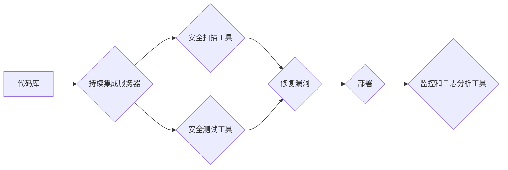

                 

## DevSecOps：将安全集成到开发流程

> 关键词：DevSecOps, 安全集成, 开发流程, 持续交付, 威胁建模, 自动化安全测试, 安全文化

### 1. 背景介绍

在当今数字化时代，软件应用的开发速度日益加快，持续交付 (Continuous Delivery) 和持续集成 (Continuous Integration) 成为主流开发模式。然而，在追求快速迭代的同时，安全问题往往被边缘化，导致软件漏洞和安全风险不断涌现。传统的安全模式，以“安全测试”为中心，往往在开发后期进行，导致发现漏洞成本高昂，修复难度大。

DevSecOps 应运而生，它将安全视为软件开发流程的不可分割的一部分，将安全集成到整个软件生命周期中，从代码编写、测试到部署和运营，始终贯彻安全理念。DevSecOps 旨在通过自动化、协作和文化转变，提升软件安全，降低安全风险。

### 2. 核心概念与联系

DevSecOps 的核心概念是将安全融入开发流程的各个环节，实现安全自动化、持续集成和协作。

#### 2.1  DevSecOps 的核心要素

* **开发 (Dev):**  DevSecOps 强调将安全纳入开发阶段，从代码编写开始就进行安全审查和测试。
* **安全 (Sec):**  安全是 DevSecOps 的核心，它贯穿整个软件生命周期，包括威胁建模、漏洞扫描、安全测试等。
* **运维 (Ops):**  DevSecOps 强调自动化运维，将安全策略和流程自动化，确保安全配置的持续性和一致性。

#### 2.2  DevSecOps 架构

DevSecOps 架构通常包括以下几个关键组件：

* **代码库:**  存储软件代码的中心仓库。
* **持续集成服务器:**  负责自动构建、测试和部署代码。
* **安全扫描工具:**  用于扫描代码和容器镜像，检测安全漏洞。
* **安全测试工具:**  用于自动化执行安全测试，例如渗透测试和代码审计。
* **配置管理工具:**  用于管理和自动化安全配置。
* **监控和日志分析工具:**  用于监控系统安全状态和分析安全事件。



### 3. 核心算法原理 & 具体操作步骤

DevSecOps 的核心算法原理是将安全测试和验证融入到开发流程中，通过自动化和持续集成的方式，实现安全风险的早期发现和快速修复。

#### 3.1  算法原理概述

DevSecOps 的核心算法原理基于以下几个方面：

* **自动化:**  通过自动化工具和脚本，将安全测试和验证流程自动化，减少人工干预，提高效率。
* **持续集成:**  将代码变更频繁地集成到主代码库中，并进行自动化构建、测试和部署，确保代码质量和安全性的持续性。
* **协作:**  鼓励开发人员、安全工程师和运维人员之间的协作，共同负责软件安全。

#### 3.2  算法步骤详解

DevSecOps 的具体操作步骤如下：

1. **代码编写:**  开发人员编写代码时，应遵循安全编码规范，避免常见的安全漏洞。
2. **代码审查:**  代码提交前，进行代码审查，检查代码是否存在安全漏洞。
3. **静态安全扫描:**  使用静态分析工具扫描代码，检测潜在的安全漏洞。
4. **动态安全扫描:**  在代码运行时，使用动态分析工具扫描代码，检测运行时安全漏洞。
5. **容器安全扫描:**  对容器镜像进行安全扫描，检测容器镜像是否存在安全漏洞。
6. **渗透测试:**  定期进行渗透测试，模拟攻击者攻击软件，发现潜在的安全漏洞。
7. **安全配置管理:**  使用配置管理工具，自动化管理和部署安全配置。
8. **安全监控和日志分析:**  使用监控和日志分析工具，监控系统安全状态，分析安全事件。

#### 3.3  算法优缺点

**优点:**

* **提高软件安全性:**  将安全集成到开发流程中，可以有效降低软件安全风险。
* **降低安全成本:**  通过自动化和早期发现漏洞，可以降低安全修复成本。
* **提高开发效率:**  自动化安全测试和验证，可以提高开发效率。
* **促进团队协作:**  DevSecOps 强调团队协作，可以促进开发人员、安全工程师和运维人员之间的沟通和合作。

**缺点:**

* **需要文化转变:**  DevSecOps 需要组织文化和流程的转变，需要所有团队成员共同参与。
* **需要技术投入:**  DevSecOps 需要投入一定的技术资源，例如安全工具和自动化脚本。
* **需要专业人才:**  DevSecOps 需要具备安全和开发经验的专业人才。

#### 3.4  算法应用领域

DevSecOps 的应用领域非常广泛，包括：

* **软件开发:**  将安全集成到软件开发流程中，提高软件安全性。
* **云计算:**  在云计算环境中，DevSecOps 可以帮助确保云资源的安全。
* **物联网:**  物联网设备的安全非常重要，DevSecOps 可以帮助确保物联网设备的安全。
* **金融科技:**  金融科技领域的安全要求非常高，DevSecOps 可以帮助金融科技公司提高安全水平。

### 4. 数学模型和公式 & 详细讲解 & 举例说明

DevSecOps 的核心算法可以抽象为一个数学模型，该模型可以用来评估软件安全风险和优化安全策略。

#### 4.1  数学模型构建

假设软件安全风险可以表示为一个函数 $R(S, T, C)$，其中：

* $S$ 代表软件的安全性，是一个介于 0 到 1 之间的数值，0 表示软件完全不安全，1 表示软件完全安全。
* $T$ 代表威胁的强度，也是一个介于 0 到 1 之间的数值，0 表示威胁非常弱，1 表示威胁非常强。
* $C$ 代表安全控制措施的有效性，也是一个介于 0 到 1 之间的数值，0 表示安全控制措施完全无效，1 表示安全控制措施完全有效。

那么，软件安全风险函数可以表示为：

$$R(S, T, C) = T \cdot (1 - S) \cdot (1 - C)$$

#### 4.2  公式推导过程

该公式的推导过程如下：

* 威胁强度 $T$ 乘以软件安全性 $S$ 的补集 $(1-S)$，表示威胁能够成功攻击软件的概率。
* 乘以安全控制措施的有效性 $C$ 的补集 $(1-C)$，表示安全控制措施能够有效阻止攻击的概率。

#### 4.3  案例分析与讲解

例如，假设一个软件的安全性为 0.8，威胁强度为 0.6，安全控制措施的有效性为 0.9。那么，该软件的安全风险为：

$$R(0.8, 0.6, 0.9) = 0.6 \cdot (1 - 0.8) \cdot (1 - 0.9) = 0.012$$

该结果表明，该软件的安全风险非常低。

### 5. 项目实践：代码实例和详细解释说明

以下是一个简单的 DevSecOps 项目实践示例，演示如何使用自动化工具进行代码安全扫描。

#### 5.1  开发环境搭建

* 安装 Git 版本控制系统。
* 安装 Docker 容器引擎。
* 安装 SonarQube 代码质量分析工具。

#### 5.2  源代码详细实现

创建一个简单的 Python 项目，并将其存储在 Git 仓库中。

```python
# main.py
def calculate_sum(a, b):
  return a + b
```

#### 5.3  代码解读与分析

该代码是一个简单的函数，用于计算两个整数的和。

#### 5.4  运行结果展示

使用 SonarQube 扫描代码，检测代码是否存在安全漏洞。

### 6. 实际应用场景

DevSecOps 在实际应用场景中具有广泛的应用价值。

#### 6.1  金融科技

金融科技公司需要处理大量敏感数据，因此安全非常重要。DevSecOps 可以帮助金融科技公司提高软件安全性，降低安全风险。

#### 6.2  医疗保健

医疗保健行业需要处理患者的敏感医疗信息，因此安全非常重要。DevSecOps 可以帮助医疗保健机构提高软件安全性，保护患者隐私。

#### 6.3  政府机构

政府机构需要保护国家机密和公民隐私，因此安全非常重要。DevSecOps 可以帮助政府机构提高软件安全性，保障国家安全。

#### 6.4  未来应用展望

随着云计算、物联网和人工智能等技术的快速发展，DevSecOps 将在未来发挥更加重要的作用。

### 7. 工具和资源推荐

#### 7.1  学习资源推荐

* **书籍:**

    * "The Phoenix Project: A Novel About IT, DevOps, and Helping Your Business Win" by Gene Kim, Kevin Behr, and George Spafford
    * "DevOps Handbook: How to Create World-Class Agility, Reliability, and Security in Technology Organizations" by Gene Kim, Jez Humble, Patrick Debois, and John Willis

* **网站:**

    * https://devops.com/
    * https://www.atlassian.com/devops

#### 7.2  开发工具推荐

* **持续集成服务器:**

    * Jenkins
    * GitLab CI/CD
    * CircleCI

* **安全扫描工具:**

    * SonarQube
    * Snyk
    * Veracode

* **配置管理工具:**

    * Ansible
    * Puppet
    * Chef

#### 7.3  相关论文推荐

* "DevOps: A Software Development Methodology for the 21st Century" by Gene Kim, Jez Humble, and Patrick Debois
* "The DevOps Handbook: How to Create World-Class Agility, Reliability, and Security in Technology Organizations" by Gene Kim, Jez Humble, Patrick Debois, and John Willis

### 8. 总结：未来发展趋势与挑战

DevSecOps 作为一种新兴的软件开发模式，正在迅速发展，并将在未来发挥越来越重要的作用。

#### 8.1  研究成果总结

DevSecOps 的研究成果表明，将安全集成到开发流程中可以有效降低软件安全风险，提高软件安全性。

#### 8.2  未来发展趋势

DevSecOps 的未来发展趋势包括：

* **更加自动化:**  DevSecOps 将更加自动化，例如使用人工智能和机器学习技术进行安全测试和漏洞检测。
* **更加协作:**  DevSecOps 将更加强调团队协作，例如使用协作开发工具和平台。
* **更加可扩展:**  DevSecOps 将更加可扩展，例如支持云计算和容器化部署。

#### 8.3  面临的挑战

DevSecOps 还面临一些挑战，例如：

* **文化转变:**  DevSecOps 需要组织文化和流程的转变，需要所有团队成员共同参与。
* **技术投入:**  DevSecOps 需要投入一定的技术资源，例如安全工具和自动化脚本。
* **人才短缺:**  DevSecOps 需要具备安全和开发经验的专业人才。

#### 8.4  研究展望

未来，DevSecOps 研究将继续关注以下几个方面：

* **人工智能和机器学习在 DevSecOps 中的应用:**  如何使用人工智能和机器学习技术提高 DevSecOps 的自动化程度和效率。
* **DevSecOps 在云计算和容器化环境中的应用:**  如何将 DevSecOps 应用到云计算和容器化环境中，确保云资源和容器镜像的安全。
* **DevSecOps 的文化和流程建设:**  如何推动 DevSecOps 的文化和流程建设，使其成为组织的标准实践。

### 9. 附录：常见问题与解答

#### 9.1  DevSecOps 和传统安全模式有什么区别？

传统安全模式以“安全测试”为中心，往往在开发后期进行，导致发现漏洞成本高昂，修复难度大。DevSecOps 将安全视为软件开发流程的不可分割的一部分，将安全集成到整个软件生命周期中，从代码编写、测试到部署和运营，始终贯彻安全理念。

#### 9.2  DevSecOps 需要哪些工具？

DevSecOps 需要多种工具，包括持续集成服务器、安全扫描工具、配置管理工具等。

#### 9.3  如何实施 DevSecOps？

实施 DevSecOps 需要组织文化和流程的转变，需要所有团队成员共同参与。

#### 9.4  DevSecOps 的优势是什么？

DevSecOps 的优势包括提高软件安全性、降低安全成本、提高开发效率和促进团队协作。


作者：禅与计算机程序设计艺术 / Zen and the Art of Computer Programming 
<end_of_turn>

