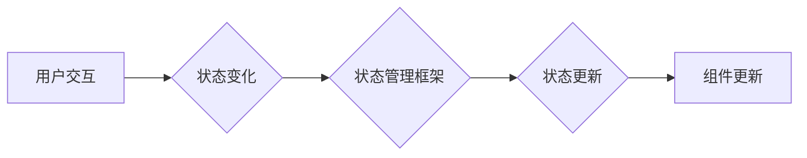
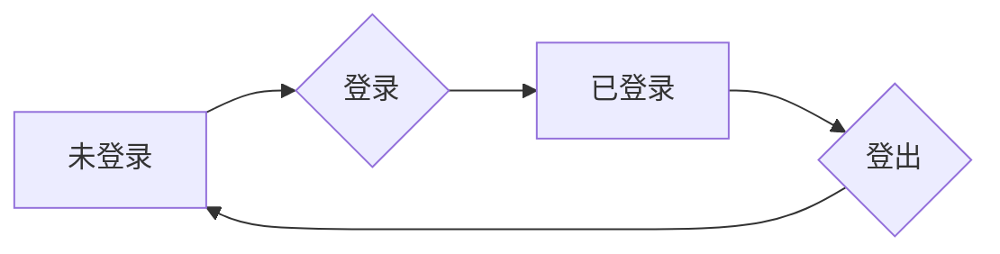
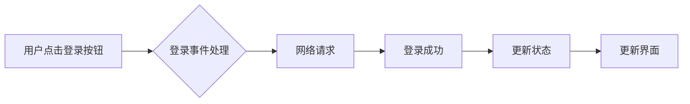

                 

## Flutter状态管理框架对比

> 关键词：Flutter, 状态管理, Provider, BLoC, Riverpod, GetX, ValueNotifier, InheritedWidget, 架构设计, 应用开发

## 1. 背景介绍

Flutter 作为 Google 推出的开源跨平台 UI 框架，凭借其快速开发、高性能和原生美观等优势，迅速在移动应用开发领域占据一席之地。然而，随着应用规模的不断扩大，状态管理问题逐渐成为开发人员面临的挑战。

状态管理是指在应用程序中如何有效地存储、更新和传递数据。在 Flutter 应用中，状态管理的正确设计至关重要，它直接影响到应用的性能、可维护性和可扩展性。

## 2. 核心概念与联系

Flutter 应用的状态管理主要围绕以下核心概念展开：

* **状态:** 应用中的数据变化，例如用户输入、网络请求结果、UI 元素的显示状态等。
* **状态变化:** 状态的更新，由事件触发，例如用户点击按钮、网络请求成功等。
* **状态更新机制:**  用于处理状态变化的机制，例如 Provider 的 `notifyListeners`、BLoC 的 `Sink` 和 `Stream` 等。
* **状态订阅:**  组件订阅状态变化，并根据状态更新自身的行为。

状态管理框架提供了一套规范和工具，帮助开发者更有效地管理应用状态。

**状态管理框架架构**



## 3. 核心算法原理 & 具体操作步骤

### 3.1  算法原理概述

Flutter 状态管理框架的核心算法原理是基于 **观察者模式** 和 **事件驱动** 的设计。

* **观察者模式:** 状态管理框架将状态作为中心，组件作为观察者，当状态发生变化时，框架会通知所有订阅该状态的组件进行更新。
* **事件驱动:** 状态变化由事件触发，例如用户点击按钮、网络请求成功等。框架会将事件传递给状态管理层，并根据事件更新状态。

### 3.2  算法步骤详解

1. **定义状态:**  开发者需要定义应用中的状态数据结构，例如用户登录信息、商品列表等。
2. **创建状态管理实例:**  根据选择的框架，创建状态管理实例，例如 Provider 的 `ChangeNotifier`、BLoC 的 `Bloc` 等。
3. **订阅状态:**  组件通过订阅状态管理实例，获取状态变化的通知。
4. **处理事件:**  当事件发生时，组件会将其传递给状态管理实例。
5. **更新状态:**  状态管理实例根据事件更新状态数据。
6. **通知订阅者:**  状态管理实例通知所有订阅该状态的组件进行更新。
7. **组件更新:**  组件根据更新后的状态数据，重新渲染自身界面。

### 3.3  算法优缺点

* **优点:**
    * **可维护性:** 将状态管理逻辑集中化，提高代码可读性和可维护性。
    * **可测试性:** 状态管理框架提供测试工具，方便开发者测试状态管理逻辑。
    * **可扩展性:** 状态管理框架支持多组件订阅同一个状态，方便应用扩展。
* **缺点:**
    * **学习成本:**  学习新的状态管理框架需要一定的时间和精力。
    * **性能影响:**  状态变化频繁会导致性能下降，需要合理设计状态更新机制。

### 3.4  算法应用领域

状态管理框架广泛应用于各种 Flutter 应用，例如：

* **电商应用:** 管理商品列表、购物车、订单信息等状态。
* **社交应用:** 管理用户资料、消息列表、聊天记录等状态。
* **新闻应用:** 管理新闻列表、文章内容、用户收藏等状态。

## 4. 数学模型和公式 & 详细讲解 & 举例说明

状态管理框架的数学模型主要基于 **状态转移图** 和 **事件处理树** 的概念。

### 4.1  数学模型构建

* **状态转移图:**  描述状态之间的转换关系，每个状态节点代表一个状态，边表示状态之间的转换。
* **事件处理树:**  描述事件处理的层次结构，每个节点代表一个事件处理器，边表示事件的传递路径。

### 4.2  公式推导过程

状态管理框架的算法流程可以用以下公式描述：

```
状态 = 状态初始值
事件 = 事件触发条件
状态更新函数 = 状态更新逻辑
```

当事件满足触发条件时，调用状态更新函数更新状态值。

### 4.3  案例分析与讲解

例如，一个简单的用户登录应用，状态包括用户登录状态 (`isLoggedIn`) 和用户资料 (`userInfo`)。

* **状态转移图:**



* **事件处理树:**



当用户点击登录按钮时，触发登录事件，登录事件处理函数会发送网络请求，请求成功后更新状态，并更新界面。

## 5. 项目实践：代码实例和详细解释说明

### 5.1  开发环境搭建

* 安装 Flutter SDK
* 安装 Android Studio 或 VS Code
* 创建新的 Flutter 项目

### 5.2  源代码详细实现

以下代码示例使用 Provider 状态管理框架实现一个简单的计数器应用。

```dart
import 'package:flutter/material.dart';
import 'package:provider/provider.dart';

class CounterProvider extends ChangeNotifier {
  int _count = 0;

  int get count => _count;

  void increment() {
    _count++;
    notifyListeners();
  }
}

class CounterApp extends StatelessWidget {
  @override
  Widget build(BuildContext context) {
    return ChangeNotifierProvider(
      create: (context) => CounterProvider(),
      child: MaterialApp(
        home: CounterPage(),
      ),
    );
  }
}

class CounterPage extends StatelessWidget {
  @override
  Widget build(BuildContext context) {
    return Scaffold(
      appBar: AppBar(
        title: Text('Counter App'),
      ),
      body: Center(
        child: Column(
          mainAxisAlignment: MainAxisAlignment.center,
          children: <Widget>[
            Text(
              'Count: ${context.watch<CounterProvider>().count}',
              style: TextStyle(fontSize: 32),
            ),
            SizedBox(height: 20),
            ElevatedButton(
              onPressed: () {
                context.read<CounterProvider>().increment();
              },
              child: Text('Increment'),
            ),
          ],
        ),
      ),
    );
  }
}
```

### 5.3  代码解读与分析

* `CounterProvider` 类继承自 `ChangeNotifier`，实现状态管理逻辑。
* `count` 属性存储计数器值，`increment` 方法用于增加计数器值。
* `ChangeNotifierProvider` 将 `CounterProvider` 实例提供给子组件。
* `CounterPage` 组件使用 `context.watch` 获取 `CounterProvider` 实例，并显示计数器值。
* `context.read` 用于获取 `CounterProvider` 实例并调用 `increment` 方法。

### 5.4  运行结果展示

运行代码后，用户将看到一个计数器应用，点击“Increment”按钮，计数器值会增加 1。

## 6. 实际应用场景

### 6.1  电商应用

* 管理商品列表、购物车、订单信息等状态。
* 使用状态管理框架可以实现商品列表的实时更新、购物车数据的同步、订单状态的跟踪等功能。

### 6.2  社交应用

* 管理用户资料、消息列表、聊天记录等状态。
* 使用状态管理框架可以实现用户资料的更新、消息列表的实时同步、聊天记录的持久化存储等功能。

### 6.3  新闻应用

* 管理新闻列表、文章内容、用户收藏等状态。
* 使用状态管理框架可以实现新闻列表的实时更新、文章内容的缓存、用户收藏的管理等功能。

### 6.4  未来应用展望

随着 Flutter 应用的不断发展，状态管理框架将扮演越来越重要的角色。未来，状态管理框架将更加智能化、自动化，能够更好地帮助开发者构建复杂、高性能的 Flutter 应用。

## 7. 工具和资源推荐

### 7.1  学习资源推荐

* Flutter 官方文档: https://docs.flutter.dev/
* Provider 官方文档: https://pub.dev/packages/provider
* BLoC 官方文档: https://pub.dev/packages/bloc
* Riverpod 官方文档: https://pub.dev/packages/riverpod
* GetX 官方文档: https://pub.dev/packages/get

### 7.2  开发工具推荐

* Android Studio: https://developer.android.com/studio
* VS Code: https://code.visualstudio.com/

### 7.3  相关论文推荐

* [Flutter: A Framework for Building Native Mobile Apps](https://www.researchgate.net/publication/338047708_Flutter_A_Framework_for_Building_Native_Mobile_Apps)
* [State Management in Flutter](https://medium.com/flutter-community/state-management-in-flutter-a-comprehensive-guide-d9862890295e)

## 8. 总结：未来发展趋势与挑战

### 8.1  研究成果总结

Flutter 状态管理框架的发展经历了从简单的 `InheritedWidget` 到更复杂的 Provider、BLoC、Riverpod、GetX 等阶段。这些框架提供了不同的解决方案，帮助开发者更好地管理应用状态。

### 8.2  未来发展趋势

* **更智能化的状态管理:**  未来状态管理框架将更加智能化，能够自动识别状态变化，并提供更优化的状态更新机制。
* **更强大的状态共享机制:**  未来状态管理框架将提供更强大的状态共享机制，方便开发者在不同组件之间共享状态数据。
* **更易于使用的开发体验:**  未来状态管理框架将更加易于使用，提供更直观的 API 和更友好的开发体验。

### 8.3  面临的挑战

* **状态管理复杂度:**  随着应用规模的扩大，状态管理的复杂度也会随之增加，需要开发者不断学习和探索新的解决方案。
* **性能优化:**  频繁的状态更新会导致性能下降，需要开发者合理设计状态更新机制，并进行性能优化。
* **生态系统建设:**  Flutter 状态管理框架的生态系统还需要进一步完善，需要更多的开发者参与到框架的开发和维护中。

### 8.4  研究展望

未来，我们将继续关注 Flutter 状态管理框架的发展，并探索更智能、更高效、更易于使用的状态管理解决方案。


## 9. 附录：常见问题与解答

### 9.1  问题：如何选择合适的 Flutter 状态管理框架？

**答案：** 选择合适的 Flutter 状态管理框架取决于应用的规模、复杂度和开发团队的经验。

* **小型应用:**  可以使用简单的 `InheritedWidget` 或 `Provider` 框架。
* **中等规模应用:**  可以使用 `BLoC` 或 `Riverpod` 框架。
* **大型复杂应用:**  可以使用 `GetX` 或自定义的框架。

### 9.2  问题：如何避免状态管理带来的性能问题？

**答案：** 

* **合理设计状态更新机制:**  避免不必要的状态更新，只更新需要更新的部分。
* **使用缓存机制:**  缓存经常访问的状态数据，减少网络请求和数据处理。
* **使用异步操作:**  将状态更新操作异步化，避免阻塞主线程。

### 9.3  问题：如何测试 Flutter 状态管理逻辑？

**答案：** 

* 使用单元测试框架，例如 `test` 或 `mockito`，测试状态管理逻辑的各个部分。
* 使用集成测试框架，例如 `flutter_test`，测试状态管理逻辑与其他组件的交互。


作者：禅与计算机程序设计艺术 / Zen and the Art of Computer Programming 
<end_of_turn>

