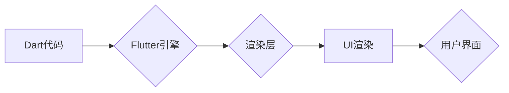

                 

## Flutter：谷歌的移动 UI 框架

> 关键词：Flutter,移动开发,跨平台,Dart,UI框架,谷歌

## 1. 背景介绍

移动互联网的蓬勃发展催生了对高效、便捷的移动应用开发的需求。传统的方式通常需要分别开发iOS和Android平台的应用，这不仅耗时费力，而且维护成本高昂。为了解决这一痛点，谷歌于2017年推出了Flutter，一个开源的跨平台移动 UI 框架。Flutter凭借其独特的渲染引擎、丰富的组件库和简洁的开发体验，迅速成为移动开发领域的热门选择。

### 1.1  移动开发现状与挑战

传统的移动开发模式主要依赖于原生开发，即使用平台特定的语言和工具开发应用程序。例如，iOS应用使用Swift或Objective-C语言，Android应用使用Java或Kotlin语言。这种模式虽然可以充分利用平台特性，但存在以下问题：

* **开发成本高:** 需要分别开发不同平台的应用，需要投入大量人力和时间。
* **维护成本高:** 当需要更新应用功能或修复bug时，需要分别修改不同平台的代码，增加了维护难度和成本。
* **开发效率低:** 不同平台的开发工具和语法差异较大，开发人员需要学习和掌握多种技术，降低了开发效率。

### 1.2  Flutter的出现与优势

Flutter旨在解决上述问题，提供一种跨平台的移动开发解决方案。其核心优势包括：

* **跨平台开发:** 使用Dart语言编写代码，可以编译成iOS、Android、Web、桌面等多种平台的应用，实现一次开发，多平台发布。
* **高性能渲染:** Flutter采用Skia图形引擎进行渲染，可以实现高帧率、流畅的用户体验。
* **热重载:** Flutter支持热重载功能，可以实时更新代码，无需重新编译整个应用，大大提高了开发效率。
* **丰富的组件库:** Flutter提供丰富的UI组件库，可以快速构建高质量的界面。
* **简洁的开发体验:** Dart语言语法简洁易懂，Flutter的开发工具也十分友好，降低了开发门槛。

## 2. 核心概念与联系

Flutter的核心概念包括：

* **Dart语言:** Flutter应用使用Dart语言编写，Dart是一种开源、面向对象的编程语言，语法简洁易懂，运行速度快。
* **渲染引擎:** Flutter采用Skia图形引擎进行渲染，可以实现高性能、高质量的图形显示。
* **Widget:** Flutter应用的UI由Widget构建，Widget是一种可重用的UI组件，可以组合成复杂的界面。
* **状态管理:** Flutter使用状态管理机制来管理应用的状态，可以确保应用的UI与数据保持一致。

### 2.1  Flutter架构

Flutter的架构可以概括为以下几个部分：

* **引擎:** Flutter引擎负责与底层平台交互，管理资源，并执行Dart代码。
* **渲染层:** 渲染层负责将Dart代码渲染成可视化的UI，使用Skia图形引擎进行渲染。
* **框架层:** 框架层提供了一系列的API和工具，帮助开发者构建和管理Flutter应用。
* **应用层:** 应用层是开发者编写业务逻辑和UI的代码所在。

**Flutter架构流程图:**



## 3. 核心算法原理 & 具体操作步骤

Flutter的核心算法原理主要体现在其渲染引擎和状态管理机制上。

### 3.1  算法原理概述

* **渲染引擎:** Flutter使用Skia图形引擎进行渲染，Skia是一个开源的2D图形库，支持多种平台，可以实现高性能、高质量的图形显示。Flutter的渲染引擎将Dart代码转换为可执行的图形指令，并由Skia引擎执行渲染。
* **状态管理:** Flutter使用状态管理机制来管理应用的状态，确保应用的UI与数据保持一致。Flutter提供了一种名为Provider的轻量级状态管理方案，可以方便地管理应用的状态。

### 3.2  算法步骤详解

* **渲染流程:**

1. Flutter引擎将Dart代码解析并构建Widget树。
2. Widget树被遍历，每个Widget都会根据其属性和状态生成对应的渲染对象。
3. 渲染对象被传递给Skia引擎进行渲染。
4. 渲染结果被显示在用户界面上。

* **状态管理流程:**

1. 应用的状态被存储在Provider中。
2. Widget通过Provider获取状态数据。
3. 当状态数据发生变化时，Provider会通知所有依赖该状态数据的Widget进行更新。
4. Widget根据更新后的状态数据重新渲染。

### 3.3  算法优缺点

* **优点:**

* 高性能渲染
* 跨平台开发
* 热重载功能
* 简洁的开发体验

* **缺点:**

* Dart语言学习曲线
* 相对较新的框架，生态系统仍在发展

### 3.4  算法应用领域

Flutter的应用领域非常广泛，包括：

* 移动应用开发
* 桌面应用开发
* Web应用开发
* 游戏开发
* IoT应用开发

## 4. 数学模型和公式 & 详细讲解 & 举例说明

Flutter的渲染引擎和状态管理机制都涉及到一定的数学模型和公式。

### 4.1  数学模型构建

* **坐标系:** Flutter使用笛卡尔坐标系来表示UI元素的位置和大小。
* **变换矩阵:** Flutter使用变换矩阵来实现UI元素的平移、旋转、缩放等操作。
* **颜色模型:** Flutter使用RGB颜色模型来表示颜色。

### 4.2  公式推导过程

* **变换矩阵:**

一个二维变换矩阵可以表示为以下形式:

$$
\begin{bmatrix}
a & b \\
c & d
\end{bmatrix}
$$

其中，a, b, c, d是实数，表示变换矩阵的四个元素。

* **颜色混合:**

Flutter使用颜色混合算法来实现颜色渐变和透明度效果。例如，Alpha混合算法可以表示为以下公式:

$$
C_{out} = (1 - A_{2}) * C_{1} + A_{2} * C_{2}
$$

其中，$C_{out}$是混合后的颜色，$C_{1}$和$C_{2}$分别是两个颜色，$A_{1}$和$A_{2}$分别是两个颜色的透明度。

### 4.3  案例分析与讲解

* **平移操作:**

假设一个UI元素的初始位置为(x, y)，需要将其平移(dx, dy)个单位，可以使用以下变换矩阵实现:

$$
\begin{bmatrix}
1 & 0 \\
0 & 1
\end{bmatrix}
\begin{bmatrix}
x \\
y
\end{bmatrix}
=
\begin{bmatrix}
x + dx \\
y + dy
\end{bmatrix}
$$

* **颜色渐变:**

假设有两个颜色，$C_{1}$为红色，$C_{2}$为蓝色，需要实现从红色到蓝色的渐变效果，可以使用Alpha混合算法，逐渐增加$A_{2}$的值，实现颜色渐变。

## 5. 项目实践：代码实例和详细解释说明

### 5.1  开发环境搭建

* 安装Dart SDK: https://dart.dev/get-dart
* 安装Flutter SDK: https://flutter.dev/docs/get-started/install
* 安装Android Studio或VS Code等IDE

### 5.2  源代码详细实现

```dart
import 'package:flutter/material.dart';

void main() {
  runApp(MyApp());
}

class MyApp extends StatelessWidget {
  @override
  Widget build(BuildContext context) {
    return MaterialApp(
      title: 'Flutter Demo',
      theme: ThemeData(
        primarySwatch: Colors.blue,
      ),
      home: MyHomePage(title: 'Flutter Demo Home Page'),
    );
  }
}

class MyHomePage extends StatefulWidget {
  MyHomePage({Key? key, required this.title}) : super(key: key);

  final String title;

  @override
  _MyHomePageState createState() => _MyHomePageState();
}

class _MyHomePageState extends State<MyHomePage> {
  int _counter = 0;

  void _incrementCounter() {
    setState(() {
      _counter++;
    });
  }

  @override
  Widget build(BuildContext context) {
    return Scaffold(
      appBar: AppBar(
        title: Text(widget.title),
      ),
      body: Center(
        child: Column(
          mainAxisAlignment: MainAxisAlignment.center,
          children: <Widget>[
            Text(
              'You have pushed the button this many times:',
            ),
            Text(
              '$_counter',
              style: Theme.of(context).textTheme.headline4,
            ),
          ],
        ),
      ),
      floatingActionButton: FloatingActionButton(
        onPressed: _incrementCounter,
        tooltip: 'Increment',
        child: Icon(Icons.add),
      ),
    );
  }
}
```

### 5.3  代码解读与分析

* **MyApp:** 这是应用程序的主入口，使用MaterialApp创建一个Material Design风格的应用程序。
* **MyHomePage:** 这是应用程序的主页面，包含一个标题、一个计数器和一个按钮。
* **_MyHomePageState:** 这是MyHomePage的State类，负责管理页面状态。
* **_counter:** 这是一个整数变量，用于存储计数器值。
* **_incrementCounter:** 这是一个函数，用于增加计数器值。
* **setState:** 这是一个Flutter提供的函数，用于更新页面状态。
* **Scaffold:** 这是一个Material Design风格的应用程序框架，包含AppBar、body和floatingActionButton等部件。
* **AppBar:** 应用程序的标题栏。
* **Center:** 将其子Widget居中显示。
* **Column:** 将其子Widget垂直排列。
* **Text:** 显示文本内容。
* **FloatingActionButton:** 一个悬浮按钮，用于触发事件。

### 5.4  运行结果展示

运行上述代码后，会显示一个简单的Flutter应用程序，包含一个标题、一个计数器和一个按钮。点击按钮，计数器会增加1。

## 6. 实际应用场景

Flutter已经广泛应用于各种移动应用场景，例如：

* **社交媒体应用:** 比如Instagram、Pinterest等，Flutter可以实现流畅的图片和视频播放，以及丰富的用户交互体验。
* **电商应用:** 比如AliExpress、Amazon等，Flutter可以实现高效的商品展示和购物车功能，以及流畅的支付流程。
* **金融应用:** 比如银行APP、支付APP等，Flutter可以实现安全的交易操作和数据加密，以及用户友好的界面设计。
* **游戏应用:** 比如PUBG Mobile、Clash Royale等，Flutter可以实现高性能的图形渲染和游戏逻辑，以及流畅的游戏体验。

### 6.4  未来应用展望

随着Flutter的不断发展，其应用场景将会更加广泛，例如：

* **物联网应用:** Flutter可以用于开发各种物联网设备的UI，实现设备与用户的交互。
* **虚拟现实和增强现实应用:** Flutter可以用于开发VR和AR应用，实现沉浸式的用户体验。
* **桌面应用:** Flutter可以用于开发跨平台的桌面应用，实现统一的用户体验。

## 7. 工具和资源推荐

### 7.1  学习资源推荐

* **Flutter官方文档:** https://docs.flutter.dev/
* **Flutter中文社区:** https://flutterchina.club/
* **Flutter入门教程:** https://flutter.dev/docs/get-started/codelab

### 7.2  开发工具推荐

* **Android Studio:** https://developer.android.com/studio
* **VS Code:** https://code.visualstudio.com/

### 7.3  相关论文推荐

* **Flutter: A Framework for Building Natively Compiled Applications for Mobile, Web, and Desktop:** https://arxiv.org/abs/1803.08093

## 8. 总结：未来发展趋势与挑战

### 8.1  研究成果总结

Flutter作为一种跨平台移动开发框架，在性能、开发体验和应用场景等方面取得了显著的成果。其高性能渲染引擎、丰富的组件库和简洁的开发体验，吸引了越来越多的开发者和企业采用。

### 8.2  未来发展趋势

* **性能优化:** Flutter团队将继续致力于提升Flutter的性能，使其能够支持更加复杂的应用场景。
* **生态系统完善:** Flutter的生态系统将会不断完善，提供更多第三方库和工具，方便开发者开发和维护应用。
* **跨平台支持:** Flutter将支持更多平台，例如Web、桌面、嵌入式等，实现真正的跨平台开发。

### 8.3  面临的挑战

* **Dart语言学习曲线:** Dart语言相对较新的，对于一些开发者来说，需要一定的学习成本。
* **第三方库生态:** Flutter的第三方库生态虽然在不断发展，但与其他成熟框架相比，仍然相对较少。
* **平台差异:** 尽管Flutter致力于跨平台开发，但不同平台的特性和限制仍然存在，需要开发者进行相应的适配。

### 8.4  研究展望

未来，Flutter将继续朝着更强大、更易用、更跨平台的方向发展。随着Flutter技术的不断成熟，其在移动开发领域的应用将会更加广泛，为开发者和用户带来更优质的应用体验。

## 9. 附录：常见问题与解答

* **Q: Flutter的性能如何？**

A: Flutter的性能非常出色，其使用Skia图形引擎进行渲染，可以实现高帧率、流畅的用户体验。

* **Q: Flutter的学习难度如何？**

A: Flutter的学习难度适中，Dart语言语法简洁易懂，Flutter的开发工具也十分友好。

* **Q: Flutter的应用场景有哪些？**

A: Flutter可以用于开发各种类型的移动应用，例如社交媒体应用、电商应用、金融应用、游戏应用等。


作者：禅与计算机程序设计艺术 / Zen and the Art of Computer Programming<end_of_turn>

