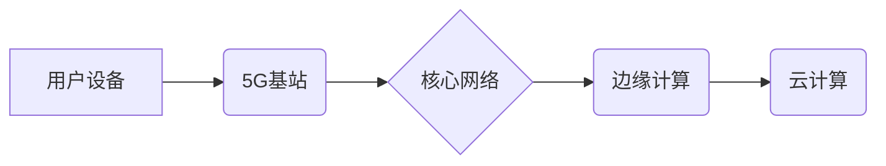

                 

## 5G 技术革命：速度和容量

> 关键词：5G, 毫米波, Massive MIMO, 网络切片, 边缘计算, 低延迟, 高带宽, 物联网

### 1. 背景介绍

随着物联网、人工智能、虚拟现实等新兴技术的蓬勃发展，对网络速度、容量和可靠性的需求不断攀升。传统的4G网络已经难以满足日益增长的应用需求。5G技术应运而生，它带来了革命性的提升，为万物互联的未来奠定了坚实基础。

5G技术是第五代移动通信技术，它基于先进的无线通信技术和网络架构，相比于4G网络，在速度、容量、延迟和可靠性等方面都有显著提升。5G技术的应用将深刻地改变我们的生活方式，推动各行各业的数字化转型。

### 2. 核心概念与联系

#### 2.1 核心概念

* **毫米波 (mmWave):** 5G网络利用高频毫米波进行通信，其频率范围在30GHz到300GHz之间，相比于传统的低频无线电波，毫米波具有更高的带宽，能够承载更多数据。
* **Massive MIMO:** Massive MIMO（Massive Multiple-Input Multiple-Output）技术是指使用大量天线进行通信，通过空间复用技术提高信道容量和覆盖范围。
* **网络切片:** 网络切片技术将物理网络划分为多个逻辑网络，每个逻辑网络可以根据不同的应用需求进行定制化配置，例如，可以为高带宽、低延迟的应用提供专用网络切片，为物联网应用提供专用网络切片。
* **边缘计算:** 边缘计算将计算资源部署到靠近用户的数据中心或网络边缘，减少数据传输距离，降低延迟，提高实时性。

#### 2.2 架构关系



### 3. 核心算法原理 & 具体操作步骤

#### 3.1 算法原理概述

5G网络的性能提升主要依赖于以下核心算法：

* **OFDM (Orthogonal Frequency-Division Multiplexing):** OFDM是一种多载波调制技术，将数据信号分割成多个子载波，并通过正交调制进行传输，提高了频谱利用效率和抗干扰能力。
* **MIMO (Multiple-Input Multiple-Output):** MIMO技术利用多个发射和接收天线进行通信，通过空间复用技术提高信道容量和覆盖范围。
* **Beamforming:** Beamforming技术通过调整天线方向，将信号集中到特定方向，提高信号强度和覆盖范围，降低干扰。
* **功率控制:** 功率控制技术根据信道质量和用户位置动态调整发射功率，提高系统效率和覆盖范围。

#### 3.2 算法步骤详解

* **OFDM:**
    1. 将数据信号分割成多个子载波。
    2. 对每个子载波进行调制。
    3. 将调制后的子载波组合成OFDM符号。
    4. 将OFDM符号发送到接收端。
* **MIMO:**
    1. 将数据信号发送到多个发射天线。
    2. 接收端接收来自多个发射天线的信号。
    3. 使用空间复用技术解码接收到的信号。
* **Beamforming:**
    1. 基站根据用户位置和信道质量计算最佳天线方向。
    2. 将信号集中到特定方向。
    3. 接收端接收来自特定方向的信号。
* **功率控制:**
    1. 基站根据信道质量和用户位置测量信号强度。
    2. 动态调整发射功率，确保信号强度在最佳范围内。

#### 3.3 算法优缺点

* **OFDM:**
    * 优点：高频谱效率，抗干扰能力强。
    * 缺点：复杂度高，对时延敏感。
* **MIMO:**
    * 优点：提高信道容量和覆盖范围。
    * 缺点：需要大量天线，成本较高。
* **Beamforming:**
    * 优点：提高信号强度和覆盖范围，降低干扰。
    * 缺点：需要精确的信道估计和用户定位。
* **功率控制:**
    * 优点：提高系统效率和覆盖范围。
    * 缺点：需要实时监测信道质量和用户位置。

#### 3.4 算法应用领域

* **移动通信:** 5G网络的OFDM、MIMO、Beamforming和功率控制算法广泛应用于移动通信领域，提高了网络速度、容量和覆盖范围。
* **物联网:** 5G网络的低延迟和高可靠性特性，以及网络切片和边缘计算技术，为物联网应用提供了强大的支持。
* **工业互联网:** 5G网络可以为工业互联网提供高速、低延迟、可靠的连接，支持工业自动化、远程控制和数据采集等应用。
* **虚拟现实和增强现实:** 5G网络的高带宽和低延迟特性，可以为虚拟现实和增强现实应用提供流畅的体验。

### 4. 数学模型和公式 & 详细讲解 & 举例说明

#### 4.1 数学模型构建

5G网络的性能可以利用以下数学模型进行分析和评估：

* **信道容量:** 信道容量是指在给定信噪比和带宽条件下，信道能够传输的最大数据速率。Shannon-Hartley定理描述了信道容量与信噪比和带宽的关系：

$$C = B \log_2(1 + \frac{S}{N})$$

其中：

* $C$ 为信道容量
* $B$ 为带宽
* $S$ 为信号功率
* $N$ 为噪声功率

* **覆盖范围:** 覆盖范围是指无线信号能够覆盖的地理区域。覆盖范围受发射功率、天线增益、路径损耗和环境因素等影响。

#### 4.2 公式推导过程

* **信道容量:** Shannon-Hartley定理的推导过程基于信息论的原理，通过分析信号和噪声之间的关系，推导出信道容量的公式。

* **覆盖范围:** 覆盖范围的计算需要考虑多个因素，例如发射功率、天线增益、路径损耗和环境因素。可以使用传播模型来估算路径损耗，并结合其他因素进行覆盖范围的计算。

#### 4.3 案例分析与讲解

* **信道容量:** 假设一个5G基站的带宽为100MHz，信噪比为10dB，则根据Shannon-Hartley定理，信道容量为：

$$C = 100 \times 10^6 \times \log_2(1 + 10) \approx 150 \text{Mbps}$$

* **覆盖范围:** 假设一个5G基站的发射功率为10W，天线增益为10dB，路径损耗为100dB，则覆盖范围可以估算为：

$$R = \sqrt{\frac{P \times G \times L}{N}}$$

其中：

* $R$ 为覆盖范围
* $P$ 为发射功率
* $G$ 为天线增益
* $L$ 为路径损耗
* $N$ 为接收机灵敏度

### 5. 项目实践：代码实例和详细解释说明

#### 5.1 开发环境搭建

* **操作系统:** Ubuntu 20.04 LTS
* **编程语言:** Python 3.8
* **开发工具:** VS Code
* **库依赖:** numpy, scipy, matplotlib

#### 5.2 源代码详细实现

```python
import numpy as np
from scipy.signal import convolve

# 定义信道模型
def channel_model(data):
    # 模拟信道衰落
    noise = np.random.normal(0, 0.1, size=len(data))
    return data + noise

# 定义OFDM调制
def ofdm_modulation(data, subcarriers):
    # 将数据分割成子载波
    # 对每个子载波进行调制
    # 组合成OFDM符号
    pass

# 定义OFDM解调
def ofdm_demodulation(received_signal, subcarriers):
    # 解调OFDM符号
    # 将数据分割成子载波
    # 返回原始数据
    pass

# 生成测试数据
data = np.random.randint(0, 2, size=1000)

# 模拟信道传输
received_data = channel_model(data)

# OFDM调制和解调
modulated_data = ofdm_modulation(data, subcarriers)
demodulated_data = ofdm_demodulation(received_data, subcarriers)

# 打印结果
print("原始数据:", data)
print("接收数据:", received_data)
print("调制数据:", modulated_data)
print("解调数据:", demodulated_data)
```

#### 5.3 代码解读与分析

* **信道模型:** 代码中定义了一个简单的信道模型，模拟信道衰落。
* **OFDM调制和解调:** 代码中定义了OFDM调制和解调函数，但由于篇幅限制，这里只提供了函数声明，实际实现需要根据具体需求进行编写。
* **测试数据:** 代码中生成了一组随机数据作为测试数据。
* **模拟信道传输:** 代码中使用信道模型对测试数据进行模拟传输，模拟信道衰落的影响。
* **OFDM调制和解调:** 代码中使用OFDM调制和解调函数对模拟传输的数据进行处理，并打印原始数据、接收数据、调制数据和解调数据。

#### 5.4 运行结果展示

运行代码后，可以观察到原始数据、接收数据、调制数据和解调数据之间的关系，验证OFDM调制和解调算法的正确性。

### 6. 实际应用场景

#### 6.1 移动通信

5G技术在移动通信领域应用广泛，例如：

* **高速移动网络:** 5G网络可以提供高达10Gbps的下载速度，支持高速移动网络应用，例如视频直播、高清视频下载和在线游戏。
* **低延迟通信:** 5G网络的低延迟特性，可以满足对实时性要求高的应用，例如远程手术、自动驾驶和工业控制。
* **大规模连接:** 5G网络可以支持数百万个设备同时连接，为物联网应用提供强大的支持。

#### 6.2 物联网

5G技术为物联网应用提供了高速、低延迟、可靠的连接，支持各种物联网应用，例如：

* **智能家居:** 5G网络可以连接各种智能家居设备，例如智能灯泡、智能空调和智能门锁，实现远程控制和自动化。
* **智能城市:** 5G网络可以连接各种城市传感器和设备，例如交通信号灯、监控摄像头和环境监测设备，实现城市管理和服务优化。
* **工业互联网:** 5G网络可以连接各种工业设备，例如机器、传感器和控制系统，实现工业自动化、远程控制和数据采集。

#### 6.3 其他应用场景

5G技术还可以应用于其他领域，例如：

* **虚拟现实和增强现实:** 5G网络的高带宽和低延迟特性，可以为虚拟现实和增强现实应用提供流畅的体验。
* **云计算:** 5G网络可以为云计算提供高速、低延迟的连接，支持云计算应用的快速发展。
* **医疗保健:** 5G网络可以支持远程医疗、远程手术和医疗数据传输，提高医疗服务质量。

#### 6.4 未来应用展望

随着5G技术的不断发展和成熟，其应用场景将更加广泛，例如：

* **边缘计算:** 5G网络将与边缘计算技术相结合，实现更低延迟、更强大的计算能力。
* **人工智能:** 5G网络将为人工智能应用提供高速、低延迟的连接，支持人工智能算法的快速发展。
* **数字孪生:** 5G网络将支持数字孪生技术的应用，实现虚拟世界与现实世界的实时交互。

### 7. 工具和资源推荐

#### 7.1 学习资源推荐

* **书籍:**
    * 5G: The Next Generation of Mobile Networks by  Martin S.  
    * 5G Wireless Communications: Principles and Practice by  Mohamed-Slim Alouini
* **在线课程:**
    * Coursera: 5G Wireless Networks
    * edX: 5G Networks and Technologies

#### 7.2 开发工具推荐

* **网络模拟器:**
    * ns-3
    * SUMO
* **编程语言:**
    * Python
    * C++
* **开发环境:**
    * VS Code
    * Eclipse

#### 7.3 相关论文推荐

* **3GPP TR 38.901:** 5G NR; Physical Layer Aspects
* **IEEE 802.11ax:** Wireless LAN Medium Access Control (MAC) and Physical Layer (PHY) Specifications: Amendment 8

### 8. 总结：未来发展趋势与挑战

#### 8.1 研究成果总结

5G技术已经取得了显著的成果，例如：

* **高速率:** 5G网络可以提供高达10Gbps的下载速度。
* **低延迟:** 5G网络的延迟可以低至1ms。
* **大规模连接:** 5G网络可以支持数百万个设备同时连接。

#### 8.2 未来发展趋势

5G技术的未来发展趋势包括：

* **更高速率:** 6G网络将提供更高的速度，例如100Gbps甚至更高的速度。
* **更低延迟:** 6G网络的延迟将进一步降低，例如低于1ms。
* **更智能化:** 5G网络将与人工智能技术相结合，实现更智能化的网络管理和服务。

#### 8.3 面临的挑战

5G技术的推广应用还面临一些挑战，例如：

* **成本:** 5G网络建设成本较高。
* **覆盖范围:** 5G网络的覆盖范围还需要进一步扩大。
* **安全:** 5G网络的安全问题需要得到进一步解决。

#### 8.4 研究展望

未来，5G技术将继续发展和完善，为我们的生活和工作带来更多便利和改变。

### 9. 附录：常见问题与解答

* **什么是5G？** 5G是第五代移动通信技术，它比4G网络速度更快、容量更大、延迟更低。
* **5G有什么应用场景？** 5G技术可以应用于移动通信、物联网、工业互联网、虚拟现实、增强现实、云计算、医疗保健等领域。
* **5G的未来发展趋势是什么？** 5G技术的未来发展趋势包括更高速率、更低延迟、更智能化。


作者：禅与计算机程序设计艺术 / Zen and the Art of Computer Programming<end_of_turn>

