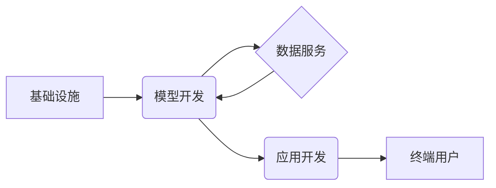

                 

## LLM产业链生态:从无到有的蝶变

> 关键词：LLM, 产业链, 生态系统, 深度学习, 自然语言处理, 模型训练, 数据标注, 应用开发, 伦理问题

### 1. 背景介绍

近年来，大语言模型（LLM）的蓬勃发展，彻底改变了人工智能领域的面貌。从文本生成、翻译到对话系统、代码编写，LLM展现出强大的能力，并逐渐渗透到各个行业，催生了一系列新的应用场景和商业模式。

LLM的快速发展离不开以下几个关键因素：

* **算力飞速提升:**  近年来，GPU算力的飞速发展为训练庞大规模的LLM模型提供了硬件基础。
* **算法创新:** Transformer架构的提出，以及其衍生出的各种改进算法，例如BERT、GPT、T5等，极大地提升了LLM的性能。
* **海量数据:**  互联网时代的到来，为LLM训练提供了海量文本数据，这些数据是模型学习和训练的基础。

然而，LLM的产业化发展还面临着诸多挑战：

* **训练成本高昂:**  训练大型LLM模型需要消耗大量的算力和时间，成本非常高昂。
* **数据安全和隐私问题:**  LLM模型的训练需要大量数据，如何保证数据安全和隐私是一个重要问题。
* **模型可解释性和信任问题:**  LLM模型的决策过程往往是复杂的，难以解释，这导致模型的可信度和可解释性问题。

### 2. 核心概念与联系

LLM产业链生态是一个复杂而动态的系统，涉及多个环节和参与者。

**2.1 核心概念**

* **大语言模型 (LLM):**  一种能够理解和生成人类语言的深度学习模型，通常拥有数十亿甚至数千亿的参数。
* **模型训练:**  利用大量数据训练LLM模型，使其能够学习语言的规律和模式。
* **数据标注:**  为LLM模型训练提供高质量的标注数据，例如文本分类、情感分析等。
* **应用开发:**  将训练好的LLM模型应用于实际场景，例如聊天机器人、文本摘要、机器翻译等。

**2.2 产业链关系**

LLM产业链生态可以分为以下几个主要环节：

* **基础设施:**  提供计算资源、存储空间和网络服务，例如云计算平台、GPU厂商等。
* **模型开发:**  研发和训练LLM模型，例如OpenAI、Google DeepMind等。
* **数据服务:**  提供高质量的训练数据和数据标注服务，例如Scale AI、Lionbridge等。
* **应用开发:**  开发基于LLM的应用软件，例如ChatGPT、Jasper等。
* **终端用户:**  使用LLM驱动的应用软件，例如企业、个人用户等。

**2.3 产业链生态图**



### 3. 核心算法原理 & 具体操作步骤

**3.1 算法原理概述**

LLM的核心算法是基于Transformer架构的深度神经网络。Transformer架构的特点是利用注意力机制，能够有效地捕捉文本序列中的长距离依赖关系。

**3.2 算法步骤详解**

1. **词嵌入:** 将文本中的每个词转换为向量表示，例如Word2Vec、GloVe等词嵌入模型。
2. **编码器:**  利用多层Transformer编码器，将输入的文本序列编码成上下文表示。
3. **解码器:**  利用多层Transformer解码器，根据编码后的上下文表示生成目标文本序列。
4. **损失函数:**  使用交叉熵损失函数，计算模型预测结果与真实结果之间的差异。
5. **反向传播:**  利用梯度下降算法，更新模型参数，降低损失函数值。

**3.3 算法优缺点**

* **优点:**  能够捕捉长距离依赖关系，性能优于传统的RNN模型。
* **缺点:**  训练成本高昂，参数量大，需要大量的计算资源和数据。

**3.4 算法应用领域**

* 文本生成
* 机器翻译
* 文本摘要
* 情感分析
* 代码生成

### 4. 数学模型和公式 & 详细讲解 & 举例说明

**4.1 数学模型构建**

LLM模型的数学模型可以概括为一个概率模型，其目标是最大化模型输出的文本序列的似然概率。

**4.2 公式推导过程**

假设输入文本序列为 $x = (x_1, x_2, ..., x_T)$，输出文本序列为 $y = (y_1, y_2, ..., y_S)$，则模型的目标函数为：

$$
P(y|x) = \prod_{i=1}^{S} P(y_i|y_{1:i-1}, x)
$$

其中，$P(y_i|y_{1:i-1}, x)$ 表示在给定前 $i-1$ 个输出词和输入文本序列 $x$ 的条件下，第 $i$ 个输出词的概率。

**4.3 案例分析与讲解**

例如，在机器翻译任务中，输入文本序列为英文句子，输出文本序列为对应的中文句子。模型的目标是学习一个映射关系，将英文句子映射到对应的中文句子。

**4.4 公式应用**

在实际训练过程中，模型会使用最大似然估计方法，通过优化目标函数来学习模型参数。

### 5. 项目实践：代码实例和详细解释说明

**5.1 开发环境搭建**

* Python 3.7+
* PyTorch 或 TensorFlow
* CUDA 和 cuDNN

**5.2 源代码详细实现**

```python
import torch
import torch.nn as nn

class Transformer(nn.Module):
    def __init__(self, vocab_size, embedding_dim, num_heads, num_layers):
        super(Transformer, self).__init__()
        self.embedding = nn.Embedding(vocab_size, embedding_dim)
        self.transformer_layers = nn.ModuleList([
            nn.TransformerEncoderLayer(embedding_dim, num_heads)
            for _ in range(num_layers)
        ])

    def forward(self, x):
        x = self.embedding(x)
        for layer in self.transformer_layers:
            x = layer(x)
        return x
```

**5.3 代码解读与分析**

* `Transformer` 类定义了Transformer模型的结构。
* `embedding` 层将词向量化。
* `transformer_layers` 是一个列表，包含多个Transformer编码器层。
* `forward` 方法定义了模型的输入和输出。

**5.4 运行结果展示**

训练好的模型可以用于文本生成、机器翻译等任务。

### 6. 实际应用场景

**6.1 文本生成**

* 自动生成新闻报道、小说、诗歌等。
* 创建聊天机器人、虚拟助手等。

**6.2 机器翻译**

* 将文本从一种语言翻译成另一种语言。
* 提高跨语言沟通效率。

**6.3 文本摘要**

* 自动生成文本的摘要。
* 帮助用户快速了解文本内容。

**6.4 代码生成**

* 根据自然语言描述自动生成代码。
* 提高软件开发效率。

**6.5 未来应用展望**

* 个性化教育
* 医疗诊断
* 法律服务
* 科学研究

### 7. 工具和资源推荐

**7.1 学习资源推荐**

* **书籍:**
    * 《深度学习》
    * 《自然语言处理》
* **在线课程:**
    * Coursera: 自然语言处理
    * Udacity: 深度学习

**7.2 开发工具推荐**

* **框架:**
    * PyTorch
    * TensorFlow
* **库:**
    * Hugging Face Transformers
    * Gensim

**7.3 相关论文推荐**

* 《Attention Is All You Need》
* 《BERT: Pre-training of Deep Bidirectional Transformers for Language Understanding》

### 8. 总结：未来发展趋势与挑战

**8.1 研究成果总结**

LLM技术取得了显著进展，在文本生成、机器翻译等领域展现出强大的能力。

**8.2 未来发展趋势**

* 模型规模进一步扩大
* 算法效率提升
* 应用场景更加广泛

**8.3 面临的挑战**

* 训练成本高昂
* 数据安全和隐私问题
* 模型可解释性和信任问题

**8.4 研究展望**

* 研究更有效的训练方法
* 开发更安全、更可靠的LLM模型
* 探索LLM在更多领域的应用

### 9. 附录：常见问题与解答

* **Q: 如何训练一个LLM模型？**

* **A:** 训练LLM模型需要大量的计算资源、数据和专业知识。可以使用开源框架，例如PyTorch或TensorFlow，并参考相关论文和教程。

* **Q: 如何评估LLM模型的性能？**

* **A:** 可以使用BLEU、ROUGE等指标评估LLM模型在机器翻译、文本摘要等任务上的性能。

* **Q: LLM模型存在哪些伦理问题？**

* **A:** LLM模型可能存在偏见、歧视、生成虚假信息等伦理问题，需要引起重视并采取相应的措施。


作者：禅与计算机程序设计艺术 / Zen and the Art of Computer Programming 
<end_of_turn>

