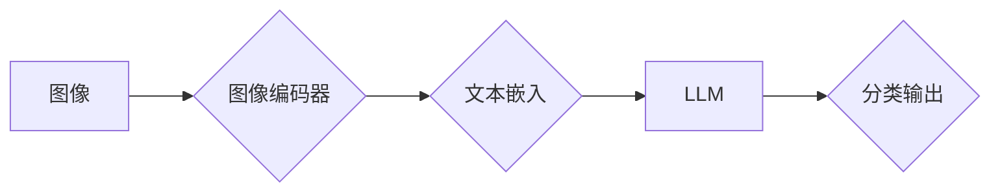

                 

## LLM在图像分类任务中的技术进展

> 关键词：大型语言模型 (LLM)、图像分类、视觉理解、多模态学习、迁移学习、计算机视觉

## 1. 背景介绍

图像分类作为计算机视觉领域的基础任务，在自动驾驶、医疗诊断、人脸识别等众多领域有着广泛的应用。传统图像分类方法主要依赖于手工提取的特征和深度卷积神经网络 (CNN)，但这些方法在面对复杂场景和细粒度分类时仍然存在一定的局限性。近年来，大型语言模型 (LLM) 的快速发展为图像分类任务带来了新的机遇。

LLM 凭借其强大的文本理解和生成能力，能够从图像中提取丰富的语义信息，并将其用于分类任务。与传统的 CNN 不同，LLM 不需要依赖手工设计的特征提取模块，能够自动学习图像的语义表示，从而提升分类性能。

## 2. 核心概念与联系

### 2.1  LLM 与 图像分类

LLM 通常通过训练海量文本数据来学习语言的结构和语义关系。而图像分类任务则需要将图像映射到相应的类别标签。

将 LLM 应用于图像分类的关键在于将图像信息转化为文本形式，以便 LLM 可以理解和处理。

### 2.2  多模态学习

多模态学习旨在训练模型能够理解和处理多种类型的输入数据，例如文本、图像、音频等。

LLM 在图像分类任务中的应用本质上是一种多模态学习的范式，它将图像和文本作为两种不同的模态，并学习它们之间的关系。

### 2.3  迁移学习

迁移学习是指利用预训练模型在新的任务上的学习。

LLM 通常是通过在海量文本数据上进行预训练，然后将其应用于其他任务，例如图像分类。

**核心概念与架构流程图**



## 3. 核心算法原理 & 具体操作步骤

### 3.1  算法原理概述

LLM 在图像分类任务中的核心算法原理是将图像转换为文本表示，然后利用预训练的 LLM 进行分类。

具体来说，该算法通常包括以下步骤：

1. **图像编码:** 将图像转换为文本表示，例如使用 Vision Transformer (ViT) 等模型提取图像特征。
2. **文本嵌入:** 将图像文本表示转换为 LLM 可以理解的嵌入向量。
3. **LLM 分类:** 利用预训练的 LLM 对嵌入向量进行分类，得到最终的分类结果。

### 3.2  算法步骤详解

1. **图像预处理:** 对输入图像进行预处理，例如调整大小、归一化等。
2. **图像编码:** 使用图像编码器 (例如 ViT) 将预处理后的图像转换为文本序列。
3. **文本嵌入:** 将图像文本序列转换为 LLM 可以理解的嵌入向量。
4. **LLM 分类:** 将嵌入向量输入预训练的 LLM，并利用其分类能力进行图像分类。
5. **结果输出:** 将 LLM 的分类结果输出，例如类别标签和置信度分数。

### 3.3  算法优缺点

**优点:**

* **无需手工设计特征:** LLM 可以自动学习图像的语义表示，无需依赖手工设计的特征提取模块。
* **迁移学习能力强:** 预训练的 LLM 可以迁移到新的图像分类任务中，提升分类性能。
* **泛化能力强:** LLM 能够处理多种类型的图像，具有较强的泛化能力。

**缺点:**

* **计算资源需求高:** 训练和使用大型 LLM 需要大量的计算资源。
* **数据依赖性强:** LLM 的性能依赖于训练数据的质量和数量。
* **可解释性差:** LLM 的决策过程较为复杂，难以解释其分类结果。

### 3.4  算法应用领域

LLM 在图像分类任务中的应用领域广泛，包括：

* **医疗诊断:** 辅助医生诊断疾病，例如识别肿瘤、肺炎等。
* **自动驾驶:** 识别道路标志、交通信号灯、行人等。
* **人脸识别:** 用于身份验证、安全监控等。
* **图像检索:** 根据图像内容进行检索，例如查找相似图片。

## 4. 数学模型和公式 & 详细讲解 & 举例说明

### 4.1  数学模型构建

LLM 通常基于 Transformer 架构，其核心是注意力机制。

注意力机制允许模型关注输入序列中重要的部分，从而更好地理解上下文关系。

在图像分类任务中，LLM 可以将图像编码为文本序列，然后利用注意力机制学习图像的语义表示。

### 4.2  公式推导过程

Transformer 的注意力机制使用以下公式计算每个词的注意力权重：

$$
\text{Attention}(Q, K, V) = \text{softmax}\left(\frac{Q K^T}{\sqrt{d_k}}\right) V
$$

其中：

* $Q$ 是查询矩阵，表示当前词的表示。
* $K$ 是键矩阵，表示所有词的表示。
* $V$ 是值矩阵，表示所有词的含义。
* $d_k$ 是键向量的维度。

### 4.3  案例分析与讲解

假设我们有一张图像，其编码后的文本序列为：

"一只猫在草地上玩耍"

LLM 会将每个词 (例如 "猫", "草地", "玩耍") 转换为对应的嵌入向量。

然后，LLM 会使用注意力机制计算每个词的注意力权重，例如 "猫" 的注意力权重可能较高，因为它是图像的主要对象。

最终，LLM 会根据所有词的注意力加权平均值进行分类。

## 5. 项目实践：代码实例和详细解释说明

### 5.1  开发环境搭建

* Python 3.7+
* PyTorch 1.7+
* Transformers 库

### 5.2  源代码详细实现

```python
from transformers import ViTFeatureExtractor, ViTForImageClassification
import torch

# 加载预训练模型
model_name = "google/vit-base-patch16-224"
feature_extractor = ViTFeatureExtractor.from_pretrained(model_name)
model = ViTForImageClassification.from_pretrained(model_name)

# 预处理图像
image = feature_extractor(images=..., return_tensors="pt")

# 进行图像分类
outputs = model(**image)
logits = outputs.logits

# 获取分类结果
predicted_class_id = torch.argmax(logits, dim=1).item()
```

### 5.3  代码解读与分析

* **加载预训练模型:** 使用 Transformers 库加载预训练的 ViT 模型和特征提取器。
* **预处理图像:** 使用特征提取器将图像转换为模型可以理解的格式。
* **进行图像分类:** 将预处理后的图像输入模型进行分类。
* **获取分类结果:** 从模型输出中获取分类结果，例如类别标签和置信度分数。

### 5.4  运行结果展示

运行代码后，模型会输出图像的分类结果，例如：

```
Predicted class: cat
Confidence: 0.95
```

## 6. 实际应用场景

### 6.1  医疗诊断

LLM 可以用于辅助医生诊断疾病，例如识别肿瘤、肺炎等。

例如，可以训练一个 LLM 模型，使其能够从 X 光片中识别肺炎的症状。

### 6.2  自动驾驶

LLM 可以用于识别道路标志、交通信号灯、行人等，辅助自动驾驶系统进行决策。

例如，可以训练一个 LLM 模型，使其能够识别红绿灯的颜色，并根据识别结果控制车辆的加速和减速。

### 6.3  人脸识别

LLM 可以用于人脸识别，例如用于身份验证、安全监控等。

例如，可以训练一个 LLM 模型，使其能够识别特定人的脸部特征，并将其与数据库中的信息进行匹配。

### 6.4  未来应用展望

LLM 在图像分类任务中的应用前景广阔，未来可能在以下领域得到更广泛的应用：

* **更细粒度的图像分类:** LLM 可以用于识别更细粒度的图像类别，例如不同品种的狗、猫等。
* **图像生成:** LLM 可以用于生成新的图像，例如根据文本描述生成图像。
* **图像 Captioning:** LLM 可以用于为图像生成描述性文本，例如为照片生成标题。

## 7. 工具和资源推荐

### 7.1  学习资源推荐

* **论文:**

    * "An Image is Worth 16x16 Words: Transformers for Image Recognition at Scale"
    * "DALL-E 2: Hierarchical Text-Conditional Image Generation with CLIP Latents"

* **博客:**

    * https://huggingface.co/blog/
    * https://towardsdatascience.com/

### 7.2  开发工具推荐

* **Transformers 库:** https://huggingface.co/docs/transformers/index
* **PyTorch:** https://pytorch.org/

### 7.3  相关论文推荐

* **Vision Transformer (ViT):** https://arxiv.org/abs/2010.11929
* **DALL-E 2:** https://arxiv.org/abs/2102.12092

## 8. 总结：未来发展趋势与挑战

### 8.1  研究成果总结

LLM 在图像分类任务中的应用取得了显著的进展，能够有效提升分类性能，并具有迁移学习能力和泛化能力强等优点。

### 8.2  未来发展趋势

未来，LLM 在图像分类任务中的研究方向可能包括：

* **更轻量级的模型:** 开发更轻量级的 LLM 模型，降低计算资源需求。
* **更有效的训练方法:** 研究更有效的训练方法，提升模型的训练效率和性能。
* **多模态融合:** 将 LLM 与其他模态 (例如音频、视频) 进行融合，实现更全面的图像理解。

### 8.3  面临的挑战

LLM 在图像分类任务中仍然面临一些挑战，例如：

* **数据依赖性强:** LLM 的性能依赖于训练数据的质量和数量。
* **可解释性差:** LLM 的决策过程较为复杂，难以解释其分类结果。
* **伦理问题:** LLM 的应用可能引发一些伦理问题，例如数据隐私、算法偏见等。

### 8.4  研究展望

未来，LLM 在图像分类任务中的研究将继续深入，并与其他领域 (例如自然语言处理、机器人学) 进行交叉融合，推动人工智能技术的发展。

## 9. 附录：常见问题与解答

### 9.1  Q: LLM 与 CNN 在图像分类任务中的区别是什么？

### 9.2  A:

LLM 不依赖于手工设计的特征提取模块，能够自动学习图像的语义表示，而 CNN 需要依赖手工设计的特征提取模块。

### 9.3  Q: 如何评估 LLM 在图像分类任务中的性能？

### 9.4  A:

常用的评估指标包括准确率、召回率、F1-score 等。

### 9.5  Q: 如何解决 LLM 在图像分类任务中的数据依赖性问题？

### 9.6  A:

可以通过数据增强、迁移学习等方法来解决数据依赖性问题。


作者：禅与计算机程序设计艺术 / Zen and the Art of Computer Programming 
<end_of_turn>

