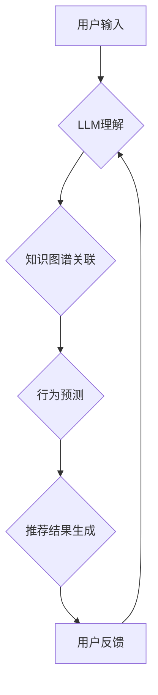

                 

## LLM在推荐系统中的未来展望

> 关键词：大型语言模型（LLM）、推荐系统、个性化推荐、自然语言理解、生成式模型、用户行为预测、内容生成

## 1. 背景介绍

推荐系统作为信息过滤和内容发现的关键技术，在电商、社交媒体、视频平台等领域发挥着至关重要的作用。传统推荐系统主要依赖于协同过滤、内容过滤和基于知识的推荐算法，这些算法通常基于用户历史行为和物品特征进行建模。然而，随着用户行为数据量的激增和内容的多样性增加，传统推荐系统面临着以下挑战：

* **数据稀疏性:** 用户行为数据往往是稀疏的，难以捕捉用户细粒度的兴趣和偏好。
* **冷启动问题:** 新用户和新物品难以获得有效的推荐，因为缺乏历史数据。
* **推荐结果单一性:** 传统推荐系统难以提供多样化和创新的推荐结果。
* **缺乏上下文理解:** 传统推荐系统难以理解用户在特定场景下的需求和意图。

近年来，大型语言模型（LLM）的快速发展为推荐系统带来了新的机遇。LLM拥有强大的自然语言理解和生成能力，能够更好地理解用户需求和内容语义，从而提升推荐系统的精准度、多样性和个性化程度。

## 2. 核心概念与联系

LLM在推荐系统中的应用主要基于以下核心概念：

* **自然语言理解 (NLU):** LLM能够理解用户自然语言输入，例如文本评论、搜索查询和对话，从而提取用户意图、兴趣和偏好。
* **文本生成:** LLM能够生成高质量的文本内容，例如商品描述、推荐理由和个性化广告文案。
* **知识图谱:** LLM可以与知识图谱相结合，利用丰富的知识信息进行推荐，例如用户兴趣相关的物品、事件和人物。
* **用户行为预测:** LLM可以分析用户历史行为数据，预测用户的未来行为，例如点击、购买和分享。

**LLM在推荐系统中的应用架构**



## 3. 核心算法原理 & 具体操作步骤

### 3.1  算法原理概述

LLM在推荐系统中的核心算法主要包括：

* **Transformer模型:** Transformer模型是一种基于注意力机制的深度学习模型，能够有效地捕捉文本序列中的长距离依赖关系，适用于理解用户需求和内容语义。
* **BERT模型:** BERT模型是一种预训练语言模型，能够理解上下文信息，适用于用户意图识别和文本分类。
* **GPT模型:** GPT模型是一种生成式语言模型，能够生成高质量的文本内容，适用于个性化推荐文案和内容生成。

### 3.2  算法步骤详解

1. **数据预处理:** 收集用户行为数据、物品信息和文本内容，进行清洗、格式化和编码。
2. **LLM预训练:** 使用大规模文本数据集对LLM模型进行预训练，使其具备强大的语言理解和生成能力。
3. **模型微调:** 将预训练的LLM模型微调到特定推荐任务，例如用户意图识别、物品推荐和个性化文案生成。
4. **推荐结果生成:** 根据用户输入和模型预测结果，生成个性化的推荐列表或内容。
5. **用户反馈收集:** 收集用户对推荐结果的反馈，例如点击、购买和评分，用于模型评估和优化。

### 3.3  算法优缺点

**优点:**

* **理解用户需求:** LLM能够更好地理解用户自然语言输入，捕捉用户细粒度的兴趣和偏好。
* **生成个性化内容:** LLM能够生成个性化的推荐文案和内容，提升用户体验。
* **跨模态推荐:** LLM可以结合图像、音频等多模态数据进行推荐，提供更丰富的推荐结果。

**缺点:**

* **计算资源需求:** LLM训练和推理需要大量的计算资源，成本较高。
* **数据安全隐私:** LLM训练需要大量用户数据，需要妥善处理数据安全和隐私问题。
* **模型解释性:** LLM模型的决策过程较为复杂，难以解释推荐结果背后的逻辑。

### 3.4  算法应用领域

LLM在推荐系统中的应用领域广泛，包括：

* **电商推荐:** 个性化商品推荐、新品推荐、跨界推荐。
* **社交媒体推荐:** 朋友推荐、内容推荐、兴趣小组推荐。
* **视频平台推荐:** 视频内容推荐、用户兴趣推荐、个性化播放列表推荐。
* **新闻推荐:** 个性化新闻推荐、热点事件推荐、知识图谱关联推荐。

## 4. 数学模型和公式 & 详细讲解 & 举例说明

### 4.1  数学模型构建

LLM推荐系统通常基于Transformer模型，其核心是注意力机制。注意力机制允许模型关注输入序列中与当前任务相关的部分，从而提高模型的理解能力和预测精度。

**注意力机制公式:**

$$
Attention(Q, K, V) = \frac{exp(Q \cdot K^T / \sqrt{d_k})}{exp(Q \cdot K^T / \sqrt{d_k})} \cdot V
$$

其中：

* $Q$：查询向量
* $K$：键向量
* $V$：值向量
* $d_k$：键向量的维度

### 4.2  公式推导过程

注意力机制的公式通过计算查询向量与键向量的点积，并使用softmax函数归一化，得到每个键向量的权重。然后，将权重与值向量相乘，得到最终的注意力输出。

### 4.3  案例分析与讲解

例如，在用户物品交互推荐中，用户历史行为可以表示为查询向量，物品特征可以表示为键向量，物品评分可以表示为值向量。通过注意力机制，模型可以学习到用户对不同物品的兴趣程度，并根据用户的兴趣偏好进行推荐。

## 5. 项目实践：代码实例和详细解释说明

### 5.1  开发环境搭建

推荐系统开发环境通常包括：

* **编程语言:** Python
* **深度学习框架:** TensorFlow、PyTorch
* **数据处理工具:** Pandas、NumPy
* **云计算平台:** AWS、Azure、GCP

### 5.2  源代码详细实现

以下是一个使用PyTorch实现LLM推荐系统的简单代码示例：

```python
import torch
import torch.nn as nn

class LLMRecommender(nn.Module):
    def __init__(self, embedding_dim, num_layers, num_heads):
        super(LLMRecommender, self).__init__()
        self.embedding = nn.Embedding(vocab_size, embedding_dim)
        self.transformer = nn.Transformer(d_model=embedding_dim, nhead=num_heads, num_encoder_layers=num_layers, num_decoder_layers=num_layers)
        self.fc = nn.Linear(embedding_dim, 1)

    def forward(self, user_input, item_input):
        user_embedding = self.embedding(user_input)
        item_embedding = self.embedding(item_input)
        output = self.transformer(user_embedding, item_embedding)
        prediction = self.fc(output[:, 0, :])
        return prediction

# 实例化模型
model = LLMRecommender(embedding_dim=128, num_layers=6, num_heads=8)

# 训练模型
# ...

# 推理模型
user_id = 123
item_id = 456
user_input = torch.tensor([user_id])
item_input = torch.tensor([item_id])
prediction = model(user_input, item_input)
```

### 5.3  代码解读与分析

该代码示例展示了使用PyTorch实现LLM推荐系统的基本流程。

* 模型结构：模型包含嵌入层、Transformer层和全连接层。
* 嵌入层：将用户ID和物品ID映射到低维向量空间。
* Transformer层：利用注意力机制学习用户和物品之间的关系。
* 全连接层：将Transformer层的输出映射到预测分数。
* 训练过程：使用用户行为数据训练模型，优化模型参数。
* 推理过程：根据用户ID和物品ID，预测用户对物品的评分或点击概率。

### 5.4  运行结果展示

训练完成后，模型可以用于预测用户对不同物品的兴趣。例如，可以预测用户是否会点击某个商品、购买某个商品或评分某个商品。

## 6. 实际应用场景

LLM在推荐系统中的应用场景广泛，例如：

* **个性化商品推荐:** 根据用户的浏览历史、购买记录和兴趣偏好，推荐个性化的商品。
* **新品推荐:** 利用LLM分析用户对新产品的兴趣，推荐符合用户需求的新产品。
* **跨界推荐:** 根据用户的兴趣爱好，推荐跨界商品，例如推荐喜欢运动的用户购买运动服饰和运动鞋。
* **内容推荐:** 根据用户的阅读历史、观看记录和兴趣偏好，推荐个性化的新闻、视频和文章。

### 6.4  未来应用展望

LLM在推荐系统中的应用前景广阔，未来可能在以下方面取得突破：

* **更精准的推荐:** LLM能够更好地理解用户需求和内容语义，从而提供更精准的推荐结果。
* **更个性化的推荐:** LLM能够生成个性化的推荐文案和内容，提升用户体验。
* **跨模态推荐:** LLM可以结合图像、音频等多模态数据进行推荐，提供更丰富的推荐结果。
* **解释性推荐:** 研究如何提高LLM推荐系统的解释性，让用户更好地理解推荐结果背后的逻辑。

## 7. 工具和资源推荐

### 7.1  学习资源推荐

* **书籍:**
    * 《深度学习》
    * 《自然语言处理》
    * 《Transformer模型》
* **在线课程:**
    * Coursera: 深度学习
    * Udacity: 自然语言处理
    * fast.ai: 深度学习

### 7.2  开发工具推荐

* **深度学习框架:** TensorFlow、PyTorch
* **数据处理工具:** Pandas、NumPy
* **云计算平台:** AWS、Azure、GCP

### 7.3  相关论文推荐

* **BERT:** Devlin et al. (2018). BERT: Pre-training of Deep Bidirectional Transformers for Language Understanding.
* **GPT:** Radford et al. (2018). Language Models are Few-Shot Learners.
* **Transformer:** Vaswani et al. (2017). Attention Is All You Need.

## 8. 总结：未来发展趋势与挑战

### 8.1  研究成果总结

LLM在推荐系统中的应用取得了显著成果，能够提供更精准、个性化和创新的推荐结果。

### 8.2  未来发展趋势

LLM在推荐系统领域的未来发展趋势包括：

* **模型规模和能力提升:** 训练更大规模的LLM模型，提升模型的理解能力和生成能力。
* **多模态融合:** 将LLM与图像、音频等多模态数据融合，提供更丰富的推荐结果。
* **解释性推荐:** 研究如何提高LLM推荐系统的解释性，让用户更好地理解推荐结果背后的逻辑。
* **联邦学习:** 利用联邦学习技术，在保护用户隐私的前提下训练LLM模型。

### 8.3  面临的挑战

LLM在推荐系统中的应用也面临着一些挑战：

* **计算资源需求:** 训练和推理LLM模型需要大量的计算资源，成本较高。
* **数据安全隐私:** LLM训练需要大量用户数据，需要妥善处理数据安全和隐私问题。
* **模型解释性:** LLM模型的决策过程较为复杂，难以解释推荐结果背后的逻辑。

### 8.4  研究展望

未来，LLM在推荐系统领域的应用将继续深入发展，为用户提供更智能、更个性化的体验。

## 9. 附录：常见问题与解答

**Q1: LLM推荐系统与传统推荐系统的区别是什么？**

**A1:** LLM推荐系统利用强大的自然语言理解和生成能力，能够更好地理解用户需求和内容语义，从而提供更精准、个性化和创新的推荐结果。传统推荐系统主要依赖于协同过滤、内容过滤和基于知识的推荐算法，难以捕捉用户细粒度的兴趣和偏好。

**Q2: LLM推荐系统有哪些应用场景？**

**A2:** LLM推荐系统在电商、社交媒体、视频平台等领域都有广泛的应用场景，例如个性化商品推荐、新品推荐、跨界推荐、内容推荐等。

**Q3: 如何评估LLM推荐系统的性能？**

**A3:** LLM推荐系统的性能可以评估指标包括点击率、转化率、用户满意度等。

**作者：禅与计算机程序设计艺术 / Zen and the Art of Computer Programming**<end_of_turn>

