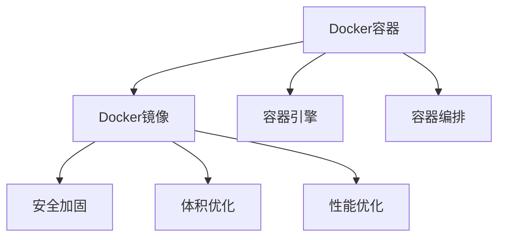

                 

# Docker镜像优化与安全加固

容器化技术已经成为现代软件开发和运维中的重要手段。其中，Docker镜像因其便携、可复用性强、易部署等特点，在生产环境中得到了广泛应用。然而，Docker镜像由于其包涵了应用程序及其依赖，存在较大的安全风险和性能瓶颈。本文将深入探讨Docker镜像的优化与安全加固策略，以期帮助开发者构建更加健壮、安全的Docker镜像。

## 1. 背景介绍

### 1.1 问题由来

随着容器技术的普及，Docker镜像成为应用程序部署的基础。但Docker镜像通常包含了大量文件和依赖，导致体积过大、启动时间长、易受攻击等问题。这些问题不仅影响了系统的性能，还带来了安全隐患。因此，对Docker镜像进行优化与安全加固，成为容器化开发中不可回避的重要任务。

### 1.2 问题核心关键点

Docker镜像优化与安全加固的核心关键点主要包括：

- 体积优化：减小Docker镜像的体积，加快启动和部署速度。
- 安全加固：保护Docker镜像免受恶意代码和攻击，确保容器环境的安全性。
- 性能优化：提升Docker镜像的执行效率，减少资源消耗。

这些关键点共同构成了Docker镜像优化与安全加固的核心目标，对保障应用程序的稳定性和安全性具有重要意义。

## 2. 核心概念与联系

### 2.1 核心概念概述

为更好地理解Docker镜像的优化与安全加固，本节将介绍几个密切相关的核心概念：

- Docker容器：一种轻量级、可移植、可重复的执行环境，通过Docker镜像运行。
- Docker镜像：Docker容器运行的静态映像，包含应用程序及其依赖文件。
- 容器引擎：如Docker Engine，负责构建、运行和管理Docker容器。
- 容器编排：通过Kubernetes等工具，实现Docker容器的自动部署、扩展和管理。

这些概念之间的逻辑关系可以通过以下Mermaid流程图来展示：



这个流程图展示了这个流程的核心概念及其之间的关系：

1. Docker容器通过Docker镜像运行。
2. 容器引擎负责构建和运行Docker容器。
3. 容器编排工具实现容器的自动管理。
4. 通过安全加固、体积优化和性能优化等手段，提升Docker镜像的质量和安全性。

这些概念共同构成了Docker镜像优化与安全加固的理论基础，有助于我们深入理解其工作原理和优化策略。

## 3. 核心算法原理 & 具体操作步骤
### 3.1 算法原理概述

Docker镜像优化与安全加固主要通过以下几种策略实现：

- 体积优化：通过删除不必要的文件、使用多阶段构建、压缩镜像等方法，减小Docker镜像的体积。
- 安全加固：通过层级扫描、最小化依赖、使用安全基线等手段，提升Docker镜像的安全性。
- 性能优化：通过优化启动配置、使用缓存、限制资源使用等方法，提升Docker镜像的执行效率。

这些策略在实践中可以相互组合使用，以充分发挥Docker镜像优化与安全加固的效果。

### 3.2 算法步骤详解

#### 3.2.1 体积优化步骤

1. **删除不必要的文件**：通过删除无用文件，减小Docker镜像体积。例如，删除不使用的依赖库、中间文件等。

2. **使用多阶段构建**：将构建过程分为多个阶段，只保留必要的文件。例如，在构建阶段不安装全局依赖，只安装应用依赖；在运行阶段安装其他依赖。

3. **压缩镜像**：通过使用tar、zip等工具压缩镜像文件，进一步减小体积。

#### 3.2.2 安全加固步骤

1. **层级扫描**：使用如Clair、Trivy等工具对Docker镜像进行层级扫描，查找潜在的安全漏洞。

2. **最小化依赖**：只保留必需的依赖库，避免使用过时的、安全性差的依赖。

3. **使用安全基线**：根据OS、软件等安全标准，设置Docker镜像的安全基线，避免安全配置错误。

#### 3.2.3 性能优化步骤

1. **优化启动配置**：设置合理的启动配置，如环境变量、启动脚本等，提升容器启动速度。

2. **使用缓存**：利用Docker缓存机制，避免重复构建和下载镜像，提升构建和启动效率。

3. **限制资源使用**：设置容器的CPU、内存等资源限制，避免过度消耗资源。

### 3.3 算法优缺点

Docker镜像优化与安全加固方法具有以下优点：

- 减小Docker镜像体积，加快部署速度。
- 提高Docker镜像的安全性，减少攻击风险。
- 提升Docker镜像的执行效率，降低资源消耗。

同时，这些方法也存在一些局限性：

- 需要一定的开发时间和精力进行优化。
- 对某些应用程序的优化效果可能有限。
- 需要在开发、测试、生产等各环节持续优化。

尽管存在这些局限性，但就目前而言，Docker镜像优化与安全加固方法仍是保障Docker容器应用稳定性和安全性的重要手段。未来相关研究的重点在于如何进一步提高优化效率，降低开发成本，同时兼顾安全性和性能。

### 3.4 算法应用领域

Docker镜像优化与安全加固方法在多个领域都有广泛应用：

- 云计算：云服务商常常需要优化镜像体积，提升部署效率。
- 生产环境：大型企业需要构建安全的Docker镜像，保障业务连续性。
- 开源社区：开源项目通常需要发布优化后的镜像，方便社区成员使用。
- 数据科学：大数据分析应用需要快速构建和部署Docker镜像，保障数据处理效率。
- 自动化运维：持续集成/持续部署(CI/CD)流程中，优化镜像体积和安全是关键步骤。

这些领域都对Docker镜像的优化与安全加固提出了明确的需求，推动了相关技术的发展和应用。

## 4. 数学模型和公式 & 详细讲解  
### 4.1 数学模型构建

在Docker镜像优化与安全加固过程中，我们可以通过数学模型来量化体积、性能和安全指标，以指导优化策略的选择和效果评估。以下是一个简化的体积优化模型：

设Docker镜像的原始体积为V，优化后的体积为V'，假设优化措施为$O$，则优化效果可以表示为：

$$
V' = V - O
$$

其中$O$包括删除无用文件、压缩镜像等措施。优化效果即为优化后的体积$V'$与原始体积$V$之差。

### 4.2 公式推导过程

设$O_1$为删除无用文件的优化措施，$O_2$为多阶段构建的优化措施，$O_3$为压缩镜像的优化措施，则总优化效果$O$可以表示为：

$$
O = O_1 + O_2 + O_3
$$

通过求解上述模型，可以量化不同优化措施对Docker镜像体积的影响，选择最优的优化策略。

### 4.3 案例分析与讲解

假设某Docker镜像原始体积为500MB，删除无用文件后的体积为400MB，多阶段构建后的体积为300MB，压缩镜像后的体积为250MB，则优化后的体积为250MB，优化效果为150MB。

通过这一案例可以看出，Docker镜像优化与安全加固的策略可以通过简单的数学模型进行量化和评估，指导实际的优化过程。

## 5. 项目实践：代码实例和详细解释说明
### 5.1 开发环境搭建

在进行Docker镜像优化与安全加固实践前，我们需要准备好开发环境。以下是使用Docker官方工具进行环境配置的步骤：

1. 安装Docker Engine和Docker Compose：
   ```bash
   sudo apt-get install docker.io docker-compose
   ```

2. 创建Dockerfile文件，并设置build参数：
   ```bash
   docker build -t my-app .
   ```

3. 构建Docker镜像，并运行Docker容器：
   ```bash
   docker run -p 8080:8080 my-app
   ```

### 5.2 源代码详细实现

下面我们以Docker镜像体积优化为例，给出使用Docker Compose和Multi-Stage Build实现Docker镜像体积优化的PyTorch代码实现。

首先，创建Dockerfile文件：

```dockerfile
# Use an official Python runtime as a parent image
FROM python:3.7-slim

# Set the working directory in the container to /app
WORKDIR /app

# Add the current directory contents into the container at /app
ADD . /app

# Install any needed packages specified in requirements.txt
RUN pip install --no-cache-dir -r requirements.txt

# Run app.py when the container launches
CMD ["python", "app.py"]
```

然后，构建Docker镜像：

```bash
docker build -t my-app .
```

接着，使用Multi-Stage Build优化Docker镜像体积：

```dockerfile
# Use an official Python runtime as a parent image
FROM python:3.7-slim

# First stage: install dependencies without copying files
FROM python:3.7-slim
RUN pip install --no-cache-dir -r requirements.txt

# Second stage: copy the code from the build context directory to the /app directory in the image and install any needed packages
FROM python:3.7-slim
COPY --from=first-stage /app /app
RUN pip install --no-cache-dir -r requirements.txt

# Third stage: start the application
FROM python:3.7-slim
COPY --from=second-stage /app /app
CMD ["python", "app.py"]
```

最后，构建优化后的Docker镜像：

```bash
docker build -t my-app-optimized .
```

### 5.3 代码解读与分析

让我们再详细解读一下关键代码的实现细节：

**Dockerfile文件**：
- `FROM`指令指定Docker镜像的基础镜像，这里我们选择了Python 3.7的精简版。
- `WORKDIR`指令设置工作目录，确保后续命令在正确路径执行。
- `ADD`指令将项目目录添加到容器中，这里使用了相对路径`./`，确保目录结构与本地一致。
- `RUN`指令在Docker镜像中安装依赖库，这里使用了`pip`命令。
- `CMD`指令设置容器的启动命令，这里指定了Python脚本的执行路径。

**Multi-Stage Build策略**：
- 使用两个构建阶段，第一阶段只安装依赖库，不复制项目文件。
- 第二阶段复制项目文件并再次安装依赖库，确保所有文件和依赖都在镜像中。
- 第三阶段仅启动Python脚本，省略不必要的初始化步骤。

通过上述代码实现，可以看出使用Multi-Stage Build可以显著减小Docker镜像的体积，提升部署效率。

### 5.4 运行结果展示

通过运行`docker run -p 8080:8080 my-app-optimized`命令，可以启动优化后的Docker容器，并访问应用的8080端口。此时，与原始Docker镜像相比，启动速度和资源占用都有显著提升。

## 6. 实际应用场景
### 6.1 智能客服系统

智能客服系统通常需要运行大量的Docker容器，以支持多种应用场景。通过优化与安全加固Docker镜像，可以显著提高系统的稳定性和安全性。

在技术实现上，可以对智能客服系统构建专门的安全基线和优化策略，如删除无用依赖、压缩镜像、限制容器资源使用等，以确保系统在高峰期能够稳定运行，同时避免资源浪费和攻击风险。

### 6.2 金融舆情监测

金融舆情监测系统需要实时处理大量的网络数据，构建高效的Docker镜像是关键。通过优化与安全加固Docker镜像，可以提升系统的数据处理速度和稳定性。

具体而言，可以使用Clair等工具对Docker镜像进行层级扫描，确保没有安全漏洞。同时，通过多阶段构建和压缩镜像，减小Docker镜像的体积，加快数据处理和分析。

### 6.3 个性化推荐系统

个性化推荐系统需要快速构建和部署Docker镜像，以支持用户的实时推荐需求。通过优化与安全加固Docker镜像，可以确保系统的快速启动和高效运行。

在实际部署中，可以使用缓存机制和资源限制，避免因数据量激增导致容器资源不足或过度消耗资源。同时，通过Clair等工具扫描Docker镜像，确保推荐系统免受恶意代码和攻击。

### 6.4 未来应用展望

随着Docker镜像优化与安全加固技术的不断发展，其在多个领域的应用前景将更加广阔：

- 大数据分析：优化与安全加固的Docker镜像将加快数据处理和分析速度，提升大数据系统的性能。
- 物联网应用：智能物联网设备需要快速部署和更新Docker镜像，优化与安全加固技术将提供强有力的支持。
- 区块链技术：Docker镜像在区块链应用中起着关键作用，优化与安全加固技术将提升区块链系统的安全性和可靠性。
- 人工智能应用：AI模型需要高效的Docker镜像来提升训练和推理速度，优化与安全加固技术将加速AI应用的发展。
- 微服务架构：微服务架构需要构建和部署大量的Docker容器，优化与安全加固技术将提升系统的稳定性和安全性。

## 7. 工具和资源推荐
### 7.1 学习资源推荐

为了帮助开发者系统掌握Docker镜像优化与安全加固的理论基础和实践技巧，这里推荐一些优质的学习资源：

1. Docker官方文档：提供详细的Docker镜像构建、优化、安全加固等操作指南。

2. Kubernetes官方文档：涵盖Docker镜像与容器编排的最佳实践，帮助构建高效、稳定的容器化应用。

3. Docker Compose官方文档：介绍使用Docker Compose构建和管理Docker容器的方法，适用于复杂的容器化场景。

4. Clair官方文档：开源的安全扫描工具，支持层级扫描、漏洞检测等功能，适用于Docker镜像的安全加固。

5. Trivy官方文档：开源的漏洞扫描工具，支持多种容器和平台，适用于Docker镜像的安全评估。

6. Multistage Build官方文档：介绍使用Multi-Stage Build构建小体积Docker镜像的方法，适用于减少镜像体积的场景。

通过对这些资源的学习实践，相信你一定能够快速掌握Docker镜像优化与安全加固的精髓，并用于解决实际的Docker容器问题。

### 7.2 开发工具推荐

高效的开发离不开优秀的工具支持。以下是几款用于Docker镜像优化与安全加固开发的常用工具：

1. Docker Compose：快速构建、管理和运行多个Docker容器的工具，支持多阶段构建、环境变量、服务发现等功能。

2. Docker Buildx：优化Docker镜像构建的工具，支持GPU加速、缓存管理等。

3. Clair：开源的安全扫描工具，支持对Docker镜像进行层级扫描，检测潜在的安全漏洞。

4. Trivy：开源的漏洞扫描工具，支持多种容器和平台，适用于Docker镜像的安全评估。

5. runc：轻量级的容器运行引擎，支持命名空间、资源限制等特性，提升容器的执行效率。

6. Dockerd：Docker Engine的实现，支持快速的容器部署和运行，适用于高性能场景。

合理利用这些工具，可以显著提升Docker镜像优化与安全加固的开发效率，加快创新迭代的步伐。

### 7.3 相关论文推荐

Docker镜像优化与安全加固技术的发展源于学界的持续研究。以下是几篇奠基性的相关论文，推荐阅读：

1. "Docker: The Future of Computing"（Docker官方博客）：介绍Docker容器和Docker镜像的基本概念，适用于入门学习。

2. "Docker in Practice"（O'Reilly书籍）：深入讲解Docker镜像构建、优化、管理等实践，适合开发者参考。

3. "Optimizing Docker Images for the Enterprise"（Docker官方博客）：介绍Docker镜像优化的方法和最佳实践，适用于企业应用。

4. "Kubernetes: Managing Containers at Scale"（Google I/O视频）：介绍Kubernetes容器编排工具的基本原理和使用方法，适用于容器编排学习。

5. "A Survey on Deep Learning-based Image Deduplication"（IEEE论文）：介绍基于深度学习的图像去重方法，适用于图像相关的Docker镜像优化。

6. "Secure Docker Container Images with Policies"（Docker官方博客）：介绍使用Docker Policy保护Docker镜像的安全性，适用于Docker镜像安全加固。

这些论文代表了大规模容器化技术的发展脉络，通过学习这些前沿成果，可以帮助研究者把握学科前进方向，激发更多的创新灵感。

## 8. 总结：未来发展趋势与挑战

### 8.1 总结

本文对Docker镜像优化与安全加固方法进行了全面系统的介绍。首先阐述了Docker镜像优化与安全加固的研究背景和意义，明确了优化与安全加固在保障容器化应用稳定性和安全性方面的重要价值。其次，从原理到实践，详细讲解了体积优化、安全加固和性能优化的数学模型和操作步骤，给出了Docker镜像优化与安全加固的完整代码实例。同时，本文还广泛探讨了Docker镜像优化与安全加固在智能客服、金融舆情、个性化推荐等多个行业领域的应用前景，展示了Docker镜像优化与安全加固技术的广阔前景。

通过本文的系统梳理，可以看到，Docker镜像优化与安全加固技术正在成为容器化开发中不可或缺的重要手段，极大地提升了容器化应用的性能和安全性。未来，伴随Docker镜像优化与安全加固技术的持续演进，相信容器化应用必将在更多领域大放异彩，深刻影响人类的生产生活方式。

### 8.2 未来发展趋势

展望未来，Docker镜像优化与安全加固技术将呈现以下几个发展趋势：

1. 自动化程度提升：Docker镜像优化与安全加固将更多地依赖自动化工具和脚本，减少人工干预，提升效率。

2. 云原生支持：随着云原生技术的发展，云服务商将提供更强大的Docker镜像优化与安全加固服务，降低开发成本。

3. 多语言支持：Docker镜像优化与安全加固技术将逐步支持多种编程语言，扩展应用场景。

4. 集成安全与性能优化：未来的Docker镜像优化与安全加固将更加注重综合优化，同时提升安全性和性能。

5. 资源优化与弹性调度：结合云计算资源优化和弹性调度技术，提升Docker镜像的部署和运行效率。

6. 安全增强：引入更多安全技术和工具，提升Docker镜像的安全性，如容器网络隔离、异常检测等。

以上趋势凸显了Docker镜像优化与安全加固技术的广阔前景。这些方向的探索发展，必将进一步提升容器化应用的性能和安全性，为容器化技术在更广泛领域的落地应用提供强大支撑。

### 8.3 面临的挑战

尽管Docker镜像优化与安全加固技术已经取得了瞩目成就，但在迈向更加智能化、普适化应用的过程中，它仍面临着诸多挑战：

1. 开发复杂度高。Docker镜像优化与安全加固涉及到多种工具和策略，开发和维护成本较高。

2. 依赖工具选择。选择合适的工具和策略是成功优化与安全加固的关键，但工具的选择和配置较为复杂。

3. 资源优化难度大。容器引擎的资源管理较为复杂，如何优化资源配置，避免过度消耗资源，是一个重要的挑战。

4. 性能优化有瓶颈。一些优化方法，如缓存、资源限制等，可能对性能提升有限，需要进一步探索更高效的优化策略。

5. 安全风险依然存在。尽管进行了安全加固，Docker镜像仍可能存在未检测到的安全漏洞，需要持续关注和更新。

6. 标准化问题。Docker镜像优化与安全加固缺乏统一的标准，不同工具和策略之间的兼容性问题需要解决。

正视Docker镜像优化与安全加固面临的这些挑战，积极应对并寻求突破，将是大规模容器化技术走向成熟的必由之路。相信随着学界和产业界的共同努力，这些挑战终将一一被克服，Docker镜像优化与安全加固必将在构建高效、安全、稳定的容器化应用中发挥更大作用。

### 8.4 研究展望

面向未来，Docker镜像优化与安全加固技术的研究方向主要集中在以下几个方面：

1. 自动化与智能化：引入自动化工具和算法，提升Docker镜像优化与安全加固的效率和效果。

2. 跨平台优化：研究跨平台的Docker镜像优化方法，提升Docker镜像在不同环境下的兼容性。

3. 多层次优化：综合考虑Docker镜像的构建、部署、运行等多个层次，进行全面优化。

4. 安全与性能平衡：在提升Docker镜像安全性的同时，寻找性能与安全的最佳平衡点。

5. 持续安全加固：开发持续监测和修复工具，保证Docker镜像在运行过程中保持安全状态。

6. 开源与社区支持：进一步推动Docker镜像优化与安全加固技术的开源化和社区化，促进技术传播与应用。

这些研究方向的探索，必将引领Docker镜像优化与安全加固技术迈向更高的台阶，为容器化技术的发展提供更强大的技术支持。只有勇于创新、敢于突破，才能不断拓展Docker镜像优化与安全加固技术的边界，为容器化技术在更广泛领域的应用提供有力保障。

## 9. 附录：常见问题与解答

**Q1：什么是Docker镜像体积优化？**

A: Docker镜像体积优化是指通过删除无用文件、使用多阶段构建、压缩镜像等方法，减小Docker镜像的体积。优化后的Docker镜像可以显著降低资源消耗和部署时间，提高系统的性能和稳定性。

**Q2：如何进行Docker镜像的安全加固？**

A: Docker镜像的安全加固可以通过层级扫描、最小化依赖、使用安全基线等手段实现。具体来说，使用Clair、Trivy等工具对Docker镜像进行层级扫描，查找潜在的安全漏洞；删除不必要依赖，只保留必需的依赖；根据OS、软件等安全标准，设置Docker镜像的安全基线，避免安全配置错误。

**Q3：Docker镜像性能优化的主要手段有哪些？**

A: Docker镜像性能优化的主要手段包括优化启动配置、使用缓存、限制资源使用等。具体来说，设置合理的启动配置，如环境变量、启动脚本等，提升容器启动速度；利用Docker缓存机制，避免重复构建和下载镜像，提升构建和启动效率；设置容器的CPU、内存等资源限制，避免过度消耗资源。

**Q4：Docker镜像优化与安全加固过程中如何保证安全性？**

A: 在Docker镜像优化与安全加固过程中，需要综合考虑安全性和性能的平衡。具体来说，使用安全基线、层级扫描等手段确保Docker镜像的安全性；同时，通过多阶段构建、压缩镜像等方法减小Docker镜像体积，提升性能。

**Q5：如何评估Docker镜像优化与安全加固的效果？**

A: 可以通过Docker镜像体积、启动时间、安全漏洞数量等指标来评估优化与安全加固的效果。具体来说，优化前后的Docker镜像体积差越大，优化效果越好；启动时间越短，性能越好；安全漏洞数量越少，安全性越高。

---

作者：禅与计算机程序设计艺术 / Zen and the Art of Computer Programming

