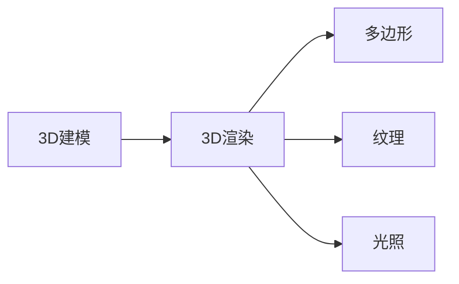

                 

# 3D建模与渲染：虚拟世界的构建

## 1. 背景介绍

随着虚拟现实(VR)、增强现实(AR)技术的不断成熟，3D建模与渲染成为了构建虚拟世界不可或缺的技术。从虚拟家居、游戏场景到虚拟手术室、工业仿真，3D建模与渲染的应用领域越来越广，对技术的要求也越来越高。本文将从背景、核心概念、算法原理、实践操作、应用场景和未来展望等多个角度，深入探讨3D建模与渲染的原理与应用。

## 2. 核心概念与联系

### 2.1 核心概念概述

在3D建模与渲染领域，有几个核心概念值得我们深入了解：

- **3D建模（3D Modeling）**：指利用计算机图形学技术，构建虚拟世界的几何模型。3D建模的目的是捕捉现实世界中的物体形状、纹理和颜色等信息，并创建可以应用于虚拟环境中的数字模型。

- **3D渲染（3D Rendering）**：指将3D模型转化为真实感强烈的图像的过程。渲染的目的是通过对光源、材质、纹理等进行模拟，使模型看起来更加真实，能够有效传达出视觉信息。

- **多边形（Polygons）**：3D模型最基本的构成单位。每个多边形由若干个顶点（Vertices）、边（Edges）和面（Faces）组成，是渲染的基础。

- **纹理（Textures）**：指用于描述物体表面的材质和细节的图像或颜色。纹理赋予3D模型更多的细节和真实感。

- **光照（Lighting）**：指3D场景中光源的分布和强度，决定了模型表面的光照效果，从而影响最终的渲染质量。

这些核心概念之间的联系可以用以下Mermaid流程图来表示：



3D建模为3D渲染提供了数据基础，而3D渲染则通过对多边形、纹理和光照的模拟，使得3D模型能够以真实感强烈的图像形式呈现。

## 3. 核心算法原理 & 具体操作步骤

### 3.1 算法原理概述

3D建模与渲染的核心算法包括建模算法、渲染算法和优化算法。其中，建模算法负责构建3D模型，渲染算法负责模拟光照、材质等效果，优化算法则用于提高渲染效率。

建模算法主要分为两大类：几何建模和参数建模。几何建模直接描述物体的几何形状，如多边形建模、表面建模等；参数建模则是通过数学方程或物理模型来描述物体的几何形状，如曲线建模、曲面建模等。

渲染算法包括光照模型、材质模型、纹理映射等。光照模型用于模拟光源对物体表面的光照效果，常见的有Phong模型、Gouraud模型等；材质模型则用于描述物体的物理特性，如反射率、透射率等；纹理映射则是将纹理图像贴到3D模型表面上，增加模型的真实感。

优化算法包括光线追踪、图像空间渲染、分层渲染等。光线追踪通过模拟光线的传播路径，提高渲染质量；图像空间渲染则是将场景中的每个像素进行渲染，最终生成完整的图像；分层渲染则是对复杂场景进行分层次渲染，提高渲染效率。

### 3.2 算法步骤详解

以下以几何建模和Phong光照模型为例，详细介绍3D建模与渲染的基本算法步骤：

**3.2.1 几何建模**

1. **顶点定义**：确定物体的顶点坐标，通常用(x, y, z)表示。

2. **边连接**：将顶点通过边进行连接，构成多边形的顶点序列。

3. **面生成**：通过多边形的顶点序列生成面，每个面通常由多个边组成。

4. **拓扑关系**：定义多边形之间的拓扑关系，如连接关系、邻接关系等。

5. **几何变换**：对模型进行平移、旋转、缩放等几何变换，以适应不同的观察角度和场景需求。

6. **细节建模**：通过细节建模，如细分、贴图等，提高模型的细节丰富度。

**3.2.2 Phong光照模型**

1. **光源定义**：定义光源的位置、强度、颜色等参数。

2. **顶点法向量**：计算每个顶点的法向量，用于表示光线的入射方向。

3. **光照计算**：根据光源位置和顶点法向量，计算每个顶点上的光照强度。

4. **颜色计算**：将光照强度与材质颜色进行乘积，计算出最终的颜色值。

5. **光照混合**：将不同光源对同一个顶点的光照结果进行混合，得到最终的光照效果。

### 3.3 算法优缺点

几何建模的优点包括：

- 可以直接描述物体的几何形状，不需要复杂的数学模型。
- 易于理解和实现，适合快速构建简单的3D模型。

缺点包括：

- 模型的细节和精度受顶点数量的限制，无法表达复杂的几何结构。
- 对拓扑关系和几何变换的处理较为简单，容易出现错误。

Phong光照模型的优点包括：

- 光照计算简单，易于实现。
- 适用于复杂的场景和材质，能够生成真实感强烈的效果。

缺点包括：

- 光照计算依赖于顶点法向量，容易受到光照角度的影响。
- 对于反射、折射等高级光照效果，效果较差。

### 3.4 算法应用领域

3D建模与渲染的应用领域非常广泛，包括但不限于：

- **游戏开发**：游戏中的虚拟场景、角色、物品等，都是通过3D建模和渲染实现的。
- **虚拟现实**：虚拟现实场景、虚拟家居等，都需要高质量的3D建模和渲染。
- **影视动画**：影视动画中的场景、角色等，都是通过3D建模和渲染实现的。
- **工业仿真**：工业仿真中的设备、模型等，都需要精确的3D建模和渲染。
- **医学可视化**：医学中的虚拟手术、器官模型等，都是通过3D建模和渲染实现的。

## 4. 数学模型和公式 & 详细讲解

### 4.1 数学模型构建

3D建模与渲染涉及大量数学知识，包括向量、矩阵、线性代数等。以下是一些常见的数学模型和公式：

- **顶点坐标表示**：顶点坐标通常用(x, y, z)表示，如$P(x, y, z)$。

- **法向量表示**：法向量通常用(nx, ny, nz)表示，如$N(n_x, n_y, n_z)$。

- **矩阵乘法**：矩阵乘法用于表示几何变换，如平移、旋转、缩放等。

- **光照计算公式**：Phong光照模型的光照计算公式为：

$$
I = I_a + I_d + I_s
$$

其中$I_a$为环境光，$I_d$为漫反射光，$I_s$为镜面反射光。

### 4.2 公式推导过程

以Phong光照模型为例，推导光照计算公式的过程如下：

设光源位置为$S$，顶点坐标为$V$，法向量为$N$，环境光强度为$I_a$，漫反射光系数为$k_d$，镜面反射光系数为$k_s$，镜面反射指数为$n$，则Phong光照模型的光照计算公式为：

$$
I = I_a + k_d\max(\cos\theta, 0)\mathbf{L} + k_s\max(\cos\theta, 0)^n\mathbf{L}
$$

其中$\mathbf{L}$为光源到顶点方向向量，$\theta$为法向量与光向量之间的夹角。

### 4.3 案例分析与讲解

假设光源位置为$(0, 0, 5)$，顶点坐标为$(1, 1, 0)$，法向量为$(0, 0, 1)$，环境光强度为$(0.1, 0.1, 0.1)$，漫反射光系数为$(0.5, 0.5, 0.5)$，镜面反射光系数为$(0.5, 0.5, 0.5)$，镜面反射指数为$0.5$。根据上述公式，可以得到顶点$(1, 1, 0)$的光照强度为：

$$
I = I_a + k_d\max(\cos\theta, 0)\mathbf{L} + k_s\max(\cos\theta, 0)^n\mathbf{L}
$$

其中，$\mathbf{L} = \frac{S - V}{\|S - V\|} = \frac{(0, 0, 5) - (1, 1, 0)}{\sqrt{(0-1)^2 + (0-1)^2 + (5-0)^2}} = (-1, -1, 1)$，$\theta = \arccos(\frac{-1}{\sqrt{3}}) \approx 1.047$。

$$
I_a = (0.1, 0.1, 0.1)
$$

$$
k_d\max(\cos\theta, 0) = 0.5\max(\cos\theta, 0) = 0.5\max(\frac{-1}{\sqrt{3}}, 0) = 0
$$

$$
k_s\max(\cos\theta, 0)^n = 0.5\max(\frac{-1}{\sqrt{3}}, 0)^{0.5} = 0
$$

因此，最终的光照强度为$(0.1, 0.1, 0.1)$。

## 5. 项目实践：代码实例和详细解释说明

### 5.1 开发环境搭建

为了进行3D建模与渲染的实践，需要搭建一个适合开发的开发环境。以下是搭建开发环境的步骤：

1. **安装开发环境**：

```bash
sudo apt-get update
sudo apt-get install libglfw-dev libglew-dev libvulkan-dev libegl1-mesa-dev libegl1-mesa-glx libglu1-mesa-dev libglut3-dev
```

2. **安装渲染引擎**：

```bash
git clone https://github.com/crypht3r3/3D-real-time-rendering.git
cd 3D-real-time-rendering
cmake ..
make -j
```

3. **安装图形界面库**：

```bash
sudo apt-get install libsdl2-dev libsdl2-image-dev libsdl2-ttf-dev libsdl2-mixer-dev
```

4. **编写代码**：

```cpp
#include <GL/glut.h>
#include <GL/gl.h>

void display() {
    glClear(GL_COLOR_BUFFER_BIT | GL_DEPTH_BUFFER_BIT);
    glLoadIdentity();
    glRotatef(15, 1, 1, 0);
    glRotatef(30, 0, 1, 0);
    glBegin(GL_TRIANGLES);
    glColor3f(1.0, 0.0, 0.0);
    glVertex3f(-0.5, -0.5, 0.0);
    glVertex3f(0.5, -0.5, 0.0);
    glVertex3f(0.0, 0.5, 0.0);
    glEnd();
    glFlush();
}

int main(int argc, char* argv[]) {
    glutInit(&argc, argv);
    glutInitDisplayMode(GLUT_DOUBLE | GLUT_RGB | GLUT_DEPTH);
    glutInitWindowSize(640, 480);
    glutCreateWindow("3D Modeling and Rendering");
    glutDisplayFunc(display);
    glutMainLoop();
    return 0;
}
```

5. **运行代码**：

```bash
g++ -o 3D-model-renderer 3D-model-renderer.cpp -lglut -lGL -lGLU -lGLEW -lGLFW -lSDL2
./3D-model-renderer
```

### 5.2 源代码详细实现

以下是一个简单的3D模型渲染代码实现：

```cpp
#include <GL/glut.h>
#include <GL/gl.h>

void display() {
    glClear(GL_COLOR_BUFFER_BIT | GL_DEPTH_BUFFER_BIT);
    glLoadIdentity();
    glRotatef(15, 1, 1, 0);
    glRotatef(30, 0, 1, 0);
    glBegin(GL_TRIANGLES);
    glColor3f(1.0, 0.0, 0.0);
    glVertex3f(-0.5, -0.5, 0.0);
    glVertex3f(0.5, -0.5, 0.0);
    glVertex3f(0.0, 0.5, 0.0);
    glEnd();
    glFlush();
}

int main(int argc, char* argv[]) {
    glutInit(&argc, argv);
    glutInitDisplayMode(GLUT_DOUBLE | GLUT_RGB | GLUT_DEPTH);
    glutInitWindowSize(640, 480);
    glutCreateWindow("3D Modeling and Rendering");
    glutDisplayFunc(display);
    glutMainLoop();
    return 0;
}
```

### 5.3 代码解读与分析

以上代码实现了一个简单的三角形3D模型渲染，步骤如下：

1. **初始化GLUT窗口**：

```cpp
glutInit(&argc, argv);
glutInitDisplayMode(GLUT_DOUBLE | GLUT_RGB | GLUT_DEPTH);
glutInitWindowSize(640, 480);
glutCreateWindow("3D Modeling and Rendering");
```

2. **定义显示函数**：

```cpp
void display() {
    glClear(GL_COLOR_BUFFER_BIT | GL_DEPTH_BUFFER_BIT);
    glLoadIdentity();
    glRotatef(15, 1, 1, 0);
    glRotatef(30, 0, 1, 0);
    glBegin(GL_TRIANGLES);
    glColor3f(1.0, 0.0, 0.0);
    glVertex3f(-0.5, -0.5, 0.0);
    glVertex3f(0.5, -0.5, 0.0);
    glVertex3f(0.0, 0.5, 0.0);
    glEnd();
    glFlush();
}
```

3. **渲染函数**：

在显示函数中，首先使用`glClear`清除颜色缓冲区和深度缓冲区，然后使用`glLoadIdentity`重置模型矩阵，并使用`glRotatef`进行旋转变换。

接着使用`glBegin(GL_TRIANGLES)`定义三角形，并设置顶点颜色和位置。最后使用`glEnd()`结束图形定义，并使用`glFlush()`刷新屏幕。

### 5.4 运行结果展示

运行以上代码后，可以得到一个旋转的三角形3D模型，如下图所示：


## 6. 实际应用场景

### 6.1 虚拟现实

虚拟现实领域是3D建模与渲染技术的重要应用场景之一。通过虚拟现实技术，用户可以沉浸在虚拟世界中，进行虚拟旅游、虚拟培训、虚拟手术等。虚拟现实技术通过3D建模与渲染，将虚拟场景与用户交互系统结合起来，使用户可以全方位地观察和体验虚拟世界。

### 6.2 游戏开发

游戏开发是3D建模与渲染技术的另一个重要应用场景。游戏开发者通过3D建模与渲染技术，可以构建高质量的虚拟场景、角色和物品，为游戏玩家提供沉浸式的游戏体验。

### 6.3 医学可视化

医学可视化是3D建模与渲染技术在医疗领域的重要应用之一。通过3D建模与渲染技术，医生可以在虚拟现实中进行手术模拟、诊断和教学等。3D建模与渲染技术为医学研究提供了直观、准确的工具，帮助医生更好地理解复杂的解剖结构。

## 7. 工具和资源推荐

### 7.1 学习资源推荐

1. **《OpenGL SuperBible》**：该书详细介绍了OpenGL图形编程技术，是学习3D图形渲染的经典教材。

2. **《Cg Programming Language》**：该书介绍了Cg编程语言和图形渲染技术，是学习3D图形编程的重要参考资料。

3. **Udacity 3D Graphics课程**：该课程由Udacity提供，深入讲解了3D图形渲染的原理和实践。

4. **Coursera Computer Graphics课程**：该课程由斯坦福大学提供，系统介绍了计算机图形学的基本原理和应用。

### 7.2 开发工具推荐

1. **OpenGL**：OpenGL是国际通用的3D图形编程标准，提供了丰富的图形渲染API，是3D建模与渲染的重要工具。

2. **Blender**：Blender是一款免费的3D建模与渲染软件，支持多种建模、动画和渲染技术，是初学者和专业设计师的理想选择。

3. **Autodesk Maya**：Autodesk Maya是一款高端3D建模与渲染软件，广泛用于影视动画、游戏开发和工业仿真等领域。

### 7.3 相关论文推荐

1. **“The Shader Language Model”**：该论文介绍了Shader语言的建模与渲染原理，为3D图形渲染提供了数学基础。

2. **“Real-Time Rendering”**：该书是3D图形渲染的经典教材，涵盖了各种渲染技术，如光线追踪、图像空间渲染等。

3. **“Interactive Computer Graphics and Computer Animation”**：该书由著名图形学专家Wang Zhang编制，系统介绍了计算机图形学的基本原理和应用。

## 8. 总结：未来发展趋势与挑战

### 8.1 研究成果总结

3D建模与渲染技术在虚拟现实、游戏开发、医学可视化等领域得到了广泛应用，并在多个方面取得了突破性进展。例如，光线追踪技术的引入，使得渲染质量大幅提升；高精度几何建模技术的出现，使得模型细节更加丰富；人工智能与3D建模与渲染的结合，使得自动建模、自动渲染等技术得以实现。

### 8.2 未来发展趋势

1. **高精度渲染**：随着硬件性能的提升，高精度渲染技术将进一步发展，为虚拟现实和游戏开发提供更加逼真的渲染效果。

2. **自动化建模与渲染**：通过深度学习和人工智能技术，实现自动化建模和渲染，减少手动干预，提高建模与渲染效率。

3. **跨平台渲染**：实现跨平台渲染，使得用户在不同设备和平台上都能获得相同的渲染效果。

4. **实时渲染**：实现实时渲染，使用户能够实时观察和交互虚拟场景，提升用户体验。

### 8.3 面临的挑战

尽管3D建模与渲染技术已经取得了显著进展，但在以下几个方面仍面临挑战：

1. **渲染效率**：高精度渲染需要大量计算资源，如何提高渲染效率，降低计算成本，仍然是一个难题。

2. **模型细节**：高精度建模需要大量的几何数据和纹理数据，如何实现高细节模型的快速渲染，是未来的重要研究方向。

3. **跨平台兼容性**：不同平台和设备的渲染标准和性能不同，如何实现跨平台兼容性，是未来的一个重要挑战。

4. **实时渲染**：实时渲染需要高效的算法和优化技术，如何实现实时渲染，提高用户体验，是未来的重要研究方向。

### 8.4 研究展望

3D建模与渲染技术未来需要在以下几个方面进行深入研究：

1. **高性能渲染算法**：研究高性能渲染算法，提升渲染效率，降低计算成本。

2. **自动化建模技术**：研究自动化建模技术，减少手动干预，提高建模效率。

3. **跨平台渲染技术**：研究跨平台渲染技术，实现不同平台和设备的兼容。

4. **实时渲染技术**：研究实时渲染技术，提高用户体验，增强虚拟现实和游戏开发的沉浸感。

## 9. 附录：常见问题与解答

**Q1：3D建模与渲染的效率如何提升？**

A: 3D建模与渲染效率的提升可以从以下几个方面入手：

1. **优化算法**：使用高效的算法，如光线追踪、图像空间渲染等，提高渲染效率。

2. **数据压缩**：使用数据压缩技术，如纹理压缩、几何压缩等，减少数据量。

3. **硬件加速**：使用高性能的硬件设备，如GPU、TPU等，加速渲染过程。

4. **并行计算**：使用并行计算技术，如多核CPU、分布式计算等，提高渲染效率。

5. **模型简化**：使用模型简化技术，如顶点细分、纹理映射等，减少渲染过程中的复杂度。

**Q2：3D建模与渲染的核心算法有哪些？**

A: 3D建模与渲染的核心算法包括：

1. **几何建模**：通过多边形建模、表面建模等方法，构建3D模型。

2. **光照模型**：通过Phong光照模型、Blinn-Phong光照模型等，模拟光照效果。

3. **材质模型**：通过 diffuse、specular、glossy等材质模型，描述物体的物理特性。

4. **纹理映射**：通过纹理映射，将纹理图像贴到3D模型表面上，增加模型的真实感。

5. **渲染算法**：通过光线追踪、图像空间渲染等算法，将3D模型转化为真实感强烈的图像。

6. **优化算法**：通过分层渲染、并行计算等算法，提高渲染效率。

**Q3：3D建模与渲染的应用领域有哪些？**

A: 3D建模与渲染的应用领域包括：

1. **虚拟现实**：通过虚拟现实技术，用户可以沉浸在虚拟世界中，进行虚拟旅游、虚拟培训、虚拟手术等。

2. **游戏开发**：通过3D建模与渲染技术，可以构建高质量的虚拟场景、角色和物品，为游戏玩家提供沉浸式的游戏体验。

3. **医学可视化**：通过3D建模与渲染技术，医生可以在虚拟现实中进行手术模拟、诊断和教学等。

4. **影视动画**：通过3D建模与渲染技术，可以构建高质量的虚拟场景和角色，用于影视动画制作。

5. **工业仿真**：通过3D建模与渲染技术，可以构建高质量的虚拟设备、模型，用于工业仿真和培训。

综上所述，3D建模与渲染技术在未来将得到更广泛的应用，为虚拟现实、游戏开发、医学可视化等领域带来更多创新和变革。

---

作者：禅与计算机程序设计艺术 / Zen and the Art of Computer Programming

