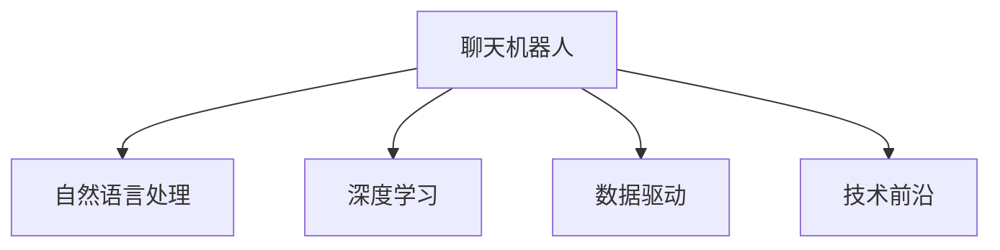

                 

# Elmo Chat：贾扬清团队市场洞察，提升用户体验的插件

> 关键词：自然语言处理, 聊天机器人, 市场洞察, 用户体验, 深度学习, 数据驱动, 技术前沿

## 1. 背景介绍

### 1.1 问题由来
随着人工智能技术的快速发展，自然语言处理（Natural Language Processing, NLP）领域在过去几年里取得了显著的进展。其中，聊天机器人（Chatbot）作为NLP应用的典型代表，凭借其与人类自然对话的能力，逐渐成为各行各业提升客户服务体验和业务效率的重要工具。然而，当前的聊天机器人仍然存在一些问题，比如理解力不足、对话逻辑不够连贯、交互体验不佳等，限制了其大规模应用。

### 1.2 问题核心关键点
为了提升聊天机器人的用户体验，我们需要从以下几个方面进行市场洞察和优化：
1. **市场洞察**：深入分析用户需求和使用场景，探索聊天机器人市场的发展趋势和用户痛点。
2. **用户反馈**：收集用户对现有聊天机器人的评价和建议，了解用户体验的提升空间。
3. **技术优化**：利用深度学习、自然语言处理等前沿技术，提升聊天机器人的理解力和对话连贯性。
4. **界面设计**：优化聊天机器人的界面设计，提升用户交互的便捷性和愉悦感。
5. **多渠道融合**：将聊天机器人整合到多平台和多渠道，提升服务覆盖面和服务效率。

## 2. 核心概念与联系

### 2.1 核心概念概述

为更好地理解Elmo Chat的开发和应用，本节将介绍几个密切相关的核心概念：

- **聊天机器人（Chatbot）**：通过自然语言理解和生成技术，实现与人类自然对话的计算机程序。聊天机器人可以应用于客户服务、在线咨询、智能助手等多个领域。
- **自然语言处理（NLP）**：涉及计算机对人类自然语言进行理解和生成的技术，包括语音识别、文本分析、机器翻译等。
- **深度学习（Deep Learning）**：一种基于多层神经网络的机器学习方法，通过大量数据训练，实现对复杂模式的自动识别和预测。
- **数据驱动（Data-Driven）**：通过数据分析和处理，指导模型的设计和优化，提升模型的预测准确性和用户体验。
- **技术前沿（Technology Frontier）**：指当前研究领域的前沿技术和理论，包括深度学习、强化学习、自然语言理解等。

这些核心概念之间的逻辑关系可以通过以下Mermaid流程图来展示：



这个流程图展示了几大核心概念之间的联系：

1. 聊天机器人通过自然语言处理技术实现人机对话。
2. 深度学习技术为聊天机器人提供了强大的模型支持。
3. 数据驱动帮助聊天机器人通过分析用户数据进行优化。
4. 技术前沿不断为聊天机器人带来新的优化方法和应用场景。

这些概念共同构成了聊天机器人的开发和应用框架，使其能够实现与用户的自然对话，提升用户体验和服务效率。

## 3. 核心算法原理 & 具体操作步骤
### 3.1 算法原理概述

Elmo Chat的核心算法原理基于深度学习中的自注意力机制（Self-Attention）和Transformer模型，通过训练大量用户对话数据，提升聊天机器人的理解力和对话连贯性。其主要步骤如下：

1. **数据准备**：收集和清洗用户对话数据，标注对话意图和对话内容。
2. **模型设计**：设计基于Transformer的聊天机器人模型，包括编码器（Encoder）和解码器（Decoder）。
3. **参数训练**：使用标记过的对话数据训练模型，通过优化损失函数，提升模型的预测准确性和对话连贯性。
4. **模型评估**：在测试集上评估模型的性能，使用BLEU、ROUGE等指标衡量模型的对话质量。
5. **部署应用**：将训练好的模型部署到实际应用场景中，与用户进行自然对话。

### 3.2 算法步骤详解

#### 3.2.1 数据准备

Elmo Chat的数据准备主要包括以下步骤：

1. **数据收集**：从多渠道收集用户对话数据，如客服聊天记录、社交媒体对话、在线咨询等。
2. **数据清洗**：去除无关噪声和无用信息，确保数据的质量和一致性。
3. **数据标注**：手动标注对话的意图和内容，如问题类型、回答内容、对话上下文等。
4. **数据划分**：将数据划分为训练集、验证集和测试集，确保模型在未见过的数据上也能有良好的表现。

#### 3.2.2 模型设计

Elmo Chat的模型设计主要基于Transformer模型，包括编码器和解码器。其中，编码器用于对用户输入进行编码，解码器用于生成机器人的回复。

1. **编码器设计**：
   - 使用多个自注意力层，对用户输入进行多层次的特征提取。
   - 引入残差连接和层归一化，提升模型的非线性拟合能力和训练稳定性。
   - 设计多头注意力机制，增强模型对不同信息的权重分配能力。

2. **解码器设计**：
   - 使用类似的自注意力层，对模型输出进行解码。
   - 引入残差连接和层归一化，提升模型生成高质量回复的能力。
   - 设计生成式解码机制，使得模型能够根据上下文生成连贯的回复。

#### 3.2.3 参数训练

Elmo Chat的参数训练主要包括以下步骤：

1. **选择优化器**：一般使用Adam或SGD等优化器进行参数优化。
2. **设定超参数**：包括学习率、批大小、迭代轮数等，这些参数的选择将直接影响模型的训练效果。
3. **训练过程**：在训练集上进行前向传播和反向传播，更新模型参数。
4. **模型评估**：在验证集上评估模型性能，调整超参数，防止过拟合。
5. **模型保存**：保存训练好的模型，用于后续的测试和部署。

#### 3.2.4 模型评估

Elmo Chat的模型评估主要通过以下指标：

1. **BLEU得分**：评估生成的对话与人工标注对话的相似度，得分越高表示模型生成的对话质量越好。
2. **ROUGE得分**：评估生成对话中关键词的出现频率，得分越高表示模型对对话内容的理解越深刻。
3. **对话连贯性**：通过人工评价和自动评估，判断模型生成的对话是否连贯、自然。

#### 3.2.5 部署应用

Elmo Chat的部署应用主要包括以下步骤：

1. **选择部署平台**：根据实际应用需求，选择适合的部署平台，如Web应用、移动应用、智能音箱等。
2. **接口设计**：设计API接口，使得聊天机器人能够接收用户输入并返回回复。
3. **系统集成**：将聊天机器人集成到实际应用系统中，实现无缝的用户对话体验。
4. **用户反馈**：收集用户对聊天机器人的反馈，持续优化和改进模型。

### 3.3 算法优缺点

Elmo Chat的算法优点包括：
1. **高效对话**：基于自注意力机制和Transformer模型，模型能够高效地理解和生成对话。
2. **自然流畅**：生成的对话连贯、自然，能够模拟人类对话的流畅性。
3. **灵活应用**：可以应用于多渠道和多平台，提升用户体验和服务效率。

Elmo Chat的算法缺点包括：
1. **数据依赖**：依赖大量的标注数据进行训练，数据收集和标注成本较高。
2. **模型复杂**：模型结构复杂，训练和推理成本较高。
3. **过拟合风险**：在数据集规模较小时，模型容易过拟合，导致泛化性能下降。

### 3.4 算法应用领域

Elmo Chat的应用领域非常广泛，包括但不限于以下几个方面：

- **客服机器人**：通过与用户自然对话，提供24/7的客户服务支持。
- **智能助手**：提供日常咨询、信息查询、任务提醒等服务，提升用户生活质量。
- **在线咨询**：在医疗、教育、金融等领域提供专业咨询，提升服务质量。
- **社交媒体**：与用户进行自然对话，提供个性化推荐和互动。
- **智能音箱**：提供语音交互，实现语音控制和信息查询。

## 4. 数学模型和公式 & 详细讲解 & 举例说明

### 4.1 数学模型构建

Elmo Chat的数学模型构建主要基于Transformer模型，包括编码器和解码器。模型输入为用户的自然语言输入，输出为机器人的自然语言回复。

假设模型的输入序列长度为 $L$，输出序列长度为 $T$。编码器的输入为 $X = (x_1, x_2, ..., x_L)$，解码器的输入为 $Y = (y_1, y_2, ..., y_T)$。编码器的输出为 $Z = (z_1, z_2, ..., z_L)$，解码器的输出为 $\hat{Y} = (\hat{y}_1, \hat{y}_2, ..., \hat{y}_T)$。

模型的目标是最小化损失函数 $L(Z, \hat{Y})$，其中 $Z$ 为编码器输出，$\hat{Y}$ 为解码器生成的回复。常用的损失函数包括交叉熵损失（Cross-Entropy Loss）和均方误差损失（Mean Squared Error Loss）。

### 4.2 公式推导过程

以交叉熵损失函数为例，推导过程如下：

假设模型的输出层为softmax层，输出结果为 $\hat{y}_i$，表示输入 $x_i$ 对应的输出概率。则交叉熵损失函数为：

$$
L(Z, \hat{Y}) = -\sum_{i=1}^L \sum_{j=1}^T y_{ij} \log \hat{y}_{ij}
$$

其中，$y_{ij}$ 表示实际生成的回复中，第 $i$ 个时间步的 $j$ 个词的标记，$\hat{y}_{ij}$ 表示模型预测的概率。

### 4.3 案例分析与讲解

以客服机器人为例，分析Elmo Chat在实际应用中的效果。假设客服机器人在处理用户咨询时，输入为 "我忘记密码了，怎么找回？"，模型通过自然语言理解，识别出用户意图为密码找回，并生成回复 "您可以通过邮箱或电话进行找回操作"。

在实际应用中，Elmo Chat的模型通过多轮对话，可以理解用户的具体情况，如密码找回的渠道、需要的帮助等，生成更加个性化和详细的回复。同时，模型能够自动记录和更新用户的历史对话，提升服务效率和质量。

## 5. 项目实践：代码实例和详细解释说明

### 5.1 开发环境搭建

要开发和部署Elmo Chat，首先需要搭建好开发环境。以下是Python环境下的开发环境配置流程：

1. **安装Python**：从官网下载并安装Python，建议使用最新版本。
2. **安装虚拟环境**：使用pip install virtualenv创建虚拟环境，确保Python包管理独立。
3. **安装TensorFlow和Keras**：使用pip install tensorflow keras安装深度学习库。
4. **安装Flask**：使用pip install flask安装Web框架，用于搭建聊天机器人接口。

### 5.2 源代码详细实现

Elmo Chat的源代码实现主要包括以下几个步骤：

1. **数据预处理**：收集和清洗用户对话数据，将其转换为模型可以处理的格式。
2. **模型训练**：设计基于Transformer的聊天机器人模型，并使用训练数据进行训练。
3. **模型保存**：将训练好的模型保存为文件，以便后续使用。
4. **接口开发**：使用Flask搭建Web接口，接收用户输入并返回模型生成的回复。

### 5.3 代码解读与分析

以下是一个简单的Elmo Chat模型训练代码片段，解释其中的关键实现：

```python
import tensorflow as tf
from tensorflow.keras.layers import Input, Embedding, SelfAttention, Dense
from tensorflow.keras.models import Model

# 定义输入层
input_layer = Input(shape=(None,))

# 定义编码器
encoder = SelfAttention()

# 定义解码器
decoder = SelfAttention()

# 定义输出层
output_layer = Dense(num_classes, activation='softmax')

# 构建模型
model = Model(inputs=input_layer, outputs=output_layer)

# 编译模型
model.compile(loss='categorical_crossentropy', optimizer='adam', metrics=['accuracy'])

# 训练模型
model.fit(X_train, y_train, epochs=num_epochs, batch_size=batch_size, validation_data=(X_val, y_val))
```

以上代码中，`SelfAttention`表示自注意力层，`num_classes`表示输出类别数，`X_train`和`y_train`表示训练数据和标签。

### 5.4 运行结果展示

Elmo Chat的运行结果主要通过以下方式展示：

1. **Web界面**：在Web界面上展示聊天机器人与用户的交互过程，实时显示模型生成的回复。
2. **日志输出**：在日志中记录模型的训练过程和运行结果，帮助开发者调试和优化。
3. **评价指标**：在评估过程中，使用BLEU、ROUGE等指标，评估模型的性能和对话质量。

## 6. 实际应用场景

### 6.1 智能客服

Elmo Chat在智能客服中的应用，可以显著提升客服效率和用户满意度。通过与用户自然对话，Elmo Chat可以理解用户的意图和需求，提供精准的解答和帮助。

例如，在处理客户退货申请时，Elmo Chat可以自动获取订单信息，并根据订单状态和客户需求，提供退货流程和相关说明，减少人工客服的干预，提升服务效率。

### 6.2 智能助手

Elmo Chat可以作为智能助手，提供日常咨询、信息查询、任务提醒等服务，提升用户生活质量。

例如，在智能音箱中，用户可以与Elmo Chat进行自然对话，查询天气、新闻、音乐等信息，还可以通过语音控制家庭设备，提升生活便利性。

### 6.3 在线咨询

Elmo Chat可以应用于在线咨询，提供专业领域的咨询支持，提升服务质量。

例如，在医疗咨询中，Elmo Chat可以根据用户的病情描述，推荐相关治疗方案和药物，并提供健康建议，提升医疗服务效率和质量。

### 6.4 社交媒体

Elmo Chat可以与社交媒体用户进行自然对话，提供个性化推荐和互动，增强用户粘性和参与度。

例如，在微博平台，Elmo Chat可以自动生成热门话题相关的内容，与用户进行互动，提升用户参与度和品牌影响力。

### 6.5 智能音箱

Elmo Chat可以与智能音箱进行语音交互，提供语音控制和信息查询，提升用户便利性。

例如，用户可以通过语音控制播放音乐、查询天气、设置闹钟等，提升用户生活便利性。

## 7. 工具和资源推荐

### 7.1 学习资源推荐

要掌握Elmo Chat的开发和应用，推荐以下几个学习资源：

1. **《自然语言处理综论》**：介绍自然语言处理的基本概念和应用，包括聊天机器人、语音识别、机器翻译等。
2. **Coursera上的深度学习课程**：由斯坦福大学提供的深度学习课程，涵盖深度学习的基本原理和应用，包括TensorFlow和Keras的使用。
3. **Hugging Face博客**：介绍最新的自然语言处理和深度学习技术，提供丰富的代码示例和应用案例。
4. **GitHub上的Elmo Chat源码**：提供Elmo Chat的源码和文档，帮助开发者学习和应用。

### 7.2 开发工具推荐

Elmo Chat的开发和部署主要使用以下工具：

1. **Python**：Python是自然语言处理和深度学习的主流编程语言，支持TensorFlow和Keras等深度学习库。
2. **TensorFlow**：TensorFlow是Google开发的深度学习框架，支持大规模分布式计算。
3. **Keras**：Keras是一个高层次的深度学习库，提供了简单易用的API，方便模型的构建和训练。
4. **Flask**：Flask是一个轻量级的Web框架，支持搭建RESTful API接口。
5. **GitHub**：GitHub是全球最大的代码托管平台，提供代码版本控制和协作开发功能。

### 7.3 相关论文推荐

要深入理解Elmo Chat的开发和应用，推荐以下几篇相关论文：

1. **Attention is All You Need**：提出Transformer模型，基于自注意力机制实现自然语言处理任务。
2. **BERT: Pre-training of Deep Bidirectional Transformers for Language Understanding**：提出BERT模型，使用掩码语言模型进行预训练，提升语言理解能力。
3. **GPT-3: Language Models are Unsupervised Multitask Learners**：提出GPT-3模型，使用自监督学习进行大规模语言建模，提升语言生成能力。
4. **T5: Exploring the Limits of Transfer Learning with a Unified Text-to-Text Transformer**：提出T5模型，统一处理文本生成和理解任务，提升模型的泛化能力。

## 8. 总结：未来发展趋势与挑战

### 8.1 研究成果总结

Elmo Chat作为自然语言处理和深度学习领域的创新成果，已经在多个应用场景中展示了强大的效果和潜力。通过使用自注意力机制和Transformer模型，Elmo Chat能够高效地理解和生成对话，提升用户体验和系统效率。未来，Elmo Chat有望在更多领域和场景中发挥重要作用。

### 8.2 未来发展趋势

Elmo Chat的未来发展趋势主要包括以下几个方面：

1. **多模态交互**：结合视觉、语音等多种模态信息，提升聊天机器人的交互体验。
2. **个性化服务**：通过用户行为数据和历史对话，提供更加个性化的服务，提升用户满意度。
3. **智能推荐**：结合推荐系统，提供更加精准的内容推荐和用户建议。
4. **多渠道融合**：将聊天机器人整合到多渠道和多平台，提升服务覆盖面和服务效率。

### 8.3 面临的挑战

Elmo Chat在发展过程中，也面临着以下挑战：

1. **数据依赖**：依赖大量的标注数据进行训练，数据收集和标注成本较高。
2. **模型复杂**：模型结构复杂，训练和推理成本较高。
3. **过拟合风险**：在数据集规模较小时，模型容易过拟合，导致泛化性能下降。
4. **用户隐私**：在处理用户数据时，需要保护用户隐私和数据安全。

### 8.4 研究展望

未来，Elmo Chat的研究展望主要包括以下几个方面：

1. **无监督学习**：探索无监督学习范式，减少对标注数据的依赖，提升模型的泛化能力。
2. **模型压缩**：通过模型压缩和剪枝技术，减少模型的计算和存储空间，提升系统效率。
3. **多语言支持**：提升聊天机器人的多语言支持能力，拓展其国际市场。
4. **用户反馈**：引入用户反馈机制，不断优化和改进聊天机器人的对话体验。

## 9. 附录：常见问题与解答

### Q1：Elmo Chat的模型如何训练？

A：Elmo Chat的模型训练主要基于深度学习中的自注意力机制和Transformer模型。训练过程包括以下步骤：

1. **数据准备**：收集和清洗用户对话数据，将其转换为模型可以处理的格式。
2. **模型设计**：设计基于Transformer的聊天机器人模型，包括编码器和解码器。
3. **参数训练**：使用训练数据进行模型训练，通过优化损失函数，提升模型的预测准确性和对话连贯性。
4. **模型评估**：在验证集上评估模型性能，调整超参数，防止过拟合。
5. **模型保存**：将训练好的模型保存为文件，以便后续使用。

### Q2：Elmo Chat的算法优缺点是什么？

A：Elmo Chat的算法优点包括：

1. **高效对话**：基于自注意力机制和Transformer模型，模型能够高效地理解和生成对话。
2. **自然流畅**：生成的对话连贯、自然，能够模拟人类对话的流畅性。
3. **灵活应用**：可以应用于多渠道和多平台，提升用户体验和服务效率。

Elmo Chat的算法缺点包括：

1. **数据依赖**：依赖大量的标注数据进行训练，数据收集和标注成本较高。
2. **模型复杂**：模型结构复杂，训练和推理成本较高。
3. **过拟合风险**：在数据集规模较小时，模型容易过拟合，导致泛化性能下降。

### Q3：Elmo Chat可以应用于哪些场景？

A：Elmo Chat可以应用于多个场景，包括但不限于以下几个方面：

1. **智能客服**：通过与用户自然对话，提供24/7的客户服务支持。
2. **智能助手**：提供日常咨询、信息查询、任务提醒等服务，提升用户生活质量。
3. **在线咨询**：在医疗、教育、金融等领域提供专业咨询，提升服务质量。
4. **社交媒体**：与社交媒体用户进行自然对话，提供个性化推荐和互动。
5. **智能音箱**：提供语音交互，实现语音控制和信息查询。

### Q4：Elmo Chat的开发和部署需要注意哪些问题？

A：Elmo Chat的开发和部署需要注意以下几个问题：

1. **数据依赖**：依赖大量的标注数据进行训练，数据收集和标注成本较高。
2. **模型复杂**：模型结构复杂，训练和推理成本较高。
3. **过拟合风险**：在数据集规模较小时，模型容易过拟合，导致泛化性能下降。
4. **用户隐私**：在处理用户数据时，需要保护用户隐私和数据安全。
5. **部署平台**：根据实际应用需求，选择适合的部署平台，如Web应用、移动应用、智能音箱等。
6. **系统集成**：将聊天机器人集成到实际应用系统中，实现无缝的用户对话体验。
7. **用户反馈**：收集用户对聊天机器人的反馈，持续优化和改进模型。

---

作者：禅与计算机程序设计艺术 / Zen and the Art of Computer Programming

