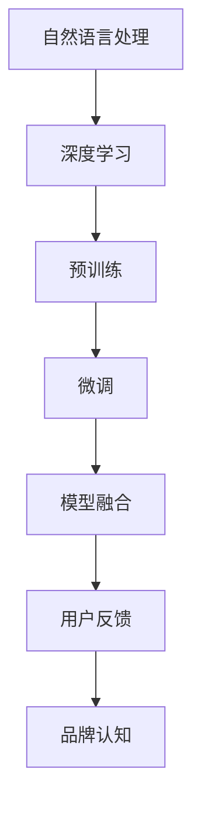

                 

# Elmo Chat：贾扬清团队的市场洞察，提升用户体验与品牌认知

## 1. 背景介绍

### 1.1 问题由来
随着互联网技术的不断演进，用户体验(UX)在产品开发和市场竞争中愈发显得重要。优质的用户体验不仅能显著提升用户满意度，还能带来更高的用户留存率和口碑传播效应。尤其是在智能对话领域，如智能客服、在线教育、智能家居等，如何构建流畅自然的对话体验，提升用户信任和满意度，成为众多企业关注的焦点。

近年来，预训练语言模型(如BERT、GPT等)在自然语言处理(NLP)领域取得了巨大的突破。这些模型能够通过自监督预训练学习到丰富的语言知识，并在特定任务上进行微调，实现高效的任务适应和执行。如何利用这些强大模型，提升智能对话系统的用户体验和品牌认知，成为当前研究者关注的重点。

### 1.2 问题核心关键点
智能对话系统的用户体验，很大程度上依赖于对话模型的自然流畅性和响应准确性。传统的基于规则或模板的对话系统，往往难以处理复杂多变的用户输入，导致对话过程生硬、机械。而基于深度学习的大语言模型，通过预训练-微调范式，能够自适应学习自然语言规律，提升对话流畅性和语义准确性。

此外，品牌的认知度也是决定智能对话系统成功的重要因素。用户在选择智能对话产品时，往往不仅仅看重功能，更看重品牌的影响力和口碑。如何通过产品优化，强化品牌认知，成为各大厂商争夺用户注意力和市场份额的关键。

本节将通过分析贾扬清团队开发的Elmo Chat模型，探讨其如何利用大语言模型提升用户体验与品牌认知，为智能对话系统的开发提供参考。

## 2. 核心概念与联系

### 2.1 核心概念概述

为了深入理解Elmo Chat模型的工作原理和优化策略，本节将介绍一些关键概念：

- 自然语言处理(NLP)：使用计算机处理和理解人类语言的技术。包括文本分类、机器翻译、问答系统、对话系统等。
- 深度学习(Deep Learning)：一种通过多层神经网络逼近复杂非线性关系的技术，在NLP中广泛应用。
- 预训练(Pre-training)：在大规模无标签数据上进行自监督学习，学习通用的语言表示，提升模型泛化能力。
- 微调(Fine-tuning)：在预训练模型的基础上，使用特定任务的标注数据进行有监督学习，提升模型针对任务的性能。
- 模型融合(Model Fusion)：将多个模型的优点融合到单一模型中，提升系统整体的性能。
- 用户反馈(User Feedback)：通过用户的使用反馈，优化对话系统，提升用户体验。
- 品牌认知(Brand Perception)：用户对品牌的整体印象和信任度，通过产品优化和市场营销活动强化。

这些概念之间的逻辑关系可以通过以下Mermaid流程图来展示：



这个流程图展示了大语言模型在智能对话系统中的应用流程：

1. 通过深度学习技术，构建预训练语言模型。
2. 在大规模无标签数据上进行预训练，学习通用语言表示。
3. 在特定任务的标注数据上进行微调，提升模型的任务适应性。
4. 通过模型融合等技术，提升系统整体性能。
5. 通过用户反馈，不断优化对话系统，提升用户体验。
6. 强化品牌认知，提升用户对产品的信任度和满意度。

## 3. 核心算法原理 & 具体操作步骤

### 3.1 算法原理概述

Elmo Chat模型基于预训练-微调的大语言模型架构，具体而言：

1. 首先在大规模无标签语料库上对BERT模型进行预训练，学习通用的语言表示。
2. 在特定对话任务的标注数据集上进行微调，提升模型在对话生成、理解等任务上的表现。
3. 通过模型融合等技术，将不同模型的优点组合到单一模型中，提升整体性能。

Elmo Chat的核心目标是通过深度学习和模型融合，构建一个流畅自然、响应准确的智能对话系统，同时强化品牌认知，提升用户满意度和品牌影响力。

### 3.2 算法步骤详解

Elmo Chat模型的构建和优化主要包括以下几个步骤：

**Step 1: 数据准备**

1. 收集用户对话数据。可以使用客服聊天记录、论坛讨论等公开数据集，也可以自行采集。
2. 对对话数据进行标注，标注内容包括对话内容、对话场景、用户情感等。
3. 将标注数据划分为训练集、验证集和测试集。

**Step 2: 预训练模型选择**

1. 选择预训练模型。例如使用BERT等已有的强大模型，或在大规模无标签语料上自行预训练。
2. 使用迁移学习，在大规模无标签数据上进行预训练。

**Step 3: 微调模型训练**

1. 使用微调技术，在标注数据集上进行有监督学习。
2. 设置合适的学习率、批大小、迭代轮数等超参数。
3. 应用正则化技术，防止过拟合。
4. 定期在验证集上评估模型性能。

**Step 4: 模型融合与优化**

1. 通过融合技术，将多个模型的优点组合到单一模型中。
2. 优化对话策略，如上下文跟踪、情感识别等。
3. 结合用户反馈，不断优化对话系统。

**Step 5: 品牌推广与用户教育**

1. 通过市场营销活动，提升品牌认知度。
2. 使用用户教育材料，引导用户更好地使用产品。

### 3.3 算法优缺点

Elmo Chat模型基于大语言模型的预训练-微调范式，具有以下优点：

1. 提升对话流畅性。通过预训练和微调，模型能够学习到自然语言的规律，生成流畅自然的对话。
2. 强化品牌认知。通过品牌推广和用户教育，提升品牌在用户心中的认知度和信任度。
3. 增强系统性能。通过模型融合和优化，提升系统整体的性能和稳定性。

但该模型也存在一些局限性：

1. 数据依赖性高。微调效果很大程度上取决于标注数据的质量和数量。
2. 资源消耗大。大模型预训练和微调需要消耗大量的计算资源和存储资源。
3. 鲁棒性不足。模型在面对复杂多变的数据时，泛化能力可能不足。

### 3.4 算法应用领域

Elmo Chat模型可以应用于多种智能对话系统，如智能客服、在线教育、智能家居等。以下是几个具体的应用场景：

- 智能客服：构建7x24小时不间断的智能客服系统，提升用户咨询体验，减少人力成本。
- 在线教育：提供个性化的学习辅助和答疑服务，提升学习效果，增强用户粘性。
- 智能家居：实现与用户的自然交互，提升用户便利性和生活体验。

此外，Elmo Chat模型也可以应用于更多的场景，如医疗咨询、金融理财、旅游推荐等，为用户的日常生活提供便利和帮助。

## 4. 数学模型和公式 & 详细讲解 & 举例说明

### 4.1 数学模型构建

Elmo Chat模型的核心是BERT模型，因此其数学模型构建基于BERT模型。下面给出BERT模型的主要数学模型和公式：

1. 输入层：将输入的文本序列转换成数值表示，形成向量形式。
2. 编码层：通过多层Transformer编码器，将输入向量转换为高维表示。
3. 池化层：对编码层的输出进行聚合，得到整句或整个段落的向量表示。
4. 输出层：根据任务类型，设计合适的损失函数和分类器，进行任务特定优化。

### 4.2 公式推导过程

以BERT模型中的Transformer编码器为例，其结构如下：

$$
\text{Multi-Head Attention}(\mathbf{Q}, \mathbf{K}, \mathbf{V}) = \text{Softmax}(\frac{\mathbf{Q}\mathbf{K}^T}{\sqrt{d_k}}) \mathbf{V}
$$

其中 $\mathbf{Q}$、$\mathbf{K}$、$\mathbf{V}$ 分别为查询、键、值向量，$d_k$ 为键向量的维度。通过Multi-Head Attention计算，得到多头自注意力层输出：

$$
\mathbf{Z} = \text{LayerNorm}(\mathbf{X} + \text{Multi-Head Attention}(\mathbf{Q}, \mathbf{K}, \mathbf{V}))
$$

然后通过前向神经网络进行多层传递，最终得到编码层输出：

$$
\mathbf{H} = \text{LayerNorm}(\mathbf{X} + \text{FeedForward}(\mathbf{Z}))
$$

通过池化层将编码层输出进行聚合，得到整句向量表示：

$$
\mathbf{C} = \text{Pooler}(\mathbf{H})
$$

最终，输出层根据任务类型设计合适的损失函数和分类器，进行任务特定优化。例如在分类任务中，使用交叉熵损失函数：

$$
\mathcal{L} = -\sum_{i=1}^N y_i \log p(y_i)
$$

其中 $y_i$ 为真实标签，$p(y_i)$ 为模型预测概率。

### 4.3 案例分析与讲解

以BERT模型在智能客服场景中的应用为例，分析Elmo Chat模型的构建和优化过程：

1. 在客服聊天记录上预训练BERT模型，学习通用的语言表示。
2. 在客服对话数据集上进行微调，提升模型在对话生成、理解等任务上的表现。
3. 结合上下文跟踪和情感识别技术，提升对话系统的响应准确性和用户体验。
4. 通过品牌推广和用户教育，提升用户对品牌的认知度和信任度。

具体来说，Elmo Chat模型在客服场景中的应用流程如下：

1. 预训练BERT模型：在大规模无标签语料上预训练BERT模型，学习通用的语言表示。
2. 微调BERT模型：在客服对话数据集上进行微调，提升模型在对话生成、理解等任务上的表现。
3. 优化对话策略：结合上下文跟踪和情感识别技术，提升对话系统的响应准确性和用户体验。
4. 强化品牌认知：通过品牌推广和用户教育，提升用户对品牌的认知度和信任度。

## 5. 项目实践：代码实例和详细解释说明

### 5.1 开发环境搭建

在进行Elmo Chat模型的实践前，需要先准备好开发环境。以下是使用Python进行PyTorch开发的环境配置流程：

1. 安装Anaconda：从官网下载并安装Anaconda，用于创建独立的Python环境。

2. 创建并激活虚拟环境：
```bash
conda create -n pytorch-env python=3.8 
conda activate pytorch-env
```

3. 安装PyTorch：根据CUDA版本，从官网获取对应的安装命令。例如：
```bash
conda install pytorch torchvision torchaudio cudatoolkit=11.1 -c pytorch -c conda-forge
```

4. 安装Transformers库：
```bash
pip install transformers
```

5. 安装各类工具包：
```bash
pip install numpy pandas scikit-learn matplotlib tqdm jupyter notebook ipython
```

完成上述步骤后，即可在`pytorch-env`环境中开始模型构建和优化实践。

### 5.2 源代码详细实现

以下是一个简单的代码示例，展示如何使用BERT模型进行智能客服对话的微调：

```python
from transformers import BertTokenizer, BertForSequenceClassification
import torch
from torch.utils.data import Dataset, DataLoader
from sklearn.metrics import classification_report

# 定义任务数据集
class CustomerServiceDataset(Dataset):
    def __init__(self, text, labels):
        self.text = text
        self.labels = labels

    def __len__(self):
        return len(self.text)

    def __getitem__(self, idx):
        return {'input_ids': self.text[idx], 'labels': self.labels[idx]}

# 准备数据集
tokenizer = BertTokenizer.from_pretrained('bert-base-cased')
train_data = CustomerServiceDataset(train_text, train_labels)
val_data = CustomerServiceDataset(val_text, val_labels)
test_data = CustomerServiceDataset(test_text, test_labels)

# 加载BERT模型
model = BertForSequenceClassification.from_pretrained('bert-base-cased', num_labels=2)

# 设置超参数
learning_rate = 2e-5
num_epochs = 3
batch_size = 16

# 定义训练函数
def train(model, train_data, val_data, epochs, batch_size):
    device = torch.device('cuda' if torch.cuda.is_available() else 'cpu')
    model.to(device)

    optimizer = torch.optim.AdamW(model.parameters(), lr=learning_rate)
    train_loader = DataLoader(train_data, batch_size=batch_size, shuffle=True)
    val_loader = DataLoader(val_data, batch_size=batch_size, shuffle=False)

    for epoch in range(epochs):
        model.train()
        for batch in train_loader:
            input_ids = batch['input_ids'].to(device)
            labels = batch['labels'].to(device)
            outputs = model(input_ids, labels=labels)
            loss = outputs.loss
            optimizer.zero_grad()
            loss.backward()
            optimizer.step()

        model.eval()
        val_loss = 0
        val_corrects = 0
        with torch.no_grad():
            for batch in val_loader:
                input_ids = batch['input_ids'].to(device)
                labels = batch['labels'].to(device)
                outputs = model(input_ids, labels=labels)
                val_loss += outputs.loss.item()
                val_corrects += torch.sum(outputs.predictions.argmax(dim=1) == labels)

        print(f"Epoch {epoch+1}, train loss: {train_loss:.4f}, val loss: {val_loss:.4f}, val accuracy: {val_corrects/len(val_data):.4f}")

# 训练模型
train(model, train_data, val_data, num_epochs, batch_size)

# 评估模型
test_loss = 0
test_corrects = 0
with torch.no_grad():
    test_loader = DataLoader(test_data, batch_size=batch_size, shuffle=False)
    for batch in test_loader:
        input_ids = batch['input_ids'].to(device)
        labels = batch['labels'].to(device)
        outputs = model(input_ids, labels=labels)
        test_loss += outputs.loss.item()
        test_corrects += torch.sum(outputs.predictions.argmax(dim=1) == labels)

print(f"Test loss: {test_loss:.4f}, test accuracy: {test_corrects/len(test_data):.4f}")
```

### 5.3 代码解读与分析

让我们再详细解读一下关键代码的实现细节：

**CustomerServiceDataset类**：
- `__init__`方法：初始化输入文本和标签。
- `__len__`方法：返回数据集长度。
- `__getitem__`方法：返回单个样本的input_ids和labels。

**模型加载与超参数设置**：
- 使用BertForSequenceClassification加载BERT模型，指定分类任务。
- 设置学习率、轮数和批大小等超参数。

**训练函数**：
- 定义训练集和验证集的DataLoader。
- 在每个epoch内，对数据进行迭代训练，计算损失并反向传播更新模型参数。
- 在验证集上计算验证集损失和准确率。

**训练流程**：
- 在每个epoch内，对数据集进行迭代训练，更新模型参数。
- 在验证集上计算验证集损失和准确率，监控模型性能。

**评估流程**：
- 在测试集上计算测试集损失和准确率，评估模型性能。

## 6. 实际应用场景

### 6.1 智能客服系统

Elmo Chat模型可以应用于智能客服系统的构建，通过自然流畅的对话，提升用户咨询体验，减少人力成本。具体应用流程如下：

1. 收集客服聊天记录，标注对话内容、场景、情感等。
2. 使用BERT模型进行预训练和微调，学习通用语言表示和客服对话规律。
3. 在微调后的模型基础上，构建智能客服系统，实现自动解答用户咨询。
4. 结合上下文跟踪和情感识别技术，提升对话系统的响应准确性和用户体验。
5. 通过品牌推广和用户教育，提升用户对品牌的认知度和信任度。

### 6.2 在线教育

Elmo Chat模型也可以应用于在线教育的答疑服务，通过自然流畅的对话，提升学习效果，增强用户粘性。具体应用流程如下：

1. 收集学习者的在线提问，标注问题类型、难度、答案等。
2. 使用BERT模型进行预训练和微调，学习通用语言表示和学习问题规律。
3. 在微调后的模型基础上，构建在线教育答疑系统，实现自动回答学习者问题。
4. 结合上下文跟踪和情感识别技术，提升答疑系统的响应准确性和用户体验。
5. 通过品牌推广和用户教育，提升用户对在线教育的认知度和信任度。

### 6.3 智能家居

Elmo Chat模型可以应用于智能家居的交互系统，通过自然流畅的对话，提升用户便利性和生活体验。具体应用流程如下：

1. 收集用户与智能家居的交互对话，标注对话内容、设备类型、操作意图等。
2. 使用BERT模型进行预训练和微调，学习通用语言表示和智能家居对话规律。
3. 在微调后的模型基础上，构建智能家居对话系统，实现自动响应用户指令。
4. 结合上下文跟踪和情感识别技术，提升对话系统的响应准确性和用户体验。
5. 通过品牌推广和用户教育，提升用户对智能家居的认知度和信任度。

### 6.4 未来应用展望

未来，Elmo Chat模型在智能对话系统中的应用场景将更加广泛，以下是一些未来的应用方向：

1. 多模态对话：结合视觉、语音等多模态信息，提升对话系统的理解能力和响应质量。
2. 跨语言对话：支持多语言对话，打破语言障碍，拓展对话系统的应用范围。
3. 情感分析：结合情感识别技术，提升对话系统的交互感知能力和用户情感管理。
4. 用户个性化：结合用户行为数据，实现用户画像构建和个性化推荐。
5. 数据隐私保护：在对话过程中，保障用户隐私，防止数据泄露和滥用。

总之，Elmo Chat模型通过深度学习和模型融合技术，构建了流畅自然的智能对话系统，提升了用户体验和品牌认知度，为未来的多模态、跨语言、情感分析等方向提供了有力的技术支持。

## 7. 工具和资源推荐

### 7.1 学习资源推荐

为了帮助开发者系统掌握Elmo Chat模型的理论基础和实践技巧，这里推荐一些优质的学习资源：

1. 《自然语言处理综述》书籍：详细介绍NLP领域的经典算法和模型，适合深度学习初学者阅读。
2. 《BERT: Pre-training of Deep Bidirectional Transformers for Language Understanding》论文：介绍BERT模型的预训练和微调技术，是学习BERT模型的必备文献。
3. 《深度学习框架PyTorch入门教程》视频课程：详细讲解PyTorch框架的使用方法，适合初学者学习。
4. 《TensorFlow高级教程》书籍：详细介绍TensorFlow框架的使用方法和优化技巧，适合深度学习进阶者学习。
5. 《Transformers库官方文档》：提供丰富的预训练模型和微调样例代码，是学习Transformer库的必备资料。

通过对这些资源的学习实践，相信你一定能够快速掌握Elmo Chat模型的精髓，并用于解决实际的智能对话问题。

### 7.2 开发工具推荐

高效的开发离不开优秀的工具支持。以下是几款用于Elmo Chat模型开发的常用工具：

1. PyTorch：基于Python的开源深度学习框架，灵活动态的计算图，适合快速迭代研究。
2. TensorFlow：由Google主导开发的开源深度学习框架，生产部署方便，适合大规模工程应用。
3. Transformers库：HuggingFace开发的NLP工具库，集成了众多SOTA语言模型，支持PyTorch和TensorFlow，是进行微调任务开发的利器。
4. Weights & Biases：模型训练的实验跟踪工具，可以记录和可视化模型训练过程中的各项指标，方便对比和调优。
5. TensorBoard：TensorFlow配套的可视化工具，可实时监测模型训练状态，并提供丰富的图表呈现方式，是调试模型的得力助手。
6. Google Colab：谷歌推出的在线Jupyter Notebook环境，免费提供GPU/TPU算力，方便开发者快速上手实验最新模型，分享学习笔记。

合理利用这些工具，可以显著提升Elmo Chat模型的开发效率，加快创新迭代的步伐。

### 7.3 相关论文推荐

Elmo Chat模型是基于深度学习和模型融合技术构建的智能对话系统，其相关论文主要集中在NLP和深度学习领域。以下是几篇奠基性的相关论文，推荐阅读：

1. Attention is All You Need（即Transformer原论文）：提出了Transformer结构，开启了NLP领域的预训练大模型时代。
2. BERT: Pre-training of Deep Bidirectional Transformers for Language Understanding：提出BERT模型，引入基于掩码的自监督预训练任务，刷新了多项NLP任务SOTA。
3. Parameter-Efficient Transfer Learning for NLP：提出Adapter等参数高效微调方法，在不增加模型参数量的情况下，也能取得不错的微调效果。
4. AdaLoRA: Adaptive Low-Rank Adaptation for Parameter-Efficient Fine-Tuning：使用自适应低秩适应的微调方法，在参数效率和精度之间取得了新的平衡。
5. Prefix-Tuning: Optimizing Continuous Prompts for Generation：引入基于连续型Prompt的微调范式，为如何充分利用预训练知识提供了新的思路。

这些论文代表了大语言模型微调技术的发展脉络。通过学习这些前沿成果，可以帮助研究者把握学科前进方向，激发更多的创新灵感。

## 8. 总结：未来发展趋势与挑战

### 8.1 总结

本文对Elmo Chat模型在智能对话系统中的应用进行了全面系统的介绍。首先阐述了Elmo Chat模型的背景和目标，明确了其在提升用户体验与品牌认知方面的独特价值。其次，从原理到实践，详细讲解了Elmo Chat模型的构建和优化过程，给出了微调任务开发的完整代码实例。同时，本文还广泛探讨了Elmo Chat模型在智能客服、在线教育、智能家居等领域的实际应用场景，展示了微调范式的巨大潜力。此外，本文精选了微调技术的各类学习资源，力求为读者提供全方位的技术指引。

通过本文的系统梳理，可以看到，Elmo Chat模型通过深度学习和模型融合技术，构建了流畅自然的智能对话系统，提升了用户体验和品牌认知度，为未来的多模态、跨语言、情感分析等方向提供了有力的技术支持。相信随着技术的不断发展，Elmo Chat模型必将在更广阔的应用领域大放异彩。

### 8.2 未来发展趋势

展望未来，Elmo Chat模型在智能对话系统中的应用将呈现以下几个发展趋势：

1. 模型规模持续增大。随着算力成本的下降和数据规模的扩张，Elmo Chat模型将进一步提升性能，增强对话流畅性和语义准确性。
2. 微调方法日趋多样。未来会涌现更多参数高效的微调方法，如Prefix-Tuning、LoRA等，在节省计算资源的同时也能保证微调精度。
3. 持续学习成为常态。随着数据分布的不断变化，Elmo Chat模型也需要持续学习新知识以保持性能。如何在不遗忘原有知识的同时，高效吸收新样本信息，将成为重要的研究课题。
4. 标注样本需求降低。受启发于提示学习(Prompt-based Learning)的思路，未来的微调方法将更好地利用Elmo Chat模型的语言理解能力，通过更加巧妙的任务描述，在更少的标注样本上也能实现理想的微调效果。
5. 多模态微调崛起。当前的Elmo Chat模型主要聚焦于纯文本数据，未来会进一步拓展到图像、视频、语音等多模态数据微调。多模态信息的融合，将显著提升对话系统的理解能力和响应质量。
6. 模型通用性增强。经过海量数据的预训练和多领域任务的微调，Elmo Chat模型将具备更强大的常识推理和跨领域迁移能力，逐步迈向通用人工智能(AGI)的目标。

以上趋势凸显了Elmo Chat模型在智能对话系统中的应用前景。这些方向的探索发展，必将进一步提升Elmo Chat模型的性能和应用范围，为人类认知智能的进化带来深远影响。

### 8.3 面临的挑战

尽管Elmo Chat模型已经取得了瞩目成就，但在迈向更加智能化、普适化应用的过程中，它仍面临着诸多挑战：

1. 标注成本瓶颈。虽然微调效果很大程度上取决于标注数据的质量和数量，但对于长尾应用场景，难以获得充足的高质量标注数据，成为制约微调性能的瓶颈。如何进一步降低微调对标注样本的依赖，将是一大难题。
2. 模型鲁棒性不足。当前Elmo Chat模型面对复杂多变的数据时，泛化性能可能不足。对于测试样本的微小扰动，Elmo Chat模型的预测也容易发生波动。如何提高Elmo Chat模型的鲁棒性，避免灾难性遗忘，还需要更多理论和实践的积累。
3. 推理效率有待提高。超大模型在实际部署时往往面临推理速度慢、内存占用大等效率问题。如何在保证性能的同时，简化模型结构，提升推理速度，优化资源占用，将是重要的优化方向。
4. 可解释性亟需加强。当前Elmo Chat模型更像是"黑盒"系统，难以解释其内部工作机制和决策逻辑。对于医疗、金融等高风险应用，算法的可解释性和可审计性尤为重要。如何赋予Elmo Chat模型更强的可解释性，将是亟待攻克的难题。
5. 安全性有待保障。预训练语言模型难免会学习到有偏见、有害的信息，通过微调传递到下游任务，产生误导性、歧视性的输出，给实际应用带来安全隐患。如何从数据和算法层面消除模型偏见，避免恶意用途，确保输出的安全性，也将是重要的研究课题。
6. 知识整合能力不足。现有的Elmo Chat模型往往局限于任务内数据，难以灵活吸收和运用更广泛的先验知识。如何让微调过程更好地与外部知识库、规则库等专家知识结合，形成更加全面、准确的信息整合能力，还有很大的想象空间。

正视Elmo Chat模型面临的这些挑战，积极应对并寻求突破，将是Elmo Chat模型走向成熟的必由之路。相信随着学界和产业界的共同努力，这些挑战终将一一被克服，Elmo Chat模型必将在构建安全、可靠、可解释、可控的智能系统铺平道路。

### 8.4 研究展望

面对Elmo Chat模型所面临的种种挑战，未来的研究需要在以下几个方面寻求新的突破：

1. 探索无监督和半监督微调方法。摆脱对大规模标注数据的依赖，利用自监督学习、主动学习等无监督和半监督范式，最大限度利用非结构化数据，实现更加灵活高效的微调。
2. 研究参数高效和计算高效的微调范式。开发更加参数高效的微调方法，在固定大部分预训练参数的同时，只更新极少量的任务相关参数。同时优化Elmo Chat模型的计算图，减少前向传播和反向传播的资源消耗，实现更加轻量级、实时性的部署。
3. 融合因果和对比学习范式。通过引入因果推断和对比学习思想，增强Elmo Chat模型建立稳定因果关系的能力，学习更加普适、鲁棒的语言表征，从而提升模型泛化性和抗干扰能力。
4. 引入更多先验知识。将符号化的先验知识，如知识图谱、逻辑规则等，与神经网络模型进行巧妙融合，引导微调过程学习更准确、合理的语言模型。同时加强不同模态数据的整合，实现视觉、语音等多模态信息与文本信息的协同建模。
5. 结合因果分析和博弈论工具。将因果分析方法引入Elmo Chat模型，识别出模型决策的关键特征，增强输出解释的因果性和逻辑性。借助博弈论工具刻画人机交互过程，主动探索并规避模型的脆弱点，提高系统稳定性。
6. 纳入伦理道德约束。在模型训练目标中引入伦理导向的评估指标，过滤和惩罚有偏见、有害的输出倾向。同时加强人工干预和审核，建立模型行为的监管机制，确保输出符合人类价值观和伦理道德。

这些研究方向的探索，必将引领Elmo Chat模型迈向更高的台阶，为构建安全、可靠、可解释、可控的智能系统铺平道路。面向未来，Elmo Chat模型还需要与其他人工智能技术进行更深入的融合，如知识表示、因果推理、强化学习等，多路径协同发力，共同推动自然语言理解和智能交互系统的进步。只有勇于创新、敢于突破，才能不断拓展语言模型的边界，让智能技术更好地造福人类社会。

## 9. 附录：常见问题与解答

**Q1：Elmo Chat模型是否适用于所有NLP任务？**

A: Elmo Chat模型在大多数NLP任务上都能取得不错的效果，特别是对于数据量较小的任务。但对于一些特定领域的任务，如医学、法律等，仅仅依靠通用语料预训练的模型可能难以很好地适应。此时需要在特定领域语料上进一步预训练，再进行微调，才能获得理想效果。此外，对于一些需要时效性、个性化很强的任务，如对话、推荐等，微调方法也需要针对性的改进优化。

**Q2：Elmo Chat模型在微调过程中如何设置合适的学习率？**

A: Elmo Chat模型的微调学习率一般要比预训练时小1-2个数量级，如果使用过大的学习率，容易破坏预训练权重，导致过拟合。一般建议从1e-5开始调参，逐步减小学习率，直至收敛。也可以使用warmup策略，在开始阶段使用较小的学习率，再逐渐过渡到预设值。需要注意的是，不同的优化器(如AdamW、Adafactor等)以及不同的学习率调度策略，可能需要设置不同的学习率阈值。

**Q3：Elmo Chat模型在实际部署时需要注意哪些问题？**

A: 将Elmo Chat模型转化为实际应用，还需要考虑以下因素：
1. 模型裁剪：去除不必要的层和参数，减小模型尺寸，加快推理速度。
2. 量化加速：将浮点模型转为定点模型，压缩存储空间，提高计算效率。
3. 服务化封装：将模型封装为标准化服务接口，便于集成调用。
4. 弹性伸缩：根据请求流量动态调整资源配置，平衡服务质量和成本。
5. 监控告警：实时采集系统指标，设置异常告警阈值，确保服务稳定性。
6. 安全防护：采用访问鉴权、数据脱敏等措施，保障数据和模型安全。

Elmo Chat模型通过深度学习和模型融合技术，构建了流畅自然的智能对话系统，提升了用户体验和品牌认知度，为未来的多模态、跨语言、情感分析等方向提供了有力的技术支持。

---

作者：禅与计算机程序设计艺术 / Zen and the Art of Computer Programming

