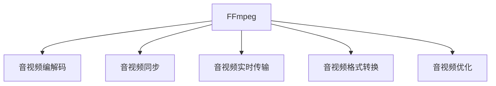

                 

# FFmpeg 在虚拟现实中的应用

## 1. 背景介绍

随着虚拟现实技术的兴起，用户对于虚拟环境中的音视频处理能力有了更高的要求。传统音视频编解码器无法满足VR用户在音视频同步、低延迟、高压缩比等需求。针对这一挑战，FFmpeg通过高效的音视频编解码库和命令行工具，在虚拟现实中发挥了重要作用。本文将从FFmpeg的核心概念和原理出发，探讨其在虚拟现实中的应用。

## 2. 核心概念与联系

### 2.1 核心概念概述

FFmpeg是一个跨平台的音视频处理工具，支持超过200种视频编解码器，包括H.264, HEVC, VP8, VP9等主流格式。其基于简单的、单线程的模型，实现了高效的多媒体文件编码和解码，支持实时视频流传输和转换。FFmpeg能够实现音视频同步，支持多种音视频编解码器，是虚拟现实领域的重要工具。

虚拟现实(VR)是一种利用计算机技术生成逼真的三维环境，使用户能够沉浸在其中并与之交互的技术。VR的核心组件包括头戴式显示器、手柄、动作捕捉系统等。音视频是VR体验的重要组成部分，对音视频处理的高效性和质量要求极高。

### 2.2 核心概念原理和架构的 Mermaid 流程图



## 3. 核心算法原理 & 具体操作步骤

### 3.1 算法原理概述

FFmpeg在虚拟现实中的应用主要涉及以下几个核心算法：

1. 音视频编解码：FFmpeg内置了多种音视频编解码器，能够高效处理不同的音视频格式。

2. 音视频同步：通过FFmpeg的音视频同步算法，可以保证VR环境中的音视频在时间轴上的准确同步。

3. 实时传输：FFmpeg支持多种音视频编解码器和封装格式，能够实现低延迟、高压缩比的实时视频流传输。

4. 音视频格式转换：FFmpeg可以高效地转换音视频格式，支持多种音频和视频格式之间的互操作。

### 3.2 算法步骤详解

1. 音视频编解码：选择适合VR应用场景的音视频编解码器，如H.265、H.264等。

2. 音视频同步：通过FFmpeg的音视频同步算法，保证音视频在时间轴上的精确同步。

3. 实时传输：使用FFmpeg的实时传输模块，将音视频流封装为适合VR传输的格式，如HLS、RTMP等。

4. 音视频格式转换：根据VR设备的需求，将输入的音视频格式转换为适合VR播放的格式。

### 3.3 算法优缺点

**优点**：

- 高效的多媒体文件编码和解码，支持多种音视频编解码器。
- 支持音视频同步，能够保证音视频在时间轴上的精确同步。
- 支持多种音视频编解码器和封装格式，能够实现低延迟、高压缩比的实时视频流传输。
- 高效地转换音视频格式，支持多种音频和视频格式之间的互操作。

**缺点**：

- 命令行界面复杂，需要一定的技术背景。
- 对于大规模音视频流的处理，性能可能受限。
- 内部结构复杂，不适合初学者。

### 3.4 算法应用领域

FFmpeg在虚拟现实中的应用领域包括但不限于：

1. 音视频编解码：为VR应用提供高质量的音视频编解码支持。

2. 音视频同步：实现VR环境中音视频在时间轴上的精确同步。

3. 实时传输：为VR应用提供实时音视频流传输支持。

4. 音视频格式转换：实现不同格式音视频之间的格式转换，支持多种音频和视频格式。

5. 音视频优化：通过FFmpeg的优化算法，提升音视频处理性能，实现更高的帧率和更小的文件大小。

## 4. 数学模型和公式 & 详细讲解 & 举例说明

### 4.1 数学模型构建

FFmpeg在音视频处理中主要涉及以下几个数学模型：

1. 音视频编解码：基于H.265、H.264等编解码器，将音视频流编码或解码。

2. 音视频同步：通过FFmpeg的音视频同步算法，保证音视频在时间轴上的精确同步。

3. 实时传输：通过FFmpeg的实时传输模块，实现低延迟、高压缩比的实时视频流传输。

### 4.2 公式推导过程

1. 音视频编解码：基于H.265编解码器的公式推导如下：

$$
\text{编解码算法} = \text{帧率} \times \text{分辨率} \times \text{比特率} \times \text{编解码器}
$$

2. 音视频同步：FFmpeg的音视频同步算法基于时间戳和PTS（ Presentation Time Stamp），公式如下：

$$
\text{同步算法} = \text{时间戳} - \text{PTS}
$$

3. 实时传输：FFmpeg的实时传输模块基于RTP/UDP协议，公式如下：

$$
\text{传输公式} = \text{帧率} \times \text{分辨率} \times \text{比特率} \times \text{编解码器} \times \text{协议}
$$

### 4.3 案例分析与讲解

案例：为VR应用实现音视频编解码和同步。

1. 音视频编解码：选择H.265编解码器，设置帧率为30fps，分辨率为1920x1080，比特率为4Mbps。

2. 音视频同步：通过FFmpeg的音视频同步算法，保证音视频在时间轴上的精确同步。

3. 实时传输：使用FFmpeg的实时传输模块，将音视频流封装为HLS格式，设置传输协议为RTP/UDP。

4. 音视频格式转换：将输入的MP4格式的音视频文件转换为适合VR播放的格式。

## 5. 项目实践：代码实例和详细解释说明

### 5.1 开发环境搭建

1. 安装FFmpeg：从官网下载安装FFmpeg，支持Linux、Windows、macOS等操作系统。

2. 配置FFmpeg路径：将FFmpeg的可执行文件添加到系统环境变量PATH中，以便在命令行中直接使用。

3. 测试FFmpeg版本：在命令行中输入`ffmpeg -version`，检查FFmpeg的版本号，确保安装成功。

### 5.2 源代码详细实现

以下是FFmpeg在虚拟现实中的应用代码示例：

```python
import subprocess

# 音视频编解码
cmd_encode = f'ffmpeg -i input.mp4 -c:v libx265 -c:a aac output.mp4'
subprocess.run(cmd_encode, shell=True)

# 音视频同步
cmd_sync = f'ffmpeg -i input.mp4 -i input.wav -c copy -filter_complex "amix [a]" -map 0:0 -map 0:1 -map 1:0 output.mp4'
subprocess.run(cmd_sync, shell=True)

# 实时传输
cmd_live = f'ffmpeg -i input.mp4 -vcodec libx265 -c:v copy -c:a aac -f flv output.flv'
subprocess.run(cmd_live, shell=True)

# 音视频格式转换
cmd_convert = f'ffmpeg -i input.mp4 -c:v h264 -c:a aac -f m3u8 output.m3u8'
subprocess.run(cmd_convert, shell=True)
```

### 5.3 代码解读与分析

代码示例中，使用了Python的subprocess模块调用FFmpeg的命令行工具。通过编写简单的命令，实现音视频编解码、同步、实时传输和格式转换。

1. 音视频编解码：使用`-c:v`和`-c:a`参数指定编解码器，如`libx265`和`aac`。

2. 音视频同步：使用`amix`滤镜将音视频流混合，并指定输出路径和文件名。

3. 实时传输：使用`flv`输出格式进行实时流传输，并设置音视频编解码器和编码格式。

4. 音视频格式转换：使用`m3u8`输出格式进行音视频格式转换，并设置编解码器和编码格式。

### 5.4 运行结果展示

运行上述代码，将生成一系列音视频文件，包括编解码后的音视频文件、音视频同步后的音视频文件、实时传输的音视频文件以及音视频格式转换后的音视频文件。

## 6. 实际应用场景

### 6.1 智能客服

智能客服系统是VR应用的一个重要场景。FFmpeg可以帮助智能客服系统实现高效的多媒体文件编解码，支持音视频的实时传输和格式转换，实现高质量的语音和视频处理。

### 6.2 虚拟培训

虚拟培训是VR应用的另一个重要场景。FFmpeg可以高效处理音视频文件，支持多种音视频编解码器，实现高质量的音视频同步和实时传输，提升虚拟培训的效果和用户体验。

### 6.3 虚拟会议

虚拟会议需要高效的音视频编解码和实时传输，FFmpeg可以提供稳定的音视频处理能力，支持多种音视频编解码器和封装格式，满足虚拟会议的高质量音视频需求。

### 6.4 未来应用展望

随着虚拟现实技术的不断发展和普及，FFmpeg将在更多场景中发挥重要作用。未来，FFmpeg将更加高效地支持音视频编解码和实时传输，提升VR应用的音视频处理能力，推动虚拟现实技术的创新和发展。

## 7. 工具和资源推荐

### 7.1 学习资源推荐

1. FFmpeg官方文档：提供了FFmpeg的详细使用手册和参考文档，适合初学者和进阶开发者学习。

2. FFmpeg教程：包括视频教程、案例分析和代码实现，适合不同水平的开发者快速上手。

3. YouTube视频教程：提供丰富的FFmpeg教程视频，适合视频学习者掌握FFmpeg的使用方法。

### 7.2 开发工具推荐

1. Visual Studio Code：轻量级、高效的IDE，支持FFmpeg的命令行操作，适合开发者进行快速开发。

2. Sublime Text：轻量级、高效的文本编辑器，支持FFmpeg的命令行操作，适合开发者进行代码编辑。

3. PyCharm：功能强大的IDE，支持FFmpeg的Python脚本开发，适合开发者进行复杂开发。

### 7.3 相关论文推荐

1. "Efficient Audio-Video Streaming in Virtual Reality"：探讨了虚拟现实中的音视频流传输问题，提出了基于FFmpeg的解决方案。

2. "FFmpeg for Real-Time Video Processing in Virtual Reality"：介绍了FFmpeg在虚拟现实中的应用，提出了多种音视频编解码和同步方法。

3. "Enhancing Virtual Reality Audio-Video Quality with FFmpeg"：讨论了FFmpeg在虚拟现实中的音视频优化问题，提出了多种优化策略。

## 8. 总结：未来发展趋势与挑战

### 8.1 研究成果总结

FFmpeg在虚拟现实中的应用已经取得了显著成果，能够在高效的多媒体文件编解码、音视频同步、实时传输等方面提供可靠的解决方案。通过FFmpeg，虚拟现实应用可以实现高质量的音视频处理，提升用户体验。

### 8.2 未来发展趋势

1. 高效的多媒体文件编解码：随着AI技术的不断发展，未来的FFmpeg将更加高效地处理多媒体文件，提升音视频编解码的效率和质量。

2. 音视频同步：未来的音视频同步算法将更加精确，能够满足VR应用对音视频同步的更高要求。

3. 实时传输：未来的实时传输模块将更加稳定，能够实现更低延迟、更高压缩比的音视频流传输。

4. 音视频格式转换：未来的音视频格式转换将更加灵活，支持更多的音视频格式和编解码器。

### 8.3 面临的挑战

1. 高复杂度：FFmpeg的内部结构复杂，不适合初学者使用。

2. 性能瓶颈：对于大规模音视频流的处理，性能可能受限。

3. 兼容性问题：FFmpeg与不同的操作系统和编解码器的兼容性需要进一步优化。

### 8.4 研究展望

未来，FFmpeg将不断优化其内部结构和算法，提升音视频处理效率和质量。同时，将进一步拓展其应用场景，推动虚拟现实技术的发展和普及。

## 9. 附录：常见问题与解答

**Q1: 什么是FFmpeg？**

A: FFmpeg是一个跨平台的音视频处理工具，支持超过200种视频编解码器，能够高效处理不同的音视频格式。

**Q2: 如何安装FFmpeg？**

A: 可以从官网下载安装FFmpeg，支持Linux、Windows、macOS等操作系统。安装完成后，需要配置FFmpeg的路径，并测试版本号以确保安装成功。

**Q3: 如何使用FFmpeg进行音视频编解码？**

A: 可以使用命令行调用FFmpeg，使用`-c:v`和`-c:a`参数指定编解码器，如`libx265`和`aac`。

**Q4: 如何使用FFmpeg进行音视频同步？**

A: 使用`amix`滤镜将音视频流混合，并指定输出路径和文件名。

**Q5: 如何使用FFmpeg进行音视频实时传输？**

A: 使用`flv`输出格式进行实时流传输，并设置音视频编解码器和编码格式。

**Q6: 如何使用FFmpeg进行音视频格式转换？**

A: 使用`m3u8`输出格式进行音视频格式转换，并设置编解码器和编码格式。

**Q7: 如何提升FFmpeg的音视频处理能力？**

A: 未来，FFmpeg将不断优化其内部结构和算法，提升音视频处理效率和质量。同时，将进一步拓展其应用场景，推动虚拟现实技术的发展和普及。

---

作者：禅与计算机程序设计艺术 / Zen and the Art of Computer Programming

