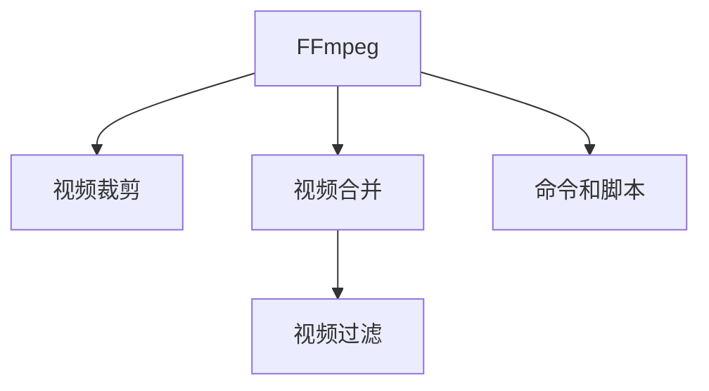

                 

# FFmpeg 视频编辑技巧：裁剪、合并和过滤视频片段

> 关键词：FFmpeg, 视频编辑, 裁剪, 合并, 过滤, 视频片段, 高质量输出

## 1. 背景介绍

### 1.1 问题由来
视频编辑是制作和处理视频内容的基本环节，广泛应用于媒体、影视、教育、广告等领域。传统的视频编辑软件（如Adobe Premiere Pro、Final Cut Pro等）功能强大，但往往价格昂贵且学习成本较高。FFmpeg作为一种开源的视频处理工具，拥有丰富的命令行接口和脚本支持，能够满足大部分视频编辑需求，且安装和配置非常方便。

FFmpeg最初是一个音频处理库，由Niklas Fischer于1994年开发，通过数十年的发展，目前已经成为一个功能强大的多媒体框架。FFmpeg支持几乎所有的视频和音频格式，以及多种编解码器，能够进行音频、视频、字幕等多种媒体的转换、编解压缩、裁剪、合并、过滤等操作。

FFmpeg的灵活性和稳定性使其成为专业和业余视频编辑的首选工具，通过简单的命令和脚本，可以实现复杂的编辑功能。本文将详细介绍FFmpeg在视频裁剪、合并和过滤方面的应用技巧，帮助读者掌握FFmpeg的强大编辑功能，提升视频处理效率和质量。

### 1.2 问题核心关键点
FFmpeg视频编辑的核心关键点在于如何通过命令行和脚本实现复杂的视频操作。无论是对视频进行裁剪、合并，还是添加、删除滤镜，FFmpeg都能通过简洁的命令完成。关键在于熟悉FFmpeg的命令行接口和常用选项，理解它们所代表的具体功能。

## 2. 核心概念与联系

### 2.1 核心概念概述

为更好地理解FFmpeg的视频编辑技巧，本节将介绍几个密切相关的核心概念：

- FFmpeg：一个开源的多媒体框架，支持视频、音频、字幕等多种媒体格式的编解码和处理。
- 视频裁剪：从原始视频中提取指定时间区间内的部分内容，保留原视频的关键片段。
- 视频合并：将多个视频片段拼接成一个连续的视频文件，用于制作短片、纪录片等。
- 视频过滤：通过添加或删除滤镜，对视频进行风格转换、色彩校正等处理，提升视频质量。
- 命令和脚本：通过命令行或脚本，实现对FFmpeg的操作，灵活性和扩展性非常高。

这些核心概念之间的逻辑关系可以通过以下Mermaid流程图来展示：



这个流程图展示了这个核心概念的联系：

1. FFmpeg是实现视频裁剪、合并和过滤的主要工具。
2. 视频裁剪、合并和过滤都是FFmpeg的重要功能之一。
3. 命令和脚本是FFmpeg操作的基础，可以实现复杂的编辑功能。

## 3. 核心算法原理 & 具体操作步骤

### 3.1 算法原理概述

FFmpeg进行视频裁剪、合并和过滤的原理，是通过命令行或脚本，调用FFmpeg的编解码器、滤镜和参数选项，实现对视频文件的操作。具体流程如下：

1. **打开视频文件**：使用FFmpeg打开原始视频文件，进行解码和格式转换。
2. **进行裁剪**：在视频流中指定开始和结束时间，提取该时间区间内的视频内容。
3. **进行合并**：将多个视频文件进行拼接，生成一个连续的视频流。
4. **添加滤镜**：在视频流中应用滤镜，对视频进行风格转换、色彩校正等处理。
5. **保存输出**：将处理后的视频流保存为指定格式的视频文件。

### 3.2 算法步骤详解

下面详细介绍FFmpeg进行视频裁剪、合并和过滤的具体操作步骤。

#### 3.2.1 视频裁剪

使用FFmpeg进行视频裁剪，可以指定起始时间和结束时间，提取原始视频中指定时间区间内的内容。具体操作步骤如下：

1. 打开原始视频文件：
```bash
ffmpeg -i input.mp4
```

2. 进行裁剪操作：
```bash
ffmpeg -i input.mp4 -ss start_time -to end_time -c copy output.mp4
```
其中，`start_time`和`end_time`分别为开始时间和结束时间，单位为秒。`-c copy`表示不重新编码视频流，保留原始编码格式。

#### 3.2.2 视频合并

使用FFmpeg进行视频合并，可以将多个视频文件按照指定的顺序拼接成一个连续的视频流。具体操作步骤如下：

1. 打开所有视频文件：
```bash
ffmpeg -i file1.mp4 -i file2.mp4 -i file3.mp4
```

2. 进行合并操作：
```bash
ffmpeg -f concat -safe 0 -i input.txt -c copy output.mp4
```
其中，`input.txt`为包含所有视频文件路径的文本文件，每行一个文件路径。`-safe 0`表示不禁止视频流之间的时间重叠。`-c copy`表示不重新编码视频流，保留原始编码格式。

#### 3.2.3 视频过滤

使用FFmpeg进行视频过滤，可以通过添加滤镜，对视频进行风格转换、色彩校正等处理，提升视频质量。具体操作步骤如下：

1. 打开原始视频文件：
```bash
ffmpeg -i input.mp4
```

2. 进行过滤操作：
```bash
ffmpeg -i input.mp4 -vf "filter" -c copy output.mp4
```
其中，`filter`为指定的滤镜操作，如`color=1.0:1.0:1.0`表示将视频转换为灰度，`colorspace=rgb24`表示将视频转换为24位RGB格式。

### 3.3 算法优缺点

FFmpeg进行视频裁剪、合并和过滤的优点包括：

1. 开源免费：FFmpeg是一个开源免费的多媒体框架，没有商业限制。
2. 功能强大：支持几乎所有的视频和音频格式，以及多种编解码器。
3. 灵活性高：使用命令行或脚本进行操作，非常灵活，支持复杂的操作。
4. 跨平台：支持Linux、Windows、macOS等多种操作系统。

同时，FFmpeg也有一些缺点：

1. 学习曲线陡峭：需要熟悉命令行和脚本的使用，学习成本较高。
2. 性能问题：对于大型视频文件，处理速度较慢，需要较高的硬件配置。
3. 缺少图形界面：没有图形界面支持，只能通过命令行或脚本操作，不直观。

尽管存在这些缺点，但FFmpeg仍然是视频编辑和处理的首选工具，特别是在需要高效、灵活处理大量视频文件时。

### 3.4 算法应用领域

FFmpeg在视频裁剪、合并和过滤方面的应用非常广泛，涵盖了媒体制作、影视剪辑、教学培训、广告制作等多个领域。具体应用场景包括：

- 媒体制作：将多个视频片段合并成一个完整的视频作品，进行后期剪辑和渲染。
- 影视剪辑：将长片段的影视内容裁剪成短片、预告片等，提高影片的传播效果。
- 教学培训：将多个教学视频片段拼接成一个完整课程，提高教学效率。
- 广告制作：将多个广告素材拼接成完整广告片，进行广告投放。

## 4. 数学模型和公式 & 详细讲解 & 举例说明

### 4.1 数学模型构建

FFmpeg进行视频编辑的操作，主要依赖于命令行和脚本的参数设置。这些参数通常通过时间戳、编解码器、滤镜等进行描述，不需要复杂的数学模型。下面以视频裁剪为例，详细讲解其数学模型构建。

设原始视频文件的开始时间为$T_s$，结束时间为$T_e$，裁剪开始时间为$T_c$，裁剪结束时间为$T_f$，裁剪后视频文件的开始时间为$T_o$，则有以下关系：

$$
T_o = T_s + T_c
$$

$$
T_f = T_e - T_c
$$

$$
T_e - T_f = T_s - T_o
$$

通过这些关系，可以计算出裁剪后视频文件的开始时间和结束时间，从而实现视频裁剪的功能。

### 4.2 公式推导过程

以视频裁剪为例，推导裁剪后视频文件的开始时间和结束时间。设原始视频文件的总时间为$T$，裁剪开始时间为$T_c$，裁剪结束时间为$T_f$，则裁剪后的视频时间为$T_c - T_s$。根据时间戳的关系，可以得到：

$$
T_c - T_s = T_f - T_e
$$

代入$T_f = T_e - T_c$，得：

$$
T_c - T_s = (T_e - T_c) - T_e
$$

化简得：

$$
T_c = \frac{T_s + T_e}{2}
$$

因此，裁剪后视频文件的开始时间$T_o$为：

$$
T_o = T_s + T_c = T_s + \frac{T_s + T_e}{2} = \frac{T_s + T_e}{2} + T_s = \frac{T_s + T_s + T_e}{2} = \frac{T_s + T_e}{2}
$$

同理，裁剪后视频文件的结束时间$T_e$为：

$$
T_e = T_f + T_s = (T_e - T_c) + T_s = (T_e - \frac{T_s + T_e}{2}) + T_s = \frac{T_e + T_s}{2} + T_s = \frac{T_s + T_e}{2}
$$

通过上述推导，可以看到，裁剪后视频文件的开始时间和结束时间均为$\frac{T_s + T_e}{2}$，即原始视频文件中心时间。

### 4.3 案例分析与讲解

以视频裁剪为例，通过一个具体的案例来分析FFmpeg的视频编辑功能。

假设原始视频文件的路径为`input.mp4`，总时间为60秒，裁剪开始时间为10秒，裁剪结束时间为30秒，裁剪后的视频保存为`output.mp4`。

具体操作如下：

1. 打开原始视频文件：
```bash
ffmpeg -i input.mp4
```

2. 进行裁剪操作：
```bash
ffmpeg -i input.mp4 -ss 10 -to 30 -c copy output.mp4
```

3. 保存输出：
```bash
ffmpeg -i input.mp4 -ss 10 -to 30 -c copy output.mp4
```

经过上述操作，FFmpeg将原始视频中从10秒到30秒的内容裁剪出来，保存为`output.mp4`文件。

## 5. 项目实践：代码实例和详细解释说明

### 5.1 开发环境搭建

要进行FFmpeg的视频编辑操作，首先需要搭建开发环境。以下是详细的安装和配置步骤：

1. **安装FFmpeg**：可以从FFmpeg官网下载源代码或预编译二进制文件，根据操作系统和编译器进行安装。

2. **配置FFmpeg**：在Linux系统中，可以使用以下命令配置FFmpeg：

```bash
ffmpeg -version
```

3. **测试FFmpeg**：在终端输入以下命令，测试FFmpeg是否安装成功：

```bash
ffmpeg -i input.mp4 output.mp4
```

### 5.2 源代码详细实现

下面以一个具体的案例为例，展示如何使用FFmpeg进行视频裁剪、合并和过滤操作。

#### 案例1：视频裁剪

假设原始视频文件的路径为`input.mp4`，总时间为60秒，裁剪开始时间为10秒，裁剪结束时间为30秒，裁剪后的视频保存为`output.mp4`。

具体操作如下：

1. 打开原始视频文件：
```bash
ffmpeg -i input.mp4
```

2. 进行裁剪操作：
```bash
ffmpeg -i input.mp4 -ss 10 -to 30 -c copy output.mp4
```

3. 保存输出：
```bash
ffmpeg -i input.mp4 -ss 10 -to 30 -c copy output.mp4
```

#### 案例2：视频合并

假设有两个视频文件，分别为`file1.mp4`和`file2.mp4`，需要进行合并操作。

具体操作如下：

1. 打开所有视频文件：
```bash
ffmpeg -i file1.mp4 -i file2.mp4
```

2. 进行合并操作：
```bash
ffmpeg -f concat -safe 0 -i input.txt -c copy output.mp4
```

其中，`input.txt`为包含所有视频文件路径的文本文件，每行一个文件路径。

#### 案例3：视频过滤

假设原始视频文件的路径为`input.mp4`，需要进行灰度处理。

具体操作如下：

1. 打开原始视频文件：
```bash
ffmpeg -i input.mp4
```

2. 进行过滤操作：
```bash
ffmpeg -i input.mp4 -vf "color=1.0:1.0:1.0" -c copy output.mp4
```

## 6. 实际应用场景

### 6.1 视频编辑

在视频编辑过程中，FFmpeg可以用于剪辑、裁剪、合并、过滤等多个环节，提高编辑效率和质量。例如，在制作纪录片时，可以使用FFmpeg将多个视频片段拼接成一个完整的纪录片，并进行风格转换、色彩校正等处理，提升视频质量。

### 6.2 教学培训

在教学培训中，FFmpeg可以将多个教学视频片段拼接成一个完整课程，提高教学效率。例如，在在线教育平台中，可以使用FFmpeg将多个教学视频拼接成完整的课程，并添加字幕、滤镜等处理，提升学习体验。

### 6.3 广告制作

在广告制作中，FFmpeg可以将多个广告素材拼接成完整广告片，并进行风格转换、色彩校正等处理，提升广告效果。例如，在制作品牌宣传片时，可以使用FFmpeg将多个广告素材拼接成一个完整的宣传片，并进行滤镜、特效等处理，提升品牌形象。

### 6.4 未来应用展望

随着FFmpeg的不断发展，其应用领域将更加广泛，预计未来在以下几个方面会有更多应用：

1. **AI视频生成**：利用AI技术生成虚拟视频内容，FFmpeg可以用于剪辑、合并、滤镜等多个环节，提升AI视频的质量。
2. **实时视频处理**：在直播、会议等实时视频处理场景中，FFmpeg可以用于实时剪辑、滤镜等处理，提高视频质量。
3. **自动化视频生成**：在自动化生产视频内容场景中，FFmpeg可以用于自动剪辑、合并、滤镜等处理，提升生产效率。

## 7. 工具和资源推荐

### 7.1 学习资源推荐

为了帮助读者掌握FFmpeg的视频编辑技巧，这里推荐一些优质的学习资源：

1. **官方文档**：FFmpeg官方文档提供了详细的使用指南和参数说明，是学习FFmpeg的重要参考资料。
2. **视频教程**：YouTube上有很多FFmpeg的视频教程，可以系统地学习FFmpeg的使用方法和应用场景。
3. **社区支持**：FFmpeg社区活跃，可以加入FFmpeg社区获取最新的技术支持和资源分享。

### 7.2 开发工具推荐

FFmpeg的安装和配置非常灵活，可以通过命令行和脚本进行操作，也可以使用GUI界面进行可视化操作。以下是一些常用的开发工具：

1. **Ffmpeg GUI**：FFmpeg官方提供的GUI界面，支持图形化操作，方便快捷。
2. **FFmpeg Windows GUI**：适用于Windows系统的FFmpeg GUI界面，功能丰富，使用简单。
3. **FFmpeg Mac GUI**：适用于macOS系统的FFmpeg GUI界面，支持系统原生集成。

### 7.3 相关论文推荐

FFmpeg作为一个功能强大的多媒体框架，其应用和研究领域非常广泛。以下是几篇相关的学术论文，推荐阅读：

1. **FFmpeg: A Program to Process and Format Arbitrary Streams of Audio and Video**：介绍FFmpeg的设计和实现，详细描述了FFmpeg的功能和应用。
2. **Efficient Encoding of H.264/AVC-1.4-Based Real-Time Video Applications**：研究如何通过FFmpeg进行高效的视频编码和解码。
3. **Evaluating Recent Improvements in FFMPEG's Video Filters**：评估FFmpeg中新的视频滤镜效果，探讨其在视频处理中的应用。

## 8. 总结：未来发展趋势与挑战

### 8.1 总结

本文对FFmpeg的视频编辑技巧进行了全面系统的介绍。首先阐述了FFmpeg的视频编辑功能，明确了其应用在视频裁剪、合并和过滤方面的优势。其次，从原理到实践，详细讲解了FFmpeg的视频编辑操作步骤，给出了完整的代码实例和详细解释。同时，本文还探讨了FFmpeg在媒体制作、教学培训、广告制作等领域的广泛应用前景。最后，精选了FFmpeg的学习资源、开发工具和相关论文，力求为读者提供全面的技术指引。

通过本文的系统梳理，可以看到，FFmpeg作为一款强大的多媒体处理工具，在视频编辑和处理领域具有广泛的应用价值。FFmpeg的灵活性和功能丰富性，使其成为视频编辑和处理的首选工具，能够满足大部分视频编辑需求。未来，随着FFmpeg的持续发展和创新，其在多媒体处理和应用领域的地位将更加稳固。

### 8.2 未来发展趋势

展望未来，FFmpeg将在以下几个方面继续发展：

1. **功能扩展**：随着多媒体处理需求的不断增长，FFmpeg将继续扩展其功能，支持更多的视频、音频格式和编解码器。
2. **性能优化**：随着硬件设备的不断升级，FFmpeg将进一步优化其编解码和处理性能，提升视频处理效率。
3. **用户界面优化**：FFmpeg将优化其GUI界面，提高易用性和用户体验，支持更多的多媒体格式和功能。
4. **自动化和智能化**：FFmpeg将探索自动化和智能化处理，通过AI技术提高多媒体处理效率和质量。

### 8.3 面临的挑战

尽管FFmpeg在视频编辑和处理领域表现出色，但在未来的发展过程中，仍面临一些挑战：

1. **性能瓶颈**：对于大型视频文件，FFmpeg的编解码和处理速度较慢，需要优化算法和硬件配置。
2. **兼容性问题**：FFmpeg支持的视频和音频格式众多，不同格式之间的兼容性问题仍需解决。
3. **用户学习成本**：FFmpeg的命令和选项较多，需要一定的学习成本，新手用户可能需要较长时间的学习和实践。

### 8.4 研究展望

未来，FFmpeg的研究方向将集中在以下几个方面：

1. **自动化处理**：通过AI技术实现自动化的视频编辑和处理，提高生产效率和质量。
2. **跨平台优化**：优化FFmpeg在不同操作系统上的运行效率和稳定性，支持更多的硬件平台。
3. **社区和生态建设**：建立更活跃的FFmpeg社区和生态系统，吸引更多的开发者和用户参与贡献。

总之，FFmpeg作为一款功能强大、开源免费的多媒体处理工具，在视频编辑和处理领域具有广阔的应用前景和研究价值。未来，FFmpeg将继续发展和创新，为多媒体处理和应用提供更加高效、灵活和智能的解决方案。

## 9. 附录：常见问题与解答

### Q1：FFmpeg和Adobe Premiere Pro相比，有哪些优势？

A: 相比Adobe Premiere Pro，FFmpeg具有以下优势：

1. 开源免费：FFmpeg是开源免费的多媒体处理工具，没有商业限制。
2. 跨平台支持：FFmpeg支持Linux、Windows、macOS等多种操作系统，使用更加灵活。
3. 功能丰富：FFmpeg支持几乎所有的视频和音频格式，以及多种编解码器。
4. 灵活性高：通过命令行和脚本进行操作，支持复杂的编辑功能，灵活性更高。
5. 硬件优化：FFmpeg可以对不同的硬件设备进行优化，提升编解码和处理速度。

### Q2：如何使用FFmpeg进行视频过滤？

A: 使用FFmpeg进行视频过滤，可以通过添加滤镜，对视频进行风格转换、色彩校正等处理。具体操作步骤如下：

1. 打开原始视频文件：
```bash
ffmpeg -i input.mp4
```

2. 进行过滤操作：
```bash
ffmpeg -i input.mp4 -vf "filter" -c copy output.mp4
```
其中，`filter`为指定的滤镜操作，如`color=1.0:1.0:1.0`表示将视频转换为灰度，`colorspace=rgb24`表示将视频转换为24位RGB格式。

### Q3：FFmpeg的命令和选项如何记忆？

A: 要熟练掌握FFmpeg的命令和选项，需要不断实践和积累经验。以下是一些记忆技巧：

1. 使用官方文档：FFmpeg官方文档详细介绍了每个命令和选项的功能和用法，是学习和记忆的重要参考。
2. 编写脚本：将常用的命令和选项编写成脚本，方便反复调用和记忆。
3. 使用提示：在命令行中可以使用Tab键进行命令和选项的自动补全，帮助快速记忆。
4. 多练习：通过不断练习和实践，加深对命令和选项的理解和记忆。

总之，FFmpeg作为一款功能强大的多媒体处理工具，其命令和选项较多，需要不断学习和实践。通过官方文档、脚本编写、提示和使用等多种方式，可以逐步掌握FFmpeg的强大编辑功能。

