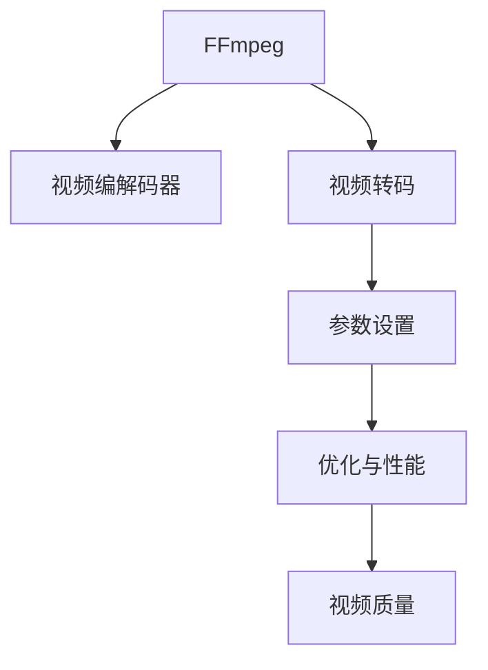

                 

# FFmpeg 转码：转换视频格式

> 关键词：FFmpeg, 视频转码, 视频格式转换, 高效转码, 视频编解码, 高质量输出

## 1. 背景介绍

### 1.1 问题由来
在数字媒体时代，视频格式繁多，不同格式之间的转换需求日益频繁。无论是设备兼容、传输需求还是存档需求，都可能需要在不同的视频格式间进行转换。如何高效、高质量地实现视频格式转换，是每个视频工作者必须面对的问题。

### 1.2 问题核心关键点
视频格式转换的核心问题在于如何在保证视频质量的前提下，尽可能高效地完成转换。这包括但不限于以下几个方面：
- 转码工具的选择和配置
- 转换参数的设定
- 转码过程中的性能优化
- 输出格式的质量保证
- 转换后的视频稳定性

### 1.3 问题研究意义
FFmpeg是一款功能强大、开源免费的视频处理工具，支持多种视频格式的编解码、转码、合并、分割等操作。掌握FFmpeg的使用，可以大幅提升视频格式转换的效率和质量，节省人力物力，提高工作效率。

## 2. 核心概念与联系

### 2.1 核心概念概述

- **FFmpeg**：一款开源、跨平台的视频处理工具，支持多种视频编解码器和格式转换。
- **视频编解码器**：将视频数据压缩和解压缩的软件或硬件模块，常见如H.264、H.265、VP9等。
- **视频转码**：将一种视频格式转换为另一种视频格式的过程，常见格式如MP4、AVI、MOV等。
- **参数设置**：FFmpeg支持通过命令行参数设定转码参数，包括分辨率、码率、编解码器等。
- **优化与性能**：转码过程中可以通过优化设置来提升性能，如使用硬件加速、选择合适的编解码器等。
- **视频质量**：转码后视频的质量，通常通过帧率、分辨率、码率等参数来衡量。

这些概念之间的逻辑关系可以通过以下Mermaid流程图来展示：



这个流程图展示了FFmpeg的核心功能及其内部工作机制：

1. FFmpeg通过调用视频编解码器完成视频数据的编码和解码。
2. 通过视频转码功能，FFmpeg能够实现不同格式间的转换。
3. 转码过程中通过参数设置和性能优化，保证高质量输出。
4. 最终生成的视频质量由帧率、分辨率、码率等参数共同决定。

## 3. 核心算法原理 & 具体操作步骤
### 3.1 算法原理概述

FFmpeg的转码过程主要基于以下几个算法：

- **编解码算法**：如H.264、H.265、VP9等，用于将视频数据压缩和解压缩。
- **视频转码算法**：将一种视频格式转换为另一种视频格式，如MP4转AVI等。
- **参数优化算法**：通过选择合适的参数，如分辨率、码率、编解码器等，最大化视频质量。

FFmpeg的转码算法基于编解码器的内部机制，通过将原始视频数据按照指定格式重新编码生成新的视频数据，实现格式转换。这一过程可以通过命令行参数进行控制，以实现最优的转换效果。

### 3.2 算法步骤详解

FFmpeg的视频转码过程主要包括以下步骤：

1. **安装与配置FFmpeg**：
   - 从FFmpeg官网下载最新版本的安装包，按照安装手册进行安装。
   - 在`~/.bashrc`或`~/.bash_profile`中添加FFmpeg的路径，使命令在所有Shell中都能使用。

2. **准备源视频和目标格式**：
   - 选择需要进行格式转换的视频文件。
   - 确定目标视频文件格式，如MP4、AVI、MOV等。

3. **设定转码参数**：
   - 使用`-vf`参数指定输出视频格式和编解码器。
   - 使用`-qp`参数设置输出视频的码率。
   - 使用`-vf`参数设置输出视频的分辨率。

4. **执行转码**：
   - 在终端中执行转码命令，将源视频文件转换为目标视频文件。

5. **性能优化**：
   - 使用硬件加速（如`-vc`参数指定编解码器）提升转码速度。
   - 使用多线程（如`-thread`参数指定线程数）优化并行处理。
   - 使用日志文件记录转码过程，及时发现并解决性能问题。

6. **输出质量检查**：
   - 使用媒体播放器（如VLC、QuickTime Player）播放转码后的视频文件，检查质量。
   - 使用视频质量评估工具（如FFmpeg内置的`ffmpeg -i <input> -vf format=<format> -c:v <codec> -f <output>`命令）评估转码前后的质量差异。

### 3.3 算法优缺点

FFmpeg的转码算法具有以下优点：

- **跨平台支持**：FFmpeg支持Windows、Linux、macOS等多个平台，便于在不同环境中使用。
- **高度自定义**：通过命令行参数，可以高度自定义转码参数，灵活应对不同需求。
- **高效性能**：使用硬件加速和多线程技术，转码速度较快。
- **开源免费**：免费使用，支持社区贡献和持续优化。

同时，该算法也存在一些局限性：

- **学习曲线陡峭**：初次使用可能因命令参数过多而感到困惑，需要一定的学习成本。
- **性能瓶颈**：面对超高清视频或复杂编解码器时，转码速度可能受限。
- **兼容性问题**：一些较老的视频格式可能不支持某些新特性。
- **日志调试困难**：由于转码过程复杂，日志文件庞大，调试时难以快速定位问题。

### 3.4 算法应用领域

FFmpeg的视频转码技术广泛应用于以下几个领域：

- **多媒体制作**：如视频剪辑、特效添加等，将不同格式的素材转换为同一格式进行统一处理。
- **网络传输**：将高清视频压缩为低码率视频，方便网络传输和播放。
- **存储归档**：将不同格式的视频归档为标准格式，便于长期存储和检索。
- **流媒体服务**：将视频转换为适合流媒体服务器的格式，如HLS、DASH等。

## 4. 数学模型和公式 & 详细讲解  
### 4.1 数学模型构建

FFmpeg的视频转码过程可以通过以下几个数学模型来描述：

- **编解码模型**：
  - 输入：原始视频数据
  - 输出：压缩后的视频数据
  - 编解码算法：H.264、H.265、VP9等

- **转码模型**：
  - 输入：原始视频数据
  - 输出：目标视频数据
  - 转码算法：将一种格式转换为另一种格式，如MP4转AVI

- **参数优化模型**：
  - 输入：原始视频数据、目标格式、编解码器
  - 输出：最佳转码参数
  - 参数设置：分辨率、码率、编解码器等

### 4.2 公式推导过程

以将H.264编码的视频转换为H.265编码的视频为例，推导转码过程中的关键公式。

- **编解码公式**：
  - 输入：原始视频数据 $V$
  - 输出：压缩后的视频数据 $V'$
  
  编解码算法为：
  $$
  V' = \text{Codec}(V, \text{parameters})
  $$

- **转码公式**：
  - 输入：压缩后的视频数据 $V'$
  - 输出：目标视频数据 $V''$
  - 转码算法为：
  $$
  V'' = \text{Codec}_2(V', \text{parameters}_2)
  $$

- **参数优化公式**：
  - 输入：原始视频数据 $V$，目标格式 $F$，编解码器 $\text{Codec}_1$、$\text{Codec}_2$
  - 输出：最佳转码参数 $\text{parameters}_2$
  
  优化目标为：
  $$
  \text{parameters}_2 = \mathop{\arg\min}_{\text{parameters}_2} \text{Loss}(\text{Codec}_2(V', \text{parameters}_2), V'')
  $$
  
  其中 $\text{Loss}$ 为转码后的视频质量损失函数，如PSNR、SSIM等。

### 4.3 案例分析与讲解

假设需要将一个MP4格式的视频转换为AVI格式，视频尺寸为1920x1080，原始码率为30 Mbps，编解码器为H.264。使用FFmpeg的命令如下：

```bash
ffmpeg -i input.mp4 -vcodec h264 -f avi output.avi
```

其中，`-vcodec h264`指定使用H.264编解码器，`-f avi`指定输出AVI格式。

## 5. 项目实践：代码实例和详细解释说明
### 5.1 开发环境搭建

为了进行FFmpeg的视频转码实践，需要以下环境：

- 安装FFmpeg：从官网下载最新版本的安装包，按照安装手册进行安装。
- 配置环境变量：在`~/.bashrc`或`~/.bash_profile`中添加FFmpeg的路径，使命令在所有Shell中都能使用。

### 5.2 源代码详细实现

假设需要将一个MP4格式的视频转换为H.265格式的视频，具体命令如下：

```bash
ffmpeg -i input.mp4 -c:v libx265 -preset veryslow -crf 23 -c:a aac -b:a 320k output.avi
```

具体参数说明如下：

- `-i input.mp4`：指定输入视频文件。
- `-c:v libx265`：使用libx265编解码器。
- `-preset veryslow`：设置编码速度。
- `-crf 23`：设置压缩率，值越小压缩率越低，视频质量越高。
- `-c:a aac -b:a 320k`：保留音频并设置码率。
- `output.avi`：输出视频文件。

### 5.3 代码解读与分析

**代码详细说明**：
- `ffmpeg`：调用FFmpeg进行视频转码。
- `-i input.mp4`：指定输入视频文件为`input.mp4`。
- `-c:v libx265`：指定视频编解码器为`libx265`。
- `-preset veryslow`：设置编码速度为`veryslow`，以获取更好的视频质量。
- `-crf 23`：设置压缩率为`23`，以在保证质量的前提下降低码率。
- `-c:a aac -b:a 320k`：保留音频并设置码率为`320k`。
- `output.avi`：输出视频文件为`output.avi`。

**代码分析**：
- `ffmpeg`命令通过命令行参数，高度自定义视频转码过程。
- `-i`参数指定输入文件，`-c:v`和`-c:a`分别指定视频和音频的编解码器。
- `-preset`和`-crf`参数控制编码速度和压缩率，`-c:a`和`-b:a`参数控制音频编解码和码率。
- `output.avi`指定输出文件名，FFmpeg会根据命令行参数自动生成输出文件格式。

### 5.4 运行结果展示

执行上述命令后，将在当前目录下生成一个名为`output.avi`的AVI格式视频文件。

使用VLC等媒体播放器打开该视频，可以检查转换后视频的播放效果和质量。使用FFmpeg的内置命令`ffmpeg -i output.avi -vf format=<format> -c:v <codec> -f <output>`可以进一步评估视频质量，确保转码效果符合预期。

## 6. 实际应用场景

### 6.1 多媒体制作

在多媒体制作中，需要将不同格式的素材统一转换为标准格式进行后期处理。例如，将从不同来源拍摄的视频素材转换为MP4格式，方便后期剪辑和编辑。

### 6.2 网络传输

在网络传输中，需要将大尺寸的高清视频转换为低码率格式，以减少传输时间和带宽消耗。例如，将4K视频转换为720p格式，适用于网络传输和流媒体服务。

### 6.3 存储归档

在存储归档中，需要将不同格式的视频统一转换为标准格式，便于长期存储和检索。例如，将所有视频转换为MP4格式，方便后续管理。

### 6.4 流媒体服务

在流媒体服务中，需要将视频转换为适合流媒体服务器的格式，如HLS、DASH等。例如，将高清视频转换为HLS格式，方便在流媒体平台上进行播放。

## 7. 工具和资源推荐
### 7.1 学习资源推荐

- **FFmpeg官方文档**：FFmpeg的官方文档提供了详细的命令参数说明和应用案例。
- **YouTube教程**：YouTube上有许多视频教程，可以帮助初学者快速上手。
- **FFmpeg官网社区**：FFmpeg的社区提供了丰富的资源和技术支持。

### 7.2 开发工具推荐

- **VLC媒体播放器**：免费的开源媒体播放器，支持多种视频格式播放和转换。
- **QuickTime Player**：苹果公司提供的免费媒体播放器，支持多种视频格式转换。
- **Handbrake**：开源免费的视频转换工具，支持多种编解码器和格式转换。

### 7.3 相关论文推荐

- **"FFmpeg: A Powerful Video Processing Tool"**：介绍FFmpeg的原理和应用。
- **"Video Compression Algorithms: A Survey"**：详细介绍了视频编解码算法的原理和应用。
- **"Video Format Conversion and Its Application"**：讨论视频格式转换的原理和应用场景。

## 8. 总结：未来发展趋势与挑战

### 8.1 总结

本文对FFmpeg的视频转码技术进行了详细讲解，包括转码算法原理、操作步骤和具体实践。通过本节的系统梳理，可以全面掌握FFmpeg的使用方法，实现高效、高质量的视频格式转换。

### 8.2 未来发展趋势

FFmpeg的视频转码技术将呈现以下几个发展趋势：

- **转码效率提升**：随着硬件加速和多线程技术的发展，转码速度将进一步提升。
- **新编解码器的支持**：FFmpeg会持续支持更多的编解码器，如AV1、HEVC等。
- **智能化转码**：引入机器学习技术，自动优化转码参数，提升转码质量。
- **实时转码**：支持实时转码，满足流媒体等实时应用的需求。
- **云平台支持**：支持云平台，方便通过API进行远程视频转换。

### 8.3 面临的挑战

FFmpeg的视频转码技术在迈向更高性能和智能化转码的过程中，仍面临以下挑战：

- **学习曲线陡峭**：由于参数设置复杂，初学者可能需要较长时间的学习和实践。
- **性能瓶颈**：面对超高清视频和复杂编解码器时，转码速度可能受限。
- **兼容性问题**：一些较老的视频格式可能不支持某些新特性。
- **日志调试困难**：由于转码过程复杂，日志文件庞大，调试时难以快速定位问题。

### 8.4 未来突破

为了克服这些挑战，未来的研究需要在以下几个方面寻求新的突破：

- **简化参数设置**：引入智能化转码参数推荐算法，减少用户的学习成本。
- **优化编解码器**：通过优化编解码器内部算法，提升转码速度和质量。
- **引入机器学习**：结合机器学习技术，自动优化转码参数，提升转码质量。
- **引入云平台**：通过云平台支持，实现实时视频转换和远程转码。
- **提升兼容性**：不断扩展对老视频格式的兼容支持，满足更多应用需求。

## 9. 附录：常见问题与解答

**Q1：FFmpeg如何进行视频编解码？**

A: FFmpeg通过调用内部编解码器进行视频编解码。例如，使用`-c:v libx264`指定编解码器为libx264，进行H.264编解码。

**Q2：FFmpeg如何进行视频转码？**

A: 使用`-vf`参数指定输出格式和编解码器，例如`-vf format=mp4 -c:v libx265`指定转换为MP4格式，使用libx265编解码器。

**Q3：FFmpeg如何进行参数优化？**

A: 使用`-preset`参数控制编码速度，使用`-crf`参数控制压缩率，使用`-qp`参数控制码率。例如，`-preset veryslow -crf 23 -qp 40`指定使用低压缩率和高码率。

**Q4：FFmpeg如何进行视频质量检查？**

A: 使用`ffmpeg -i input.mp4 -vf format=<format> -c:v <codec> -f <output>`命令评估视频质量，例如`ffmpeg -i input.mp4 -vf format=mp4 -c:v libx264 -f avi output.avi -vf fps=30`指定输出格式为MP4，编解码器为libx264，帧率为30fps。

---

作者：禅与计算机程序设计艺术 / Zen and the Art of Computer Programming

