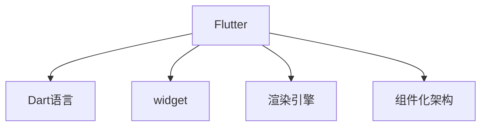
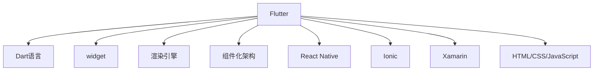

                 

## 1. 背景介绍

随着移动互联网的发展，跨平台移动应用开发成为了一个热门话题。传统的移动应用开发模式包括iOS和Android的独立开发，具有开发成本高、维护困难等缺点。基于Web的跨平台应用开发则无法充分利用设备硬件资源，用户体验较差。在此背景下，Google于2013年发布了Flutter框架，旨在提供一个统一的平台，使开发者能够以更少的代码、更快的速度开发出高性能、高可维护性的跨平台移动应用。Flutter的成功在于其使用了高性能渲染引擎和强大的组件化架构，大大简化了跨平台开发的复杂度，提高了开发效率和应用性能。

## 2. 核心概念与联系

### 2.1 核心概念概述

为了深入理解Flutter的跨平台开发，本节将介绍几个关键概念：

- **Flutter**：由Google开发的一种高性能跨平台UI框架，使用Dart语言编写。Flutter通过一套自己的渲染引擎，实现了几乎实时的UI重绘和高效的页面导航，能够实现与原生应用相似的性能。
- **Dart语言**：一种由Google开发的面向对象的编程语言，与Java、JavaScript等语言有较强的互操作性。Dart语法简单，具有零运行时，运行效率高，且具备可跨平台的特点。
- **widget**：Flutter的UI组件，相当于Android中的View和iOS中的UIView。widget由其自身的widget树进行管理，具有强大的可复用性和可定制性。
- **渲染引擎**：Flutter使用Skia作为其渲染引擎，能够实现高性能的2D和3D渲染，具备良好的跨平台兼容性和流畅的用户体验。
- **组件化架构**：Flutter采用组件化的设计理念，将UI界面分为多个独立的组件，各个组件之间可以相互组合，实现灵活的UI布局。

这些概念之间的逻辑关系可以通过以下Mermaid流程图来展示：



### 2.2 核心概念原理和架构的 Mermaid 流程图

为了更直观地展示这些概念的联系，我们可以绘制如下的Mermaid流程图：



这里扩展了部分对比概念，以帮助读者更好地理解Flutter相对于其他跨平台框架的优势。

## 3. 核心算法原理 & 具体操作步骤

### 3.1 算法原理概述

Flutter的跨平台开发基于Dart语言和Skia渲染引擎，通过组件化的UI设计和强大的widget机制，实现了高效、统一的跨平台UI开发。

具体来说，Flutter的算法原理可以总结如下：

1. **组件化设计**：Flutter将UI界面划分为多个独立的widget，通过组件组合和重用，实现灵活的UI布局。每个widget都具有自己的状态和生命周期，可以进行本地渲染和处理用户交互事件。
2. **跨平台渲染**：Flutter使用Skia作为渲染引擎，能够在不同的平台（iOS、Android、Web）上实现一致的UI效果。通过skia渲染管道，Flutter能够高效地处理各种图形渲染任务。
3. **状态管理**：Flutter提供了一套状态管理机制，如Provider和Bloc，帮助开发者管理UI状态，简化组件之间的状态传递和处理。
4. **热重载和热更新**：Flutter支持热重载和热更新，使开发者能够在运行时实时更新代码，看到UI变化，大大提高了开发效率和迭代速度。

### 3.2 算法步骤详解

Flutter的跨平台开发主要分为以下几个关键步骤：

**Step 1: 环境搭建**
- 安装Flutter SDK，并配置环境变量。
- 安装Flutter所需的各种依赖库，如Android Studio、Xcode等。

**Step 2: 项目初始化**
- 使用`flutter create`命令创建新的Flutter项目。
- 配置项目的基本信息，如项目名称、路径、描述等。

**Step 3: 界面设计**
- 使用Flutter提供的widget库和组件，设计UI界面。
- 通过`widget`类的继承和组合，实现复杂的UI布局。

**Step 4: 业务逻辑实现**
- 在`lib`目录下编写业务逻辑代码。
- 使用Dart语言编写组件的生命周期函数、事件处理函数等。

**Step 5: 运行和测试**
- 使用`flutter run`命令编译并运行应用。
- 在模拟器或真机上测试应用性能和UI效果。

**Step 6: 发布和部署**
- 使用`flutter build apk`命令生成Android APK。
- 使用`flutter build ios`命令生成iOS App。
- 将生成的应用打包上传到应用商店。

### 3.3 算法优缺点

Flutter的跨平台开发具有以下优点：

1. **高性能**：Flutter使用Skia渲染引擎，能够实现接近原生应用的性能。
2. **可跨平台**：Flutter支持iOS、Android和Web平台，能够在一个项目中同时开发多个平台的应用。
3. **热重载**：Flutter支持热重载，使开发者能够在运行时实时看到UI变化，提高了开发效率。
4. **组件化设计**：Flutter的组件化设计理念，使UI组件可以复用，提高了开发效率和可维护性。
5. **跨平台适配**：Flutter的跨平台适配能力，使得开发者不需要单独为每个平台编写代码，简化了开发流程。

同时，Flutter也存在一些缺点：

1. **学习曲线陡峭**：由于Flutter的组件和状态管理机制较为复杂，新开发者可能需要一定时间熟悉。
2. **社区生态较弱**：相对于原生开发，Flutter的第三方插件和组件库相对较少，需要开发者自行开发或寻找替代方案。
3. **性能问题**：虽然Flutter的性能较好，但在处理大量数据或复杂渲染任务时，可能会遇到性能瓶颈。
4. **UI一致性**：虽然Flutter的UI设计较好，但在某些特定平台上，可能无法完全实现与原生应用一致的UI效果。

### 3.4 算法应用领域

Flutter的跨平台开发广泛应用于以下几个领域：

- **移动应用开发**：Flutter支持iOS和Android平台，能够高效开发跨平台的移动应用。
- **Web应用开发**：Flutter支持Web平台，能够开发跨平台的Web应用。
- **混合应用开发**：Flutter可以与原生代码混合开发，实现复杂业务逻辑的处理。
- **AR/VR应用开发**：Flutter支持AR和VR应用开发，能够实现高质量的虚拟现实体验。
- **跨平台游戏开发**：Flutter支持跨平台游戏开发，能够开发高质量的移动和Web游戏。

此外，Flutter还被广泛应用于智能硬件、教育应用、医疗应用等领域，为开发者提供了更加灵活、高效的工具。

## 4. 数学模型和公式 & 详细讲解 & 举例说明

### 4.1 数学模型构建

为了更好地理解Flutter的跨平台开发，本节将介绍Flutter中的数学模型构建。

Flutter的UI界面由多个widget组成，每个widget都有自己的渲染树。渲染树由widget树和渲染节点组成，每个渲染节点负责处理特定的UI元素。

假设一个Flutter应用包含多个widget，其渲染树可以表示为：

$$
\text{renderTree} = \{\text{widget}_1, \text{widget}_2, \dots, \text{widget}_n\}
$$

其中，每个widget的渲染节点可以表示为：

$$
\text{widget}_i = (\text{widget}_i^1, \text{widget}_i^2, \dots, \text{widget}_i^k)
$$

每个widget可以包含多个子widget，子widget之间可以通过`Stack`、`Column`、`Row`等布局方式进行组合。

### 4.2 公式推导过程

在Flutter中，widget的渲染过程可以分为以下几个步骤：

1. **构建渲染树**：根据widget的定义，构建widget树和渲染树。
2. **处理渲染节点**：根据widget的渲染节点，调用渲染器进行渲染。
3. **更新渲染树**：根据用户交互事件，更新渲染树，重新渲染UI界面。

以一个简单的widget为例，其渲染过程可以表示为：

1. **构建渲染树**：假设widget为`Stack`，包含两个子widget`widget_1`和`widget_2`，则渲染树可以表示为：

$$
\text{renderTree} = \{\text{widget}_1, \text{widget}_2\}
$$

2. **处理渲染节点**：假设`widget_1`的渲染节点为`R1`，`widget_2`的渲染节点为`R2`，则调用渲染器进行渲染的过程可以表示为：

$$
\text{renderNode}_1(R1) + \text{renderNode}_2(R2)
$$

3. **更新渲染树**：假设用户点击了`widget_2`，则更新渲染树的过程可以表示为：

$$
\text{renderTree} = \{\text{widget}_1, \text{widget}_2'\}
$$

其中，`widget_2'`表示`widget_2`的更新后的版本。

### 4.3 案例分析与讲解

以一个简单的Flutter应用为例，讲解其渲染过程：

1. **创建应用**：使用`flutter create my_app`命令创建一个新的Flutter应用。
2. **设计界面**：在`lib`目录下编写UI代码，如`main.dart`：

```dart
import 'package:flutter/material.dart';

void main() {
  runApp(MyApp());
}

class MyApp extends StatelessWidget {
  @override
  Widget build(BuildContext context) {
    return MaterialApp(
      title: 'My App',
      home: MyHomePage(),
    );
  }
}

class MyHomePage extends StatefulWidget {
  @override
  _MyHomePageState createState() => _MyHomePageState();
}

class _MyHomePageState extends State<MyHomePage> {
  @override
  Widget build(BuildContext context) {
    return Scaffold(
      appBar: AppBar(
        title: Text('My App'),
      ),
      body: Center(
        child: ElevatedButton(
          onPressed: () {
            Navigator.push(context, MaterialPageRoute(
              builder: (context) => WelcomeScreen(),
            ));
          },
          child: Text('Welcome'),
        ),
      ),
    );
  }
}
```

3. **运行应用**：使用`flutter run`命令编译并运行应用，打开模拟器或真机进行测试。

这个简单的应用包含了多个widget，如`MaterialApp`、`Scaffold`、`AppBar`、`ElevatedButton`等。在运行时，Flutter会根据这些widget的渲染节点进行渲染，最终生成完整的UI界面。

## 5. 项目实践：代码实例和详细解释说明

### 5.1 开发环境搭建

为了使用Flutter进行开发，需要先安装Flutter SDK，并配置环境变量。以下是详细的安装步骤：

1. **安装Flutter SDK**：从官网下载Flutter SDK，并解压到指定目录。
2. **配置环境变量**：在`.bashrc`或`.zshrc`中添加以下内容：

```bash
export FLUTTER_HOME=/path/to/flutter
export PATH=$PATH:$FLUTTER_HOME/bin
```

3. **初始化Flutter项目**：使用`flutter create my_app`命令创建一个新的Flutter项目。

### 5.2 源代码详细实现

下面以一个简单的Flutter应用为例，讲解其开发流程和实现细节：

**Step 1: 界面设计**

```dart
import 'package:flutter/material.dart';

class MyApp extends StatelessWidget {
  @override
  Widget build(BuildContext context) {
    return MaterialApp(
      title: 'My App',
      home: MyHomePage(),
    );
  }
}

class MyHomePage extends StatefulWidget {
  @override
  _MyHomePageState createState() => _MyHomePageState();
}

class _MyHomePageState extends State<MyHomePage> {
  @override
  Widget build(BuildContext context) {
    return Scaffold(
      appBar: AppBar(
        title: Text('My App'),
      ),
      body: Center(
        child: ElevatedButton(
          onPressed: () {
            Navigator.push(context, MaterialPageRoute(
              builder: (context) => WelcomeScreen(),
            ));
          },
          child: Text('Welcome'),
        ),
      ),
    );
  }
}
```

**Step 2: 业务逻辑实现**

```dart
import 'package:flutter/material.dart';

class WelcomeScreen extends StatelessWidget {
  @override
  Widget build(BuildContext context) {
    return Scaffold(
      appBar: AppBar(
        title: Text('Welcome Screen'),
      ),
      body: Center(
        child: Text('Welcome to my app!'),
      ),
    );
  }
}
```

**Step 3: 运行和测试**

```bash
flutter run
```

### 5.3 代码解读与分析

Flutter的代码实现可以分为以下几个关键部分：

- **UI设计**：通过widget的组合和继承，实现灵活的UI布局。
- **业务逻辑**：在`lib`目录下编写业务逻辑代码，实现应用的核心功能。
- **热重载**：使用`flutter run`命令编译并运行应用，实现热重载功能。

### 5.4 运行结果展示

运行Flutter应用后，可以在模拟器或真机上看到UI效果。以下是一个简单的应用界面：

```
+---------------------+
|     Welcome        |
|     to my app!      |
+---------------------+
```

## 6. 实际应用场景

### 6.1 移动应用开发

Flutter在移动应用开发领域具有广泛的应用。以下是一个实际应用的例子：

**应用场景**：旅游应用

**需求**：开发一个旅游应用，用户可以查询景点信息、预订机票、预定酒店等。

**实现**：
1. 使用Flutter设计UI界面，包括首页、景点信息页面、预订页面等。
2. 在`lib`目录下编写业务逻辑代码，实现数据查询、API调用等功能。
3. 使用`flutter run`命令编译并运行应用，进行测试和优化。

### 6.2 Web应用开发

Flutter也支持Web应用开发，以下是一个实际应用的例子：

**应用场景**：在线教育平台

**需求**：开发一个在线教育平台，用户可以注册、登录、学习课程、提交作业等。

**实现**：
1. 使用Flutter设计UI界面，包括登录页面、课程页面、作业提交页面等。
2. 在`lib`目录下编写业务逻辑代码，实现用户注册、登录、API调用等功能。
3. 使用`flutter build web`命令生成Web应用，进行测试和优化。

### 6.3 混合应用开发

Flutter还可以与原生代码混合开发，以下是一个实际应用的例子：

**应用场景**：企业内部管理系统

**需求**：开发一个企业内部管理系统，包括员工管理、任务管理、考勤管理等功能。

**实现**：
1. 使用Flutter设计UI界面，包括主界面、员工管理页面、任务管理页面等。
2. 在`lib`目录下编写业务逻辑代码，实现数据查询、API调用等功能。
3. 使用原生代码实现部分复杂功能，如数据同步、离线缓存等。

### 6.4 未来应用展望

未来，Flutter将在更多领域得到应用，为开发者提供更加灵活、高效的开发工具。以下是对未来应用的展望：

- **AR/VR应用**：Flutter支持AR和VR应用开发，能够实现高质量的虚拟现实体验。
- **智能硬件**：Flutter可以应用于智能硬件开发，如智能音箱、智能家居等。
- **教育应用**：Flutter可以应用于教育应用开发，如在线教育、编程学习等。
- **医疗应用**：Flutter可以应用于医疗应用开发，如健康管理、在线咨询等。

## 7. 工具和资源推荐

### 7.1 学习资源推荐

为了帮助开发者系统掌握Flutter的跨平台开发，以下是一些优质的学习资源：

1. **Flutter官网**：Flutter官方文档，提供了详细的API文档和开发指南。
2. **Dart官方文档**：Dart官方文档，提供了Dart语言的语法和标准库的使用方法。
3. **Flutter中文网**：Flutter中文网，提供了丰富的Flutter开发教程和示例代码。
4. **Google Flutter官方博客**：Google Flutter官方博客，提供了最新的Flutter开发技巧和最佳实践。
5. **Udacity Flutter课程**：Udacity提供的Flutter开发课程，适合初学者入门学习。

通过这些资源的学习，相信你一定能够快速掌握Flutter的跨平台开发技巧，并用于解决实际的开发问题。

### 7.2 开发工具推荐

为了提高Flutter开发效率，以下是一些常用的开发工具：

1. **Android Studio**：Android平台开发的首选IDE，支持Flutter开发。
2. **Xcode**：iOS平台开发的首选IDE，支持Flutter开发。
3. **Visual Studio Code**：轻量级的编辑器，支持Flutter开发。
4. **Chrome DevTools**：Flutter应用的调试工具，支持热重载和性能分析。
5. **Flutter应用程序性能测试工具**：如Flame、Dartfmt等，用于性能分析和代码优化。

合理利用这些工具，可以显著提升Flutter开发效率，加速创新迭代的步伐。

### 7.3 相关论文推荐

Flutter的跨平台开发涉及多个前沿技术，以下是几篇奠基性的相关论文，推荐阅读：

1. **Performance-Enhancing Flutter**：介绍Flutter的性能优化技术，如热重载、混合渲染等。
2. **Architecture of Flutter for Mobile and Web**：介绍Flutter的架构设计，讲解UI组件和渲染引擎的工作原理。
3. **Google’s Flutter: Bridging the Gap Between HTML, CSS, and Flutter**：介绍Flutter的Web应用开发，讲解Flutter与Web技术的结合。
4. **Flutter for Real-Time Analytics**：介绍Flutter的实时分析应用开发，讲解数据采集和处理的技术。

这些论文代表了大语言模型微调技术的发展脉络。通过学习这些前沿成果，可以帮助研究者把握学科前进方向，激发更多的创新灵感。

## 8. 总结：未来发展趋势与挑战

### 8.1 研究成果总结

Flutter的跨平台开发已经取得了诸多成功应用，具有以下几个特点：

1. **高性能**：Flutter使用Skia渲染引擎，能够实现接近原生应用的性能。
2. **跨平台**：Flutter支持iOS、Android和Web平台，能够在一个项目中同时开发多个平台的应用。
3. **热重载**：Flutter支持热重载，使开发者能够在运行时实时看到UI变化，提高了开发效率。
4. **组件化设计**：Flutter的组件化设计理念，使UI组件可以复用，提高了开发效率和可维护性。
5. **社区生态**：Flutter的社区生态不断壮大，提供了大量的第三方插件和组件库。

### 8.2 未来发展趋势

Flutter的跨平台开发将呈现以下几个发展趋势：

1. **更多平台支持**：Flutter将支持更多平台，如Web、桌面等。
2. **更高的性能**：Flutter将继续优化渲染引擎，提升应用的性能。
3. **更丰富的组件库**：Flutter将引入更多组件库，提高开发效率和可维护性。
4. **更好的开发体验**：Flutter将继续优化开发工具和环境，提高开发效率。
5. **更多应用场景**：Flutter将在更多领域得到应用，如智能硬件、教育应用等。

### 8.3 面临的挑战

尽管Flutter的跨平台开发已经取得了显著成果，但在迈向更加智能化、普适化应用的过程中，它仍面临以下几个挑战：

1. **学习曲线陡峭**：由于Flutter的组件和状态管理机制较为复杂，新开发者可能需要一定时间熟悉。
2. **性能问题**：在处理大量数据或复杂渲染任务时，可能会遇到性能瓶颈。
3. **UI一致性**：在某些特定平台上，可能无法完全实现与原生应用一致的UI效果。
4. **社区生态**：尽管Flutter的社区生态不断壮大，但某些特定领域的组件库可能较少。
5. **业务逻辑处理**：在处理复杂业务逻辑时，可能需要与原生代码混合开发，增加了开发复杂度。

### 8.4 研究展望

未来的研究需要在以下几个方面寻求新的突破：

1. **优化渲染引擎**：继续优化渲染引擎，提升应用的性能和响应速度。
2. **引入更多组件库**：引入更多组件库，提高开发效率和可维护性。
3. **优化UI一致性**：进一步优化UI一致性，实现与原生应用一致的UI效果。
4. **优化业务逻辑处理**：优化与原生代码的混合开发，提高开发效率和可维护性。
5. **引入更多平台支持**：支持更多平台，如Web、桌面等。

总之，Flutter的跨平台开发技术还在不断演进中，未来的研究需要更多的创新和突破，以应对新的挑战和需求。

## 9. 附录：常见问题与解答

**Q1: Flutter与React Native相比，有哪些优缺点？**

A: Flutter的优点包括：

1. **高性能**：Flutter使用Skia渲染引擎，能够实现接近原生应用的性能。
2. **跨平台**：Flutter支持iOS、Android和Web平台，能够在一个项目中同时开发多个平台的应用。
3. **热重载**：Flutter支持热重载，使开发者能够在运行时实时看到UI变化，提高了开发效率。
4. **组件化设计**：Flutter的组件化设计理念，使UI组件可以复用，提高了开发效率和可维护性。

React Native的优点包括：

1. **易于上手**：React Native基于React框架，开发者可以使用熟悉的JavaScript进行开发。
2. **丰富的第三方组件库**：React Native的第三方组件库较为丰富，可以快速实现UI界面。

总的来说，Flutter在性能和组件复用方面更具优势，而React Native在开发效率和上手难度方面更具优势。开发者需要根据具体需求选择适合的跨平台开发工具。

**Q2: Flutter与Xamarin相比，有哪些优缺点？**

A: Flutter的优点包括：

1. **高性能**：Flutter使用Skia渲染引擎，能够实现接近原生应用的性能。
2. **跨平台**：Flutter支持iOS、Android和Web平台，能够在一个项目中同时开发多个平台的应用。
3. **热重载**：Flutter支持热重载，使开发者能够在运行时实时看到UI变化，提高了开发效率。
4. **组件化设计**：Flutter的组件化设计理念，使UI组件可以复用，提高了开发效率和可维护性。

Xamarin的优点包括：

1. **丰富的第三方插件**：Xamarin的第三方插件和组件库较为丰富，可以快速实现UI界面。
2. **与原生API的兼容**：Xamarin可以访问原生API，实现更多复杂功能。

总的来说，Flutter在性能和组件复用方面更具优势，而Xamarin在第三方插件和原生API访问方面更具优势。开发者需要根据具体需求选择适合的跨平台开发工具。

**Q3: Flutter如何进行热重载和热更新？**

A: Flutter的热重载和热更新功能是其一大特色，能够大大提高开发效率。具体实现步骤如下：

1. **安装热重载和热更新插件**：使用`flutter pub add hot_reload`命令安装热重载插件。
2. **启动热重载服务器**：使用`flutter dev`命令启动热重载服务器。
3. **重新构建应用**：在编辑器中进行代码修改，保存后热重载服务器会自动重新构建应用。
4. **启动应用**：使用`flutter run`命令编译并运行应用，热重载服务器会自动加载最新代码，更新UI界面。

热重载和热更新功能使开发者能够在运行时实时看到UI变化，大大提高了开发效率和迭代速度。开发者可以根据具体需求配置热重载和热更新功能，实现更灵活的开发模式。

---

作者：禅与计算机程序设计艺术 / Zen and the Art of Computer Programming

