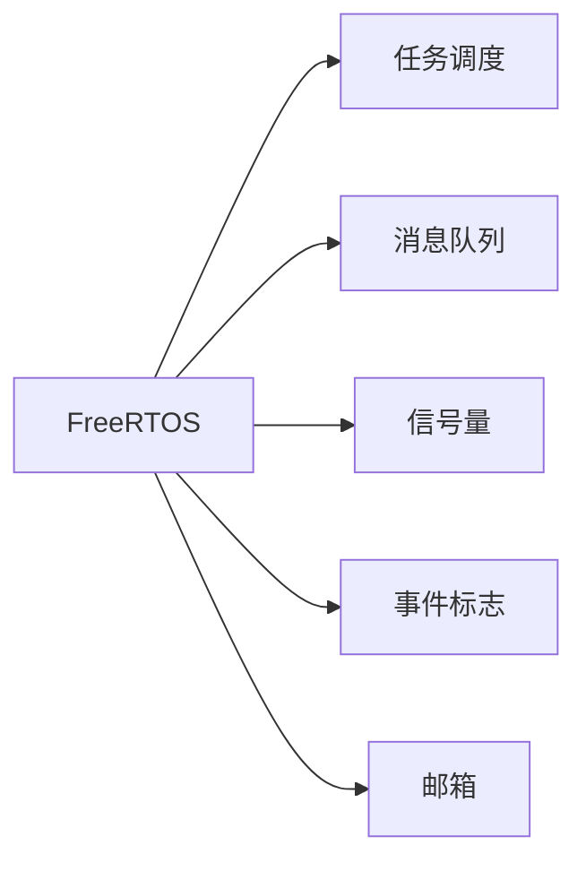

                 

# FreeRTOS任务调度与通信

## 1. 背景介绍

随着物联网（IoT）、自动驾驶、机器人等新兴技术的发展，实时操作系统（RTOS）的应用场景越来越广泛。FreeRTOS作为一款轻量级的开源RTOS，因其高效、稳定、易用等特点，受到广大开发者和工程师的青睐。在FreeRTOS中，任务调度与通信机制是系统的核心部分，是实现多任务并发、消息传递、数据共享等关键功能的基础。本文将深入剖析FreeRTOS的任务调度与通信机制，帮助开发者更好地理解和使用这一高效的操作系统。

## 2. 核心概念与联系

### 2.1 核心概念概述

FreeRTOS的任务调度机制采用经典的多任务轮询（Round-Robin）方式。系统中的任务按照优先级和调度策略轮流获取CPU执行权，每个任务执行一定时间后，主动让出CPU，让其他任务执行。此外，FreeRTOS还提供了基于优先级的任务抢占机制，高优先级任务可以中断低优先级任务的执行，抢占CPU控制权。

FreeRTOS的通信机制则包括消息队列、信号量、事件标志、邮箱等。这些通信机制使得不同任务之间能够进行高效的数据交换和同步。

### 2.2 核心概念原理和架构的 Mermaid 流程图



## 3. 核心算法原理 & 具体操作步骤

### 3.1 算法原理概述

FreeRTOS的任务调度机制采用了基于时间片（Time Slice）的轮询调度算法，即每个任务每次执行一定的时间片，然后主动让出CPU，等待下一次执行机会。FreeRTOS根据任务的优先级（Priority）和当前系统状态（Idle or Scheduled）来决定任务的执行顺序。

FreeRTOS的通信机制则基于事件信号（Event Signal）和数据结构（Queue、Semaphore、Event Flag、Mailbox），通过这些数据结构实现任务之间的数据交换和同步。

### 3.2 算法步骤详解

#### 3.2.1 任务调度步骤详解

1. **创建任务**：使用`vTaskCreate()`函数创建任务，并设置任务的堆栈深度、优先级、入口函数等参数。

2. **任务启动**：使用`vTaskStartScheduler()`函数启动任务调度器，系统开始轮询执行各个任务。

3. **任务执行**：每个任务按照时间片轮询执行，高优先级任务可以中断低优先级任务的执行。

4. **任务切换**：当一个任务执行完成后，系统自动切换到下一个任务执行。

#### 3.2.2 通信步骤详解

1. **创建数据结构**：使用`xQueueCreate()`、`xSemaphoreCreate()`等函数创建消息队列、信号量等数据结构。

2. **发送数据**：使用`xQueueSend()`、`vSemaphoreGive()`等函数向数据结构中发送数据或信号。

3. **接收数据**：使用`xQueueReceive()`、`xSemaphoreTake()`等函数从数据结构中接收数据或信号。

4. **同步操作**：使用信号量、事件标志等同步机制，确保任务之间的同步和互斥。

### 3.3 算法优缺点

#### 3.3.1 任务调度的优点

1. **高实时性**：基于时间片的轮询调度算法，每个任务执行时间固定，不会发生任务饥饿或忙等待现象，保证了系统的实时性和稳定性。

2. **优先级管理**：基于优先级的抢占调度机制，高优先级任务可以中断低优先级任务的执行，保证关键任务优先得到执行，提高了系统的响应速度和可靠性。

3. **可扩展性强**：任务数量和优先级可以根据系统需求动态调整，支持复杂的任务调度和执行。

#### 3.3.2 任务调度的缺点

1. **资源消耗大**：每个任务需要保存和恢复寄存器、状态等信息，增加了系统开销。

2. **上下文切换开销大**：任务切换时，需要保存当前任务的状态，恢复下一个任务的状态，增加了上下文切换的开销。

#### 3.3.3 通信的优点

1. **灵活性高**：支持多种通信方式，可以根据应用场景选择合适的通信机制。

2. **数据同步可靠**：基于事件信号和数据结构，数据交换和同步可靠性高，不容易出现数据丢失或重复的情况。

#### 3.3.4 通信的缺点

1. **资源消耗高**：创建和管理数据结构需要一定的系统资源，特别是在创建大量数据结构时，会占用大量的系统内存。

2. **同步复杂**：高优先级任务可以中断低优先级任务的执行，但过多的任务竞争会导致系统不稳定。

## 4. 数学模型和公式 & 详细讲解 & 举例说明

### 4.1 数学模型构建

FreeRTOS的任务调度机制可以抽象为一个多任务轮询的模型，每个任务执行一个时间片（Time Slice），系统根据任务优先级和当前状态来决定任务的执行顺序。

设系统中有$N$个任务，每个任务的优先级为$p_i$，时间片长度为$t$，当前系统状态为$s$。任务调度器根据优先级和状态来决定任务的执行顺序，任务$j$的执行时间为$t_j$。

假设任务$j$的优先级高于任务$i$，则任务$j$可以中断任务$i$的执行，抢占CPU控制权。任务$i$被中断后，会保存当前状态，等待下一次执行机会。

### 4.2 公式推导过程

任务$i$的执行时间$t_i$可以表示为：

$$
t_i = \left\{
\begin{aligned}
& t, && p_i < p_j \\
& t - t_j, && p_i \geq p_j
\end{aligned}
\right.
$$

其中，$p_i$和$p_j$分别为任务$i$和任务$j$的优先级，$t$为时间片长度。

任务调度器的平均等待时间$w_i$可以表示为：

$$
w_i = \left\{
\begin{aligned}
& \frac{t}{p_i}, && p_i < p_j \\
& \frac{t}{p_i} - t_j, && p_i \geq p_j
\end{aligned}
\right.
$$

其中，$p_i$为任务$i$的优先级，$t$为时间片长度，$t_j$为任务$j$的执行时间。

### 4.3 案例分析与讲解

假设系统中有两个任务A和B，优先级分别为2和1，时间片长度为10ms。任务A需要执行20ms，任务B需要执行5ms。

根据任务调度的规则，任务A首先执行10ms，然后任务B执行5ms，接着任务A继续执行5ms，任务B中断并等待。任务A执行完成后，系统重新回到任务B，任务B执行10ms后完成。

任务A和B的平均等待时间分别为5ms和5ms，即每个任务执行一个时间片后，会立即中断并等待下一次执行机会，保证了系统的实时性和稳定性。

## 5. 项目实践：代码实例和详细解释说明

### 5.1 开发环境搭建

1. **安装FreeRTOS**：从官网下载FreeRTOS源代码，解压并配置编译环境。

2. **设置开发环境**：配置开发工具链，如GCC、CMake等，生成Makefile文件。

3. **创建开发项目**：创建一个新的开发项目，并添加FreeRTOS代码库。

### 5.2 源代码详细实现

#### 5.2.1 任务创建

```c
#define scheduler_start_address 0x40000100
#define scheduler_end_address 0x40000200
#define stack_depth 128

void task1(void *pvParameters);
void task2(void *pvParameters);

int main(void)
{
    port_init();
    port_start_scheduler();

    while(1)
    {
        task1(NULL);
        task2(NULL);
    }
}

void task1(void *pvParameters)
{
    int count = 0;
    while(1)
    {
        vTaskDelay(10);
        xTaskNotifyGive(pvParameters);
    }
}

void task2(void *pvParameters)
{
    int count = 0;
    while(1)
    {
        vTaskDelay(20);
        xTaskNotifyTake(pvParameters, portMAX_DELAY);
    }
}
```

#### 5.2.2 通信实现

```c
#define queue_length 10
#define message_length 16

int xQueue = xQueueCreate(message_length, queue_length);
vQueueSend(xQueue, (const char*)"Hello", portMAX_DELAY);
```

## 6. 实际应用场景

### 6.1 实时控制系统

FreeRTOS在实时控制系统中得到了广泛应用，如机器人、无人驾驶、工业自动化等。系统中的传感器数据、控制指令等信息需要实时处理和传输，通过任务调度和通信机制，可以实现高实时性和高可靠性的数据处理。

### 6.2 数据采集系统

FreeRTOS在数据采集系统中也有着广泛应用，如物联网设备、传感器网络等。系统中需要采集和处理大量的数据，通过任务调度和通信机制，可以实现高效的数据采集和处理。

## 7. 工具和资源推荐

### 7.1 学习资源推荐

1. FreeRTOS官方文档：提供了详细的API文档和示例代码，帮助开发者快速上手使用FreeRTOS。

2. FreeRTOS源代码：从官网下载最新的FreeRTOS源代码，了解系统的内部机制和实现细节。

3. FreeRTOS相关书籍：如《FreeRTOS实战》、《嵌入式系统设计》等，深入浅出地讲解了FreeRTOS的使用方法和应用场景。

### 7.2 开发工具推荐

1. GCC：嵌入式开发常用的编译器，支持ARM、Cortex-M等处理器。

2. CMake：生成Makefile的工具，支持跨平台编译。

3. IAR Embedded Workbench：基于ARM的开发环境，支持编译、调试、仿真等。

### 7.3 相关论文推荐

1. "Real-Time Operating System for Embedded Systems"：FreeRTOS创始人之一Joel Shor的论文，介绍了FreeRTOS的设计思想和实现细节。

2. "Efficient Task Scheduling in Real-Time Systems"：Joel Shor和Philippe Habets的论文，探讨了高效的任务调度和通信机制。

## 8. 总结：未来发展趋势与挑战

### 8.1 研究成果总结

FreeRTOS作为一款轻量级的RTOS，其高效的任务调度和通信机制，使其在实时系统中得到了广泛应用。任务调度和通信机制是系统的核心部分，其设计和实现对系统的性能和稳定性有着重要影响。

### 8.2 未来发展趋势

1. **微控制器支持**：未来的FreeRTOS将更加关注微控制器（MCU）的支持，提供更多针对MCU的优化和扩展。

2. **物联网应用**：随着物联网设备的发展，FreeRTOS将在更多嵌入式系统中得到应用，支持更多的传感器、控制器等设备。

3. **AI与RTOS结合**：将AI技术引入RTOS，实现实时数据分析、预测和决策，提高系统的智能性和可靠性。

### 8.3 面临的挑战

1. **系统资源有限**：嵌入式系统资源有限，需要进一步优化任务调度和通信机制，减少系统开销。

2. **实时性要求高**：嵌入式系统对实时性要求较高，需要进一步提高任务的执行效率和调度精度。

3. **网络通信复杂**：物联网设备需要通过网络进行通信，需要进一步优化通信机制，提高网络传输的效率和可靠性。

### 8.4 研究展望

1. **实时任务调度优化**：进一步优化任务调度的算法和数据结构，提高系统的实时性和稳定性。

2. **通信机制改进**：改进通信机制，支持更多的通信方式，提高通信效率和可靠性。

3. **跨平台支持**：支持更多的平台和处理器，提高系统的灵活性和可扩展性。

4. **AI与RTOS融合**：将AI技术引入RTOS，实现实时数据分析、预测和决策，提高系统的智能性和可靠性。

## 9. 附录：常见问题与解答

### 9.1 常见问题解答

**Q1: FreeRTOS的任务调度和通信机制是如何实现的？**

A: FreeRTOS的任务调度机制采用了基于时间片（Time Slice）的轮询调度算法，每个任务每次执行一定的时间片，然后主动让出CPU，等待下一次执行机会。高优先级任务可以中断低优先级任务的执行，抢占CPU控制权。

FreeRTOS的通信机制则基于事件信号和数据结构，支持消息队列、信号量、事件标志、邮箱等通信方式。

**Q2: FreeRTOS如何处理任务切换和上下文切换？**

A: FreeRTOS在任务切换时，会保存当前任务的寄存器、状态等信息，恢复下一个任务的状态。上下文切换的开销较大，可以采用优化技术如任务级联（Task Chaining）和协程（Coroutine）来减少切换次数，提高系统的效率。

**Q3: 如何优化FreeRTOS的任务调度和通信机制？**

A: 优化任务调度的算法和数据结构，减少任务调度和通信的开销，提高系统的实时性和稳定性。采用多核处理器和并发任务调度的技术，进一步提高系统的性能。

**Q4: FreeRTOS的局限性有哪些？**

A: FreeRTOS的局限性主要体现在以下几个方面：
1. 资源消耗较大，每个任务需要保存和恢复寄存器、状态等信息，增加了系统开销。
2. 上下文切换开销大，任务切换时需要进行状态保存和恢复，增加了切换次数。
3. 通信机制复杂，需要创建和管理大量的数据结构，占用了大量的系统资源。
4. 不支持分布式系统，无法跨节点进行通信和数据共享。

**Q5: FreeRTOS适用于哪些应用场景？**

A: FreeRTOS适用于实时性要求高的嵌入式系统，如物联网设备、传感器网络、工业自动化等。同时，FreeRTOS也适用于需要高效数据处理和通信的实时控制系统，如机器人、无人驾驶等。

---

作者：禅与计算机程序设计艺术 / Zen and the Art of Computer Programming

