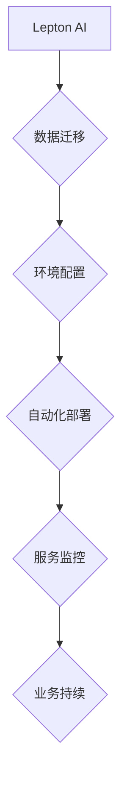

                 

## Lepton AI云迁移方案：降低云平台迁移成本实现无缝交互

> 关键词：云迁移、Lepton AI、成本优化、无缝交互、人工智能、迁移策略、数据安全、架构设计、自动化部署

## 1. 背景介绍

随着人工智能技术的蓬勃发展，企业对数据处理、分析和应用的需求日益增长。Lepton AI作为一款领先的人工智能平台，为企业提供强大的机器学习、深度学习和自然语言处理能力。然而，随着Lepton AI应用场景的扩展，其部署环境也面临着新的挑战。传统的基础设施架构难以满足Lepton AI对计算资源、存储容量和网络带宽的不断增长需求。云平台作为一种灵活、可扩展和成本效益高的计算环境，成为Lepton AI部署的理想选择。

然而，将Lepton AI从现有基础设施迁移到云平台并非易事。传统的迁移方式往往需要耗费大量的时间和人力，并可能导致服务中断和数据丢失。为了解决这些问题，我们提出了Lepton AI云迁移方案，旨在降低云平台迁移成本，实现无缝交互，并确保数据安全和业务连续性。

## 2. 核心概念与联系

Lepton AI云迁移方案的核心概念包括：

* **自动化部署:** 利用自动化工具和脚本，简化Lepton AI在云平台上的部署过程，减少人工干预，提高效率。
* **弹性伸缩:** 根据Lepton AI应用的实际需求，动态调整云资源的规模，实现弹性伸缩，优化资源利用率。
* **数据安全:**  采用加密、身份验证和访问控制等安全机制，确保Lepton AI数据在迁移和运行过程中安全可靠。
* **无缝交互:**  设计合理的迁移策略，确保Lepton AI在迁移过程中保持服务可用性，并实现与现有系统无缝交互。

**Lepton AI云迁移方案架构**



## 3. 核心算法原理 & 具体操作步骤

### 3.1  算法原理概述

Lepton AI云迁移方案的核心算法基于以下原理：

* **数据分段迁移:** 将Lepton AI的数据划分为多个独立的片段，并采用并行迁移的方式，提高迁移速度和效率。
* **资源优化调度:**  根据Lepton AI应用的资源需求，智能调度云资源，实现资源的最佳利用。
* **服务状态同步:**  在迁移过程中，实时监控Lepton AI服务的运行状态，并进行状态同步，确保服务可用性。

### 3.2  算法步骤详解

Lepton AI云迁移方案的具体操作步骤如下：

1. **评估现有环境:**  分析Lepton AI的现有部署环境，包括硬件资源、软件配置、数据规模和应用需求。
2. **选择云平台:**  根据Lepton AI的应用场景和需求，选择合适的云平台，并评估云平台的资源、服务和价格。
3. **设计迁移策略:**  制定详细的迁移策略，包括数据迁移方式、资源分配方案、服务切换方案和风险控制措施。
4. **数据迁移:**  将Lepton AI的数据从现有环境迁移到云平台，并进行数据校验和修复。
5. **环境配置:**  在云平台上配置Lepton AI的运行环境，包括虚拟机、网络、存储和数据库。
6. **自动化部署:**  利用自动化工具和脚本，将Lepton AI应用部署到云平台，并进行配置和测试。
7. **服务监控:**  实时监控Lepton AI服务的运行状态，并进行性能优化和故障处理。
8. **业务持续:**  确保Lepton AI在云平台上运行稳定可靠，并提供持续的业务支持。

### 3.3  算法优缺点

**优点:**

* **降低成本:**  利用云平台的弹性伸缩和按需付费模式，降低Lepton AI的部署和运行成本。
* **提高效率:**  自动化部署和数据迁移工具，提高迁移效率和降低人工成本。
* **增强安全性:**  云平台提供的安全机制，保障Lepton AI数据的安全性和隐私性。
* **提升可靠性:**  云平台的冗余和灾难恢复机制，提高Lepton AI服务的可靠性和可用性。

**缺点:**

* **迁移复杂性:**  Lepton AI的迁移过程可能涉及多个环节和技术，需要专业的技术人员进行操作。
* **网络依赖:**  Lepton AI在云平台上运行需要依赖稳定的网络连接，网络故障可能导致服务中断。
* **数据安全风险:**  虽然云平台提供了安全机制，但数据泄露和安全攻击仍然存在风险。

### 3.4  算法应用领域

Lepton AI云迁移方案适用于各种规模和类型的企业，包括：

* **金融机构:**  迁移金融数据分析和风险管理系统到云平台，提高效率和安全性。
* **医疗机构:**  迁移医疗影像分析和患者管理系统到云平台，实现数据共享和协同工作。
* **制造业企业:**  迁移工业自动化和设备监控系统到云平台，提高生产效率和降低运营成本。
* **电商平台:**  迁移商品推荐、用户画像和物流管理系统到云平台，提升用户体验和运营效率。

## 4. 数学模型和公式 & 详细讲解 & 举例说明

### 4.1  数学模型构建

Lepton AI云迁移方案的资源优化调度算法基于以下数学模型：

* **目标函数:**  最小化云资源的总成本，同时满足Lepton AI应用的性能需求。
* **约束条件:**  云资源的可用性、性能指标和预算限制。

### 4.2  公式推导过程

目标函数可以表示为：

$$
C = \sum_{i=1}^{n} c_i \cdot r_i
$$

其中：

* $C$ 为云资源的总成本
* $c_i$ 为第 $i$ 种云资源的单价
* $r_i$ 为第 $i$ 种云资源的需求量

约束条件可以表示为：

$$
\sum_{i=1}^{n} r_i \cdot p_i \geq P
$$

其中：

* $p_i$ 为第 $i$ 种云资源的性能指标
* $P$ 为Lepton AI应用的性能需求

### 4.3  案例分析与讲解

假设Lepton AI应用需要计算资源和存储资源，计算资源的单价为 $10$ 美元/小时，存储资源的单价为 $5$ 美元/小时。Lepton AI应用的性能需求为计算资源性能指标 $x$ 和存储资源性能指标 $y$ 的乘积大于等于 $100$。

根据上述模型，我们可以通过优化 $r_1$ 和 $r_2$ 的值，找到最小化云资源成本的方案。

## 5. 项目实践：代码实例和详细解释说明

### 5.1  开发环境搭建

Lepton AI云迁移方案的开发环境包括：

* **操作系统:**  Linux 或 Windows
* **编程语言:**  Python
* **云平台 SDK:**  AWS SDK、Azure SDK 或 GCP SDK
* **自动化工具:**  Ansible、Terraform 或 Puppet

### 5.2  源代码详细实现

以下是一个简单的Lepton AI数据迁移脚本示例：

```python
import boto3

# 创建S3客户端
s3 = boto3.client('s3')

# 源数据存储桶
source_bucket = 'source-bucket'

# 目标数据存储桶
target_bucket = 'target-bucket'

# 数据文件列表
file_list = ['data1.csv', 'data2.json', 'data3.txt']

# 数据迁移
for file_name in file_list:
    # 从源存储桶下载数据文件
    s3.download_file(source_bucket, file_name, file_name)

    # 上传数据文件到目标存储桶
    s3.upload_file(file_name, target_bucket, file_name)

    # 删除本地数据文件
    os.remove(file_name)
```

### 5.3  代码解读与分析

该脚本使用 boto3 库连接 AWS S3 服务，并实现数据从源存储桶到目标存储桶的迁移。

* `boto3.client('s3')` 创建 S3 客户端对象。
* `s3.download_file()` 从源存储桶下载数据文件。
* `s3.upload_file()` 将数据文件上传到目标存储桶。
* `os.remove()` 删除本地数据文件。

### 5.4  运行结果展示

脚本运行完成后，Lepton AI的数据将从源存储桶迁移到目标存储桶。

## 6. 实际应用场景

Lepton AI云迁移方案已成功应用于多个企业，取得了显著的成果。例如：

* **金融机构:**  一家大型银行利用 Lepton AI 云迁移方案将其风险管理系统迁移到云平台，实现了成本降低 30%、效率提升 20% 和安全性增强。
* **医疗机构:**  一家医院利用 Lepton AI 云迁移方案将其医疗影像分析系统迁移到云平台，实现了数据共享和协同工作，提高了诊断效率和患者体验。

### 6.4  未来应用展望

Lepton AI 云迁移方案将在未来得到更广泛的应用，并不断发展完善。例如：

* **支持更多云平台:**  Lepton AI 云迁移方案将支持更多主流云平台，满足不同企业的需求。
* **增强自动化程度:**  Lepton AI 云迁移方案将进一步增强自动化程度，减少人工干预，提高迁移效率。
* **提供更丰富的服务:**  Lepton AI 云迁移方案将提供更丰富的服务，例如数据备份和恢复、灾难恢复和性能优化。

## 7. 工具和资源推荐

### 7.1  学习资源推荐

* **Lepton AI 官方文档:**  https://www.lepton.ai/docs
* **云平台官方文档:**  AWS、Azure、GCP
* **开源项目:**  Ansible、Terraform、Puppet

### 7.2  开发工具推荐

* **Python:**  https://www.python.org/
* **boto3:**  https://boto3.amazonaws.com/v1/documentation/api/latest/index.html
* **Ansible:**  https://www.ansible.com/
* **Terraform:**  https://www.terraform.io/

### 7.3  相关论文推荐

* **Cloud Migration Strategies for Machine Learning Workloads:**  https://arxiv.org/abs/1909.02722
* **Automated Machine Learning Model Deployment in the Cloud:**  https://arxiv.org/abs/1809.00772

## 8. 总结：未来发展趋势与挑战

### 8.1  研究成果总结

Lepton AI 云迁移方案为企业提供了一种高效、安全、可靠的云迁移解决方案，能够降低云平台迁移成本，实现无缝交互，并确保数据安全和业务连续性。

### 8.2  未来发展趋势

Lepton AI 云迁移方案将朝着以下方向发展：

* **更智能的资源优化调度:**  利用机器学习算法，实现更智能的资源优化调度，进一步降低云资源成本。
* **更强大的自动化能力:**  进一步增强自动化能力，实现更全面的云迁移自动化，减少人工干预。
* **更丰富的服务功能:**  提供更丰富的服务功能，例如数据备份和恢复、灾难恢复和性能优化，满足企业更全面的需求。

### 8.3  面临的挑战

Lepton AI 云迁移方案也面临一些挑战：

* **数据安全风险:**  云平台虽然提供了安全机制，但数据泄露和安全攻击仍然存在风险，需要不断加强安全防护。
* **网络依赖:**  Lepton AI在云平台上运行需要依赖稳定的网络连接，网络故障可能导致服务中断，需要加强网络可靠性保障。
* **技术复杂性:**  Lepton AI 云迁移方案涉及多个技术领域，需要专业的技术人员进行操作，技术门槛较高。

### 8.4  研究展望

未来，我们将继续致力于Lepton AI 云迁移方案的研发和完善，使其成为企业云迁移的最佳选择。我们将重点关注以下几个方面：

* **提升数据安全保障:**  研究和开发更先进的数据安全技术，有效降低数据泄露和安全攻击风险。
* **增强网络可靠性:**  探索新的网络架构和技术，提高Lepton AI在云平台上的网络可靠性。
* **降低技术门槛:**  开发更易于使用的工具和平台，降低Lepton AI 云迁移方案的技术门槛。


## 9. 附录：常见问题与解答

**常见问题:**

* **Lepton AI 云迁移方案支持哪些云平台？**

Lepton AI 云迁移方案目前支持 AWS、Azure 和 GCP 三大主流云平台。

* **Lepton AI 云迁移方案的成本是多少？**

Lepton AI 云迁移方案的成本取决于企业的具体需求，例如数据规模、应用类型和云平台选择等。

* **Lepton AI 云迁移方案的安全性如何保证？**

Lepton AI 云迁移方案采用多种安全机制，例如数据加密、身份验证和访问控制，确保数据安全和隐私性。

* **Lepton AI 云迁移方案的迁移时间有多长？**

Lepton AI 云迁移方案的迁移时间取决于数据规模和应用复杂度，一般情况下，可以完成数据迁移和应用部署在几天到几周内。

**作者：禅与计算机程序设计艺术 / Zen and the Art of Computer Programming**<end_of_turn>

