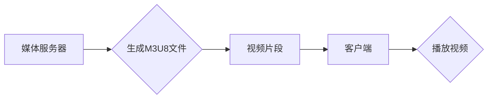

                 

## M3U8 和 HLS：分段视频传输

> 关键词：M3U8, HLS, 分段视频传输, 流媒体, 视频编码, HTTP, 直播, 点播

## 1. 背景介绍

随着互联网技术的快速发展，视频内容的消费量呈指数级增长。为了满足用户对高质量视频体验的需求，高效、可靠的视频传输技术成为关键。传统的视频传输方式存在着带宽占用大、延时高、易受网络波动影响等问题。为了解决这些问题，分段视频传输技术应运而生，其中HLS（HTTP Live Streaming）作为一种主流的分段视频传输协议，凭借其灵活、高效、适应性强等特点，广泛应用于直播、点播等场景。

HLS协议基于HTTP协议，将视频内容分割成多个小片段，并通过HTTP请求进行传输。每个片段都包含了相应的元数据，例如时间戳、片段大小等，客户端根据这些元数据，按顺序下载并播放视频片段，从而实现流畅的视频播放体验。

## 2. 核心概念与联系

### 2.1 M3U8 文件

M3U8文件是HLS协议的核心组成部分，它是一个文本文件，包含了视频片段的清单信息。M3U8文件通常包含以下信息：

* **#EXTM3U:**  标识文件为M3U8格式
* **#EXT-X-STREAM-INF:**  描述视频流的属性，例如码率、分辨率等
* **#EXTINF:**  描述每个视频片段的属性，例如持续时间、时间戳等
* **视频片段路径:**  指向每个视频片段的URL地址

### 2.2 HLS 协议架构

HLS协议的架构主要包括以下几个部分：

* **媒体服务器:**  负责将视频内容分割成片段，生成M3U8文件，并提供视频片段的HTTP服务。
* **客户端:**  负责下载M3U8文件，解析文件中的片段信息，并根据信息下载和播放视频片段。

**Mermaid 流程图**



## 3. 核心算法原理 & 具体操作步骤

### 3.1 算法原理概述

HLS协议的核心算法是视频分段和片段管理。视频分段是指将视频内容分割成多个小片段，每个片段的大小和持续时间通常在几秒到几十秒之间。片段管理是指对视频片段进行组织、存储和传输，确保客户端能够按顺序下载和播放视频片段。

### 3.2 算法步骤详解

1. **视频编码:**  将原始视频内容进行编码，生成视频流数据。
2. **视频分段:**  将视频流数据按照预设的规则分割成多个小片段。
3. **片段封装:**  将每个视频片段封装成一个HTTP请求，并附带相应的元数据，例如时间戳、片段大小等。
4. **M3U8 文件生成:**  将所有视频片段的信息存储在M3U8文件中，并提供给客户端。
5. **客户端下载:**  客户端下载M3U8文件，解析文件中的片段信息，并根据信息下载和播放视频片段。

### 3.3 算法优缺点

**优点:**

* **适应性强:**  HLS协议能够适应各种网络环境，包括带宽波动、丢包等情况。
* **低延迟:**  HLS协议采用HTTP协议进行传输，能够实现较低的延迟。
* **易于实现:**  HLS协议的实现相对简单，许多开源工具和库可以帮助开发者快速搭建HLS系统。

**缺点:**

* **带宽占用:**  HLS协议需要下载多个视频片段，可能会占用较大的带宽。
* **复杂性:**  HLS协议的实现需要考虑许多细节，例如片段大小、缓存策略等。

### 3.4 算法应用领域

HLS协议广泛应用于以下场景：

* **直播:**  直播平台使用HLS协议传输直播视频，确保用户能够流畅观看直播内容。
* **点播:**  视频点播平台使用HLS协议提供视频点播服务，用户可以根据自己的需求选择观看视频片段。
* **移动视频:**  移动设备上使用HLS协议播放视频，能够适应移动网络环境的波动。

## 4. 数学模型和公式 & 详细讲解 & 举例说明

### 4.1 数学模型构建

HLS协议的数学模型主要围绕视频片段大小、持续时间、码率等参数进行构建。

* **视频片段大小:**  通常根据网络带宽和用户设备能力进行设定，可以采用固定大小或动态调整大小。

* **视频片段持续时间:**  通常根据视频内容和用户观看习惯进行设定，可以采用固定时间或动态调整时间。

* **码率:**  根据视频质量和网络带宽进行设定，可以采用多种码率方案，例如恒定码率、可变码率等。

### 4.2 公式推导过程

HLS协议中常用的公式主要包括：

* **视频片段大小计算公式:**

$$
片段大小 = 码率 * 片段持续时间
$$

* **码率调整公式:**

$$
新码率 = 旧码率 * (网络带宽 / 目标带宽)
$$

### 4.3 案例分析与讲解

假设一个视频文件大小为1GB，目标播放码率为1Mbps，网络带宽为5Mbps。

* **视频片段大小:**  假设片段持续时间为10秒，则片段大小为：1Mbps * 10s = 10MB。
* **码率调整:**  由于网络带宽大于目标带宽，因此不需要调整码率。

## 5. 项目实践：代码实例和详细解释说明

### 5.1 开发环境搭建

HLS协议的开发环境搭建主要包括以下步骤：

1. **安装开发工具:**  例如Node.js、Python等。
2. **安装HLS库:**  例如FFmpeg、HLS.js等。
3. **配置网络环境:**  确保开发环境能够访问网络。

### 5.2 源代码详细实现

以下是一个使用Python和FFmpeg实现HLS视频分段的简单代码示例：

```python
import subprocess

# 视频文件路径
video_file = "input.mp4"

# 输出目录
output_dir = "output"

# 片段大小
segment_size = 10

# 运行FFmpeg命令进行视频分段
subprocess.run(["ffmpeg", "-i", video_file, "-f", "segment", "-segment_time", str(segment_size), "-c", "copy", f"{output_dir}/%03d.ts"])

# 生成M3U8文件
with open(f"{output_dir}/playlist.m3u8", "w") as f:
    f.write("#EXTM3U\n")
    for i in range(1, 100):
        f.write(f"#EXTINF:10,\n{output_dir}/%03d.ts\n" % i)
```

### 5.3 代码解读与分析

* 该代码首先使用FFmpeg命令将视频文件分割成多个小片段，每个片段大小为10秒。
* 然后，代码生成一个M3U8文件，包含了所有视频片段的路径信息。
* 客户端可以下载M3U8文件，解析文件中的片段信息，并根据信息下载和播放视频片段。

### 5.4 运行结果展示

运行该代码后，会在指定目录下生成多个视频片段文件和一个M3U8文件。客户端可以打开M3U8文件，播放视频内容。

## 6. 实际应用场景

### 6.1 直播场景

HLS协议广泛应用于直播场景，例如体育赛事直播、新闻直播等。直播平台使用HLS协议将直播视频分段传输，能够适应各种网络环境，确保用户能够流畅观看直播内容。

### 6.2 点播场景

HLS协议也广泛应用于点播场景，例如视频网站、在线教育平台等。点播平台使用HLS协议提供视频点播服务，用户可以根据自己的需求选择观看视频片段，并根据网络带宽动态调整码率，实现最佳的观看体验。

### 6.3 移动视频场景

HLS协议在移动视频播放中也发挥着重要作用。移动设备上网络环境通常比较复杂，HLS协议能够适应移动网络环境的波动，确保用户能够流畅观看视频内容。

### 6.4 未来应用展望

随着5G网络的普及和视频内容的不断丰富，HLS协议的应用场景将会更加广泛。未来，HLS协议可能会应用于以下领域：

* **VR/AR视频直播:**  HLS协议能够支持高分辨率和低延迟的视频传输，为VR/AR视频直播提供技术保障。
* **智能电视:**  HLS协议能够支持智能电视的个性化视频播放需求，例如根据用户观看习惯推荐视频片段。
* **边缘计算:**  HLS协议可以与边缘计算技术结合，实现更低延迟和更可靠的视频传输。

## 7. 工具和资源推荐

### 7.1 学习资源推荐

* **HLS官方文档:**  https://developer.apple.com/streaming/
* **HLS.js库文档:**  https://github.com/video-dev/hls.js
* **FFmpeg文档:**  https://ffmpeg.org/documentation.html

### 7.2 开发工具推荐

* **FFmpeg:**  开源视频处理工具，可以用于视频编码、分段、封装等操作。
* **HLS.js:**  开源HLS播放器库，可以用于在网页上播放HLS视频。
* **Node.js:**  开源JavaScript运行环境，可以用于搭建HLS服务器。

### 7.3 相关论文推荐

* **HTTP Live Streaming Protocol:**  https://www.rfc-editor.org/rfc/rfc6648
* **Adaptive Bitrate Streaming:**  https://ieeexplore.ieee.org/document/6447746

## 8. 总结：未来发展趋势与挑战

### 8.1 研究成果总结

HLS协议作为一种成熟的视频分段传输协议，在直播、点播等场景中得到了广泛应用。HLS协议的优势在于其适应性强、低延迟、易于实现等特点。

### 8.2 未来发展趋势

未来，HLS协议的发展趋势主要包括以下几个方面：

* **更高效的视频编码:**  随着视频分辨率和码率的不断提高，更高效的视频编码技术将成为HLS协议发展的关键方向。
* **更智能的码率调整:**  基于人工智能和机器学习技术的码率调整算法将能够更加智能地适应用户网络环境和观看习惯。
* **更完善的安全性机制:**  随着视频内容的价值不断提高，HLS协议的安全机制也将更加完善，以防止视频内容被盗版和非法传播。

### 8.3 面临的挑战

HLS协议也面临着一些挑战，例如：

* **网络环境复杂:**  网络环境的复杂性，例如带宽波动、丢包等，会对HLS协议的性能造成影响。
* **视频内容质量:**  视频内容的质量会直接影响用户观看体验，HLS协议需要与视频编码技术紧密结合，才能保证视频内容的质量。
* **用户设备差异:**  用户设备的差异，例如屏幕分辨率、处理器性能等，也会对HLS协议的性能造成影响。

### 8.4 研究展望

未来，HLS协议的研究方向将更加注重以下几个方面：

* **针对复杂网络环境的优化:**  研究更加鲁棒的HLS协议，能够更好地适应复杂网络环境。
* **基于人工智能的智能化优化:**  利用人工智能和机器学习技术，实现更加智能的码率调整、缓存策略等。
* **跨平台、跨设备的兼容性:**  提高HLS协议的跨平台、跨设备兼容性，能够在更多设备上实现流畅的视频播放体验。

## 9. 附录：常见问题与解答

### 9.1 为什么我的视频播放卡顿？

视频播放卡顿可能是由于以下原因造成的：

* 网络带宽不足
* 客户端设备性能不足
* 视频文件大小过大
* HLS协议配置不当

### 9.2 如何解决HLS视频播放的延迟问题？

可以尝试以下方法解决HLS视频播放的延迟问题：

* 提高网络带宽
* 使用更强大的客户端设备
* 降低视频码率
* 优化HLS协议配置，例如减少缓冲时间

### 9.3 如何选择合适的HLS协议实现方案？

选择合适的HLS协议实现方案需要考虑以下因素：

* 视频内容类型和规模
* 网络环境
* 客户端设备
* 开发成本和时间


作者：禅与计算机程序设计艺术 / Zen and the Art of Computer Programming 
<end_of_turn>

