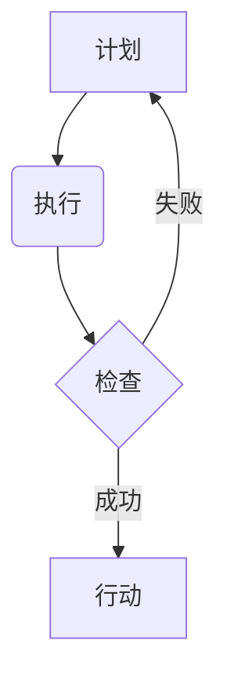

                 

## PDCA循环与管理持续改进的关系

> 关键词：PDCA循环, 持续改进, 管理, 流程优化, 质量管理, 循环迭代, 效率提升

## 1. 背景介绍

在当今快速变化的科技环境中，持续改进已成为企业保持竞争力的关键。无论是软件开发、硬件设计还是运营管理，持续改进的理念都能够帮助企业不断优化流程，提升效率，提高产品和服务质量。而PDCA循环作为一种经典的管理方法，为持续改进提供了坚实的理论基础和实践框架。

PDCA循环，全称为Plan-Do-Check-Act，意为计划-执行-检查-行动。它是一种循环迭代的管理模式，通过不断重复四个阶段，逐步改进工作流程和管理体系。PDCA循环的应用范围广泛，从个人学习到企业管理，从产品开发到服务流程，都能有效地促进持续改进。

## 2. 核心概念与联系

### 2.1 PDCA循环的四个阶段

* **Plan (计划)**： 
    * 明确目标和改进方向。
    * 制定详细的计划，包括改进措施、资源分配、时间安排等。
    * 评估计划的可行性和风险。
* **Do (执行)**： 
    * 根据计划实施改进措施。
    * 认真记录执行过程中的数据和观察结果。
* **Check (检查)**： 
    * 对执行结果进行分析和评估。
    * 比较实际结果与预期目标，找出差距和原因。
    * 总结经验教训。
* **Act (行动)**： 
    * 根据检查结果，对计划进行调整和优化。
    * 将有效的改进措施推广应用。
    * 持续改进循环。

### 2.2 PDCA循环与持续改进的关系

PDCA循环是持续改进的基石，它提供了一个清晰的框架和步骤，指导企业和个人不断地优化和提升。

* **循环迭代**: PDCA循环是一个循环的过程，通过不断重复四个阶段，可以逐步逼近目标，实现持续改进。
* **数据驱动**: PDCA循环强调数据收集和分析，通过数据来判断改进措施的有效性，确保改进措施是基于事实的。
* **过程优化**: PDCA循环关注的是流程的优化，通过改进流程，可以提高效率、降低成本、提升质量。

### 2.3  PDCA循环流程图

## 3. 核心算法原理 & 具体操作步骤

### 3.1  算法原理概述

PDCA循环本身不是一个算法，而是一种管理方法。它没有固定的算法步骤，而是提供了一个框架和思路，指导人们进行持续改进。

### 3.2  算法步骤详解

1. **计划阶段**: 
    * 明确目标：首先要明确需要改进的目标是什么，例如提高效率、降低成本、提升质量等。
    * 分析现状：对现状进行分析，找出导致目标无法实现的原因。
    * 制定计划：根据分析结果，制定具体的改进措施，包括具体的操作步骤、所需资源、时间安排等。
2. **执行阶段**: 
    * 实施计划：按照计划执行改进措施。
    * 记录数据：在执行过程中，要认真记录数据和观察结果，以便后续进行分析和评估。
3. **检查阶段**: 
    * 分析结果：对执行结果进行分析，比较实际结果与预期目标，找出差距和原因。
    * 总结经验：总结执行过程中的经验教训，为后续改进提供参考。
4. **行动阶段**: 
    * 调整计划：根据检查结果，对计划进行调整和优化。
    * 推广应用：将有效的改进措施推广应用，并持续改进循环。

### 3.3  算法优缺点

* **优点**: 
    * 简单易懂：PDCA循环的原理和步骤非常简单易懂，易于理解和实施。
    * 灵活实用：PDCA循环可以应用于各种不同的场景，例如产品开发、服务流程、质量管理等。
    * 数据驱动：PDCA循环强调数据收集和分析，确保改进措施是基于事实的。
* **缺点**: 
    * 需要时间和资源：PDCA循环需要投入时间和资源进行实施，尤其是在计划和检查阶段。
    * 难以量化：PDCA循环的改进效果难以量化，需要根据实际情况进行评估。

### 3.4  算法应用领域

PDCA循环广泛应用于各个领域，例如：

* **软件开发**: 
    * 迭代开发流程
    * 代码质量改进
    * 测试流程优化
* **制造业**: 
    * 生产流程优化
    * 质量控制
    * 持续改进项目
* **服务业**: 
    * 客户服务流程优化
    * 员工培训
    * 运营效率提升

## 4. 数学模型和公式 & 详细讲解 & 举例说明

PDCA循环本身没有固定的数学模型和公式，但我们可以用数学模型来描述和分析其各个阶段的流程和效果。例如，我们可以用以下模型来描述PDCA循环的改进效果：

$$
Improvement = \frac{Target - Actual}{Target} * 100\%
$$

其中：

* **Improvement**: 改进效果
* **Target**: 目标值
* **Actual**: 实际值

这个公式可以用来计算PDCA循环中每个阶段的改进效果，并评估改进措施的有效性。

## 5. 项目实践：代码实例和详细解释说明

由于PDCA循环是一种管理方法，而不是具体的代码实现，因此无法提供直接的代码实例。但是，我们可以通过代码示例来展示如何将PDCA循环的理念应用于软件开发项目中。

例如，假设我们想要改进一个软件的测试流程，我们可以使用PDCA循环来指导改进工作：

* **计划阶段**: 
    * 目标：提高测试覆盖率，减少软件缺陷。
    * 分析现状：目前测试覆盖率较低，缺陷率较高。
    * 计划：制定新的测试用例，增加自动化测试比例。
* **执行阶段**: 
    * 根据计划编写新的测试用例，并进行自动化测试脚本编写。
* **检查阶段**: 
    * 分析测试结果，比较测试覆盖率和缺陷率的变化。
* **行动阶段**: 
    * 根据检查结果，调整测试用例和自动化测试脚本，并推广新的测试流程。

## 6. 实际应用场景

PDCA循环在实际应用场景中非常广泛，以下是一些例子：

* **产品开发**: 
    * 新产品开发流程优化
    * 产品功能迭代改进
    * 产品质量控制
* **运营管理**: 
    * 运营流程优化
    * 效率提升项目
    * 问题解决流程
* **个人学习**: 
    * 学习计划制定
    * 学习方法改进
    * 知识体系构建

## 7. 工具和资源推荐

### 7.1  学习资源推荐

* **书籍**: 
    * 《质量管理的本质》
    * 《持续改进》
    * 《PDCA循环的应用》
* **网站**: 
    * ASQ (American Society for Quality)
    * Lean Enterprise Institute
    * Six Sigma Online

### 7.2  开发工具推荐

* **项目管理工具**: 
    * Jira
    * Trello
    * Asana
* **流程图工具**: 
    * Lucidchart
    * Draw.io
    * Visio

### 7.3  相关论文推荐

* **PDCA循环的应用研究**: 
    * 文献综述
    * 案例分析
    * 理论探讨
* **持续改进方法论**: 
    * Lean
    * Six Sigma
    * Kaizen

## 8. 总结：未来发展趋势与挑战

PDCA循环作为一种经典的管理方法，在未来仍将发挥重要作用。随着科技的进步和市场竞争的加剧，PDCA循环将不断发展和完善，并与其他管理方法相结合，形成更加强大的持续改进体系。

### 8.1  研究成果总结

* PDCA循环的应用范围不断扩大，涵盖了各个领域。
* PDCA循环的理论基础不断完善，并与其他管理方法相结合。
* PDCA循环的实践经验不断积累，形成了丰富的案例和最佳实践。

### 8.2  未来发展趋势

* **数字化转型**: 
    * 将PDCA循环与数字化工具相结合，实现数据驱动和智能化改进。
* **跨部门协作**: 
    * 推广PDCA循环的跨部门协作模式，促进企业内部的协同创新。
* **人工智能应用**: 
    * 利用人工智能技术，辅助PDCA循环的各个阶段，提高改进效率。

### 8.3  面临的挑战

* **文化阻力**: 
    * 一些企业文化难以适应PDCA循环的理念，需要克服文化阻力。
* **人才缺乏**: 
    * 缺乏熟练掌握PDCA循环的专业人才，需要加强人才培养。
* **方法推广**: 
    * PDCA循环的推广应用需要克服方法复杂性和实施难度。

### 8.4  研究展望

* 深入研究PDCA循环与其他管理方法的结合，形成更加完善的持续改进体系。
* 开发基于人工智能的PDCA循环辅助工具，提高改进效率和精准度。
* 探索PDCA循环在不同行业和领域的应用，拓展其应用范围。

## 9. 附录：常见问题与解答

* **问题**: PDCA循环需要多长时间才能看到效果？
* **答案**: PDCA循环的改进效果取决于具体的项目和情况，一般来说，需要多次循环才能看到显著的改进效果。
* **问题**: 如何评估PDCA循环的改进效果？
* **答案**: 可以通过数据分析、案例研究、问卷调查等方式评估PDCA循环的改进效果。
* **问题**: 如何克服PDCA循环的实施难度？
* **答案**: 可以从以下几个方面入手：
    * 充分沟通，获得所有利益相关者的支持。
    * 制定详细的计划，并明确责任和目标。
    * 逐步实施，并不断总结经验教训。
    * 利用工具和资源，提高效率和精准度。

作者：禅与计算机程序设计艺术 / Zen and the Art of Computer Programming 
<end_of_turn>

