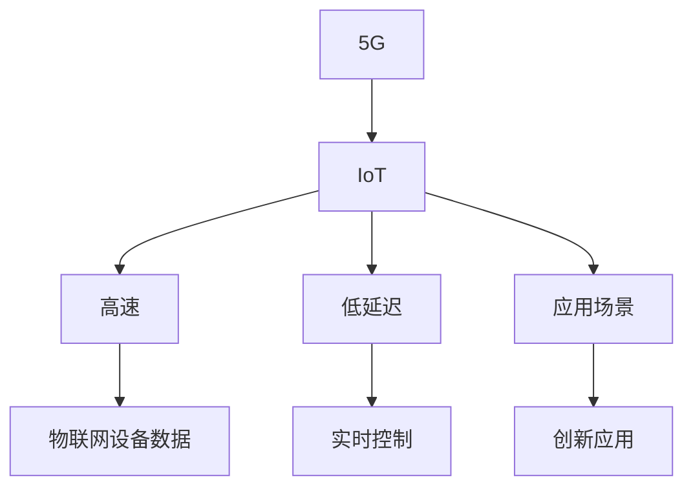

                 

# 5G 物联网应用场景：高速低延迟连接的创新应用

> 关键词：5G, 物联网(IoT), 高速, 低延迟, 应用场景, 创新

## 1. 背景介绍

### 1.1 问题由来
随着物联网(IoT)技术的迅速发展，海量的设备和传感器正在以指数级速度接入网络。从智能家居、工业制造到智慧城市、远程医疗，物联网技术在各个领域的应用不断深化，推动了社会生产生活方式的深刻变革。然而，传统的4G网络在带宽、连接数、时延等方面难以满足物联网日益增长的需求。

### 1.2 问题核心关键点
物联网设备对连接的要求非常高，既要稳定可靠，又要高效低耗。而传统的4G网络在处理海量连接和低时延任务方面显得力不从心。因此，5G网络的商用化部署成为物联网发展的关键瓶颈。5G网络凭借其极高的带宽、超低的时延和海量连接能力，能够更好地满足物联网对网络的要求。

### 1.3 问题研究意义
探讨5G网络在物联网领域的应用场景，有助于推动物联网技术在更广阔领域的应用，优化网络资源配置，提升用户感知体验，从而推动智能社会的建设和发展。

## 2. 核心概念与联系

### 2.1 核心概念概述

为更好地理解5G在物联网应用中的关键技术，本节将介绍几个密切相关的核心概念：

- 5G（第五代移动通信技术）：基于新一代无线通信技术标准，提供超高带宽、超低时延、超高可靠性的网络服务。5G网络支持大规模设备接入，支持物联网各类应用场景。

- 物联网（IoT）：通过信息传感设备，将物理世界的事物互联起来，实现智能化管理和服务。物联网的应用场景包括智能家居、智能制造、智慧城市等。

- 高速：5G网络提供极高的带宽，满足物联网设备间数据交换的需求。

- 低延迟：5G网络提供超低时延，满足实时控制、即时交互等物联网应用的需求。

- 应用场景：针对具体应用，5G网络提供定制化的网络服务，满足不同应用场景的需求。

- 创新：通过5G网络的部署和优化，推动物联网技术在垂直行业中的创新应用，提升社会生产生活水平。

这些核心概念之间的逻辑关系可以通过以下Mermaid流程图来展示：



这个流程图展示了几大核心概念及其之间的关系：

1. 5G网络提供基础网络服务。
2. 物联网设备利用5G网络进行数据交换。
3. 高速传输满足物联网数据量大、传输频繁的需求。
4. 低延迟传输满足物联网实时控制、即时交互的需求。
5. 应用场景针对具体需求进行定制化的网络优化。
6. 创新应用推动物联网技术的各行各业的应用。

## 3. 核心算法原理 & 具体操作步骤
### 3.1 算法原理概述

5G在物联网的应用，主要是通过网络切片、边缘计算等技术手段，针对不同物联网应用场景进行优化，以提供定制化的网络服务。其核心思想是：

- 网络切片：将一个物理网络划分为多个虚拟网络，每个切片独立部署，提供不同的服务质量(QoS)和性能指标。

- 边缘计算：将计算能力下移至网络边缘设备，减少数据传输延迟，提高计算效率。

- 通信技术：5G网络采用毫米波通信、大规模MIMO等先进技术，提升网络带宽和可靠性。

- 应用优化：针对不同应用场景，进行网络参数优化，提升用户体验。

### 3.2 算法步骤详解

5G物联网应用的算法步骤主要包括以下几个关键步骤：

**Step 1: 网络切片配置**
- 根据物联网应用的需求，选择适合的切片技术，如基于虚拟网络功能(VNF)的网络切片。
- 根据切片需求，配置切片的带宽、时延、可靠性等参数。

**Step 2: 边缘计算部署**
- 在网络边缘设备上部署边缘计算节点，如5G基站、无线接入点(AP)等。
- 边缘计算节点与核心网建立连接，提供数据处理能力。

**Step 3: 通信技术优化**
- 采用毫米波通信、大规模MIMO等技术，提升网络带宽和可靠性。
- 优化多址接入技术，如网络编码、非正交频分复用(OFDM)等，提升网络容量。

**Step 4: 应用场景定制**
- 针对不同应用场景，进行网络参数的优化和定制。
- 针对视频监控、工业控制等高带宽、低时延需求的应用场景，进行优化。

**Step 5: 性能评估与优化**
- 定期评估网络性能，如带宽、时延、可靠性等。
- 根据评估结果，调整网络参数，优化网络性能。

### 3.3 算法优缺点

5G物联网应用的算法具有以下优点：

1. 提供定制化的网络服务。通过网络切片和边缘计算技术，提供不同场景下的定制化服务，满足不同应用的需求。
2. 提升网络带宽和可靠性。5G网络采用先进通信技术，提供更高的带宽和更低的时延。
3. 减少数据传输延迟。通过边缘计算技术，将数据处理能力下移至网络边缘，减少数据传输延迟。

同时，该算法也存在一些局限性：

1. 设备部署成本高。部署边缘计算设备需要投入大量资金和人力，初期投入较大。
2. 网络资源调度复杂。网络切片和边缘计算的配置和调度需要高度专业化的管理能力。
3. 安全性问题。边缘计算节点部署在网络边缘，存在被攻击的风险，需要加强安全防护措施。

尽管存在这些局限性，但5G物联网应用仍是大势所趋，其带来的高速低延迟连接对物联网技术的发展具有重要意义。

### 3.4 算法应用领域

5G物联网应用的算法主要应用于以下几个领域：

- 智能家居：5G网络提供高速低延时连接，支持智能家居设备的实时控制和数据交换，如远程控制灯光、温度等。
- 智慧医疗：5G网络支持医疗设备的高频次数据传输，支持远程医疗服务，如远程监控患者健康数据。
- 智能制造：5G网络支持智能制造设备的高带宽数据传输，实现智能制造和远程维护，提高生产效率。
- 智慧城市：5G网络支持智慧城市各类应用，如智能交通、智能安防等，提升城市管理和运行效率。
- 工业互联网：5G网络支持工业互联网的高频次数据传输，提升工业设备的监测和控制能力。

以上应用场景展示了5G网络在物联网领域的应用前景，可以显著提升各行业的信息化水平，带来巨大的经济效益和社会效益。

## 4. 数学模型和公式 & 详细讲解 & 举例说明

### 4.1 数学模型构建

在本节中，我们将使用数学语言对5G物联网应用中的网络切片和边缘计算模型进行更严格的刻画。

记网络切片的带宽为 $B_s$，时延为 $D_s$，可靠性为 $R_s$，则网络切片的性能函数为：

$$
P_s = f(B_s, D_s, R_s)
$$

记边缘计算节点的计算能力为 $C_e$，带宽为 $B_e$，时延为 $D_e$，则边缘计算的性能函数为：

$$
P_e = g(C_e, B_e, D_e)
$$

5G物联网应用的数学模型为：

$$
P_{5G} = w_1 P_s + w_2 P_e
$$

其中 $w_1$ 和 $w_2$ 为权重系数，表示网络切片和边缘计算对整体性能的贡献。

### 4.2 公式推导过程

对于网络切片，采用广受关注的虚拟网络功能(VNF)切片模型，其性能函数可表示为：

$$
P_s = \frac{B_s}{f_B} \cdot \frac{1}{D_s + d_s} \cdot \frac{1}{R_s + r_s}
$$

其中 $f_B$ 为带宽利用率，$d_s$ 为数据包处理时延，$r_s$ 为数据包丢失率。

对于边缘计算，采用云边端协同的计算模型，其性能函数可表示为：

$$
P_e = \frac{C_e}{C_u} \cdot \frac{1}{B_e} \cdot \frac{1}{D_e + d_e}
$$

其中 $C_u$ 为云端计算能力，$d_e$ 为数据传输时延。

将这些公式代入5G物联网应用的数学模型中，得到：

$$
P_{5G} = w_1 \cdot \frac{B_s}{f_B} \cdot \frac{1}{D_s + d_s} \cdot \frac{1}{R_s + r_s} + w_2 \cdot \frac{C_e}{C_u} \cdot \frac{1}{B_e} \cdot \frac{1}{D_e + d_e}
$$

### 4.3 案例分析与讲解

以智能家居应用为例，分析5G网络切片和边缘计算在其中的作用。

假设智能家居设备需要传输视频流数据，带宽需求为 $B_s = 50Mbps$，时延需求为 $D_s = 1ms$，可靠性需求为 $R_s = 99.999\%$。同时，边缘计算节点的计算能力为 $C_e = 10GOPS$，带宽为 $B_e = 100Mbps$，时延为 $D_e = 0.1ms$。

根据上述公式，计算智能家居应用的性能：

$$
P_s = \frac{50Mbps}{f_B} \cdot \frac{1}{1ms + d_s} \cdot \frac{1}{99.999\% + r_s}
$$

$$
P_e = \frac{10GOPS}{C_u} \cdot \frac{1}{100Mbps} \cdot \frac{1}{0.1ms + d_e}
$$

其中 $f_B$、$d_s$ 和 $r_s$ 需要根据具体应用场景进行调整。

通过优化网络切片和边缘计算的参数，可以显著提升智能家居应用的性能，满足实时控制和数据交换的需求。

## 5. 项目实践：代码实例和详细解释说明
### 5.1 开发环境搭建

在进行5G物联网应用开发前，我们需要准备好开发环境。以下是使用Python进行PyTorch开发的环境配置流程：

1. 安装Anaconda：从官网下载并安装Anaconda，用于创建独立的Python环境。

2. 创建并激活虚拟环境：
```bash
conda create -n pytorch-env python=3.8 
conda activate pytorch-env
```

3. 安装PyTorch：根据CUDA版本，从官网获取对应的安装命令。例如：
```bash
conda install pytorch torchvision torchaudio cudatoolkit=11.1 -c pytorch -c conda-forge
```

4. 安装TensorFlow：由Google主导开发的开源深度学习框架，生产部署方便，适合大规模工程应用。同样有丰富的预训练语言模型资源。

5. 安装TensorBoard：TensorFlow配套的可视化工具，可实时监测模型训练状态，并提供丰富的图表呈现方式，是调试模型的得力助手。

6. 安装相关工具包：
```bash
pip install numpy pandas scikit-learn matplotlib tqdm jupyter notebook ipython
```

完成上述步骤后，即可在`pytorch-env`环境中开始5G物联网应用的开发。

### 5.2 源代码详细实现

下面我们以智能家居应用为例，给出使用PyTorch进行网络切片和边缘计算的PyTorch代码实现。

首先，定义网络切片和边缘计算的参数：

```python
class NetworkSlice:
    def __init__(self, bandwidth, latency, reliability):
        self.bandwidth = bandwidth
        self.latency = latency
        self.reliability = reliability
        
class EdgeCalculator:
    def __init__(self, compute_capacity, bandwidth, latency):
        self.compute_capacity = compute_capacity
        self.bandwidth = bandwidth
        self.latency = latency
```

然后，定义网络切片和边缘计算的性能函数：

```python
def network_slice_performance(slice):
    # 假设带宽利用率为80%，时延处理时延为0.1ms，数据包丢失率为0.1%
    f_B = 0.8
    d_s = 0.1
    r_s = 0.001
    return (slice.bandwidth / f_B) * (1 / (slice.latency + d_s)) * (1 / (slice.reliability + r_s))

def edge_calculator_performance(calculator):
    # 假设云端计算能力为1GOPS，数据传输时延为0.2ms
    C_u = 1e9
    d_e = 0.2
    return (calculator.compute_capacity / C_u) * (1 / calculator.bandwidth) * (1 / (calculator.latency + d_e))
```

接着，定义5G物联网应用的性能函数：

```python
def 5g_iot_performance(w1, w2, slice, calculator):
    return w1 * network_slice_performance(slice) + w2 * edge_calculator_performance(calculator)
```

最后，启动计算过程：

```python
if __name__ == '__main__':
    # 定义网络切片和边缘计算的参数
    slice = NetworkSlice(bandwidth=50, latency=1, reliability=0.99999)
    calculator = EdgeCalculator(compute_capacity=10e9, bandwidth=100, latency=0.1)
    
    # 计算5G物联网应用的性能
    w1 = 0.5
    w2 = 0.5
    performance = 5g_iot_performance(w1, w2, slice, calculator)
    print(f"5G物联网应用性能为: {performance:.3f}")
```

以上就是使用PyTorch对5G物联网应用进行性能计算的完整代码实现。可以看到，通过定义网络切片和边缘计算的参数和性能函数，可以准确计算出5G物联网应用的性能，为进一步优化提供依据。

### 5.3 代码解读与分析

让我们再详细解读一下关键代码的实现细节：

**NetworkSlice类**：
- `__init__`方法：初始化网络切片的带宽、时延和可靠性参数。

**EdgeCalculator类**：
- `__init__`方法：初始化边缘计算的计算能力、带宽和时延参数。

**network_slice_performance函数**：
- 根据虚拟网络功能切片模型的公式，计算网络切片的性能。
- 假设带宽利用率为80%，处理时延为0.1ms，数据包丢失率为0.1%，计算网络切片的性能。

**edge_calculator_performance函数**：
- 根据云边端协同计算模型的公式，计算边缘计算的性能。
- 假设云端计算能力为1GOPS，数据传输时延为0.2ms，计算边缘计算的性能。

**5g_iot_performance函数**：
- 将网络切片和边缘计算的性能函数结合起来，计算5G物联网应用的总体性能。
- 根据权重系数 $w_1$ 和 $w_2$，计算5G物联网应用的总体性能。

**计算过程**：
- 定义网络切片和边缘计算的参数。
- 计算5G物联网应用的性能，并输出结果。

可以看到，通过这些关键代码的实现，可以准确计算出5G物联网应用的性能，为进一步优化提供依据。

## 6. 实际应用场景

### 6.1 智能家居

5G网络的高速低延迟特性，可以显著提升智能家居设备的性能，支持各种物联网应用，如智能门锁、智能照明、智能温控等。智能家居设备之间可以实时通信，实现自动化控制和故障检测，提升用户体验。

### 6.2 智慧医疗

5G网络支持医疗设备的高频次数据传输，可以实现远程医疗服务。患者可以通过5G网络将健康数据传输到云端，实时监测生命体征。医生可以通过5G网络远程诊断，提供及时的治疗方案。

### 6.3 智能制造

5G网络支持智能制造设备的高带宽数据传输，可以实现远程维护和监控。通过5G网络，制造企业可以实现生产设备的实时监测和控制，提升生产效率和设备维护的及时性。

### 6.4 智慧城市

5G网络支持智慧城市各类应用，如智能交通、智能安防等。智能交通系统可以通过5G网络实时监测交通流量，优化交通信号控制，减少拥堵。智能安防系统可以通过5G网络实时监控城市安全，提高应急响应速度。

### 6.5 工业互联网

5G网络支持工业互联网的高频次数据传输，可以实现远程监控和控制。通过5G网络，工业企业可以实现设备的远程监控和诊断，提升生产效率和设备维护的及时性。

## 7. 工具和资源推荐
### 7.1 学习资源推荐

为了帮助开发者系统掌握5G物联网应用的理论基础和实践技巧，这里推荐一些优质的学习资源：

1. 《5G网络基础与核心技术》系列博文：由5G领域专家撰写，深入浅出地介绍了5G网络的基本概念和核心技术。

2. 《5G物联网应用开发实战》课程：由知名大学开设的课程，涵盖5G物联网应用开发的基本概念、关键技术和实际案例。

3. 《5G和物联网：从理论到实践》书籍：全面介绍了5G网络和物联网技术的基本概念、核心技术和实际应用。

4. 5G网络官方文档：5G网络标准化组织提供的官方文档，包含5G网络的标准、技术细节和实际应用场景。

5. IoT设备开发教程：IoT设备开发者社区提供的教程，涵盖IoT设备的开发、测试和部署等基本技术和实际案例。

通过对这些资源的学习实践，相信你一定能够快速掌握5G物联网应用的精髓，并用于解决实际的物联网问题。

### 7.2 开发工具推荐

高效的开发离不开优秀的工具支持。以下是几款用于5G物联网应用开发的常用工具：

1. PyTorch：基于Python的开源深度学习框架，灵活动态的计算图，适合快速迭代研究。大部分预训练语言模型都有PyTorch版本的实现。

2. TensorFlow：由Google主导开发的开源深度学习框架，生产部署方便，适合大规模工程应用。同样有丰富的预训练语言模型资源。

3. OpenAI Gym：用于训练和测试强化学习算法的开源平台，提供了丰富的环境支持。

4. ROS（Robot Operating System）：用于机器人开发的开源平台，支持机器人的感知、控制和决策等功能的开发。

5. LabVIEW：用于虚拟仪器开发的软件平台，支持数据采集、分析和控制等功能的开发。

6. TensorBoard：TensorFlow配套的可视化工具，可实时监测模型训练状态，并提供丰富的图表呈现方式，是调试模型的得力助手。

合理利用这些工具，可以显著提升5G物联网应用的开发效率，加快创新迭代的步伐。

### 7.3 相关论文推荐

5G物联网应用的研究源于学界的持续研究。以下是几篇奠基性的相关论文，推荐阅读：

1. 5G Network Architecture and Key Technologies（5G网络架构与关键技术）：详细介绍5G网络的基本架构和核心技术，是5G领域的基础性论文。

2. 5G for Smart Manufacturing（5G支持智能制造）：探讨5G网络在智能制造中的应用，提出了基于5G网络的智能制造框架。

3. IoT Security in 5G Networks: Challenges and Solutions（5G网络中的IoT安全）：讨论5G网络中的IoT安全问题，提出了基于5G网络的安全解决方案。

4. Smart City 5G Systems（智慧城市的5G系统）：介绍智慧城市中的5G应用，提出基于5G网络的城市治理解决方案。

5. Edge Computing for 5G IoT Applications（5G物联网应用的边缘计算）：讨论5G物联网应用中的边缘计算技术，提出基于边缘计算的优化方案。

这些论文代表了大规模网络技术和应用的研究方向，是理解和研究5G物联网应用的重要参考。

## 8. 总结：未来发展趋势与挑战

### 8.1 总结

本文对5G在物联网应用中的关键技术进行了全面系统的介绍。首先阐述了5G网络和物联网的基本概念及其研究背景，明确了5G网络在物联网中的应用需求和前景。其次，从原理到实践，详细讲解了网络切片和边缘计算的基本原理和操作步骤，给出了5G物联网应用的完整代码实现。同时，本文还广泛探讨了5G物联网应用在智能家居、智慧医疗、智能制造等多个领域的应用前景，展示了5G网络在物联网领域的应用潜力。此外，本文精选了5G物联网应用的各类学习资源，力求为读者提供全方位的技术指引。

通过本文的系统梳理，可以看到，5G网络在物联网领域的应用前景广阔，可以显著提升各行业的信息化水平，带来巨大的经济效益和社会效益。

### 8.2 未来发展趋势

展望未来，5G物联网应用将呈现以下几个发展趋势：

1. 应用场景更加多样。5G网络支持更多的应用场景，如智能制造、智慧医疗等，推动更多行业的数字化转型。

2. 网络性能进一步提升。5G网络的带宽、时延和可靠性将进一步提升，满足更多场景的需求。

3. 网络切片和边缘计算的普及。5G网络切片和边缘计算技术将逐渐普及，实现更加灵活、定制化的网络服务。

4. 多网融合加速。5G网络将与其他通信网络如LTE、Wi-Fi等进行多网融合，实现更广的覆盖和更高的服务质量。

5. 安全防护技术加强。5G网络的安全防护技术将不断升级，保障物联网设备的安全性。

6. 大规模部署加速。5G网络的商用部署将加速推进，更多城市和企业将引入5G网络。

以上趋势凸显了5G网络在物联网领域的应用前景，为各行业的数字化转型提供了新的动力。

### 8.3 面临的挑战

尽管5G物联网应用已经取得了显著进展，但在迈向更加智能化、普适化应用的过程中，仍面临诸多挑战：

1. 设备成本高。5G网络设备和边缘计算节点的成本较高，初期投入较大。

2. 网络切片和边缘计算的复杂性。网络切片和边缘计算的配置和调度需要高度专业化的管理能力。

3. 安全性问题。5G网络的安全防护技术需要不断升级，保障物联网设备的安全性。

4. 数据隐私保护。物联网设备的数据隐私保护需要加强，防止数据泄露和滥用。

5. 资源利用率低。5G网络设备的资源利用率较低，如何提高资源利用率是一个重要课题。

尽管存在这些挑战，但5G网络在物联网领域的应用前景广阔，通过技术创新和产业合作，这些问题终将逐步得到解决。

### 8.4 研究展望

面对5G物联网应用所面临的诸多挑战，未来的研究需要在以下几个方面寻求新的突破：

1. 引入更多优化算法。引入更多优化算法，如遗传算法、粒子群算法等，优化网络切片和边缘计算的配置和调度。

2. 开发更高效的数据传输技术。开发更高效的数据传输技术，如网络编码、空分复用等，提高网络带宽和可靠性。

3. 引入更多先验知识。将符号化的先验知识，如知识图谱、逻辑规则等，与5G网络技术进行巧妙融合，提升网络性能和鲁棒性。

4. 引入更多先验知识。将符号化的先验知识，如知识图谱、逻辑规则等，与5G网络技术进行巧妙融合，提升网络性能和鲁棒性。

5. 引入更多数据源。引入更多数据源，如社交媒体、传感器等，丰富网络数据的来源，提升网络性能和鲁棒性。

这些研究方向的探索，必将引领5G网络技术迈向更高的台阶，为物联网技术的产业化进程提供新的动力。相信随着技术的不断发展，5G网络将在更多领域得到应用，推动智能社会的建设和发展。

## 9. 附录：常见问题与解答

**Q1：5G网络如何支持物联网设备的连接？**

A: 5G网络通过网络切片和边缘计算技术，支持物联网设备的连接。网络切片技术将物理网络划分为多个虚拟网络，每个切片独立部署，提供不同的服务质量(QoS)和性能指标。边缘计算技术将计算能力下移至网络边缘设备，减少数据传输延迟，提高计算效率。

**Q2：5G网络如何提升物联网设备的性能？**

A: 5G网络通过高速、低延迟、高可靠性的连接，支持物联网设备的实时控制和数据交换。高速传输满足物联网设备间数据交换的需求，低延迟传输满足实时控制和即时交互的需求。

**Q3：5G网络在物联网应用中面临哪些挑战？**

A: 5G网络在物联网应用中面临设备成本高、网络切片和边缘计算复杂、安全性问题、数据隐私保护、资源利用率低等挑战。解决这些问题需要技术创新和产业合作，推动5G网络技术的不断发展和优化。

**Q4：5G网络在物联网应用中有哪些创新应用？**

A: 5G网络在物联网应用中的创新应用包括智能家居、智慧医疗、智能制造、智慧城市和工业互联网等。通过5G网络的高带宽、低时延、高可靠性的连接，支持各种物联网应用，提升各行业的数字化水平。

总之，5G网络在物联网领域的应用前景广阔，通过技术创新和产业合作，可以推动5G网络技术的不断发展和优化，推动各行业的数字化转型。

