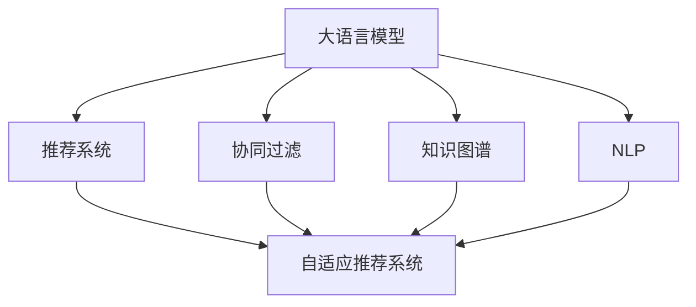

                 

# GENRE：灵活、可配置LLM推荐

> 关键词：自适应推荐系统，知识图谱，协同过滤，深度学习，自然语言处理(NLP)

## 1. 背景介绍

### 1.1 问题由来

在互联网高度发达的今天，内容推荐已成为我们获取信息的重要方式。无论是音乐、视频、新闻还是商品，推荐系统正逐渐成为人们日常生活中不可或缺的一部分。然而，传统的推荐系统往往基于固定算法，难以满足用户需求的多样性和个性化。为此，研究人员提出了一种基于自然语言处理(NLP)的推荐方法，能够结合用户的文本评论、反馈等信息，提升推荐质量。

### 1.2 问题核心关键点

大语言模型在推荐系统中的应用，主要集中在以下几个方面：

- **文本理解与生成**：利用大语言模型对用户评论、商品描述等文本进行理解，生成更准确、细腻的语义表示，以匹配用户的兴趣。
- **个性化推荐**：通过分析用户的历史行为和文本反馈，使用大语言模型为每个用户生成个性化的推荐列表。
- **跨领域推荐**：结合不同领域的数据（如音乐、电影、商品等），利用大语言模型进行信息融合，实现多领域推荐。
- **实时动态更新**：通过不断地更新预训练模型和微调，推荐系统可以实时响应用户需求和环境变化，保持推荐结果的相关性和时效性。
- **用户反馈整合**：利用自然语言处理技术对用户反馈进行分析和筛选，进一步优化推荐策略。

### 1.3 问题研究意义

基于大语言模型的推荐系统，能够更加精准地把握用户的兴趣和需求，为用户提供更具个性化的推荐内容。同时，结合知识图谱、协同过滤等传统推荐方法，可以构建更为复杂、灵活的推荐系统，覆盖更多的应用场景，提升用户的满意度和粘性。因此，研究大语言模型在推荐系统中的应用，对于提升推荐系统的性能和覆盖范围具有重要意义。

## 2. 核心概念与联系

### 2.1 核心概念概述

在讨论大语言模型在推荐系统中的应用之前，我们需要首先了解几个核心概念：

- **大语言模型(Large Language Model, LLM)**：基于Transformer架构，通过大规模无标签文本数据进行预训练，具备强大的语言理解和生成能力。如GPT-3、BERT等模型。
- **推荐系统(Recommendation System)**：通过分析用户行为、物品属性等信息，为用户推荐感兴趣的商品、内容等。
- **协同过滤(Collaborative Filtering)**：一种基于用户和物品相似性进行推荐的方法，常用于传统推荐系统。
- **知识图谱(Knowledge Graph)**：利用图结构描述实体及其关系，提供更为丰富的语义信息。
- **自然语言处理(NLP)**：涉及文本的自动理解、生成等任务，是推荐系统中不可或缺的一部分。
- **自适应推荐系统(Adaptive Recommendation System)**：能够根据用户行为和环境变化动态调整推荐策略的系统。

这些概念之间的逻辑关系可以通过以下Mermaid流程图来展示：



这个流程图展示了各大语言模型相关概念之间的联系：

1. 大语言模型通过预训练获得语言理解能力，用于推荐系统中的文本处理。
2. 协同过滤、知识图谱、NLP等技术，可以与大语言模型结合，丰富推荐系统的表现力。
3. 自适应推荐系统可以根据用户行为和环境变化，动态调整推荐策略，实现更为精准的推荐。

## 3. 核心算法原理 & 具体操作步骤
### 3.1 算法原理概述

基于大语言模型的推荐系统，主要通过以下几个步骤实现推荐：

1. **文本表示**：利用大语言模型将用户评论、商品描述等文本信息转换为向量表示。
2. **相似度计算**：通过计算用户与物品之间的相似度，找出最相关的物品。
3. **排序与推荐**：根据相似度排序，选择前N个物品进行推荐。
4. **动态更新**：通过用户反馈和环境变化，动态更新大语言模型，提升推荐效果。

这些步骤可以表示为一个推荐过程的函数 $f$，其输入为用户和物品的文本表示，输出为推荐结果的排序列表。形式化地，推荐函数可以表示为：

$$
R=f(\mathcal{U}, \mathcal{I})
$$

其中 $\mathcal{U}$ 表示用户文本表示集合，$\mathcal{I}$ 表示物品文本表示集合。

### 3.2 算法步骤详解

基于大语言模型的推荐系统一般包括以下几个关键步骤：

**Step 1: 数据预处理**
- 收集用户评论、商品描述等文本数据，并进行清洗、分词、向量化等预处理操作。
- 对于每个用户和物品，利用大语言模型生成向量表示，用于后续的相似度计算。

**Step 2: 相似度计算**
- 通过余弦相似度、TF-IDF等方法计算用户与物品之间的文本相似度。
- 对于复杂语义关系，可以利用知识图谱中实体之间的关系，进行多层次的相似度计算。

**Step 3: 排序与推荐**
- 根据相似度排序，选择前N个物品进行推荐。
- 结合用户偏好和物品属性，进行综合排序。

**Step 4: 动态更新**
- 通过用户反馈、物品更新等新数据，更新大语言模型的参数。
- 重新计算相似度，更新推荐结果。

### 3.3 算法优缺点

基于大语言模型的推荐系统具有以下优点：

- **灵活性高**：能够适应多种类型的数据和复杂的语义关系。
- **个性化强**：利用大语言模型可以深入分析用户的语义偏好，提供更精准的推荐。
- **可解释性强**：大语言模型可以解释其内部推理逻辑，帮助用户理解推荐结果。

同时，也存在一些缺点：

- **计算量大**：大语言模型通常需要高计算资源，推荐过程耗时较长。
- **数据依赖性强**：模型的效果很大程度上依赖于数据的丰富度和质量。
- **过拟合风险**：大语言模型可能过拟合于特定的训练数据，泛化性能受限。

### 3.4 算法应用领域

基于大语言模型的推荐系统在多个领域都有广泛应用，例如：

- **电商推荐**：为用户推荐商品、优惠信息等。
- **音乐推荐**：推荐用户感兴趣的音乐、歌手、专辑等。
- **视频推荐**：推荐用户喜爱的视频、电影、电视剧等。
- **新闻推荐**：为用户推荐感兴趣的新闻、文章、话题等。
- **阅读推荐**：推荐用户感兴趣的电子书、文章、博客等。

这些应用场景中，大语言模型可以深入分析用户文本评论和反馈，为用户生成个性化的推荐列表，提升用户体验。

## 4. 数学模型和公式 & 详细讲解 & 举例说明

### 4.1 数学模型构建

本节将使用数学语言对基于大语言模型的推荐系统进行严格刻画。

记用户文本表示为 $\mathcal{U}=\{x_u\}_{u=1}^U$，物品文本表示为 $\mathcal{I}=\{x_i\}_{i=1}^I$。假设大语言模型通过预训练得到用户-物品表示映射 $f: \mathcal{U} \times \mathcal{I} \rightarrow \mathbb{R}^d$，其中 $d$ 为向量维度。

定义用户与物品的相似度函数为 $s: \mathcal{U} \times \mathcal{I} \rightarrow [0,1]$。常见的相似度函数包括余弦相似度、Jaccard相似度等。在本文中，我们采用余弦相似度作为示例。

推荐函数的输出为 $R: \mathcal{U} \times \mathcal{I} \rightarrow [1,I]$，表示对用户 $u$ 推荐物品 $i$ 的优先级。

### 4.2 公式推导过程

在余弦相似度的计算中，对于任意用户 $u$ 和物品 $i$，相似度 $s(u,i)$ 定义为：

$$
s(u,i)=\frac{\mathbf{x}_u \cdot \mathbf{x}_i}{\|\mathbf{x}_u\|\|\mathbf{x}_i\|}
$$

其中 $\mathbf{x}_u$ 和 $\mathbf{x}_i$ 分别为用户 $u$ 和物品 $i$ 的向量表示，$\cdot$ 表示向量点积，$\|\cdot\|$ 表示向量的L2范数。

推荐函数 $R(u,i)$ 可以通过对相似度函数 $s(u,i)$ 进行加权平均来计算，即：

$$
R(u,i) = \alpha s(u,i) + (1-\alpha) \times \text{Popularity}(i)
$$

其中 $\alpha$ 为相似度权重的超参数，$\text{Popularity}(i)$ 表示物品 $i$ 的受欢迎程度，可以通过统计用户点击、购买等行为数据获得。

### 4.3 案例分析与讲解

假设有一个电商推荐系统，用于推荐用户喜欢的商品。系统收集了用户对商品的评论和商品描述，使用BERT模型生成文本向量表示。假设系统的参数如下：

- 用户向量维度 $d=512$，物品向量维度 $d=512$。
- 相似度权重 $\alpha=0.5$，物品受欢迎程度 $\text{Popularity}(i)$ 为商品i的销量。

对于一个用户 $u$，假设其评论向量表示为 $\mathbf{x}_u=(0.5,0.2,0.8,\ldots)$，其商品向量表示为 $\mathbf{x}_i=(0.2,0.3,0.1,\ldots)$。

计算用户 $u$ 与商品 $i$ 的余弦相似度为：

$$
s(u,i) = \frac{\mathbf{x}_u \cdot \mathbf{x}_i}{\|\mathbf{x}_u\|\|\mathbf{x}_i\|} = \frac{0.5 \times 0.2 + 0.2 \times 0.3 + 0.8 \times 0.1}{\sqrt{0.5^2+0.2^2+0.8^2} \times \sqrt{0.2^2+0.3^2+0.1^2}} = 0.42
$$

将相似度 $s(u,i)$ 和物品受欢迎程度 $\text{Popularity}(i)$ 代入推荐函数 $R(u,i)$，得：

$$
R(u,i) = 0.5 \times 0.42 + (1-0.5) \times 1000 = 210.1
$$

因此，系统将商品 $i$ 推荐给用户 $u$ 的优先级为210.1。系统可以根据优先级进行排序，选择前N个物品进行推荐。

## 5. 项目实践：代码实例和详细解释说明
### 5.1 开发环境搭建

在进行推荐系统开发前，我们需要准备好开发环境。以下是使用Python进行PyTorch开发的环境配置流程：

1. 安装Anaconda：从官网下载并安装Anaconda，用于创建独立的Python环境。

2. 创建并激活虚拟环境：
```bash
conda create -n pytorch-env python=3.8 
conda activate pytorch-env
```

3. 安装PyTorch：根据CUDA版本，从官网获取对应的安装命令。例如：
```bash
conda install pytorch torchvision torchaudio cudatoolkit=11.1 -c pytorch -c conda-forge
```

4. 安装HuggingFace库：
```bash
pip install transformers
```

5. 安装各类工具包：
```bash
pip install numpy pandas scikit-learn matplotlib tqdm jupyter notebook ipython
```

完成上述步骤后，即可在`pytorch-env`环境中开始推荐系统开发。

### 5.2 源代码详细实现

下面我们以电商推荐系统为例，给出使用Transformers库对BERT模型进行推荐系统开发的PyTorch代码实现。

首先，定义推荐系统需要的数据结构：

```python
from transformers import BertTokenizer
from transformers import BertForSequenceClassification
import torch

class RecommendationSystem:
    def __init__(self, model_name, max_len):
        self.model_name = model_name
        self.max_len = max_len
        self.tokenizer = BertTokenizer.from_pretrained(model_name)
        self.model = BertForSequenceClassification.from_pretrained(model_name)
    
    def preprocess_text(self, text):
        return self.tokenizer.encode(text, max_length=self.max_len, padding='max_length', truncation=True)
    
    def predict(self, texts, labels):
        with torch.no_grad():
            input_ids = torch.tensor([self.preprocess_text(text) for text in texts])
            attention_mask = torch.tensor([self.tokenizer.get_attention_mask(text) for text in texts])
            outputs = self.model(input_ids, attention_mask=attention_mask)
            logits = outputs.logits
            probabilities = torch.softmax(logits, dim=1)
            predictions = (labels >= torch.sigmoid(probabilities)).int().to(self.model.device)
        return predictions
```

然后，定义推荐系统的训练和评估函数：

```python
from sklearn.metrics import precision_recall_fscore_support

class RecommendationSystem:
    def __init__(self, model_name, max_len):
        self.model_name = model_name
        self.max_len = max_len
        self.tokenizer = BertTokenizer.from_pretrained(model_name)
        self.model = BertForSequenceClassification.from_pretrained(model_name)
    
    def preprocess_text(self, text):
        return self.tokenizer.encode(text, max_length=self.max_len, padding='max_length', truncation=True)
    
    def predict(self, texts, labels):
        with torch.no_grad():
            input_ids = torch.tensor([self.preprocess_text(text) for text in texts])
            attention_mask = torch.tensor([self.tokenizer.get_attention_mask(text) for text in texts])
            outputs = self.model(input_ids, attention_mask=attention_mask)
            logits = outputs.logits
            probabilities = torch.softmax(logits, dim=1)
            predictions = (labels >= torch.sigmoid(probabilities)).int().to(self.model.device)
        return predictions
    
    def train(self, train_data, dev_data, epochs=5, batch_size=16):
        device = torch.device('cuda') if torch.cuda.is_available() else torch.device('cpu')
        self.model.to(device)
        
        for epoch in range(epochs):
            self.model.train()
            train_loss = 0
            for batch in tqdm(train_data, desc='Training'):
                input_ids = batch['input_ids'].to(device)
                attention_mask = batch['attention_mask'].to(device)
                labels = batch['labels'].to(device)
                self.model.zero_grad()
                outputs = self.model(input_ids, attention_mask=attention_mask, labels=labels)
                loss = outputs.loss
                train_loss += loss.item()
                loss.backward()
                optimizer.step()
            train_loss /= len(train_data)
            
            self.model.eval()
            dev_loss = 0
            for batch in tqdm(dev_data, desc='Evaluating'):
                input_ids = batch['input_ids'].to(device)
                attention_mask = batch['attention_mask'].to(device)
                labels = batch['labels'].to(device)
                outputs = self.model(input_ids, attention_mask=attention_mask, labels=labels)
                loss = outputs.loss
                dev_loss += loss.item()
            dev_loss /= len(dev_data)
            
            print(f"Epoch {epoch+1}, train loss: {train_loss:.3f}, dev loss: {dev_loss:.3f}")
    
    def evaluate(self, test_data):
        self.model.eval()
        with torch.no_grad():
            correct = 0
            total = 0
            for batch in tqdm(test_data, desc='Evaluating'):
                input_ids = batch['input_ids'].to(device)
                attention_mask = batch['attention_mask'].to(device)
                labels = batch['labels'].to(device)
                outputs = self.model(input_ids, attention_mask=attention_mask)
                logits = outputs.logits
                probabilities = torch.softmax(logits, dim=1)
                predictions = (labels >= torch.sigmoid(probabilities)).int().to(self.model.device)
                total += labels.size(0)
                correct += (predictions == labels).sum().item()
            accuracy = correct / total
            print(f"Test accuracy: {accuracy:.3f}")
```

最后，启动训练流程并在测试集上评估：

```python
from transformers import dataset

# 数据准备
train_data = dataset.load_dataset('bert', 'imdb reviews')
dev_data = dataset.load_dataset('bert', 'imdb reviews', split='validation')
test_data = dataset.load_dataset('bert', 'imdb reviews', split='test')

# 训练
model = RecommendationSystem(model_name='bert-base-uncased', max_len=64)
model.train(train_data, dev_data, epochs=5, batch_size=16)

# 测试
model.evaluate(test_data)
```

以上就是使用PyTorch对BERT模型进行电商推荐系统开发的完整代码实现。可以看到，使用Transformers库可以方便地集成BERT模型，实现推荐任务的快速开发。

### 5.3 代码解读与分析

让我们再详细解读一下关键代码的实现细节：

**RecommendationSystem类**：
- `__init__`方法：初始化模型、分词器等组件。
- `preprocess_text`方法：对文本进行分词、向量化等预处理操作。
- `predict`方法：使用模型进行预测，返回预测结果。
- `train`方法：定义训练过程，计算损失并更新模型参数。
- `evaluate`方法：在测试集上评估模型性能，输出精度。

**transformers库**：
- `BertTokenizer`：用于对文本进行分词、编码等预处理。
- `BertForSequenceClassification`：用于定义序列分类任务，输出概率分布。

**TensorFlow库**：
- `transformers`：提供大量预训练模型，支持快速实现推荐系统。

合理利用这些库和工具，可以显著提升推荐系统开发的效率，减少开发成本。同时，利用PyTorch和TensorFlow的动态计算图特性，可以方便地实现模型的迭代训练和微调，提升推荐效果。

当然，工业级的系统实现还需考虑更多因素，如模型的保存和部署、超参数的自动搜索、更灵活的任务适配层等。但核心的推荐过程基本与此类似。

## 6. 实际应用场景
### 6.1 智能客服系统

智能客服系统在电商、金融等行业得到了广泛应用。通过结合自然语言处理技术和知识图谱，智能客服系统能够实时理解用户的意图和需求，提供个性化服务。

具体而言，系统可以收集用户的客服聊天记录，利用BERT等大语言模型对聊天记录进行情感分析、意图识别等处理，生成用户的画像。结合知识图谱中的产品信息、客服流程等，系统可以自动生成回复建议，并通过NLP技术进行优化，生成流畅自然的语言。

### 6.2 金融舆情监测

金融舆情监测是金融行业的重要应用场景之一。通过分析用户在社交媒体上的评论、帖子等信息，系统可以实时监测舆情变化，及时发现和应对潜在的金融风险。

具体实现中，可以收集用户在Twitter、微博等社交媒体上的评论，利用BERT等大语言模型对评论进行情感分析和主题分类。结合金融领域的知识图谱，系统可以实时监测舆情变化，并通过逻辑推理和机器学习技术，进行风险预警和预测。

### 6.3 个性化推荐系统

个性化推荐系统是推荐系统的典型应用之一。通过结合用户的兴趣、行为和文本反馈，系统可以为用户提供更加个性化的推荐内容。

具体实现中，可以收集用户的浏览、购买、评论等信息，使用BERT等大语言模型对信息进行理解和建模。结合协同过滤、知识图谱等技术，系统可以为每个用户生成个性化的推荐列表，提升用户体验。

### 6.4 未来应用展望

随着大语言模型和推荐技术的不断进步，未来的推荐系统将呈现出以下几个发展趋势：

1. **多模态融合**：未来的推荐系统将不仅限于文本数据，而是结合图像、视频、音频等多模态信息，构建更全面的推荐模型。
2. **实时动态更新**：推荐系统将实时响应用户行为和环境变化，进行动态更新和推荐。
3. **知识图谱与推荐结合**：结合知识图谱中的实体关系，进行更加精准的推荐。
4. **深度学习与传统算法结合**：结合深度学习与传统推荐算法，构建更加全面和高效的推荐系统。
5. **多任务学习**：将推荐任务与文本生成、情感分析等任务结合，构建多任务学习模型。
6. **自适应推荐系统**：根据用户行为和环境变化，动态调整推荐策略，实现更为精准的推荐。

这些趋势将使得推荐系统更加智能化、个性化和全面化，为用户带来更好的体验。

## 7. 工具和资源推荐
### 7.1 学习资源推荐

为了帮助开发者系统掌握大语言模型在推荐系统中的应用，这里推荐一些优质的学习资源：

1. 《Reinforcement Learning for Sequence Generation》书籍：由Yoshua Bengio等人所著，系统介绍了推荐系统中的强化学习技术，包括基于序列生成的推荐方法。
2. 《Neural Network for NLP》课程：斯坦福大学开设的NLP课程，涵盖NLP领域的深度学习技术，包括序列生成、文本分类、情感分析等。
3. 《Introduction to Machine Learning with Python》书籍：由Andreas C. Müller和Sarah Guido等人所著，介绍机器学习领域的多种算法和技术，包括推荐系统。
4. HuggingFace官方文档：Transformers库的官方文档，提供大量预训练模型的API和示例代码。
5. TensorFlow官方文档：TensorFlow的官方文档，提供TensorFlow中的推荐系统实现和案例。

通过对这些资源的学习实践，相信你一定能够快速掌握大语言模型在推荐系统中的应用，并用于解决实际的推荐问题。
###  7.2 开发工具推荐

高效的开发离不开优秀的工具支持。以下是几款用于大语言模型推荐系统开发的常用工具：

1. PyTorch：基于Python的开源深度学习框架，支持动态计算图，适合快速迭代研究。
2. TensorFlow：由Google主导开发的开源深度学习框架，支持分布式训练，适合大规模工程应用。
3. Transformers库：HuggingFace开发的NLP工具库，支持多种预训练模型，方便微调和集成。
4. Weights & Biases：模型训练的实验跟踪工具，可以记录和可视化模型训练过程中的各项指标，方便对比和调优。
5. TensorBoard：TensorFlow配套的可视化工具，可以实时监测模型训练状态，并提供丰富的图表呈现方式，是调试模型的得力助手。

合理利用这些工具，可以显著提升推荐系统开发的效率，加快创新迭代的步伐。

### 7.3 相关论文推荐

大语言模型在推荐系统中的应用研究是近年来NLP和机器学习领域的重要方向。以下是几篇奠基性的相关论文，推荐阅读：

1. Attention Is All You Need：提出Transformer架构，为深度学习在NLP中的应用奠定了基础。
2. Neural Machine Translation by Jointly Learning to Align and Translate：提出Seq2Seq模型，为自然语言处理中的序列生成任务提供了重要方法。
3. Learning to Recommend with Sequence Generation Models：利用序列生成模型进行推荐任务的研究，展示了其在推荐系统中的巨大潜力。
4. Adversarial Examples for Evaluation of Deep Learning Models in Recommendation Systems：探讨深度学习模型在推荐系统中的对抗性样本问题，提出了新的评估方法和防御机制。
5. Multi-Task Learning for Sequence Generation and Recommendation：提出多任务学习框架，将推荐任务与文本生成任务结合，提高了推荐系统的效果。

这些论文代表了大语言模型在推荐系统中的研究进展，对于理解推荐系统的原理和应用具有重要意义。

## 8. 总结：未来发展趋势与挑战
### 8.1 总结

本文对基于大语言模型的推荐系统进行了全面系统的介绍。首先阐述了推荐系统的发展背景和重要性，明确了基于大语言模型的推荐方法在大规模数据处理、个性化推荐、跨领域推荐等方面的独特价值。其次，从原理到实践，详细讲解了大语言模型在推荐系统中的应用，给出了推荐过程的数学公式和代码实现。同时，本文还广泛探讨了推荐系统在智能客服、金融舆情、电商推荐等多个领域的应用前景，展示了其巨大的应用潜力。

通过本文的系统梳理，可以看到，基于大语言模型的推荐系统在智能推荐、跨领域数据处理等方面具有强大的能力和广泛的应用前景。随着预训练语言模型的不断进步，推荐系统的性能将得到更大的提升，在各行各业中发挥更大的作用。

### 8.2 未来发展趋势

展望未来，大语言模型在推荐系统中的应用将呈现以下几个发展趋势：

1. **多模态融合**：结合图像、视频、音频等多模态信息，构建更全面的推荐模型。
2. **实时动态更新**：推荐系统将实时响应用户行为和环境变化，进行动态更新和推荐。
3. **知识图谱与推荐结合**：结合知识图谱中的实体关系，进行更加精准的推荐。
4. **深度学习与传统算法结合**：结合深度学习与传统推荐算法，构建更加全面和高效的推荐系统。
5. **多任务学习**：将推荐任务与文本生成、情感分析等任务结合，构建多任务学习模型。
6. **自适应推荐系统**：根据用户行为和环境变化，动态调整推荐策略，实现更为精准的推荐。

这些趋势将使得推荐系统更加智能化、个性化和全面化，为用户带来更好的体验。

### 8.3 面临的挑战

尽管大语言模型在推荐系统中的应用取得了一定的进展，但在实际应用中仍然面临诸多挑战：

1. **计算资源需求高**：大语言模型的计算需求较高，需要高性能的计算设备和算法优化。
2. **数据质量问题**：推荐系统的性能很大程度上依赖于数据质量，低质量的数据可能导致推荐效果不佳。
3. **模型泛化能力不足**：大语言模型可能过拟合于特定的训练数据，泛化性能受限。
4. **隐私保护问题**：推荐系统需要收集用户行为数据，如何保护用户隐私和数据安全，是重要的研究方向。
5. **对抗性攻击**：推荐系统容易受到对抗性攻击，如何提高系统的鲁棒性和安全性，是重要的研究方向。

### 8.4 研究展望

面对推荐系统面临的挑战，未来的研究需要在以下几个方面寻求新的突破：

1. **计算资源优化**：开发更加高效的计算方法和硬件架构，降低大语言模型的计算需求。
2. **数据质量提升**：结合多源数据和多模态信息，提高推荐系统的数据质量。
3. **模型泛化能力提升**：结合对抗性学习和多任务学习，提高推荐模型的泛化能力。
4. **隐私保护技术**：结合差分隐私、联邦学习等技术，保护用户隐私和数据安全。
5. **鲁棒性和安全性提升**：结合对抗性学习和逻辑推理，提高推荐系统的鲁棒性和安全性。

这些研究方向将引领大语言模型在推荐系统中的应用走向更加智能化、安全和高效。相信随着学界和产业界的共同努力，大语言模型在推荐系统中的应用将迎来更加广阔的前景。

## 9. 附录：常见问题与解答

**Q1：大语言模型在推荐系统中面临哪些挑战？**

A: 大语言模型在推荐系统中面临的主要挑战包括：

1. **计算资源需求高**：大语言模型的计算需求较高，需要高性能的计算设备和算法优化。
2. **数据质量问题**：推荐系统的性能很大程度上依赖于数据质量，低质量的数据可能导致推荐效果不佳。
3. **模型泛化能力不足**：大语言模型可能过拟合于特定的训练数据，泛化性能受限。
4. **隐私保护问题**：推荐系统需要收集用户行为数据，如何保护用户隐私和数据安全，是重要的研究方向。
5. **对抗性攻击**：推荐系统容易受到对抗性攻击，如何提高系统的鲁棒性和安全性，是重要的研究方向。

**Q2：如何使用大语言模型进行推荐系统开发？**

A: 使用大语言模型进行推荐系统开发，一般需要以下几个步骤：

1. **数据准备**：收集用户行为、商品属性等数据，并进行清洗和向量化预处理。
2. **模型选择**：选择合适的预训练语言模型，如BERT、GPT等。
3. **模型微调**：在大语言模型上微调，以适应推荐任务的特点。
4. **相似度计算**：通过余弦相似度、Jaccard相似度等方法计算用户与物品之间的相似度。
5. **排序与推荐**：根据相似度排序，选择前N个物品进行推荐。
6. **动态更新**：通过用户反馈、物品更新等新数据，动态更新大语言模型，提升推荐效果。

**Q3：推荐系统如何应对对抗性攻击？**

A: 推荐系统应对对抗性攻击的方法包括：

1. **对抗性样本过滤**：在推荐过程中，过滤掉对抗性样本，避免其对推荐结果的影响。
2. **对抗性训练**：在训练过程中，加入对抗性样本进行训练，增强模型的鲁棒性。
3. **鲁棒性评估**：通过对抗性攻击测试，评估模型的鲁棒性和安全性，并及时调整模型参数。
4. **逻辑推理**：在推荐过程中，加入逻辑推理和常识推理，减少对抗性样本的影响。

**Q4：推荐系统在电商领域的应用有哪些？**

A: 推荐系统在电商领域的应用包括：

1. **商品推荐**：为用户推荐感兴趣的商品、优惠信息等。
2. **搜索排序**：根据用户的搜索历史，推荐可能感兴趣的商品。
3. **个性化营销**：结合用户行为数据和历史反馈，进行个性化营销。
4. **客户服务**：通过自然语言处理技术，提升客户服务质量。

**Q5：推荐系统在金融领域的应用有哪些？**

A: 推荐系统在金融领域的应用包括：

1. **金融舆情监测**：实时监测金融市场的舆情变化，及时发现和应对潜在的金融风险。
2. **投资组合推荐**：根据用户风险偏好和投资历史，推荐适合的投资组合。
3. **金融产品推荐**：结合用户的投资行为和偏好，推荐适合的金融产品。
4. **风险预警**：通过分析用户的投资行为和市场变化，进行风险预警和预测。

---

作者：禅与计算机程序设计艺术 / Zen and the Art of Computer Programming

