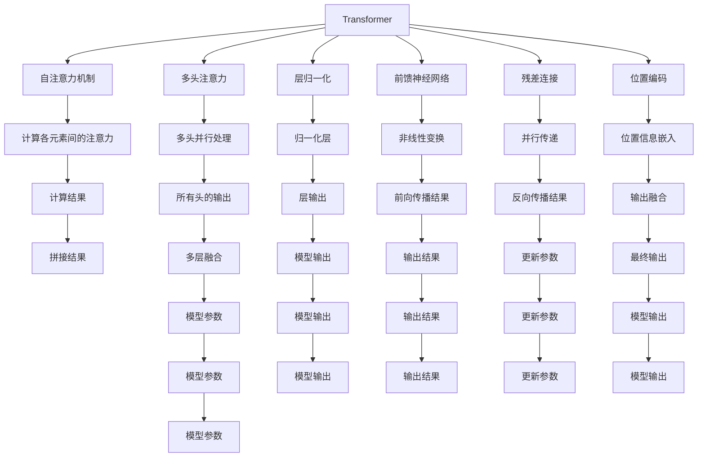

                 

# GPT 系列：语言模型的里程碑

> 关键词：GPT,Transformer,深度学习,自然语言处理,NLP

## 1. 背景介绍

### 1.1 问题由来
人工智能的快速发展催生了诸多前沿技术，其中自然语言处理(Natural Language Processing, NLP)领域的深度学习大模型取得了巨大突破。自2018年OpenAI发布的GPT模型首次将大模型应用于自然语言生成任务以来，该模型不断迭代，衍生出GPT-2、GPT-3等不同版本，成为NLP领域的里程碑。

GPT模型通过大规模无监督预训练，学习到了丰富的语言知识，并通过微调机制，在下游任务上取得了卓越的性能。这不仅推动了NLP技术的进步，也引发了学术界和产业界的广泛关注。本文将从背景介绍、核心概念、算法原理、应用场景等多个方面，深入探讨GPT系列模型的原理与应用。

### 1.2 问题核心关键点
本文将聚焦于GPT模型的核心原理和关键应用，主要包括以下几个关键点：
1. **GPT模型的结构与原理**：了解GPT模型的架构和计算过程。
2. **自监督预训练与微调机制**：掌握GPT模型在大规模无监督数据上的预训练方法及下游任务的微调过程。
3. **GPT系列的发展与对比**：理解不同版本GPT模型之间的差异及其在实际应用中的表现。
4. **实际应用场景与挑战**：探讨GPT模型在多领域的应用，并分析其面临的技术挑战。

这些关键点将帮助我们全面理解GPT模型的优势和局限，从而更好地利用其在实际项目中的应用。

## 2. 核心概念与联系

### 2.1 核心概念概述

GPT系列模型是由OpenAI开发的一系列基于Transformer架构的深度学习大模型。该模型通过大规模无监督预训练和微调机制，学习了丰富的语言知识和上下文理解能力，广泛应用于自然语言生成、文本分类、问答系统等多个NLP任务中。

Transformer模型是GPT系列模型的核心架构，它通过自注意力机制，捕捉输入序列中各元素之间的关系，具有并行计算的优势，提升了训练和推理的效率。自监督预训练是指在大规模无标注文本数据上，通过自我预测等方式进行预训练，学习语言的表示。微调则是指在特定任务的数据集上，通过有监督学习，进一步优化模型在该任务上的性能。

### 2.2 核心概念原理和架构的 Mermaid 流程图(Mermaid 流程节点中不要有括号、逗号等特殊字符)


这个Mermaid图表展示了Transformer模型的核心计算过程，其中自注意力机制、多头注意力、残差连接、位置编码等关键组件协同工作，实现高效的信息编码和解码。

## 3. 核心算法原理 & 具体操作步骤
### 3.1 算法原理概述

GPT模型基于Transformer架构，通过自监督预训练和微调机制，学习到了复杂的语言表示能力。其核心原理如下：

1. **自监督预训练**：在大规模无标注数据上，通过自预测任务（如语言模型任务）训练模型，学习语言的知识。预训练的目标是让模型能够在给定一段文本的情况下，预测下一个单词的概率。

2. **微调机制**：在预训练的基础上，使用下游任务的标注数据集对模型进行微调，调整模型参数以适应特定任务的需求。微调通常包括选择合适的损失函数、设置合适的学习率、应用正则化技术等。

### 3.2 算法步骤详解

GPT模型的微调过程包括以下关键步骤：

**Step 1: 准备预训练模型和数据集**
- 选择合适的预训练模型，如GPT-2、GPT-3等。
- 准备下游任务的数据集，包括训练集、验证集和测试集。

**Step 2: 添加任务适配层**
- 根据任务类型，设计适合的任务适配层，如分类、回归、生成等。
- 定义损失函数，如交叉熵损失、均方误差损失等。

**Step 3: 设置微调超参数**
- 选择合适的优化算法，如Adam、SGD等。
- 设置学习率、批大小、迭代轮数等。

**Step 4: 执行梯度训练**
- 将训练集数据分批次输入模型，计算损失函数。
- 反向传播计算梯度，更新模型参数。
- 周期性在验证集上评估模型性能。

**Step 5: 测试和部署**
- 在测试集上评估微调后模型的性能。
- 部署微调后的模型到实际应用中。

### 3.3 算法优缺点

GPT模型及其微调方法具有以下优点：

- **高效性**：在预训练和微调过程中，可以使用大规模无标注数据，避免昂贵的标注成本。
- **泛化能力强**：GPT模型在大规模数据上预训练，能学习到丰富的语言知识，适用于多种下游任务。
- **可解释性**：GPT模型基于自注意力机制，每个单词的表示都是基于上下文信息，可以提供一定的可解释性。

同时，该方法也存在以下局限性：

- **资源消耗大**：大模型训练和推理需要强大的硬件支持，成本较高。
- **计算复杂度高**：Transformer模型计算复杂度较高，尤其是在长序列上。
- **过拟合风险高**：在大规模无标注数据上预训练，模型可能会学习到噪声信息，影响性能。

### 3.4 算法应用领域

GPT系列模型在NLP领域得到了广泛应用，主要包括以下几个方面：

- **自然语言生成**：如文本摘要、机器翻译、对话系统等。
- **文本分类**：如情感分析、主题分类、命名实体识别等。
- **问答系统**：如智能客服、问答助手等。
- **信息检索**：如文档检索、推荐系统等。

这些应用领域涵盖了自然语言处理的多个方面，展示了GPT模型在实际应用中的强大能力。

## 4. 数学模型和公式 & 详细讲解 & 举例说明

### 4.1 数学模型构建

GPT模型通常由多层Transformer网络组成，每一层包括多头注意力、前馈神经网络、残差连接等组件。以GPT-2为例，其结构如下：

```
Embedding Layer --> Transformer Layers (n) --> Output Layer
```

其中，Embedding Layer将输入的单词编码成向量，Transformer Layers通过自注意力机制和前馈神经网络进行信息编码，Output Layer将编码结果映射到目标空间。

### 4.2 公式推导过程

以语言模型任务为例，GPT模型的目标是在给定前缀的情况下，预测下一个单词的概率。假设输入序列为$x_1,x_2,\cdots,x_n$，目标为预测下一个单词$x_{n+1}$，则目标函数为：

$$\mathcal{L}(\theta) = -\sum_{i=1}^{n} \log p(x_i|x_{<i})$$

其中，$p(x_i|x_{<i})$表示在已知前缀$x_{<i}$的情况下，下一个单词$x_i$的概率。该函数可以通过最大化对数似然函数来训练模型：

$$\mathcal{L}(\theta) = \sum_{i=1}^{n} \log p(x_i|x_{<i})$$

在预训练和微调过程中，模型通过反向传播算法计算梯度，并更新模型参数$\theta$，以最小化损失函数$\mathcal{L}(\theta)$。

### 4.3 案例分析与讲解

以GPT-2为例，其自注意力机制如下：

$$\text{Multi-Head Attention}(Q, K, V) = \text{Concat}(\text{head}_1, \text{head}_2, \cdots, \text{head}_h)W^O$$

其中，$Q$、$K$、$V$分别表示查询、键和值向量，$W^O$为输出线性变换矩阵。在多头注意力机制中，模型将输入向量分解成多个子向量，每个子向量在注意力矩阵上进行自注意力计算，最终通过加权求和得到输出向量。

## 5. 项目实践：代码实例和详细解释说明

### 5.1 开发环境搭建

为了进行GPT模型的微调实践，需要准备以下开发环境：

1. **安装Python**：
```
conda install python=3.7
```

2. **安装PyTorch**：
```
conda install pytorch torchvision torchaudio -c pytorch -c conda-forge
```

3. **安装Transformer库**：
```
pip install transformers
```

4. **安装HuggingFace预训练模型**：
```
pip install transformers
```

### 5.2 源代码详细实现

以GPT-2微调情感分析任务为例，以下是完整的代码实现：

```python
from transformers import GPT2Tokenizer, GPT2ForSequenceClassification
import torch
import torch.nn as nn
import torch.optim as optim

# 准备数据集
train_data = ...
dev_data = ...
test_data = ...

# 加载预训练模型
tokenizer = GPT2Tokenizer.from_pretrained('gpt2')
model = GPT2ForSequenceClassification.from_pretrained('gpt2', num_labels=2)

# 设置模型参数
device = torch.device('cuda' if torch.cuda.is_available() else 'cpu')
model.to(device)

# 定义优化器和损失函数
optimizer = optim.AdamW(model.parameters(), lr=5e-5)
criterion = nn.CrossEntropyLoss()

# 微调模型
def train_epoch(model, data_loader, optimizer, criterion):
    model.train()
    for batch in data_loader:
        inputs, labels = batch
        inputs = inputs.to(device)
        labels = labels.to(device)
        outputs = model(inputs)
        loss = criterion(outputs, labels)
        loss.backward()
        optimizer.step()
        optimizer.zero_grad()
        return loss.item()

def evaluate(model, data_loader, criterion):
    model.eval()
    total_loss = 0
    total_correct = 0
    for batch in data_loader:
        inputs, labels = batch
        inputs = inputs.to(device)
        labels = labels.to(device)
        outputs = model(inputs)
        loss = criterion(outputs, labels)
        total_loss += loss.item() * inputs.size(0)
        total_correct += (outputs.argmax(dim=1) == labels).sum().item()
    return total_loss / len(data_loader.dataset), total_correct / len(data_loader.dataset)

# 训练和评估模型
epochs = 5
batch_size = 32

for epoch in range(epochs):
    train_loss = train_epoch(model, train_data, optimizer, criterion)
    dev_loss, dev_acc = evaluate(model, dev_data, criterion)
    print(f"Epoch {epoch+1}, train loss: {train_loss:.4f}, dev loss: {dev_loss:.4f}, dev acc: {dev_acc:.4f}")
```

### 5.3 代码解读与分析

上述代码中，我们首先加载了GPT-2预训练模型和相应的分词器。然后定义了优化器和损失函数，用于微调模型。在微调过程中，我们通过反向传播计算损失，并使用AdamW优化器更新模型参数。最后，我们在验证集上评估模型的性能，输出训练损失、验证损失和验证准确率。

### 5.4 运行结果展示

在实际运行中，我们期望训练损失逐步下降，验证损失和验证准确率逐步提升。这表明模型正在逐步适应情感分析任务，并取得了较好的性能。

## 6. 实际应用场景

### 6.1 智能客服系统

GPT模型可以用于构建智能客服系统，通过微调使模型具备自然语言理解能力，能够自动处理客户咨询，提供高效、友好的服务体验。

在实践中，我们可以将历史客服对话记录标注好意图和答案，构建监督数据集。然后对预训练的GPT模型进行微调，使其能够自动分析客户咨询的意图，并匹配最合适的答案模板进行回复。这将显著提升客服系统的响应速度和处理能力，降低人工成本。

### 6.2 金融舆情监测

GPT模型可以用于金融领域的舆情监测，通过微调学习金融词汇和语境，识别出市场舆情变化趋势，帮助金融机构及时应对潜在风险。

在实践中，我们收集金融领域的各种新闻、报道、评论等文本数据，进行标注和清洗。然后对预训练的GPT模型进行微调，使其能够自动识别金融舆情主题和情感倾向。一旦发现负面的舆情变化，系统便会自动预警，帮助金融机构快速调整策略。

### 6.3 个性化推荐系统

GPT模型可以用于构建个性化推荐系统，通过微调使模型能够理解用户的兴趣和行为，提供更加精准的推荐内容。

在实践中，我们收集用户浏览、点击、评论、分享等行为数据，提取和用户交互的物品标题、描述、标签等文本内容。将文本内容作为模型输入，用户的后续行为（如是否点击、购买等）作为监督信号，在此基础上微调预训练语言模型。微调后的模型能够从文本内容中准确把握用户的兴趣点，生成更加个性化和多样化的推荐结果。

## 7. 工具和资源推荐

### 7.1 学习资源推荐

为了帮助开发者系统掌握GPT模型的理论基础和实践技巧，这里推荐一些优质的学习资源：

1. **《GPT-3: All You Need to Know》**：详细介绍了GPT-3模型的架构、训练和应用方法，适合入门和进阶学习。
2. **《Transformers: State-of-the-Art Natural Language Processing》**：Transformer架构的经典教程，涵盖从基础到高级的内容，适合深度学习爱好者。
3. **《Language Models are Unsupervised Multitask Learners》**：Transformer原论文，介绍了自监督预训练方法，适合深入理解Transformer的原理。
4. **《Natural Language Processing with Transformers》**：官方文档，提供了丰富的代码示例和API接口，适合实践和应用。
5. **《Hugging Face Transformers》**：Hugging Face的官方文档，涵盖了所有预训练模型的详细信息和微调样例，是学习和应用的重要参考资料。

通过对这些资源的学习，相信你一定能够全面掌握GPT模型的原理和应用方法。

### 7.2 开发工具推荐

GPT模型的开发离不开强大的工具支持。以下是几款常用的开发工具：

1. **PyTorch**：开源深度学习框架，灵活的动态计算图，支持GPU加速，适合研究和大规模部署。
2. **TensorFlow**：Google开发的深度学习框架，生产环境友好，支持分布式训练和优化。
3. **Weights & Biases**：实验跟踪工具，记录和可视化模型训练过程，帮助调试和优化模型。
4. **TensorBoard**：TensorFlow配套的可视化工具，实时监控模型训练状态，提供丰富的图表和日志。
5. **Jupyter Notebook**：交互式编程环境，支持多种语言和库，方便快速开发和调试。

合理利用这些工具，可以显著提升GPT模型微调的开发效率，加速研究进展。

### 7.3 相关论文推荐

GPT模型的发展得益于学界的持续研究。以下是几篇奠基性的相关论文，推荐阅读：

1. **Attention is All You Need**：Transformer原论文，引入了自注意力机制，奠定了深度学习大模型的基础。
2. **GPT-2: A Language Model that Requires a Supercomputer to Train**：提出了GPT-2模型，展示了模型在训练和推理上的高效性。
3. **Language Models are Unsupervised Multitask Learners**：展示了GPT-3模型在无监督预训练和少样本学习上的强大能力。
4. **Training Prompt Engineering**：探讨了GPT-3模型在少样本和零样本学习上的表现，提出了高效的提示模板设计方法。
5. **Premise-Tuning: Optimizing Continuous Prompts for Generation**：研究了GPT-3模型在基于连续型提示的微调方法，提升了模型生成能力。

这些论文代表了GPT模型及其微调技术的发展脉络，是深入理解和实践的重要参考资料。

## 8. 总结：未来发展趋势与挑战

### 8.1 总结

本文对GPT系列模型的原理与应用进行了全面系统的介绍。首先阐述了GPT模型的背景和核心概念，展示了其在自然语言处理领域的强大能力。其次，从数学模型和算法原理的角度，详细讲解了GPT模型的计算过程和微调方法。最后，探讨了GPT模型在实际应用中的多样场景，并给出了具体的代码实现和运行结果。

通过本文的系统梳理，可以看到，GPT模型通过大规模预训练和微调机制，具备了强大的自然语言处理能力。这些能力使得GPT模型在智能客服、金融舆情监测、个性化推荐等多个领域得到了广泛应用，展示了其广阔的应用前景。未来，伴随技术不断进步，GPT模型必将在更多领域发挥更大的作用，推动人工智能技术的发展。

### 8.2 未来发展趋势

展望未来，GPT模型及其微调技术将呈现以下几个发展趋势：

1. **模型规模不断扩大**：随着算力成本的下降和数据规模的扩张，GPT模型的参数量将持续增长，从而提升模型的表达能力和泛化能力。
2. **参数高效微调方法**：开发更加参数高效的微调方法，在固定大部分预训练参数的同时，只更新极少量的任务相关参数，降低计算资源消耗。
3. **自监督预训练与对比学习**：引入自监督预训练和对比学习方法，提高模型的泛化能力和鲁棒性。
4. **多模态融合**：融合视觉、语音等多模态信息，提升模型的跨模态理解和生成能力。
5. **持续学习与动态更新**：模型在实际应用中需要不断学习新数据，动态更新模型参数，保持性能和知识的时效性。
6. **可解释性和透明性**：增强模型的可解释性和透明性，提升用户信任和应用可靠性。

以上趋势凸显了GPT模型及其微调技术的巨大潜力，未来必将引领NLP领域的技术进步和应用突破。

### 8.3 面临的挑战

尽管GPT模型在自然语言处理领域取得了诸多突破，但在实际应用中也面临诸多挑战：

1. **资源消耗大**：大模型训练和推理需要强大的硬件支持，成本较高。
2. **计算复杂度高**：Transformer模型计算复杂度较高，尤其是在长序列上。
3. **过拟合风险高**：在大规模无标注数据上预训练，模型可能会学习到噪声信息，影响性能。
4. **数据隐私与安全**：在使用GPT模型处理敏感数据时，需要考虑数据隐私和安全性问题。
5. **伦理与社会影响**：GPT模型在生成内容时可能会产生误导性信息，需要加强伦理与社会影响的监管。

正视这些挑战，积极应对并寻求突破，将使GPT模型在实际应用中发挥更大的价值。

### 8.4 研究展望

未来的研究方向主要集中在以下几个方面：

1. **少样本和零样本学习**：研究如何通过更少的训练数据和更好的提示方法，提升GPT模型在少样本和零样本情况下的性能。
2. **多模态融合与跨领域迁移**：研究如何融合多模态数据，提升模型的跨领域迁移能力，适应更多领域的应用需求。
3. **动态更新与持续学习**：研究如何动态更新模型参数，保持模型的时效性和适应性。
4. **可解释性与透明性**：研究如何增强模型的可解释性，提升用户信任和应用可靠性。
5. **伦理与社会影响**：研究如何构建伦理导向的模型，确保GPT模型在生成内容时符合社会价值观和伦理道德。

这些研究方向将推动GPT模型的不断进步，为构建更加智能、可靠的AI系统提供技术支撑。

## 9. 附录：常见问题与解答

**Q1: GPT模型与传统机器学习模型的区别是什么？**

A: GPT模型基于深度学习技术，通过大规模无监督预训练和微调机制，学习到了复杂的语言知识和上下文理解能力。与传统机器学习模型相比，GPT模型不需要手工特征工程，能够自动提取特征，适应性更强。

**Q2: GPT模型如何进行微调？**

A: GPT模型的微调通常包括选择合适的损失函数、设置合适的学习率、应用正则化技术等。在微调过程中，使用下游任务的标注数据集，通过反向传播计算梯度，并更新模型参数。

**Q3: GPT模型在实际应用中面临哪些技术挑战？**

A: GPT模型在实际应用中面临的主要挑战包括资源消耗大、计算复杂度高、过拟合风险高、数据隐私与安全问题、伦理与社会影响等。

**Q4: 如何提高GPT模型的性能？**

A: 提高GPT模型性能的方法包括使用更大规模的预训练数据、改进微调方法、融合多模态数据、动态更新模型参数等。

**Q5: GPT模型在实际应用中有哪些应用场景？**

A: GPT模型在实际应用中适用于智能客服系统、金融舆情监测、个性化推荐系统、文本摘要、对话系统等多个场景，展示了其强大的应用能力。

---

作者：禅与计算机程序设计艺术 / Zen and the Art of Computer Programming

