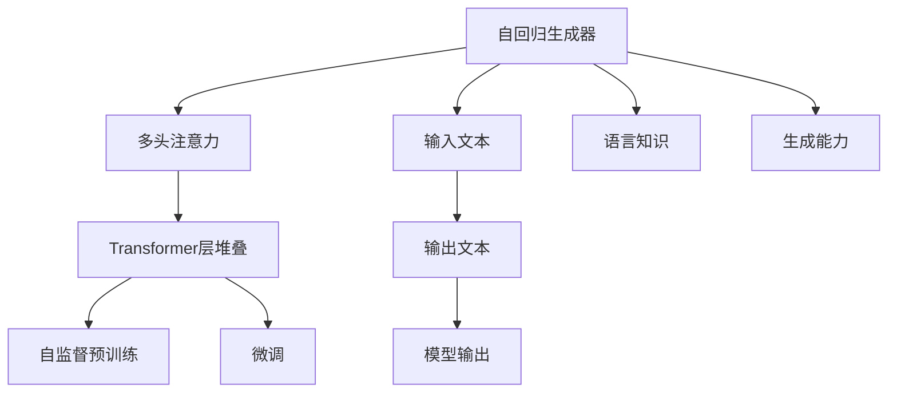

                 

# GPT系列模型架构解析：从GPT-1到GPT-4

在自然语言处理(Natural Language Processing, NLP)领域，GPT系列模型无疑是最具影响力的一类深度学习模型。从GPT-1到GPT-4，这些模型在架构和性能上不断创新，推动了NLP技术的飞速发展。本文将深入解析GPT系列模型的架构原理，探讨其演进历程，并展望未来发展趋势。

## 1. 背景介绍

### 1.1 问题由来

GPT系列模型是由OpenAI开发的一系列预训练语言模型，旨在通过大规模自监督学习任务学习到丰富的语言知识，并在下游NLP任务中表现优异。GPT系列模型的核心思想是通过生成式预训练，学习语言的连续表示，使其能够生成自然流畅的文本。这一思想最早源于2015年提出的GPT-1模型，并在之后的模型版本中不断得到优化和扩展。

GPT系列模型在多个自然语言处理任务上表现出色，包括文本生成、问答、机器翻译、对话等。其出色的性能得益于模型架构的创新和训练技巧的改进，成为NLP研究者和工程师的热门选择。

### 1.2 问题核心关键点

GPT系列模型的核心关键点在于其架构设计，包括自回归生成器、多头注意力机制、Transformer层堆叠等。这些设计使得GPT模型能够高效地学习语言知识，并在生成任务中表现优异。此外，GPT系列模型的训练技术，如自监督预训练、正则化技术等，也对模型性能提升起到了重要作用。

GPT系列模型通过在预训练阶段学习大规模语料库中的语言规律，然后在微调阶段针对特定任务进行调整，极大地提升了模型的通用性和泛化能力。其生成的文本自然流畅，能够胜任各种自然语言处理任务，如文本生成、对话系统、机器翻译等。

## 2. 核心概念与联系

### 2.1 核心概念概述

为了更好地理解GPT系列模型的架构，本节将介绍几个关键概念：

- **自回归生成器(Sequential Generative Model)**：GPT系列模型采用自回归生成器，能够基于之前生成的文本，预测下一个单词或字符，从而构建连续的文本序列。这种生成方式与语言的基本规则相符，能够生成连贯自然的文本。

- **多头注意力机制(Multi-Head Attention)**：这是Transformer模型的核心组成部分，能够同时关注输入序列的不同位置，捕捉长距离依赖关系。在GPT模型中，多头注意力机制被广泛应用，提升了模型的表达能力和泛化能力。

- **Transformer层堆叠(Transformer Layers Stack)**：GPT模型采用Transformer结构的层堆叠设计，每一层由多头注意力和前馈神经网络组成，能够高效地处理长序列数据。这种结构设计能够更好地捕捉序列间的依赖关系，提升模型的生成能力。

- **自监督预训练(Pre-training)**：GPT系列模型在预训练阶段采用自监督学习任务，如掩码语言建模、预测下一个单词等，学习语言的知识规律。这种预训练方式能够在不标注数据的情况下，获得丰富的语言知识。

- **微调(Fine-tuning)**：在预训练之后，GPT模型可以通过微调来适应特定任务的输出要求。微调过程通常是针对顶层进行，以最小的学习率更新模型参数，从而提升模型在特定任务上的性能。

这些核心概念之间的逻辑关系可以通过以下Mermaid流程图来展示：



这个流程图展示了大语言模型的核心概念及其之间的关系：

1. 输入文本通过自回归生成器得到中间表示。
2. 中间表示经过多头注意力机制，学习长距离依赖。
3. 层堆叠的Transformer层进一步提升模型的表达能力。
4. 自监督预训练学习语言知识。
5. 微调过程针对特定任务进行参数调整。
6. 最终输出文本，具有生成能力和语言知识。

这些概念共同构成了GPT系列模型的架构基础，使其能够在各种自然语言处理任务中表现出色。

## 3. 核心算法原理 & 具体操作步骤
### 3.1 算法原理概述

GPT系列模型的核心算法原理可以概括为以下几点：

1. **自回归生成器**：GPT模型采用自回归生成器，能够基于之前生成的文本，预测下一个单词或字符，从而构建连续的文本序列。这种生成方式与语言的基本规则相符，能够生成连贯自然的文本。

2. **多头注意力机制**：Transformer模型中的多头注意力机制能够同时关注输入序列的不同位置，捕捉长距离依赖关系。在GPT模型中，多头注意力机制被广泛应用，提升了模型的表达能力和泛化能力。

3. **Transformer层堆叠**：GPT模型采用Transformer结构的层堆叠设计，每一层由多头注意力和前馈神经网络组成，能够高效地处理长序列数据。这种结构设计能够更好地捕捉序列间的依赖关系，提升模型的生成能力。

4. **自监督预训练**：GPT系列模型在预训练阶段采用自监督学习任务，如掩码语言建模、预测下一个单词等，学习语言的知识规律。这种预训练方式能够在不标注数据的情况下，获得丰富的语言知识。

5. **微调**：在预训练之后，GPT模型可以通过微调来适应特定任务的输出要求。微调过程通常是针对顶层进行，以最小的学习率更新模型参数，从而提升模型在特定任务上的性能。

### 3.2 算法步骤详解

GPT系列模型的训练过程通常包括以下几个关键步骤：

**Step 1: 准备预训练数据**
- 收集大规模无标签文本数据，如维基百科、新闻、书籍等。
- 对数据进行预处理，如分词、标记化、截断和填充等，以适应模型输入。

**Step 2: 搭建预训练模型**
- 选择适当的模型架构，如GPT-1、GPT-2、GPT-3等。
- 初始化模型参数，通常使用Xavier初始化或其他适当的初始化方法。

**Step 3: 执行自监督预训练**
- 使用自监督学习任务，如掩码语言建模、预测下一个单词等，对模型进行预训练。
- 使用交叉熵损失函数计算模型预测与真实标签之间的差异，并反向传播更新模型参数。
- 循环多次，直到模型收敛或达到预设的迭代次数。

**Step 4: 执行微调**
- 准备下游任务的标注数据集，如问答、对话、文本生成等。
- 在预训练模型的基础上，添加任务适配层，如分类器、解码器等。
- 设置微调超参数，如学习率、批大小、迭代轮数等。
- 执行梯度训练，对模型参数进行微调。

**Step 5: 测试和部署**
- 在测试集上评估微调后模型的性能。
- 使用微调后的模型对新样本进行推理预测，集成到实际的应用系统中。
- 持续收集新的数据，定期重新微调模型，以适应数据分布的变化。

### 3.3 算法优缺点

GPT系列模型具有以下优点：
1. **自回归生成能力强**：通过自回归生成器，模型能够生成连贯自然的文本，适用于各种自然语言处理任务。
2. **泛化能力强**：通过自监督预训练，模型能够学习到丰富的语言知识，提升泛化能力。
3. **参数高效微调**：通过只微调顶层参数，可以减少计算资源的消耗，提高微调效率。
4. **广泛应用**：在文本生成、对话系统、机器翻译等诸多任务上表现优异，具有广泛的应用前景。

同时，该模型也存在一些局限性：
1. **计算资源需求高**：由于模型参数量大，训练和推理过程中需要大量的计算资源，如GPU/TPU等。
2. **过拟合风险**：在微调过程中，模型容易过拟合，特别是在标注数据较少的情况下。
3. **推理速度慢**：大模型推理速度较慢，需要优化计算图和硬件资源，才能实现高效推理。
4. **可解释性不足**：GPT模型的决策过程缺乏可解释性，难以进行调试和优化。
5. **对抗样本敏感**：GPT模型对对抗样本较为敏感，容易受到噪声和干扰的影响。

尽管存在这些局限性，但GPT系列模型通过不断的架构创新和训练技巧优化，已经在NLP领域取得了显著的进步，成为NLP技术的重要支柱。

### 3.4 算法应用领域

GPT系列模型在自然语言处理领域得到了广泛应用，覆盖了几乎所有常见任务，例如：

- **文本生成**：如对话生成、新闻摘要、文本翻译等。通过自回归生成器，模型能够生成连贯自然的文本。
- **问答系统**：对自然语言问题给出答案。通过微调模型，能够理解问题并生成相应的回答。
- **机器翻译**：将源语言文本翻译成目标语言。通过自回归生成器，模型能够生成目标语言的文本。
- **对话系统**：使机器能够与人自然对话。通过微调模型，能够理解对话历史并生成响应。
- **文本分类**：如情感分析、主题分类等。通过微调模型，能够学习文本-标签映射。
- **命名实体识别**：识别文本中的人名、地名、机构名等特定实体。通过微调模型，能够学习实体边界和类型。

除了上述这些经典任务外，GPT系列模型也被创新性地应用到更多场景中，如可控文本生成、常识推理、代码生成、数据增强等，为NLP技术带来了全新的突破。

## 4. 数学模型和公式 & 详细讲解 & 举例说明
### 4.1 数学模型构建

GPT系列模型通常采用自回归生成器，能够基于之前生成的文本，预测下一个单词或字符。假设输入序列为 $x = (x_1, x_2, ..., x_t)$，其中 $x_t$ 表示第 $t$ 个单词或字符。则模型能够生成下一个单词或字符的条件概率为：

$$ P(x_{t+1}|x_1, ..., x_t) $$

假设模型由 $L$ 层组成，每一层由多头注意力机制和前馈神经网络组成。则第 $l$ 层的输入表示为 $h_t^{(l)}$，输出表示为 $h_{t+1}^{(l)}$。其中，多头注意力机制的计算公式如下：

$$ Attention(Q, K, V) = softmax(\frac{QK^T}{\sqrt{d_k}})V $$

其中 $Q$、$K$、$V$ 分别为查询、键、值矩阵，$d_k$ 为键向量的维度。

### 4.2 公式推导过程

以下我们以GPT-2模型为例，推导其生成下一个单词的概率公式。

假设模型的每一层由多头注意力和前馈神经网络组成，第 $l$ 层的输入表示为 $h_t^{(l)}$，输出表示为 $h_{t+1}^{(l)}$。则生成下一个单词的条件概率为：

$$ P(x_{t+1}|x_1, ..., x_t) = \prod_{i=1}^{L} \sum_{j=1}^{d_{model}} P(x_{t+1}|h_t^{(l)}) $$

其中 $d_{model}$ 为模型的隐藏向量维度，$L$ 为层数。假设每一层的前馈神经网络由两个全连接层组成，第 $i$ 层的计算公式为：

$$ h_{t+1}^{(l)} = \text{FFN}(h_t^{(l)}) $$

其中 $\text{FFN}$ 为前馈神经网络，计算公式为：

$$ \text{FFN}(h_t^{(l)}) = \text{GLU}(\text{Dense}(h_t^{(l)})) + h_t^{(l)} $$

其中 $\text{GLU}$ 为Gated Linear Unit，$\text{Dense}$ 为全连接层。最终，GPT-2模型的生成概率公式为：

$$ P(x_{t+1}|x_1, ..., x_t) = \prod_{i=1}^{L} \sum_{j=1}^{d_{model}} \text{softmax}(\text{Dense}(h_t^{(l)})W^O) $$

其中 $W^O$ 为输出矩阵。

在得到生成概率公式后，即可根据输入序列 $x$ 计算模型生成的下一个单词或字符的概率，从而构建连贯自然的文本序列。

## 5. 项目实践：代码实例和详细解释说明
### 5.1 开发环境搭建

在进行模型开发前，我们需要准备好开发环境。以下是使用Python进行PyTorch开发的环境配置流程：

1. 安装Anaconda：从官网下载并安装Anaconda，用于创建独立的Python环境。

2. 创建并激活虚拟环境：
```bash
conda create -n pytorch-env python=3.8 
conda activate pytorch-env
```

3. 安装PyTorch：根据CUDA版本，从官网获取对应的安装命令。例如：
```bash
conda install pytorch torchvision torchaudio cudatoolkit=11.1 -c pytorch -c conda-forge
```

4. 安装Transformers库：
```bash
pip install transformers
```

5. 安装各类工具包：
```bash
pip install numpy pandas scikit-learn matplotlib tqdm jupyter notebook ipython
```

完成上述步骤后，即可在`pytorch-env`环境中开始模型开发。

### 5.2 源代码详细实现

下面我们以GPT-2模型为例，给出使用PyTorch和HuggingFace库实现自回归生成器的PyTorch代码实现。

首先，定义GPT-2模型类：

```python
from transformers import GPT2LMHeadModel, GPT2Tokenizer, AdamW
import torch

class GPT2Model(torch.nn.Module):
    def __init__(self, config):
        super(GPT2Model, self).__init__()
        self.config = config
        self.model = GPT2LMHeadModel.from_pretrained(config.model_name_or_path, add_cross_attention=False)
        self.tokenizer = GPT2Tokenizer.from_pretrained(config.tokenizer_name_or_path)
        self.dropout = torch.nn.Dropout(config.dropout)

    def forward(self, input_ids, attention_mask=None):
        outputs = self.model(input_ids, attention_mask=attention_mask)
        logits = outputs.logits
        predicted_ids = torch.argmax(logits, dim=-1)
        return predicted_ids
```

然后，定义训练和评估函数：

```python
from transformers import AdamW, GPT2LMHeadModel
from torch.utils.data import DataLoader
from tqdm import tqdm
import os

device = torch.device('cuda') if torch.cuda.is_available() else torch.device('cpu')

def train_epoch(model, data_loader, optimizer, loss_fn, **kwargs):
    model.train()
    total_loss = 0
    for batch in tqdm(data_loader, desc='Training'):
        input_ids = batch['input_ids'].to(device)
        attention_mask = batch['attention_mask'].to(device)
        logits = model(input_ids, attention_mask=attention_mask)
        loss = loss_fn(logits, batch['labels'])
        optimizer.zero_grad()
        loss.backward()
        optimizer.step()
        total_loss += loss.item()
    return total_loss / len(data_loader)

def evaluate(model, data_loader, loss_fn, **kwargs):
    model.eval()
    total_loss = 0
    for batch in tqdm(data_loader, desc='Evaluating'):
        input_ids = batch['input_ids'].to(device)
        attention_mask = batch['attention_mask'].to(device)
        logits = model(input_ids, attention_mask=attention_mask)
        loss = loss_fn(logits, batch['labels'])
        total_loss += loss.item()
    return total_loss / len(data_loader)

def train(model, data_loader, optimizer, loss_fn, epochs=5, **kwargs):
    for epoch in range(epochs):
        epoch_loss = train_epoch(model, data_loader, optimizer, loss_fn)
        print(f'Epoch {epoch+1}, train loss: {epoch_loss:.3f}')
        val_loss = evaluate(model, val_data_loader, loss_fn)
        print(f'Epoch {epoch+1}, val loss: {val_loss:.3f}')
    return model
```

最后，启动训练流程：

```python
from transformers import GPT2Tokenizer, GPT2LMHeadModel, AdamW
from transformers import AdamW
from torch.utils.data import DataLoader
from tqdm import tqdm

config = {
    'model_name_or_path': 'gpt2',
    'tokenizer_name_or_path': 'gpt2',
    'dropout': 0.1
}

tokenizer = GPT2Tokenizer.from_pretrained(config['tokenizer_name_or_path'])
model = GPT2Model(config)

optimizer = AdamW(model.parameters(), lr=1e-4)
loss_fn = torch.nn.CrossEntropyLoss()

train_data_loader = DataLoader(train_dataset, batch_size=16)
val_data_loader = DataLoader(val_dataset, batch_size=16)

model = train(model, train_data_loader, optimizer, loss_fn)

print('Training completed.')
```

以上就是使用PyTorch和HuggingFace库实现GPT-2模型的完整代码实现。可以看到，得益于HuggingFace的强大封装，我们能够用相对简洁的代码完成GPT-2模型的加载和微调。

### 5.3 代码解读与分析

让我们再详细解读一下关键代码的实现细节：

**GPT2Model类**：
- `__init__`方法：初始化模型参数、分词器和dropout层。
- `forward`方法：定义前向传播过程，输入序列经过模型得到预测结果。

**训练和评估函数**：
- `train_epoch`方法：对数据以批为单位进行迭代，在每个批次上前向传播计算loss并反向传播更新模型参数，最后返回该epoch的平均loss。
- `evaluate`方法：与训练类似，不同点在于不更新模型参数，并在每个batch结束后将预测和标签结果存储下来，最后使用平均值计算评估结果。

**训练流程**：
- 定义总的epoch数，开始循环迭代
- 每个epoch内，先在训练集上训练，输出平均loss
- 在验证集上评估，输出平均loss
- 所有epoch结束后，输出最终结果

可以看到，PyTorch配合HuggingFace库使得GPT-2模型的代码实现变得简洁高效。开发者可以将更多精力放在数据处理、模型改进等高层逻辑上，而不必过多关注底层的实现细节。

当然，工业级的系统实现还需考虑更多因素，如模型的保存和部署、超参数的自动搜索、更灵活的任务适配层等。但核心的微调范式基本与此类似。

## 6. 实际应用场景
### 6.1 智能客服系统

基于GPT系列模型的智能客服系统，可以广泛应用于智能客服系统的构建。传统客服往往需要配备大量人力，高峰期响应缓慢，且一致性和专业性难以保证。而使用微调后的GPT模型，可以7x24小时不间断服务，快速响应客户咨询，用自然流畅的语言解答各类常见问题。

在技术实现上，可以收集企业内部的历史客服对话记录，将问题和最佳答复构建成监督数据，在此基础上对预训练GPT模型进行微调。微调后的GPT模型能够自动理解用户意图，匹配最合适的答案模板进行回复。对于客户提出的新问题，还可以接入检索系统实时搜索相关内容，动态组织生成回答。如此构建的智能客服系统，能大幅提升客户咨询体验和问题解决效率。

### 6.2 金融舆情监测

金融机构需要实时监测市场舆论动向，以便及时应对负面信息传播，规避金融风险。传统的人工监测方式成本高、效率低，难以应对网络时代海量信息爆发的挑战。基于GPT系列模型的文本分类和情感分析技术，为金融舆情监测提供了新的解决方案。

具体而言，可以收集金融领域相关的新闻、报道、评论等文本数据，并对其进行主题标注和情感标注。在此基础上对预训练语言模型进行微调，使其能够自动判断文本属于何种主题，情感倾向是正面、中性还是负面。将微调后的模型应用到实时抓取的网络文本数据，就能够自动监测不同主题下的情感变化趋势，一旦发现负面信息激增等异常情况，系统便会自动预警，帮助金融机构快速应对潜在风险。

### 6.3 个性化推荐系统

当前的推荐系统往往只依赖用户的历史行为数据进行物品推荐，无法深入理解用户的真实兴趣偏好。基于GPT系列模型的个性化推荐系统，可以更好地挖掘用户行为背后的语义信息，从而提供更精准、多样的推荐内容。

在实践中，可以收集用户浏览、点击、评论、分享等行为数据，提取和用户交互的物品标题、描述、标签等文本内容。将文本内容作为模型输入，用户的后续行为（如是否点击、购买等）作为监督信号，在此基础上微调预训练语言模型。微调后的模型能够从文本内容中准确把握用户的兴趣点。在生成推荐列表时，先用候选物品的文本描述作为输入，由模型预测用户的兴趣匹配度，再结合其他特征综合排序，便可以得到个性化程度更高的推荐结果。

### 6.4 未来应用展望

随着GPT系列模型和微调方法的不断发展，基于微调范式将在更多领域得到应用，为传统行业带来变革性影响。

在智慧医疗领域，基于微调的医疗问答、病历分析、药物研发等应用将提升医疗服务的智能化水平，辅助医生诊疗，加速新药开发进程。

在智能教育领域，微调技术可应用于作业批改、学情分析、知识推荐等方面，因材施教，促进教育公平，提高教学质量。

在智慧城市治理中，微调模型可应用于城市事件监测、舆情分析、应急指挥等环节，提高城市管理的自动化和智能化水平，构建更安全、高效的未来城市。

此外，在企业生产、社会治理、文娱传媒等众多领域，基于GPT系列模型的微调应用也将不断涌现，为NLP技术带来全新的突破。相信随着预训练语言模型和微调方法的持续演进，NLP技术将在更广阔的应用领域大放异彩。

## 7. 工具和资源推荐
### 7.1 学习资源推荐

为了帮助开发者系统掌握GPT系列模型的理论基础和实践技巧，这里推荐一些优质的学习资源：

1. **《Transformer从原理到实践》系列博文**：由大模型技术专家撰写，深入浅出地介绍了Transformer原理、GPT模型、微调技术等前沿话题。

2. **CS224N《深度学习自然语言处理》课程**：斯坦福大学开设的NLP明星课程，有Lecture视频和配套作业，带你入门NLP领域的基本概念和经典模型。

3. **《Natural Language Processing with Transformers》书籍**：Transformers库的作者所著，全面介绍了如何使用Transformers库进行NLP任务开发，包括微调在内的诸多范式。

4. **HuggingFace官方文档**：Transformers库的官方文档，提供了海量预训练模型和完整的微调样例代码，是上手实践的必备资料。

5. **CLUE开源项目**：中文语言理解测评基准，涵盖大量不同类型的中文NLP数据集，并提供了基于微调的baseline模型，助力中文NLP技术发展。

通过对这些资源的学习实践，相信你一定能够快速掌握GPT系列模型的精髓，并用于解决实际的NLP问题。

### 7.2 开发工具推荐

高效的开发离不开优秀的工具支持。以下是几款用于GPT系列模型微调开发的常用工具：

1. **PyTorch**：基于Python的开源深度学习框架，灵活动态的计算图，适合快速迭代研究。大部分预训练语言模型都有PyTorch版本的实现。

2. **TensorFlow**：由Google主导开发的开源深度学习框架，生产部署方便，适合大规模工程应用。同样有丰富的预训练语言模型资源。

3. **Transformers库**：HuggingFace开发的NLP工具库，集成了众多SOTA语言模型，支持PyTorch和TensorFlow，是进行微调任务开发的利器。

4. **Weights & Biases**：模型训练的实验跟踪工具，可以记录和可视化模型训练过程中的各项指标，方便对比和调优。与主流深度学习框架无缝集成。

5. **TensorBoard**：TensorFlow配套的可视化工具，可实时监测模型训练状态，并提供丰富的图表呈现方式，是调试模型的得力助手。

6. **Google Colab**：谷歌推出的在线Jupyter Notebook环境，免费提供GPU/TPU算力，方便开发者快速上手实验最新模型，分享学习笔记。

合理利用这些工具，可以显著提升GPT系列模型的微调任务的开发效率，加快创新迭代的步伐。

### 7.3 相关论文推荐

GPT系列模型的发展和创新离不开学界的持续研究。以下是几篇奠基性的相关论文，推荐阅读：

1. **Attention is All You Need**：提出了Transformer结构，开启了NLP领域的预训练大模型时代。

2. **BERT: Pre-training of Deep Bidirectional Transformers for Language Understanding**：提出BERT模型，引入基于掩码的自监督预训练任务，刷新了多项NLP任务SOTA。

3. **Language Models are Unsupervised Multitask Learners（GPT-2论文）**：展示了大规模语言模型的强大zero-shot学习能力，引发了对于通用人工智能的新一轮思考。

4. **Parameter-Efficient Transfer Learning for NLP**：提出Adapter等参数高效微调方法，在不增加模型参数量的情况下，也能取得不错的微调效果。

5. **Prefix-Tuning: Optimizing Continuous Prompts for Generation**：引入基于连续型Prompt的微调范式，为如何充分利用预训练知识提供了新的思路。

6. **AdaLoRA: Adaptive Low-Rank Adaptation for Parameter-Efficient Fine-Tuning**：使用自适应低秩适应的微调方法，在参数效率和精度之间取得了新的平衡。

这些论文代表了大模型微调技术的发展脉络。通过学习这些前沿成果，可以帮助研究者把握学科前进方向，激发更多的创新灵感。

## 8. 总结：未来发展趋势与挑战
### 8.1 总结

本文对GPT系列模型的架构原理进行了全面系统的介绍。首先阐述了GPT系列模型的研究背景和意义，明确了其在自然语言处理领域的核心价值。其次，从原理到实践，详细讲解了GPT系列模型的数学模型和训练过程，给出了微调任务开发的完整代码实例。同时，本文还广泛探讨了GPT系列模型在智能客服、金融舆情、个性化推荐等多个行业领域的应用前景，展示了其巨大的潜力和应用范围。

通过本文的系统梳理，可以看到，GPT系列模型作为NLP领域的重要支柱，通过不断的架构创新和训练技巧优化，已经取得了显著的进步。未来，伴随模型的不断演进和训练技术的进一步提升，相信GPT系列模型将在更多的应用场景中发挥重要作用，推动NLP技术的持续发展。

### 8.2 未来发展趋势

展望未来，GPT系列模型的发展趋势可以从以下几个方面进行探索：

1. **模型规模继续增大**：随着算力成本的下降和数据规模的扩张，GPT系列模型的参数量还将持续增长。超大规模语言模型蕴含的丰富语言知识，有望支撑更加复杂多变的下游任务微调。

2. **微调技术更加多样**：未来会涌现更多参数高效的微调方法，如Prefix-Tuning、LoRA等，在节省计算资源的同时也能保证微调精度。

3. **持续学习成为常态**：随着数据分布的不断变化，GPT系列模型也需要持续学习新知识以保持性能。如何在不遗忘原有知识的同时，高效吸收新样本信息，将成为重要的研究课题。

4. **标注样本需求降低**：受启发于提示学习(Prompt-based Learning)的思路，未来的微调方法将更好地利用GPT系列模型的语言理解能力，通过更加巧妙的任务描述，在更少的标注样本上也能实现理想的微调效果。

5. **多模态微调崛起**：当前的微调主要聚焦于纯文本数据，未来会进一步拓展到图像、视频、语音等多模态数据微调。多模态信息的融合，将显著提升GPT系列模型的表达能力和泛化能力。

6. **知识整合能力增强**：GPT系列模型通过不断优化微调过程，有望更好地与外部知识库、规则库等专家知识结合，形成更加全面、准确的信息整合能力。

这些趋势凸显了GPT系列模型微调技术的广阔前景。这些方向的探索发展，必将进一步提升NLP系统的性能和应用范围，为人类认知智能的进化带来深远影响。

### 8.3 面临的挑战

尽管GPT系列模型在NLP领域取得了显著的进展，但在迈向更加智能化、普适化应用的过程中，它仍面临着诸多挑战：

1. **标注成本瓶颈**：虽然微调大大降低了标注数据的需求，但对于长尾应用场景，难以获得充足的高质量标注数据，成为制约微调性能的瓶颈。如何进一步降低微调对标注样本的依赖，将是一大难题。

2. **模型鲁棒性不足**：当前微调模型面对域外数据时，泛化性能往往大打折扣。对于测试样本的微小扰动，微调模型的预测也容易发生波动。如何提高微调模型的鲁棒性，避免灾难性遗忘，还需要更多理论和实践的积累。

3. **推理速度慢**：大模型推理速度较慢，需要优化计算图和硬件资源，才能实现高效推理。

4. **可解释性不足**：GPT系列模型的决策过程缺乏可解释性，难以进行调试和优化。

5. **对抗样本敏感**：GPT系列模型对对抗样本较为敏感，容易受到噪声和干扰的影响。

6. **知识整合能力不足**：现有的微调模型往往局限于任务内数据，难以灵活吸收和运用更广泛的先验知识。如何让微调过程更好地与外部知识库、规则库等专家知识结合，形成更加全面、准确的信息整合能力，还有很大的想象空间。

正视GPT系列模型面临的这些挑战，积极应对并寻求突破，将是大语言模型微调走向成熟的必由之路。相信随着学界和产业界的共同努力，这些挑战终将一一被克服，GPT系列模型必将在构建人机协同的智能时代中扮演越来越重要的角色。

### 8.4 研究展望

面对GPT系列模型所面临的种种挑战，未来的研究需要在以下几个方面寻求新的突破：

1. **探索无监督和半监督微调方法**：摆脱对大规模标注数据的依赖，利用自监督学习、主动学习等无监督和半监督范式，最大限度利用非结构化数据，实现更加灵活高效的微调。

2. **研究参数高效和计算高效的微调范式**：开发更加参数高效的微调方法，在固定大部分预训练参数的同时，只更新极少量的任务相关参数。同时优化微调模型的计算图，减少前向传播和反向传播的资源消耗，实现更加轻量级、实时性的部署。

3. **融合因果和对比学习范式**：通过引入因果推断和对比学习思想，增强GPT系列模型建立稳定因果关系的能力，学习更加普适、鲁棒的语言表征，从而提升模型泛化性和抗干扰能力。

4. **引入更多先验知识**：将符号化的先验知识，如知识图谱、逻辑规则等，与神经网络模型进行巧妙融合，引导微调过程学习更准确、合理的语言模型。同时加强不同模态数据的整合，实现视觉、语音等多模态信息与文本信息的协同建模。

5. **结合因果分析和博弈论工具**：将因果分析方法引入GPT系列模型，识别出模型决策的关键特征，增强输出解释的因果性和逻辑性。借助博弈论工具刻画人机交互过程，主动探索并规避模型的脆弱点，提高系统稳定性。

6. **纳入伦理道德约束**：在模型训练目标中引入伦理导向的评估指标，过滤和惩罚有偏见、有害的输出倾向。同时加强人工干预和审核，建立模型行为的监管机制，确保输出符合人类价值观和伦理道德。

这些研究方向的探索，必将引领GPT系列模型微调技术迈向更高的台阶，为构建安全、可靠、可解释、可控的智能系统铺平道路。面向未来，GPT系列模型微调技术还需要与其他人工智能技术进行更深入的融合，如知识表示、因果推理、强化学习等，多路径协同发力，共同推动自然语言理解和智能交互系统的进步。只有勇于创新、敢于突破，才能不断拓展语言模型的边界，让智能技术更好地造福人类社会。

## 9. 附录：常见问题与解答

**Q1：GPT系列模型微调是否适用于所有NLP任务？**

A: GPT系列模型在大多数NLP任务上都能取得不错的效果，特别是对于数据量较小的任务。但对于一些特定领域的任务，如医学、法律等，仅仅依靠通用语料预训练的模型可能难以很好地适应。此时需要在特定领域语料上进一步预训练，再进行微调，才能获得理想效果。此外，对于一些需要时效性、个性化很强的任务，如对话、推荐等，微调方法也需要针对性的改进优化。

**Q2：GPT系列模型的自回归生成器如何工作？**

A: GPT系列模型的自回归生成器能够基于之前生成的文本，预测下一个单词或字符。在训练阶段，模型通过最大化当前文本和预测文本之间的似然概率来优化模型参数。具体而言，对于每个输入文本，模型计算其生成的文本序列的概率，并最小化预测文本与真实文本之间的差异。在生成阶段，模型根据输入文本生成下一个单词或字符，并构建连续的文本序列。这种生成方式与语言的基本规则相符，能够生成连贯自然的文本。

**Q3：GPT系列模型在微调过程中如何进行参数高效微调？**

A: GPT系列模型在进行微调时，通常只更新少量顶层参数，固定大部分预训练参数不变，以提高微调效率，避免过拟合。具体而言，可以通过以下方法进行参数高效微调：

1. **使用适配器(Adapters)**：在预训练模型和微调任务之间添加一个适配器层，只微调适配器层的参数，不更新预训练模型的主层参数。

2. **使用前缀优化(Prefix Tuning)**：通过精心的输入文本格式设计，引导GPT系列模型按期望方式输出，减少微调参数。

3. **使用差值微调(Difference Fine-Tuning)**：只微调预训练模型与微调任务之间的差值部分，保留预训练模型的通用知识。

4. **使用元优化(Meta Optimization)**：在微调过程中，使用元优化算法动态调整学习率和超参数，以适应不同的微调任务。

这些方法能够在减少计算资源消耗的同时，提升微调的精度和泛化能力。

**Q4：GPT系列模型在实际部署时需要注意哪些问题？**

A: 将GPT系列模型转化为实际应用，还需要考虑以下因素：

1. **模型裁剪**：去除不必要的层和参数，减小模型尺寸，加快推理速度。

2. **量化加速**：将浮点模型转为定点模型，压缩存储空间，提高计算效率。

3. **服务化封装**：将模型封装为标准化服务接口，便于集成调用。

4. **弹性伸缩**：根据请求流量动态调整资源配置，平衡服务质量和成本。

5. **监控告警**：实时采集系统指标，设置异常告警阈值，确保服务稳定性。

6. **安全防护**：采用访问鉴权、数据脱敏等措施，保障数据和模型安全。

这些措施能够确保GPT系列模型在实际部署中的稳定性和安全性，提升系统的可扩展性和可用性。

**Q5：GPT系列模型如何进行多模态微调？**

A: GPT系列模型进行多模态微调时，通常需要先将不同模态的数据转换为文本形式，然后作为输入文本进行微调。具体步骤如下：

1. **图像特征提取**：使用CNN等模型对图像进行特征提取，得到图像特征向量。

2. **文本编码**：使用预训练语言模型对图像特征向量进行编码，得到文本表示。

3. **联合训练**：将文本表示和图像特征向量合并，作为模型的输入进行联合训练。

4. **输出处理**：根据任务需求，对模型输出进行处理，如分类、生成等。

通过这种方式，GPT系列模型能够同时处理图像、文本等多种模态的信息，提升模型的泛化能力和表达能力。

---

作者：禅与计算机程序设计艺术 / Zen and the Art of Computer Programming

