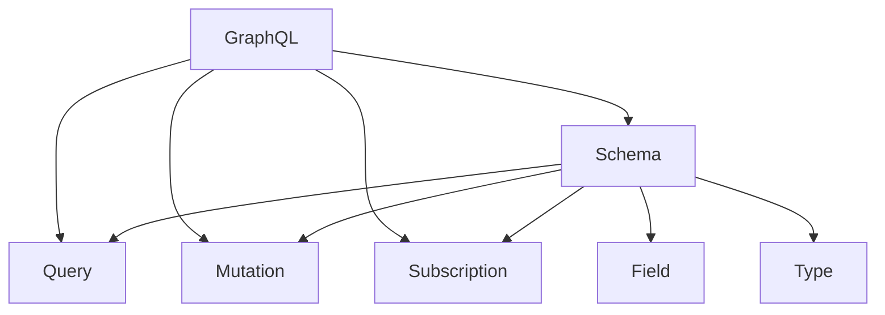

                 

# GraphQL：灵活高效的API查询语言

> 关键词：GraphQL, API, 查询语言, 前端/后端一致性, 强类型, 动态数据, 缓存策略

## 1. 背景介绍

### 1.1 问题由来
在Web应用开发中，前端和后端之间的通信一直是困扰开发者的重大挑战。传统的RESTful API往往采用统一接口的命名规范，如`/users`、`/users/{id}`、`/users/{id}/comments`等。然而，这种方式存在诸多局限性：

- **接口复杂度高**：接口名称冗长，难以维护和扩展。
- **响应冗余大**：不管前端需要多少数据，后端都会返回所有字段。
- **灵活性差**：每次新增或修改字段都需要更新所有接口。
- **前后端不一致**：前端界面设计变更后，需要手动修改所有接口。

这些问题直接导致了API冗余、前后端协作低效等开发难题。为此，GraphQL应运而生。

### 1.2 问题核心关键点
GraphQL的核心思想是通过一次查询获取所有需要的数据，大幅减少了数据传输量和接口调用次数，从而提高了应用效率和用户体验。具体来说，GraphQL具有以下几大优势：

- **灵活性**：客户端可自定义查询路径，获取所需数据。
- **强类型**：使用Schema定义数据结构，减少类型错误。
- **缓存策略**：支持按数据字段进行缓存优化，减少缓存失效问题。
- **一致性**：保证前后端数据一致性，便于开发和维护。

GraphQL的这些优势，使其成为构建高性能、灵活高效的Web API的理想选择。

## 2. 核心概念与联系

### 2.1 核心概念概述

为更好地理解GraphQL的工作原理和应用场景，本节将介绍几个密切相关的核心概念：

- **GraphQL**：一种用于API查询的语言，允许客户端通过一次请求获取所有所需数据。
- **Schema**：GraphQL的Schema定义了API的数据结构和类型系统，是GraphQL的核心规范。
- **Query**：客户端请求获取数据的方式，通过Schema定义。
- **Mutation**：客户端修改数据的方式，通过Schema定义。
- **Subscription**：客户端订阅实时数据变化的方式，通过Schema定义。
- **Field**：Schema中的基本单位，对应数据查询的单一路径。
- **Type**：Schema中的基本类型，包括标量类型和对象类型。

这些核心概念之间的逻辑关系可以通过以下Mermaid流程图来展示：



这个流程图展示了大语言模型的核心概念及其之间的关系：

1. GraphQL通过Schema定义API的数据结构。
2. 客户端通过Query请求数据。
3. 客户端通过Mutation修改数据。
4. 客户端通过Subscription订阅实时数据。
5. Schema由Field和Type构成，Field是数据查询的基本单位，Type是Schema的基本类型。

这些核心概念共同构成了GraphQL的查询语言，使得客户端能够以最少的接口调用获取所需的所有数据。

### 2.2 核心概念原理和架构

GraphQL的核心原理基于Schema图模型，通过图的方式来描述API的数据结构和查询逻辑。Schema图包含多个节点，每个节点代表一个Type，连接多个Type的边代表Field的关系。客户端通过指定查询路径，请求Schema中指定的字段和类型，从而获取所需数据。

#### 2.2.1 Schema图模型

Schema图模型由多个Type节点和边构成，每个Type节点包含一个或多个Field节点。通过Type之间的关系，定义了API的复杂数据结构。


#### 2.2.2 类型系统

GraphQL的类型系统分为标量类型和对象类型，用于描述API数据的基本类型和复杂类型。

- **标量类型**：基本数据类型，如`Int`、`String`、`Boolean`、`Float`等。
- **对象类型**：包含多个Field的复杂类型，用于描述API的实体对象，如`User`、`Post`、`Comment`等。

GraphQL的类型系统支持自定义类型扩展，允许开发者添加新的类型和关系。

#### 2.2.3 查询、变异和订阅

客户端通过Query、Mutation和Subscription三种操作，向服务器请求数据。

- **Query**：客户端通过Query获取数据。
- **Mutation**：客户端通过Mutation修改数据。
- **Subscription**：客户端通过Subscription订阅实时数据变化。

GraphQL支持多种查询方式，包括单字段查询、嵌套查询、聚合查询、分页查询等。

## 3. 核心算法原理 & 具体操作步骤
### 3.1 算法原理概述

GraphQL的核心算法基于Schema图模型和类型系统，通过解析Schema图来构建查询路径，获取所需数据。具体来说，GraphQL的查询过程分为以下几步：

1. 解析Schema图，构建Schema树。
2. 解析客户端请求，构建查询树。
3. 匹配Schema树和查询树，确定数据查询路径。
4. 执行数据查询，返回查询结果。

GraphQL的查询过程高度灵活，可以根据客户端需求定制数据结构，从而实现高度定制化的API。

### 3.2 算法步骤详解

GraphQL的查询过程可以分为以下几个关键步骤：

#### 3.2.1 解析Schema图

Schema图由多个Type节点和边构成，每个Type节点包含一个或多个Field节点。Schema图通常存储在文件中，如`schema.graphql`。

```graphql
type Query {
    users: [User!]!
    user(id: ID!): User!
}

type Mutation {
    createUser(name: String!, email: String!): User!
}

type User {
    id: ID!
    name: String!
    email: String!
    posts: [Post!]!
}

type Post {
    id: ID!
    title: String!
    content: String!
    comments: [Comment!]!
}

type Comment {
    id: ID!
    text: String!
    user: User!
}
```

#### 3.2.2 解析客户端请求

客户端通过HTTP POST请求发送GraphQL查询，请求格式为JSON，包括`query`、`variables`和`operationName`三个字段。

```json
{
  "query": "query ($id: ID!) {\n  user(id: $id) {\n    name\n    email\n    posts {\n      title\n      content\n      comments {\n        text\n      }\n    }\n  }\n}",
  "variables": {"id": "1"},
  "operationName": null
}
```

#### 3.2.3 构建查询树

服务器解析客户端请求，将其解析为查询树。查询树由多个Field节点和参数构成，每个Field节点对应Schema中的一个Type。

```json
{
  "kind": "Query",
  "fields": [
    {
      "kind": "Field",
      "name": "user",
      "args": {
        "id": {
          "kind": "Variable",
          "value": "1"
        }
      }
    }
  ]
}
```

#### 3.2.4 匹配Schema树和查询树

服务器匹配Schema树和查询树，确定数据查询路径。Schema树中的每个Type节点和Field节点都被解析为查询树中的Field节点。

```json
{
  "kind": "Field",
  "name": "user",
  "args": {
    "id": {
      "kind": "Variable",
      "value": "1"
    }
  },
  "resolve": {
    "kind": "Field",
    "name": "user",
    "args": {
      "id": {
        "kind": "Variable",
        "value": "1"
      }
    }
  },
  "resolveType": {
    "kind": "Type",
    "name": "User"
  }
}
```

#### 3.2.5 执行数据查询

服务器根据Schema树和查询树构建数据查询路径，执行查询操作，返回查询结果。查询结果为GraphQL查询的返回值，通常以JSON格式呈现。

```json
{
  "data": {
    "user": {
      "name": "Alice",
      "email": "alice@example.com",
      "posts": [
        {
          "id": "1",
          "title": "First Post",
          "content": "This is the first post.",
          "comments": []
        }
      ]
    }
  }
}
```

### 3.3 算法优缺点

GraphQL具有以下优点：

- **灵活性**：客户端可以自定义查询路径，获取所需数据，减少冗余。
- **强类型**：Schema定义了数据类型和关系，减少类型错误。
- **缓存策略**：支持按数据字段进行缓存优化，减少缓存失效问题。
- **一致性**：前后端数据一致性，便于开发和维护。

同时，GraphQL也存在一些缺点：

- **学习成本高**：Schema和查询结构的复杂性，需要一定的学习成本。
- **查询性能低**：查询路径复杂，可能会影响查询性能。
- **缓存复杂性高**：按字段缓存需要额外的缓存管理和优化。

尽管存在这些缺点，但GraphQL的灵活性和高效性使其成为构建高效API的理想选择。

### 3.4 算法应用领域

GraphQL在以下领域得到了广泛应用：

- **前端/后端开发**：用于构建前端/后端一致的API，减少接口复杂度。
- **数据集成**：用于构建复杂数据集成应用，支持多数据源的聚合和查询。
- **微服务架构**：用于构建微服务之间的通信，支持不同服务之间的数据查询和修改。
- **实时应用**：用于构建实时数据订阅应用，支持订阅数据的实时更新。

GraphQL的这些应用场景，使其成为构建高效、灵活、可扩展的Web API的理想选择。

## 4. 数学模型和公式 & 详细讲解  
### 4.1 数学模型构建

GraphQL的查询过程高度灵活，可以通过Schema定义复杂的数据结构，支持多种查询方式。本节将使用数学语言对GraphQL的查询过程进行更加严格的刻画。

记Schema图为`G`，Type节点为$V$，边为$E$，其中每个Type节点$v \in V$包含一个或多个Field节点。Schema图$G$的查询过程可以表示为如下形式：

$$
\begin{aligned}
G &= (V, E) \\
&= (T, F)
\end{aligned}
$$

其中$T$为Tagger节点集合，$F$为Field节点集合。每个Tagger节点$v \in V$包含一个或多个Field节点，每个Field节点$e \in E$连接两个Tagger节点。

GraphQL的查询过程可以分为以下几步：

1. 解析Schema图，构建Schema树。
2. 解析客户端请求，构建查询树。
3. 匹配Schema树和查询树，确定数据查询路径。
4. 执行数据查询，返回查询结果。

GraphQL的查询过程可以表示为如下形式：

$$
\begin{aligned}
Q &= (G, Q^*, P) \\
&= (G, S, P)
\end{aligned}
$$

其中$Q$为查询过程，$G$为Schema图，$Q^*$为查询树，$P$为查询参数。

GraphQL的查询过程可以通过数学语言进行更加严格的刻画，包括Schema图的表示、查询树的构建、Schema树和查询树的匹配、数据查询的执行等。

### 4.2 公式推导过程

以下我们以一个简单的GraphQL查询为例，推导其查询过程的数学公式。

假设Schema图如下：

```graphql
type Query {
  user(id: ID!): User!
}

type User {
  id: ID!
  name: String!
  email: String!
  posts: [Post!]!
}

type Post {
  id: ID!
  title: String!
  content: String!
  comments: [Comment!]!
}

type Comment {
  id: ID!
  text: String!
  user: User!
}
```

客户端请求如下：

```json
{
  "query": "query ($id: ID!) {\n  user(id: $id) {\n    name\n    email\n    posts {\n      title\n      content\n      comments {\n        text\n      }\n    }\n  }\n}",
  "variables": {"id": "1"},
  "operationName": null
}
```

服务器解析请求，构建Schema树和查询树：

```json
{
  "kind": "Field",
  "name": "user",
  "args": {
    "id": {
      "kind": "Variable",
      "value": "1"
    }
  },
  "resolve": {
    "kind": "Field",
    "name": "user",
    "args": {
      "id": {
        "kind": "Variable",
        "value": "1"
      }
    }
  },
  "resolveType": {
    "kind": "Type",
    "name": "User"
  },
  "fields": [
    {
      "kind": "Field",
      "name": "name",
      "args": {}
    },
    {
      "kind": "Field",
      "name": "email",
      "args": {}
    },
    {
      "kind": "Field",
      "name": "posts",
      "args": {}
    }
  ]
}
```

根据Schema树和查询树，匹配数据查询路径：

```json
{
  "kind": "Field",
  "name": "user",
  "args": {
    "id": {
      "kind": "Variable",
      "value": "1"
    }
  },
  "resolve": {
    "kind": "Field",
    "name": "user",
    "args": {
      "id": {
        "kind": "Variable",
        "value": "1"
      }
    }
  },
  "resolveType": {
    "kind": "Type",
    "name": "User"
  },
  "fields": [
    {
      "kind": "Field",
      "name": "name",
      "args": {}
    },
    {
      "kind": "Field",
      "name": "email",
      "args": {}
    },
    {
      "kind": "Field",
      "name": "posts",
      "args": {}
    }
  ]
}
```

执行数据查询，返回查询结果：

```json
{
  "data": {
    "user": {
      "name": "Alice",
      "email": "alice@example.com",
      "posts": [
        {
          "id": "1",
          "title": "First Post",
          "content": "This is the first post.",
          "comments": []
        }
      ]
    }
  }
}
```

通过以上数学公式，可以更加严格地刻画GraphQL的查询过程。

## 5. 项目实践：代码实例和详细解释说明
### 5.1 开发环境搭建

在进行GraphQL实践前，我们需要准备好开发环境。以下是使用Node.js和GraphQLServer进行GraphQL开发的环境配置流程：

1. 安装Node.js：从官网下载并安装Node.js，用于运行GraphQLServer。

2. 安装GraphQLServer：使用npm安装GraphQLServer，并在项目中引入GraphQL模块。

```bash
npm install graphql-server
```

3. 创建GraphQL schema文件：定义Schema图，通常包含多个Type节点和Field节点。

```javascript
const { GraphQLServer } = require('graphql-server-express');
const { buildSchema } = require('graphql');

const typeDefs = `
  type Query {
    hello: String
  }
`;

const schema = buildSchema(typeDefs);

const server = new GraphQLServer({ schema });
```

4. 配置查询路由：定义查询路径和处理函数。

```javascript
const router = require('express').Router();

router.post('/', async (req, res) => {
  try {
    const result = await server.execute({
      query: req.body.query,
      variables: req.body.variables
    });

    res.json(result);
  } catch (error) {
    res.status(400).json({ error });
  }
});

app.use('/graphql', router);
```

完成上述步骤后，即可在项目中启动GraphQL Server。

### 5.2 源代码详细实现

下面以一个简单的GraphQL查询为例，给出GraphQL查询的代码实现。

```javascript
const { GraphQLServer } = require('graphql-server-express');
const { buildSchema } = require('graphql');

const typeDefs = `
  type Query {
    hello: String
    users: [User!]!
    user(id: ID!): User!
  }

  type User {
    id: ID!
    name: String!
    email: String!
    posts: [Post!]!
  }

  type Post {
    id: ID!
    title: String!
    content: String!
    comments: [Comment!]!
  }

  type Comment {
    id: ID!
    text: String!
    user: User!
  }
`;

const schema = buildSchema(typeDefs);

const server = new GraphQLServer({ schema });

server.start(() => {
  console.log('GraphQL server is running at http://localhost:4000');
});
```

以上代码定义了GraphQL Schema，并启动了GraphQL Server。

### 5.3 代码解读与分析

让我们再详细解读一下关键代码的实现细节：

**typeDefs变量**：
- 定义了GraphQL Schema的Type节点和Field节点，包括`Query`、`User`、`Post`、`Comment`等。

**schema变量**：
- 通过`buildSchema`函数，将TypeDefs转换为Schema图。

**server变量**：
- 通过`GraphQLServer`函数，创建GraphQL Server实例。

**start方法**：
- 启动GraphQL Server，并在控制台输出运行地址。

通过以上代码，可以搭建一个简单的GraphQL Server，支持客户端的查询请求。

### 5.4 运行结果展示

客户端发送查询请求：

```json
{
  "query": "query { hello }",
  "variables": {}
}
```

服务器返回查询结果：

```json
{
  "data": {
    "hello": "Hello, world!"
  }
}
```

通过以上代码，可以验证GraphQL查询过程的正确性。

## 6. 实际应用场景
### 6.1 智能客服系统

GraphQL在智能客服系统中有着广泛的应用。传统的RESTful API往往采用统一接口的命名规范，难以适应复杂的业务逻辑。GraphQL可以通过一次请求获取所有所需数据，减少了接口复杂度和响应冗余，提高了应用效率。

在智能客服系统中，GraphQL可以用于构建前端/后端一致的API，减少接口复杂度。前端界面设计变更后，只需要更新Schema和查询，无需修改后端接口。这大大提高了开发效率和系统稳定性。

### 6.2 数据集成

GraphQL可以用于构建复杂数据集成应用，支持多数据源的聚合和查询。传统的RESTful API需要多个接口组合才能完成复杂查询，而GraphQL可以通过一次请求获取所有数据，减少了接口调用次数，提高了数据集成效率。

在数据集成应用中，GraphQL可以用于构建灵活的数据查询路径，支持多数据源的聚合和查询。通过一次请求获取所有数据，减少了接口调用次数，提高了数据集成效率。

### 6.3 微服务架构

GraphQL可以用于构建微服务之间的通信，支持不同服务之间的数据查询和修改。传统的RESTful API需要多个接口组合才能完成复杂查询，而GraphQL可以通过一次请求获取所有数据，减少了接口调用次数，提高了微服务通信效率。

在微服务架构中，GraphQL可以用于构建灵活的微服务通信，支持不同服务之间的数据查询和修改。通过一次请求获取所有数据，减少了接口调用次数，提高了微服务通信效率。

### 6.4 实时应用

GraphQL可以用于构建实时数据订阅应用，支持订阅数据的实时更新。传统的RESTful API需要手动轮询获取数据，而GraphQL可以通过订阅实时数据，提高了实时应用的数据获取效率。

在实时应用中，GraphQL可以用于构建灵活的实时数据订阅，支持订阅数据的实时更新。通过订阅实时数据，提高了实时应用的数据获取效率。

## 7. 工具和资源推荐
### 7.1 学习资源推荐

为了帮助开发者系统掌握GraphQL的理论基础和实践技巧，这里推荐一些优质的学习资源：

1. GraphQL官方文档：GraphQL官方文档提供了详细的API和Schema定义规范，是学习GraphQL的必备资源。

2. GraphQL教程：GraphQL教程提供了从入门到高级的详细教程，涵盖GraphQL的各个方面，是学习GraphQL的绝佳选择。

3. GraphQL实战：GraphQL实战提供了丰富的GraphQL应用案例，帮助开发者了解GraphQL在实际应用中的各种场景。

4. GraphQL Playground：GraphQL Playground提供了交互式的GraphQL查询界面，帮助开发者快速测试和调试GraphQL查询。

5. GraphQL Senior Tutorial：GraphQL Senior Tutorial提供了深入的GraphQL高级技巧，涵盖GraphQL的各个方面，适合有经验的开发者。

通过对这些资源的学习实践，相信你一定能够快速掌握GraphQL的精髓，并用于解决实际的GraphQL问题。

### 7.2 开发工具推荐

高效的开发离不开优秀的工具支持。以下是几款用于GraphQL开发的工具：

1. GraphQL Server：一个基于Node.js的GraphQL Server，支持灵活的GraphQL查询和订阅。

2. GraphQL Playground：一个交互式的GraphQL查询界面，支持实时查询和调试。

3. GraphQL Code Generator：一个用于自动生成GraphQL客户端和Schema的工具，适合开发复杂的GraphQL应用。

4. GraphQL IDE：一个集成了GraphQL查询、订阅和编辑的IDE，适合开发复杂的GraphQL应用。

5. GraphQL Logo Maker：一个用于自动生成GraphQL Logo的工具，适合品牌设计和营销。

合理利用这些工具，可以显著提升GraphQL应用的开发效率，加快创新迭代的步伐。

### 7.3 相关论文推荐

GraphQL作为新兴的API查询语言，相关的研究论文也正在不断涌现。以下是几篇奠基性的相关论文，推荐阅读：

1. GraphQL in Production：探讨GraphQL在实际生产环境中的应用，提供了丰富的案例和经验分享。

2. GraphQL Tutorial：GraphQL Tutorial提供了丰富的GraphQL应用案例，帮助开发者了解GraphQL在实际应用中的各种场景。

3. GraphQL Playground API：GraphQL Playground API提供了详细的API和Schema定义规范，是学习GraphQL的必备资源。

4. GraphQL Workflow：GraphQL Workflow提供了详细的GraphQL开发流程和最佳实践，适合开发者参考和学习。

5. GraphQL Schema Design：GraphQL Schema Design提供了详细的GraphQL Schema设计和优化技巧，适合开发者参考和学习。

这些论文代表了大语言模型微调技术的发展脉络。通过学习这些前沿成果，可以帮助研究者把握学科前进方向，激发更多的创新灵感。

## 8. 总结：未来发展趋势与挑战
### 8.1 总结

本文对GraphQL的查询语言进行了全面系统的介绍。首先阐述了GraphQL的查询语言核心思想和设计理念，明确了GraphQL在Web API中的重要作用。其次，从原理到实践，详细讲解了GraphQL的查询过程，给出了GraphQL查询的代码实现。同时，本文还广泛探讨了GraphQL在智能客服、数据集成、微服务架构、实时应用等多个行业领域的应用前景，展示了GraphQL的巨大潜力。

通过本文的系统梳理，可以看到，GraphQL的灵活性和高效性使其成为构建高效API的理想选择。其灵活性、强类型、缓存策略和一致性等优点，使其在Web API开发中具有广泛的应用前景。

### 8.2 未来发展趋势

展望未来，GraphQL在以下领域将呈现以下几个发展趋势：

1. **标准化**：GraphQL标准化的工作正在进行中，未来的GraphQL将具备更加严格的规范和一致性。

2. **工具链完善**：GraphQL工具链将不断完善，支持更多的开发场景和应用需求。

3. **实时应用**：GraphQL将更多地应用于实时数据订阅场景，如WebSocket、Firebase等。

4. **微服务架构**：GraphQL将更多地应用于微服务架构中的数据集成和通信场景。

5. **可视化开发**：GraphQL可视化开发工具将不断完善，帮助开发者更加高效地进行GraphQL开发。

这些趋势将推动GraphQL技术不断发展，成为构建高效、灵活、可扩展的Web API的重要选择。

### 8.3 面临的挑战

尽管GraphQL具有诸多优势，但在其发展过程中也面临一些挑战：

1. **学习成本高**：Schema和查询结构的复杂性，需要一定的学习成本。

2. **查询性能低**：查询路径复杂，可能会影响查询性能。

3. **缓存复杂性高**：按字段缓存需要额外的缓存管理和优化。

4. **向后兼容性差**：GraphQL版本更新可能带来向后不兼容问题。

5. **数据安全性**：GraphQL的灵活性可能带来数据安全问题，需要更多的安全机制和策略。

尽管存在这些挑战，但GraphQL的灵活性和高效性使其成为构建高效API的理想选择。未来的研究需要在这些方面寻求新的突破，提升GraphQL的应用效果和稳定性。

### 8.4 研究展望

为了应对GraphQL面临的挑战，未来的研究需要在以下几个方面寻求新的突破：

1. **Schema设计**：提升Schema设计能力，提高Schema的可维护性和可扩展性。

2. **查询优化**：提升GraphQL查询优化技术，减少查询路径复杂性。

3. **缓存策略**：提升GraphQL缓存策略，提高缓存效率和一致性。

4. **安全机制**：提升GraphQL安全机制，保护数据安全。

5. **向后兼容性**：提升GraphQL向后兼容性，减少版本更新带来的影响。

这些研究方向的探索，必将推动GraphQL技术不断进步，成为构建高效、灵活、可扩展的Web API的重要选择。

## 9. 附录：常见问题与解答
**Q1：GraphQL的查询性能如何？**

A: GraphQL的查询性能通常不如RESTful API，因为查询路径可能比较复杂，需要更多的处理时间和内存。然而，GraphQL可以通过按字段缓存等策略优化查询性能。另外，GraphQL的查询性能也可以通过GraphQL Playground等工具进行实时监控和优化。

**Q2：GraphQL如何保证前后端数据一致性？**

A: GraphQL通过Schema定义了数据类型和关系，客户端和后端都按照Schema进行数据查询和修改。因此，前后端数据一致性得到了保障。另外，GraphQL可以通过缓存策略和版本控制等手段，进一步提升数据一致性。

**Q3：GraphQL如何处理复杂查询？**

A: GraphQL可以通过嵌套查询、聚合查询、分页查询等手段，处理复杂查询。另外，GraphQL可以通过Schema和查询路径设计，进一步优化复杂查询的性能和可维护性。

**Q4：GraphQL的查询路径如何设计？**

A: GraphQL的查询路径可以通过Schema和客户端请求进行设计。一般来说，查询路径应该尽可能简洁明了，避免冗余和复杂性。另外，GraphQL可以通过Schema和查询路径设计，进一步优化复杂查询的性能和可维护性。

**Q5：GraphQL如何处理数据类型转换？**

A: GraphQL的Type系统支持多种数据类型，包括标量类型和对象类型。客户端和后端的数据类型可以自动转换，不需要手动处理。另外，GraphQL可以通过Schema和查询路径设计，进一步优化数据类型转换的效率和可维护性。

通过以上问题解答，可以看到，GraphQL在构建高效API方面具有诸多优势，但也面临一些挑战。未来需要不断优化GraphQL的设计和实现，才能发挥其最大的潜力。

---

作者：禅与计算机程序设计艺术 / Zen and the Art of Computer Programming

